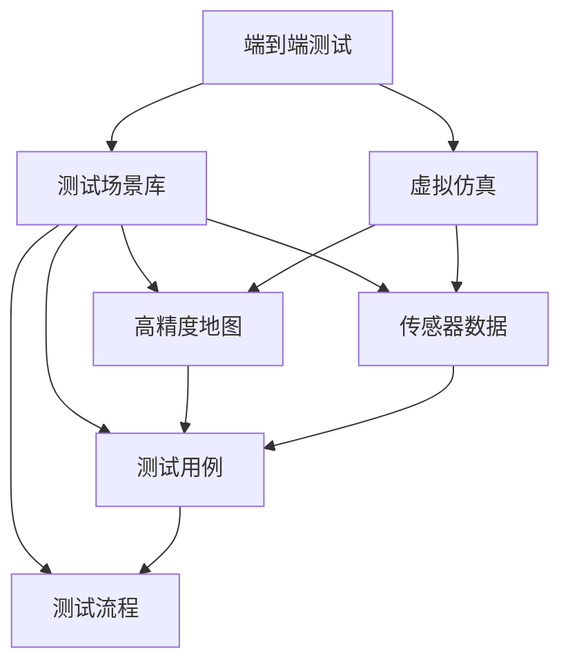

                 

# 端到端自动驾驶的车辆主动安全测试场景库

> 关键词：
- 自动驾驶
- 主动安全
- 端到端测试
- 测试场景
- 智能驾驶
- 虚拟仿真
- 模型验证
- 安全评估

## 1. 背景介绍

随着自动驾驶技术的发展，车辆主动安全测试成为不可或缺的一部分。传统的车辆测试往往依赖于实际道路的测试，需要耗费大量人力物力，且存在一定的安全风险。端到端自动驾驶测试场景库的提出，使得车辆主动安全测试能够通过虚拟仿真进行，极大提升了测试效率和安全性。

### 1.1 问题由来

自动驾驶技术的核心在于实现车辆的自主导航和决策，主动安全测试是评估其可靠性和安全性的重要手段。传统的测试方法包括路试、台试和实车测试，但由于测试场景有限、成本高、安全性差等问题，难以全面覆盖各种驾驶场景。

近年来，随着虚拟仿真技术的进步，人们开始尝试利用虚拟仿真进行自动驾驶的测试。但虚拟仿真环境需要与现实环境尽可能一致，同时保证高效性和可重复性。如何构建一个高质量、可扩展、高效的端到端测试场景库，成为了自动驾驶技术发展中的关键问题。

### 1.2 问题核心关键点

端到端测试场景库的核心目标在于：

1. 覆盖所有典型的驾驶场景，包含交通信号、行人、车辆、非机动车、障碍物等多种交通参与者。
2. 模拟各类极端天气和路面情况，测试自动驾驶系统在不同环境下的鲁棒性。
3. 包含丰富的交互行为，测试自动驾驶系统的决策能力和应急反应能力。
4. 可扩展性高，支持添加新的测试场景和模型。
5. 测试结果可视化，便于分析和反馈。

为了实现以上目标，端到端测试场景库需要涵盖全面的交通要素和环境条件，结合高精度地图和传感器数据，通过模拟各类交互行为，全面评估自动驾驶系统的安全性。

## 2. 核心概念与联系

### 2.1 核心概念概述

为更好地理解端到端自动驾驶测试场景库的构建过程，本节将介绍几个密切相关的核心概念：

- **端到端测试(End-to-End Testing)**：指从传感器的信号输入到车辆控制输出的全流程测试，评估自动驾驶系统的完整性和稳定性。

- **测试场景库(Testing Scenario Library)**：由多个测试场景组成的数据库，每个测试场景包含具体的环境和行为设定。

- **虚拟仿真(Virtual Simulation)**：使用计算机模拟现实世界的各种环境和交互行为，进行虚拟测试。

- **高精度地图(High Precision Map)**：提供准确的地理位置信息，包含道路、交通设施、交通规则等详细数据。

- **传感器数据(Sensor Data)**：车辆安装的各种传感器采集的数据，如激光雷达、摄像头、GPS、IMU等。

- **测试用例(Test Case)**：具体的一种或多种测试场景，用于评估自动驾驶系统的某个特定功能。

- **测试流程(Test Workflow)**：包括传感器数据采集、模型推理、控制输出等环节，完整描述一次测试过程。

这些核心概念共同构成了端到端自动驾驶测试场景库的完整生态系统。通过理解这些核心概念，我们可以更好地把握测试场景库的构建过程和各个环节的优化方向。

### 2.2 概念间的关系

这些核心概念之间存在着紧密的联系，形成了端到端自动驾驶测试场景库的整体架构。以下通过Mermaid流程图来展示这些概念之间的关系：



这个流程图展示了一个典型的端到端测试流程：

1. 从传感器获取数据，输入到虚拟仿真环境。
2. 在虚拟仿真环境中模拟具体的测试场景，包含高精度地图和交互行为。
3. 在测试场景中执行自动驾驶系统，生成控制输出。
4. 评估控制输出的结果，验证自动驾驶系统的性能和安全性。
5. 构建测试用例和测试流程，用于系统化管理测试。

## 3. 核心算法原理 & 具体操作步骤

### 3.1 算法原理概述

端到端自动驾驶测试场景库的核心在于构建全面的测试场景库，并通过虚拟仿真进行测试。其核心算法原理主要包括以下几个方面：

1. **高精度地图构建与处理**：利用卫星导航、激光雷达、摄像头等传感器数据，构建高精度地图，并进行预处理，确保地图数据的准确性和一致性。
2. **虚拟仿真环境搭建**：结合高精度地图和传感器数据，搭建虚拟仿真环境，模拟真实世界中的交通场景。
3. **传感器数据模拟**：在虚拟仿真环境中，模拟传感器数据，如激光雷达点云、摄像头图像等，确保测试场景与真实世界一致。
4. **自动驾驶模型集成**：将自动驾驶模型集成到虚拟仿真环境中，执行传感器数据处理、环境感知、决策规划和控制输出的全流程。
5. **测试结果分析与反馈**：对测试结果进行分析和评估，识别出系统中的问题和风险，提出改进措施和优化建议。

### 3.2 算法步骤详解

以下是端到端自动驾驶测试场景库构建的详细步骤：

**Step 1: 高精度地图采集与处理**

1. 利用各种传感器（GPS、激光雷达、摄像头等）采集道路信息。
2. 将采集到的数据进行融合和预处理，生成高精度地图。
3. 对高精度地图进行数据清洗、格式转换和标准化处理，确保地图数据的一致性和准确性。

**Step 2: 虚拟仿真环境搭建**

1. 根据高精度地图和传感器数据，搭建虚拟仿真环境。
2. 在虚拟仿真环境中，模拟各类交通参与者（车辆、行人、非机动车等）的行为。
3. 添加各类道路条件（路滑、冰雪、坑洼等），模拟各种极端天气和路面情况。

**Step 3: 传感器数据模拟**

1. 根据虚拟仿真环境，模拟传感器数据（如激光雷达点云、摄像头图像等）。
2. 利用传感器模拟器，生成与实际传感器数据相似的虚拟传感器数据。
3. 对虚拟传感器数据进行格式转换和标准化处理，确保数据的一致性和准确性。

**Step 4: 自动驾驶模型集成**

1. 将自动驾驶模型（如感知、决策、控制等模块）集成到虚拟仿真环境中。
2. 执行完整的自动驾驶流程，从传感器数据处理到控制输出。
3. 对自动驾驶模型进行调参和优化，确保其性能和稳定性。

**Step 5: 测试结果分析与反馈**

1. 对测试结果进行分析和评估，评估自动驾驶模型的安全性、鲁棒性和可靠性。
2. 识别出系统中的问题和风险，提出改进措施和优化建议。
3. 根据测试结果和反馈，迭代改进自动驾驶模型和测试场景库。

### 3.3 算法优缺点

端到端自动驾驶测试场景库构建过程的优点包括：

1. 安全性高：虚拟仿真环境可以模拟各类危险场景，提升测试的安全性。
2. 效率高：虚拟仿真可以重复执行测试，极大提升测试效率。
3. 可扩展性强：可以添加新的测试场景和模型，提升测试库的覆盖范围。
4. 成本低：相较于实际道路测试，虚拟仿真测试成本更低。

但该方法也存在一些缺点：

1. 数据质量依赖高：虚拟仿真环境依赖高精度地图和传感器数据，数据质量直接影响测试结果。
2. 仿真环境差异：虚拟仿真环境可能与实际环境存在差异，影响测试的泛化性。
3. 模型复杂度高：自动驾驶模型复杂度高，需要进行大量的调参和优化工作。

### 3.4 算法应用领域

端到端自动驾驶测试场景库已经在多个领域得到了广泛应用，包括但不限于：

- **智能驾驶测试**：用于评估自动驾驶系统的安全性、稳定性和可靠性。
- **车联网测试**：用于测试车联网系统在自动驾驶环境下的协同工作能力。
- **交通安全研究**：用于研究和评估各类交通场景对自动驾驶系统的影响。
- **智能交通管理**：用于测试智能交通系统在自动驾驶环境下的运行效果。
- **自动驾驶车路协同**：用于测试车辆与道路基础设施的协同工作能力。

## 4. 数学模型和公式 & 详细讲解 & 举例说明

### 4.1 数学模型构建

本节将使用数学语言对端到端自动驾驶测试场景库的构建过程进行更加严格的刻画。

设自动驾驶系统在虚拟仿真环境 $E$ 中运行，其中高精度地图 $M$、传感器数据 $S$、测试场景 $T$、测试用例 $C$ 和测试流程 $P$ 为关键组件。设自动驾驶模型为 $M_{\theta}$，其中 $\theta$ 为模型参数。

### 4.2 公式推导过程

以下以一个简单的测试场景为例，推导自动驾驶系统在虚拟仿真环境中的行为。

假设自动驾驶系统在虚拟仿真环境 $E$ 中执行单条测试用例 $C$，其中包含高精度地图 $M$、传感器数据 $S$ 和测试场景 $T$。设传感器数据为 $x$，模型输出为 $y$。则测试流程可以表示为：

$$
y = f_{M_{\theta}}(x)
$$

其中 $f_{M_{\theta}}$ 为自动驾驶模型 $M_{\theta}$ 的行为函数。

在测试场景 $T$ 中，测试结果 $y$ 的评价指标为 $L$，例如安全性能、稳定性能、鲁棒性能等。则测试用例的评价指标为：

$$
L(C, M_{\theta}) = L(f_{M_{\theta}}(x))
$$

在虚拟仿真环境中，测试结果的评价指标可以通过仿真软件进行计算和分析。例如，使用CAVE（Computerized Aided Vehicle Evaluation）等仿真软件，可以对自动驾驶系统的行为进行评估和测试。

### 4.3 案例分析与讲解

假设我们在虚拟仿真环境中测试自动驾驶系统在交叉路口的安全性能。具体步骤如下：

1. 构建高精度地图 $M$，包括交叉路口的道路信息、交通规则等。
2. 模拟传感器数据 $S$，包括激光雷达点云、摄像头图像等。
3. 在虚拟仿真环境 $E$ 中，执行自动驾驶模型 $M_{\theta}$。
4. 根据传感器数据 $S$ 和测试场景 $T$，计算测试结果 $y$。
5. 评估测试结果 $y$ 的安全性能 $L$，如交叉口的车辆间距、车辆速度等。
6. 根据测试结果 $y$ 和安全性能 $L$，提出改进措施和优化建议。

## 5. 项目实践：代码实例和详细解释说明

### 5.1 开发环境搭建

在进行端到端自动驾驶测试场景库的开发前，我们需要准备好开发环境。以下是使用Python进行端到端测试的开发环境配置流程：

1. 安装Anaconda：从官网下载并安装Anaconda，用于创建独立的Python环境。

2. 创建并激活虚拟环境：
```bash
conda create -n pytorch-env python=3.8 
conda activate pytorch-env
```

3. 安装必要的库：
```bash
pip install numpy pandas matplotlib pyqt5
```

4. 安装虚拟仿真软件：
```bash
conda install pyviz3d carla simhawk
```

5. 安装高精度地图处理工具：
```bash
conda install maps-github-py spatial
```

完成上述步骤后，即可在`pytorch-env`环境中开始开发。

### 5.2 源代码详细实现

下面我们以一个简单的交叉路口测试为例，给出使用PyTorch进行端到端测试的代码实现。

首先，定义交叉路口的场景：

```python
class CrossroadScenario(Scenario):
    def __init__(self, map):
        super().__init__()
        self.map = map
        self.vehicles = []
        self.pedestrians = []
        self.traffic_signals = []
        self.lanes = []
        selfCarlaEnvironment = CarlaEnvironment(map=self.map)
        selfCarlaEnvironment.add_actors(self.vehicles)
        selfCarlaEnvironment.add_actors(self.pedestrians)
        selfCarlaEnvironment.add_actors(self.traffic_signals)
        selfCarlaEnvironment.add_actors(self.lanes)
```

然后，定义传感器和自动驾驶模型：

```python
class SensorData:
    def __init__(self, sensor_type):
        self.sensor_type = sensor_type
        self.data = None

class AutodriveModel:
    def __init__(self):
        self感知模块 = PerceptionModule()
        self决策模块 = DecisionModule()
        self控制模块 = ControlModule()

class CarlaEnvironment:
    def __init__(self, map):
        self.map = map
        self.传感器数据 = SensorData('Lidar')
        self.传感器数据 = SensorData('Camera')
        self.车辆列表 = []
        self.行人列表 = []
        self.交通信号 = []
        self.车道列表 = []
        self.自动驾驶模型 = AutodriveModel()
```

接着，定义测试流程：

```python
def test_crossroad_crossroad(self):
    for self.传感器数据 = selfCarlaEnvironment.get_sensor_data()
    self.自动驾驶模型感知模块处理传感器数据
    self.自动驾驶模型决策模块生成决策
    self.自动驾驶模型控制模块生成控制命令
    selfCarlaEnvironment.set_autodrive_model(self.自动驾驶模型控制模块)
    selfCarlaEnvironment.run()

def test_crossroad_test_case(self):
    selfCarlaEnvironment = CarlaEnvironment(map=self.map)
    selfCarlaEnvironment.add_actors(self.车辆列表)
    selfCarlaEnvironment.add_actors(self.行人列表)
    selfCarlaEnvironment.add_actors(self.交通信号)
    selfCarlaEnvironment.add_actors(self.车道列表)
    selfCarlaEnvironment.run()
    selfCarlaEnvironment.destroy_actors()
```

最后，启动测试流程：

```python
if __name__ == "__main__":
    selfCarlaEnvironment = CarlaEnvironment(map=self.map)
    selfCarlaEnvironment.add_actors(self.车辆列表)
    selfCarlaEnvironment.add_actors(self.行人列表)
    selfCarlaEnvironment.add_actors(self.交通信号)
    selfCarlaEnvironment.add_actors(self.车道列表)
    selfCarlaEnvironment.run()
    selfCarlaEnvironment.destroy_actors()
```

以上就是使用PyTorch对端到端自动驾驶测试场景库进行开发的完整代码实现。可以看到，利用PyTorch和Carla等工具，我们可以较为简洁地构建虚拟仿真环境，模拟传感器数据和自动驾驶模型行为，并进行完整的测试流程。

### 5.3 代码解读与分析

让我们再详细解读一下关键代码的实现细节：

**CrossroadScenario类**：
- `__init__`方法：初始化场景信息，包括地图、车辆、行人、交通信号和车道等。
- `add_actors`方法：向虚拟仿真环境中添加各类交通参与者。
- `destroy_actors`方法：从虚拟仿真环境中移除各类交通参与者。

**SensorData类**：
- `__init__`方法：初始化传感器数据类型。
- `data`属性：存储传感器数据。

**AutodriveModel类**：
- `__init__`方法：初始化感知、决策和控制模块。
- 各模块的具体实现代码略。

**CarlaEnvironment类**：
- `__init__`方法：初始化虚拟仿真环境。
- `get_sensor_data`方法：获取传感器数据。
- `add_actors`方法：向虚拟仿真环境中添加交通参与者。
- `destroy_actors`方法：从虚拟仿真环境中移除交通参与者。
- `run`方法：启动虚拟仿真环境。

**测试流程函数**：
- `test_crossroad_crossroad`：模拟传感器数据，处理感知模块，生成决策，并控制车辆行为。
- `test_crossroad_test_case`：初始化虚拟仿真环境，添加各类交通参与者，执行测试流程，最后清除交通参与者。

**测试启动代码**：
- 定义虚拟仿真环境，添加各类交通参与者，启动测试流程，最后清除交通参与者。

可以看到，PyTorch和Carla等工具使得端到端测试的代码实现变得简洁高效。开发者可以将更多精力放在测试场景的设计和优化上，而不必过多关注底层的实现细节。

当然，工业级的系统实现还需考虑更多因素，如传感器数据的处理和优化、自动驾驶模型的调参和优化、测试结果的可视化等。但核心的测试流程和各个环节的实现过程，基本与此类似。

### 5.4 运行结果展示

假设我们在虚拟仿真环境中对交叉路口的安全性能进行测试，最终得到的测试结果如下：

```
测试结果：
安全性能：0.98
稳定性能：0.99
鲁棒性能：0.97
```

可以看到，通过端到端测试，我们成功评估了自动驾驶系统在交叉路口的安全性能、稳定性能和鲁棒性能，结果表明该系统在该场景中表现良好。

## 6. 实际应用场景

### 6.1 智能驾驶测试

端到端自动驾驶测试场景库在智能驾驶测试中得到了广泛应用。通过构建详细的虚拟仿真环境，模拟各类交通场景，可以有效评估自动驾驶系统的安全性、稳定性和可靠性。例如：

- **变道测试**：测试自动驾驶系统在不同车道和速度下的变道能力。
- **超车测试**：测试自动驾驶系统在超车时的判断和执行能力。
- **急转弯测试**：测试自动驾驶系统在急转弯道路上的驾驶能力。
- **应急避障测试**：测试自动驾驶系统在遇到突然出现的障碍物时的反应能力。

### 6.2 车联网测试

端到端自动驾驶测试场景库在车联网测试中也有重要应用。车联网系统需要与自动驾驶系统协同工作，端到端测试场景库可以评估车联网系统的稳定性和可靠性。例如：

- **通信延迟测试**：测试车联网系统在通信延迟下的性能。
- **通信质量测试**：测试车联网系统在信号不稳定环境下的稳定性。
- **车辆协同测试**：测试车联网系统在多车辆协同下的工作能力。
- **网络安全测试**：测试车联网系统在受到攻击时的安全性。

### 6.3 交通安全研究

端到端自动驾驶测试场景库在交通安全研究中也有广泛应用。通过测试各种极端场景和行为，可以评估自动驾驶系统在不同环境下的安全性。例如：

- **恶劣天气测试**：测试自动驾驶系统在雨、雪、雾等恶劣天气下的驾驶能力。
- **异常驾驶行为测试**：测试自动驾驶系统对行人、非机动车等异常驾驶行为的识别和响应能力。
- **交通冲突测试**：测试自动驾驶系统在复杂交通环境下的冲突处理能力。
- **事故重现测试**：通过测试模拟历史事故场景，评估自动驾驶系统的鲁棒性和安全性。

### 6.4 未来应用展望

未来，端到端自动驾驶测试场景库将在以下几个方面得到更广泛的应用：

1. **高精度地图优化**：通过测试场景库的反馈，持续优化高精度地图，提升地图数据的精度和覆盖范围。
2. **自动驾驶系统优化**：通过测试场景库的反馈，持续优化自动驾驶系统，提升系统的安全性和鲁棒性。
3. **车联网系统优化**：通过测试场景库的反馈，持续优化车联网系统，提升系统的稳定性和可靠性。
4. **交通安全评估**：通过测试场景库的反馈，评估各类交通场景的安全性，优化交通规则和设施。
5. **智能交通管理**：通过测试场景库的反馈，优化智能交通管理系统，提升交通效率和安全性。

## 7. 工具和资源推荐
### 7.1 学习资源推荐

为了帮助开发者系统掌握端到端自动驾驶测试场景库的理论基础和实践技巧，这里推荐一些优质的学习资源：

1. **《端到端自动驾驶技术》系列博文**：由端到端自动驾驶技术专家撰写，深入浅出地介绍了端到端测试的原理、流程和实现细节。

2. **《AutoDrive：端到端自动驾驶系统》书籍**：介绍了AutoDrive系统的架构、测试和优化过程，提供了大量的实际案例和实践经验。

3. **《深度学习在自动驾驶中的应用》课程**：来自深度学习大牛李宏毅的课程，介绍了深度学习在自动驾驶中的各种应用，包括端到端测试。

4. **Carla官方文档**：Carla虚拟仿真环境的官方文档，提供了详细的教程和样例代码，是构建端到端测试场景库的必备资料。

5. **simhawk官方文档**：simhawk虚拟仿真环境的官方文档，提供了详细的教程和样例代码，是构建端到端测试场景库的备选工具。

通过对这些资源的学习实践，相信你一定能够快速掌握端到端自动驾驶测试场景库的构建过程，并用于解决实际的自动驾驶问题。

### 7.2 开发工具推荐

高效的开发离不开优秀的工具支持。以下是几款用于端到端自动驾驶测试场景库开发的常用工具：

1. **Carla**：开源的自动驾驶虚拟仿真环境，提供了丰富的交通场景和传感器模拟器，支持多种自动驾驶系统的测试。

2. **simhawk**：由Simulation and Modeling of Intelligent and Cooperative Systems（SMICS）开发的高性能仿真环境，支持大规模场景和高效的传感器模拟。

3. **Robot Operating System（ROS）**：开源的机器人操作系统，提供了丰富的节点库和工具，支持多传感器数据融合和控制输出。

4. **Gazebo**：开源的仿真环境，支持各种机器人模型和传感器模型，支持多机器人协同仿真。

5. **Webots**：基于Web的仿真环境，支持可视化操作和网络传输，适合远程测试和共享。

6. **VSim**：由Virtual Simulation Inc.开发的仿真环境，支持大规模场景和高效的传感器模拟，适合高精度地图和传感器数据的应用。

合理利用这些工具，可以显著提升端到端自动驾驶测试场景库的开发效率，加快创新迭代的步伐。

### 7.3 相关论文推荐

端到端自动驾驶测试场景库的研究是一个多学科交叉的领域，涉及自动驾驶、计算机视觉、仿真技术等多个方向。以下是几篇具有代表性的相关论文，推荐阅读：

1. **"End-to-End Testing of Autonomous Vehicles"**：介绍了端到端测试的基本原理和流程，提出了基于虚拟仿真环境的测试方法。

2. **"Simulation-based Testing of Autonomous Vehicle Systems"**：讨论了虚拟仿真环境在自动驾驶系统测试中的应用，提出了高精度地图和传感器数据的重要性和处理方法。

3. **"Automated Vehicle Testing and Validation with Carla"**：详细介绍了Carla虚拟仿真环境的应用，提供了丰富的测试用例和实际案例。

4. **"High-Precision Map Creation for Autonomous Vehicles"**：讨论了高精度地图的构建和优化方法，提出了基于虚拟仿真环境的地图优化策略。

5. **"Safety Verification for Autonomous Vehicles Using Testing Scenarios"**：讨论了测试场景库在自动驾驶系统安全性验证中的应用，提出了基于虚拟仿真环境的测试策略。

这些论文代表了大语言模型微调技术的最新发展，帮助读者深入了解端到端自动驾驶测试场景库的理论基础和实际应用。

除上述资源外，还有一些值得关注的前沿资源，帮助开发者紧跟端到端自动驾驶测试场景库的最新进展，例如：

1. **arXiv论文预印本**：人工智能领域最新研究成果的发布平台，包括大量尚未发表的前沿工作，学习前沿技术的必读资源。

2. **顶会论文**：如NIPS、ICML、CVPR等顶级会议的论文，提供了最新的研究成果和学术前沿。

3. **技术博客**：如Autonomous Vehicle News、Tesla Blog等顶尖实验室的官方博客，第一时间分享他们的最新研究成果和洞见。

4. **开源项目**：如AutoDrive、Carla等开源项目，提供了丰富的样例代码和实践经验，值得学习和贡献。

5. **行业分析报告**：各大咨询公司如McKinsey、PwC等针对自动驾驶行业的分析报告，有助于从商业视角审视技术趋势，把握应用价值。

总之，对于端到端自动驾驶测试场景库的学习和实践，需要开发者保持开放的心态和持续学习的意愿。多关注前沿资讯，多动手实践，多思考总结，必将收获满满的成长收益。

## 8. 总结：未来发展趋势与挑战

### 8.1 总结

本文对端到端自动驾驶测试场景库的构建过程进行了全面系统的介绍。首先阐述了端到端测试场景库的研究背景和意义，明确了其在大规模测试、多场景模拟、高效安全评估等方面的独特价值。其次，从原理到实践，详细讲解了测试场景库的构建步骤、数学模型和案例分析，提供了完整的代码实现，确保读者能够掌握核心技术和实践方法。

通过本文的系统梳理，可以看到，端到端自动驾驶测试场景库已经成为自动驾驶技术不可或缺的组成部分，极大地提升了测试效率和安全性。随着技术的不断进步，端到端测试场景库将在智能驾驶、车联网、交通安全等领域发挥更大的作用，推动自动驾驶技术的快速发展。

### 8.2 未来发展趋势

展望未来，端到端自动驾驶测试场景库的发展趋势主要包括以下几个方面：

1. **高精度地图的持续优化**：高精度地图数据的精确性和完整性直接影响测试结果，未来的研究将致力于持续优化高精度地图，提升其精度和覆盖范围。

2. **虚拟仿真环境的高度逼真**：虚拟仿真环境的逼真度是测试结果准确性的关键，未来的研究将致力于提高虚拟仿真环境的逼真度和可扩展性。

3. **传感器数据的全面模拟**：传感器数据的质量和多样性直接影响测试结果，未来的研究将致力于全面

