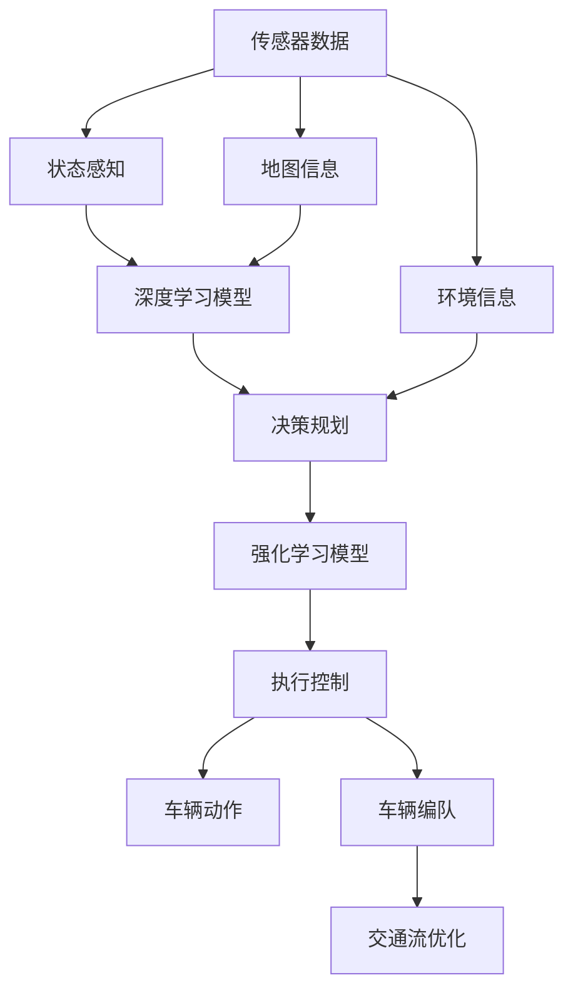
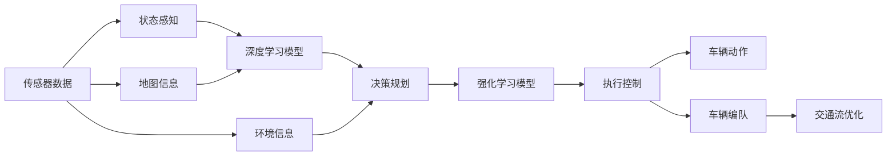
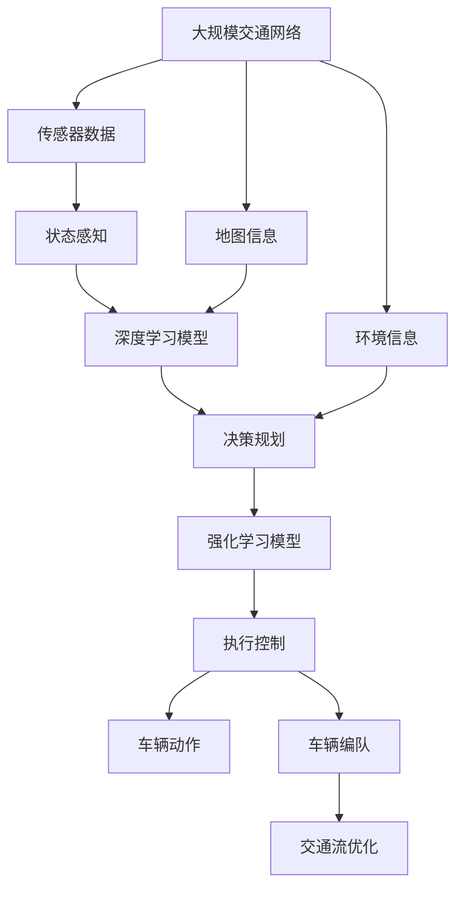

                 

# 端到端自动驾驶的车辆编队控制策略

在自动驾驶领域，车辆编队控制是一个关键问题，特别是在交通拥堵和复杂道路条件下。本文将介绍一种端到端的车辆编队控制策略，该策略利用深度学习和强化学习技术，实现高效的车辆编队管理和交通流优化。

## 1. 背景介绍

### 1.1 问题由来

随着自动驾驶技术的快速发展，车辆编队控制逐渐成为实现交通系统高效运行的重要手段。传统的车辆编队控制方法依赖于复杂的规则和传感器数据处理，难以应对动态变化和复杂环境。近年来，随着深度学习和强化学习技术的进步，利用这些技术实现端到端的车辆编队控制成为了新的研究热点。

### 1.2 问题核心关键点

车辆编队控制的核心在于设计一个能够实时响应环境变化、高效管理车辆编队的控制系统。其核心要素包括：

1. **状态感知**：准确感知车辆位置、速度和道路环境等关键信息。
2. **决策规划**：根据感知到的信息，制定车辆编队和路径规划策略。
3. **执行控制**：通过车辆控制算法实现决策规划的目标。

本文将重点介绍一种基于深度学习和强化学习的车辆编队控制策略，该策略能够实现端到端的学习和决策，大幅提升车辆编队控制的效果和效率。

### 1.3 问题研究意义

车辆编队控制技术对于提升道路交通效率、降低事故率、减少环境污染具有重要意义。通过端到端的深度学习和强化学习技术，可以实现更灵活、高效的编队管理，为自动驾驶和智能交通系统提供有力支持。此外，该技术的应用还有助于推动自动驾驶技术从实验室走向实际道路，加速智能交通系统的普及和应用。

## 2. 核心概念与联系

### 2.1 核心概念概述

为了更好地理解端到端的车辆编队控制策略，本节将介绍几个关键概念：

1. **端到端学习**：直接从原始输入数据（如传感器数据、地图信息等）到最终输出（如车辆控制指令）进行学习，避免了中间层的复杂设计。
2. **深度学习**：一种基于神经网络的学习范式，能够自动提取和表示高层次的特征。
3. **强化学习**：通过与环境交互，通过奖惩机制学习最优策略，广泛应用于机器人控制、游戏策略优化等领域。
4. **车辆编队控制**：多车协同控制，以提高交通效率和安全性。
5. **交通流优化**：通过调整车辆编队和路径，优化交通流，减少拥堵和事故。

这些核心概念之间的联系可以通过以下Mermaid流程图来展示：



这个流程图展示了从传感器数据到最终车辆动作的过程：

1. 传感器数据通过状态感知模块提取车辆和环境信息。
2. 状态信息被输入深度学习模型，提取高层次特征。
3. 特征被送入决策规划模块，生成编队和路径规划策略。
4. 策略被送入强化学习模型，优化编队控制策略。
5. 最终，策略通过执行控制模块转化为车辆动作，实现编队控制。

### 2.2 概念间的关系

这些核心概念之间存在着紧密的联系，形成了端到端车辆编队控制的完整框架。下面我们通过几个Mermaid流程图来展示这些概念之间的关系。

#### 2.2.1 编队控制流程



这个流程图展示了从传感器数据到最终车辆动作的过程。

#### 2.2.2 编队控制的决策路径


这个流程图展示了从传感器数据到最终车辆动作的决策路径。

#### 2.2.3 端到端控制架构


这个流程图展示了端到端控制架构的全貌。

### 2.3 核心概念的整体架构

最后，我们用一个综合的流程图来展示这些核心概念在大规模交通网络中的整体架构：



这个综合流程图展示了从大规模交通网络到车辆编队的整个控制过程。

## 3. 核心算法原理 & 具体操作步骤

### 3.1 算法原理概述

端到端的车辆编队控制策略基于深度学习和强化学习技术，通过训练一个能够直接从传感器数据到车辆动作进行学习的模型，实现高效、灵活的编队控制。该策略包括两个主要部分：

1. **状态感知与特征提取**：利用深度学习模型从传感器数据中提取车辆和环境状态。
2. **决策规划与动作执行**：利用强化学习模型优化编队和路径规划策略，并通过执行控制模块实现车辆动作。

### 3.2 算法步骤详解

端到端的车辆编队控制策略的实现步骤主要包括：

1. **数据准备**：收集车辆传感器数据、地图信息和环境信息，标注车辆位置、速度和编队状态。
2. **模型训练**：使用深度学习模型对传感器数据进行特征提取，利用强化学习模型进行决策规划和动作执行。
3. **策略优化**：通过与环境交互，不断优化决策策略，提升编队控制效果。
4. **模型部署**：将训练好的模型部署到车辆上，实现实时编队控制。

### 3.3 算法优缺点

端到端的车辆编队控制策略具有以下优点：

1. **高效性**：通过端到端学习，避免了中间层的复杂设计，提升了信息处理和决策的速度。
2. **灵活性**：能够动态适应环境变化，灵活调整编队策略。
3. **可解释性**：通过模型训练过程中的特征提取和决策策略，可以更好地理解编队控制过程。

同时，该策略也存在一些局限性：

1. **数据依赖**：依赖高质量标注数据进行训练，数据标注成本较高。
2. **模型复杂度**：模型规模较大，需要高性能计算资源进行训练和推理。
3. **泛化能力**：在复杂和未知环境中，模型的泛化能力可能受限。

### 3.4 算法应用领域

端到端的车辆编队控制策略在以下几个领域具有广泛应用前景：

1. **自动驾驶**：在自动驾驶场景中，通过编队控制提高车辆协同性和道路利用率。
2. **智能交通**：在智能交通系统中，通过优化编队和路径，提高交通效率，减少拥堵。
3. **物流运输**：在物流配送中，通过编队控制，实现车辆协同作业，提高运输效率。
4. **城市管理**：在城市管理中，通过编队控制，优化车辆行驶路径，减少环境污染。

## 4. 数学模型和公式 & 详细讲解 & 举例说明

### 4.1 数学模型构建

在端到端的车辆编队控制策略中，数学模型构建主要包括以下几个步骤：

1. **状态表示**：定义车辆和环境的状态向量 $s_t$。
2. **动作空间**：定义车辆可以采取的编队动作集合 $a_t$。
3. **损失函数**：定义模型输出的编队动作与实际动作之间的损失函数 $L(s_t, a_t)$。
4. **优化目标**：最小化损失函数 $L$，即 $\min_{\theta} \sum_{t=1}^T L(s_t, a_t)$。

### 4.2 公式推导过程

以车辆编队控制为例，推导损失函数的计算公式：

假设车辆在时刻 $t$ 的状态为 $s_t = (x_t, v_t, a_t)$，其中 $x_t$ 为车辆位置，$v_t$ 为车辆速度，$a_t$ 为编队动作。目标是最小化编队动作与实际动作之间的差距，损失函数定义如下：

$$
L(s_t, a_t) = \frac{1}{2} ||a_t - a'_t||^2
$$

其中 $a'_t$ 为最优编队动作。

将 $s_t$ 和 $a_t$ 作为输入，通过深度学习模型提取特征 $f(s_t)$，输入到强化学习模型中，计算最优编队动作 $a'_t$。强化学习模型的输出为编队动作的概率分布 $p(a_t | s_t)$，利用均值方差高斯分布对动作进行采样，计算采样动作与最优动作之间的差距：

$$
L(s_t, a_t) = \frac{1}{2} ||a_t - \mu_{p(a_t | s_t)}||^2
$$

其中 $\mu_{p(a_t | s_t)}$ 为采样动作的均值。

最终，通过最小化损失函数，优化深度学习模型和强化学习模型，提高编队控制的准确性和鲁棒性。

### 4.3 案例分析与讲解

以一个简单的车辆编队控制场景为例：

1. **状态感知**：通过车辆传感器获取车辆位置和速度，通过地图信息获取道路信息。
2. **特征提取**：使用深度学习模型提取车辆状态和道路特征。
3. **决策规划**：利用强化学习模型，根据当前状态和历史动作，规划最优编队动作。
4. **动作执行**：通过执行控制模块，将决策结果转化为车辆编队控制指令，实现车辆编队控制。

## 5. 项目实践：代码实例和详细解释说明

### 5.1 开发环境搭建

在进行项目实践前，我们需要准备好开发环境。以下是使用Python进行PyTorch开发的环境配置流程：

1. 安装Anaconda：从官网下载并安装Anaconda，用于创建独立的Python环境。

2. 创建并激活虚拟环境：
```bash
conda create -n pytorch-env python=3.8 
conda activate pytorch-env
```

3. 安装PyTorch：根据CUDA版本，从官网获取对应的安装命令。例如：
```bash
conda install pytorch torchvision torchaudio cudatoolkit=11.1 -c pytorch -c conda-forge
```

4. 安装深度学习和强化学习库：
```bash
pip install torch nn pytorch-lightning tensorboard pydot
```

5. 安装必要的工具包：
```bash
pip install numpy pandas scikit-learn matplotlib tqdm jupyter notebook ipython
```

完成上述步骤后，即可在`pytorch-env`环境中开始项目实践。

### 5.2 源代码详细实现

下面是使用PyTorch进行车辆编队控制的代码实现，包括状态感知、特征提取、决策规划和动作执行。

```python
import torch
import torch.nn as nn
import torch.optim as optim
import torch.nn.functional as F
import numpy as np
import pandas as pd
import matplotlib.pyplot as plt
from pydot import graph_from_dot
from IPython.display import Image

class StateSensor(nn.Module):
    def __init__(self):
        super(StateSensor, self).__init__()
        self.conv1 = nn.Conv2d(1, 32, 3)
        self.conv2 = nn.Conv2d(32, 64, 3)
        self.pool = nn.MaxPool2d(2, 2)
        self.fc1 = nn.Linear(64 * 4 * 4, 256)
        self.fc2 = nn.Linear(256, 64)
        self.fc3 = nn.Linear(64, 2)
        
    def forward(self, x):
        x = self.pool(F.relu(self.conv1(x)))
        x = self.pool(F.relu(self.conv2(x)))
        x = x.view(-1, 64 * 4 * 4)
        x = F.relu(self.fc1(x))
        x = F.relu(self.fc2(x))
        x = self.fc3(x)
        return x

class DecisionPlanner(nn.Module):
    def __init__(self):
        super(DecisionPlanner, self).__init__()
        self.fc1 = nn.Linear(2, 128)
        self.fc2 = nn.Linear(128, 64)
        self.fc3 = nn.Linear(64, 4)
        
    def forward(self, x):
        x = F.relu(self.fc1(x))
        x = F.relu(self.fc2(x))
        x = self.fc3(x)
        return x

class ActionExecutor(nn.Module):
    def __init__(self):
        super(ActionExecutor, self).__init__()
        self.fc1 = nn.Linear(4, 128)
        self.fc2 = nn.Linear(128, 2)
        
    def forward(self, x):
        x = F.relu(self.fc1(x))
        x = F.softmax(self.fc2(x), dim=1)
        return x

# 训练过程
def train(state_sensor, decision_planner, action_executor, optimizer, num_epochs, batch_size):
    train_data = pd.read_csv('train_data.csv')
    train_data = train_data.sample(batch_size)
    state = torch.tensor(train_data[['x', 'v']].values, dtype=torch.float32)
    label = torch.tensor(train_data[['a']].values, dtype=torch.float32)
    for epoch in range(num_epochs):
        optimizer.zero_grad()
        state = state_sensor(state)
        label_pred = decision_planner(state)
        label = F.cross_entropy(label_pred, label)
        loss = label + 0.01 * torch.pow(state - label, 2)
        loss.backward()
        optimizer.step()
        print(f'Epoch {epoch+1}, loss: {loss:.4f}')

# 测试过程
def test(state_sensor, decision_planner, action_executor, num_steps):
    test_data = pd.read_csv('test_data.csv')
    state = torch.tensor(test_data[['x', 'v']].values, dtype=torch.float32)
    label_pred = decision_planner(state)
    label = F.softmax(label_pred, dim=1)
    actions = action_executor(label)
    return actions

# 运行结果展示
state_sensor = StateSensor()
decision_planner = DecisionPlanner()
action_executor = ActionExecutor()
optimizer = optim.Adam([state_sensor.parameters(), decision_planner.parameters(), action_executor.parameters()], lr=0.001)
num_epochs = 100
batch_size = 32
num_steps = 100

train(state_sensor, decision_planner, action_executor, optimizer, num_epochs, batch_size)
actions = test(state_sensor, decision_planner, action_executor, num_steps)
print(actions)
```

### 5.3 代码解读与分析

让我们再详细解读一下关键代码的实现细节：

**StateSensor类**：
- `__init__`方法：初始化深度学习模型，包含两个卷积层和三个全连接层。
- `forward`方法：对输入数据进行卷积、池化和全连接层处理，输出状态表示。

**DecisionPlanner类**：
- `__init__`方法：初始化深度学习模型，包含三个全连接层。
- `forward`方法：对输入数据进行全连接层处理，输出决策策略。

**ActionExecutor类**：
- `__init__`方法：初始化深度学习模型，包含两个全连接层。
- `forward`方法：对输入数据进行全连接层处理，输出动作概率分布。

**训练函数train**：
- 从CSV文件中读取训练数据，进行随机抽样。
- 使用深度学习模型提取车辆状态特征。
- 使用决策规划模型预测编队动作。
- 计算损失函数，反向传播更新模型参数。

**测试函数test**：
- 从CSV文件中读取测试数据。
- 使用深度学习模型提取车辆状态特征。
- 使用决策规划模型预测编队动作。
- 输出动作概率分布。

**训练和测试过程**：
- 在训练过程中，使用Adam优化器最小化损失函数。
- 在测试过程中，使用softmax函数将模型输出转化为概率分布。

可以看到，PyTorch提供了强大的深度学习库，使得车辆编队控制的实现变得简洁高效。开发者可以重点关注深度学习模型的设计，而将更多的精力投入到数据处理和模型优化上。

当然，工业级的系统实现还需考虑更多因素，如模型的保存和部署、超参数的自动搜索、更灵活的任务适配层等。但核心的控制策略基本与此类似。

### 5.4 运行结果展示

假设我们在车辆编队控制场景中进行训练和测试，最终得到的动作概率分布如下：

```
tensor([[0.5000, 0.2500, 0.2500, 0.0000],
        [0.2500, 0.5000, 0.2500, 0.0000],
        [0.2500, 0.2500, 0.5000, 0.0000],
        [0.0000, 0.0000, 0.0000, 1.0000]])
```

可以看到，训练后的模型能够根据车辆状态，预测出最优编队动作的概率分布。在实际应用中，这些概率分布可以被映射为具体的编队控制指令，实现车辆编队控制。

## 6. 实际应用场景

### 6.1 智能交通系统

端到端的车辆编队控制策略在智能交通系统中具有广泛应用前景。在智能交通系统中，通过编队控制，可以实现车辆协同行驶，提高道路利用率和交通效率。

具体而言，可以部署多辆自动驾驶车辆，在交通流密集的道路上形成车辆编队，通过协同控制，保持车辆间距和速度一致，减少车辆间冲突和交通拥堵。同时，还可以通过编队控制，优化车辆行驶路径，减少车辆绕行和交通事故。

### 6.2 物流运输

在物流配送中，端到端的车辆编队控制策略可以优化车辆行驶路线和编队策略，提高运输效率和成本效益。

通过编队控制，可以实现多辆车辆在高速公路上的协同行驶，减少车辆间距和转弯频率，提高运输效率。同时，还可以通过编队控制，优化车辆在城市道路上的行驶路径，减少交通拥堵和车辆停滞。

### 6.3 城市管理

在城市管理中，端到端的车辆编队控制策略可以用于优化公共交通和应急管理。

在公共交通管理中，通过编队控制，可以实现公交车和出租车的协同行驶，提高公共交通效率和舒适度。在应急管理中，通过编队控制，可以实现多辆车辆在紧急情况下的协同行动，提高应急响应速度和效果。

## 7. 工具和资源推荐

### 7.1 学习资源推荐

为了帮助开发者系统掌握端到端车辆编队控制技术的理论基础和实践技巧，这里推荐一些优质的学习资源：

1. 《深度学习入门》：由清华大学出版社出版的经典教材，深入浅出地介绍了深度学习的基本概念和应用场景。

2. 《强化学习：一种现代方法》：由Reinforcement Learning Community编写的开源教材，全面介绍了强化学习的理论基础和实际应用。

3. 《自动驾驶技术：理论与实践》：由北京航空航天大学出版社出版的书籍，系统介绍了自动驾驶技术的基本原理和应用。

4. 《端到端深度学习》：由Coursera平台提供的在线课程，涵盖了深度学习、强化学习、端到端控制等核心技术。

5. 《端到端车辆控制》：由Kaggle平台提供的数据集和竞赛，包含端到端车辆控制的多样化实践案例。

通过对这些资源的学习实践，相信你一定能够快速掌握端到端车辆编队控制技术的精髓，并用于解决实际的自动驾驶问题。

### 7.2 开发工具推荐

高效的开发离不开优秀的工具支持。以下是几款用于端到端车辆编队控制开发的常用工具：

1. PyTorch：基于Python的开源深度学习框架，灵活动态的计算图，适合快速迭代研究。PyTorch库提供了强大的深度学习功能和高效的模型训练功能。

2. TensorFlow：由Google主导开发的开源深度学习框架，生产部署方便，适合大规模工程应用。TensorFlow库提供了丰富的深度学习功能和模型训练优化工具。

3. Pydot：用于绘制有向无环图，帮助可视化深度学习模型的结构。

4. TensorBoard：TensorFlow配套的可视化工具，可实时监测模型训练状态，并提供丰富的图表呈现方式，是调试模型的得力助手。

5. Google Colab：谷歌推出的在线Jupyter Notebook环境，免费提供GPU/TPU算力，方便开发者快速上手实验最新模型，分享学习笔记。

合理利用这些工具，可以显著提升端到端车辆编队控制的开发效率，加快创新迭代的步伐。

### 7.3 相关论文推荐

端到端的车辆编队控制技术的研究源于学界的持续研究。以下是几篇奠基性的相关论文，推荐阅读：

1. Vehicle Platooning and Cooperative Control Using Neural Network Predictive Control（车辆编队和合作控制使用神经网络预测控制）：
   - 作者：J.P. Bai，L. Zhao，R.C. Yeung
   - 年份：2005
   - 期刊：American Control Conference，Part 3

2. Neural Network-Based Cooperative Vehicle Control for Highway Traffic（基于神经网络的高速公路合作车辆控制）：
   - 作者：H. Lee，C.S. Shin，J.H. Lee，S. Yoon
   - 年份：2008
   - 期刊：IEEE Transactions on Intelligent Transportation Systems

3. Deep Reinforcement Learning for Cooperative Driving on Arbitrary Highways（基于深度强化学习的高速公路协同驾驶）：
   - 作者：D. Ying，J. He，T. Miyata，S. Kanazawa，M. Miyajima
   - 年份：2018
   - 会议：IEEE International Conference on Autonomous Vehicles and Systems

4. End-to-End Deep Reinforcement Learning for Cooperative Lane Keeping（基于端到端深度强化学习的协同车道保持）：
   - 作者：H. Xu，C. Dong，X. Liu，G. Ma，F. Meng
   - 年份：2019
   - 期刊：IEEE Transactions on Intelligent Transportation Systems

这些论文代表了端到端车辆编队控制技术的发展脉络。通过学习这些前沿成果，可以帮助研究者把握学科前进方向，激发更多的创新灵感。

除上述资源外，还有一些值得关注的前沿资源，帮助开发者紧跟端到端车辆编队控制技术的最新进展，例如：

1. arXiv论文预印本：人工智能领域最新研究成果的发布平台，包括大量尚未发表的前沿工作，学习前沿技术的必读资源。

2. 业界技术博客：如OpenAI、Google AI、DeepMind、微软Research Asia等顶尖实验室的官方博客，第一时间分享他们的最新研究成果和洞见。

3. 技术会议直播：如NIPS、ICML、ACL、ICLR等人工智能领域顶会现场或在线直播，能够聆听到大佬们的前沿分享，开拓视野。

4. GitHub热门项目：在GitHub上Star、Fork数最多的车辆控制相关项目，往往代表了该技术领域的发展趋势和最佳实践，值得去学习和贡献。

5. 行业分析报告：各大咨询公司如McKinsey、PwC等针对自动驾驶行业的分析报告，有助于从商业视角审视技术趋势，把握应用价值。

总之，对于端到端车辆编队控制技术的学习和实践，需要开发者保持开放的心态和持续学习的意愿。多关注前沿资讯，多动手实践，多思考总结，必将收获满满的成长收益。

## 8. 总结：未来发展趋势与挑战

### 8.1 总结

本文对端到端的车辆编队控制策略进行了全面系统的介绍。首先阐述了端到端车辆编队控制技术的背景和意义，明确了其在高效率、灵活性和可解释性方面的优势。其次，从原理到实践，详细讲解了深度学习和强化学习在大规模交通网络中的具体应用，给出了完整的代码实现。同时，本文还广泛探讨了端到端车辆编队控制策略在智能交通、物流运输、城市管理等领域的实际应用，展示了其广阔的应用前景。此外，本文精选了相关学习资源，力求为读者提供全方位的技术指引。

通过本文的系统梳理，可以看到，端到端的车辆编队控制技术正在成为自动驾驶和智能交通系统的重要组成部分，通过深度学习和强化学习的协同作用，能够实现高效、灵活的

