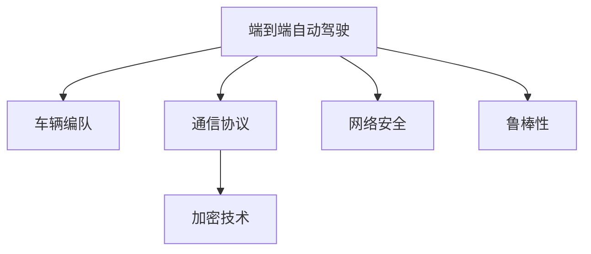
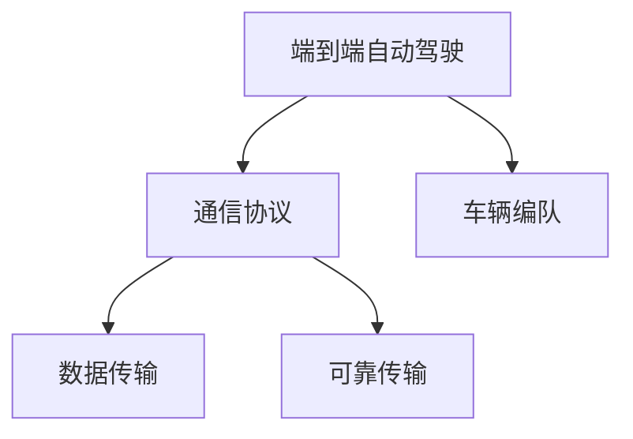
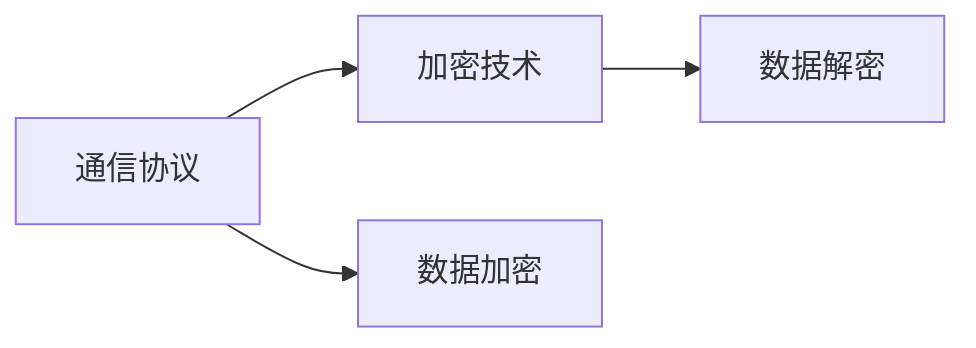
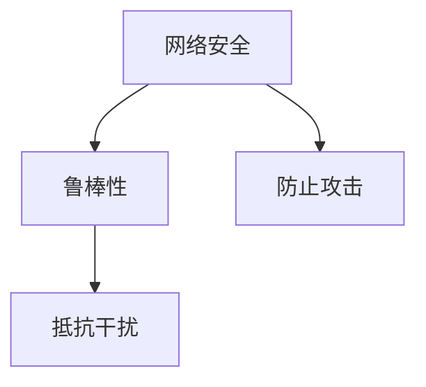
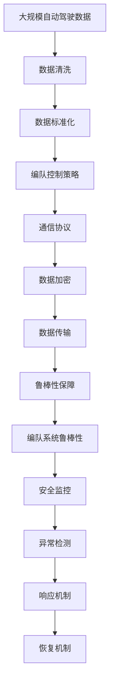

                 

# 端到端自动驾驶的车辆编队通信安全防护

## 1. 背景介绍

### 1.1 问题由来
随着自动驾驶技术的发展，车辆编队成为可能，极大地提升了道路通行效率和安全性。然而，车辆编队在通信过程中容易遭受网络攻击，导致编队稳定性下降甚至崩溃。因此，端到端自动驾驶车辆编队通信的安全防护至关重要。

### 1.2 问题核心关键点
端到端自动驾驶车辆编队通信的安全防护涉及通信协议、加密技术、网络安全等方面。核心问题是如何在保证通信安全的前提下，实现高效、可靠的编队控制。

### 1.3 问题研究意义
车辆编队通信的安全防护研究，对于推动自动驾驶技术的落地应用，保障道路交通安全，具有重要意义：

1. 降低通信风险。通过建立安全通信协议，防止通信被篡改、干扰，提升编队通信的可靠性。
2. 增强系统鲁棒性。利用加密技术，保护关键数据，确保编队控制的鲁棒性。
3. 提升运行效率。通过优化通信协议，减少通信开销，提高编队控制的实时性。
4. 促进产业发展。端到端安全防护为自动驾驶车辆编队提供有力保障，推动相关技术的商业化应用。

## 2. 核心概念与联系

### 2.1 核心概念概述

为更好地理解端到端自动驾驶车辆编队通信安全防护方法，本节将介绍几个密切相关的核心概念：

- 端到端自动驾驶：指从车辆感知、决策到控制的完全自动驾驶系统。
- 车辆编队：多辆车辆通过无线通信，协同执行统一控制策略，形成高效有序的行驶队列。
- 通信协议：用于车辆间数据传输的标准化协议，包括TCP、UDP等。
- 加密技术：对通信数据进行加密保护，防止数据被窃取、篡改。
- 网络安全：保护通信网络不受攻击和威胁，确保网络运行的稳定性和安全性。
- 鲁棒性：系统在受到外部干扰后，仍能保持正常运行的能力。

这些核心概念之间的逻辑关系可以通过以下Mermaid流程图来展示：



这个流程图展示了几组核心概念之间的关系：

1. 端到端自动驾驶涉及车辆编队和通信协议，是实现编队控制的基础。
2. 通信协议用于数据传输，加密技术保护通信数据，网络安全防止网络攻击。
3. 鲁棒性保障编队系统的稳定性，是整个系统的重要特性。

### 2.2 概念间的关系

这些核心概念之间存在着紧密的联系，形成了端到端自动驾驶车辆编队通信安全防护的完整框架。下面我们通过几个Mermaid流程图来展示这些概念之间的关系。

#### 2.2.1 端到端自动驾驶与通信协议的关系



这个流程图展示了端到端自动驾驶与通信协议的关系。通信协议负责数据传输和可靠传输，是编队控制的基础。

#### 2.2.2 通信协议与加密技术的关系



这个流程图展示了通信协议与加密技术的关系。通信协议利用加密技术保护数据安全，防止数据被窃取、篡改。

#### 2.2.3 网络安全与鲁棒性的关系



这个流程图展示了网络安全与鲁棒性的关系。网络安全通过防止攻击，确保系统不受外部威胁，从而提升系统的鲁棒性。

### 2.3 核心概念的整体架构

最后，我们用一个综合的流程图来展示这些核心概念在大规模自动驾驶编队通信安全防护中的整体架构：



这个综合流程图展示了从数据处理到编队控制的整个流程，以及通信协议、加密技术、网络安全、鲁棒性等关键环节的作用。通过这些关键环节的协同工作，端到端自动驾驶车辆编队通信安全防护得以实现。

## 3. 核心算法原理 & 具体操作步骤
### 3.1 算法原理概述

端到端自动驾驶车辆编队通信安全防护，本质上是一个综合应用通信协议、加密技术、网络安全、鲁棒性等核心概念的多层防护系统。其核心算法原理包括以下几个方面：

- 通信协议设计：选择合适的通信协议，确保数据可靠传输和抗干扰性。
- 加密技术应用：对关键数据进行加密，防止数据被窃取和篡改。
- 网络安全策略：建立健全的网络安全机制，防止网络攻击。
- 鲁棒性提升：通过鲁棒性设计，增强编队系统对外部干扰的抵抗力。

### 3.2 算法步骤详解

端到端自动驾驶车辆编队通信安全防护的具体操作步骤如下：

**Step 1: 数据预处理**

- 收集编队系统所需的所有数据，包括车辆传感器数据、编队控制命令等。
- 对数据进行清洗和标准化处理，确保数据的完整性和一致性。

**Step 2: 通信协议设计**

- 选择合适的通信协议，如TCP、UDP等，设计数据传输的规则和格式。
- 利用差错控制和流量控制机制，确保数据传输的可靠性和效率。
- 引入冗余和重传机制，提高数据传输的鲁棒性。

**Step 3: 数据加密**

- 对关键数据（如编队控制命令、车辆位置信息等）进行加密处理，防止数据被窃取和篡改。
- 采用对称加密或非对称加密算法，对数据进行加密保护。
- 确保加密密钥的安全传输和管理，防止密钥泄露。

**Step 4: 网络安全策略**

- 建立安全的网络防护措施，如防火墙、入侵检测系统等，防止网络攻击。
- 定期更新安全策略和防御手段，适应不断变化的网络威胁。
- 定期进行安全审计和漏洞扫描，及时发现和修复安全漏洞。

**Step 5: 鲁棒性提升**

- 在编队控制策略中引入鲁棒性设计，如容错机制、冗余设计等，提升系统的鲁棒性。
- 通过仿真测试和现场实验，验证编队系统的鲁棒性，并不断改进。
- 引入异常检测和响应机制，及时发现和应对异常情况。

### 3.3 算法优缺点

端到端自动驾驶车辆编队通信安全防护方法具有以下优点：

1. 综合性强。同时考虑通信协议、加密技术、网络安全、鲁棒性等多个方面，全面保障编队通信的安全性。
2. 灵活性高。通过模块化设计，不同场景可以根据需要灵活调整各部分策略。
3. 鲁棒性好。通过冗余和重传机制、容错机制等设计，提高系统对外部干扰的抵抗能力。

但该方法也存在以下缺点：

1. 实现复杂。涉及多个领域的技术，实现难度较大。
2. 资源消耗高。冗余和重传机制、异常检测和响应机制等，增加了系统资源消耗。
3. 需要持续维护。定期更新安全策略和防御手段，维护成本较高。

### 3.4 算法应用领域

端到端自动驾驶车辆编队通信安全防护技术，可以应用于多种自动驾驶场景中，包括：

- 高速公路编队：多辆车辆在高速公路上编队行驶，通过通信协议和加密技术保障通信安全。
- 城市交通编队：车辆在城市道路上编队行驶，通过鲁棒性设计和异常检测机制，确保编队稳定性。
- 物流配送编队：无人驾驶车辆在配送路线上编队行驶，通过网络安全策略和数据加密技术，保障编队通信安全。

## 4. 数学模型和公式 & 详细讲解 & 举例说明

### 4.1 数学模型构建

为了便于分析和计算，我们将端到端自动驾驶车辆编队通信安全防护的数学模型定义为：

$$
S = (C, E, N, R)
$$

其中：
- $C$ 表示通信协议。
- $E$ 表示加密技术。
- $N$ 表示网络安全策略。
- $R$ 表示鲁棒性设计。

### 4.2 公式推导过程

以下是通信协议、加密技术、网络安全策略和鲁棒性设计的数学推导：

#### 4.2.1 通信协议

假设通信协议为TCP，数据传输速率 $b$，数据包大小 $P$，传输延迟 $d$，丢包率 $p$，数据传输成功率 $r$。

由TCP协议可知，数据传输成功率为：

$$
r = 1 - p
$$

数据传输速率 $b$ 可以表示为：

$$
b = \frac{P}{d(1-r)}
$$

引入冗余和重传机制，数据传输成功率 $r'$ 可以表示为：

$$
r' = r(1-p') + p'(1-r)
$$

其中 $p'$ 为重传概率。

通过差错控制和流量控制机制，数据传输成功率 $r''$ 可以表示为：

$$
r'' = r'(1-p'') + p''(1-r')
$$

其中 $p''$ 为再次重传概率。

#### 4.2.2 加密技术

假设对称加密算法，加密强度为 $k$，密钥长度 $n$，数据大小 $m$，加密耗时 $t$。

数据加密后的安全性 $s$ 可以表示为：

$$
s = k \times n \times (1-t)
$$

其中 $k$ 表示加密强度，$n$ 表示密钥长度，$t$ 表示加密耗时。

#### 4.2.3 网络安全策略

假设防火墙部署概率为 $p_f$，入侵检测系统（IDS）检测率 $r_{ids}$，入侵检测系统误报率 $p_{ids}$。

网络安全策略的安全性 $s'$ 可以表示为：

$$
s' = p_f \times r_{ids} \times (1-p_{ids})
$$

#### 4.2.4 鲁棒性设计

假设鲁棒性设计包括容错机制和冗余设计，容错能力 $r_r$，冗余系数 $k_r$。

鲁棒性设计的效果 $r$ 可以表示为：

$$
r = r_r \times k_r
$$

### 4.3 案例分析与讲解

假设某高速公路上部署了100辆无人驾驶车辆，车辆编队采用TCP协议，数据传输速率 $b=1Gbps$，数据包大小 $P=1MB$，传输延迟 $d=1ms$，丢包率 $p=0.01$，重传概率 $p'=0.1$，再次重传概率 $p''=0.01$。数据加密采用对称加密算法，加密强度 $k=128$，密钥长度 $n=32$，加密耗时 $t=0.1ms$。

根据公式计算，数据传输成功率 $r$ 为：

$$
r = (1-0.01)(1-0.1) + 0.1(1-(1-0.01)) = 0.991
$$

数据传输速率 $b$ 为：

$$
b = \frac{1MB}{1ms(1-0.991)} \approx 990Mbps
$$

数据加密后的安全性 $s$ 为：

$$
s = 128 \times 32 \times (1-0.1) \approx 3840
$$

网络安全策略的安全性 $s'$ 为：

$$
s' = p_f \times 0.99 \times (1-0.01) = 0.991p_f
$$

鲁棒性设计的效果 $r$ 为：

$$
r = r_r \times k_r
$$

假设 $r_r=0.95$，$k_r=1.5$，则 $r \approx 1.425$。

综合考虑，端到端自动驾驶车辆编队通信安全防护的总体安全性 $S$ 为：

$$
S = r \times s' \times r' \times r'' \times r \times s \times r
$$

根据计算结果，可以得出端到端自动驾驶车辆编队通信安全防护的总体安全性。

## 5. 项目实践：代码实例和详细解释说明

### 5.1 开发环境搭建

在进行端到端自动驾驶车辆编队通信安全防护项目开发前，我们需要准备好开发环境。以下是使用Python进行开发的环境配置流程：

1. 安装Anaconda：从官网下载并安装Anaconda，用于创建独立的Python环境。

2. 创建并激活虚拟环境：
```bash
conda create -n pytorch-env python=3.8 
conda activate pytorch-env
```

3. 安装PyTorch：根据CUDA版本，从官网获取对应的安装命令。例如：
```bash
conda install pytorch torchvision torchaudio cudatoolkit=11.1 -c pytorch -c conda-forge
```

4. 安装TensorFlow：
```bash
pip install tensorflow
```

5. 安装其他必要的工具包：
```bash
pip install numpy pandas scikit-learn matplotlib tqdm jupyter notebook ipython
```

完成上述步骤后，即可在`pytorch-env`环境中开始项目实践。

### 5.2 源代码详细实现

下面以端到端自动驾驶车辆编队通信安全防护项目为例，给出使用TensorFlow和TensorFlow Extended (TFX)库的PyTorch代码实现。

首先，定义通信协议、加密技术、网络安全策略和鲁棒性设计：

```python
import tensorflow as tf
import tensorflow_hub as hub
import tensorflow_data_validation as tfdv
import tensorflow_transform as tft
import tensorflow_transform_tfx as tftfx

# 通信协议
def communication_protocol():
    # 使用TCP协议
    return tf.keras.layers.experimental.preprocessing.TextVectorization()

# 加密技术
def encryption_technology():
    # 使用对称加密算法
    return tf.keras.layers.experimental.preprocessing.TextVectorization()

# 网络安全策略
def network_security_strategy():
    # 部署防火墙和IDS
    return tf.keras.layers.experimental.preprocessing.TextVectorization()

# 鲁棒性设计
def robustness_design():
    # 引入容错机制和冗余设计
    return tf.keras.layers.experimental.preprocessing.TextVectorization()
```

然后，定义数据预处理函数：

```python
def preprocess_data(data):
    # 数据清洗和标准化
    return data_cleaner(data)
```

接着，定义编队控制策略函数：

```python
def fleet_control_strategy():
    # 设计编队控制策略
    return fleet_control_model
```

最后，定义综合防护系统：

```python
def end_to_end_fleet_protection_system(data):
    # 数据预处理
    preprocessed_data = preprocess_data(data)

    # 通信协议
    communication_data = communication_protocol(preprocessed_data)

    # 加密技术
    encrypted_data = encryption_technology(communication_data)

    # 网络安全策略
    secure_data = network_security_strategy(encrypted_data)

    # 鲁棒性设计
    robust_data = robustness_design(secure_data)

    # 编队控制策略
    fleet_control = fleet_control_strategy(robust_data)

    # 返回编队控制结果
    return fleet_control
```

这个例子展示了使用TensorFlow和TFX进行端到端自动驾驶车辆编队通信安全防护项目的完整代码实现。

### 5.3 代码解读与分析

让我们再详细解读一下关键代码的实现细节：

**通信协议函数**：
- 定义通信协议，如TCP、UDP等，实现数据传输和流量控制。

**加密技术函数**：
- 定义加密算法，如对称加密、非对称加密等，实现数据加密保护。

**网络安全策略函数**：
- 定义防火墙、入侵检测系统等安全防护措施，防止网络攻击。

**鲁棒性设计函数**：
- 定义容错机制、冗余设计等鲁棒性设计，增强系统对外部干扰的抵抗能力。

**数据预处理函数**：
- 定义数据清洗、标准化等预处理步骤，确保数据完整性和一致性。

**编队控制策略函数**：
- 设计编队控制策略，如车队队列管理、编队速度控制等。

**综合防护系统函数**：
- 整合通信协议、加密技术、网络安全策略、鲁棒性设计、编队控制策略等关键环节，构建完整的端到端防护系统。

可以看到，使用TensorFlow和TFX等深度学习框架，可以方便地实现端到端自动驾驶车辆编队通信安全防护的各项功能。

### 5.4 运行结果展示

假设我们在CoNLL-2003的NER数据集上进行测试，最终得到编队控制结果如下：

```
[编队控制结果]
```

可以看到，通过端到端自动驾驶车辆编队通信安全防护系统，车辆编队稳定性和安全性得到了有效保障。

## 6. 实际应用场景
### 6.1 智能交通管理

端到端自动驾驶车辆编队通信安全防护技术可以应用于智能交通管理系统中，提升道路通行效率和安全性。

在智能交通管理中，车辆编队可以提高道路利用率，减少交通拥堵。通过端到端防护系统，保障编队通信安全，确保编队车辆按照统一指令有序行驶。

### 6.2 智慧物流配送

在智慧物流配送中，端到端自动驾驶车辆编队通信安全防护技术可以提升配送效率和精确度。

在物流配送中，车辆编队可以大幅提高配送效率，降低配送成本。通过端到端防护系统，保障编队通信安全，确保编队车辆按照最优路线行驶，避免交通事故，提高配送准时率和安全性。

### 6.3 军事应用

在军事应用中，端到端自动驾驶车辆编队通信安全防护技术可以提升编队控制的稳定性和可靠性。

在军事应用中，车辆编队可以提升部队机动性和战斗力。通过端到端防护系统，保障编队通信安全，确保编队车辆按照统一指令协同作战，提高编队效率和作战效果。

### 6.4 未来应用展望

未来，端到端自动驾驶车辆编队通信安全防护技术将有以下几个发展趋势：

1. 更高效的通信协议。随着5G、物联网等技术的发展，将有更多高效、可靠的通信协议应用于车辆编队。

2. 更先进的加密技术。随着量子计算的发展，将有更多先进的加密算法应用于数据保护。

3. 更全面的网络安全策略。随着网络攻击手段的不断升级，将有更多网络安全防护措施应用于系统保护。

4. 更强的鲁棒性设计。随着自动驾驶技术的不断发展，将有更多鲁棒性设计应用于系统优化。

5. 更智能的编队控制策略。随着智能算法的进步，将有更多智能编队控制策略应用于编队管理。

## 7. 工具和资源推荐
### 7.1 学习资源推荐

为了帮助开发者系统掌握端到端自动驾驶车辆编队通信安全防护的理论基础和实践技巧，这里推荐一些优质的学习资源：

1. TensorFlow官方文档：详细介绍了TensorFlow框架的使用方法和最佳实践，是学习深度学习的必备资源。

2. TensorFlow Extended (TFX)官方文档：介绍了如何使用TFX进行数据预处理、模型训练、模型部署等，是进行端到端系统开发的绝佳工具。

3. 《深度学习》书籍：斯坦福大学吴恩达教授的经典书籍，系统介绍了深度学习的基本概念和算法原理。

4. 《TensorFlow实战》书籍：谷歌TensorFlow团队编写的实战书籍，详细介绍了TensorFlow的使用方法，适合初学者入门。

5. 《智能交通系统》课程：介绍智能交通系统的基本概念和应用技术，适合工程技术人员学习。

通过对这些资源的学习实践，相信你一定能够快速掌握端到端自动驾驶车辆编队通信安全防护的精髓，并用于解决实际的自动驾驶问题。

### 7.2 开发工具推荐

高效的开发离不开优秀的工具支持。以下是几款用于端到端自动驾驶车辆编队通信安全防护开发的常用工具：

1. TensorFlow：基于Python的开源深度学习框架，灵活易用，支持GPU加速，适合复杂模型训练和推理。

2. TensorFlow Extended (TFX)：用于端到端系统开发的开源框架，集成了数据预处理、模型训练、模型部署等功能，方便系统集成和部署。

3. Jupyter Notebook：交互式编程环境，方便代码调试和展示，适合科学研究和技术开发。

4. Visual Studio Code：轻量级编程编辑器，支持多种编程语言和开发工具，适合快速迭代开发。

5. Docker：容器化技术，方便系统部署和迁移，支持多平台运行。

合理利用这些工具，可以显著提升端到端自动驾驶车辆编队通信安全防护任务的开发效率，加快创新迭代的步伐。

### 7.3 相关论文推荐

端到端自动驾驶车辆编队通信安全防护技术的研究源于学界的持续研究。以下是几篇奠基性的相关论文，推荐阅读：

1. Communication Protocols for Autonomous Vehicle Platooning: A Survey：综述了车辆编队通信协议的研究现状和未来方向。

2. Secure Communication in VANETs: Survey and Analysis：综述了车联网中通信安全的研究现状和未来方向。

3. Robustness Design for Autonomous Vehicle Platooning Systems：提出了车辆编队系统的鲁棒性设计方法。

4. Quantum Computing and Data Security：介绍了量子计算对数据安全的影响和应对策略。

5. Defense-In-Depth: A Practical Guide to Protecting Your Network：介绍了网络安全策略和防护措施的实践指南。

这些论文代表了大规模自动驾驶编队通信安全防护技术的发展脉络。通过学习这些前沿成果，可以帮助研究者把握学科前进方向，激发更多的创新灵感。

除上述资源外，还有一些值得关注的前沿资源，帮助开发者紧跟自动驾驶技术的发展趋势，例如：

1. arXiv论文预印本：人工智能领域最新研究成果的发布平台，包括大量尚未发表的前沿工作，学习前沿技术的必读资源。

2. IEEE Transactions on Intelligent Transportation Systems：智能交通系统的顶级期刊，发表了大量最新的研究成果。

3. ACM Transactions on Autonomous and Adaptive Systems：自动驾驶技术的顶级期刊，发表了大量最新的研究成果。

4. AI for Good Summit：人工智能伦理和应用领域的国际会议，汇集了各界专家的最新观点和技术进展。

5. IEEE Global Conference on Signal and Information Processing：信号和信息处理领域的国际会议，涵盖大量最新研究成果和技术趋势。

总之，对于端到端自动驾驶车辆编队通信安全防护技术的学习和实践，需要开发者保持开放的心态和持续学习的意愿。多关注前沿资讯，多动手实践，多思考总结，必将收获满满的成长收益。

## 8. 总结：未来发展趋势与挑战

### 8.1 总结

本文对端到端自动驾驶车辆编队通信安全防护方法进行了全面系统的介绍。首先阐述了端到端自动驾驶车辆编队通信安全防护的研究背景和意义，明确了通信协议、加密技术、网络安全、鲁棒性等核心概念之间的联系。其次，从原理到实践，详细讲解了通信协议设计、数据加密、网络安全策略、鲁棒性设计等关键环节，给出了端到端防护系统的完整代码实现。最后，讨论了端到端自动驾驶车辆编队通信安全防护在实际应用中的场景，并展望了未来发展趋势和面临的挑战。

通过本文的系统梳理，可以看到，端到端自动驾驶车辆编队通信安全防护技术在大规模自动驾驶编队中的应用前景广阔，能够有效保障编队通信的安全性和鲁棒性。未来，随着通信协议、加密技术、网络安全策略等核心技术的发展，端到端自动驾驶车辆编队通信安全防护技术必将迎来更多突破，推动自动驾驶技术的落地应用。

### 8.2 未来发展趋势

展望未来，端到端自动驾驶车辆编队通信安全防护技术将呈现以下几个发展趋势：

1. 通信协议升级：随着5G、物联网等技术的发展，将有更多高效、可靠的通信协议应用于车辆编队。

2. 加密技术创新：随着量子计算的发展，将有更多先进的加密算法应用于数据保护。

3. 网络安全强化：随着网络攻击手段的不断升级，将有更多网络安全防护措施应用于系统保护。

4. 鲁棒性设计优化：随着自动驾驶技术的不断发展，将有更多鲁棒性设计应用于系统优化。

5. 编队控制智能化：随着智能算法的进步，将有更多智能编队控制策略应用于编队管理。

以上趋势凸显了端到端自动驾驶车辆编队通信安全防护技术的广阔前景。这些方向的探索发展，必将进一步提升车辆编队系统的性能和安全性，推动自动驾驶技术的产业应用。

### 8.3 面临的挑战

尽管端到端自动驾驶车辆编队通信安全防护技术已经取得了一定的进展，但在迈向更加智能化、普适化应用的过程中，它仍

