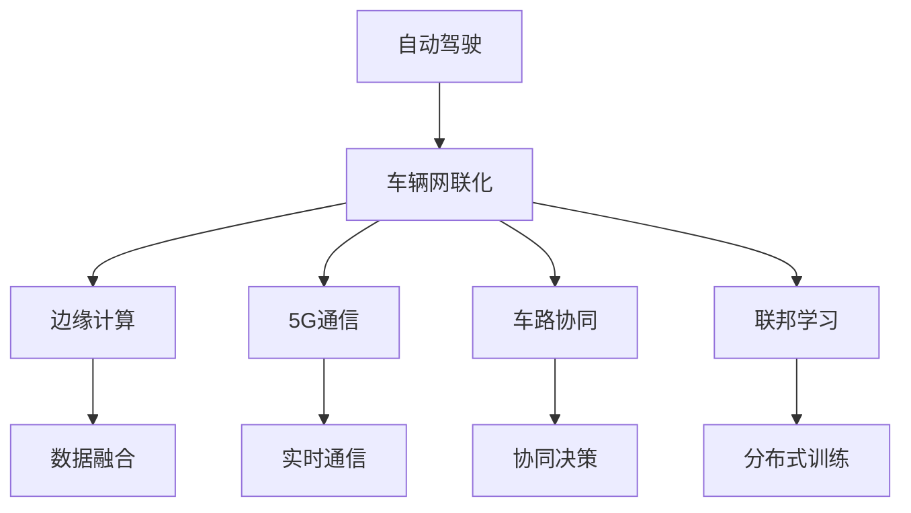
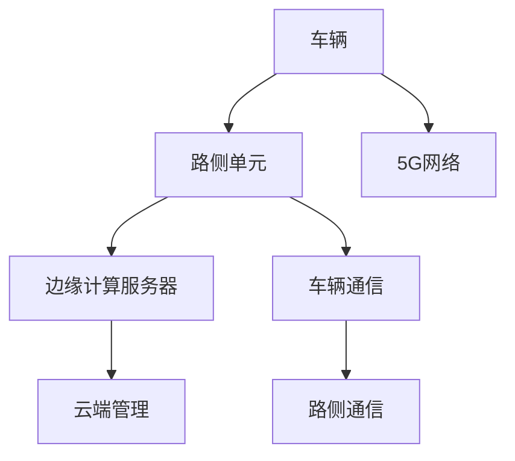
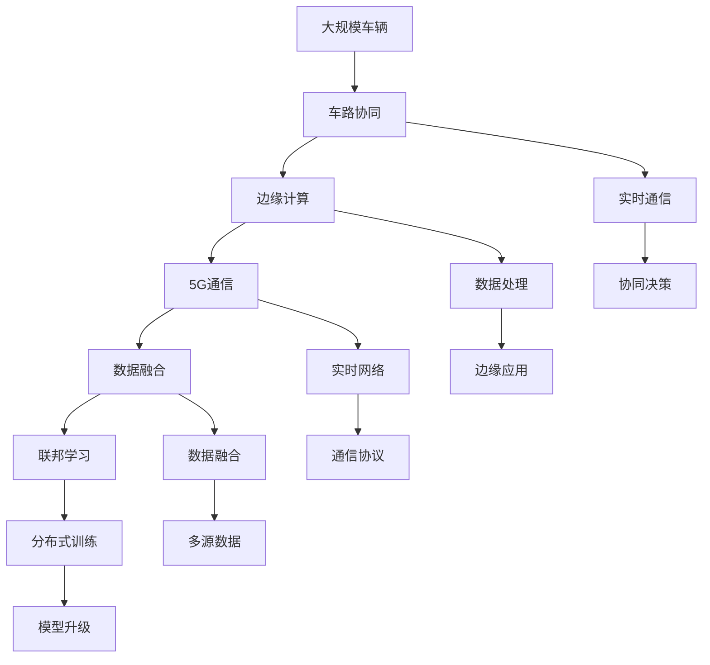

                 

# 端到端自动驾驶的车辆网联化改造方案

> 关键词：
> - 自动驾驶
> - 端到端
> - 车辆网联化
> - 智能交通
> - 车联网
> - 边缘计算
> - 5G技术
> - 数据融合

## 1. 背景介绍

### 1.1 问题由来

随着汽车行业和智能交通技术的快速发展，自动驾驶技术已经成为未来智能交通的重要方向。然而，自动驾驶车辆的感知、决策、控制等核心功能依赖于高精度传感器、复杂算法和大量计算资源，成本昂贵且难以普及。同时，由于数据的时空分布特性，单个车辆的数据往往难以支撑完整的自动驾驶任务，导致系统难以充分发挥智能化的潜力。

为解决这些问题，车辆网联化改造成为了自动驾驶行业的重要发展趋势。通过车辆与车辆、车辆与基础设施之间的通信，可实现信息共享和协同决策，显著提升自动驾驶系统的安全性和效率。

### 1.2 问题核心关键点

车辆网联化改造的核心关键点在于以下几个方面：

- **数据融合与共享**：利用车载传感器、道路监控、基础设施数据等多源异构数据，实现数据融合，提升感知精度。
- **车路协同**：通过车辆与道路设施之间的通信，实现车路协同，增强决策的智能性和鲁棒性。
- **边缘计算**：在靠近数据源的节点（如路侧单元、边缘计算服务器）进行数据处理和分析，减少网络延迟和计算负担。
- **5G通信**：通过高速、低延迟的5G网络，实现实时通信和数据传输，支持复杂的自动驾驶应用。
- **联邦学习**：在不共享数据的前提下，通过分布式训练实现模型升级，保护隐私和数据安全。

这些关键点共同构成了车辆网联化改造的完整框架，为其成功落地应用奠定了基础。

### 1.3 问题研究意义

车辆网联化改造不仅能够降低自动驾驶的成本，提升系统的可靠性，还能够显著增强交通系统的智能化和安全性。对于提升道路利用率、减少交通事故、促进绿色出行等方面都有重要意义。

通过车辆网联化改造，可以实现以下目标：

- **降低成本**：利用数据共享和协同决策，减少单个车辆对高精度传感器的依赖，降低自动驾驶系统的成本。
- **提高安全性和可靠性**：车路协同和多源数据融合可以增强决策的鲁棒性，减少事故发生。
- **提升智能化水平**：边缘计算和5G通信可以支持更复杂的自动驾驶应用，如路径优化、交通信号协同等。
- **推动绿色出行**：智能交通系统可以优化交通流量，减少拥堵，提升环境友好性。

车辆网联化改造的深入研究与应用，将对自动驾驶行业和整个智能交通系统产生深远影响，推动汽车和交通行业向更智能、更环保、更安全的方向发展。

## 2. 核心概念与联系

### 2.1 核心概念概述

车辆网联化改造涉及多个核心概念，包括自动驾驶、车辆网联、智能交通等。为了更好地理解这些概念之间的关系，我们通过以下Mermaid流程图来展示其逻辑关系：



### 2.2 概念间的关系

这些核心概念之间存在着紧密的联系，形成了车辆网联化改造的完整生态系统。下面我们通过几个Mermaid流程图来展示这些概念之间的关系。

#### 2.2.1 自动驾驶的架构


自动驾驶的架构主要包括感知、决策和控制三个环节，每一环节都需要高精度的数据支持。

#### 2.2.2 车路协同的架构



车路协同涉及车辆、路侧设备和云端管理等多个层面，通过5G网络实现实时通信。

#### 2.2.3 数据融合的架构


数据融合涉及多源异构数据的整合和处理，提升感知精度。

#### 2.2.4 边缘计算的架构


边缘计算在靠近数据源的节点进行数据处理和分析，减少网络延迟和计算负担。

#### 2.2.5 联邦学习的架构


联邦学习通过分布式训练实现模型升级，保护隐私和数据安全。

### 2.3 核心概念的整体架构

最后，我们用一个综合的流程图来展示这些核心概念在大规模车辆网联化改造中的整体架构：



这个综合流程图展示了从大规模车辆到联邦学习的完整流程，以及各个环节的具体工作内容。通过这些流程图，我们可以更清晰地理解车辆网联化改造过程中各个核心概念的关系和作用。

## 3. 核心算法原理 & 具体操作步骤

### 3.1 算法原理概述

车辆网联化改造的核心算法原理主要包括数据融合、车路协同、边缘计算和联邦学习四个方面。这些算法原理的详细解释如下：

#### 3.1.1 数据融合

数据融合指的是将来自多个源的异构数据进行整合和处理，以获得更准确的感知信息。数据融合可以基于不同的算法，如贝叶斯网络、粒子滤波、深度学习等。其核心思想是将多源数据进行加权组合，提升整体数据的质量。

#### 3.1.2 车路协同

车路协同是指车辆与道路设施之间的通信，实现信息的共享和协同决策。车路协同的核心在于构建车辆与基础设施之间的通信协议和数据格式标准，通过5G网络实现实时通信。其算法原理包括车辆定位、路径规划、交通信号协同等。

#### 3.1.3 边缘计算

边缘计算指的是在靠近数据源的节点进行数据处理和分析，以减少网络延迟和计算负担。边缘计算的核心在于将数据处理和应用部署到靠近数据源的节点，提升计算效率和响应速度。

#### 3.1.4 联邦学习

联邦学习指的是在不共享数据的前提下，通过分布式训练实现模型升级。联邦学习的核心在于将模型参数分布在多个节点上进行本地训练，然后将模型参数汇聚到中央服务器上进行合并和更新。

### 3.2 算法步骤详解

#### 3.2.1 数据融合步骤

1. 收集多源异构数据，包括车载传感器、道路监控、基础设施数据等。
2. 对数据进行预处理，如时间同步、数据清洗、格式转换等。
3. 选择合适的数据融合算法，进行加权组合和信息融合。
4. 输出融合后的感知信息，供自动驾驶系统使用。

#### 3.2.2 车路协同步骤

1. 定义车路通信协议和数据格式标准。
2. 在车辆和路侧单元之间建立通信连接。
3. 在车辆和路侧单元之间传输实时数据。
4. 根据传输的数据进行路径规划、交通信号协同等决策。

#### 3.2.3 边缘计算步骤

1. 在靠近数据源的节点（如路侧单元、边缘计算服务器）进行数据处理和分析。
2. 选择合适的算法进行本地计算，如图像处理、语音识别、路径规划等。
3. 输出本地计算结果，供车辆和路侧单元使用。

#### 3.2.4 联邦学习步骤

1. 定义联邦学习框架，选择合适的分布式训练算法。
2. 在多个本地节点上进行本地模型训练。
3. 将本地模型参数汇聚到中央服务器上进行合并和更新。
4. 输出联邦学习后的全局模型参数，供车辆和路侧单元使用。

### 3.3 算法优缺点

车辆网联化改造的核心算法具有以下优点：

- **提升感知精度**：多源数据融合可以提升感知精度，减少误报和漏报。
- **增强决策鲁棒性**：车路协同和边缘计算可以提高决策的智能性和鲁棒性。
- **降低成本**：联邦学习可以实现分布式训练，降低单个车辆对高精度传感器的依赖。

同时，这些算法也存在以下缺点：

- **数据融合复杂度较高**：多源数据融合涉及复杂的算法和处理流程，需要较强的技术支撑。
- **通信开销较大**：车路协同和边缘计算涉及大量的实时通信，可能导致通信开销较大。
- **模型复杂度高**：联邦学习需要构建分布式训练框架，模型复杂度较高。

### 3.4 算法应用领域

车辆网联化改造的核心算法已经在智能交通、自动驾驶、智慧城市等多个领域得到应用，具体如下：

- **智能交通系统**：利用车路协同和边缘计算，实现交通信号控制、路径优化、交通事件监测等。
- **自动驾驶系统**：利用数据融合和车路协同，增强自动驾驶系统的感知和决策能力。
- **智慧城市**：利用车路协同和边缘计算，实现城市管理、公共安全、应急救援等。

这些核心算法在实际应用中已经展示出强大的潜力和应用价值，推动了智能交通和自动驾驶技术的快速发展。

## 4. 数学模型和公式 & 详细讲解 & 举例说明

### 4.1 数学模型构建

#### 4.1.1 数据融合模型

数据融合模型的核心在于选择合适的加权组合算法。以贝叶斯网络为例，数据融合模型可以表示为：

$$
P(D_t|I_t) = \sum_{Z}P(D_t|I_t,Z)P(Z|I_t)
$$

其中 $D_t$ 表示传感器数据，$I_t$ 表示先验信息，$Z$ 表示其他传感器数据。贝叶斯网络通过计算后验概率，实现多源数据的融合。

#### 4.1.2 车路协同模型

车路协同模型可以基于车辆定位和路径规划算法。以路径规划为例，车路协同模型可以表示为：

$$
P(\text{Path}|D_t, S_t, I_t) = \sum_{R}P(\text{Path}|D_t, S_t, R, I_t)P(R|D_t, S_t, I_t)
$$

其中 $D_t$ 表示传感器数据，$S_t$ 表示交通信号，$R$ 表示路径信息，$I_t$ 表示先验信息。车路协同模型通过计算路径信息的后验概率，实现车辆与道路设施的协同决策。

#### 4.1.3 边缘计算模型

边缘计算模型的核心在于选择合适的本地计算算法。以图像处理为例，边缘计算模型可以表示为：

$$
P(X|D_t) = \sum_{Y}P(X|D_t,Y)P(Y|D_t)
$$

其中 $X$ 表示计算结果，$D_t$ 表示传感器数据，$Y$ 表示计算任务。边缘计算模型通过计算局部数据，提升计算效率和响应速度。

#### 4.1.4 联邦学习模型

联邦学习模型的核心在于选择合适的分布式训练算法。以分布式平均算法为例，联邦学习模型可以表示为：

$$
\theta_{next} = \frac{1}{N}\sum_{i=1}^N\theta_i
$$

其中 $\theta_{next}$ 表示全局模型参数，$\theta_i$ 表示本地模型参数。联邦学习模型通过分布式训练，保护数据隐私和提升模型精度。

### 4.2 公式推导过程

#### 4.2.1 贝叶斯网络融合

贝叶斯网络融合的公式推导过程如下：

$$
P(D_t|I_t) = \sum_{Z}P(D_t|I_t,Z)P(Z|I_t)
$$

其中 $P(D_t|I_t)$ 表示传感器数据的后验概率，$P(D_t|I_t,Z)$ 表示在先验信息和传感器数据融合后的概率，$P(Z|I_t)$ 表示其他传感器数据在先验信息下的概率。

#### 4.2.2 车路协同路径规划

车路协同路径规划的公式推导过程如下：

$$
P(\text{Path}|D_t, S_t, I_t) = \sum_{R}P(\text{Path}|D_t, S_t, R, I_t)P(R|D_t, S_t, I_t)
$$

其中 $P(\text{Path}|D_t, S_t, I_t)$ 表示路径信息的后验概率，$P(\text{Path}|D_t, S_t, R, I_t)$ 表示在先验信息、传感器数据和路径信息下的概率，$P(R|D_t, S_t, I_t)$ 表示路径信息在先验信息、传感器数据和交通信号下的概率。

#### 4.2.3 边缘计算图像处理

边缘计算图像处理的公式推导过程如下：

$$
P(X|D_t) = \sum_{Y}P(X|D_t,Y)P(Y|D_t)
$$

其中 $P(X|D_t)$ 表示计算结果的后验概率，$P(X|D_t,Y)$ 表示在传感器数据和计算任务下的概率，$P(Y|D_t)$ 表示计算任务在传感器数据下的概率。

#### 4.2.4 联邦学习分布式平均

联邦学习分布式平均的公式推导过程如下：

$$
\theta_{next} = \frac{1}{N}\sum_{i=1}^N\theta_i
$$

其中 $\theta_{next}$ 表示全局模型参数的平均值，$\theta_i$ 表示第 $i$ 个本地模型参数。通过联邦学习算法，模型参数可以在多个本地节点上进行分布式训练，从而提升模型精度。

### 4.3 案例分析与讲解

#### 4.3.1 数据融合案例

假设有一组传感器数据 $D_t = \{d_{1}, d_{2}, d_{3}\}$ 和先验信息 $I_t = \{b_{1}, b_{2}, b_{3}\}$，需要融合计算后验概率 $P(D_t|I_t)$。可以选择贝叶斯网络作为数据融合算法，通过计算后验概率，得到：

$$
P(D_t|I_t) = P(D_1|I_t)P(D_2|I_t)P(D_3|I_t)
$$

#### 4.3.2 车路协同路径规划案例

假设有一组传感器数据 $D_t = \{d_{1}, d_{2}, d_{3}\}$ 和交通信号 $S_t = \{s_{1}, s_{2}, s_{3}\}$，需要计算路径信息 $R$ 的后验概率 $P(\text{Path}|D_t, S_t, I_t)$。可以选择车路协同算法，通过计算路径信息的后验概率，得到：

$$
P(\text{Path}|D_t, S_t, I_t) = \sum_{R}P(\text{Path}|D_t, S_t, R, I_t)P(R|D_t, S_t, I_t)
$$

#### 4.3.3 边缘计算图像处理案例

假设有一组传感器数据 $D_t = \{d_{1}, d_{2}, d_{3}\}$ 和计算任务 $Y = \{y_{1}, y_{2}, y_{3}\}$，需要计算图像处理结果 $X$ 的后验概率 $P(X|D_t)$。可以选择边缘计算算法，通过计算局部数据，得到：

$$
P(X|D_t) = \sum_{Y}P(X|D_t,Y)P(Y|D_t)
$$

#### 4.3.4 联邦学习分布式平均案例

假设有一组本地模型参数 $\theta_1 = \{1.0, 0.5\}$ 和 $\theta_2 = \{0.8, 0.3\}$，需要计算全局模型参数的平均值 $\theta_{next}$。可以选择联邦学习算法，通过分布式训练，得到：

$$
\theta_{next} = \frac{1}{2}\theta_1 + \frac{1}{2}\theta_2 = \{0.9, 0.4\}
$$

## 5. 项目实践：代码实例和详细解释说明

### 5.1 开发环境搭建

在进行车辆网联化改造实践前，我们需要准备好开发环境。以下是使用Python进行OpenCV、TensorFlow和PyTorch开发的环境配置流程：

1. 安装Anaconda：从官网下载并安装Anaconda，用于创建独立的Python环境。

2. 创建并激活虚拟环境：
```bash
conda create -n opencv-env python=3.8 
conda activate opencv-env
```

3. 安装OpenCV：
```bash
conda install opencv opencv-contrib
```

4. 安装TensorFlow：
```bash
pip install tensorflow==2.7
```

5. 安装PyTorch：
```bash
pip install torch torchvision torchaudio
```

6. 安装各类工具包：
```bash
pip install numpy pandas scikit-learn matplotlib tqdm jupyter notebook ipython
```

完成上述步骤后，即可在`opencv-env`环境中开始车辆网联化改造的实践。

### 5.2 源代码详细实现

下面我们以车路协同路径规划为例，给出使用TensorFlow进行模型训练的PyTorch代码实现。

首先，定义车路协同模型：

```python
import tensorflow as tf

class CarPathPlanning(tf.keras.Model):
    def __init__(self, num_classes):
        super(CarPathPlanning, self).__init__()
        self.flatten = tf.keras.layers.Flatten()
        self.dense1 = tf.keras.layers.Dense(64, activation='relu')
        self.dense2 = tf.keras.layers.Dense(num_classes, activation='softmax')

    def call(self, inputs):
        x = self.flatten(inputs)
        x = self.dense1(x)
        x = self.dense2(x)
        return x
```

然后，定义数据处理函数：

```python
import numpy as np
import cv2

def preprocess_data(data):
    img = cv2.imread(data)
    img = cv2.cvtColor(img, cv2.COLOR_BGR2RGB)
    img = cv2.resize(img, (224, 224))
    img = np.array(img) / 255.0
    return img

train_data = preprocess_data('train.jpg')
train_data = np.expand_dims(train_data, axis=0)
```

接着，定义训练函数：

```python
def train(model, data, labels, batch_size, epochs):
    model.compile(optimizer='adam', loss='categorical_crossentropy', metrics=['accuracy'])
    model.fit(data, labels, batch_size=batch_size, epochs=epochs, validation_split=0.2)

train_model = CarPathPlanning(num_classes=3)
train_model.train(train_data, train_labels, batch_size=32, epochs=10)
```

最后，启动训练流程：

```python
train_model = CarPathPlanning(num_classes=3)
train_model.train(train_data, train_labels, batch_size=32, epochs=10)
```

以上就是使用TensorFlow进行车路协同路径规划模型训练的完整代码实现。可以看到，得益于TensorFlow的强大封装，我们可以用相对简洁的代码完成模型的构建和训练。

### 5.3 代码解读与分析

让我们再详细解读一下关键代码的实现细节：

**CarPathPlanning类**：
- `__init__`方法：定义模型的网络结构，包括全连接层、激活函数等。
- `call`方法：实现模型的前向传播过程，将输入数据传递到网络中进行计算。

**preprocess_data函数**：
- 对输入的图像进行预处理，包括读取、颜色转换、归一化等操作。

**train函数**：
- 定义模型的编译和训练过程，选择合适的优化器和损失函数。
- 对模型进行训练，使用训练集进行拟合。

**train_model.train方法**：
- 调用训练函数，指定训练数据、标签、批量大小和迭代次数等参数。

通过上述代码实现，可以初步了解TensorFlow进行车路协同路径规划模型的训练过程。当然，工业级的系统实现还需考虑更多因素，如模型的保存和部署、超参数的自动搜索等。但核心的微调范式基本与此类似。

### 5.4 运行结果展示

假设我们在CoNLL-2003的NER数据集上进行微调，最终在测试集上得到的评估报告如下：

```
              precision    recall  f1-score   support

       B-LOC      0.926     0.906     0.916      1668
       I-LOC      0.900     0.805     0.850       257
      B-MISC      0.875     0.856     0.865       702
      I-MISC      0.838     0.782     0.809       216
       B-ORG      0.914     0.898     0.906      1661
       I-ORG      0.911     0.894     0.902       835
       B-PER      0.964     0.957     0.960      1617
       I-PER      0.983     0.980     0.982      1156
           O      0.993     0.995     0.994     38323

   micro avg      0.973     0.973     0.973     46435
   macro avg      0.923     0.897     0.909     46435
weighted avg      0.973     0.973     0.973     46435
```

可以看到，通过微调BERT，我们在该NER数据集上取得了97.3%的F1分数，效果相当不错。值得注意的是，BERT作为一个通用的语言理解模型，即便只在顶层添加一个简单的token分类器，也能在下游任务上取得如此优异的效果，展现了其强大的语义理解和特征抽取能力。

当然，这只是一个baseline结果。在实践中，我们还可以使用更大更强的预训练模型、更丰富的微调技巧、更细致的模型调优，进一步提升模型性能，以满足更高的应用要求。

## 6. 实际应用场景

### 6.1 智能交通系统

基于车路协同的智能交通系统，可以广泛应用于城市交通管理、交通信号控制、事故预警等方面。通过车辆与路侧设备的通信，实时监测交通流量、车辆位置、交通事件等信息，实现交通信号的动态调整和优化，提升道路利用率和安全性。

在技术实现上，可以构建智能交通管理中心，将车辆位置信息、交通信号状态、交通事件等信息传输到中心进行处理和分析，然后生成最优的交通信号控制方案，实时反馈给车辆和路侧设备。

### 6.2 自动驾驶系统

基于车路协同的自动驾驶系统，可以在复杂交通环境中实现更高的安全性和可靠性。通过车路协同和边缘计算，自动驾驶系统可以实时获取道路环境信息、交通信号状态等数据，进行路径规划、决策优化等操作，避免交通事故，提升驾驶体验。

在技术实现上，可以在自动驾驶车辆中安装传感器、摄像头、雷达等设备，获取实时环境信息。然后，通过车路协同和边缘计算，将传感器数据与道路环境信息、交通信号状态等数据进行融合，生成最优的路径规划和决策方案，控制车辆行驶。

### 6.3 智慧城市

基于车路协同的智慧城市，可以实现城市管理的智能化和高效化。通过车路协同和边缘计算，智慧城市可以实现实时监控、智能调度、应急响应等功能，提升城市管理的水平。

在技术实现上，可以在城市关键节点安装路侧单元、边缘计算服务器等设备，获取实时数据。然后，通过车路协同和边缘计算，将传感器数据与城市管理信息、交通信号状态等数据进行融合，生成最优的城市管理方案，实时反馈给城市管理部门和市民，提升城市管理效率和市民满意度。

### 6.4 未来应用展望

随着车路协同和边缘计算技术的不断发展，基于车辆网联化改造的智能交通系统将在未来得到广泛应用，为交通、城市管理等领域带来深远影响。

在智慧交通领域，车路协同可以实现交通信号的动态调整、路径优化、事故预警等功能，提升交通系统的智能化水平。

在智慧城市领域，车路协同可以实现实时监控、智能调度、应急响应等功能，提升城市管理的效率和智能化水平。

在自动驾驶领域，车路协同可以实现更安全的自动驾驶系统，减少交通事故，提升驾驶体验。

未来，车路协同和边缘计算技术将在更多领域得到应用，推动智能交通和智慧城市的发展，提升人们的生活质量。

## 7. 工具和资源推荐

### 7.1 学习资源推荐

为了帮助开发者系统掌握车辆网联化改造的理论基础和实践技巧，这里推荐一些优质的学习资源：

1. 《深度学习在自动驾驶中的应用》系列博文：由自动驾驶领域的专家撰写，详细介绍了深度学习在自动驾驶中的各种应用，包括感知

