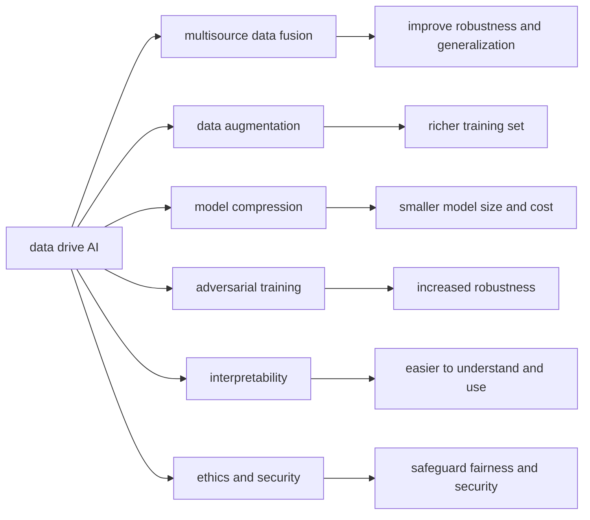
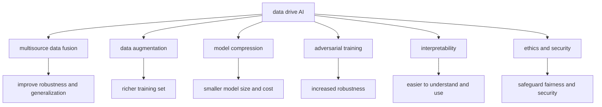
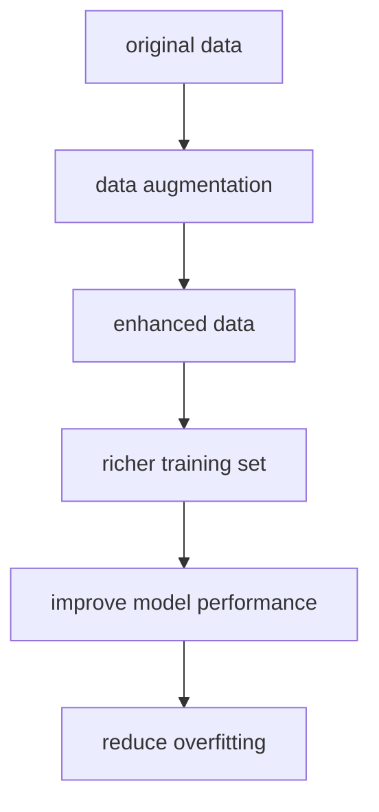
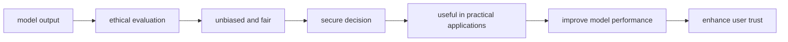
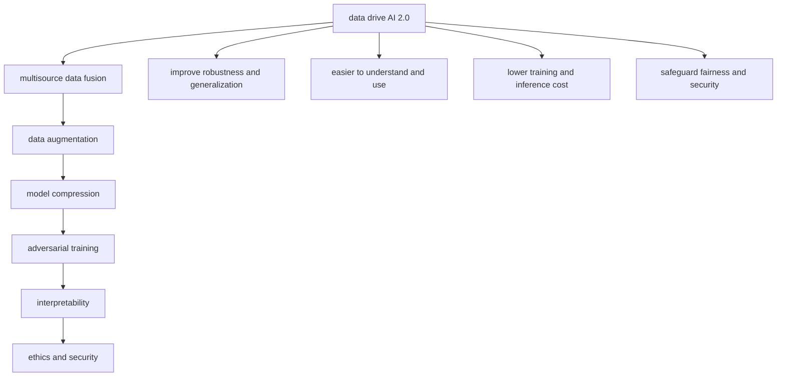

                 

# 第二代人工智能的数据驱动

## 1. 背景介绍

### 1.1 问题由来
自从第一次人工智能浪潮以来，数据驱动的AI方法已经在许多领域取得了巨大的成功。无论是图像识别、语音识别、自然语言处理，还是游戏AI、推荐系统，数据驱动的机器学习模型已经成为了主流技术。然而，尽管这些模型在各类任务上表现出色，但仍然存在许多难以解决的问题。

- **数据质量和标签偏差**：训练数据的质量和标签的偏差，会直接影响模型的性能。如果数据有偏差，那么模型的泛化能力将受到影响，导致在实际应用中表现不佳。
- **模型复杂度和训练成本**：模型越复杂，需要的数据和计算资源就越多，训练成本和推理成本也会相应增加。对于大模型而言，这无疑是一个巨大的挑战。
- **可解释性和鲁棒性**：现有的深度学习模型，往往是"黑盒"模型，难以解释其决策过程。同时，模型对于噪声和干扰的鲁棒性也值得进一步研究。
- **伦理和安全性问题**：AI模型在决策过程中，可能会引入偏见和歧视，导致不公正的输出结果。如何在设计和使用过程中，保证模型的伦理和安全，也是不容忽视的问题。

### 1.2 问题核心关键点
为了解决上述问题，第二代人工智能的数据驱动方法（简称"数据驱动AI 2.0"）应运而生。这一方法的核心思想是：利用更多的数据和更好的数据处理方法，来提升模型的性能，同时通过引入更多数据来源和数据获取手段，来降低模型的复杂度和训练成本。

具体而言，数据驱动AI 2.0强调以下几个方面：

- **多源数据融合**：利用不同来源和形式的数据进行融合，提升模型的鲁棒性和泛化能力。
- **数据增强和扩充**：通过数据增强和扩充，丰富训练集的规模和多样性，防止过拟合。
- **模型压缩和优化**：通过模型压缩和优化，减小模型复杂度，降低训练和推理成本。
- **对抗训练和鲁棒性提升**：通过对抗训练等方法，提升模型的鲁棒性和泛化能力。
- **可解释性和透明度**：通过引入可解释性技术，提升模型的透明度，便于理解和使用。
- **伦理和安全保障**：通过伦理约束和安全设计，确保模型的决策公正性和安全性。

## 2. 核心概念与联系

### 2.1 核心概念概述

为了更好地理解数据驱动AI 2.0，本节将介绍几个密切相关的核心概念：

- **数据驱动AI**：利用大规模数据进行模型训练和优化，从而获得高精度的预测或决策。数据驱动AI是人工智能发展的重要基石。
- **多源数据融合**：将多个来源和形式的数据进行整合和融合，提升模型的鲁棒性和泛化能力。
- **数据增强**：通过对原始数据进行各种变换，生成新的训练样本，丰富训练集的规模和多样性。
- **模型压缩**：通过剪枝、量化、蒸馏等方法，减小模型的复杂度和存储需求，降低计算成本。
- **对抗训练**：通过引入对抗样本，提高模型对于噪声和干扰的鲁棒性，提升模型的泛化能力。
- **可解释性**：通过可解释性技术，提升模型的透明度，便于理解和使用。
- **伦理和安全**：通过设计伦理约束和安全机制，确保模型的决策公正性和安全性。

这些概念之间的逻辑关系可以通过以下Mermaid流程图来展示：



这个流程图展示了大数据驱动AI各个核心概念之间的联系：

1. 数据驱动AI利用大规模数据进行模型训练和优化。
2. 多源数据融合通过整合多个数据来源，提升模型的鲁棒性和泛化能力。
3. 数据增强通过生成新的训练样本，丰富训练集的规模和多样性。
4. 模型压缩通过减小模型复杂度，降低训练和推理成本。
5. 对抗训练通过提高模型的鲁棒性，提升泛化能力。
6. 可解释性通过提升透明度，便于理解和使用。
7. 伦理和安全通过设计约束和机制，确保决策公正性和安全性。

### 2.2 概念间的关系

这些核心概念之间存在着紧密的联系，形成了数据驱动AI 2.0的完整生态系统。下面我通过几个Mermaid流程图来展示这些概念之间的关系。

#### 2.2.1 数据驱动AI的核心框架



这个流程图展示了数据驱动AI 2.0的核心框架，即利用多源数据融合、数据增强、模型压缩、对抗训练、可解释性、伦理和安全的六个模块，来提升模型的性能和可靠性。

#### 2.2.2 多源数据融合的详细过程


这个流程图展示了多源数据融合的过程。首先，将两个来源的数据进行合并，然后通过数据融合技术，整合为统一的训练集。这样，得到的训练集更加丰富和多样，能够提升模型的泛化能力和鲁棒性。

#### 2.2.3 数据增强的具体方法



这个流程图展示了数据增强的具体方法。通过对原始数据进行各种变换，生成新的训练样本，得到更加丰富和多样化的训练集。这样，可以有效地减少过拟合，提升模型的泛化能力。

#### 2.2.4 模型压缩的主要技术


这个流程图展示了模型压缩的主要技术。首先通过剪枝减小模型的复杂度，然后通过量化减小模型的存储需求，最后通过蒸馏减小模型的推理成本。这样，模型的大小和成本都得到了优化。

#### 2.2.5 对抗训练的基本流程


这个流程图展示了对抗训练的基本流程。首先生成对抗样本，然后通过模型训练，使其能够防御这些样本的攻击，从而提高模型的鲁棒性。这样，模型在实际应用中更加稳定和安全。

#### 2.2.6 可解释性的关键技术


这个流程图展示了可解释性的关键技术。通过引入可解释性技术，使得模型更加透明，便于理解和使用。这样，可以提升决策的透明度和可控性。

#### 2.2.7 伦理和安全的保障机制



这个流程图展示了伦理和安全的保障机制。通过设计伦理约束和安全机制，确保模型的决策公正性和安全性，从而提升用户信任。

### 2.3 核心概念的整体架构

最后，我们用一个综合的流程图来展示这些核心概念在大数据驱动AI 2.0的完整过程中：



这个综合流程图展示了从数据驱动AI 2.0到多源数据融合、数据增强、模型压缩、对抗训练、可解释性、伦理和安全的完整过程。通过这些步骤，可以构建一个更加稳定、高效、透明、公平、安全的AI系统。

## 3. 核心算法原理 & 具体操作步骤
### 3.1 算法原理概述

数据驱动AI 2.0的核心思想是：利用更多的数据和更好的数据处理方法，来提升模型的性能，同时通过引入更多数据来源和数据获取手段，来降低模型的复杂度和训练成本。

具体而言，数据驱动AI 2.0强调以下几个方面：

- **多源数据融合**：将多个来源和形式的数据进行整合和融合，提升模型的鲁棒性和泛化能力。
- **数据增强**：通过对原始数据进行各种变换，生成新的训练样本，丰富训练集的规模和多样性。
- **模型压缩**：通过剪枝、量化、蒸馏等方法，减小模型的复杂度和存储需求，降低计算成本。
- **对抗训练**：通过引入对抗样本，提高模型对于噪声和干扰的鲁棒性，提升模型的泛化能力。
- **可解释性**：通过引入可解释性技术，提升模型的透明度，便于理解和使用。
- **伦理和安全**：通过设计伦理约束和安全机制，确保模型的决策公正性和安全性。

这些步骤的具体实现，将通过以下算法步骤详解。

### 3.2 算法步骤详解

#### 3.2.1 数据收集和预处理

首先，需要收集和预处理数据。这一步可以分为以下几步：

1. **数据源选择**：根据任务需求，选择合适的数据源。数据源可以包括公共数据集、自有数据、用户生成数据等。
2. **数据清洗**：对数据进行清洗，去除噪音、缺失值等不合理的记录。
3. **数据标注**：对数据进行标注，生成训练集的标签。标注方式可以包括自动标注、人工标注等。
4. **数据归一化**：对数据进行归一化，使其符合模型输入的要求。例如，图像数据需要进行归一化，文本数据需要进行分词和标记。

#### 3.2.2 多源数据融合

多源数据融合是将多个来源和形式的数据进行整合和融合，提升模型的鲁棒性和泛化能力。这一步骤可以分为以下几步：

1. **数据对齐**：将不同数据源的数据进行对齐，确保它们在格式和特征上的一致性。
2. **数据合并**：将对齐后的数据进行合并，生成统一的数据集。
3. **特征融合**：将合并后的数据进行特征融合，生成新的特征向量。特征融合方式可以包括拼接、加权平均等。

#### 3.2.3 数据增强

数据增强是通过对原始数据进行各种变换，生成新的训练样本，丰富训练集的规模和多样性。这一步骤可以分为以下几步：

1. **数据扩充**：通过扩充训练集的规模，增加模型的训练数据量。例如，通过数据增强技术，生成更多的训练样本。
2. **数据变换**：对数据进行变换，生成新的样本。例如，对于图像数据，可以进行旋转、缩放、裁剪等变换。
3. **数据增强**：将变换后的数据与原始数据合并，生成新的训练集。

#### 3.2.4 模型压缩

模型压缩是通过剪枝、量化、蒸馏等方法，减小模型的复杂度和存储需求，降低计算成本。这一步骤可以分为以下几步：

1. **剪枝**：通过剪枝去除冗余的参数，减小模型的复杂度。剪枝方式可以包括结构剪枝、权重剪枝等。
2. **量化**：通过量化减小模型的存储需求，降低计算成本。量化方式可以包括整数量化、半精度量化等。
3. **蒸馏**：通过蒸馏减小模型的推理成本，提升推理速度。蒸馏方式可以包括知识蒸馏、梯度蒸馏等。

#### 3.2.5 对抗训练

对抗训练是通过引入对抗样本，提高模型对于噪声和干扰的鲁棒性，提升模型的泛化能力。这一步骤可以分为以下几步：

1. **生成对抗样本**：通过生成对抗样本，测试模型的鲁棒性。对抗样本可以包括噪声、干扰、异常等。
2. **训练模型**：通过对抗样本进行模型训练，提升模型的鲁棒性。
3. **测试和验证**：对训练后的模型进行测试和验证，确保其鲁棒性。

#### 3.2.6 可解释性

可解释性是通过引入可解释性技术，提升模型的透明度，便于理解和使用。这一步骤可以分为以下几步：

1. **选择可解释性方法**：根据任务需求，选择适合的可解释性方法。例如，可以采用LIME、SHAP等方法。
2. **生成可解释性报告**：通过可解释性方法生成报告，解释模型的决策过程。
3. **应用可解释性报告**：将可解释性报告应用于模型的使用和维护，提升模型的透明度和可控性。

#### 3.2.7 伦理和安全保障

伦理和安全保障是通过设计伦理约束和安全机制，确保模型的决策公正性和安全性。这一步骤可以分为以下几步：

1. **设计伦理约束**：根据任务需求，设计伦理约束机制，确保模型的决策公正性和透明性。例如，可以设计决策透明性约束、公平性约束等。
2. **设计安全机制**：根据任务需求，设计安全机制，确保模型的安全性。例如，可以设计数据脱敏、访问控制等机制。
3. **应用伦理和安全机制**：将伦理和安全机制应用于模型的使用和维护，确保其决策公正性和安全性。

### 3.3 算法优缺点

数据驱动AI 2.0作为一种数据驱动的方法，具有以下优点：

1. **提升模型性能**：通过多源数据融合、数据增强、模型压缩、对抗训练等方法，可以显著提升模型的性能，特别是在处理大规模数据集时表现尤为突出。
2. **降低训练成本**：通过模型压缩、数据增强等方法，可以减小模型的复杂度和训练成本，使得模型训练更加高效。
3. **提高鲁棒性**：通过对抗训练等方法，可以提高模型对于噪声和干扰的鲁棒性，提升模型的泛化能力。
4. **增强可解释性**：通过引入可解释性技术，可以提升模型的透明度，便于理解和使用。
5. **保障公平和安全**：通过设计伦理和安全机制，可以确保模型的决策公正性和安全性，提升用户信任。

同时，数据驱动AI 2.0也存在一些缺点：

1. **数据来源复杂**：多源数据融合需要处理不同来源和形式的数据，可能会引入数据不一致性和多样性问题。
2. **数据标注成本高**：数据标注是一个耗时耗力的过程，特别是在标注大量数据时，成本较高。
3. **模型复杂度高**：模型压缩虽然可以减小模型复杂度，但有时可能会导致模型精度下降。
4. **对抗样本生成困难**：对抗样本的生成是一个复杂的过程，需要一定的技术和资源支持。
5. **伦理和安全约束设计复杂**：设计伦理和安全机制需要考虑多种因素，有时可能会面临伦理和技术上的挑战。

尽管存在这些缺点，但数据驱动AI 2.0在提升模型性能和降低训练成本方面具有明显的优势，仍然是一种值得推广和应用的方法。

### 3.4 算法应用领域

数据驱动AI 2.0在各个领域都具有广泛的应用，以下是一些典型的应用场景：

1. **计算机视觉**：在图像识别、目标检测、图像生成等领域，数据驱动AI 2.0可以显著提升模型的性能，特别是在处理大规模数据集时表现尤为突出。
2. **自然语言处理**：在机器翻译、情感分析、文本生成等领域，数据驱动AI 2.0可以提升模型的泛化能力和鲁棒性，特别是在处理长文本数据时表现尤为突出。
3. **语音识别**：在语音识别和合成领域，数据驱动AI 2.0可以提升模型的鲁棒性和泛化能力，特别是在处理嘈杂环境和多说话人场景时表现尤为突出。
4. **推荐系统**：在推荐系统中，数据驱动AI 2.0可以提升模型的鲁棒性和泛化能力，特别是在处理大规模用户数据时表现尤为突出。
5. **医疗诊断**：在医疗诊断领域，数据驱动AI 2.0可以提升模型的精度和鲁棒性，特别是在处理复杂的医学数据时表现尤为突出。
6. **金融风控**：在金融风控领域，数据驱动AI 2.0可以提升模型的泛化能力和鲁棒性，特别是在处理大规模金融数据时表现尤为突出。

## 4. 数学模型和公式 & 详细讲解

### 4.1 数学模型构建

本节将使用数学语言对数据驱动AI 2.0中的关键步骤进行更加严格的刻画。

假设我们有一个多源数据集 $\{(x_i, y_i)\}_{i=1}^N$，其中 $x_i$ 为原始数据，$y_i$ 为标签。

多源数据融合的目标是将多个来源和形式的数据进行整合和融合，生成一个新的数据集 $\{(x'_i, y'_i)\}_{i=1}^M$，其中 $x'_i$ 为融合后的数据，$y'_i$ 为标签。

假设融合后的数据集 $\{(x'_i, y'_i)\}_{i=1}^M$ 中，每个样本由 $n$ 个特征组成，即 $x'_i = [x'_1^i, x'_2^i, ..., x'_n^i]$。

模型压缩的目标是减小模型的复杂度，减小模型的大小和计算成本。假设原始模型为 $f(x)$，压缩后的模型为 $f'(x)$。

对抗训练的目标是通过引入对抗样本，提高模型对于噪声和干扰的鲁棒性，提升模型的泛化能力。假设原始模型为 $f(x)$，对抗模型为 $g(x)$。

可解释性的目标是通过引入可解释性技术，提升模型的透明度，便于理解和使用。假设原始模型为 $f(x)$，可解释模型为 $h(x)$。

伦理和安全的目标是通过设计伦理和安全机制，确保模型的决策公正性和安全性。假设原始模型为 $f(x)$，伦理模型为 $h(x)$。

### 4.2 公式推导过程

#### 4.2.1 多源数据融合的公式推导

多源数据融合的目标是将多个来源和形式的数据进行整合和融合，生成一个新的数据集 $\{(x'_i, y'_i)\}_{i=1}^M$，其中 $x'_i$ 为融合后的数据，$y'_i$ 为标签。

假设原始数据集 $\{(x_i, y_i)\}_{i=1}^N$ 中，每个样本由 $n$ 个特征组成，即 $x_i = [x_1^i, x_2^i, ..., x_n^i]$。

多源数据融合的过程可以分为以下几步：

1. **数据对齐**：将不同数据源的数据进行对齐，确保它们在格式和特征上的一致性。
2. **数据合并**：将对齐后的数据进行合并，生成统一的数据集。
3. **特征融合**：将合并后的数据进行特征融合，生成新的特征向量。

假设原始数据集 $\{(x_i, y_i)\}_{i=1}^N$ 中，每个样本由 $n$ 个特征组成，即 $x_i = [x_1^i, x_2^i, ..., x_n^i]$。

假设融合后的数据集 $\{(x'_i, y'_i)\}_{i=1}^M$ 中，每个样本由 $m$ 个特征组成，即 $x'_i = [x'_1^i, x'_2^i, ..., x'_m^i]$。

假设融合后的数据集 $\{(x'_i, y'_i)\}_{i=1}^M$ 中，每个样本的标签为 $y'_i$。

多源数据融合的公式推导如下：

$$
\{(x'_i, y'_i)\}_{i=1}^M = \{\alpha_1(x_1^i, y_1^i), \alpha_2(x_2^i, y_2^i), ..., \alpha_n(x_n^i, y_n^i)\}_{i=1}^N
$$

其中 $\alpha_k$ 为第 $k$ 个数据源的对齐和合并函数。

#### 4.2.2 数据增强的公式推导

数据增强的目标是通过对原始数据进行各种变换，生成新的训练样本，丰富训练集的规模和多样性。

假设原始数据集 $\{(x_i, y_i)\}_{i=1}^N$ 中，每个样本由 $n$ 个特征组成，即 $x_i = [x_1^i, x_2^i, ..., x_n^i]$。

数据增强的过程可以分为以下几步：

1. **数据扩充**：通过扩充训练集的规模，增加模型的训练数据量。
2. **数据变换**：对数据进行变换，生成新的样本。
3. **数据增强**：将变换后的数据与原始数据合并，生成新的训练集。

数据增强的公式推导如下：

$$
\{(x'_i, y'_i)\}_{i=1}^M = \{\beta_1(x_1^i, y_1^i), \beta_2(x_2^i, y_2^i), ..., \beta_n(x_n^i, y_n^i)\}_{i=1}^N
$$

其中 $\beta_k$ 为第 $k$ 个数据源的增强和变换函数。

#### 4.2.3 模型压缩的公式推导

模型压缩的目标是减小模型的复杂度，减小模型的大小和计算成本。

假设原始模型为 $f(x)$，压缩后的模型为 $f'(x)$。

模型压缩的过程可以分为以下几步：

1. **剪枝**：通过剪枝去除冗余的参数，减小模型的复杂度。
2. **量化**：通过量化减小模型的存储需求，降低计算成本。
3. **蒸馏**：通过蒸馏减小模型的推理成本，提升推理速度。

模型压缩的公式推导如下：

$$
f'(x) = \gamma(f(x))
$$

其中 $\gamma$ 为压缩函数，可以包括剪枝、量化、蒸馏等方法。

#### 4.2.4 对抗训练的公式推导

对抗训练的目标是通过引入对抗样本，提高模型对于噪声和干扰的鲁棒性，提升模型的泛化能力。

假设原始模型为 $f(x)$，对抗模型为 $g(x)$。

对抗训练的过程可以分为以下几步：

1. **生成对抗样本**：通过生成对抗样本，测试模型的鲁棒性。
2. **训练模型**：通过对抗样本进行模型训练，提升模型的鲁棒性。
3. **测试和验证**：对训练后的模型进行测试和验证，确保其鲁棒性。

对抗训练的公式推导如下：

$$
g(x) = \delta(f(x))
$$

其中 $\delta$ 为对抗函数，可以包括生成对抗样本等方法。

#### 4.2.5 可解释性的公式推导

可解释性的目标是通过引入可解释性技术，提升模型的透明度，便于理解和使用。

假设原始模型为 $f(x)$，可解释模型为 $h(x)$。

可解释性的公式推导如下：

$$
h(x) = \epsilon(f(x))
$$

其中 $\epsilon$ 为可解释性函数，可以包括LIME、SHAP等方法。

#### 4.2.6 伦理和安全的公式推导

伦理和安全的目标是通过设计伦理和安全机制，确保模型的决策公正性和安全性。

假设原始模型为 $f(x)$，伦理模型为 $h(x)$。

伦理和安全的公式推导如下：

$$
h(x) = \phi(f(x))
$$

其中 $\phi$ 为伦理和安全函数，可以包括设计伦理约束、设计安全机制等方法。

## 5. 项目实践：代码实例和详细解释说明

### 5.1 开发环境搭建

在进行数据驱动AI 2.0实践前，我们需要准备好开发环境。以下是使用Python进行PyTorch开发的环境配置流程：

1. 安装Anaconda：从官网下载并安装Anaconda，用于创建独立的Python环境。

2. 创建并激活虚拟环境：
```bash
conda create -n pytorch-env python=3.8 
conda activate pytorch-env
```

3.

