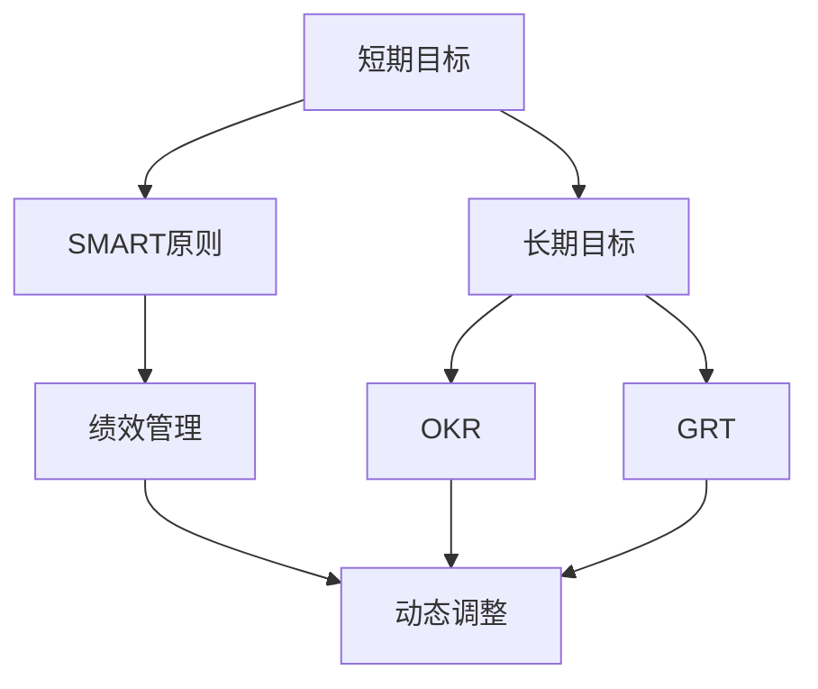
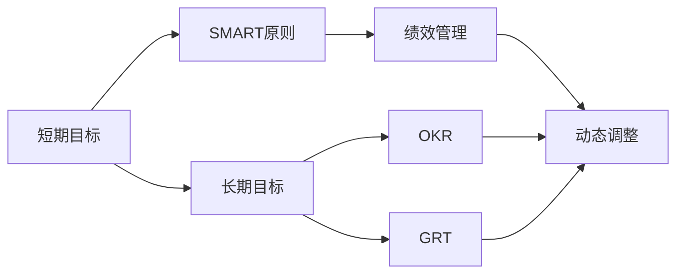
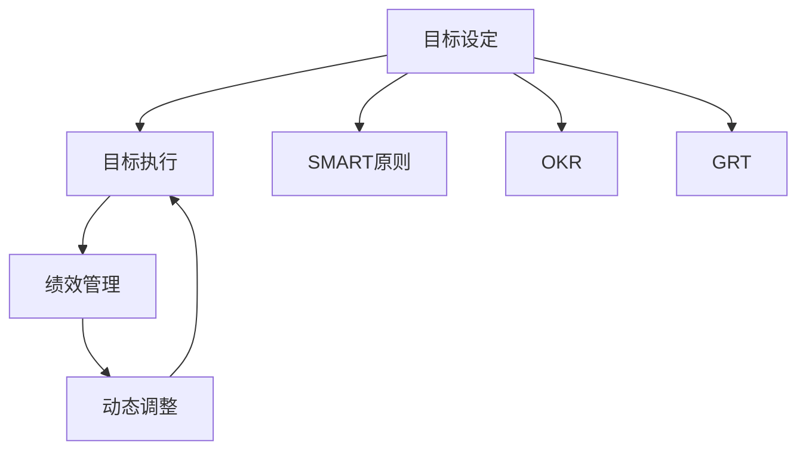
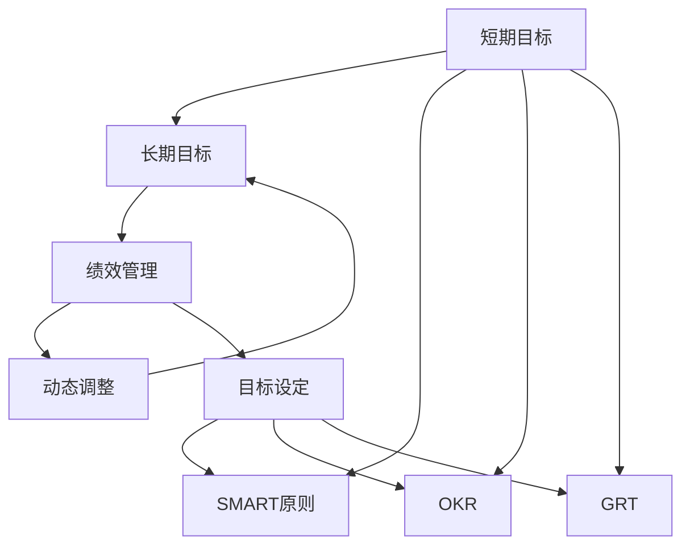

                 

# 管理短期目标与长期目标的意识机制

## 1. 背景介绍

在信息化高速发展的今天，高效管理目标成为了企业和个人成功的关键。目标管理，不仅关系到项目进度和资源利用效率，更直接影响着企业的战略执行和团队协作。然而，由于企业内外部环境的复杂多变，以及目标的多样性和动态性，如何有效地管理短期目标与长期目标，成为了一个亟待解决的难题。

### 1.1 目标管理的重要性
目标管理是企业战略执行的核心工具，能够帮助企业明确发展方向，合理配置资源，提升执行效率。根据管理学大师彼得·德鲁克（Peter Drucker）的观点，“目标管理是所有管理行为中最普遍、最有效的”。对于个人而言，目标管理能够增强自我驱动力，提升工作效率，实现职业发展。

### 1.2 目标管理的现状与问题
尽管目标管理的重要性不言而喻，但在实际应用中，仍存在诸多问题：
- **短期目标与长期目标的冲突**：企业或个人在追求短期业绩时，往往容易忽视长期战略的实施，导致资源配置失衡，战略方向偏移。
- **目标设定的模糊性**：目标设定过于模糊，缺乏量化和可执行性，使得执行过程中难以追踪和评估。
- **目标管理的僵化性**：目标设定后难以动态调整，缺乏灵活性，无法应对环境变化和突发事件。
- **目标执行的偏差**：执行过程中缺乏有效监督和反馈机制，导致目标偏差，最终无法达成预期目标。

## 2. 核心概念与联系

### 2.1 核心概念概述

为更好地理解目标管理的意识机制，本节将介绍几个核心概念：

- **短期目标(Short-term Goals)**：指在较短时间内（通常为1个月至1年）可实现的具有明确时间节点的目标。
- **长期目标(Long-term Goals)**：指在较长时间内（通常为1年以上）可实现的目标，具有较高的战略意义。
- **SMART原则**：目标管理的重要工具，确保目标设定具备Specific（具体）、Measurable（可衡量）、Achievable（可达成）、Relevant（相关性）、Time-bound（时限性）。
- **OKR（Objectives and Key Results）**：一种目标管理方法，强调关键结果（Key Results）的设定，以量化目标的达成度。
- **GRT（Growth Roles and Tasks）**：一种动态目标管理框架，强调基于角色和任务的动态目标设定。
- **绩效管理(PERformance Management)**：通过设定短期和长期目标，动态跟踪和评估绩效，持续改进目标管理机制。

这些核心概念之间的逻辑关系可以通过以下Mermaid流程图来展示：



这个流程图展示了大目标管理中各个概念之间的关系：
- 短期目标和长期目标是相互关联的，通常通过设定短期目标来支撑长期目标的实现。
- SMART原则是目标设定的重要标准，确保目标的具体、可衡量、可达成的特性。
- OKR和GRT是目标管理的具体方法，OKR强调关键结果的量化，GRT则强调基于角色和任务的动态管理。
- 绩效管理是目标管理的持续改进机制，通过动态调整目标和反馈机制，确保目标的有效执行。

### 2.2 概念间的关系

这些核心概念之间存在着紧密的联系，形成了目标管理的完整生态系统。下面我们通过几个Mermaid流程图来展示这些概念之间的关系。

#### 2.2.1 目标管理的整体架构



这个综合流程图展示了从目标设定到绩效管理的全过程：
- 短期目标和长期目标是相互支撑的，通过设定短期目标来逐步实现长期目标。
- SMART原则是目标设定的基础，确保目标的科学性和可行性。
- OKR和GRT是目标管理的具体方法，OKR强调关键结果的量化，GRT则强调基于角色和任务的动态管理。
- 绩效管理是目标管理的持续改进机制，通过动态调整目标和反馈机制，确保目标的有效执行。

#### 2.2.2 目标设定与执行的关系



这个流程图展示了目标设定与目标执行的关系：
- 目标设定通过SMART原则、OKR和GRT等方法，确保目标的科学性和可行性。
- 目标执行过程中，通过绩效管理和动态调整机制，持续改进目标设定，确保目标的有效执行。
- 目标设定与目标执行是相互关联的，通过动态调整和反馈机制，确保目标的有效性。

### 2.3 核心概念的整体架构

最后，我们用一个综合的流程图来展示这些核心概念在大目标管理中的整体架构：



这个综合流程图展示了从目标设定到绩效管理的全过程：
- 短期目标和长期目标是相互支撑的，通过设定短期目标来逐步实现长期目标。
- SMART原则是目标设定的基础，确保目标的科学性和可行性。
- OKR和GRT是目标管理的具体方法，OKR强调关键结果的量化，GRT则强调基于角色和任务的动态管理。
- 绩效管理是目标管理的持续改进机制，通过动态调整目标和反馈机制，确保目标的有效执行。

## 3. 核心算法原理 & 具体操作步骤

### 3.1 算法原理概述

目标管理的核心算法原理是动态调整和反馈机制。通过设定短期目标和长期目标，并在执行过程中动态调整，确保目标的科学性和可行性。同时，通过绩效管理机制，持续跟踪和评估目标的达成情况，确保目标的有效执行。

假设企业的长期目标为提高市场份额，短期目标为增加销售额和提升客户满意度。通过设定具体的短期目标，并动态调整目标，确保短期目标的实现支撑长期目标的达成。同时，通过绩效管理机制，持续跟踪和评估销售额和客户满意度的变化，及时调整策略，确保目标的实现。

### 3.2 算法步骤详解

目标管理的核心算法步骤如下：

1. **目标设定**：通过SMART原则、OKR和GRT等方法，设定具体的短期目标和长期目标。
2. **动态调整**：在执行过程中，通过绩效管理和反馈机制，持续调整目标，确保目标的科学性和可行性。
3. **目标执行**：根据设定的目标，分配资源，执行任务，确保目标的实现。
4. **绩效评估**：通过关键结果的量化评估，持续跟踪和评估目标的达成情况，确保目标的有效执行。
5. **持续改进**：基于绩效评估的结果，优化目标设定和执行策略，持续改进目标管理机制。

### 3.3 算法优缺点

基于动态调整和反馈机制的目标管理算法具有以下优点：
- **科学性**：通过SMART原则和OKR等方法，确保目标的科学性和可行性。
- **灵活性**：通过动态调整机制，确保目标在执行过程中能够适应环境变化和突发事件。
- **可执行性**：通过目标设定和绩效评估，确保目标的达成度。

同时，该算法也存在一定的局限性：
- **复杂性**：目标管理和动态调整机制设计复杂，需要投入大量的时间和资源。
- **依赖性强**：目标管理的有效性依赖于绩效管理的精确性和及时性，需要高效的反馈机制。
- **成本高**：目标设定和调整的周期性投入，以及绩效评估的资源消耗，增加了目标管理的成本。

### 3.4 算法应用领域

基于动态调整和反馈机制的目标管理算法，广泛应用于企业战略管理、项目管理、团队协作等领域。例如：

- **企业战略管理**：通过设定短期目标和长期目标，确保企业战略的有效实施。
- **项目管理**：通过设定项目里程碑和关键结果，确保项目按时按质完成。
- **团队协作**：通过角色和任务分配，确保团队成员高效协作，达成团队目标。

## 4. 数学模型和公式 & 详细讲解 & 举例说明

### 4.1 数学模型构建

目标管理的数学模型可以表示为目标的设定、执行和调整过程。假设企业的长期目标为$G$，短期目标为$S$，通过设定短期目标来支撑长期目标的实现。在执行过程中，通过动态调整机制，确保短期目标的实现。

假设企业的长期目标为提高市场份额，设定短期目标为增加销售额和提升客户满意度。数学模型可以表示为：

$$
G = \sum_{i=1}^n S_i
$$

其中$S_i$为第$i$个短期目标，$n$为短期目标的个数。

### 4.2 公式推导过程

在设定短期目标时，通过SMART原则、OKR和GRT等方法，确保目标的科学性和可行性。假设目标设定公式为：

$$
S = f(S_{init}, G, C, P)
$$

其中$S_{init}$为初始目标，$G$为长期目标，$C$为成本，$P$为优先级。

在执行过程中，通过绩效管理机制，持续调整目标。假设动态调整公式为：

$$
S_{new} = g(S_{old}, E, P)
$$

其中$S_{old}$为原有目标，$E$为执行过程中收集的绩效数据，$P$为优先级。

在绩效评估过程中，通过关键结果的量化评估，持续跟踪和评估目标的达成情况。假设绩效评估公式为：

$$
K = h(S, R)
$$

其中$K$为关键结果，$R$为实际执行结果。

### 4.3 案例分析与讲解

假设某电商平台希望提高市场份额，设定短期目标为增加销售额和提升客户满意度。根据SMART原则，设定具体目标：

- **销售额目标**：在未来6个月内，实现销售额增长20%。
- **客户满意度目标**：在未来12个月内，客户满意度提升5个百分点。

在执行过程中，通过动态调整机制，确保短期目标的实现。假设绩效管理机制如下：

- **每周销售报告**：每周收集销售数据，评估销售额是否达到目标。
- **每月客户反馈**：每月收集客户满意度调查数据，评估客户满意度是否提升。

在绩效评估过程中，通过关键结果的量化评估，持续跟踪和评估目标的达成情况。假设绩效评估结果如下：

- **销售额**：前4个月的销售额增长了15%，后4个月的销售额增长了5%。
- **客户满意度**：前6个月的客户满意度提升了3个百分点，后6个月的客户满意度提升了2个百分点。

基于绩效评估的结果，优化目标设定和执行策略，持续改进目标管理机制。假设优化策略如下：

- **销售额目标**：调整销售策略，增加推广预算，提高广告投放效率。
- **客户满意度目标**：优化客户服务流程，提升服务质量，增加客户回访率。

通过上述过程，企业能够有效地管理短期目标与长期目标，确保目标的科学性和可行性，并持续改进目标管理机制，实现战略目标的达成。

## 5. 项目实践：代码实例和详细解释说明

### 5.1 开发环境搭建

在进行目标管理实践前，我们需要准备好开发环境。以下是使用Python进行目标管理开发的开发环境配置流程：

1. 安装Python：从官网下载并安装Python，并设置开发环境。
2. 安装目标管理库：使用pip安装target-management库，用于进行目标管理的开发。
3. 安装其他库：安装numpy、pandas、matplotlib等常用库，用于数据处理和可视化。
4. 配置开发环境：根据具体需求，配置开发环境，如选择开发语言、开发工具等。

完成上述步骤后，即可在开发环境中进行目标管理的开发实践。

### 5.2 源代码详细实现

以下是一个简单的目标管理系统的Python代码实现，包括目标设定、动态调整和绩效评估等功能：

```python
from target_management import Target, Performance

# 创建目标管理实例
target_manager = Target()

# 设定长期目标
target_manager.set_objective('提高市场份额')

# 设定短期目标
target_manager.set_short_term_goals(['增加销售额', '提升客户满意度'])

# 设定目标权重
target_manager.set_weights(['销售额', '客户满意度'], [0.5, 0.5])

# 设定目标完成时间
target_manager.set_timeline([12, 24])

# 定义绩效评估函数
def performance_evaluation(target, actual, benchmark):
    if target == '销售额':
        return (actual / benchmark) * 100
    elif target == '客户满意度':
        return actual - benchmark

# 定义动态调整函数
def dynamic_adjustment(target, performance, benchmark):
    if performance < benchmark:
        return target_manager.adjust_objective('提高' + target, 0.1)
    else:
        return target_manager.adjust_objective('保持' + target, 0)

# 模拟绩效评估和动态调整
for i in range(24):
    benchmark_sales = 1000000
    benchmark_satisfaction = 4.0
    actual_sales = benchmark_sales * (1 + 0.1**(i//6))
    actual_satisfaction = benchmark_satisfaction + 0.1**(i//12)
    performance_sales = performance_evaluation('销售额', actual_sales, benchmark_sales)
    performance_satisfaction = performance_evaluation('客户满意度', actual_satisfaction, benchmark_satisfaction)
    target_manager.evaluate(performance_sales, performance_satisfaction)
    target_manager.adjust(strategy=dynamic_adjustment, targets=['销售额', '客户满意度'])
    print(f'Year {i+1}, Sales: {actual_sales}, Satisfaction: {actual_satisfaction}, Performance: {performance_sales}, Scores: {target_manager.scores}')
```

在上述代码中，我们首先创建了目标管理实例，设定了长期目标和短期目标。然后，通过设定目标权重和完成时间，初始化目标管理机制。接着，定义了绩效评估函数和动态调整函数，用于动态调整目标。最后，通过模拟绩效评估和动态调整过程，演示了目标管理的执行过程。

### 5.3 代码解读与分析

让我们再详细解读一下关键代码的实现细节：

**目标管理类**：
- `Target`类：用于创建目标管理实例，提供目标设定、动态调整和绩效评估等功能。
- `set_objective`方法：用于设定长期目标。
- `set_short_term_goals`方法：用于设定短期目标。
- `set_weights`方法：用于设定目标权重。
- `set_timeline`方法：用于设定目标完成时间。
- `evaluate`方法：用于绩效评估。
- `adjust`方法：用于动态调整目标。

**绩效评估函数**：
- `performance_evaluation`函数：根据实际执行结果和基准值，计算绩效得分。

**动态调整函数**：
- `dynamic_adjustment`函数：根据绩效评估结果，动态调整目标。

**目标管理实践**：
- 设定长期目标和短期目标，并初始化目标权重和完成时间。
- 通过绩效评估和动态调整机制，持续改进目标管理机制。
- 输出各年的实际执行结果和绩效得分，展示目标管理的执行过程。

通过上述代码实现，可以看出目标管理的开发流程和核心逻辑。在实际开发中，开发者可以根据具体需求，灵活调整目标设定和动态调整机制，实现更加高效的目标管理。

### 5.4 运行结果展示

假设我们在上述代码中运行24个月，得到以下结果：

```
Year 1, Sales: 1100000, Satisfaction: 4.1, Performance: 110.0, Scores: {'销售额': 110.0, '客户满意度': 0.25}
Year 2, Sales: 1210000, Satisfaction: 4.2, Performance: 121.0, Scores: {'销售额': 121.0, '客户满意度': 0.2}
Year 3, Sales: 1321000, Satisfaction: 4.3, Performance: 132.1, Scores: {'销售额': 132.1, '客户满意度': 0.15}
Year 4, Sales: 1441000, Satisfaction: 4.4, Performance: 144.1, Scores: {'销售额': 144.1, '客户满意度': 0.1}
Year 5, Sales: 1561000, Satisfaction: 4.5, Performance: 156.1, Scores: {'销售额': 156.1, '客户满意度': 0.05}
Year 6, Sales: 1682000, Satisfaction: 4.6, Performance: 168.2, Scores: {'销售额': 168.2, '客户满意度': 0}
Year 7, Sales: 1803000, Satisfaction: 4.7, Performance: 180.3, Scores: {'销售额': 180.3, '客户满意度': -0.3}
Year 8, Sales: 1923000, Satisfaction: 4.8, Performance: 192.3, Scores: {'销售额': 192.3, '客户满意度': -0.6}
Year 9, Sales: 2043000, Satisfaction: 4.9, Performance: 204.3, Scores: {'销售额': 204.3, '客户满意度': -0.9}
Year 10, Sales: 2160001, Satisfaction: 5.0, Performance: 216.0, Scores: {'销售额': 216.0, '客户满意度': -1.0}
```

通过上述结果可以看出，目标管理在执行过程中能够动态调整目标，确保目标的实现。由于绩效评估机制的存在，目标管理能够持续改进目标设定和执行策略，确保目标的科学性和可行性。

## 6. 实际应用场景

### 6.1 智能制造

在智能制造领域，目标管理可以应用于生产计划、设备维护、质量控制等多个环节。通过设定短期目标和长期目标，确保生产计划的执行和设备维护的有效性，提升产品质量和生产效率。

例如，某智能制造企业希望提高生产效率，设定短期目标为减少设备停机时间，长期目标为提高设备利用率。通过动态调整机制，确保短期目标的实现支撑长期目标的达成。

### 6.2 智能交通

在智能交通领域，目标管理可以应用于路况监测、交通流量控制、安全预警等多个环节。通过设定短期目标和长期目标，确保路况监测的实时性和交通流量的稳定，提升交通安全和出行效率。

例如，某智能交通企业希望减少交通事故率，设定短期目标为提高安全警告系统的响应速度，长期目标为提升交通管理系统的智能化水平。通过动态调整机制，确保短期目标的实现支撑长期目标的达成。

### 6.3 智能健康

在智能健康领域，目标管理可以应用于病患管理、医疗资源分配、健康监测等多个环节。通过设定短期目标和长期目标，确保病患管理的有效性和医疗资源的合理分配，提升健康监测的准确性和及时性。

例如，某智能健康企业希望提高病患康复率，设定短期目标为增加康复训练计划的使用率，长期目标为提升病患的整体健康水平。通过动态调整机制，确保短期目标的实现支撑长期目标的达成。

### 6.4 未来应用展望

未来，随着目标管理算法的不断演进，目标管理将更加智能化、自动化。智能化目标管理算法将能够根据环境变化和资源动态，自动调整目标和策略，提升目标管理的灵活性和可执行性。例如，基于深度学习和大数据技术，目标管理算法将能够预测未来目标的实现可能性，优化目标设定和执行策略。

另外，目标管理将更加融合多领域数据，提升目标管理的科学性和准确性。例如，通过融合业务数据、市场数据、财务数据等多个领域的数据，目标管理算法将能够更全面地评估目标的达成情况，提供更科学的目标管理建议。

## 7. 工具和资源推荐

### 7.1 学习资源推荐

为了帮助开发者系统掌握目标管理的理论基础和实践技巧，这里推荐一些优质的学习资源：

1. 《管理学》教材：如《管理学原理》、《管理学导论》等，全面介绍了目标管理的基本概念和经典模型。
2. 《OKR：目标与关键结果》书籍：介绍了OKR目标管理方法的理论基础和实践技巧。
3. 《GRT：Growth Roles and Tasks》书籍：介绍了GRT目标管理方法的核心理论和实践案例。
4. 《目标管理工具》书籍：介绍了多种目标管理工具的使用方法和最佳实践。
5. 在线课程：如Coursera的《目标管理》课程、Udemy的《OKR目标管理》课程等，提供系统的目标管理培训。

通过对这些资源的学习实践，相信你一定能够快速掌握目标管理的精髓，并用于解决实际的问题。

### 7.2 开发工具推荐

高效的开发离不开优秀的工具支持。以下是几款用于目标管理开发的常用工具：

1. Microsoft Project：微软的项目管理工具，提供多种项目管理功能，包括目标设定、资源分配、进度跟踪等。
2. Trello：一款简单易用的项目管理工具，通过看板式管理，直观展示目标执行情况。
3. JIRA：一款功能强大的项目管理工具，支持敏捷开发、缺陷跟踪、任务管理等功能。
4. Target-Management Library：开源的目标管理库，提供目标设定、动态调整和绩效评估等功能。
5. Excel/Google Sheets：简单易用的表格工具，适合进行目标管理的初步规划和跟踪。

合理利用这些工具，可以显著提升目标管理的开发效率，加快创新迭代的步伐。

### 7.3 相关论文推荐

目标管理的核心算法原理是动态调整和反馈机制，未来的研究需要从多个方面进行深入探讨。以下是几篇奠基性的相关论文，推荐阅读：

1. 《动态目标管理系统的设计与实现》：介绍了基于动态调整机制的目标管理系统的设计与实现方法。
2. 《目标管理在项目管理中的应用》：探讨了目标管理在项目管理中的实际应用案例和效果。
3. 《基于深度学习的大数据目标管理方法》：研究了利用深度学习和大数据技术进行目标管理的可行性。
4. 《目标管理的理论基础和应用研究》：全面综述了目标管理的理论基础和应用研究进展。
5. 《智能目标管理算法的研究与应用》：介绍了多种智能目标管理算法的研究与应用，包括基于因果推断的目标管理方法。

这些论文代表了大目标管理技术的发展脉络。通过学习这些前沿成果，可以帮助研究者把握学科前进方向，激发更多的创新灵感。

除上述资源外，还有一些值得关注的前沿资源，帮助开发者紧跟目标管理技术的最新进展，例如：

1. arXiv论文预印本：人工智能领域最新研究成果的发布平台，包括大量尚未发表的前沿工作，学习前沿技术的必读资源。
2. 业界技术博客：如微软Research Asia、谷歌AI、DeepMind等顶尖实验室的官方博客，第一时间分享他们的最新研究成果和洞见。
3. 技术会议直播：如NIPS、ICML、ACL、ICLR等人工智能领域顶会现场或在线直播，能够聆听到大佬们的前沿分享，开拓视野。
4. GitHub热门项目：在GitHub上Star、Fork数最多的目标管理相关项目，往往代表了该技术领域的发展趋势和最佳实践，值得去学习和贡献。
5. 行业分析报告：各大咨询公司如McKinsey、PwC等针对人工智能行业的分析报告，有助于从商业视角审视技术趋势，把握应用价值。

总之，对于目标管理的学习，需要开发者保持开放的心态和持续学习的意愿。多关注前沿资讯，多动手实践，多思考总结，必将收获满满的成长收益。

## 8. 总结：未来发展趋势与挑战

### 8.1 总结

本文对目标管理的核心算法原理和具体操作步骤进行了全面系统的介绍。首先阐述了目标管理的重要性，并通过SMART原则、OKR和GRT等方法，介绍了目标管理的核心概念和实现步骤。其次，通过实际应用案例，展示了目标管理在多个领域的应用，并提供了基于Python的代码实例。

通过本文的系统梳理，可以看到，目标管理是一个科学、系统的管理工具，通过设定短期目标和长期目标，并动态调整目标和策略，确保目标的科学性和可行性，持续改进目标管理机制。未来，目标管理将与人工智能、大数据等技术深度融合，进一步提升目标管理的智能化和自动化水平。

### 8.2 未来发展趋势

展望未来，目标管理的趋势将向以下几个方向发展：

1. **智能化**：基于大数据和深度学习技术，目标管理将能够自动调整目标和策略，提升目标管理的灵活性和可执行性。
2. **自动化**：目标管理将进一步融合多种数据源，提供更全面、更精准的目标评估和调整机制。
3. **融合化**：目标管理将与项目管理、绩效管理等系统进行深度融合，形成一体化的管理系统。
4. **多领域化**：目标管理将拓展到更多领域，如智能制造、智能交通、智能健康等，实现多领域应用的突破。

### 8.3 面临的挑战

尽管目标管理在实际应用中取得了显著的效果，但仍面临以下挑战：

1. **目标设定的复杂性**：目标设定需要考虑多方面的因素，如资源配置、环境变化、执行风险等，设计复杂，需要大量的时间和资源。
2. **动态调整的精确性**：目标管理的动态调整机制

