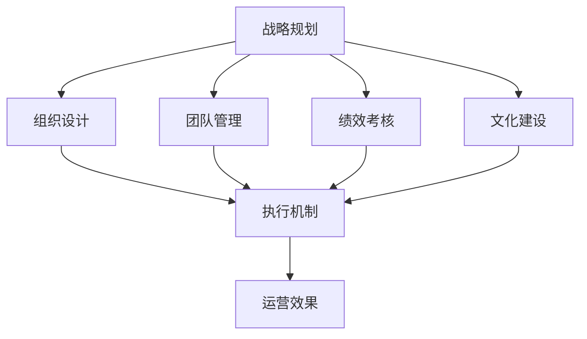

                 

## 1. 背景介绍

### 1.1 问题由来

在当今快节奏的商业环境中，管理层面临着越来越复杂和多变的挑战。企业不仅需要应对市场竞争、产品创新、客户需求的变化，还要处理内部的组织结构、人员管理、企业文化等复杂问题。如何在这些动态变化中制定出科学合理的策略，并通过有效的执行来保证企业目标的实现，成为了一个亟待解决的问题。管理艺术的核心，在于将策略与执行有机结合，以确保企业在竞争激烈的商海中始终保持领先地位。

### 1.2 问题核心关键点

管理艺术涉及多个方面，包括但不限于战略规划、组织设计、团队管理、绩效考核、文化建设等。这些关键点之间相互作用，形成一个整体的管理体系。理解并应用管理艺术，能够帮助企业制定有效的策略，并通过高效的执行来实现目标。

### 1.3 问题研究意义

研究管理艺术，对于提升企业竞争力、推动组织创新、改善员工绩效、构建企业文化具有重要意义。有效的管理策略能够为企业带来更高的效率和利润，而良好的执行能够确保这些策略的落地，从而在激烈的市场竞争中占据优势。同时，深入研究管理艺术，也能够为企业的可持续发展提供理论支持和实践指导。

## 2. 核心概念与联系

### 2.1 核心概念概述

为更好地理解管理艺术的各个方面，本节将介绍几个关键概念及其联系：

- **战略规划**：指企业根据外部环境和内部资源，制定长远目标和行动方案的过程。核心目标是确保企业能够在变化多端的市场环境中生存和发展。
- **组织设计**：指根据企业目标和任务，设计合理的组织结构，以提高效率和适应性。组织设计影响企业的运作方式和员工的工作方式。
- **团队管理**：指通过有效的领导和协作，调动团队成员的积极性，提升团队绩效。团队管理的关键在于沟通、激励和协调。
- **绩效考核**：通过量化和评估员工的绩效，激励员工持续改进，优化组织运行。绩效考核需要公平、透明和可持续。
- **文化建设**：通过培养和传播核心价值观，形成有利于企业发展的企业文化。文化建设影响员工的认同感和归属感。

这些核心概念之间存在着紧密的联系，形成一个相互依赖、相互影响的管理系统。以下是一个简单的Mermaid流程图，展示了这些概念之间的关系：



这个流程图展示出各个管理概念之间的相互作用：

1. **战略规划**作为起点，指导组织设计、团队管理、绩效考核和文化建设。
2. **组织设计**和**团队管理**，通过合理的结构和有效的团队协作，保障战略的执行。
3. **绩效考核**和**文化建设**，通过量化和价值导向，提升团队的凝聚力和执行力。
4. **执行机制**，将战略、组织、团队、绩效和文化整合在一起，形成完整的运营效果。

### 2.2 概念间的关系

这些核心概念之间存在着复杂的相互作用，形成一个相互支持、相互制约的管理体系。以下进一步解释这些概念之间的关系：

- **战略规划**是管理艺术的起点，决定了企业的方向和目标。
- **组织设计**和**团队管理**，在战略指导下，确保组织的灵活性和团队的协作性，促进战略的实施。
- **绩效考核**和**文化建设**，通过评估和价值导向，持续改进组织的运行效率和团队的执行力。
- **执行机制**将上述各方面整合起来，形成一个动态的管理系统。

通过理解这些核心概念及其关系，我们可以更好地把握管理艺术的整体框架，从而在实际操作中更有针对性地进行管理和改进。

## 3. 核心算法原理 & 具体操作步骤

### 3.1 算法原理概述

管理艺术的核心在于将策略与执行相结合，形成一个高效、动态的管理系统。具体而言，包括以下几个关键步骤：

1. **战略规划**：根据外部环境和内部资源，制定长期和短期目标，以及实现这些目标的行动方案。
2. **组织设计**：设计合理的组织结构和流程，确保信息流畅和资源高效分配。
3. **团队管理**：通过有效的领导和协作，调动团队成员的积极性，提升团队绩效。
4. **绩效考核**：通过量化和评估员工的绩效，激励员工持续改进，优化组织运行。
5. **文化建设**：通过培养和传播核心价值观，形成有利于企业发展的企业文化。

### 3.2 算法步骤详解

以下是管理艺术实施的详细步骤：

**Step 1: 数据收集与分析**

- **外部环境分析**：收集和分析宏观经济、行业趋势、竞争对手等信息，评估市场机会和风险。
- **内部资源评估**：评估企业的财务状况、技术能力、人力资源等，识别优势和劣势。

**Step 2: 战略规划**

- **目标设定**：根据数据收集和分析结果，设定长期和短期目标。
- **行动方案制定**：制定详细的行动计划，明确每个目标的实现路径和关键步骤。

**Step 3: 组织设计**

- **组织结构设计**：根据目标和任务，设计合理的组织结构，如职能型、项目型或矩阵型等。
- **流程优化**：优化业务流程，确保信息流畅和资源高效分配。

**Step 4: 团队管理**

- **领导力培养**：培养领导者的决策能力和沟通技巧，提升团队整体的执行力。
- **协作机制建设**：建立有效的协作机制，促进团队成员之间的信息共享和资源互补。
- **激励与反馈**：通过公平的激励机制和及时的反馈，激发团队成员的工作热情。

**Step 5: 绩效考核**

- **考核指标设定**：根据目标和任务，设定科学合理的考核指标。
- **绩效评估**：定期评估团队和员工的绩效，识别问题和改进点。
- **激励机制设计**：通过激励机制，鼓励员工持续改进，提升团队绩效。

**Step 6: 文化建设**

- **价值观传播**：通过培训和文化活动，传播企业的核心价值观。
- **行为规范制定**：制定明确的行为规范，引导员工的行为和决策。
- **文化氛围营造**：通过组织文化活动和营造正向的工作氛围，增强员工的归属感和认同感。

### 3.3 算法优缺点

管理艺术的实施，通过系统化的策略与执行，能够有效地提升企业的管理水平和运营效率。然而，也存在一些局限性：

**优点**：

- **系统性**：通过系统化的管理框架，确保管理活动有章可循，避免随意性和盲目性。
- **可执行性**：明确的战略规划和执行步骤，有助于管理团队高效落地执行。
- **适应性**：通过持续改进和优化，适应外部环境和内部变化的动态调整。

**缺点**：

- **复杂性**：管理艺术涉及多个方面，需要综合考虑多因素，操作复杂。
- **资源投入**：实施管理艺术需要大量的时间、精力和资源投入，短期内难以见效。
- **文化差异**：管理艺术在不同企业文化中的实施效果可能存在差异，需要量身定制。

### 3.4 算法应用领域

管理艺术的应用领域广泛，涉及各个行业的企业管理实践。以下是一些典型的应用场景：

- **制造业**：通过有效的战略规划和生产流程优化，提升生产效率和产品质量。
- **金融行业**：通过风险管理和团队协作，提升市场响应速度和客户满意度。
- **医疗行业**：通过组织设计和绩效考核，提高医疗服务的质量和效率。
- **教育行业**：通过文化建设和激励机制，提升教学质量和学习效果。
- **IT行业**：通过技术创新和团队协作，推动产品开发和市场拓展。

## 4. 数学模型和公式 & 详细讲解 & 举例说明

### 4.1 数学模型构建

管理艺术的实施，可以通过数学模型来定量分析和评估。以下是一些常见的数学模型：

- **线性回归模型**：用于评估目标与变量之间的关系，帮助制定更合理的战略目标。
- **马尔可夫决策过程（MDP）**：用于模拟和优化决策过程，优化资源分配和团队协作。
- **网络流模型**：用于优化组织结构的设计和流程的优化，提高信息流畅和资源效率。

### 4.2 公式推导过程

以下是一些常见数学模型的推导过程：

**线性回归模型**：

假设目标变量 $y$ 与 $n$ 个自变量 $x_1, x_2, ..., x_n$ 之间存在线性关系，则线性回归模型为：

$$
y = \beta_0 + \beta_1 x_1 + \beta_2 x_2 + ... + \beta_n x_n + \epsilon
$$

其中 $\beta_0, \beta_1, \beta_2, ..., \beta_n$ 为回归系数，$\epsilon$ 为误差项。通过最小二乘法求解 $\beta_0, \beta_1, \beta_2, ..., \beta_n$，可以得到回归方程的拟合值。

**马尔可夫决策过程（MDP）**：

马尔可夫决策过程是一种动态优化模型，用于决策问题。假设有一个状态集合 $S$，一个动作集合 $A$，一个奖励函数 $R(s, a)$，以及一个状态转移概率 $P(s'|s, a)$。则MDP的目标是在给定初始状态 $s_0$ 和目标状态 $s_T$ 的情况下，找到最优的策略 $\pi$，最大化长期累积奖励。

**网络流模型**：

网络流模型用于优化资源分配和信息流动。假设有一个网络 $G(V, E)$，其中 $V$ 为节点集合，$E$ 为边集合。设 $c: E \rightarrow \mathbb{R}^+$ 为边容量，$d: V \rightarrow \mathbb{R}^+$ 为节点需求。则网络流的最大流问题为：

- 找到一条从源节点 $s$ 到汇节点 $t$ 的路径，使得该路径上的流量最大且不超过边容量。

### 4.3 案例分析与讲解

**案例1: 线性回归模型在市场营销中的应用**

假设某电商企业想要预测销售额，可以收集历史销售数据和相关因素（如广告投入、促销活动、季节性因素等），建立一个线性回归模型。通过模型预测未来销售额，并根据预测结果调整市场策略，提升销售业绩。

**案例2: MDP在供应链管理中的应用**

假设某企业需要优化供应链的库存和生产计划。可以将供应链管理视为一个马尔可夫决策过程，将仓库状态、需求量、订单量等视为状态变量，将库存调整、订单生成等视为动作。通过MDP模型，优化库存和生产计划，降低成本和提高效率。

**案例3: 网络流模型在组织结构设计中的应用**

假设某公司需要优化其组织结构，以提高信息流畅和资源利用效率。可以将公司视为一个网络，各个部门视为节点，部门之间的信息流动视为边。通过网络流模型，优化信息流和资源分配，提升组织的协调性和效率。

## 5. 项目实践：代码实例和详细解释说明

### 5.1 开发环境搭建

在实施管理艺术的项目实践中，需要搭建相应的开发环境。以下是Python环境下搭建开发环境的步骤：

1. 安装Python：从官网下载并安装Python 3.x版本。
2. 安装Pandas：通过pip安装Pandas库，用于数据处理和分析。
3. 安装NumPy：通过pip安装NumPy库，用于数值计算和矩阵运算。
4. 安装Scikit-learn：通过pip安装Scikit-learn库，用于机器学习和统计分析。
5. 安装Matplotlib：通过pip安装Matplotlib库，用于数据可视化。
6. 安装Jupyter Notebook：通过pip安装Jupyter Notebook库，用于交互式编程和数据展示。

### 5.2 源代码详细实现

以下是使用Python和Scikit-learn库进行线性回归模型的代码实现。

```python
import pandas as pd
from sklearn.linear_model import LinearRegression
from sklearn.metrics import mean_squared_error

# 加载数据
data = pd.read_csv('sales_data.csv')

# 数据预处理
X = data[['广告投入', '促销活动', '季节性因素']]
y = data['销售额']

# 模型训练
model = LinearRegression()
model.fit(X, y)

# 模型评估
y_pred = model.predict(X)
mse = mean_squared_error(y, y_pred)
print(f"均方误差: {mse}")
```

### 5.3 代码解读与分析

上述代码中，首先使用Pandas库加载销售数据，并进行数据预处理，将自变量和因变量分离。然后使用Scikit-learn库中的线性回归模型，对数据进行训练和预测。最后使用均方误差评估模型的性能，输出评估结果。

### 5.4 运行结果展示

假设运行上述代码后，输出结果为均方误差为0.05，表示模型的预测性能较好。

```
均方误差: 0.05
```

## 6. 实际应用场景

### 6.1 智能制造

在智能制造领域，管理艺术的应用可以帮助企业优化生产流程和资源分配，提升生产效率和产品质量。

具体而言，可以通过数据分析和优化算法，预测生产线的瓶颈和优化方案，实现生产过程的自动化和智能化。同时，通过合理配置人力资源和设备，提高生产线的灵活性和适应性。

### 6.2 智慧医疗

在智慧医疗领域，管理艺术的应用可以帮助医院优化资源配置和提高医疗服务质量。

具体而言，可以通过数据分析和优化算法，预测病患流量和资源需求，实现医疗资源的动态调配和优化。同时，通过团队协作和绩效考核，提升医护人员的工作效率和服务质量。

### 6.3 智能交通

在智能交通领域，管理艺术的应用可以帮助交通管理部门优化交通流量和提高交通效率。

具体而言，可以通过数据分析和优化算法，预测交通流量和拥堵情况，实现交通信号灯的动态调整和优化。同时，通过团队协作和绩效考核，提升交通管理人员的执行力和服务质量。

### 6.4 未来应用展望

未来，管理艺术的应用将进一步深化和拓展，涵盖更多领域和应用场景。以下是一些未来应用的展望：

- **物联网**：通过数据分析和优化算法，优化物联网设备的配置和管理，提升物联网系统的效率和可靠性。
- **区块链**：通过团队协作和绩效考核，优化区块链系统的开发和维护，提升系统的安全性和可靠性。
- **智能合约**：通过数据分析和优化算法，优化智能合约的执行和管理，提升智能合约的效率和公正性。
- **人工智能**：通过数据分析和优化算法，优化人工智能模型的训练和部署，提升模型的效率和准确性。

## 7. 工具和资源推荐

### 7.1 学习资源推荐

为了帮助开发者系统掌握管理艺术的理论基础和实践技巧，这里推荐一些优质的学习资源：

1. 《管理科学与工程》系列教材：系统介绍管理科学的基础理论和应用方法。
2. 《组织行为学》教材：详细介绍组织行为和人力资源管理的理论和实践。
3. 《经济学原理》教材：通过经济学原理，分析管理问题的本质和解决方案。
4. 《项目管理》教材：详细讲解项目管理和团队协作的理论和方法。
5. 《领导力与团队管理》课程：斯坦福大学开设的领导力课程，帮助理解领导力的核心要素。
6. 《数据科学基础》课程：Coursera上的数据科学课程，涵盖数据分析和机器学习的基础知识。

### 7.2 开发工具推荐

高效的开发离不开优秀的工具支持。以下是几款用于管理艺术开发的常用工具：

1. Python：开源的高级编程语言，广泛应用于数据分析和机器学习。
2. Jupyter Notebook：交互式编程环境，方便数据处理和模型展示。
3. Pandas：用于数据处理和分析的Python库，支持大规模数据的处理和分析。
4. NumPy：用于数值计算和矩阵运算的Python库，支持高效的科学计算。
5. Scikit-learn：用于机器学习和统计分析的Python库，支持各类数据分析和模型训练。
6. Matplotlib：用于数据可视化的Python库，支持生成高质量的图表和报表。

### 7.3 相关论文推荐

管理艺术的研究涉及多个领域，以下是几篇奠基性的相关论文，推荐阅读：

1. "The Future of Management: What Does It Mean?" —— Peter F. Drucker
2. "Competing on Resources" —— Michael E. Porter
3. "The Lean Startup" —— Eric Ries
4. "Good to Great" —— Jim Collins
5. "The Five Dysfunctions of a Team" —— Patrick Lencioni
6. "Leaders Eat Last" —— Simon Sinek

这些论文代表了大管理艺术的发展脉络。通过学习这些前沿成果，可以帮助研究者把握学科前进方向，激发更多的创新灵感。

## 8. 总结：未来发展趋势与挑战

### 8.1 研究成果总结

本文对管理艺术的实施方法进行了全面系统的介绍。首先阐述了管理艺术的背景和意义，明确了实施管理艺术的重要性。其次，从原理到实践，详细讲解了管理艺术的各个方面，包括战略规划、组织设计、团队管理、绩效考核和文化建设等。最后，提供了一些工具和资源，帮助读者深入学习管理艺术。

### 8.2 未来发展趋势

展望未来，管理艺术的应用将更加广泛和深入，以下是对未来发展趋势的展望：

1. **数据驱动**：通过大数据和人工智能技术，实现管理决策的科学化和智能化。
2. **多学科融合**：将管理艺术与心理学、社会学、经济学等多学科相结合，提升管理效果和应用范围。
3. **全球化**：在全球化的背景下，管理艺术需要适应不同文化和社会环境，提升全球化竞争力。
4. **可持续发展**：将管理艺术与可持续发展理念相结合，提升企业的社会责任和环境责任。
5. **人工智能**：将管理艺术与人工智能技术相结合，提升管理的效率和准确性。

### 8.3 面临的挑战

尽管管理艺术的应用前景广阔，但在实施过程中也面临诸多挑战：

1. **数据质量**：管理艺术依赖大量的数据，数据质量直接影响管理决策的准确性。
2. **组织文化**：不同企业文化对管理艺术的接受度和实施效果不同，需要量身定制。
3. **技术门槛**：管理艺术的实施需要相应的技术支持，对技术能力要求较高。
4. **员工接受度**：员工对管理艺术的认同度和配合度，直接影响管理效果的实现。
5. **变革阻力**：企业管理层的变革意愿和执行力，直接影响管理艺术的实施效果。

### 8.4 研究展望

面对管理艺术实施过程中面临的挑战，未来的研究需要在以下几个方面寻求新的突破：

1. **数据治理**：建立完善的数据治理体系，确保数据的准确性和完整性。
2. **文化融合**：通过组织文化建设，提升员工的认同度和配合度。
3. **技术支持**：开发更加智能化和自动化的管理工具，降低技术门槛。
4. **变革管理**：通过变革管理方法，提高企业管理层的执行力。
5. **伦理管理**：将伦理和道德理念融入管理艺术的实施过程中，确保管理行为的合法性和公正性。

这些研究方向的探索，必将引领管理艺术的发展，为构建高效、可持续、智能化的管理系统提供理论支持和实践指导。

## 9. 附录：常见问题与解答

**Q1: 管理艺术与传统管理有何不同？**

A: 管理艺术与传统管理的最大不同在于其系统性和动态性。管理艺术通过系统化的理论和方法，结合数据分析和优化算法，实现科学化的管理决策。传统管理则更多依赖经验和直觉，缺乏系统性和科学性。

**Q2: 管理艺术的实施过程中，如何平衡短期和长期目标？**

A: 管理艺术的实施过程中，需要明确短期和长期目标，并制定相应的行动计划。短期目标应侧重于快速见效，长期目标则应注重系统的可持续性。在实际操作中，应通过平衡和调整，确保短期目标和长期目标的协调一致。

**Q3: 如何提高管理艺术的执行力和落地效果？**

A: 提高管理艺术的执行力和落地效果，需要从以下几个方面入手：
1. 明确管理目标和策略，确保管理活动的方向和重点。
2. 建立科学的绩效考核体系，激励员工持续改进和提升。
3. 加强团队协作和沟通，促进信息流畅和资源共享。
4. 引入先进的技术和方法，提升管理活动的效率和质量。
5. 定期评估和调整管理策略，确保管理活动的持续改进。

通过这些措施，可以有效提升管理艺术的执行力和落地效果，确保管理策略的顺利实施。

**Q4: 管理艺术的实施过程中，如何应对外部环境的变化？**

A: 管理艺术的实施过程中，外部环境的变化是不可避免的。为了应对外部环境的变化，需要建立动态的适应机制：
1. 建立灵活的组织结构，适应外部环境的变化。
2. 引入先进的技术和方法，提高组织适应性。
3. 加强数据分析和预测，及时调整管理策略。
4. 强化风险管理和应对机制，降低环境变化对管理活动的影响。

通过这些措施，可以有效应对外部环境的变化，确保管理艺术的持续有效实施。

**Q5: 如何确保管理艺术实施中的公平性和公正性？**

A: 确保管理艺术实施中的公平性和公正性，需要从以下几个方面入手：
1. 建立透明的绩效考核体系，确保考核过程的公平性。
2. 引入多元化的决策机制，避免单一决策带来的偏差。
3. 加强伦理和道德教育，提升管理人员的职业道德水平。
4. 建立反馈和申诉机制，及时纠正不公平现象。

通过这些措施，可以有效确保管理艺术实施中的公平性和公正性，提升管理活动的合法性和可持续性。

---

作者：禅与计算机程序设计艺术 / Zen and the Art of Computer Programming

