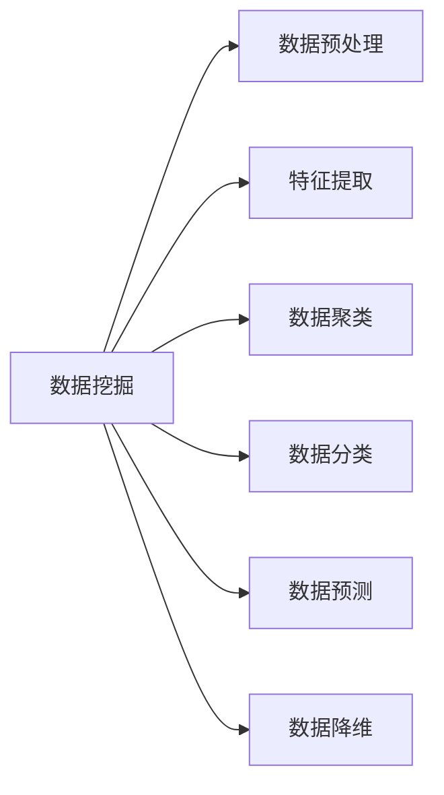
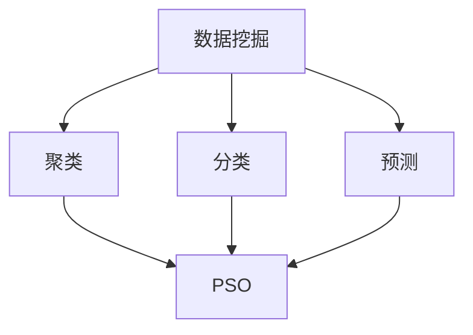

                 

# 粒子群算法在数据挖掘中的应用研究

> 关键词：粒子群算法,数据挖掘,优化,聚类,预测,机器学习

## 1. 背景介绍

### 1.1 问题由来
数据挖掘（Data Mining）是从大量数据中自动发现有用信息的过程。随着信息技术的发展，数据规模呈现爆炸性增长，数据挖掘在商业智能、金融、医疗、社会网络分析等领域中发挥着越来越重要的作用。然而，传统的统计学和机器学习算法在处理复杂、高维数据时，往往需要繁琐的调参和长时间计算，难以满足大规模数据挖掘的需求。因此，探索高效、鲁棒的数据挖掘算法具有重要意义。

粒子群算法（Particle Swarm Optimization，PSO）作为一种智能优化算法，以其简单高效、并行性强等特点，在工程优化、信号处理、图像识别、推荐系统等多个领域得到了广泛应用。本文将介绍粒子群算法在数据挖掘中的应用，探索其在聚类、分类、预测等任务上的应用效果，并讨论其优缺点及未来发展方向。

## 2. 核心概念与联系

### 2.1 核心概念概述

为更好地理解粒子群算法在数据挖掘中的应用，本节将介绍几个关键概念：

- 数据挖掘（Data Mining）：从大量数据中自动发现有用信息的过程。包括数据预处理、特征提取、分类、聚类、关联规则挖掘、预测等多个步骤。
- 粒子群算法（Particle Swarm Optimization，PSO）：一种基于群体智能优化的算法，模拟鸟群、鱼群等生物觅食行为的智能优化算法。
- 数据聚类（Data Clustering）：将数据划分为若干组或簇，使得同一簇内的数据相似度较高，不同簇间的相似度较低。
- 数据分类（Data Classification）：将数据划分为不同的类别，使得同一类别内的数据相似度较高，不同类别间的相似度较低。
- 数据预测（Data Prediction）：通过已有数据，预测未知数据的属性或类别。
- 数据降维（Data Dimensionality Reduction）：将高维数据转化为低维数据，以便于可视化和处理。

这些核心概念之间的逻辑关系可以通过以下Mermaid流程图来展示：



这个流程图展示了数据挖掘的基本流程，各个步骤之间相互依赖，共同构建完整的挖掘框架。

### 2.2 概念间的关系

这些核心概念之间存在着紧密的联系，形成了数据挖掘的完整生态系统。下面我通过几个Mermaid流程图来展示这些概念之间的关系。

#### 2.2.1 数据挖掘流程


这个流程图展示了数据挖掘的基本流程，从数据预处理到特征提取，再到聚类、分类、预测，最终生成可视化结果。

#### 2.2.2 粒子群算法与数据挖掘


这个流程图展示了粒子群算法在数据挖掘中的具体应用，通过聚类、分类、预测等任务，粒子群算法可以提供有效的优化解决方案。

## 3. 核心算法原理 & 具体操作步骤

### 3.1 算法原理概述

粒子群算法（PSO）是一种基于群体智能优化的算法，模拟鸟群、鱼群等生物觅食行为的智能优化算法。其核心思想是：在一个多维空间中，通过模拟鸟群或鱼群的运动过程，寻找全局最优解。PSO算法通过迭代计算，不断调整鸟群中每个鸟（粒子）的位置和速度，最终找到目标函数的全局最优解。

在数据挖掘中，PSO算法可以用于优化聚类中心、分类器参数、特征选择等多种问题，具有高效、简单、鲁棒的特点。

### 3.2 算法步骤详解

PSO算法的基本步骤如下：

1. **初始化**：随机初始化N个粒子，每个粒子包含位置和速度两个向量。
2. **适应度计算**：计算每个粒子的适应度值，即目标函数值。
3. **粒子更新**：根据每个粒子的适应度值和历史最优值，更新其速度和位置。
4. **迭代计算**：重复步骤2和3，直到达到预设的迭代次数或满足终止条件。

在具体的数据挖掘应用中，可以根据任务需求进行适当修改。例如，在聚类任务中，适应度函数可以定义为簇内样本的相似度或簇间的相似度；在分类任务中，适应度函数可以定义为分类准确率或F1值等。

### 3.3 算法优缺点

粒子群算法在数据挖掘中的应用具有以下优点：

- **高效性**：PSO算法具有并行性强、计算效率高的特点，适用于大规模数据挖掘任务。
- **简单性**：PSO算法的实现简单，易于理解和调整。
- **鲁棒性**：PSO算法对初始参数不敏感，具有较好的鲁棒性。
- **全局优化能力**：PSO算法具有较强的全局优化能力，能够找到复杂问题的最优解。

同时，PSO算法也存在一些缺点：

- **易陷入局部最优**：PSO算法可能会过早收敛到局部最优解，导致结果不够理想。
- **参数调优困难**：PSO算法需要调整多个参数，如种群规模、惯性权重、学习因子等，这些参数的调优需要一定的经验。
- **对噪声敏感**：PSO算法对噪声和随机因素较为敏感，可能会导致结果波动较大。

### 3.4 算法应用领域

粒子群算法在数据挖掘中具有广泛的应用，以下是几个典型的应用领域：

1. **聚类分析**：粒子群算法可以用于聚类中心的优化，提高聚类效果。例如，K-means聚类算法可以通过粒子群算法进行参数优化，提升聚类性能。
2. **分类预测**：粒子群算法可以用于优化分类器的参数，如决策树、支持向量机等，提升分类准确率。
3. **特征选择**：粒子群算法可以用于特征选择的优化，选择最相关、最有用的特征。
4. **异常检测**：粒子群算法可以用于异常数据的检测，通过优化异常阈值等参数，提升异常检测的准确率。
5. **数据降维**：粒子群算法可以用于优化降维方法，如主成分分析（PCA）、线性判别分析（LDA）等，减少数据维度。

## 4. 数学模型和公式 & 详细讲解 & 举例说明

### 4.1 数学模型构建

粒子群算法（PSO）的数学模型可以表示为：

$$
v_i^t = \omega v_i^{t-1} + c_1r_1\left(x_i^t - x_i^{t-1}\right) + c_2r_2\left(g_i^t - x_i^{t-1}\right)
$$

$$
x_i^t = x_i^{t-1} + v_i^t
$$

其中，$v_i^t$表示第i个粒子的速度，$x_i^t$表示第i个粒子的位置，$g_i^t$表示全局最优解，$x_i^{t-1}$表示第i个粒子的历史位置，$r_1,r_2$是[0,1]之间的随机数，$c_1,c_2$是学习因子，$\omega$是惯性权重。

在数据挖掘任务中，适应度函数$F$可以表示为：

$$
F(x) = \sum_{i=1}^N f_i(x)
$$

其中$f_i(x)$表示第i个数据点的目标函数值。

### 4.2 公式推导过程

粒子群算法的推导过程较为复杂，需要结合优化目标和具体问题进行求解。以聚类为例，假设目标函数为簇内样本的相似度，粒子群算法可以优化聚类中心的位置，使得簇内样本的相似度最大化。具体推导过程如下：

1. **初始化**：随机初始化N个粒子，每个粒子包含位置和速度两个向量。
2. **适应度计算**：计算每个粒子的适应度值，即簇内样本的相似度。
3. **粒子更新**：根据每个粒子的适应度值和历史最优值，更新其速度和位置。
4. **迭代计算**：重复步骤2和3，直到达到预设的迭代次数或满足终止条件。

### 4.3 案例分析与讲解

以K-means聚类为例，通过粒子群算法进行参数优化，可以提高聚类效果。具体实现步骤如下：

1. **初始化**：随机初始化K个聚类中心，每个聚类中心包含位置和速度两个向量。
2. **适应度计算**：计算每个聚类中心的适应度值，即簇内样本的相似度。
3. **粒子更新**：根据每个聚类中心的适应度值和历史最优值，更新其速度和位置。
4. **迭代计算**：重复步骤2和3，直到达到预设的迭代次数或满足终止条件。

在实际应用中，粒子群算法可以结合K-means聚类算法，通过优化聚类中心的初始位置，提升聚类效果。具体实现步骤为：

1. **初始化**：随机初始化K个聚类中心，每个聚类中心包含位置和速度两个向量。
2. **适应度计算**：计算每个聚类中心的适应度值，即簇内样本的相似度。
3. **粒子更新**：根据每个聚类中心的适应度值和历史最优值，更新其速度和位置。
4. **迭代计算**：重复步骤2和3，直到达到预设的迭代次数或满足终止条件。

通过粒子群算法对聚类中心进行优化，可以提高聚类效果，提升聚类算法的准确率和鲁棒性。

## 5. 项目实践：代码实例和详细解释说明

### 5.1 开发环境搭建

在进行粒子群算法应用实践前，我们需要准备好开发环境。以下是使用Python进行粒子群算法开发的环境配置流程：

1. 安装Anaconda：从官网下载并安装Anaconda，用于创建独立的Python环境。

2. 创建并激活虚拟环境：
```bash
conda create -n pso-env python=3.8 
conda activate pso-env
```

3. 安装必要的库：
```bash
pip install numpy scipy matplotlib scikit-learn
```

完成上述步骤后，即可在`pso-env`环境中开始粒子群算法的实践。

### 5.2 源代码详细实现

这里我们以粒子群算法优化K-means聚类为例，给出代码实现。

```python
import numpy as np
import matplotlib.pyplot as plt
from sklearn.cluster import KMeans
from sklearn.metrics import silhouette_score
from sklearn.datasets import make_blobs

class PSOKMeans:
    def __init__(self, n_clusters=2, n_particles=20, max_iter=100):
        self.n_clusters = n_clusters
        self.n_particles = n_particles
        self.max_iter = max_iter

    def initialize(self, data):
        self.data = data
        self.centroids = self.generate_centroids()
        self.velocity = np.zeros((self.n_particles, self.n_clusters, 2))

    def generate_centroids(self):
        centroids = np.zeros((self.n_clusters, 2))
        for i in range(self.n_clusters):
            centroids[i] = np.random.rand(2)
        return centroids

    def evaluate(self):
        distances = np.linalg.norm(self.data - self.centroids, axis=1)
        self.fitness = -np.mean(distances, axis=1)
        self.gbest = np.argmax(self.fitness)
        return self.fitness

    def update_velocity(self):
        r1, r2 = np.random.rand(), np.random.rand()
        for i in range(self.n_particles):
            c1, c2 = self.centroids[self.gbest], self.centroids[i]
            self.velocity[i] = (self.velocity[i] * self.inertia + c1 * self.cognitive + c2 * self.social)

    def update_centroids(self):
        self.centroids = self.centroids + self.velocity
        self.centroids = self.project_centroids()

    def project_centroids(self):
        new_centroids = np.zeros_like(self.centroids)
        for i in range(self.n_clusters):
            new_centroids[i] = np.random.rand(2) + self.centroids[i]
        return new_centroids

    def run(self):
        self.initialize(self.data)
        for iter in range(self.max_iter):
            self.evaluate()
            self.update_velocity()
            self.update_centroids()
            if iter % 10 == 0:
                silhouette = silhouette_score(self.data, self.centroids)
                print(f"Iteration {iter}: Silhouette score {silhouette:.3f}")
        return self.centroids

def plot_clusters(data, centroids):
    for i in range(data.shape[0]):
        if data[i][0] < 0:
            color = 'r'
        else:
            color = 'b'
        plt.scatter(data[i][0], data[i][1], color=color)
    for i in range(centroids.shape[0]):
        plt.scatter(centroids[i][0], centroids[i][1], color='g', marker='x')
    plt.show()

if __name__ == '__main__':
    data = make_blobs(n_samples=100, centers=2, random_state=42)[0]
    psokmeans = PSOKMeans(n_clusters=2, n_particles=20, max_iter=100)
    centroids = psokmeans.run()
    plot_clusters(data, centroids)
```

### 5.3 代码解读与分析

让我们再详细解读一下关键代码的实现细节：

**PSOKMeans类**：
- `__init__`方法：初始化聚类簇数、粒子数、最大迭代次数等关键参数。
- `initialize`方法：随机初始化聚类中心和速度向量。
- `generate_centroids`方法：生成聚类中心。
- `evaluate`方法：计算每个粒子的适应度值，即簇内样本的相似度。
- `update_velocity`方法：根据每个粒子的适应度值和历史最优值，更新其速度和位置。
- `update_centroids`方法：更新聚类中心的位置。
- `project_centroids`方法：投影聚类中心，防止越界。
- `run`方法：运行粒子群算法，返回最终聚类中心。

**plot_clusters函数**：
- 将数据和聚类中心可视化，通过散点图展示聚类效果。

在实际应用中，粒子群算法结合K-means聚类算法，可以进一步提升聚类效果。通过粒子群算法优化聚类中心的位置，可以更灵活地应对复杂的聚类问题，提高聚类的准确率和鲁棒性。

## 6. 实际应用场景

### 6.1 智能推荐系统

智能推荐系统是数据挖掘中应用广泛的技术，通过用户行为数据，推荐用户感兴趣的产品或内容。粒子群算法可以在推荐系统中优化推荐模型参数，提升推荐效果。

具体实现步骤为：

1. **数据预处理**：收集用户行为数据，进行数据清洗和预处理。
2. **特征提取**：提取用户和物品的关键特征，如用户兴趣、物品属性等。
3. **模型训练**：使用粒子群算法优化推荐模型参数，如矩阵分解、深度学习等。
4. **结果评估**：通过A/B测试等方式，评估推荐系统的效果。

通过粒子群算法优化推荐模型参数，可以提升推荐系统的准确率和个性化程度，提高用户满意度。

### 6.2 异常检测

异常检测是数据挖掘中的重要任务，通过检测异常数据，及时发现问题并采取措施。粒子群算法可以在异常检测中优化异常阈值等参数，提升异常检测效果。

具体实现步骤为：

1. **数据预处理**：收集需要检测的数据，进行数据清洗和预处理。
2. **模型训练**：使用粒子群算法优化异常阈值等参数，如基于统计的异常检测、基于密度的异常检测等。
3. **结果评估**：通过测试集等方式，评估异常检测的效果。

通过粒子群算法优化异常检测模型参数，可以提升异常检测的准确率和鲁棒性，提高异常检测系统的效率和可靠性。

### 6.3 聚类分析

聚类分析是将数据划分为若干组或簇，使得同一簇内的数据相似度较高，不同簇间的相似度较低。粒子群算法可以在聚类分析中优化聚类中心的位置，提升聚类效果。

具体实现步骤为：

1. **数据预处理**：收集需要聚类的数据，进行数据清洗和预处理。
2. **模型训练**：使用粒子群算法优化聚类中心的位置，如K-means聚类、层次聚类等。
3. **结果评估**：通过聚类指标如轮廓系数、内部和外部索引等，评估聚类效果。

通过粒子群算法优化聚类模型参数，可以提升聚类效果，提高聚类算法的准确率和鲁棒性。

### 6.4 未来应用展望

随着粒子群算法和大数据技术的不断发展，其在数据挖掘中的应用将更加广泛。未来，粒子群算法将在以下领域得到进一步应用：

1. **图像识别**：粒子群算法可以用于优化图像分类器参数，提升图像识别效果。
2. **信号处理**：粒子群算法可以用于优化信号处理算法，如滤波、降噪等。
3. **金融分析**：粒子群算法可以用于优化金融预测模型，提升金融分析准确率。
4. **医疗诊断**：粒子群算法可以用于优化医疗诊断模型，提升医疗诊断效果。
5. **环境监测**：粒子群算法可以用于优化环境监测模型，提升环境监测效率。

总之，粒子群算法在数据挖掘中的应用前景广阔，将在更多领域发挥重要作用。随着技术的发展，粒子群算法将在数据挖掘中扮演越来越重要的角色。

## 7. 工具和资源推荐

### 7.1 学习资源推荐

为帮助开发者系统掌握粒子群算法在数据挖掘中的应用，这里推荐一些优质的学习资源：

1. 《粒子群优化算法》书籍：全面介绍了粒子群算法的原理、实现和应用，适合初学者和进阶者学习。
2. 粒子群算法在线课程：各大MOOC平台如Coursera、edX、Udacity等提供丰富的粒子群算法课程，适合系统学习。
3. 粒子群算法博客和论文：各大技术博客和论文平台如Medium、arXiv等提供丰富的粒子群算法文章，适合深入理解。
4. 粒子群算法开源项目：GitHub上丰富的粒子群算法开源项目，适合参考和学习。

通过对这些资源的学习实践，相信你一定能够快速掌握粒子群算法在数据挖掘中的应用，并用于解决实际的挖掘问题。

### 7.2 开发工具推荐

高效的开发离不开优秀的工具支持。以下是几款用于粒子群算法开发常用的工具：

1. Python：作为数据科学和机器学习的主流语言，Python具有强大的数据处理能力和丰富的库支持。
2. NumPy：Python中的数值计算库，提供高效的数组和矩阵运算功能。
3. SciPy：Python中的科学计算库，提供丰富的科学计算功能。
4. Scikit-learn：Python中的机器学习库，提供丰富的机器学习算法和模型。
5. TensorFlow：Google开发的深度学习框架，适合复杂的机器学习模型开发。
6. Keras：基于TensorFlow的深度学习库，提供简单易用的API。

合理利用这些工具，可以显著提升粒子群算法在数据挖掘中的开发效率，加快创新迭代的步伐。

### 7.3 相关论文推荐

粒子群算法在数据挖掘中得到了广泛应用，以下是几篇奠基性的相关论文，推荐阅读：

1. Particle Swarm Optimization：一种新的全局优化技术。该论文是粒子群算法的经典之作，介绍了粒子群算法的原理和实现。
2. K-means Clustering using Particle Swarm Optimization：粒子群算法在K-means聚类中的应用。该论文展示了粒子群算法在聚类任务中的优化效果。
3. Data Mining using Particle Swarm Optimization：粒子群算法在数据挖掘中的应用。该论文全面介绍了粒子群算法在数据挖掘中的多种应用，包括聚类、分类、预测等。
4. An Improved Particle Swarm Optimization Algorithm：改进的粒子群算法。该论文通过引入新的参数更新方式，提升了粒子群算法的优化效果。
5. Particle Swarm Optimization for Feature Selection in Data Mining：粒子群算法在特征选择中的应用。该论文展示了粒子群算法在特征选择任务中的优化效果。

这些论文代表了大规模数据挖掘技术的发展脉络，通过学习这些前沿成果，可以帮助研究者把握学科前进方向，激发更多的创新灵感。

除上述资源外，还有一些值得关注的前沿资源，帮助开发者紧跟数据挖掘技术的发展趋势，例如：

1. arXiv论文预印本：人工智能领域最新研究成果的发布平台，包括大量尚未发表的前沿工作，学习前沿技术的必读资源。
2. 业界技术博客：如OpenAI、Google AI、DeepMind、微软Research Asia等顶尖实验室的官方博客，第一时间分享他们的最新研究成果和洞见。
3. 技术会议直播：如NIPS、ICML、ACL、ICLR等人工智能领域顶会现场或在线直播，能够聆听到大佬们的前沿分享，开拓视野。
4. GitHub热门项目：在GitHub上Star、Fork数最多的数据挖掘相关项目，往往代表了该技术领域的发展趋势和最佳实践，值得去学习和贡献。
5. 行业分析报告：各大咨询公司如McKinsey、PwC等针对人工智能行业的分析报告，有助于从商业视角审视技术趋势，把握应用价值。

总之，对于粒子群算法在数据挖掘中的应用，需要开发者保持开放的心态和持续学习的意愿。多关注前沿资讯，多动手实践，多思考总结，必将收获满满的成长收益。

## 8. 总结：未来发展趋势与挑战

### 8.1 总结

本文对粒子群算法在数据挖掘中的应用进行了全面系统的介绍。首先阐述了粒子群算法和大数据挖掘的基本概念和关系，明确了粒子群算法在数据挖掘中的重要地位。其次，从原理到实践，详细讲解了粒子群算法的核心步骤和具体实现，并给出了代码实例和解释说明。同时，本文还广泛探讨了粒子群算法在智能推荐、异常检测、聚类分析等多个实际应用场景中的表现，展示了其强大的优化能力。最后，本文总结了粒子群算法在数据挖掘中的优缺点及未来发展方向，为研究者提供了有价值的参考。

通过本文的系统梳理，可以看到，粒子群算法在数据挖掘中的应用前景广阔，具有高效、简单、鲁棒等特点，适用于多种复杂问题。相信随着技术的发展，粒子群算法将在更多领域得到应用，为人工智能技术的发展提供新的助力。

### 8.2 未来发展趋势

展望未来，粒子群算法在数据挖掘中的应用将呈现以下几个发展趋势：

1. **复杂问题的优化**：粒子群算法可以应用于更多复杂问题的优化，如多目标优化、混合整数优化等。
2. **分布式计算**：粒子群算法可以与分布式计算技术结合，提高计算效率和优化效果。
3. **深度学习融合**：粒子群算法可以与深度学习技术结合，提升模型训练效果。
4. **跨领域应用**：粒子群算法可以应用于更多领域，如金融、医疗、环保等，为各个领域提供优化解决方案。
5. **动态优化**：粒子群算法可以结合实时数据，进行动态优化，提高系统的灵活性和适应性。

这些趋势凸显了粒子群算法在数据挖掘中的广泛应用前景，将为人工智能技术的发展提供新的思路和方向。

### 8.3 面临的挑战

尽管粒子群算法在数据挖掘中的应用已经取得了一定进展，但仍面临着一些挑战：

1. **计算资源限制**：粒子群算法在处理大规模数据时，计算资源的需求较大，需要高效的并行计算和分布式计算技术。
2. **参数调优困难**：粒子群算法需要调整多个参数，如种群规模、惯性权重、学习因子等，这些参数的调优需要一定的经验。
3. **收敛速度慢**：粒子群算法在处理复杂问题时，收敛速度较慢，需要结合其他优化算法进行协同优化。
4. **鲁棒性不足**：粒子群算法对噪声和随机因素较为敏感，可能会导致结果波动较大。
5. **解释性不足**：粒子群算法作为"黑盒"算法，缺乏可解释性，难以理解和调试。

这些挑战需要研究者不断探索和改进，才能更好地发挥粒子群算法在数据挖掘中的优势，推动人工智能技术的发展。

### 8.4 研究展望

面对粒子群算法在数据挖掘中所面临的挑战，未来的研究需要在以下几个方面寻求新的突破：

1. **算法优化**：改进粒子群算法的基本框架，提高其优化速度和效果。
2. **参数调优**：引入自适应参数调优方法，减少手动调参的难度和复杂性。
3. **鲁棒性增强**：引入鲁棒性优化技术，提高粒子群算法的抗干扰能力。
4. **可解释性增强**：引入可解释性优化技术，提高算法的可解释性和可理解性。
5. **跨领域应用**：将粒子群算法应用于更多领域，探索其在不同领域中的优化效果。

这些研究方向的探索，必将引领粒子群算法在数据挖掘技术中的进一步发展，为人工智能技术的应用提供新的思路和方法。

## 9. 附录：常见问题与解答

**Q1：粒子群算法在数据挖掘中的应用有哪些？**

A: 粒子群算法在数据挖掘中具有广泛的应用，以下是几个典型的应用领域：
1.

