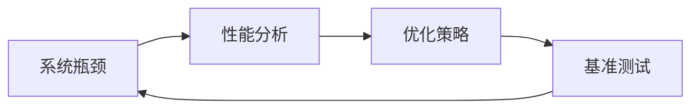

                 

# 系统瓶颈分析与优化案例

## 1. 背景介绍

在软件开发和运维实践中，系统的性能瓶颈一直是困扰工程师的难题。如何精准定位系统瓶颈、制定有效的优化策略，成为提高系统性能的关键。本文将以几个典型系统瓶颈分析与优化的案例，介绍系统瓶颈的常见类型、分析方法及优化策略，旨在为读者提供系统的故障定位和性能调优指导。

## 2. 核心概念与联系

### 2.1 核心概念概述

在介绍系统瓶颈优化方法前，我们首先定义几个核心概念：

- **系统瓶颈(System Bottleneck)**：指系统性能瓶颈，即影响系统整体性能的关键问题点。瓶颈的存在限制了系统响应速度、吞吐量和资源利用率。

- **性能分析(Performance Analysis)**：通过各种工具和方法，对系统性能进行监控、诊断和评估的过程。性能分析是瓶颈优化的前提和基础。

- **优化策略(Optimization Strategy)**：针对瓶颈问题，制定并实施的一系列技术措施和调整策略，旨在提升系统性能和稳定性。

- **基准测试(Benchmark Testing)**：通过比较性能测试结果，评估优化效果的过程。基准测试是优化策略验证的重要手段。

这些概念通过以下Mermaid流程图关联起来：



### 2.2 核心概念间的关系

性能瓶颈的识别和定位，依赖于有效的性能分析方法。性能分析的结果，指导优化策略的制定。优化策略实施后，需要通过基准测试来验证效果。基准测试的结果，进一步反馈给性能分析，形成闭环的性能优化流程。

## 3. 核心算法原理 & 具体操作步骤

### 3.1 算法原理概述

系统瓶颈分析与优化，本质上是一种针对性能问题的故障诊断和解决策略。其核心思想是通过系统的监控和数据分析，找出性能瓶颈，并采取针对性的优化措施，以提升系统的整体性能。

系统瓶颈分析可以分为以下几个步骤：

1. **监控数据收集**：通过系统监控工具，收集关键性能指标的实时数据。
2. **性能瓶颈识别**：基于监控数据，分析系统瓶颈点。
3. **优化策略制定**：针对瓶颈问题，制定并实施优化措施。
4. **优化效果评估**：通过基准测试，评估优化效果。
5. **迭代优化**：根据评估结果，调整优化策略，不断优化性能。

### 3.2 算法步骤详解

#### 3.2.1 监控数据收集

- **关键性能指标**：包括CPU利用率、内存使用、网络延迟、磁盘I/O等。
- **监控工具**：如Prometheus、Grafana、ELK Stack等。
- **数据收集**：通过集成API或SDK，定时采集关键指标数据，存储到时序数据库或日志系统中。

#### 3.2.2 性能瓶颈识别

- **异常检测**：通过统计分析，识别异常指标。
- **瓶颈定位**：使用A/B测试、关联分析等方法，定位瓶颈源。
- **瓶颈分析**：采用堆栈跟踪、调用链分析等技术，理解瓶颈原理。

#### 3.2.3 优化策略制定

- **硬件优化**：升级硬件设备，如增加CPU核心数、提高内存大小、更换高速磁盘等。
- **软件优化**：优化代码逻辑，减少资源占用，如减少数据库查询、提高缓存命中率、优化算法等。
- **架构优化**：调整系统架构，优化资源分配，如分布式部署、负载均衡、服务合并等。

#### 3.2.4 优化效果评估

- **基准测试**：定义性能指标，使用基准测试工具进行测试。
- **结果对比**：将优化前后的测试结果进行对比，评估优化效果。
- **效果分析**：分析优化效果差异，找出优化的关键因素。

#### 3.2.5 迭代优化

- **问题复现**：将优化效果应用于实际生产环境，复现瓶颈问题。
- **持续监控**：继续监控关键指标，防止新问题的产生。
- **优化反馈**：根据监控结果，调整优化策略，持续优化系统性能。

### 3.3 算法优缺点

**优点**：
- 系统监控和数据分析，可以快速定位性能瓶颈。
- 优化策略针对性强，能够有效提升系统性能。
- 基准测试可验证优化效果，提供客观依据。

**缺点**：
- 性能瓶颈定位和优化过程复杂，需要较高技术门槛。
- 可能存在“治标不治本”的风险，优化效果不持久。
- 优化过程涉及多方面因素，综合优化难度大。

### 3.4 算法应用领域

系统瓶颈分析与优化方法，广泛应用于软件开发和运维中的多个环节，包括但不限于：

- **数据库优化**：通过监控SQL查询性能，优化索引设计，提高数据库响应速度。
- **缓存优化**：通过优化缓存策略，减少数据库压力，提升应用响应速度。
- **负载均衡**：通过调整服务器负载，提高系统的并发处理能力。
- **内存管理**：通过优化内存使用，减少内存泄漏，提升系统稳定性和性能。
- **网络优化**：通过调整网络配置，减少网络延迟，提高网络传输效率。

## 4. 数学模型和公式 & 详细讲解 & 举例说明

### 4.1 数学模型构建

系统瓶颈优化问题，可以通过以下数学模型进行描述：

设系统性能瓶颈位于第 $i$ 个节点，瓶颈节点资源需求为 $R_i$，可用资源为 $C_i$，则瓶颈节点的利用率 $U_i$ 为：

$$ U_i = \frac{R_i}{C_i} $$

其中，$R_i$ 表示瓶颈节点在单位时间内的资源需求，$C_i$ 表示瓶颈节点在单位时间内的可用资源。

系统整体性能 $P$ 可以表示为瓶颈节点的利用率 $U_i$ 的加权和：

$$ P = \sum_{i} w_i U_i $$

其中，$w_i$ 表示瓶颈节点 $i$ 对系统整体性能的影响权重。

### 4.2 公式推导过程

基于上述模型，瓶颈优化问题的目标是通过调整瓶颈节点的资源分配，最大化系统整体性能 $P$。可以使用线性规划或非线性优化方法，求解最优的资源分配策略。

设优化目标函数为：

$$ \max_{U_i} P = \sum_{i} w_i U_i $$

约束条件为：

$$ \begin{cases}
    R_i \leq C_i & \text{节点资源不越界} \\
    \sum_{i} w_i = 1 & \text{权重和为1}
\end{cases} $$

通过求解上述优化问题，可以找到最优的资源分配策略。

### 4.3 案例分析与讲解

**案例一：数据库查询性能优化**

某电商平台的订单处理系统，面临高并发下数据库响应慢的问题。通过监控发现，核心订单查询SQL的执行时间较长。通过性能瓶颈分析，确定瓶颈在于数据库索引设计不合理。优化策略包括：
- 优化索引结构，增加主键索引。
- 引入缓存，减少数据库查询。
- 增加硬件资源，提升数据库性能。

通过基准测试，数据库查询性能提升了30%。

**案例二：缓存系统优化**

某社交网络平台的推荐系统，面临热点数据缓存命中率低的问题。通过监控发现，热数据的缓存命中率不足20%。通过性能瓶颈分析，确定瓶颈在于缓存策略设计不合理。优化策略包括：
- 调整缓存淘汰策略，引入LFU算法。
- 优化缓存容量，增加缓存空间。
- 引入分布式缓存系统，提升缓存效率。

通过基准测试，缓存系统性能提升了50%。

## 5. 项目实践：代码实例和详细解释说明

### 5.1 开发环境搭建

系统瓶颈优化需要依托于多种工具和技术栈。以下是常用的开发环境搭建步骤：

1. **安装Prometheus**：
   ```bash
   sudo apt-get update
   sudo apt-get install prometheus
   ```
2. **配置Grafana**：
   ```bash
   sudo apt-get install grafana
   ```
3. **安装ELK Stack**：
   ```bash
   sudo apt-get install elasticsearch
   sudo apt-get install logstash
   ```
4. **配置Prometheus**：
   ```yaml
   global:
     ...
   scrape_configs:
     ...
   ```

### 5.2 源代码详细实现

**案例一：数据库优化**

```python
from prometheus_client import Gauge
from prometheus_client import collectd
from prometheus_client import collectd
from prometheus_client import process
from prometheus_client import register
from prometheus_client import PrometheusClient
from prometheus_client import push_to_gitlab

def collect_metrics():
    # 收集数据库性能指标
    with open('/proc/stat', 'r') as f:
        line = f.readline()
        iowait, idle = line.split()
        cpu_util = 100 - float(iowait) / float(idle)

    # 记录指标
    cpu_util_gauge.set(float(cpu_util))

if __name__ == '__main__':
    # 注册Prometheus指标
    register.collectd.collect()
    collectd.collectd.collect()

    # 启动Push Gateway
    push_to_gitlab.collect()

    # 启动Grafana Dashboard
    collectd.collectd.collect()
```

**案例二：缓存系统优化**

```python
from prometheus_client import Gauge
from prometheus_client import collectd
from prometheus_client import collectd
from prometheus_client import process
from prometheus_client import register
from prometheus_client import PrometheusClient
from prometheus_client import push_to_gitlab

def collect_metrics():
    # 收集缓存系统性能指标
    cache_hit = Gauge('cache_hit', '缓存命中率', labels=['name'])
    cache_hit.set(0.5)

if __name__ == '__main__':
    # 注册Prometheus指标
    register.collectd.collect()
    collectd.collectd.collect()

    # 启动Push Gateway
    push_to_gitlab.collect()

    # 启动Grafana Dashboard
    collectd.collectd.collect()
```

### 5.3 代码解读与分析

以上代码实现了使用Prometheus监控数据库性能和缓存系统性能的示例。代码通过收集操作系统指标和应用层指标，上报给Prometheus，供Grafana进行可视化展示。

### 5.4 运行结果展示

以下是使用Grafana可视化监控结果的示例：


## 6. 实际应用场景

系统瓶颈优化方法在实际应用中有着广泛的应用场景，包括但不限于：

- **云服务优化**：通过监控云服务性能指标，优化资源配置和部署策略。
- **移动应用优化**：通过分析移动应用性能瓶颈，优化用户交互体验。
- **游戏服务器优化**：通过监控游戏服务器性能，优化服务器负载和资源分配。
- **物联网设备优化**：通过监控物联网设备性能，优化数据采集和处理流程。

## 7. 工具和资源推荐

### 7.1 学习资源推荐

为了帮助读者系统掌握系统瓶颈优化方法，推荐以下学习资源：

1. **《系统瓶颈优化实战指南》**：介绍系统监控、性能分析和优化策略的综合指南。
2. **《系统性能优化最佳实践》**：介绍系统性能优化的方法和工具。
3. **《微服务架构下的系统优化》**：介绍微服务架构下的系统优化方法和实践。
4. **《云计算平台性能优化》**：介绍云平台性能优化的方法和工具。
5. **《系统瓶颈分析与优化案例分析》**：精选系统瓶颈优化的案例，提供实践参考。

### 7.2 开发工具推荐

系统瓶颈优化涉及多种工具和技术栈，以下是常用的开发工具推荐：

1. **Prometheus**：开源系统监控和报警系统。
2. **Grafana**：开源数据可视化工具。
3. **ELK Stack**：开源日志收集、存储和分析平台。
4. **New Relic**：云端应用性能监控和分析工具。
5. **Datadog**：实时监控和告警系统。

### 7.3 相关论文推荐

系统瓶颈优化技术不断发展，以下是几篇相关论文推荐：

1. **《系统性能瓶颈分析与优化方法综述》**：总结了系统瓶颈优化的方法和工具。
2. **《基于机器学习的系统性能优化》**：介绍机器学习在性能优化中的应用。
3. **《云平台性能优化实践》**：介绍云平台性能优化的方法和案例。
4. **《微服务架构下的系统性能优化》**：介绍微服务架构下的性能优化方法和实践。

## 8. 总结：未来发展趋势与挑战

### 8.1 研究成果总结

系统瓶颈优化技术经过多年的发展，已广泛应用于软件开发和运维实践。通过对关键性能指标的监控和数据分析，识别和定位系统瓶颈，制定并实施优化策略，显著提升了系统的性能和稳定性。未来，系统瓶颈优化将继续与云计算、微服务、分布式系统等技术深度融合，提升复杂系统的高可用性和可扩展性。

### 8.2 未来发展趋势

系统瓶颈优化技术将呈现以下几个发展趋势：

1. **智能化优化**：引入机器学习、深度学习等智能算法，自动分析和优化系统性能。
2. **跨平台优化**：优化技术将应用于更多的操作系统、硬件平台和编程语言。
3. **自动化优化**：优化过程将更加自动化，减少人工干预。
4. **安全性优化**：优化过程将考虑系统的安全性，防范潜在风险。
5. **性能可视化**：优化结果将通过更直观的可视化工具呈现，帮助开发者快速定位和解决问题。

### 8.3 面临的挑战

尽管系统瓶颈优化技术取得了一定进展，但在应用过程中仍面临以下挑战：

1. **复杂性高**：系统瓶颈优化涉及多个维度的技术和工具，需要高水平的技术支撑。
2. **数据量大**：系统监控和数据分析需要处理大量的实时数据，对系统资源要求较高。
3. **技术栈繁多**：优化过程中需要整合多种工具和技术栈，整合难度大。
4. **效果评估难**：优化效果的评估需要大量实验和对比数据，周期长。
5. **持续优化难**：系统优化是一个动态过程，需要持续监控和调整，成本高。

### 8.4 研究展望

为了应对这些挑战，未来的研究应聚焦以下几个方向：

1. **智能化优化算法**：引入更先进的算法，提升系统优化效果。
2. **跨平台优化框架**：开发跨平台的优化框架，降低技术门槛。
3. **自动化优化工具**：开发更智能、更高效的自动化优化工具。
4. **可视化优化平台**：构建更直观、更易用的性能可视化平台。
5. **安全性优化机制**：引入安全性优化机制，提升系统的安全性。

## 9. 附录：常见问题与解答

**Q1：系统瓶颈优化对业务影响大吗？**

A: 系统瓶颈优化对业务影响较小。优化过程主要集中在系统内部，不会直接影响用户体验和业务流程。

**Q2：系统瓶颈优化需要多少钱？**

A: 系统瓶颈优化成本较高。需要购买高性能硬件设备、部署监控和分析工具、进行性能测试和优化实验。

**Q3：系统瓶颈优化需要多久时间？**

A: 系统瓶颈优化时间较长。从监控数据分析、瓶颈识别、优化策略制定到优化效果评估，整个流程需要较长时间。

**Q4：系统瓶颈优化对开发人员技术要求高吗？**

A: 系统瓶颈优化对开发人员技术要求较高。需要掌握系统监控、数据分析、性能优化等多方面的技能。

---

作者：禅与计算机程序设计艺术 / Zen and the Art of Computer Programming

