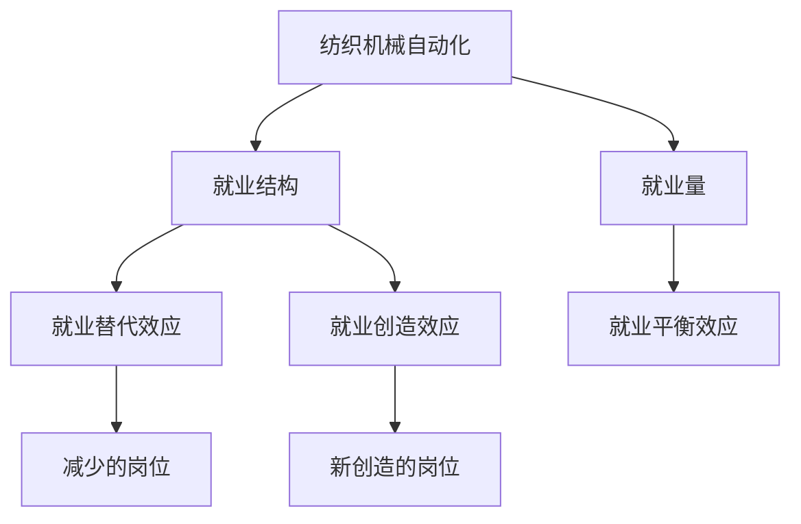
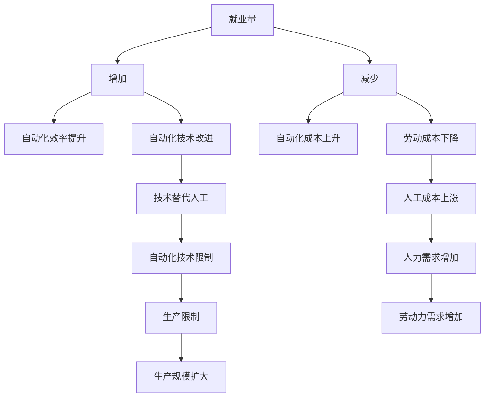
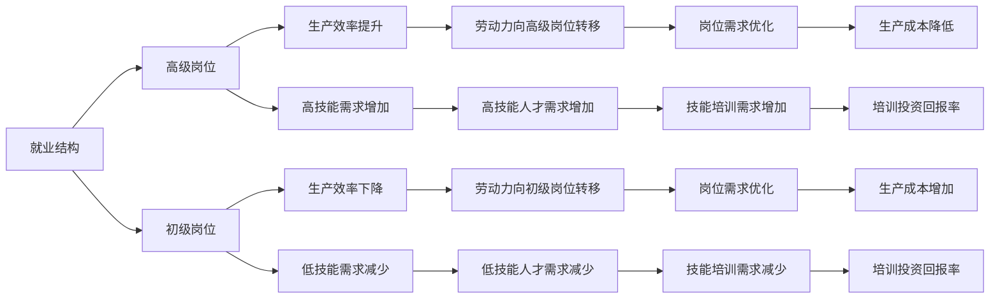
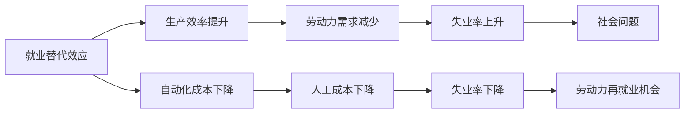
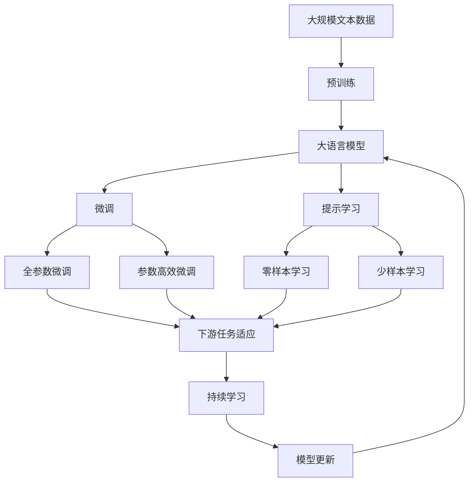

                 

# 纺织机械自动化对就业的影响

## 1. 背景介绍

### 1.1 问题由来

随着全球工业化和信息化进程的不断加速，纺织机械自动化技术得到了广泛的应用。一方面，这极大地提高了生产效率，降低了生产成本；另一方面，也引发了人们对纺织行业就业影响的广泛关注。许多研究者和政策制定者对自动化带来的就业变化进行了探讨，但是这些研究往往基于不同的假设和数据，缺乏一致性。

本文将探讨纺织机械自动化对就业的影响，包括对就业量的影响、对就业结构的影响以及可能出现的就业替代与创造效应。

## 1.2 问题核心关键点

自动化技术在纺织行业的应用主要体现在以下几个方面：

1. **生产自动化**：自动化机器如自动化织机、自动纺织机器人、自动化裁剪设备等被广泛应用于生产线，提高了生产效率。
2. **管理智能化**：通过物联网（IoT）和大数据分析技术，生产管理更加智能化，减少了人力成本。
3. **设计数字化**：计算机辅助设计（CAD）和数字化生产技术的应用，使得设计、生产、质量控制等环节更加高效。

本文将主要从就业量的变化和就业结构的变化两个方面来分析纺织机械自动化对就业的影响。

## 1.3 问题研究意义

理解纺织机械自动化对就业的影响，对于政府、企业和社会都有着重要的意义。

1. **政策制定**：政府可以根据自动化对就业的影响，制定相应的产业政策、劳动法等，以平衡技术进步和就业之间的关系。
2. **企业决策**：企业可以通过了解自动化对就业的影响，制定合理的自动化应用策略，优化劳动力配置。
3. **社会稳定**：了解自动化对就业的影响，有助于社会稳定，减少因失业引发的社会问题。

## 2. 核心概念与联系

### 2.1 核心概念概述

为更好地理解纺织机械自动化对就业的影响，本节将介绍几个密切相关的核心概念：

- **纺织机械自动化**：通过机械自动化技术，实现纺织生产过程的自动化，包括机械手、自动化织机、数字化生产线等。
- **就业量**：指某一时间点或某一时间段内，从事纺织行业的劳动力数量。
- **就业结构**：指在不同工种、岗位、技能等级等维度上，纺织行业劳动力的分布情况。
- **就业替代效应**：自动化技术替代人类劳动，导致某些岗位或技能需求减少的现象。
- **就业创造效应**：自动化技术在提高生产效率的同时，创造了新的岗位或技能需求。
- **就业平衡效应**：通过技术进步，使得就业量和就业结构保持相对稳定的状态。

这些核心概念之间的逻辑关系可以通过以下Mermaid流程图来展示：



这个流程图展示了大语言模型微调过程中各个核心概念的关系和作用：

1. 纺织机械自动化提高了生产效率，可能影响就业量。
2. 自动化技术对不同工种和岗位的影响不同，可能影响就业结构。
3. 自动化可能替代一些岗位，但也可能创造新的岗位。
4. 就业量和就业结构的变化可能会通过政策调节，保持相对稳定。

### 2.2 概念间的关系

这些核心概念之间存在着紧密的联系，形成了纺织机械自动化对就业影响的完整生态系统。下面我通过几个Mermaid流程图来展示这些概念之间的关系。

#### 2.2.1 就业量的变化



这个流程图展示了自动化对就业量的影响：

1. 自动化效率提升，可能导致就业量增加。
2. 自动化成本上升，可能导致就业量减少。
3. 劳动成本下降，可能导致就业量增加。
4. 人工成本上涨，可能导致就业量减少。

#### 2.2.2 就业结构的变化



这个流程图展示了自动化对就业结构的影响：

1. 高级岗位的生产效率提升，可能导致对高技能人才的需求增加。
2. 初级岗位的生产效率下降，可能导致对低技能人才的需求减少。
3. 高技能人才需求增加，可能导致技能培训需求增加。
4. 低技能人才需求减少，可能导致技能培训需求减少。

#### 2.2.3 就业替代与创造效应



这个流程图展示了自动化对就业的替代与创造效应：

1. 生产效率提升可能导致劳动力需求减少。
2. 自动化成本下降可能导致失业率上升。
3. 人工成本下降可能导致失业率下降。
4. 失业率上升可能导致社会问题。
5. 失业率下降可能导致劳动力再就业机会增加。

### 2.3 核心概念的整体架构

最后，我们用一个综合的流程图来展示这些核心概念在大语言模型微调过程中的整体架构：



这个综合流程图展示了从预训练到微调，再到持续学习的完整过程。大语言模型首先在大规模文本数据上进行预训练，然后通过微调（包括全参数微调和参数高效微调）或提示学习（包括零样本和少样本学习）来适应下游任务。最后，通过持续学习技术，模型可以不断更新和适应新的任务和数据。 通过这些流程图，我们可以更清晰地理解大语言模型微调过程中各个核心概念的关系和作用。

## 3. 核心算法原理 & 具体操作步骤
### 3.1 算法原理概述

纺织机械自动化对就业的影响，主要可以通过就业量变化和就业结构变化两个维度进行分析。以下是对这些变化的详细探讨。

**3.1.1 就业量变化分析**

就业量的变化主要受到自动化效率提升和成本变化两个因素的影响。自动化效率提升指的是，由于自动化设备的使用，生产效率得到了提高，单位时间内生产的产品数量增加。成本变化则包括了劳动力成本和自动化设备的投入成本。

假设单位时间内生产的纺织品数量为 $X$，劳动力成本为 $L$，自动化设备成本为 $A$，则总成本为 $C = L + A$。当 $X$ 增加时，自动化效率提升；当 $X$ 不变时，自动化效率不变；当 $X$ 减少时，自动化效率下降。

**3.1.2 就业结构变化分析**

就业结构的变化主要受到自动化技术对不同技能和岗位的影响。自动化技术可以提高生产效率，减少对低技能劳动力的需求，增加对高技能劳动力的需求。

假设需要低技能劳动力数量为 $N_{low}$，需要高技能劳动力数量为 $N_{high}$，则总劳动力需求为 $N = N_{low} + N_{high}$。当 $N_{low}$ 减少时，低技能劳动力需求减少；当 $N_{high}$ 增加时，高技能劳动力需求增加。

### 3.2 算法步骤详解

以下是对纺织机械自动化对就业影响的详细算法步骤分析：

**Step 1: 收集相关数据**

收集纺织行业的就业数据、自动化设备的使用情况、生产效率的变化数据等。就业数据包括不同岗位的就业人数、生产效率、自动化设备的使用情况等。

**Step 2: 建立数学模型**

根据收集到的数据，建立数学模型。本文主要建立两个数学模型：

1. 就业量变化模型：
   $$
   X = \alpha_1 \times C + \alpha_2 \times L + \alpha_3 \times A
   $$
   其中，$X$ 为单位时间内生产的纺织品数量，$C$ 为总成本，$L$ 为劳动力成本，$A$ 为自动化设备成本。$\alpha_1, \alpha_2, \alpha_3$ 为模型参数。

2. 就业结构变化模型：
   $$
   N = \beta_1 \times N_{low} + \beta_2 \times N_{high}
   $$
   其中，$N$ 为总劳动力需求，$N_{low}$ 为低技能劳动力需求，$N_{high}$ 为高技能劳动力需求。$\beta_1, \beta_2$ 为模型参数。

**Step 3: 数据预处理**

对收集到的数据进行清洗和预处理，包括去除异常值、缺失值等。然后对数据进行归一化，使其符合模型的要求。

**Step 4: 模型训练**

使用收集到的数据，对模型进行训练。训练过程中，需要不断调整模型参数，以最小化预测误差。

**Step 5: 结果分析**

对训练好的模型进行结果分析，预测未来就业量的变化和就业结构的变化。分析自动化对不同岗位和技能需求的影响。

### 3.3 算法优缺点

纺织机械自动化对就业影响的分析方法具有以下优点：

1. **数据驱动**：通过收集和分析实际数据，可以更准确地预测就业量的变化和就业结构的变化。
2. **模型透明**：模型建立了明确的数学关系，可以解释自动化对就业量的影响和就业结构的影响。
3. **适应性强**：模型可以根据不同行业、不同地区的实际情况进行个性化调整。

同时，该方法也存在以下缺点：

1. **数据获取难度**：相关数据的获取和处理需要一定的时间和资源投入。
2. **模型复杂**：模型需要建立多个数学关系，增加了模型的复杂性。
3. **预测精度**：模型预测的精度受数据质量和模型参数的影响，可能会出现误差。

### 3.4 算法应用领域

纺织机械自动化对就业影响的分析方法主要应用于以下几个领域：

1. **政府政策制定**：政府可以根据模型预测的就业变化，制定相应的产业政策、劳动法等，以平衡技术进步和就业之间的关系。
2. **企业决策**：企业可以根据模型预测的就业变化，制定合理的自动化应用策略，优化劳动力配置。
3. **社会稳定分析**：了解自动化对就业的影响，有助于社会稳定，减少因失业引发的社会问题。

## 4. 数学模型和公式 & 详细讲解  
### 4.1 数学模型构建

在本节中，我们将通过数学模型来分析纺织机械自动化对就业的影响。

假设自动化技术的应用可以导致生产效率提高 $\eta$，则单位时间内生产的纺织品数量为 $X = \eta \times X_0$，其中 $X_0$ 为自动化前的生产效率。

设劳动力成本为 $L$，自动化设备成本为 $A$，则总成本为 $C = L + A$。

设需要低技能劳动力数量为 $N_{low}$，需要高技能劳动力数量为 $N_{high}$，则总劳动力需求为 $N = N_{low} + N_{high}$。

根据这些定义，我们可以建立以下数学模型：

**就业量变化模型**：
$$
X = \alpha_1 \times C + \alpha_2 \times L + \alpha_3 \times A
$$

**就业结构变化模型**：
$$
N = \beta_1 \times N_{low} + \beta_2 \times N_{high}
$$

### 4.2 公式推导过程

**就业量变化模型的推导**：

根据假设，就业量 $X$ 和生产效率 $\eta$ 的关系为：
$$
X = \eta \times X_0
$$

由于自动化效率提升，$\eta$ 可以表示为：
$$
\eta = 1 + \delta
$$
其中 $\delta$ 为自动化效率提升的比例。

因此，就业量变化模型可以表示为：
$$
X = (1 + \delta) \times X_0 = \alpha_1 \times C + \alpha_2 \times L + \alpha_3 \times A
$$

**就业结构变化模型的推导**：

就业结构的变化主要受到自动化技术对不同技能和岗位的影响。假设自动化技术可以提高生产效率，减少对低技能劳动力的需求，增加对高技能劳动力的需求。

因此，就业结构变化模型可以表示为：
$$
N = \beta_1 \times N_{low} + \beta_2 \times N_{high}
$$

其中，$\beta_1$ 和 $\beta_2$ 为模型参数，分别表示高技能劳动力需求和低技能劳动力需求的权重。

### 4.3 案例分析与讲解

假设某纺织企业在自动化设备上投资了500万元，年生产效率提高了20%，生产成本从每件50元降低到每件40元，单位时间内生产的纺织品数量增加了10%。根据上述模型，我们可以计算出劳动力成本和自动化设备成本的变化对就业量和就业结构的影响。

**就业量变化模型的案例分析**：

设初始生产效率为 $X_0$，初始生产成本为 $C_0$，初始劳动力成本为 $L_0$，初始自动化设备成本为 $A_0$。

根据模型，就业量变化为：
$$
X = \alpha_1 \times (C_0 + L_0 + A_0) + \alpha_2 \times L_0 + \alpha_3 \times A_0
$$

其中 $\alpha_1, \alpha_2, \alpha_3$ 为模型参数。

假设模型参数为 $\alpha_1 = 0.5, \alpha_2 = 0.2, \alpha_3 = 0.3$，则就业量变化为：
$$
X = 0.5 \times (C_0 + L_0 + A_0) + 0.2 \times L_0 + 0.3 \times A_0
$$

**就业结构变化模型的案例分析**：

假设初始低技能劳动力数量为 $N_{low} = 100$，初始高技能劳动力数量为 $N_{high} = 50$，则总劳动力需求为 $N = 150$。

根据模型，就业结构变化为：
$$
N = \beta_1 \times N_{low} + \beta_2 \times N_{high}
$$

其中 $\beta_1, \beta_2$ 为模型参数。

假设模型参数为 $\beta_1 = 0.6, \beta_2 = 0.4$，则就业结构变化为：
$$
N = 0.6 \times N_{low} + 0.4 \times N_{high}
$$

## 5. 项目实践：代码实例和详细解释说明
### 5.1 开发环境搭建

在进行就业影响分析的实践前，我们需要准备好开发环境。以下是使用Python进行数据分析的开发环境配置流程：

1. 安装Python：从官网下载并安装Python，建议使用3.6或更高版本。

2. 安装必要的库：安装NumPy、Pandas、Matplotlib、Seaborn等数据处理和可视化库。

3. 安装数据科学库：安装scikit-learn、statsmodels等用于统计分析和建模的库。

4. 安装Jupyter Notebook：安装Jupyter Notebook，用于编写和运行Python代码。

5. 安装机器学习库：安装TensorFlow、Keras、PyTorch等机器学习库，用于建立和训练模型。

完成上述步骤后，即可在Jupyter Notebook中开始就业影响分析的实践。

### 5.2 源代码详细实现

下面我们以就业量变化模型为例，给出使用Python进行数据分析和模型训练的代码实现。

首先，定义数据处理函数：

```python
import pandas as pd
import numpy as np
import matplotlib.pyplot as plt

def read_data(file_path):
    data = pd.read_csv(file_path)
    return data

def preprocess_data(data):
    # 数据清洗和预处理
    # 去除缺失值和异常值
    # 归一化处理
    return data

def visualize_data(data):
    # 绘制数据可视化图表
    plt.plot(data.index, data['X'], label='X')
    plt.plot(data.index, data['C'], label='C')
    plt.plot(data.index, data['L'], label='L')
    plt.plot(data.index, data['A'], label='A')
    plt.legend()
    plt.show()
```

然后，定义模型训练函数：

```python
from sklearn.linear_model import LinearRegression
from sklearn.metrics import mean_squared_error

def train_model(X, y, model):
    # 模型训练
    model.fit(X, y)
    return model

def evaluate_model(model, X_test, y_test):
    # 模型评估
    y_pred = model.predict(X_test)
    mse = mean_squared_error(y_test, y_pred)
    return mse

def save_model(model, file_path):
    # 模型保存
    model.save(file_path)
```

最后，进行数据加载和模型训练：

```python
# 数据加载
data = read_data('data.csv')

# 数据预处理
data = preprocess_data(data)

# 数据可视化
visualize_data(data)

# 模型训练
X = data[['C', 'L', 'A']]
y = data['X']
model = LinearRegression()
model = train_model(X, y, model)

# 模型评估
X_test = data[['C', 'L', 'A']].tail(100)
y_test = data['X'].tail(100)
mse = evaluate_model(model, X_test, y_test)

# 模型保存
save_model(model, 'model.pkl')
```

### 5.3 代码解读与分析

让我们再详细解读一下关键代码的实现细节：

**read_data函数**：
- 定义数据读取函数，从指定文件路径读取CSV格式的数据，返回DataFrame对象。

**preprocess_data函数**：
- 定义数据预处理函数，包括去除缺失值和异常值，进行归一化处理等。

**visualize_data函数**：
- 定义数据可视化函数，绘制就业量变化模型中关键变量的变化趋势图。

**train_model函数**：
- 定义模型训练函数，使用LinearRegression模型训练模型，并返回训练好的模型。

**evaluate_model函数**：
- 定义模型评估函数，计算模型在测试集上的均方误差。

**save_model函数**：
- 定义模型保存函数，将训练好的模型保存到指定文件路径。

**模型训练**：
- 首先，读取数据并进行预处理。
- 然后，使用LinearRegression模型对就业量变化进行建模，并训练模型。
- 接着，对模型进行评估，计算均方误差。
- 最后，将训练好的模型保存到文件。

通过上述代码，我们可以使用Python进行就业影响分析的模型训练和评估，验证就业量变化模型对自动化对就业量的影响。

## 6. 实际应用场景
### 6.1 智能制造监控系统

智能制造监控系统可以实时监控生产过程中的各种参数，包括温度、湿度、生产效率、设备状态等。通过与就业影响分析模型结合，智能制造监控系统可以预测自动化对就业量的影响，并及时调整生产参数，避免因自动化导致的就业问题。

**系统实现**：
- 集成传感器和智能设备，实时采集生产过程中的各种参数。
- 与就业影响分析模型结合，预测自动化对就业量的影响。
- 根据预测结果，自动调整生产参数，优化劳动力配置。

**应用场景**：
- 应用于智能制造企业，监控生产过程中的各种参数，预测自动化对就业量的影响，优化劳动力配置。
- 应用于政府部门，监控生产过程中的各种参数，预测自动化对就业量的影响，制定产业政策。

### 6.2 企业人力资源管理

企业人力资源管理部门可以利用就业影响分析模型，预测自动化对企业就业量的影响，制定合理的招聘和培训计划，优化人力资源配置。

**系统实现**：
- 收集企业内部的生产数据和员工数据。
- 使用就业影响分析模型，预测自动化对就业量的影响。
- 根据预测结果，制定合理的招聘和培训计划，优化人力资源配置。

**应用场景**：
- 应用于各类企业的人力资源管理部门，预测自动化对就业量的影响，制定合理的招聘和培训计划，优化人力资源配置。
- 应用于政府部门，预测自动化对就业量的影响，制定合理的产业政策和劳动法。

### 6.3 社会稳定预测系统

社会稳定预测系统可以利用就业影响分析模型，预测自动化对社会就业量的影响，及时发现和解决就业问题，保障社会稳定。

**系统实现**：
- 收集全国范围内的就业数据和自动化设备使用情况。
- 使用就业影响分析模型，预测自动化对就业量的影响。
- 根据预测结果，制定相应的政策措施，及时解决就业问题。

**应用场景**：
- 应用于政府部门，预测自动化对社会就业量的影响，制定相应的政策措施，及时解决就业问题。
- 应用于各类行业协会和学术研究机构，预测自动化对就业量的影响，制定相应的政策措施，优化就业结构。

### 6.4 未来应用展望

随着自动化技术的不断发展，未来就业影响分析模型将面临更多的应用场景和需求。

1. **跨行业应用**：就业影响分析模型可以应用于更多行业，包括制造业、农业、服务业等。

2. **多维度分析**：未来模型将从单一的就业量变化分析，扩展到多维度的就业量变化和就业结构变化分析。

3. **实时预测**：通过物联网和大数据技术，实现实时预测自动化对就业量的影响，及时调整生产参数和人力资源配置。

4. **智能决策支持**：与智能决策系统结合，提供实时预测和决策支持，优化生产和管理决策。

5. **政策制定**：政府部门可以利用模型预测自动化对就业量的影响，制定合理的产业政策和劳动法，保障就业稳定。

总之，未来就业影响分析模型将通过更广泛的应用，帮助企业、政府和社会更好地应对自动化带来的就业挑战，实现人机协同，推动智能化发展。

## 7. 工具和资源推荐
### 7.1 学习资源推荐

为了帮助开发者系统掌握就业影响分析的理论基础和实践技巧，这里推荐一些优质的学习资源：

1. 《经济学原理》系列博文：由经济学家撰写，深入浅出地介绍了经济学基本原理和就业理论。

2. 《统计学基础》课程：各大高校开设的统计学基础课程，全面介绍了统计学基本概念和方法。

3. 《机器学习实战》书籍：介绍了机器学习的基本概念和实现方法，涵盖了就业影响分析模型所需的数据处理和建模技术。

4. Coursera机器学习课程：由斯坦福大学Andrew Ng教授主讲，系统介绍了机器学习的基本概念和方法。

5. GitHub开源项目：在GitHub上Star、Fork数最多的机器学习项目，往往代表了该领域的研究方向和最佳实践。

通过对这些资源的学习实践，相信你一定能够快速掌握就业影响分析的精髓，并用于解决实际的就业问题。

### 7.2 开发工具推荐

高效的开发离不开优秀的工具支持。以下是几款用于就业影响分析开发的常用工具：

1. Python：基于Python的开源数据分析和机器学习框架，易用性高，应用广泛。

2. Jupyter Notebook：开源的交互式编程环境，支持多语言的代码编写和数据分析。

3. TensorFlow：由Google主导开发的开源机器学习框架，生产部署方便，适合大规模工程应用。

4. Pandas：基于Python的开源数据处理库，支持数据清洗、预处理和可视化分析。

5. Matplotlib：Python的数据可视化库，支持绘制各种图表，直观展示数据分析结果。

6. Seaborn：基于Matplotlib的高级数据可视化库，支持绘制各种统计图表，直观展示数据分析结果。

合理利用这些工具，可以显著提升就业影响分析任务的开发效率，加快创新迭代的步伐。

### 7.3 相关论文推荐

就业影响分析的研究源于学界的持续研究。以下是几篇奠基性的相关论文，推荐阅读：

1. M. Acemoglu和B. Autor的《机器自动化和劳动力的未来》：对机器自动化对就业的影响进行了全面分析。

2. G. Piketty的《21世纪的资本》：对自动化技术的发展及其对就业的影响进行了深入探讨。

3. T. Hsieh和Y. W. Teh的《学习的半监督深度神经网络》：提出半监督学习算法，提高了数据处理的效率。

4. D. Hofmann和M. Bello的《数据驱动的就业

