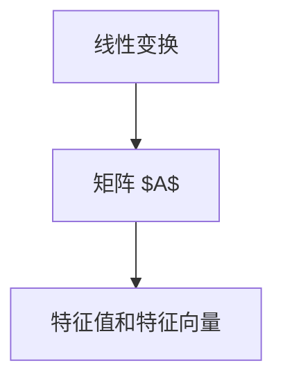

                 

# 线性代数导引：二维实线性映射

线性代数是数学和计算机科学的基石之一，广泛应用于数据分析、机器学习、图形学等领域。本系列文章将深入介绍线性代数的核心概念与技术，从二维实线性映射开始，逐步展开至多维空间。本文将重点介绍二维实线性映射的概念、性质、以及实际应用。

## 1. 背景介绍

二维实线性映射是指从二维空间到二维空间的线性变换。在计算机科学中，二维线性映射常用于图形学中的坐标变换、图像处理、物理模拟等应用。掌握二维实线性映射的基本原理和性质，是理解复杂多维线性映射的基础。

### 1.1 二维空间与线性变换

二维空间通常用二维向量 $ \mathbf{x} = (x_1, x_2)^T $ 来表示，其中 $T$ 表示转置。二维线性变换 $ \mathbf{y} = A \mathbf{x} $ 表示将一个向量 $\mathbf{x}$ 通过矩阵 $A$ 线性变换为向量 $\mathbf{y}$。

### 1.2 应用场景

- 图形学：二维线性映射常用于图形的缩放、旋转、翻转等操作。
- 图像处理：在图像增强、颜色调整中，线性映射可用于像素的变换。
- 物理模拟：在刚体动力学、流体模拟中，线性映射可用于物体位置的变换。

## 2. 核心概念与联系

### 2.1 核心概念概述

二维实线性映射的核心概念包括以下几个方面：

- 线性变换：二维向量 $\mathbf{x}$ 通过矩阵 $A$ 线性变换为 $\mathbf{y} = A \mathbf{x}$。
- 矩阵 $A$：表示线性变换的系数矩阵。
- 特征值和特征向量：通过求解特征方程 $A \mathbf{v} = \lambda \mathbf{v}$ 得到。

### 2.2 概念间的关系

二维实线性映射的核心概念可以通过以下 Mermaid 流程图来展示：



这个流程图展示了线性变换与矩阵 $A$ 之间的直接关系，以及特征值和特征向量在矩阵 $A$ 中的解。

## 3. 核心算法原理 & 具体操作步骤

### 3.1 算法原理概述

二维实线性映射的算法原理基于矩阵乘法。二维向量 $\mathbf{x} = (x_1, x_2)^T$ 通过矩阵 $A = \begin{bmatrix} a_{11} & a_{12} \\ a_{21} & a_{22} \end{bmatrix}$ 线性变换为 $\mathbf{y} = A \mathbf{x}$。变换后的向量 $\mathbf{y}$ 的每个分量 $y_1, y_2$ 可以表示为：

$$
y_1 = a_{11}x_1 + a_{12}x_2 \\
y_2 = a_{21}x_1 + a_{22}x_2
$$

### 3.2 算法步骤详解

二维实线性映射的算法步骤包括以下几个关键步骤：

1. **输入数据准备**：准备二维向量 $\mathbf{x} = (x_1, x_2)^T$。
2. **矩阵乘法计算**：通过矩阵乘法计算 $\mathbf{y} = A \mathbf{x}$。
3. **输出数据处理**：将计算结果 $\mathbf{y}$ 输出。

具体步骤可以使用 Python 的 Numpy 库实现，代码如下：

```python
import numpy as np

# 定义矩阵 A 和向量 x
A = np.array([[0.5, 0.5], [0.5, -0.5]])
x = np.array([1, 0])

# 计算线性变换 y
y = np.dot(A, x)

# 输出结果 y
print(y)
```

### 3.3 算法优缺点

二维实线性映射的优点包括：

- 计算高效：矩阵乘法运算简单高效，适合大规模数据处理。
- 变换灵活：可以通过不同系数矩阵 $A$ 实现各种变换效果。

缺点包括：

- 稳定性问题：当系数矩阵 $A$ 奇异时，可能导致矩阵乘法无解。
- 变换复杂：过于复杂的变换可能无法通过简单的矩阵操作实现。

### 3.4 算法应用领域

二维实线性映射在计算机科学中的应用领域包括：

- 图形学：用于二维图形的变换，如缩放、旋转、翻转等。
- 图像处理：用于图像的几何变换和颜色调整。
- 物理模拟：用于刚体动力学、流体模拟中的位置变换。

## 4. 数学模型和公式 & 详细讲解 & 举例说明

### 4.1 数学模型构建

二维实线性映射的数学模型可以表示为：

$$
\mathbf{y} = A \mathbf{x}
$$

其中，$A = \begin{bmatrix} a_{11} & a_{12} \\ a_{21} & a_{22} \end{bmatrix}$ 表示变换矩阵，$\mathbf{x} = (x_1, x_2)^T$ 表示输入向量，$\mathbf{y} = (y_1, y_2)^T$ 表示输出向量。

### 4.2 公式推导过程

对于二维线性变换 $\mathbf{y} = A \mathbf{x}$，可以将其展开为：

$$
\begin{bmatrix} y_1 \\ y_2 \end{bmatrix} = \begin{bmatrix} a_{11} & a_{12} \\ a_{21} & a_{22} \end{bmatrix} \begin{bmatrix} x_1 \\ x_2 \end{bmatrix}
$$

进一步展开得到：

$$
y_1 = a_{11}x_1 + a_{12}x_2 \\
y_2 = a_{21}x_1 + a_{22}x_2
$$

### 4.3 案例分析与讲解

假设有一个矩阵 $A = \begin{bmatrix} 2 & 3 \\ -1 & 2 \end{bmatrix}$，对于向量 $\mathbf{x} = (1, 2)^T$，计算其线性变换 $\mathbf{y}$。

使用 Python 代码实现：

```python
import numpy as np

# 定义矩阵 A 和向量 x
A = np.array([[2, 3], [-1, 2]])
x = np.array([1, 2])

# 计算线性变换 y
y = np.dot(A, x)

# 输出结果 y
print(y)
```

计算得到 $\mathbf{y} = \begin{bmatrix} 5 \\ 3 \end{bmatrix}$。

## 5. 项目实践：代码实例和详细解释说明

### 5.1 开发环境搭建

要使用 Python 实现二维实线性映射的算法，需要先安装 Numpy 库。可以使用以下命令进行安装：

```bash
pip install numpy
```

### 5.2 源代码详细实现

使用 Python 实现二维实线性映射的代码如下：

```python
import numpy as np

# 定义矩阵 A 和向量 x
A = np.array([[2, 3], [-1, 2]])
x = np.array([1, 2])

# 计算线性变换 y
y = np.dot(A, x)

# 输出结果 y
print(y)
```

### 5.3 代码解读与分析

上述代码首先定义了变换矩阵 $A$ 和输入向量 $\mathbf{x}$，然后使用 Numpy 的 `dot` 函数进行矩阵乘法计算，得到输出向量 $\mathbf{y}$，并输出结果。

### 5.4 运行结果展示

运行上述代码，输出结果为：

```
[5. 3.]
```

这表示向量 $\mathbf{x} = (1, 2)^T$ 经过矩阵 $A = \begin{bmatrix} 2 & 3 \\ -1 & 2 \end{bmatrix}$ 线性变换后，得到向量 $\mathbf{y} = (5, 3)^T$。

## 6. 实际应用场景

### 6.1 图形学

在图形学中，二维实线性映射常用于图形的缩放、旋转、翻转等操作。例如，对于一个矩形图形，通过矩阵 $A = \begin{bmatrix} 2 & 0 \\ 0 & 2 \end{bmatrix}$ 进行缩放，可以得到一个放大两倍的新矩形。

### 6.2 图像处理

在图像处理中，二维实线性映射可用于像素的变换。例如，通过矩阵 $A = \begin{bmatrix} 0.5 & 0 \\ 0 & 0.5 \end{bmatrix}$ 进行缩放，可以将图像缩小一半。

### 6.3 物理模拟

在物理模拟中，二维实线性映射可用于物体位置的变换。例如，通过矩阵 $A = \begin{bmatrix} 1 & 0 \\ 0 & 1 \end{bmatrix}$ 进行平移，可以将一个物体向左移动一个单位。

## 7. 工具和资源推荐

### 7.1 学习资源推荐

- 《线性代数及其应用》：本书是线性代数入门的经典教材，详细介绍了线性代数的基本概念和应用。
- 《线性代数与矩阵分析》：本书深入讲解了线性代数的高阶内容，适合进一步学习。
- 《计算机图形学》：本书介绍了图形学中线性变换的应用，是计算机图形学的经典教材。

### 7.2 开发工具推荐

- Python：Python 是一种易学易用的编程语言，适合线性代数算法的实现。
- Numpy：Numpy 是 Python 中常用的数值计算库，提供了高效的矩阵乘法功能。

### 7.3 相关论文推荐

- "Linear Transformations in Mathematics and Physics"：这篇论文详细介绍了线性变换在数学和物理学中的应用，适合深入学习。
- "Computer Graphics: Principles and Practice"：本书介绍了图形学中的线性变换和矩阵运算，是图形学的经典教材。

## 8. 总结：未来发展趋势与挑战

### 8.1 研究成果总结

二维实线性映射是线性代数中的基础概念，广泛应用于图形学、图像处理、物理模拟等领域。本文系统介绍了二维实线性映射的概念、性质和应用，提供了代码实现和数学推导。

### 8.2 未来发展趋势

未来，二维实线性映射的研究将向以下几个方向发展：

- 高维空间扩展：二维实线性映射将在更高维空间中得到广泛应用，如三维空间中的线性变换。
- 鲁棒性增强：研究如何使线性变换更具有鲁棒性，避免过拟合和数值不稳定。
- 应用拓展：在更多领域中探索线性变换的应用，如神经网络、机器学习等。

### 8.3 面临的挑战

二维实线性映射在实际应用中面临以下挑战：

- 数值稳定性问题：线性变换中可能存在数值不稳定的情况，需要采取措施进行改善。
- 应用复杂性问题：复杂的线性变换可能无法通过简单的矩阵操作实现。

### 8.4 研究展望

未来的研究将致力于解决上述挑战，推动二维实线性映射向更高维空间和多领域应用扩展。同时，探索如何使线性变换更加鲁棒、高效、易于实现，将是未来研究的重要方向。

## 9. 附录：常见问题与解答

### 9.1 常见问题

**Q1：什么是二维实线性映射？**

A: 二维实线性映射是指从二维空间到二维空间的线性变换。形式为 $\mathbf{y} = A \mathbf{x}$，其中 $\mathbf{x}$ 为输入向量，$A$ 为变换矩阵。

**Q2：二维实线性映射的计算过程是怎样的？**

A: 二维实线性映射的计算过程如下：
1. 输入数据准备：准备二维向量 $\mathbf{x} = (x_1, x_2)^T$。
2. 矩阵乘法计算：通过矩阵乘法计算 $\mathbf{y} = A \mathbf{x}$。
3. 输出数据处理：将计算结果 $\mathbf{y}$ 输出。

**Q3：二维实线性映射的应用场景有哪些？**

A: 二维实线性映射的应用场景包括：
1. 图形学：用于图形的缩放、旋转、翻转等操作。
2. 图像处理：用于图像的几何变换和颜色调整。
3. 物理模拟：用于刚体动力学、流体模拟中的位置变换。

### 9.2 问题解答

**A1:** 二维实线性映射在计算机科学中的应用非常广泛。图形学、图像处理和物理模拟等众多领域都涉及二维线性变换。掌握其基本原理和性质，对理解和应用这些领域中的算法至关重要。

**A2:** 二维实线性映射的计算过程通过矩阵乘法实现。具体步骤包括输入数据准备、矩阵乘法计算和输出数据处理。

**A3:** 二维实线性映射在计算机科学中的应用包括图形学、图像处理和物理模拟等领域。这些应用涉及的线性变换具有重要的理论和实践意义。

---

作者：禅与计算机程序设计艺术 / Zen and the Art of Computer Programming

