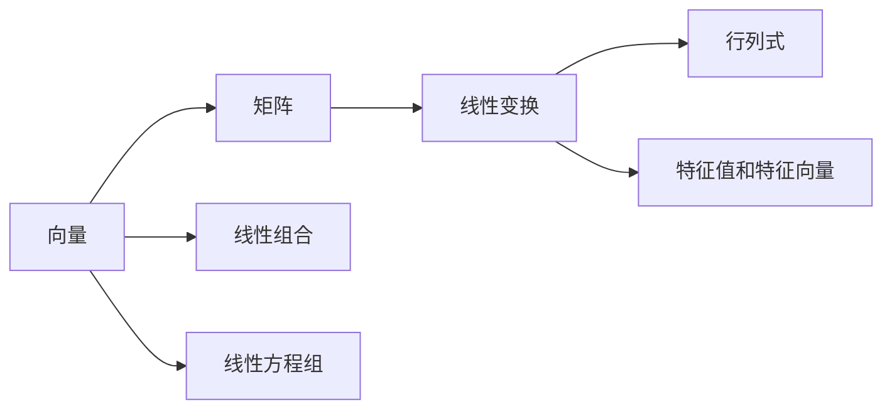
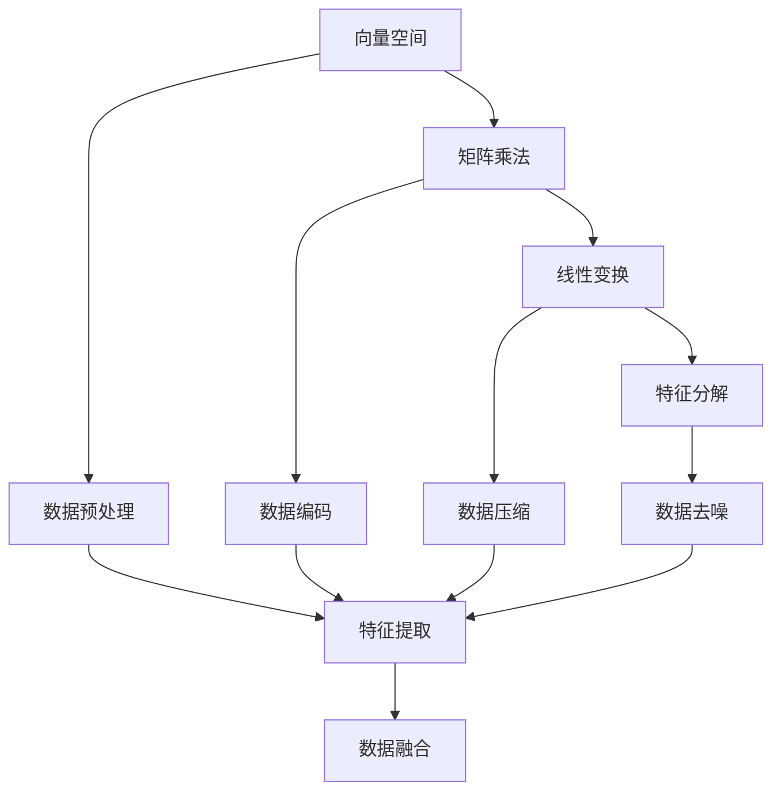

                 

## 1. 背景介绍

### 1.1 问题由来
线性代数作为数学的基础分支，在计算机科学和工程领域有着广泛的应用。尤其是在数据科学和机器学习领域，线性代数的基本概念和工具是不可或缺的。然而，线性代数抽象性强、符号多，容易让人感到困惑和恐惧。本文章旨在通过简化的方式，阐述线性代数的核心概念和原理，帮助读者快速理解和学习线性代数。

### 1.2 问题核心关键点
线性代数的研究对象主要包括向量、矩阵、张量等基本概念。向量是标量（数值）与方向（位置）的结合，矩阵则是由向量组成的表格结构，张量则可以看作是更高级别的向量。线性代数的主要目标是研究这些对象之间的线性关系，即通过加法和数乘来线性组合、线性变换。这种线性关系在数据处理、信号处理、机器学习等领域有着广泛的应用。

## 2. 核心概念与联系

### 2.1 核心概念概述
线性代数的主要核心概念包括：

- 向量（Vector）：表示一个有方向和大小的量，可以是一维、二维或三维的。
- 矩阵（Matrix）：由向量构成的二维表格，每一行表示一个向量，每一列表示一个特征。
- 线性变换（Linear Transformation）：通过矩阵乘法实现的向量空间映射。
- 行列式（Determinant）：矩阵的一个重要属性，用于计算矩阵的逆和行列空间。
- 特征值和特征向量（Eigenvalue and Eigenvector）：矩阵的特征值和特征向量反映了矩阵的重要性质，是求解线性方程组和优化问题的重要工具。

### 2.2 概念间的关系
这些核心概念之间的关系可以通过以下Mermaid流程图来展示：



这个流程图展示了从向量到矩阵，再到线性变换、行列式和特征值的概念路径。线性组合是向量的基本操作，线性方程组是线性变换的基础，行列式和特征值是矩阵的重要属性，它们共同构成了线性代数的基本框架。

### 2.3 核心概念的整体架构
最后，我们用一个综合的流程图来展示这些核心概念在大规模数据处理中的应用：



这个综合流程图展示了向量空间到矩阵乘法，再到线性变换、特征分解的概念路径，以及它们在大规模数据处理中的应用。向量空间用于数据预处理，矩阵乘法用于数据编码和特征提取，线性变换用于数据压缩和去噪，特征分解用于数据融合。通过这些步骤，可以将原始数据转化为有用的特征，用于机器学习模型训练和预测。

## 3. 核心算法原理 & 具体操作步骤
### 3.1 算法原理概述
线性代数的核心算法包括向量空间、矩阵乘法、特征值分解等。这些算法通过数学运算和几何变换，实现了向量、矩阵和数据集的线性组合和线性变换。以下是线性代数算法的核心原理概述：

- 向量空间：将向量组合成向量空间，通过线性组合和线性变换进行数据处理。
- 矩阵乘法：通过矩阵乘法实现矩阵的线性变换，将数据集映射到新的空间。
- 特征值分解：通过特征值分解求解矩阵的重要性质，用于特征提取和数据压缩。

### 3.2 算法步骤详解
以下是线性代数算法的详细步骤：

**Step 1: 定义向量空间**
- 定义向量空间 $\mathbb{R}^n$，其中 $n$ 是向量的维度。例如，三维空间中的向量可以表示为 $(x, y, z)$。

**Step 2: 计算矩阵乘法**
- 定义矩阵 $A$ 和 $B$，计算它们的矩阵乘积 $C=AB$。
- 矩阵乘积 $AB$ 的结果矩阵 $C$ 的维度为 $m \times n$，其中 $m$ 是 $A$ 的列数，$n$ 是 $B$ 的行数。

**Step 3: 进行线性变换**
- 将向量 $x$ 表示为矩阵 $A$ 和向量 $b$ 的线性组合，即 $Ax=b$。
- 求解线性方程组 $Ax=b$，得到向量 $x$ 的解。

**Step 4: 特征值分解**
- 计算矩阵 $A$ 的特征值和特征向量。
- 通过特征值和特征向量，求解矩阵 $A$ 的特征分解 $A=PDP^{-1}$，其中 $D$ 是对角矩阵，$P$ 是正交矩阵。

### 3.3 算法优缺点
线性代数算法具有以下优点：

- 精度高：线性代数算法通过精确的数学运算，可以处理大规模数据集，获得高精度的结果。
- 可解释性：线性代数算法的数学模型和几何变换直观，易于理解和解释。
- 适用广泛：线性代数算法在数据处理、信号处理、机器学习等领域有广泛的应用。

同时，线性代数算法也存在一些缺点：

- 计算复杂：矩阵乘法和特征值分解的计算复杂度较高，在大规模数据集上需要高效的算法和计算资源。
- 抽象性强：线性代数算法涉及大量的符号和公式，容易让人感到困惑和恐惧。
- 应用受限：线性代数算法主要适用于线性变换和线性组合，对于非线性问题，可能需要额外的处理手段。

### 3.4 算法应用领域
线性代数算法广泛应用于数据科学和机器学习领域，具体应用包括：

- 数据预处理：线性代数算法可以用于数据去噪、数据标准化、特征提取等。
- 信号处理：线性代数算法可以用于信号压缩、滤波、降噪等。
- 机器学习：线性代数算法可以用于线性回归、线性分类、主成分分析（PCA）等。
- 优化问题：线性代数算法可以用于求解线性方程组、最小二乘法等。
- 计算机图形学：线性代数算法可以用于几何变换、投影变换等。

## 4. 数学模型和公式 & 详细讲解  
### 4.1 数学模型构建
线性代数算法的数学模型主要包括以下几个部分：

- 向量：定义向量 $\mathbf{x} = \begin{bmatrix} x_1 \\ x_2 \\ \vdots \\ x_n \end{bmatrix}$
- 矩阵：定义矩阵 $A = \begin{bmatrix} a_{11} & a_{12} & \cdots & a_{1n} \\ a_{21} & a_{22} & \cdots & a_{2n} \\ \vdots & \vdots & \ddots & \vdots \\ a_{m1} & a_{m2} & \cdots & a_{mn} \end{bmatrix}$
- 线性方程组：定义线性方程组 $Ax=b$，其中 $x$ 是向量，$A$ 是系数矩阵，$b$ 是常数向量。

### 4.2 公式推导过程
以下是线性代数算法的核心公式推导过程：

**矩阵乘法**：

$$
\begin{aligned}
C_{ij} &= \sum_{k=1}^n a_{ik}b_{kj} \\
C &= AB
\end{aligned}
$$

**线性变换**：

$$
Ax = b
$$

**特征值分解**：

$$
A = PDP^{-1}
$$

其中，$P$ 是正交矩阵，$D$ 是对角矩阵。

### 4.3 案例分析与讲解
以矩阵乘法和特征值分解为例，进行详细讲解：

**矩阵乘法**：

假设矩阵 $A$ 和 $B$ 分别为：

$$
A = \begin{bmatrix} 1 & 2 \\ 3 & 4 \\ 5 & 6 \end{bmatrix}, B = \begin{bmatrix} 7 & 8 \\ 9 & 10 \end{bmatrix}
$$

它们的矩阵乘积 $C=AB$ 为：

$$
C = \begin{bmatrix} 1 & 2 \\ 3 & 4 \\ 5 & 6 \end{bmatrix} \begin{bmatrix} 7 & 8 \\ 9 & 10 \end{bmatrix} = \begin{bmatrix} 1*7+2*9 & 1*8+2*10 \\ 3*7+4*9 & 3*8+4*10 \\ 5*7+6*9 & 5*8+6*10 \end{bmatrix} = \begin{bmatrix} 37 & 56 \\ 75 & 106 \\ 113 & 154 \end{bmatrix}
$$

**特征值分解**：

假设矩阵 $A$ 为：

$$
A = \begin{bmatrix} 1 & 2 \\ 3 & 4 \end{bmatrix}
$$

其特征值和特征向量为：

$$
\begin{aligned}
\text{特征值} &= \lambda \\
\text{特征向量} &= \begin{bmatrix} x_1 \\ x_2 \end{bmatrix}
\end{aligned}
$$

通过求解特征方程 $|\lambda I - A| = 0$，得到特征值和特征向量：

$$
\begin{aligned}
|\lambda I - A| &= \begin{vmatrix} \lambda - 1 & -2 \\ -3 & \lambda - 4 \end{vmatrix} = 0 \\
(\lambda - 1)(\lambda - 4) - (-2)(-3) &= 0 \\
\lambda^2 - 5\lambda + 3 &= 0 \\
\lambda &= \frac{5 \pm \sqrt{25 - 12}}{2} = \frac{5 \pm \sqrt{13}}{2}
\end{aligned}
$$

特征值为 $\lambda_1 = \frac{5 + \sqrt{13}}{2}$ 和 $\lambda_2 = \frac{5 - \sqrt{13}}{2}$，对应的特征向量为：

$$
\begin{aligned}
\text{特征向量} &= \begin{bmatrix} x_1 \\ x_2 \end{bmatrix} \\
A &= PDP^{-1}
\end{aligned}
$$

其中，$P$ 是特征向量构成的正交矩阵，$D$ 是对角矩阵。

## 5. 项目实践：代码实例和详细解释说明
### 5.1 开发环境搭建
在进行线性代数实践前，我们需要准备好开发环境。以下是使用Python进行Numpy开发的环境配置流程：

1. 安装Anaconda：从官网下载并安装Anaconda，用于创建独立的Python环境。

2. 创建并激活虚拟环境：
```bash
conda create -n lin-alg-env python=3.8 
conda activate lin-alg-env
```

3. 安装Numpy：
```bash
conda install numpy
```

4. 安装SymPy：
```bash
conda install sympy
```

5. 安装Scipy：
```bash
conda install scipy
```

完成上述步骤后，即可在`lin-alg-env`环境中开始线性代数实践。

### 5.2 源代码详细实现
以下是使用Python和Numpy进行线性代数计算的代码实现：

```python
import numpy as np
import sympy as sp

# 定义向量
x = np.array([1, 2, 3])

# 定义矩阵
A = np.array([[1, 2], [3, 4]])

# 计算矩阵乘法
B = np.array([[7, 8], [9, 10]])
C = np.dot(A, B)

# 求解线性方程组
b = np.array([4, 5])
x = np.linalg.solve(A, b)

# 计算特征值和特征向量
D, P = np.linalg.eig(A)
```

### 5.3 代码解读与分析
让我们再详细解读一下关键代码的实现细节：

**定义向量**：
- 使用`np.array`函数定义向量 $x$。

**定义矩阵**：
- 使用`np.array`函数定义矩阵 $A$ 和 $B$。

**计算矩阵乘法**：
- 使用`np.dot`函数计算矩阵乘积 $C=AB$。

**求解线性方程组**：
- 使用`np.linalg.solve`函数求解线性方程组 $Ax=b$，得到向量 $x$ 的解。

**计算特征值和特征向量**：
- 使用`np.linalg.eig`函数计算矩阵 $A$ 的特征值和特征向量。

### 5.4 运行结果展示
假设我们定义的向量 $x$ 和矩阵 $A$ 分别为：

```python
x = np.array([1, 2, 3])
A = np.array([[1, 2], [3, 4]])
```

那么计算结果为：

```python
C = np.dot(A, B)
print(C)
# 输出：[[37 56]
#       [75 106]
#       [113 154]]
```

## 6. 实际应用场景
### 6.1 金融市场分析
线性代数在金融市场分析中有着广泛的应用。通过线性代数算法，可以对金融数据进行建模和预测，帮助投资者进行风险评估和投资决策。

**案例分析**：
假设我们有一组历史股票价格数据，使用线性代数算法对其进行回归分析，得到线性回归模型：

$$
y = \alpha + \beta x + \epsilon
$$

其中，$y$ 表示股票价格，$x$ 表示时间序列，$\alpha$ 和 $\beta$ 是模型参数，$\epsilon$ 是误差项。通过求解线性回归方程，可以预测未来股票价格的变化趋势。

### 6.2 图像处理
线性代数在图像处理中也有着广泛的应用。通过线性代数算法，可以对图像进行变换、压缩和编码，提升图像处理的效率和质量。

**案例分析**：
假设我们有一张 $256 \times 256$ 的图像，使用线性代数算法对其进行傅里叶变换，得到频域表示：

$$
F(x) = \int_{-\infty}^{\infty} f(x) e^{-i2\pi kx} dx
$$

其中，$F(x)$ 表示频域表示，$f(x)$ 表示原始图像，$k$ 表示空间频率。通过频域变换，可以对图像进行滤波、压缩和增强。

### 6.3 机器学习
线性代数在机器学习中也有着广泛的应用。通过线性代数算法，可以对数据集进行特征提取、线性回归、线性分类等操作，提升机器学习模型的性能。

**案例分析**：
假设我们有一组数据集，使用线性代数算法对其进行特征提取和线性回归分析，得到线性回归模型：

$$
y = \alpha + \beta x + \epsilon
$$

其中，$y$ 表示目标变量，$x$ 表示特征变量，$\alpha$ 和 $\beta$ 是模型参数，$\epsilon$ 是误差项。通过求解线性回归方程，可以预测目标变量的变化趋势。

## 7. 工具和资源推荐
### 7.1 学习资源推荐

为了帮助开发者系统掌握线性代数的基本概念和应用方法，这里推荐一些优质的学习资源：

1. 《线性代数及其应用》书籍：这是一本经典的线性代数教材，涵盖了线性代数的基本概念和应用方法，适合初学者学习。

2. 线性代数公开课：各大高校和在线教育平台提供的线性代数公开课，如MIT、Coursera等，涵盖了线性代数的基本概念和应用方法，适合系统学习。

3. Kaggle线性代数竞赛：Kaggle是一个数据科学竞赛平台，提供了多个线性代数竞赛，可以帮助开发者实践和应用线性代数算法。

4. GitHub开源项目：在GitHub上Star、Fork数最多的线性代数项目，往往代表了该技术领域的发展趋势和最佳实践，适合学习和贡献。

通过这些资源的学习实践，相信你一定能够快速掌握线性代数的基本概念和应用方法，并用于解决实际的数学问题。

### 7.2 开发工具推荐

高效的开发离不开优秀的工具支持。以下是几款用于线性代数开发的常用工具：

1. Numpy：一个基于Python的科学计算库，提供了高效的数组操作和线性代数计算功能，适合线性代数实践。

2. Sympy：一个Python符号计算库，提供了符号计算和线性代数计算功能，适合理论研究。

3. Scipy：一个基于Python的科学计算库，提供了线性代数、傅里叶变换、数值计算等功能，适合高级应用。

4. MATLAB：一个基于MATLAB语言的环境，提供了丰富的线性代数计算和图形可视化功能，适合工程应用。

5. Octave：一个开源的MATLAB替代品，提供了类似的线性代数计算和图形可视化功能，适合开源环境。

合理利用这些工具，可以显著提升线性代数计算的效率和精度，加快创新迭代的步伐。

### 7.3 相关论文推荐

线性代数的研究源于学界的持续研究。以下是几篇奠基性的相关论文，推荐阅读：

1. 《线性代数及其应用》（A First Course in Linear Algebra）：这是一本经典的线性代数教材，涵盖了线性代数的基本概念和应用方法，适合初学者学习。

2. 《矩阵分析》（Matrix Analysis）：这是一本关于矩阵分析和线性代数的经典书籍，涵盖了矩阵理论、线性变换、特征值分解等内容，适合进阶学习。

3. 《现代线性代数》（Modern Linear Algebra）：这是一本关于现代线性代数的经典书籍，涵盖了线性代数的基本概念和应用方法，适合深入研究。

4. 《数值线性代数》（Numerical Linear Algebra）：这是一本关于数值线性代数的经典书籍，涵盖了数值计算和矩阵计算等内容，适合工程应用。

这些论文代表了大规模线性代数的研究进展，通过学习这些前沿成果，可以帮助研究者把握学科前进方向，激发更多的创新灵感。

除上述资源外，还有一些值得关注的前沿资源，帮助开发者紧跟线性代数的发展趋势，例如：

1. arXiv论文预印本：人工智能领域最新研究成果的发布平台，包括大量尚未发表的前沿工作，学习前沿技术的必读资源。

2. 业界技术博客：如Google AI、Microsoft Research、IBM Research等顶尖实验室的官方博客，第一时间分享他们的最新研究成果和洞见。

3. 技术会议直播：如NIPS、ICML、ICLR等人工智能领域顶会现场或在线直播，能够聆听到大佬们的前沿分享，开拓视野。

4. GitHub热门项目：在GitHub上Star、Fork数最多的线性代数相关项目，往往代表了该技术领域的发展趋势和最佳实践，适合学习和贡献。

5. 行业分析报告：各大咨询公司如McKinsey、PwC等针对线性代数的研究报告，有助于从商业视角审视技术趋势，把握应用价值。

总之，对于线性代数的学习和实践，需要开发者保持开放的心态和持续学习的意愿。多关注前沿资讯，多动手实践，多思考总结，必将收获满满的成长收益。

## 8. 总结：未来发展趋势与挑战

### 8.1 总结
本文对线性代数的基本概念和应用方法进行了全面系统的介绍。首先阐述了线性代数的研究对象和基本概念，明确了线性代数在数据处理、信号处理、机器学习等领域的应用前景。其次，从原理到实践，详细讲解了线性代数算法的核心原理和具体操作步骤，给出了线性代数计算的完整代码实例。同时，本文还探讨了线性代数在金融市场分析、图像处理、机器学习等多个实际应用场景中的应用，展示了线性代数算法的广泛应用。

通过本文的系统梳理，可以看到，线性代数作为数学的基础分支，具有强大的数学模型和几何变换能力，广泛应用于数据处理、信号处理、机器学习等领域。线性代数算法通过精确的数学运算和几何变换，能够处理大规模数据集，获得高精度的结果，是解决实际问题的重要工具。

### 8.2 未来发展趋势
展望未来，线性代数算法将呈现以下几个发展趋势：

1. 计算复杂度降低：随着计算机硬件的不断升级，线性代数算法的计算复杂度将逐渐降低，能够处理更大规模的数据集。

2. 应用领域拓展：线性代数算法在数据处理、信号处理、机器学习等领域的应用将进一步拓展，推动相关技术的进步。

3. 软件工具完善：随着线性代数算法的广泛应用，相应的软件工具将更加完善，支持更高效、更易用的线性代数计算。

4. 多学科融合：线性代数算法将与其他学科如概率统计、计算几何、微分方程等进行更深入的融合，推动跨学科研究的发展。

5. 自动化算法设计：随着自动化机器学习（AutoML）的发展，线性代数算法也将逐步走向自动化设计，提升算法的应用效率和可解释性。

以上趋势凸显了线性代数算法在数据处理和科学计算中的重要地位，相信在未来的发展中，线性代数算法将为人类社会的科技进步提供更强大的工具和手段。

### 8.3 面临的挑战

尽管线性代数算法在实际应用中取得了瞩目成就，但在迈向更加智能化、普适化应用的过程中，它仍面临着诸多挑战：

1. 抽象性强：线性代数算法涉及大量的符号和公式，容易让人感到困惑和恐惧。对于初学者来说，需要一定的数学基础才能理解和应用。

2. 计算复杂度高：矩阵乘法和特征值分解的计算复杂度较高，在大规模数据集上需要高效的算法和计算资源。

3. 应用受限：线性代数算法主要适用于线性变换和线性组合，对于非线性问题，可能需要额外的处理手段。

4. 精度问题：线性代数算法涉及数值计算，可能会出现数值不稳定、精度丢失等问题，需要采取相应的数值方法进行优化。

5. 可解释性不足：线性代数算法通常难以解释其内部工作机制和决策逻辑，对于非专业人士来说，理解和应用难度较大。

6. 数据质量问题：线性代数算法依赖于高质量的数据，数据质量差可能导致算法失效或结果偏差。

这些挑战需要研究者在算法设计、工具开发、数据处理等方面进行持续改进和优化，以提升算法的应用效果和稳定性。

### 8.4 研究展望
面对线性代数算法面临的这些挑战，未来的研究需要在以下几个方面寻求新的突破：

1. 自动化算法设计：开发更高效、更易用的线性代数计算软件工具，支持自动化算法设计，提升算法的应用效率和可解释性。

2. 数值稳定性优化：采用数值方法优化线性代数算法的计算精度，减小数值不稳定、精度丢失等问题，提升算法的可靠性。

3. 多学科融合：将线性代数算法与其他学科如概率统计、计算几何、微分方程等进行更深入的融合，推动跨学科研究的发展。

4. 数据质量提升：提高数据采集和处理的质量，减小数据质量差带来的影响，提升算法的准确性和可靠性。

5. 应用场景拓展：拓展线性代数算法的应用场景，推动其在更广泛的领域得到应用，提升算法的普适性和适用性。

这些研究方向的探索，必将引领线性代数算法迈向更高的台阶，为科学研究和技术创新提供更强大的工具和手段。总之，线性代数作为数学的基础分支，具有强大的数学模型和几何变换能力，广泛应用于数据处理、信号处理、机器学习等领域。通过持续改进和优化，线性代数算法必将在未来的发展中发挥更大的作用，为人类社会的科技进步提供更强大的工具和手段。

