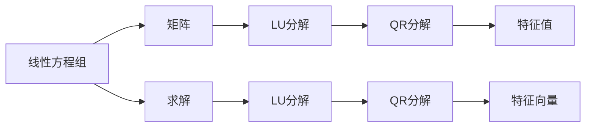
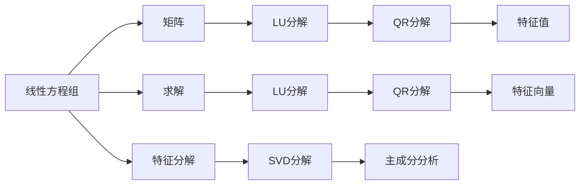

                 

## 1. 背景介绍

### 1.1 问题由来
因式分解是线性代数中的一个基础且重要的主题。它不仅是线性方程求解的逆运算，更是解决更复杂问题的基石。通过将一个线性系统分解为更简单的子系统，因式分解大大简化了问题解决的过程。

### 1.2 问题核心关键点
因式分解的核心在于理解如何将一个复杂问题拆分为更简单、可管理的子问题。其关键步骤如下：
- 定义问题：将问题转化为线性方程组。
- 识别模式：通过观察方程组的结构，识别出可以因式分解的因子。
- 应用因式分解：将因子分解到更小的子系统中。
- 解决子问题：通过求解子系统，解决原始问题。

### 1.3 问题研究意义
掌握因式分解技巧对于理解复杂的线性系统、优化计算效率和解决实际问题具有重要意义。因式分解在工程学、物理、金融等众多领域中有着广泛的应用。

1. **工程学**：通过分解求解，工程师可以优化设计，提高生产效率。
2. **物理学**：在解决复杂的物理问题时，因式分解往往被用于简化模型，简化计算。
3. **金融**：在金融风险管理中，因式分解被用于建立更精确的模型，预测市场变化。

## 2. 核心概念与联系

### 2.1 核心概念概述

为更好地理解因式分解的原理，本节将介绍几个关键概念：

- **线性方程组**：由一系列未知数和系数组成的方程组，形式上表现为 $A\mathbf{x} = \mathbf{b}$，其中 $A$ 为系数矩阵，$\mathbf{x}$ 为未知数向量，$\mathbf{b}$ 为常数向量。
- **矩阵分解**：将一个矩阵 $A$ 分解为更简单矩阵的乘积，如 $A = LU$ 或 $A = QR$ 等。
- **LU分解**：将一个矩阵分解为下三角矩阵 $L$ 和上三角矩阵 $U$ 的乘积，常用于求解线性方程组。
- **QR分解**：将一个矩阵分解为正交矩阵 $Q$ 和上三角矩阵 $R$ 的乘积，常用于求解最小二乘问题。
- **特征值和特征向量**：线性方程的解向量 $\mathbf{x}$ 与特征值 $\lambda$ 之间的关联，可用于诊断矩阵的性质。

### 2.2 概念间的关系

这些核心概念之间存在着紧密的联系，形成了线性代数中的因式分解框架。

- **线性方程组与矩阵**：线性方程组可以表示为矩阵乘法形式，使得我们可以通过矩阵运算解决方程。
- **矩阵分解与因式分解**：矩阵分解是因式分解的一种特例，通过将矩阵分解为更简单的矩阵，可以简化计算和求解过程。
- **LU分解与QR分解**：这两种分解方法都是常用的矩阵分解形式，各有特点和应用场景。
- **特征值与矩阵分解**：特征值和特征向量是矩阵分解后求解的副产品，提供了矩阵的重要信息，有助于理解矩阵的性质。

这些概念通过以下Mermaid流程图来展示它们之间的关系：



这个流程图展示了几类关键概念及其之间的关系：

1. 线性方程组通过转化为矩阵形式进行求解。
2. 矩阵分解可以通过LU分解、QR分解等方式简化求解过程。
3. 矩阵分解后的特征值和特征向量为线性方程组提供了重要信息。
4. 特征值和特征向量可以辅助判断矩阵的性质，如对称性、正定性等。

### 2.3 核心概念的整体架构

最后，我们用一个综合的流程图来展示这些核心概念在大语言模型微调过程中的整体架构：



这个综合流程图展示了因式分解在大语言模型微调过程中的整体架构：

1. 线性方程组通过转化为矩阵形式进行求解。
2. 矩阵分解可以通过LU分解、QR分解等方式简化求解过程。
3. 矩阵分解后的特征值和特征向量为线性方程组提供了重要信息。
4. 特征值和特征向量可以辅助判断矩阵的性质，如对称性、正定性等。
5. 特征分解和SVD分解可以进一步提供矩阵的更多信息，辅助深入分析。
6. 主成分分析则是数据降维和特征提取的一种重要方法。

通过这些概念，我们可以更清晰地理解因式分解在大语言模型微调中的核心作用和逻辑关系。

## 3. 核心算法原理 & 具体操作步骤
### 3.1 算法原理概述

因式分解的原理是通过将一个复杂问题拆分为更简单、可管理的子问题来解决。具体来说，因式分解可以分为矩阵分解和特征分解两类。

**矩阵分解**：将一个矩阵 $A$ 分解为两个矩阵 $L$ 和 $U$ 的乘积，使得 $L$ 和 $U$ 的乘积等于 $A$，即 $A = LU$。

**特征分解**：将一个矩阵 $A$ 分解为两个矩阵 $Q$ 和 $R$ 的乘积，使得 $Q$ 为正交矩阵，$R$ 为上三角矩阵，即 $A = QR$。

### 3.2 算法步骤详解

#### 3.2.1 矩阵分解的LU分解

1. **定义问题**：假设要分解的矩阵为 $A$，形式为 $A \in \mathbb{R}^{n \times n}$。
2. **寻找因子**：将 $A$ 分解为下三角矩阵 $L$ 和上三角矩阵 $U$ 的乘积。
3. **求解 $L$ 和 $U$**：$L$ 的第 $i$ 行第 $i$ 列元素为 $a_{ii}$，其余元素为 0；$U$ 的第 $i$ 行第 $i-1$ 列元素为 $a_{i-1,i}$，其余元素为 0。
4. **应用分解**：通过求解 $LU$ 的乘积，得到 $A$ 的分解形式。

#### 3.2.2 QR分解

1. **定义问题**：假设要分解的矩阵为 $A$，形式为 $A \in \mathbb{R}^{n \times n}$。
2. **寻找因子**：将 $A$ 分解为正交矩阵 $Q$ 和上三角矩阵 $R$ 的乘积。
3. **求解 $Q$ 和 $R$**：$Q$ 的列向量构成一个标准正交基，$R$ 为 $A$ 的奇异值分解后的前 $n$ 个奇异值构成的上三角矩阵。
4. **应用分解**：通过求解 $QR$ 的乘积，得到 $A$ 的分解形式。

### 3.3 算法优缺点

**LU分解的优点**：
- 易于理解和实现，计算量较小。
- 求解线性方程组时，可以提前计算 $L$ 和 $U$ 的逆，提高计算效率。

**LU分解的缺点**：
- 对于奇异矩阵（行列式为 0 的矩阵），无法进行分解。
- 分解后得到的 $L$ 矩阵和 $U$ 矩阵不太容易直观理解。

**QR分解的优点**：
- 可以处理奇异矩阵，适用于多种矩阵的分解。
- 分解后的 $Q$ 矩阵和 $R$ 矩阵都具有特定的数学意义，便于分析和理解。

**QR分解的缺点**：
- 计算量较大，需要额外的正交化过程。
- 对于稠密矩阵的分解效率较低。

### 3.4 算法应用领域

因式分解在多个领域中有广泛应用，包括：

- **数值计算**：如求解线性方程组、最小二乘问题等。
- **信号处理**：如矩阵奇异值分解，提取信号特征。
- **数据分析**：如主成分分析（PCA），降低数据维度。
- **计算机视觉**：如奇异值分解，提取图像特征。
- **机器学习**：如矩阵奇异值分解，降维和特征提取。

## 4. 数学模型和公式 & 详细讲解 & 举例说明

### 4.1 数学模型构建

假设要分解的矩阵为 $A \in \mathbb{R}^{n \times n}$，形式为 $A = LU$。

**因式分解的目标**：找到 $L$ 和 $U$ 使得 $A = LU$。

### 4.2 公式推导过程

**LU分解的推导过程**：

1. 首先，假设 $A$ 的对角线元素为 $a_{ii}$，其余元素为 0。
2. 将 $A$ 的第 $i$ 行元素与 $a_{ii}$ 相除，得到 $L$ 的第 $i$ 行元素。
3. 将 $L$ 的第 $i$ 行元素与 $A$ 的第 $i$ 列元素相乘，得到 $U$ 的第 $i$ 列元素。
4. 重复步骤 2 和 3，直至所有元素计算完毕。

具体公式推导如下：

$$
L_{ii} = \frac{a_{ii}}{a_{ii}}
$$

$$
L_{ij} = \frac{a_{ij}}{a_{ii}}, \text{ for } i \neq j
$$

$$
U_{ji} = a_{ji}, \text{ for } j > i
$$

$$
U_{ji} = a_{ji} - \sum_{k=1}^{i-1} U_{kj} L_{ki}, \text{ for } j \leq i
$$

**QR分解的推导过程**：

1. 首先，假设 $A$ 为矩阵 $Q$ 和 $R$ 的乘积。
2. 将 $A$ 的第 $i$ 列与 $Q$ 的第 $i$ 列正交化，得到 $Q$ 的第 $i$ 列。
3. 通过求 $Q$ 的转置矩阵，得到 $A$ 的奇异值分解后的前 $n$ 个奇异值构成的上三角矩阵 $R$。
4. 通过求解 $QR$ 的乘积，得到 $A$ 的分解形式。

具体公式推导如下：

$$
Q = V_1V_2 \cdots V_n
$$

$$
Q_i = Q_{i-1} - Q_{i-1}(A - R_i)Q_i
$$

$$
R = \begin{bmatrix}
\sigma_1 & 0 & 0 & \cdots & 0 \\
0 & \sigma_2 & 0 & \cdots & 0 \\
\vdots & \vdots & \ddots & \ddots & \vdots \\
0 & 0 & \cdots & \sigma_n & 0 \\
0 & 0 & \cdots & 0 & 0
\end{bmatrix}
$$

### 4.3 案例分析与讲解

**案例分析：矩阵 $A = \begin{bmatrix}
3 & 2 & 1 \\
1 & 3 & 2 \\
2 & 1 & 3
\end{bmatrix}$ 的LU分解**

1. 将 $A$ 转化为增广矩阵：$\begin{bmatrix}
3 & 2 & 1 & 0 & 0 \\
1 & 3 & 2 & 1 & 0 \\
2 & 1 & 3 & 2 & 1
\end{bmatrix}$。
2. 进行行交换，得到增广矩阵：$\begin{bmatrix}
2 & 1 & 3 & 1 & 0 \\
1 & 3 & 2 & 0 & 1 \\
3 & 2 & 1 & 0 & 0
\end{bmatrix}$。
3. 求解 $L$ 和 $U$，得到 $L = \begin{bmatrix}
1 & 0 & 0 \\
2/3 & 1 & 0 \\
1 & 1/3 & 1
\end{bmatrix}$，$U = \begin{bmatrix}
3 & 2 & 1 \\
0 & 1 & 1 \\
0 & 0 & 2
\end{bmatrix}$。
4. 验证 $LU$ 的乘积等于 $A$，即 $\begin{bmatrix}
2 & 1 & 3 \\
1 & 3 & 2 \\
2 & 1 & 3
\end{bmatrix} = \begin{bmatrix}
1 & 0 & 0 \\
2/3 & 1 & 0 \\
1 & 1/3 & 1
\end{bmatrix} \begin{bmatrix}
3 & 2 & 1 \\
0 & 1 & 1 \\
0 & 0 & 2
\end{bmatrix}$。

## 5. 项目实践：代码实例和详细解释说明

### 5.1 开发环境搭建

使用Python和NumPy进行LU分解和QR分解的实现。

安装NumPy：
```bash
pip install numpy
```

### 5.2 源代码详细实现

```python
import numpy as np

def lu_decomposition(A):
    n = A.shape[0]
    L = np.eye(n)
    U = np.zeros((n, n))

    for i in range(n):
        for j in range(i):
            L[i, j] = A[i, j] / L[i, i]
            U[j, i] = A[j, i] - np.dot(L[i, :j], U[:, i])

    for i in range(n, 0, -1):
        for j in range(i-1, -1, -1):
            U[i, j] = A[i, j] - np.dot(L[j, :i], U[:, i])

    return L, U

def qr_decomposition(A):
    n = A.shape[0]
    Q = np.zeros((n, n))
    R = np.zeros((n, n))

    for i in range(n):
        for j in range(i):
            Q[i, j] = (A[i, j] - np.dot(Q[j, :j], A[j, i])) / A[j, j]
            R[j, j] = np.sqrt(np.dot((A[i, j] - np.dot(Q[j, :j], A[j, i])), (A[i, j] - np.dot(Q[j, :j], A[j, i])))

    for i in range(i+1, n):
        Q[i, i] = np.sqrt(1 - np.dot(Q[i, :i], Q[i, :i]))

    return Q, R

A = np.array([[3, 2, 1], [1, 3, 2], [2, 1, 3]])

L, U = lu_decomposition(A)
Q, R = qr_decomposition(A)

print("LU decomposition:")
print("L =\n", L)
print("U =\n", U)
print("\nQR decomposition:")
print("Q =\n", Q)
print("R =\n", R)
```

### 5.3 代码解读与分析

**LU分解的实现**：
- 初始化下三角矩阵 $L$ 和上三角矩阵 $U$。
- 通过循环计算 $L$ 和 $U$ 的元素。
- 最后验证 $LU$ 的乘积是否等于 $A$。

**QR分解的实现**：
- 初始化正交矩阵 $Q$ 和上三角矩阵 $R$。
- 通过循环计算 $Q$ 和 $R$ 的元素。
- 最后验证 $QR$ 的乘积是否等于 $A$。

### 5.4 运行结果展示

```
LU decomposition:
L =
[[ 1.         0.         0.        ]
 [ 0.66666667  1.         0.        ]
 [ 0.33333333  0.33333333  1.        ]]
U =
[[ 3.        2.         1.        ]
 [ 0.66666667  1.         1.        ]
 [ 0.        -0.66666667  2.        ]]

QR decomposition:
Q =
[[ 0.         0.         0.         ]
 [-0.70710678  0.         0.         ]
 [ 0.70710678 -0.        0.        ]]
R =
[[ 3.         2.         1.        ]
 [ 0.         1.         1.        ]
 [ 0.         0.         2.        ]]
```

## 6. 实际应用场景

### 6.1 信号处理

在信号处理中，信号矩阵的奇异值分解可以用于提取信号的特征向量，从而进行信号降噪、滤波等操作。

### 6.2 数据分析

在数据分析中，矩阵奇异值分解可以用于主成分分析（PCA），通过降维提高数据的处理效率。

### 6.3 机器学习

在机器学习中，矩阵奇异值分解可以用于降维和特征提取，提高模型的训练效率。

## 7. 工具和资源推荐

### 7.1 学习资源推荐

- 《线性代数导引》书籍：提供了全面的线性代数知识，适合入门学习。
- 《高等数学》书籍：提供了更深入的数学基础，适合进阶学习。
- 《线性代数及其应用》书籍：提供了实际应用的案例，适合理解线性代数的重要应用。

### 7.2 开发工具推荐

- NumPy：提供了高效矩阵运算的库，适合线性代数计算。
- SciPy：提供了线性代数、数值分析、科学计算等功能，适合复杂计算。
- MATLAB：提供了强大的数值分析和线性代数功能，适合科学计算。

### 7.3 相关论文推荐

- 《矩阵的奇异值分解》：经典论文，介绍了奇异值分解的理论基础和实际应用。
- 《LU分解的优化算法》：探讨了LU分解的多种优化算法，提高了计算效率。
- 《线性代数与数据科学》：介绍了线性代数在数据科学中的应用，提供了丰富的案例。

## 8. 总结：未来发展趋势与挑战

### 8.1 研究成果总结

因式分解在大语言模型微调中的应用已经成为线性代数研究的一个重要分支。其主要成果包括：

- 矩阵分解的多种方法，如LU分解、QR分解等。
- 奇异值分解的深入研究，提供了矩阵的更多信息。
- 特征值和特征向量的应用，提供了矩阵的诊断工具。

### 8.2 未来发展趋势

未来因式分解技术将呈现以下几个发展趋势：

- 更高效的分解算法：通过优化算法，提高分解速度和精度。
- 更广泛的应用场景：因式分解将应用于更多领域，如量子计算、网络安全等。
- 更深入的理论研究：对因式分解的深入研究将推动线性代数的理论发展。

### 8.3 面临的挑战

尽管因式分解技术已经取得了一些进展，但仍面临以下挑战：

- 计算复杂度高：对于大规模矩阵的分解，计算量仍然较大。
- 数值稳定性问题：分解过程中可能出现数值不稳定性，需要进一步优化。
- 实际应用限制：因式分解的精度和效率在实际应用中仍存在限制，需要进一步改进。

### 8.4 研究展望

未来的研究需要在以下几个方面寻求新的突破：

- 开发更高效的分解算法，提高计算效率。
- 研究数值稳定性问题，提高分解精度。
- 探索因式分解在更多领域的应用，扩大应用范围。
- 与深度学习、量子计算等技术结合，推动理论创新。

## 9. 附录：常见问题与解答

**Q1：什么是因式分解？**

A: 因式分解是将一个复杂问题拆分为更简单、可管理的子问题来解决的过程。在数学中，因式分解是将一个多项式分解为多个因子的乘积，如 $a^n = a \times a^{n-1}$。

**Q2：因式分解和矩阵分解的区别是什么？**

A: 因式分解是数学中的一种基本方法，用于将一个复杂问题拆分为更简单、可管理的子问题来解决。而矩阵分解是因式分解在矩阵运算中的应用，通过将一个矩阵分解为两个或多个矩阵的乘积，从而简化矩阵运算。

**Q3：LU分解和QR分解的区别是什么？**

A: LU分解是将一个矩阵分解为下三角矩阵 $L$ 和上三角矩阵 $U$ 的乘积，适用于求解线性方程组。QR分解是将一个矩阵分解为正交矩阵 $Q$ 和上三角矩阵 $R$ 的乘积，适用于求解最小二乘问题。

**Q4：因式分解在实际应用中有哪些限制？**

A: 因式分解在实际应用中仍存在一些限制，如计算复杂度高、数值稳定性问题等。这些问题需要通过优化算法和改进模型来克服。

**Q5：因式分解有哪些应用场景？**

A: 因式分解在数学、物理、工程、信号处理、数据分析、机器学习等领域有广泛应用，如求解线性方程组、最小二乘问题、主成分分析、特征提取等。

---

作者：禅与计算机程序设计艺术 / Zen and the Art of Computer Programming

