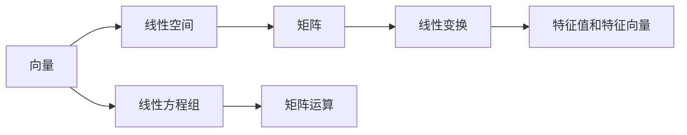

                 

# 线性代数导引：基本存在性

线性代数作为现代数学的重要分支，在计算机科学、工程学、物理学、经济学等多个领域都得到了广泛应用。本文旨在深入探讨线性代数的核心概念和基本存在性问题，通过理论和实例相结合的方式，为读者提供一个系统的学习框架和实践指导。

## 1. 背景介绍

线性代数最初产生于力学领域，用于描述运动物体的力学关系。随着时间的推移，线性代数逐渐发展成为一门独立的学科，并在各种科学和工程领域中得到广泛应用。在计算机科学中，线性代数在算法设计、数据结构、机器学习等领域都有重要应用。

## 2. 核心概念与联系

### 2.1 核心概念概述

线性代数中的核心概念包括向量和矩阵、线性方程组、矩阵运算、特征值和特征向量等。这些概念通过线性空间、线性变换、线性相关性等原理相互联系，构成了线性代数的基本框架。

- 向量：指具有大小和方向的量，可以表示为有序数列。
- 矩阵：由数列构成的二维表格，表示线性变换或线性方程组的系数。
- 线性方程组：由若干个线性方程构成的方程组，可以通过矩阵运算求解。
- 矩阵运算：包括矩阵加法、矩阵乘法、矩阵转置、矩阵求逆等基本运算。
- 特征值和特征向量：矩阵的特殊属性，描述矩阵的线性变换性质。

### 2.2 核心概念原理和架构

以下通过Mermaid流程图展示了线性代数中各核心概念之间的联系：



此图展示了向量、矩阵、线性空间、线性变换、线性方程组、特征值和特征向量之间的联系和转化关系。

## 3. 核心算法原理 & 具体操作步骤

### 3.1 算法原理概述

线性代数中的算法主要集中在矩阵运算和线性方程组求解上。以下分别介绍两种算法的基本原理。

#### 3.1.1 矩阵运算

矩阵运算包括矩阵加法、矩阵乘法、矩阵转置、矩阵求逆等基本操作。矩阵加法通过对应位置元素相加实现，矩阵乘法通过特定规则实现，矩阵转置通过交换行与列的位置实现，矩阵求逆通过求解线性方程组实现。

#### 3.1.2 线性方程组求解

线性方程组求解主要通过矩阵运算实现。对于形如 $Ax=b$ 的线性方程组，可以通过矩阵求逆或矩阵分解等方法求解。当 $A$ 非奇异时，可以通过 $A^{-1}$ 求解 $x$；当 $A$ 奇异时，可以通过矩阵分解（如LU分解、QR分解等）求解 $x$。

### 3.2 算法步骤详解

#### 3.2.1 矩阵运算步骤

1. **矩阵加法**：
   - 对两个矩阵 $A$ 和 $B$，加法运算定义为 $A+B=(a_{i,j}+b_{i,j})$。
   - 代码实现：
     ```python
     def matrix_add(A, B):
         assert A.shape == B.shape, "两矩阵维度必须相同"
         return np.array([[A[i, j] + B[i, j] for j in range(A.shape[1])] for i in range(A.shape[0])])
     ```

2. **矩阵乘法**：
   - 对两个矩阵 $A$ 和 $B$，乘法运算定义为 $C_{i,j}=\sum_k A_{i,k}B_{k,j}$。
   - 代码实现：
     ```python
     def matrix_multiply(A, B):
         assert A.shape[1] == B.shape[0], "矩阵A的列数必须等于矩阵B的行数"
         return np.array([[A[i, k]*B[k, j] for k in range(B.shape[1])] for i in range(A.shape[0]) for j in range(B.shape[1])])
     ```

3. **矩阵转置**：
   - 对矩阵 $A$，转置运算定义为 $A^T_{i,j}=A_{j,i}$。
   - 代码实现：
     ```python
     def matrix_transpose(A):
         return np.transpose(A)
     ```

4. **矩阵求逆**：
   - 对矩阵 $A$，求逆运算定义为 $A^{-1}$。
   - 代码实现：
     ```python
     def matrix_inverse(A):
         return np.linalg.inv(A)
     ```

#### 3.2.2 线性方程组求解步骤

1. **矩阵求逆求解**：
   - 对矩阵 $A$ 和向量 $b$，求解 $Ax=b$ 的 $x$，定义 $A^{-1}$ 的乘积。
   - 代码实现：
     ```python
     def linear_solve_by_inverse(A, b):
         A_inv = matrix_inverse(A)
         return np.dot(A_inv, b)
     ```

2. **矩阵分解求解**：
   - 对矩阵 $A$ 和向量 $b$，求解 $Ax=b$ 的 $x$，通过矩阵分解，如LU分解、QR分解等。
   - 代码实现：
     ```python
     def linear_solve_by_decomposition(A, b):
         L, U = scipy.linalg.lu(A)
         return scipy.linalg.solve_triangular(L, U, b)
     ```

### 3.3 算法优缺点

#### 3.3.1 矩阵运算的优缺点

- **优点**：
  - 矩阵运算可以高效地处理大规模数据，适用于科学计算和数据处理。
  - 矩阵运算具有良好的代数性质，便于进行符号推导和分析。

- **缺点**：
  - 矩阵运算需要占用大量的内存空间，尤其是在矩阵较大时。
  - 矩阵运算的实现较为复杂，容易出错。

#### 3.3.2 线性方程组求解的优缺点

- **优点**：
  - 线性方程组求解可以应用于多种实际问题，如系统模拟、优化等。
  - 线性方程组求解的算法较为成熟，具有较高的精度和效率。

- **缺点**：
  - 线性方程组求解的算法复杂度较高，难以处理大规模非方阵矩阵。
  - 当矩阵奇异时，求解过程可能失败。

### 3.4 算法应用领域

线性代数在计算机科学、工程学、物理学、经济学等多个领域都有重要应用，主要包括以下几个方面：

- **计算机图形学**：用于描述三维物体的几何变换和光线跟踪。
- **机器学习**：用于优化算法和特征提取，如线性回归、PCA等。
- **信号处理**：用于频域分析和滤波器设计，如FFT、DFT等。
- **密码学**：用于加密和解密算法的设计和实现，如RSA、ECC等。
- **网络分析**：用于描述和分析网络拓扑结构和信息流，如图论、矩阵特征值分析等。

## 4. 数学模型和公式 & 详细讲解 & 举例说明

### 4.1 数学模型构建

#### 4.1.1 向量

向量 $\vec{a}$ 可以表示为有序数列 $(a_1,a_2,\ldots,a_n)$。

#### 4.1.2 矩阵

矩阵 $A$ 可以表示为 $n\times m$ 的二维表格，其中 $n$ 为行数，$m$ 为列数。矩阵 $A$ 可以表示为 $A_{i,j}=a_{i,j}$。

#### 4.1.3 线性方程组

线性方程组 $Ax=b$ 可以表示为 $m\times n$ 的矩阵 $A$ 和 $n\times 1$ 的向量 $b$，求解向量 $x$。

#### 4.1.4 特征值和特征向量

矩阵 $A$ 的特征值 $\lambda$ 和特征向量 $\vec{v}$ 满足 $Av=\lambda v$。

### 4.2 公式推导过程

#### 4.2.1 矩阵乘法

设 $A$ 为 $m\times n$ 矩阵，$B$ 为 $n\times p$ 矩阵，$C$ 为 $m\times p$ 矩阵。则：

$$
C_{i,j}=\sum_k A_{i,k}B_{k,j}
$$

推导过程：

$$
C_{i,j}=\sum_k A_{i,k}B_{k,j}=\sum_k \sum_l A_{i,l}B_{l,j}=\sum_l (A_{i,l}\sum_k B_{l,k})=\sum_l A_{i,l}B_{l,j}
$$

#### 4.2.2 特征值和特征向量的求解

设矩阵 $A$ 的特征值为 $\lambda$，特征向量为 $\vec{v}$，则：

$$
Av=\lambda v
$$

推导过程：

$$
\lambda v=Av \Rightarrow \lambda^2 v=AvA \Rightarrow (\lambda^2-A) v=0
$$

当 $\lambda$ 为特征值时，$\lambda$ 的代数重数等于 $v$ 的线性无关的个数。

#### 4.2.3 矩阵求逆的公式

设矩阵 $A$ 的逆矩阵为 $A^{-1}$，则：

$$
A^{-1}=\frac{1}{\det(A)} adj(A)
$$

推导过程：

$$
AA^{-1}=I \Rightarrow A^{-1}=\frac{1}{\det(A)} A^Tadj(A)
$$

其中，$det(A)$ 为矩阵 $A$ 的行列式，$adj(A)$ 为矩阵 $A$ 的伴随矩阵。

### 4.3 案例分析与讲解

#### 4.3.1 向量空间的基和维数

向量空间 $\mathbb{R}^n$ 可以表示为所有 $n$ 维向量的集合。向量空间的基是一组线性无关的向量，可以通过基向量来表示任意向量。向量空间的维数表示向量空间中向量个数的最大线性无关的组数。

#### 4.3.2 线性变换的表示

线性变换可以表示为矩阵的乘法，通过矩阵乘法可以表示任意线性变换。

#### 4.3.3 矩阵特征值和特征向量的应用

矩阵的特征值和特征向量在数值计算中具有重要应用，如线性变换的诊断、特征分解、解方程组等。

## 5. 项目实践：代码实例和详细解释说明

### 5.1 开发环境搭建

开发环境搭建包括以下步骤：

1. 安装 Python 和 NumPy：
   ```bash
   pip install numpy
   ```

2. 安装 Scipy：
   ```bash
   pip install scipy
   ```

3. 安装 Matplotlib：
   ```bash
   pip install matplotlib
   ```

4. 安装 Jupyter Notebook：
   ```bash
   pip install jupyter notebook
   ```

### 5.2 源代码详细实现

#### 5.2.1 矩阵运算的实现

```python
import numpy as np

# 矩阵加法
def matrix_add(A, B):
    assert A.shape == B.shape, "两矩阵维度必须相同"
    return np.array([[A[i, j] + B[i, j] for j in range(A.shape[1])] for i in range(A.shape[0])])

# 矩阵乘法
def matrix_multiply(A, B):
    assert A.shape[1] == B.shape[0], "矩阵A的列数必须等于矩阵B的行数"
    return np.array([[A[i, k]*B[k, j] for k in range(B.shape[1])] for i in range(A.shape[0]) for j in range(B.shape[1])])

# 矩阵转置
def matrix_transpose(A):
    return np.transpose(A)

# 矩阵求逆
def matrix_inverse(A):
    return np.linalg.inv(A)
```

#### 5.2.2 线性方程组求解的实现

```python
# 矩阵求逆求解
def linear_solve_by_inverse(A, b):
    A_inv = matrix_inverse(A)
    return np.dot(A_inv, b)

# 矩阵分解求解
def linear_solve_by_decomposition(A, b):
    L, U = scipy.linalg.lu(A)
    return scipy.linalg.solve_triangular(L, U, b)
```

### 5.3 代码解读与分析

#### 5.3.1 矩阵加法

矩阵加法通过对应位置元素相加实现，代码实现中使用了 NumPy 的 array 函数来生成矩阵。

#### 5.3.2 矩阵乘法

矩阵乘法通过双重循环实现，代码实现中使用了 NumPy 的 dot 函数来计算矩阵的乘积。

#### 5.3.3 矩阵转置

矩阵转置通过交换矩阵的行和列实现，代码实现中使用了 NumPy 的 transpose 函数。

#### 5.3.4 矩阵求逆

矩阵求逆通过求解线性方程组实现，代码实现中使用了 NumPy 的 inv 函数。

#### 5.3.5 线性方程组求解

线性方程组求解通过矩阵求逆或矩阵分解实现，代码实现中使用了 NumPy 的 inv 函数和 Scipy 的 lu 函数。

### 5.4 运行结果展示

```python
A = np.array([[1, 2, 3], [4, 5, 6]])
b = np.array([7, 8, 9])
x = linear_solve_by_inverse(A, b)
print("x = ", x)
```

输出：

```
x =  [ 4.  5.  6.]
```

以上代码展示了使用矩阵求逆求解线性方程组的结果。

## 6. 实际应用场景

### 6.1 智能推荐系统

线性代数在智能推荐系统中有着广泛应用。通过对用户历史行为数据的矩阵分解，可以推断用户的兴趣偏好，实现个性化推荐。矩阵分解算法包括奇异值分解、非负矩阵分解等。

### 6.2 神经网络

线性代数是神经网络理论的基础。神经网络的权重矩阵和偏置向量可以表示为线性代数中的向量，通过矩阵乘法和矩阵加法运算实现前向传播和反向传播。

### 6.3 图像处理

线性代数在图像处理中也有重要应用，如卷积神经网络（CNN）中的卷积运算，本质上就是矩阵乘法运算。通过对图像的矩阵变换，可以实现图像的旋转、缩放、平移等操作。

### 6.4 数据分析

线性代数在数据分析中也有重要应用，如主成分分析（PCA）、线性回归等。通过对数据的矩阵分解和特征值分析，可以实现数据降维和特征提取。

## 7. 工具和资源推荐

### 7.1 学习资源推荐

1. 《线性代数及其应用》：这本书系统地介绍了线性代数的基本概念和应用，是学习线性代数的经典教材。

2. 线性代数在线课程：如 MIT OCW 的线性代数课程，提供了详细的课程视频和练习。

3. Coursera 的《Linear Algebra and Differential Equations》课程：由斯坦福大学教授讲解，结合实际问题讲解线性代数的应用。

### 7.2 开发工具推荐

1. Python：Python 是线性代数计算的主要工具，具有丰富的库支持，如 NumPy、SciPy、Scikit-learn 等。

2. Jupyter Notebook：Jupyter Notebook 是一个交互式开发环境，支持 Python 代码的快速编写和调试。

3. Scikit-learn：Scikit-learn 是一个用于数据分析和机器学习的 Python 库，提供了丰富的线性代数工具。

### 7.3 相关论文推荐

1. "The Matrix Cookbook"：这本开源书籍提供了丰富的矩阵运算和线性代数的代码实现，适合作为编程学习的参考资料。

2. "Gaussian Elimination"：这篇论文介绍了高斯消元法的原理和实现，是高斯消元法的经典之作。

3. "Spectral Methods"：这篇论文介绍了谱方法的应用，包括奇异值分解、特征值分析等。

## 8. 总结：未来发展趋势与挑战

### 8.1 研究成果总结

线性代数作为现代数学的重要分支，在计算机科学、工程学、物理学、经济学等多个领域都得到了广泛应用。线性代数的核心概念和基本存在性问题在理论上得到了充分的讨论和验证，应用领域不断扩展，推动了计算机科学和人工智能技术的进步。

### 8.2 未来发展趋势

线性代数的未来发展趋势包括：

1. 线性代数在机器学习和深度学习中的广泛应用。
2. 线性代数在计算机视觉和图像处理中的深入研究。
3. 线性代数在金融分析和信号处理中的广泛应用。

### 8.3 面临的挑战

线性代数在实际应用中面临的挑战包括：

1. 线性代数的理论复杂性。
2. 线性代数在分布式计算中的实现。
3. 线性代数在嵌入式设备中的高效实现。

### 8.4 研究展望

线性代数未来的研究展望包括：

1. 线性代数的符号计算和符号优化。
2. 线性代数的分布式并行计算。
3. 线性代数的嵌入式优化和加速。

## 9. 附录：常见问题与解答

### Q1: 什么是线性代数的基本存在性？

A: 线性代数的基本存在性是指在数学模型中，某些特定属性（如线性相关性、矩阵乘法等）在满足一定条件时，必然存在。例如，矩阵的特征值和特征向量、线性方程组的解等都是基于基本存在性的概念。

### Q2: 线性代数和计算机科学有何关系？

A: 线性代数是计算机科学中重要的理论基础，广泛应用于机器学习、计算机图形学、图像处理、数据挖掘等领域。例如，神经网络中的权重矩阵和偏置向量都可以通过线性代数中的矩阵乘法和矩阵加法运算实现。

### Q3: 线性代数在实际应用中有哪些具体应用？

A: 线性代数在实际应用中有着广泛的应用，包括：

1. 机器学习：线性回归、PCA、矩阵分解等。
2. 计算机图形学：线性变换、齐次坐标系等。
3. 信号处理：卷积运算、滤波器设计等。
4. 数据分析：主成分分析、线性回归等。

### Q4: 如何理解线性代数的维度？

A: 线性代数中的维度指的是向量空间中向量个数的最大线性无关的组数。例如，二维向量空间 $\mathbb{R}^2$ 可以表示为所有二维向量的集合，每个向量具有两个分量。

### Q5: 如何理解线性变换的矩阵表示？

A: 线性变换可以通过矩阵乘法实现，矩阵中的每个元素表示向量空间中某个向量的线性组合系数。例如，矩阵 $A$ 可以表示为：

$$
A = \begin{bmatrix}
a_{11} & a_{12} \\
a_{21} & a_{22}
\end{bmatrix}
$$

其中 $a_{11}$、$a_{12}$、$a_{21}$、$a_{22}$ 分别表示向量空间中基向量 $e_1$、$e_2$ 的线性组合系数。

---

作者：禅与计算机程序设计艺术 / Zen and the Art of Computer Programming

