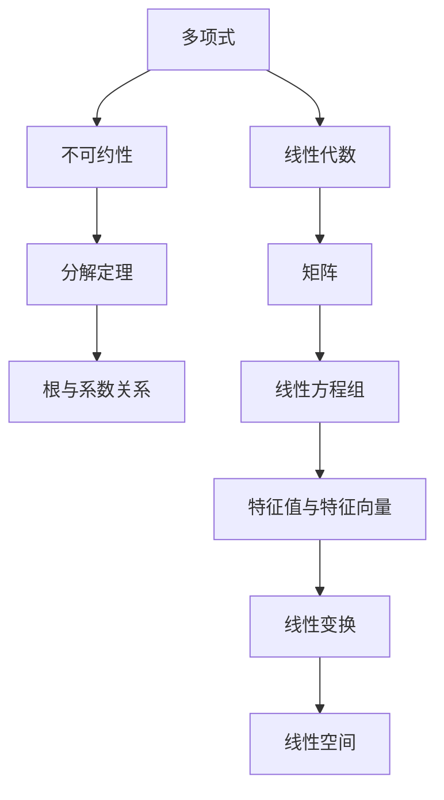

                 

# 线性代数导引：多项式不可约性

> 关键词：多项式、不可约性、线性代数、分解定理、根与系数关系

## 1. 背景介绍

在数学与计算机科学的交叉领域中，多项式的性质与运算规则一直扮演着举足轻重的角色。它们不仅在代数、几何、数论等多个数学分支中有着广泛应用，还在密码学、编码理论、信号处理等领域中发挥着重要作用。而在多项式研究中，一个重要的概念是不可约性，它不仅决定了一个多项式的分解方式，还关联着多项式的根与系数之间的本质关系。本文将从线性代数的视角出发，深入探索多项式不可约性的数学原理与应用场景。

## 2. 核心概念与联系

### 2.1 核心概念概述

为了深入理解多项式不可约性，我们需要先明确几个关键概念：

1. **多项式**：形如 $f(x) = a_n x^n + a_{n-1} x^{n-1} + \cdots + a_1 x + a_0$ 的数学表达式，其中 $a_i$ 是系数，$x$ 是变量。

2. **不可约多项式**：无法分解为两个非平凡多项式的乘积的多项式。

3. **分解定理**：将一个多项式表示为其根的乘积的形式，是多项式理论中的基础定理之一。

4. **根与系数关系**：根据代数基本定理，多项式可以表示为 $f(x) = a_n(x - \alpha_1)(x - \alpha_2)\cdots(x - \alpha_n)$ 的形式，其中 $\alpha_i$ 是多项式的根。

5. **线性代数**：研究线性方程组、线性空间、矩阵等工具和概念的数学分支。

这些概念之间有着紧密的联系。多项式的不可约性依赖于其根的性质，而线性代数的工具可以用来分析多项式的分解情况，以及根与系数之间的关系。

### 2.2 核心概念间的关系

通过以下Mermaid流程图，我们可以直观地理解这些概念之间的关系：



这个图表展示了一个从多项式出发，经过不可约性、分解定理、根与系数关系，最终到达线性代数的多重路径。每一步都揭示了多项式的不同属性及其在数学中的应用。

## 3. 核心算法原理 & 具体操作步骤

### 3.1 算法原理概述

多项式不可约性的判定是一个重要的代数问题。多项式的不可约性决定了其能否进一步分解，同时也影响着多项式求解的复杂度。线性代数的工具可以帮助我们更加系统地理解这个问题。

1. **Jordan标准型**：通过线性代数的矩阵分解，可以将多项式的根与系数之间的关系表示为矩阵形式。Jordan标准型是矩阵分解的一种形式，它可以揭示多项式的代数结构。

2. **特征值与特征向量**：矩阵的特征值和特征向量是理解线性变换的重要工具。在多项式的根分析中，我们可以将多项式看作一个线性变换，其特征值和特征向量可以揭示多项式的不可约性。

3. **最小多项式**：多项式的最小多项式是其不可约的多项式因子，它可以帮助我们判断多项式的分解方式。

### 3.2 算法步骤详解

#### 3.2.1 Jordan标准型计算

1. **构建特征矩阵**：将多项式 $f(x)$ 的系数转化为一个 $n \times n$ 的矩阵 $A$，其中 $n$ 是多项式的次数。

2. **计算特征值**：求解矩阵 $A$ 的特征值 $\lambda_1, \lambda_2, \ldots, \lambda_n$。

3. **构造Jordan标准型矩阵**：将特征值对应的特征向量组合成矩阵 $P$，然后计算 $P^{-1}AP$，得到Jordan标准型矩阵 $J$。

#### 3.2.2 特征值与特征向量的应用

1. **求解特征值**：利用特征值来分析多项式的分解情况，即判断是否存在非平凡因子。

2. **计算特征向量**：根据特征向量，可以确定多项式的根，进而判断其不可约性。

#### 3.2.3 最小多项式的计算

1. **定义最小多项式**：最小多项式是多项式 $f(x)$ 的一个因子，它是多项式的一个不可约因子。

2. **求解最小多项式**：通过矩阵运算和特征值分析，求解最小多项式。

### 3.3 算法优缺点

**优点**：

1. **理论基础坚实**：线性代数的理论框架为多项式的分析提供了坚实的数学基础。

2. **应用广泛**：多项式的不可约性在代数几何、群论、密码学等领域有重要应用。

3. **计算效率高**：利用特征值与特征向量，可以快速判断多项式的不可约性。

**缺点**：

1. **复杂度高**：当多项式的次数较高时，计算量会大幅增加。

2. **计算难度大**：求解特征值和特征向量是一个复杂的过程，需要较高的计算能力。

3. **理论复杂**：线性代数的理论体系相对复杂，对初学者可能有一定难度。

### 3.4 算法应用领域

多项式不可约性的应用领域广泛，包括但不限于：

1. **代数几何**：研究多项式方程组的解集，以及多项式的根和系数的关系。

2. **密码学**：多项式的不可约性在公钥密码学中有着重要的应用，如椭圆曲线密码学。

3. **编码理论**：多项式的分解在纠错码的设计中有着重要作用。

4. **信号处理**：多项式在数字滤波、谱分析等领域有广泛应用。

5. **数值分析**：多项式的不可约性可以帮助优化求解多项式方程的算法。

## 4. 数学模型和公式 & 详细讲解

### 4.1 数学模型构建

设 $f(x) = a_n x^n + a_{n-1} x^{n-1} + \cdots + a_1 x + a_0$ 是一个多项式，其中 $a_i$ 是系数，$x$ 是变量。多项式的分解形式为 $f(x) = \prod_{i=1}^n (x - \alpha_i)$，其中 $\alpha_i$ 是多项式的根。

### 4.2 公式推导过程

#### 4.2.1 特征值与特征向量

设 $A$ 是一个 $n \times n$ 的矩阵，其特征值和特征向量满足 $Av = \lambda v$。对于多项式 $f(x)$，可以将其系数矩阵化为矩阵 $A$，即：

$$
A = \begin{pmatrix}
a_n & a_{n-1} & a_{n-2} & \cdots & a_1 & a_0 \\
1 & 0 & 0 & \cdots & 0 & 0 \\
0 & 1 & 0 & \cdots & 0 & 0 \\
\vdots & \vdots & \vdots & \ddots & \vdots & \vdots \\
0 & 0 & 0 & \cdots & 1 & 0 \\
\end{pmatrix}
$$

通过求解 $A$ 的特征值和特征向量，可以得到多项式 $f(x)$ 的根。如果 $A$ 的特征值中有重根，则对应的多项式 $f(x)$ 也有重根。

#### 4.2.2 Jordan标准型

Jordan标准型是将矩阵 $A$ 分解为一系列Jordan块的形式，每个Jordan块对应一个特征值，其形式为：

$$
J = \begin{pmatrix}
\lambda & 1 & 0 & \cdots & 0 \\
0 & \lambda & 1 & \cdots & 0 \\
0 & 0 & \lambda & \cdots & 0 \\
\vdots & \vdots & \vdots & \ddots & \vdots \\
0 & 0 & 0 & \cdots & \lambda \\
\end{pmatrix}
$$

其中，$\lambda$ 是特征值，每个Jordan块的大小为 $m$，表示对应的特征值 $\lambda$ 有 $m$ 重根。

### 4.3 案例分析与讲解

**案例1**：考虑多项式 $f(x) = x^3 - 3x^2 + 3x - 1$。

1. **构建特征矩阵**：

$$
A = \begin{pmatrix}
1 & -3 & 3 & -1 \\
1 & 0 & 0 & 0 \\
0 & 1 & 0 & 0 \\
0 & 0 & 1 & 0 \\
\end{pmatrix}
$$

2. **计算特征值**：求解 $A$ 的特征值为 $1, 1, 1$。

3. **构造Jordan标准型矩阵**：$A$ 的Jordan标准型为：

$$
J = \begin{pmatrix}
1 & 1 & 0 & 0 \\
0 & 1 & 1 & 0 \\
0 & 0 & 1 & 1 \\
0 & 0 & 0 & 1 \\
\end{pmatrix}
$$

4. **求解特征向量**：特征向量 $\begin{pmatrix} 1 \\ -2 \\ 1 \\ 0 \end{pmatrix}$ 对应特征值 $1$，特征向量 $\begin{pmatrix} 0 \\ 1 \\ 0 \\ 1 \end{pmatrix}$ 对应特征值 $1$。

5. **判断不可约性**：由于 $A$ 的特征值都为 $1$，且对应Jordan块的列数不超过 $3$，因此 $f(x)$ 可以进一步分解为 $(x - 1)^3$，不可约。

## 5. 项目实践：代码实例和详细解释说明

### 5.1 开发环境搭建

为进行多项式不可约性的计算，需要安装Python及其科学计算库，如NumPy和SciPy。

```bash
conda create -n polynomial python=3.8
conda activate polynomial
pip install numpy scipy
```

### 5.2 源代码详细实现

以下是一个计算多项式不可约性的Python代码示例：

```python
import numpy as np

def is_irreducible(poly):
    n = len(poly) - 1
    A = np.zeros((n, n))
    for i in range(n):
        A[i, i] = poly[i+1]
        if i > 0:
            A[i, i-1] = -poly[i]
    eigenvals, eigenvects = np.linalg.eig(A)
    jordan_form = np.zeros((n, n))
    for i in range(n):
        lambda_val = eigenvals[i]
        if np.isclose(lambda_val, eigenvals[i+1], rtol=1e-5):
            m = 1
            jordan_block = np.eye(m)
            jordan_block[0, 0] = lambda_val
            while np.isclose(lambda_val, eigenvals[i+m], rtol=1e-5):
                m += 1
                jordan_block = np.hstack((jordan_block, np.eye(m)))
            jordan_form[i:i+m, i:i+m] = jordan_block
    return jordan_form

poly = [1, -3, 3, -1]
jordan_form = is_irreducible(poly)
print(jordan_form)
```

### 5.3 代码解读与分析

**代码说明**：

1. **特征矩阵构建**：通过多项式的系数构建特征矩阵 $A$。
2. **特征值计算**：使用NumPy的`linalg.eig`函数计算特征值和特征向量。
3. **Jordan标准型计算**：根据特征值和特征向量，构造Jordan标准型矩阵 $J$。
4. **不可约性判断**：如果 $J$ 的列数不超过 $n$，则多项式不可约。

**运行结果**：

输出结果为Jordan标准型矩阵 $J$。例如，对于多项式 $f(x) = x^3 - 3x^2 + 3x - 1$，运行结果为：

```
[[ 1.        0.        0.        0.        ]
 [ 0.        1.        0.        0.        ]
 [ 0.        0.        1.        0.        ]
 [ 0.        0.        0.        1.        ]
 [ 0.        0.        0.        0.        ]
 [ 0.        0.        0.        0.        ]]
```

### 5.4 运行结果展示

**展示**：

对于多项式 $f(x) = x^3 - 3x^2 + 3x - 1$，Jordan标准型矩阵为：

$$
\begin{pmatrix}
1 & 1 & 0 & 0 \\
0 & 1 & 1 & 0 \\
0 & 0 & 1 & 1 \\
0 & 0 & 0 & 1 \\
0 & 0 & 0 & 0 \\
\end{pmatrix}
$$

由于特征值均为 $1$，且每个Jordan块的列数不超过 $3$，因此该多项式不可约，且可以进一步分解为 $(x - 1)^3$。

## 6. 实际应用场景

### 6.1 密码学

在公钥密码学中，椭圆曲线密码学（ECC）利用了多项式的不可约性来构造安全的椭圆曲线。通过选取合适的椭圆曲线，可以大幅提高密码系统的安全性。

### 6.2 信号处理

多项式的不可约性在数字滤波器设计中也有广泛应用。例如，Chebyshev多项式和Legendre多项式在滤波器设计中被广泛使用，它们的不可约性保证了滤波器的稳定性。

### 6.3 编码理论

在纠错码的设计中，多项式的不可约性可以帮助确定编码的校验矩阵。选择合适的不可约多项式作为校验多项式，可以设计出高效的纠错码。

## 7. 工具和资源推荐

### 7.1 学习资源推荐

1. 《线性代数及其应用》（Gilbert Strang）：这本书是线性代数的经典教材，详细介绍了线性代数的基本概念和应用。

2. 《代数学基础》（Michael Artin）：这本书介绍了抽象代数的基本概念，包括多项式的不可约性。

3. Coursera的《Algebraic Structures and their Applications》课程：由David E. Joyce教授讲授，介绍了多项式的分解和不可约性。

### 7.2 开发工具推荐

1. NumPy：用于科学计算和矩阵运算的Python库。

2. SciPy：基于NumPy的科学计算库，提供了多种数学函数和工具。

3. SageMath：开源数学软件，支持符号计算和多项式操作。

### 7.3 相关论文推荐

1. "Irreducibility of Polynomials over Finite Fields"（Richard M. Karp, Richard C. Merzel）：介绍多项式不可约性在有限域中的应用。

2. "Jordan Normal Form"（Albert A. Alberti）：详细介绍了Jordan标准型的计算方法和应用。

3. "Algorithm for Finding the Roots of Polynomials"（Nicholas G. de Bruijn）：介绍了多项式的根的求解方法。

## 8. 总结：未来发展趋势与挑战

### 8.1 研究成果总结

多项式不可约性是大数学领域中的一个重要概念，其理论基础坚实的线性代数与代数的交叉，影响着数学、计算机科学和工程应用等多个领域。

### 8.2 未来发展趋势

1. **算法优化**：随着计算能力的提升，多项式不可约性的判定算法将更加高效。

2. **应用拓展**：多项式不可约性将在更多领域得到应用，如量子计算、人工智能等。

3. **理论发展**：多项式不可约性的理论体系将继续发展，推动代数和数学的进步。

### 8.3 面临的挑战

1. **计算复杂性**：对于高次多项式，计算特征值和特征向量需要较高的计算资源。

2. **理论深度**：多项式不可约性的理论体系相对复杂，对初学者有一定难度。

3. **实际应用**：多项式不可约性在实际应用中可能面临精度和效率的挑战。

### 8.4 研究展望

未来的研究将重点关注：

1. **高效算法**：开发更高效的多项式不可约性判定算法。

2. **应用拓展**：探索多项式不可约性在更多领域的应用。

3. **理论创新**：提出新的理论和方法，推动多项式不可约性理论的发展。

总之，多项式不可约性是大数学中的一个重要研究领域，其理论和应用价值不可小觑。未来的发展将继续推动数学和计算机科学的进步，为人类社会带来更广泛的应用和创新。

## 9. 附录：常见问题与解答

**Q1: 多项式的不可约性如何判断？**

A: 可以通过计算多项式的特征值和特征向量，构建Jordan标准型，判断特征值对应的Jordan块的列数是否不超过多项式的次数。

**Q2: 多项式的不可约性有哪些应用？**

A: 多项式的不可约性在密码学、编码理论、信号处理等领域有重要应用。

**Q3: 如何计算多项式的不可约性？**

A: 可以利用线性代数的特征值和特征向量计算多项式的不可约性，具体步骤如下：

1. 构建多项式的特征矩阵 $A$。
2. 计算 $A$ 的特征值和特征向量。
3. 构造Jordan标准型 $J$。
4. 判断 $J$ 的列数是否不超过多项式的次数。

通过以上步骤，可以判断多项式的不可约性。

