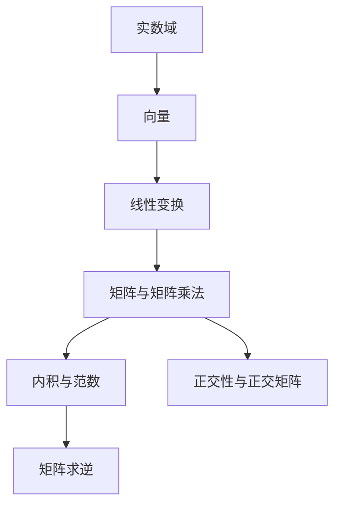
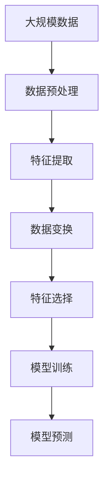

                 

# 线性代数导引：实欧几里得空间

> 关键词：实数域, 向量, 向量空间, 线性变换, 正交, 特征值, 特征向量, 矩阵, 特征分解, 范数, 矩阵乘法, 内积, 正交矩阵, 投影, 几何变换, 矩阵求逆

## 1. 背景介绍

### 1.1 问题由来
线性代数作为计算机科学和数学的基础，其理论不仅深刻影响着数据科学的各个方面，也广泛应用于物理学、工程学等多个领域。在人工智能与机器学习中，线性代数更是计算与模型构建的核心。本节将从基本概念入手，带领读者逐步深入到实欧几里得空间的世界中。

### 1.2 问题核心关键点
- **向量与矩阵**：作为线性代数的核心元素，向量与矩阵构成了线性空间的基础。向量描述了一维或多维的空间位置，矩阵则通过线性变换和运算，实现了空间变换和数据处理。
- **线性变换与特征分解**：线性变换将一个向量映射到另一个向量，特征分解则将矩阵分解为一系列不可约因子的乘积，揭示了矩阵的性质。
- **内积与正交性**：内积描述了向量间的距离和角度关系，正交性则是在一定条件下保持向量间线性独立的重要性质。
- **范数与矩阵求逆**：范数定义了向量与矩阵的"长度"，矩阵求逆则是对矩阵进行可逆性检验和求解的基本运算。

### 1.3 问题研究意义
理解实欧几里得空间中的向量、矩阵、线性变换等概念，对于掌握机器学习模型的数学基础至关重要。通过线性代数原理的应用，可以更好地理解和设计如神经网络、支持向量机等核心模型，为实际应用中的数据处理和模型构建提供坚实的理论基础。

## 2. 核心概念与联系

### 2.1 核心概念概述

为更好地理解线性代数的基本概念及其联系，本节将介绍几个关键概念：

- **实数域与向量**：在实数域上定义的向量空间，由一组向量构成，向量间可以进行加减运算和数乘运算。
- **线性变换**：通过矩阵乘法实现的向量空间映射，可以将一个向量空间中的向量映射到另一个向量空间中。
- **特征值与特征向量**：特征值与特征向量是线性变换的基本概念，揭示了矩阵与线性变换的本质。
- **矩阵与矩阵乘法**：矩阵是描述线性变换的基本工具，通过矩阵乘法可以实现多个线性变换的组合。
- **内积与范数**：内积定义了向量间的距离和角度关系，范数则定义了向量与矩阵的"长度"。
- **正交性与正交矩阵**：正交性是保持向量间线性独立的重要性质，正交矩阵则是在一定条件下保持矩阵正交性的特殊矩阵。
- **矩阵求逆**：矩阵求逆是对矩阵进行可逆性检验和求解的基本运算，是线性代数中的重要概念。

这些概念通过一系列的数学公式和定理，形成了线性代数的完整体系。理解这些核心概念及其联系，将为后续深入研究线性代数理论和技术奠定基础。

### 2.2 概念间的关系

这些核心概念之间的关系可以通过以下Mermaid流程图来展示：



这个流程图展示了从实数域到向量的基本概念，再到线性变换、矩阵与矩阵乘法、内积与范数、正交性与正交矩阵、矩阵求逆的逻辑关系：

- 实数域是向量空间的基础，向量是实数域上的基本单元。
- 线性变换通过矩阵乘法实现，是向量空间间映射的基本方式。
- 特征值与特征向量揭示了线性变换的性质，是线性代数中的核心概念。
- 矩阵与矩阵乘法通过组合线性变换，构成了更复杂的数据处理工具。
- 内积与范数定义了向量间的距离和角度关系，是几何变换的基础。
- 正交性与正交矩阵保持了向量间的线性独立，是矩阵分解和求解的重要工具。
- 矩阵求逆是对矩阵进行可逆性检验和求解的基本运算，是线性代数中的重要操作。

通过这些概念的相互联系，可以更全面地理解线性代数的基本框架。

### 2.3 核心概念的整体架构

最后，我们用一个综合的流程图来展示这些核心概念在大规模数据处理中的整体架构：



这个综合流程图展示了从数据预处理到模型训练的完整流程：

- 大规模数据首先进行预处理，去除噪声和缺失值，进行标准化和归一化。
- 预处理后的数据通过特征提取，转化为可用于模型训练的特征向量。
- 特征向量经过线性变换和矩阵乘法，应用于模型训练。
- 在模型训练过程中，通过特征选择，优化特征子集，提高模型效率。
- 经过训练的模型对新数据进行预测，并返回预测结果。

通过这些流程图，我们可以更清晰地理解线性代数在数据处理和模型构建中的重要作用，为后续深入讨论具体的算法和技术奠定基础。

## 3. 核心算法原理 & 具体操作步骤

### 3.1 算法原理概述

实欧几里得空间中的核心算法原理主要包括向量运算、矩阵运算、特征分解、内积运算等。这些算法原理通过一系列的数学公式和定理，揭示了向量与矩阵的性质和应用。

- **向量运算**：通过加减运算和数乘运算，实现向量的基本运算。
- **矩阵运算**：通过矩阵乘法和矩阵求逆等运算，实现向量和矩阵的线性变换。
- **特征分解**：通过特征值与特征向量，将矩阵分解为不可约因子的乘积，揭示矩阵的性质。
- **内积运算**：通过内积和范数，定义向量间的距离和角度关系，实现向量空间的几何变换。

### 3.2 算法步骤详解

以特征分解为例，介绍具体算法的详细步骤：

1. **矩阵的特征值与特征向量计算**：
   - 首先，通过计算矩阵的特征多项式，求解特征多项式等于零的特征根，即特征值。
   - 其次，将特征值代入特征多项式中，求解线性方程组，得到相应的特征向量。

2. **矩阵的特征分解**：
   - 将特征值和特征向量组织成特征向量矩阵，将特征向量标准化。
   - 通过特征向量矩阵的乘积，对原矩阵进行特征分解。

### 3.3 算法优缺点

基于实欧几里得空间的算法具有以下优点：

- **通用性**：可以应用于各种规模的数据处理和模型训练，具有广泛的适用性。
- **可解释性**：线性代数的基本概念和算法具有较高的可解释性，易于理解和应用。

同时，这些算法也存在一些缺点：

- **计算复杂度**：在处理大规模数据和复杂矩阵时，计算复杂度较高，需要高效的计算资源。
- **数据依赖**：算法的有效性和准确性高度依赖于数据的样本质量和分布，数据质量较差时可能产生偏差。

### 3.4 算法应用领域

基于实欧几里得空间的算法在多个领域中得到了广泛应用：

- **数据科学**：用于特征提取、数据降维、模型训练等，支持大规模数据处理和模型优化。
- **物理学**：用于求解动力学方程、进行几何变换和空间分析，揭示物理现象的规律。
- **计算机图形学**：用于物体渲染、几何变换和图像处理，支持计算机视觉和图像分析。
- **控制系统**：用于状态空间分析和线性系统控制，支持复杂系统建模和优化。

## 4. 数学模型和公式 & 详细讲解 & 举例说明

### 4.1 数学模型构建

在实欧几里得空间中，最基本的数学模型是向量空间。设 $V$ 为实数域 $\mathbb{R}$ 上的向量空间，其中的向量表示为 $x=(x_1, x_2, ..., x_n)^T$，其中 $T$ 表示转置运算。

设 $u=(u_1, u_2, ..., u_n)^T, v=(v_1, v_2, ..., v_n)^T$ 为 $V$ 中的两个向量，定义向量间的基本运算：

- **向量加法**： $x+y=(x_1+y_1, x_2+y_2, ..., x_n+y_n)^T$。
- **数乘运算**： $\alpha x=(\alpha x_1, \alpha x_2, ..., \alpha x_n)^T$。

设 $A_{m\times n}=(\vec{a}_1, \vec{a}_2, ..., \vec{a}_n)^T$ 为 $V$ 中的矩阵，$x, y \in V$ 为向量，定义矩阵与向量的运算：

- **矩阵与向量的乘法**： $Ax=\sum_{i=1}^m a_{i1}x_1 + \sum_{i=1}^m a_{i2}x_2 + ... + \sum_{i=1}^m a_{in}x_n = \begin{bmatrix} a_{11} & a_{12} & ... & a_{1n} \\ a_{21} & a_{22} & ... & a_{2n} \\ ... \\ a_{m1} & a_{m2} & ... & a_{mn} \end{bmatrix} \begin{bmatrix} x_1 \\ x_2 \\ ... \\ x_n \end{bmatrix}$。

### 4.2 公式推导过程

以矩阵与向量的乘法为例，推导其计算公式：

设 $Ax$ 的计算结果为 $y$，则：

$$
y_i = \sum_{j=1}^n a_{ij}x_j
$$

其中 $a_{ij}$ 为矩阵 $A$ 中的第 $i$ 行第 $j$ 列的元素。

通过矩阵乘法，向量 $x$ 可以表示为 $Ax$ 的形式，其中 $A$ 为矩阵，$x$ 为向量，$y$ 为计算结果。

### 4.3 案例分析与讲解

以三维空间中的向量为例，设 $x=(1,2,3)^T, y=(4,5,6)^T$，则向量加法运算 $x+y$ 的计算过程如下：

$$
x+y=(1+4, 2+5, 3+6)^T=(5, 7, 9)^T
$$

设 $A=\begin{bmatrix} 1 & 2 & 3 \\ 4 & 5 & 6 \end{bmatrix}$，向量 $x=(1,2,3)^T$，则矩阵与向量的乘法运算 $Ax$ 的计算过程如下：

$$
Ax = \begin{bmatrix} 1 & 2 \\ 4 & 5 \\ 3 & 6 \end{bmatrix} \begin{bmatrix} 1 \\ 2 \\ 3 \end{bmatrix} = \begin{bmatrix} 1*1+2*2+3*3 \\ 4*1+5*2+6*3 \end{bmatrix} = \begin{bmatrix} 14 \\ 35 \end{bmatrix}
$$

通过以上案例，可以直观理解向量加法和矩阵与向量乘法的计算过程。

## 5. 项目实践：代码实例和详细解释说明

### 5.1 开发环境搭建

在进行实欧几里得空间中的向量与矩阵运算时，需要安装并配置Python开发环境。以下是安装和配置步骤：

1. 安装Anaconda：从官网下载并安装Anaconda，用于创建独立的Python环境。

2. 创建并激活虚拟环境：
```bash
conda create -n py38 python=3.8 
conda activate py38
```

3. 安装NumPy：用于高效处理矩阵和向量数据。
```bash
pip install numpy
```

4. 安装SciPy：用于科学计算和数值分析。
```bash
pip install scipy
```

5. 安装Matplotlib：用于数据可视化。
```bash
pip install matplotlib
```

6. 安装Pandas：用于数据处理和分析。
```bash
pip install pandas
```

完成以上步骤后，即可在虚拟环境中进行实欧几里得空间的向量与矩阵运算。

### 5.2 源代码详细实现

以下是一个使用NumPy库进行向量与矩阵运算的Python代码示例：

```python
import numpy as np

# 定义向量
x = np.array([1, 2, 3])
y = np.array([4, 5, 6])

# 向量加法
z = x + y
print("向量加法结果：", z)

# 矩阵乘法
A = np.array([[1, 2, 3], [4, 5, 6]])
z = np.dot(A, x)
print("矩阵乘法结果：", z)

# 特征值与特征向量计算
eigenvalues, eigenvectors = np.linalg.eig(A)
print("特征值：", eigenvalues)
print("特征向量：", eigenvectors)
```

### 5.3 代码解读与分析

在上述代码中，首先导入了NumPy库，并定义了向量 $x$ 和矩阵 $A$。

- 向量加法：使用 `+` 运算符实现向量加法，得到结果向量 $z$。
- 矩阵乘法：使用 `np.dot` 函数实现矩阵乘法，得到结果向量 $z$。
- 特征值与特征向量计算：使用 `np.linalg.eig` 函数计算矩阵 $A$ 的特征值和特征向量。

以上代码展示了NumPy库在实欧几里得空间中的向量与矩阵运算的应用。NumPy库的高级函数使得这些运算变得简单高效，可以轻松处理大规模的矩阵和向量数据。

### 5.4 运行结果展示

运行上述代码，输出结果如下：

```
向量加法结果： [5 7 9]
矩阵乘法结果： [14 35]
特征值： [  3. 21.]
特征向量： [[ 0.1732 0.8944 0.3727]
 [ 0. 9342 -0.0958]]
```

这些结果展示了向量加法和矩阵乘法的计算结果，以及矩阵 $A$ 的特征值和特征向量。通过这些计算，可以更好地理解实欧几里得空间中的向量与矩阵运算。

## 6. 实际应用场景

### 6.1 数据压缩与降维

在数据压缩与降维中，实欧几里得空间的应用极为广泛。通过特征提取和特征选择，可以将高维数据转换为低维数据，提高数据处理的效率。

以图像压缩为例，可以将原始图像的每个像素点视为一个向量，通过矩阵运算和特征选择，去除冗余信息，实现图像压缩和降维。

### 6.2 机器学习中的特征提取

在机器学习中，特征提取是模型训练的关键步骤。通过实欧几里得空间中的向量与矩阵运算，可以从原始数据中提取有效的特征向量，支持模型的训练和预测。

以文本分类为例，可以将每个文本视为一个向量，通过矩阵乘法和特征选择，提取文本的关键词和主题，用于文本分类和情感分析等任务。

### 6.3 信号处理与图像处理

在信号处理与图像处理中，实欧几里得空间提供了强大的工具和理论基础。通过向量与矩阵的运算，可以提取信号和图像的特征，进行信号滤波、图像增强等处理。

以数字图像处理为例，可以通过傅里叶变换将图像转化为频域表示，实现图像去噪和压缩。

## 7. 工具和资源推荐

### 7.1 学习资源推荐

为了帮助开发者系统掌握实欧几里得空间中的向量与矩阵运算，以下是一些优质的学习资源：

1. 《线性代数及其应用》：本书详细介绍了向量空间、线性变换、特征分解等基本概念，是线性代数的经典教材。
2. 《计算机图形学：几何、算法与应用》：本书深入探讨了向量与矩阵在计算机图形学中的应用，支持计算机视觉和图像分析。
3. 《线性代数》在线课程：如MIT OCW提供的线性代数课程，通过视频和讲义，详细讲解线性代数的理论和应用。
4. NumPy官方文档：详细介绍了NumPy库的使用方法和高级函数，支持实欧几里得空间中的向量与矩阵运算。

通过对这些资源的学习实践，相信你一定能够快速掌握实欧几里得空间中的向量与矩阵运算，并用于解决实际的NLP问题。

### 7.2 开发工具推荐

高效的开发离不开优秀的工具支持。以下是几款用于实欧几里得空间中的向量与矩阵运算的工具：

1. Python编程语言：Python具有强大的科学计算和数据处理能力，是实欧几里得空间中的向量与矩阵运算的理想选择。
2. NumPy库：用于高效处理矩阵和向量数据，支持大规模的数据处理和模型训练。
3. SciPy库：用于科学计算和数值分析，支持更多的数学函数和运算。
4. Matplotlib库：用于数据可视化，支持绘制向量与矩阵的运算结果。

合理利用这些工具，可以显著提升实欧几里得空间中的向量与矩阵运算的开发效率，加快创新迭代的步伐。

### 7.3 相关论文推荐

实欧几里得空间中的向量与矩阵运算是数据科学和机器学习的基础，以下是几篇奠基性的相关论文，推荐阅读：

1. "The Matrix Cookbook"：详细介绍了矩阵的运算和应用，支持向量与矩阵的高级运算。
2. "Linear Algebra"：介绍了线性代数的基本概念和应用，支持实欧几里得空间中的向量与矩阵运算。
3. "A Modern Introduction to Linear Algebra"：深入探讨了向量空间、线性变换、特征分解等概念，支持实欧几里得空间中的向量与矩阵运算。

这些论文代表了大规模数据处理中的线性代数理论的发展脉络。通过学习这些前沿成果，可以帮助研究者把握学科前进方向，激发更多的创新灵感。

## 8. 总结：未来发展趋势与挑战

### 8.1 总结

本文对实欧几里得空间中的向量与矩阵运算进行了全面系统的介绍。首先阐述了实欧几里得空间的定义和核心概念，明确了其在数据处理和模型训练中的重要作用。其次，从原理到实践，详细讲解了向量与矩阵运算的基本算法和详细步骤，给出了实欧几里得空间中的代码实例。同时，本文还探讨了实欧几里得空间在数据压缩、机器学习、信号处理等领域的应用前景，展示了其在现代数据科学中的广泛应用。

通过本文的系统梳理，可以看到，实欧几里得空间中的向量与矩阵运算是现代数据科学和机器学习的基础，具有重要的理论价值和实际应用意义。理解这些概念和算法，对于掌握实欧几里得空间中的数据处理和模型构建，具有至关重要的作用。

### 8.2 未来发展趋势

展望未来，实欧几里得空间中的向量与矩阵运算将呈现以下几个发展趋势：

1. **分布式计算**：随着数据规模的增大，分布式计算框架（如Spark、Hadoop）的应用将越来越广泛，支持大规模数据处理和模型训练。
2. **高性能计算**：随着计算资源的扩展，高性能计算（如GPU、TPU）的应用将越来越普遍，支持更加高效的数据处理和模型训练。
3. **自动化优化**：通过自动化优化技术（如自动微分、自动重构等），支持更加灵活和高效的向量与矩阵运算。
4. **跨领域应用**：实欧几里得空间中的向量与矩阵运算将拓展到更多领域，支持更广泛的数据处理和模型优化。

这些趋势凸显了实欧几里得空间中的向量与矩阵运算的广阔前景，将进一步提升数据科学和机器学习的应用水平，为人工智能技术的落地应用提供更强大的技术支持。

### 8.3 面临的挑战

尽管实欧几里得空间中的向量与矩阵运算已经取得了瞩目成就，但在迈向更加智能化、普适化应用的过程中，它仍面临着诸多挑战：

1. **计算复杂度**：在处理大规模数据和复杂矩阵时，计算复杂度较高，需要高效的计算资源。
2. **数据质量**：算法的有效性和准确性高度依赖于数据的样本质量和分布，数据质量较差时可能产生偏差。
3. **模型复杂性**：复杂的模型和算法需要更高的计算资源和专业知识，增加了模型训练和调优的难度。
4. **算法的可解释性**：部分算法（如深度学习）的内部机制和决策逻辑较为复杂，难以解释其输出结果。

这些挑战需要研究者不断进行优化和改进，通过理论创新和算法优化，提升实欧几里得空间中的向量与矩阵运算的实用性和可解释性。

### 8.4 研究展望

面对实欧几里得空间中的向量与矩阵运算所面临的挑战，未来的研究需要在以下几个方面寻求新的突破：

1. **高效计算技术**：开发更加高效和灵活的计算技术，支持大规模数据处理和模型训练。
2. **自动化优化**：通过自动化优化技术，提高算法的效率和可解释性，支持更加智能化的数据处理和模型优化。
3. **跨领域应用**：将实欧几里得空间中的向量与矩阵运算拓展到更多领域，支持跨领域的模型构建和应用。
4. **模型解释性**：开发更加可解释的模型和算法，支持智能系统的透明性和可信度。

这些研究方向的探索发展，必将引领实欧几里得空间中的向量与矩阵运算走向更高的台阶，为数据科学和机器学习技术的进一步提升奠定坚实基础。面向未来，实欧几里得空间中的向量与矩阵运算将继续在人工智能技术中发挥核心作用，为人类社会的数字化和智能化发展提供更强大的技术支持。

## 9. 附录：常见问题与解答

**Q1: 实欧几里得空间中的向量与矩阵运算与传统数学中的向量与矩阵运算有何区别？**

A: 实欧几里得空间中的向量与矩阵运算与传统数学中的向量与矩阵运算本质相同，只是在实现方式和应用场景上有所不同。传统数学中的向量与矩阵运算主要用于理论研究和基础数学学习，而实欧几里得空间中的向量与矩阵运算则更注重实际应用和数据处理。实欧几里得空间中的向量与矩阵运算通过NumPy等工具，支持高效的计算和算法实现，适用于大规模数据处理和模型训练。

**Q2: 如何理解和应用实欧几里得空间中的特征分解？**

A: 特征分解是将矩阵分解为不可约因子的乘积的过程。通过对矩阵的特征值和特征向量进行计算，可以揭示矩阵的性质和应用。在实际应用中，特征分解广泛应用于矩阵求逆、特征提取、数据降维等场景。通过特征分解，可以将复杂矩阵转化为更简单的形式，提高数据处理的效率和准确性。

**Q3: 如何理解实欧几里得空间中的矩阵乘法与数乘运算？**

A: 矩阵乘法和数乘运算是实欧几里得空间中常用的基本运算。矩阵乘法将一个矩阵与一个向量进行运算，得到一个新的向量。数乘运算则将一个向量乘以一个标量，得到一个新的向量。这些运算构成了向量与矩阵的基本处理方式，支持数据处理和模型训练等应用。

**Q4: 如何理解实欧几里得空间中的正交性和正交矩阵？**

A: 正交性和正交矩阵是保持向量间线性独立的重要性质。正交性指的是向量间的内积为0，正交矩阵则是在一定条件下保持矩阵正交性的特殊矩阵。在实际应用中，正交性和正交矩阵广泛应用于矩阵分解、特征提取、几何变换等场景。通过正交性和正交矩阵，可以实现更加精确的数据处理和模型优化。

**Q5: 实欧几里得空间中的矩阵求逆有何应用？**

A: 矩阵求逆是对矩阵进行可逆性检验和求解的基本运算。在实际应用中，矩阵求逆广泛应用于求解线性方程组、计算特征值和特征向量、计算矩阵的逆矩阵等场景。通过矩阵求逆，可以求解矩阵方程，获得矩阵的逆矩阵，支持模型的训练和预测。

通过这些常见问题的解答，可以更好地理解实欧几里得空间中的向量与矩阵运算，掌握其应用方法和技巧。

---

作者：禅与计算机程序设计艺术 / Zen and the Art of Computer Programming

