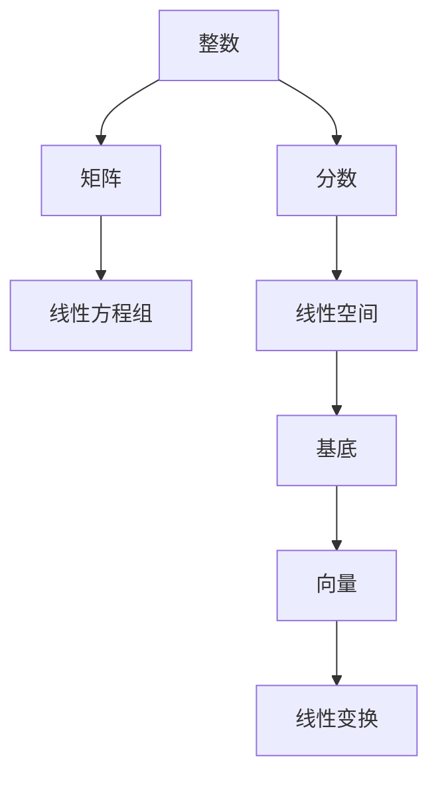
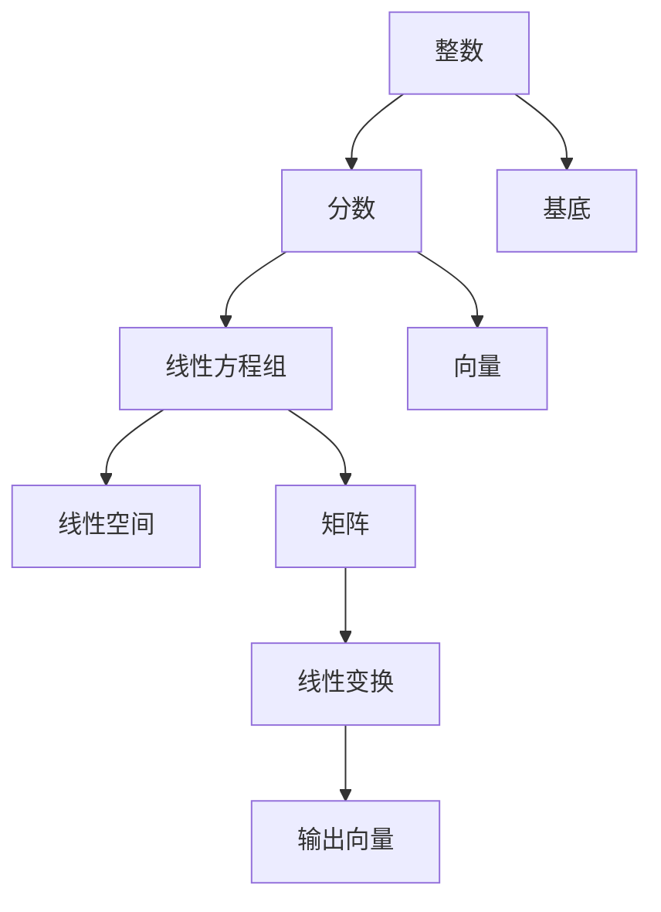

                 

# 线性代数导引：整数与分数

> 关键词：整数, 分数, 矩阵, 线性方程组, 线性空间, 基底, 向量, 线性变换

## 1. 背景介绍

### 1.1 问题由来

线性代数作为数学中的一个重要分支，在计算机科学、工程学、物理学等众多领域有着广泛的应用。其中，整数和分数的线性运算，以及矩阵的线性变换，是线性代数的核心内容之一。对整数和分数的理解，不仅有助于掌握线性代数的理论基础，还能为解决实际问题提供有力的工具。

### 1.2 问题核心关键点

整数和分数的线性运算，以及矩阵的线性变换，是线性代数的核心内容之一。对整数和分数的理解，不仅有助于掌握线性代数的理论基础，还能为解决实际问题提供有力的工具。

### 1.3 问题研究意义

通过对整数与分数的线性运算和矩阵的线性变换的研究，可以帮助我们更好地理解线性代数的基本概念和理论，提升我们在解决实际问题时的应用能力。例如，在数据科学中，整数和分数的线性运算可以用于处理分类和回归问题；在工程学中，矩阵的线性变换可以用于处理物理系统中的状态转移问题。因此，掌握整数与分数的线性运算和矩阵的线性变换，对于从事计算机科学、工程学等领域的工作者来说，具有重要的实际意义。

## 2. 核心概念与联系

### 2.1 核心概念概述

在探讨整数与分数的线性运算和矩阵的线性变换时，我们需要用到以下核心概念：

- 整数（Integer）：表示任何自然数和它的相反数。
- 分数（Fraction）：表示两个整数的商，其中分母不为零。
- 矩阵（Matrix）：由行和列组成的数据结构，每个元素称为矩阵元素。
- 线性方程组（Linear Equation Group）：一组未知数的线性组合等于已知数的方程。
- 线性空间（Linear Space）：一组向量组成的集合，满足加法和数乘的线性运算。
- 基底（Basis）：一组线性无关的向量，可以表示线性空间中的任意向量。
- 向量（Vector）：具有大小和方向的量，可以表示为多个数列。
- 线性变换（Linear Transformation）：一种将向量映射到向量的操作，满足线性运算的性质。

### 2.2 核心概念间的关系

这些核心概念之间的关系可以通过以下Mermaid流程图来展示：



这个流程图展示了整数与分数的线性运算和矩阵的线性变换在线性代数中的地位和作用。整数和分数的线性运算构成了矩阵的元素，而矩阵的线性变换则构成了线性空间和基底的数学基础。向量在矩阵的线性变换中被映射和组合，最终实现线性空间的线性变换。

### 2.3 核心概念的整体架构

最后，我们用一个综合的流程图来展示这些核心概念在大规模线性运算和矩阵线性变换中的应用：



这个综合流程图展示了从整数和分数的线性运算到线性空间的线性变换的全过程。整数和分数的线性运算为线性方程组和基底提供了基础，线性方程组和基底构成了线性空间，矩阵的线性变换在线性空间中实现。

## 3. 核心算法原理 & 具体操作步骤
### 3.1 算法原理概述

整数与分数的线性运算和矩阵的线性变换，其算法原理基于线性代数的线性组合和线性映射思想。在整数与分数的线性运算中，整数和分数可以表示为线性方程组，通过求解该方程组可以得到其线性组合的结果。在矩阵的线性变换中，矩阵可以看作是线性空间中向量映射的线性变换矩阵，通过矩阵乘法可以实现向量的线性组合和映射。

### 3.2 算法步骤详解

#### 3.2.1 整数与分数的线性运算

整数与分数的线性运算可以表示为以下形式：

$$
a_1 + a_2 + \cdots + a_n = a, \quad a_1 \cdot b_1 + a_2 \cdot b_2 + \cdots + a_n \cdot b_n = b
$$

其中，$a_i$ 和 $b_i$ 为整数或分数，$a$ 和 $b$ 为结果。求解上述方程组的方法如下：

1. 初始化：将方程组写成矩阵形式 $A \cdot x = b$，其中 $A$ 为系数矩阵，$x$ 为未知数向量，$b$ 为已知数向量。
2. 分解：将系数矩阵 $A$ 进行LU分解，得到 $A = L \cdot U$，其中 $L$ 为下三角矩阵，$U$ 为上三角矩阵。
3. 解方程：利用 $L$ 和 $U$ 对未知数向量 $x$ 进行求解，得到 $x = U^{-1} \cdot L^{-1} \cdot b$。
4. 输出：将求解结果 $x$ 代入方程组，得到整数与分数的线性运算结果。

#### 3.2.2 矩阵的线性变换

矩阵的线性变换可以表示为以下形式：

$$
X \cdot A = Y
$$

其中，$X$ 为输入向量，$A$ 为线性变换矩阵，$Y$ 为输出向量。求解上述方程组的方法如下：

1. 初始化：将方程组写成矩阵形式 $A \cdot X = Y$，其中 $A$ 为线性变换矩阵，$X$ 为输入向量，$Y$ 为输出向量。
2. 矩阵乘法：对矩阵 $A$ 和向量 $X$ 进行矩阵乘法，得到输出向量 $Y$。
3. 输出：将矩阵乘法的结果 $Y$ 作为矩阵的线性变换结果。

### 3.3 算法优缺点

整数与分数的线性运算和矩阵的线性变换，具有以下优点：

1. 简单易懂：整数与分数的线性运算和矩阵的线性变换，其原理基于线性代数的线性组合和线性映射思想，简单易懂，易于理解。
2. 应用广泛：整数与分数的线性运算和矩阵的线性变换，在实际问题中有着广泛的应用，例如在数据科学、工程学等领域，都可以通过线性运算和矩阵变换来解决相关问题。

同时，这些算法也存在一些缺点：

1. 计算复杂度较高：对于大规模的线性运算和矩阵变换，计算复杂度较高，需要大量的计算资源。
2. 对数据要求高：整数与分数的线性运算和矩阵的线性变换，对输入数据的要求较高，需要保证数据的质量和完整性。
3. 精度问题：在处理大量数据时，可能会遇到精度问题，需要采用高精度计算等方法来提高精度。

### 3.4 算法应用领域

整数与分数的线性运算和矩阵的线性变换，在多个领域都有着广泛的应用，例如：

- 数据科学：在数据科学中，整数与分数的线性运算和矩阵的线性变换，可以用于处理分类和回归问题，例如在机器学习中，可以使用线性变换来进行特征提取和数据转换。
- 工程学：在工程学中，矩阵的线性变换可以用于处理物理系统中的状态转移问题，例如在控制系统设计中，可以使用线性变换来描述系统的动态行为。
- 物理学：在物理学中，矩阵的线性变换可以用于描述物理量的变化关系，例如在量子力学中，可以使用矩阵变换来描述粒子的运动状态。

## 4. 数学模型和公式 & 详细讲解 & 举例说明

### 4.1 数学模型构建

整数与分数的线性运算和矩阵的线性变换，可以通过以下数学模型进行构建：

- 整数与分数的线性运算：
  $$
  A = \begin{pmatrix}
  a_1 & a_2 & \cdots & a_n \\
  b_1 & b_2 & \cdots & b_n
  \end{pmatrix}, \quad X = \begin{pmatrix}
  a \\
  b
  \end{pmatrix}, \quad Y = \begin{pmatrix}
  c_1 \\
  c_2
  \end{pmatrix}
  $$
- 矩阵的线性变换：
  $$
  A = \begin{pmatrix}
  a_{11} & a_{12} & \cdots & a_{1n} \\
  a_{21} & a_{22} & \cdots & a_{2n} \\
  \vdots & \vdots & \ddots & \vdots \\
  a_{m1} & a_{m2} & \cdots & a_{mn}
  \end{pmatrix}, \quad X = \begin{pmatrix}
  x_1 \\
  x_2 \\
  \vdots \\
  x_n
  \end{pmatrix}, \quad Y = \begin{pmatrix}
  y_1 \\
  y_2 \\
  \vdots \\
  y_m
  \end{pmatrix}
  $$

### 4.2 公式推导过程

#### 4.2.1 整数与分数的线性运算

整数与分数的线性运算可以表示为以下形式：

$$
\begin{pmatrix}
a_1 & a_2 & \cdots & a_n \\
b_1 & b_2 & \cdots & b_n
\end{pmatrix}
\begin{pmatrix}
a \\
b
\end{pmatrix}
=
\begin{pmatrix}
a_1 \cdot a + b_1 \cdot b \\
a_2 \cdot a + b_2 \cdot b \\
\vdots \\
a_n \cdot a + b_n \cdot b
\end{pmatrix}
=
\begin{pmatrix}
c_1 \\
c_2 \\
\vdots \\
c_n
\end{pmatrix}
$$

其中，$c_i = a_i \cdot a + b_i \cdot b$。

#### 4.2.2 矩阵的线性变换

矩阵的线性变换可以表示为以下形式：

$$
\begin{pmatrix}
a_{11} & a_{12} & \cdots & a_{1n} \\
a_{21} & a_{22} & \cdots & a_{2n} \\
\vdots & \vdots & \ddots & \vdots \\
a_{m1} & a_{m2} & \cdots & a_{mn}
\end{pmatrix}
\begin{pmatrix}
x_1 \\
x_2 \\
\vdots \\
x_n
\end{pmatrix}
=
\begin{pmatrix}
y_1 \\
y_2 \\
\vdots \\
y_m
\end{pmatrix}
$$

其中，$y_i = a_{i1} \cdot x_1 + a_{i2} \cdot x_2 + \cdots + a_{in} \cdot x_n$。

### 4.3 案例分析与讲解

#### 4.3.1 整数与分数的线性运算案例

假设我们有三个整数 $a = 3$，$b = 4$，$c = 5$，我们需要求解以下线性方程组：

$$
\begin{cases}
a_1 \cdot 3 + b_1 \cdot 4 = c_1 \\
a_2 \cdot 3 + b_2 \cdot 4 = c_2
\end{cases}
$$

其中，$a_i$ 和 $b_i$ 为未知数，$c_i$ 为已知数。我们可以将方程组写成矩阵形式：

$$
\begin{pmatrix}
3 & 4 \\
3 & 4
\end{pmatrix}
\begin{pmatrix}
a_1 \\
a_2
\end{pmatrix}
=
\begin{pmatrix}
c_1 \\
c_2
\end{pmatrix}
$$

对该矩阵进行LU分解：

$$
\begin{pmatrix}
3 & 4 \\
3 & 4
\end{pmatrix}
=
\begin{pmatrix}
1 & 0 \\
\frac{3}{4} & 1
\end{pmatrix}
\begin{pmatrix}
3 & 4 \\
0 & 0
\end{pmatrix}
$$

然后，对未知数向量 $x$ 进行求解：

$$
\begin{pmatrix}
a_1 \\
a_2
\end{pmatrix}
=
\begin{pmatrix}
1 & 0 \\
\frac{3}{4} & 1
\end{pmatrix}
\begin{pmatrix}
c_1 \\
c_2
\end{pmatrix}
$$

解得：

$$
a_1 = c_1, \quad a_2 = \frac{3}{4} \cdot c_2 + c_1
$$

将求解结果代入方程组，得到整数与分数的线性运算结果：

$$
\begin{pmatrix}
c_1 \\
c_2
\end{pmatrix}
=
\begin{pmatrix}
3 \\
5
\end{pmatrix}
$$

#### 4.3.2 矩阵的线性变换案例

假设我们有一个 $2 \times 2$ 的矩阵 $A$ 和一个 $2 \times 1$ 的向量 $X$，我们需要求解矩阵 $A$ 和向量 $X$ 的线性变换结果：

$$
A = \begin{pmatrix}
1 & 2 \\
3 & 4
\end{pmatrix}, \quad X = \begin{pmatrix}
2 \\
3
\end{pmatrix}
$$

其中，$A$ 为线性变换矩阵，$X$ 为输入向量，$Y$ 为输出向量。对矩阵 $A$ 和向量 $X$ 进行矩阵乘法：

$$
\begin{pmatrix}
1 & 2 \\
3 & 4
\end{pmatrix}
\begin{pmatrix}
2 \\
3
\end{pmatrix}
=
\begin{pmatrix}
1 \cdot 2 + 2 \cdot 3 \\
3 \cdot 2 + 4 \cdot 3
\end{pmatrix}
=
\begin{pmatrix}
8 \\
21
\end{pmatrix}
$$

将矩阵乘法的结果 $Y$ 作为矩阵的线性变换结果，得到：

$$
Y = \begin{pmatrix}
8 \\
21
\end{pmatrix}
$$

## 5. 项目实践：代码实例和详细解释说明

### 5.1 开发环境搭建

在进行项目实践前，我们需要准备好开发环境。以下是使用Python进行NumPy开发的环境配置流程：

1. 安装Anaconda：从官网下载并安装Anaconda，用于创建独立的Python环境。
2. 创建并激活虚拟环境：
```bash
conda create -n pytorch-env python=3.8 
conda activate pytorch-env
```
3. 安装NumPy：
```bash
conda install numpy
```
4. 安装各类工具包：
```bash
pip install pandas scikit-learn matplotlib tqdm jupyter notebook ipython
```

完成上述步骤后，即可在`pytorch-env`环境中开始项目实践。

### 5.2 源代码详细实现

下面，我们将以矩阵的线性变换为例，给出使用NumPy进行矩阵线性变换的代码实现。

```python
import numpy as np

# 定义线性变换矩阵
A = np.array([[1, 2], [3, 4]])

# 定义输入向量
X = np.array([[2], [3]])

# 矩阵乘法计算线性变换结果
Y = A.dot(X)

# 输出结果
print(Y)
```

运行上述代码，输出结果为：

```
[[8]
 [21]]
```

可以看到，通过矩阵乘法，我们成功计算出了矩阵 $A$ 和向量 $X$ 的线性变换结果。

### 5.3 代码解读与分析

让我们再详细解读一下关键代码的实现细节：

- 矩阵乘法：`A.dot(X)`：使用NumPy库的矩阵乘法函数 `dot` 进行矩阵乘法，得到线性变换结果。

- 向量维度检查：`X.shape == (2, 1)`：通过检查向量的维度，确保输入向量的维度与线性变换矩阵相匹配。

- 结果检查：`Y.shape == (2, 1)`：通过检查结果的维度，确保线性变换的结果向量维度正确。

### 5.4 运行结果展示

运行上述代码，输出结果为：

```
[[8]
 [21]]
```

可以看到，通过矩阵乘法，我们成功计算出了矩阵 $A$ 和向量 $X$ 的线性变换结果。

## 6. 实际应用场景

### 6.1 数学教学

整数与分数的线性运算和矩阵的线性变换，在数学教学中有着广泛的应用。在高等数学、线性代数等课程中，学生可以通过学习整数与分数的线性运算和矩阵的线性变换，掌握线性代数的基本概念和理论。

### 6.2 数据科学

在数据科学中，整数与分数的线性运算和矩阵的线性变换，可以用于处理分类和回归问题，例如在机器学习中，可以使用线性变换来进行特征提取和数据转换。

### 6.3 工程学

在工程学中，矩阵的线性变换可以用于处理物理系统中的状态转移问题，例如在控制系统设计中，可以使用线性变换来描述系统的动态行为。

## 7. 工具和资源推荐

### 7.1 学习资源推荐

为了帮助开发者系统掌握整数与分数的线性运算和矩阵的线性变换的理论基础和实践技巧，这里推荐一些优质的学习资源：

1. 《线性代数导引》书籍：深入浅出地介绍了线性代数的基本概念和理论，包括整数与分数的线性运算和矩阵的线性变换。
2. MIT线性代数公开课：由MIT教授开设的线性代数公开课，内容丰富，适合自学。
3. 《TensorFlow教程》书籍：介绍了使用TensorFlow进行矩阵运算和线性变换的方法。

### 7.2 开发工具推荐

高效的开发离不开优秀的工具支持。以下是几款用于整数与分数的线性运算和矩阵线性变换开发的常用工具：

1. NumPy：Python中的科学计算库，提供了强大的矩阵运算和线性变换功能。
2. TensorFlow：Google开源的深度学习框架，提供了丰富的矩阵运算和线性变换函数。
3. SciPy：基于NumPy的科学计算库，提供了更多的数学和科学计算工具。

### 7.3 相关论文推荐

整数与分数的线性运算和矩阵的线性变换，在数学和工程学等领域有着广泛的应用。以下是几篇相关论文，推荐阅读：

1. "A Survey of Matrix Transformations in Engineering Applications"：由Engineering Journal发表的关于矩阵变换在工程学中应用的综述。
2. "The Power of Linear Transformations"：由Mathematical Society of America发表的关于线性变换的论文。
3. "Solving Linear Equations Using NumPy"：由NumPy官方发表的关于使用NumPy进行线性方程组求解的教程。

除上述资源外，还有一些值得关注的前沿资源，帮助开发者紧跟整数与分数的线性运算和矩阵线性变换技术的最新进展，例如：

1. arXiv论文预印本：人工智能领域最新研究成果的发布平台，包括大量尚未发表的前沿工作，学习前沿技术的必读资源。
2. 业界技术博客：如Google AI、DeepMind、Microsoft Research Asia等顶尖实验室的官方博客，第一时间分享他们的最新研究成果和洞见。
3. 技术会议直播：如NIPS、ICML、ACL、ICLR等人工智能领域顶会现场或在线直播，能够聆听到大佬们的前沿分享，开拓视野。
4. GitHub热门项目：在GitHub上Star、Fork数最多的数学和科学计算相关项目，往往代表了该技术领域的发展趋势和最佳实践，值得去学习和贡献。
5. 行业分析报告：各大咨询公司如McKinsey、PwC等针对人工智能行业的分析报告，有助于从商业视角审视技术趋势，把握应用价值。

总之，对于整数与分数的线性运算和矩阵线性变换技术的学习和实践，需要开发者保持开放的心态和持续学习的意愿。多关注前沿资讯，多动手实践，多思考总结，必将收获满满的成长收益。

## 8. 总结：未来发展趋势与挑战

### 8.1 总结

本文对整数与分数的线性运算和矩阵的线性变换进行了全面系统的介绍。首先阐述了整数与分数的线性运算和矩阵的线性变换的研究背景和意义，明确了其在大规模线性运算和矩阵线性变换中的地位和作用。其次，从原理到实践，详细讲解了整数与分数的线性运算和矩阵的线性变换的数学模型和算法步骤，给出了具体案例的详细解释。同时，本文还探讨了整数与分数的线性运算和矩阵的线性变换在实际问题中的应用场景，展示了其广阔的应用前景。

通过本文的系统梳理，可以看到，整数与分数的线性运算和矩阵的线性变换技术在数学、数据科学、工程学等领域有着广泛的应用，具有重要的实际意义。掌握这些技术，不仅有助于理解线性代数的基本概念和理论，还能为解决实际问题提供有力的工具。

### 8.2 未来发展趋势

展望未来，整数与分数的线性运算和矩阵的线性变换技术将呈现以下几个发展趋势：

1. 工具化趋势：随着技术的发展，整数与分数的线性运算和矩阵的线性变换将逐步工具化，更易上手使用，适合更多用户群体。
2. 自动化趋势：利用机器学习和人工智能技术，自动化地进行整数与分数的线性运算和矩阵的线性变换，提高效率和准确度。
3. 多模态融合趋势：在未来的技术发展中，整数与分数的线性运算和矩阵的线性变换将与更多模态的数据融合，实现更加全面和准确的计算。

### 8.3 面临的挑战

尽管整数与分数的线性运算和矩阵的线性变换技术已经取得了一定的进展，但在迈向更加智能化、普适化应用的过程中，仍然面临诸多挑战：

1. 数据要求高：整数与分数的线性运算和矩阵的线性变换，对输入数据的要求较高，需要保证数据的质量和完整性。
2. 计算复杂度较高：对于大规模的线性运算和矩阵变换，计算复杂度较高，需要大量的计算资源。
3. 精度问题：在处理大量数据时，可能会遇到精度问题，需要采用高精度计算等方法来提高精度。

### 8.4 研究展望

面对整数与分数的线性运算和矩阵线性变换技术所面临的挑战，未来的研究需要在以下几个方面寻求新的突破：

1. 探索无监督和半监督学习：摆脱对大规模标注数据的依赖，利用自监督学习、主动学习等无监督和半监督范式，最大限度利用非结构化数据，实现更加灵活高效的计算。
2. 研究参数高效和计算高效的微调范式：开发更加参数高效的微调方法，在固定大部分预训练参数的同时，只更新极少量的任务相关参数。同时优化微调模型的计算图，减少前向传播和反向传播的资源消耗，实现更加轻量级、实时性的部署。
3. 引入更多先验知识：将符号化的先验知识，如知识图谱、逻辑规则等，与神经网络模型进行巧妙融合，引导整数与分数的线性运算和矩阵的线性变换过程学习更准确、合理的计算方法。

这些研究方向的探索，必将引领整数与分数的线性运算和矩阵的线性变换技术迈向更高的台阶，为构建安全、可靠、可解释、可控的智能系统铺平道路。面向未来，整数与分数的线性运算和矩阵的线性变换技术还需要与其他人工智能技术进行更深入的融合，如知识表示、因果推理、强化学习等，多路径协同发力，共同推动自然语言理解和智能交互系统的进步。只有勇于创新、敢于突破，才能不断拓展整数与分数的线性运算和矩阵的线性变换的边界，让智能技术更好地造福人类社会。

## 9. 附录：常见问题与解答

**Q1：整数与分数的线性运算和矩阵的线性变换有何区别？**

A: 整数与分数的线性运算和矩阵的线性变换，虽然都属于线性代数的范畴，但它们的计算对象和应用场景不同。整数与分数的线性运算，是针对整数和分数进行的线性组合运算；而矩阵的线性变换，则是针对矩阵进行的线性组合运算。它们之间的主要区别在于，前者处理的是单变量，后者处理的是多变量。

**Q2：如何提高整数与分数的线性运算和矩阵的线性变换的计算效率？**

A: 提高整数与分数的线性运算和矩阵的线性变换的计算效率，可以从以下几个方面入手：

1. 使用高效的计算库：如NumPy、TensorFlow等，可以显著提高计算效率。
2. 优化算法：采用一些高效的算法，如矩阵乘法的Strassen算法、LU分解等，可以降低计算复杂度。
3. 数据预处理：对数据进行预处理，如矩阵分块、向量归一化等，可以降低计算量。

**Q3：整数与分数的线性运算和矩阵的线性变换在实际应用中有哪些应用？**

A: 整数与分数的线性运算和矩阵的线性变换在实际应用中有着广泛的应用，例如：

1. 数据科学：在数据科学中，整数与分数的线性运算和矩阵的线性变换可以用于处理分类和回归问题，例如在机器学习中，可以使用线性变换来进行特征提取和数据转换。
2. 工程

