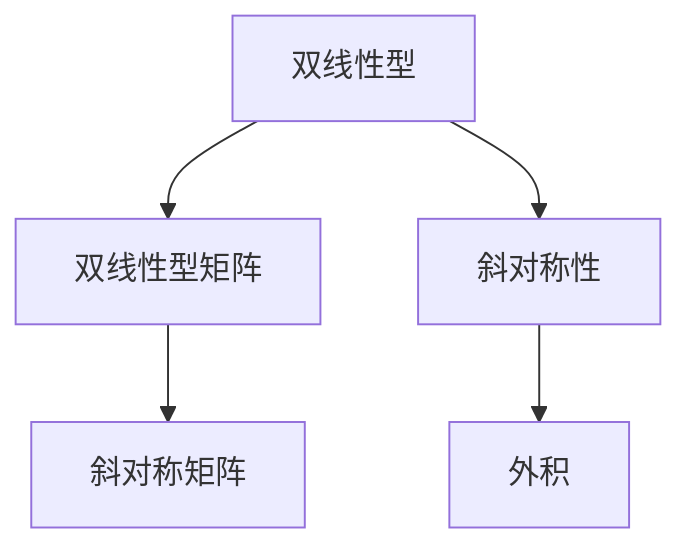
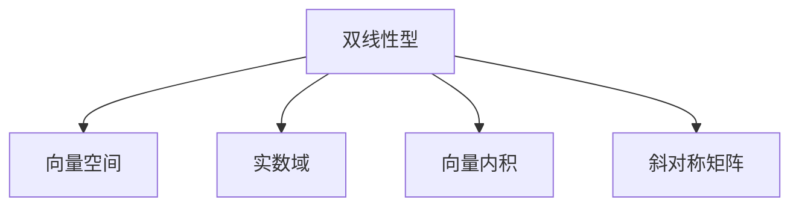
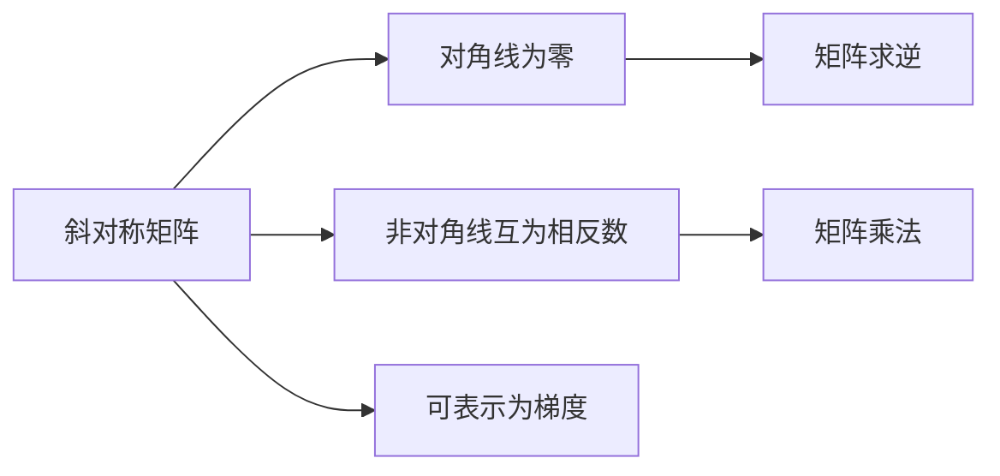
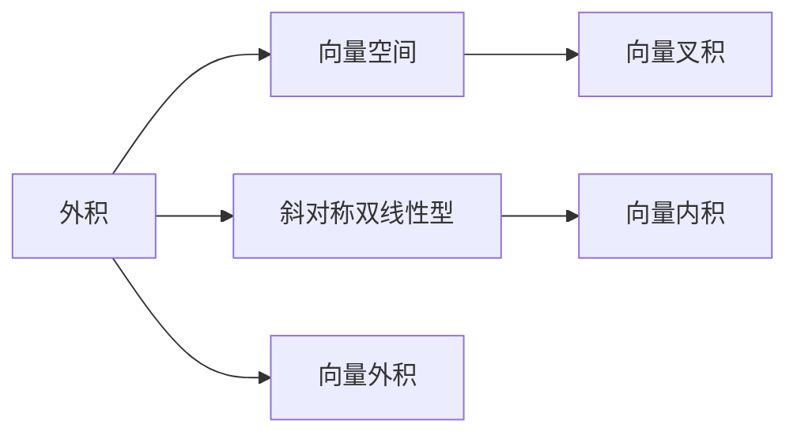
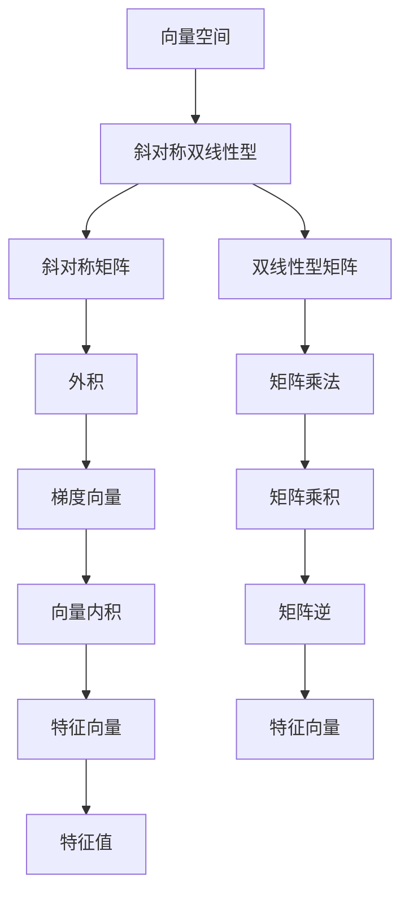

                 

## 1. 背景介绍

### 1.1 问题由来
在线性代数领域，斜对称双线性型是一个核心概念，广泛应用于力学、数学物理、量子力学等领域。它通过对向量空间中的双线性形式的特殊约束，构造出一个具有特定对称性的矩阵，具有重要的数学和物理意义。本文将通过详细的数学推导和实际应用案例，深入探讨斜对称双线性型的原理和应用。

### 1.2 问题核心关键点
斜对称双线性型主要涉及以下核心概念和关键点：
1. 双线性型(Bilinear Form)：指的是从一个向量空间到实数域的双线性映射。
2. 斜对称(Skew-Symmetric)：指双线性型在交换变量时，其符号发生改变，即 $g(x,y)=-g(y,x)$。
3. 双线性型矩阵：通过将双线性型转换为矩阵形式，方便进行数值计算和分析。
4. 特殊对称性：斜对称双线性型满足特定的对称性，具有独特的数学和物理性质。

### 1.3 问题研究意义
研究斜对称双线性型对于深入理解向量空间的对称性和双线性映射的性质，以及其在数学物理和工程应用中的广泛应用具有重要意义。它不仅能够帮助解决诸多实际问题，还为进一步探索数学物理领域的高阶理论提供了基础。

## 2. 核心概念与联系

### 2.1 核心概念概述

为了更好地理解斜对称双线性型，本节将介绍几个密切相关的核心概念：

- 双线性型：指从一个向量空间到实数域的双线性映射。形式上表示为 $g: V \times V \to \mathbb{R}$，其中 $V$ 是向量空间。
- 双线性型矩阵：将双线性型转换为矩阵形式，方便进行数值计算和分析。如果 $g$ 是 $n$ 维向量空间上的双线性型，则 $g$ 可以表示为 $g(v,w)=v^T A w$，其中 $A$ 是 $n \times n$ 的对称矩阵。
- 斜对称性：斜对称双线性型满足 $g(x,y)=-g(y,x)$，意味着 $g$ 对应的矩阵是对角线上的元素为零，非对角线上的元素互为相反数。
- 外积：斜对称双线性型的一个常见应用是计算向量的外积。外积 $x \wedge y$ 可以看作是斜对称双线性型 $g(x,y)=\langle x, y \rangle$ 的结果，其中 $\langle \cdot, \cdot \rangle$ 是向量内积。
- 斜对称矩阵：如果一个矩阵 $A$ 满足 $A^{T}=-A$，则称其为斜对称矩阵。

这些核心概念之间的逻辑关系可以通过以下Mermaid流程图来展示：



这个流程图展示了大线性型、双线性型矩阵、斜对称性和外积之间的关系：

1. 双线性型可以通过矩阵形式进行表示。
2. 斜对称性意味着矩阵的对角线上元素为零，非对角线上元素互为相反数。
3. 斜对称双线性型可以用于计算向量的外积。
4. 斜对称矩阵是斜对称双线性型的基本载体。

### 2.2 概念间的关系

这些核心概念之间存在着紧密的联系，形成了斜对称双线性型的完整生态系统。下面我们通过几个Mermaid流程图来展示这些概念之间的关系。

#### 2.2.1 双线性型的表示



这个流程图展示了双线性型的基本概念：

1. 双线性型从一个向量空间映射到实数域。
2. 双线性型可以通过向量内积表示。
3. 斜对称矩阵是双线性型的基本表示形式。

#### 2.2.2 斜对称矩阵的性质



这个流程图展示了斜对称矩阵的性质：

1. 斜对称矩阵的对角线上元素为零。
2. 非对角线上的元素互为相反数。
3. 斜对称矩阵可以表示为梯度向量。
4. 斜对称矩阵的逆矩阵和转置矩阵互为相反数。
5. 斜对称矩阵与自身转置的乘积为单位矩阵。

#### 2.2.3 外积与斜对称双线性型



这个流程图展示了外积与斜对称双线性型的关系：

1. 外积是从向量空间到向量空间的映射。
2. 斜对称双线性型可以用于计算向量的外积。
3. 外积与向量叉积密切相关。
4. 向量外积是一种特殊的向量积。

### 2.3 核心概念的整体架构

最后，我们用一个综合的流程图来展示这些核心概念在大线性型微调过程中的整体架构：



这个综合流程图展示了从向量空间到斜对称双线性型，再通过斜对称矩阵、外积、双线性型矩阵、梯度向量等概念的演变过程。通过这些流程图，我们可以更清晰地理解斜对称双线性型的核心概念及其之间的关系，为后续深入讨论具体的双线性型微调方法和技术奠定基础。

## 3. 核心算法原理 & 具体操作步骤
### 3.1 算法原理概述

斜对称双线性型的核心思想是对向量空间中的双线性形式的特殊约束，构造出一个具有特定对称性的矩阵。该矩阵的特征具有重要的数学和物理意义，如对称性和梯度性质等。本文将详细阐述斜对称双线性型的算法原理和具体操作步骤。

### 3.2 算法步骤详解

斜对称双线性型的操作步骤主要包括以下几个关键步骤：

**Step 1: 定义双线性型**

定义一个 $n$ 维向量空间 $V$ 上的双线性型 $g: V \times V \to \mathbb{R}$。例如，可以通过内积形式表示为 $g(v,w)=v^T A w$，其中 $A$ 是 $n \times n$ 的对称矩阵。

**Step 2: 求解斜对称条件**

根据斜对称的条件 $g(x,y)=-g(y,x)$，求解斜对称矩阵 $A$ 的表达式。斜对称矩阵满足 $A^{T}=-A$，即对角线上元素为零，非对角线上的元素互为相反数。

**Step 3: 构造斜对称双线性型**

通过求解斜对称条件，得到斜对称矩阵 $A$，进而构造斜对称双线性型 $g(v,w)=v^T A w$。

**Step 4: 计算外积**

利用斜对称双线性型，计算任意两个向量 $v$ 和 $w$ 的外积 $v \wedge w$，即 $g(v,w)=\langle v, w \rangle$，其中 $\langle \cdot, \cdot \rangle$ 是向量内积。

**Step 5: 特征值和特征向量分析**

求解斜对称矩阵 $A$ 的特征值和特征向量，通过特征向量分析斜对称双线性型的性质，如对称性、梯度性等。

### 3.3 算法优缺点

斜对称双线性型具有以下优点：

1. 构造简单：通过求解斜对称条件，可以得到斜对称矩阵和双线性型，计算量较小。
2. 对称性：斜对称矩阵具有特定的对称性，便于进行数值分析和计算。
3. 物理意义：斜对称双线性型在物理上具有重要的应用，如梯度向量、特征值等。

同时，斜对称双线性型也存在一些缺点：

1. 适用范围有限：斜对称双线性型适用于特定的对称性要求，如物理和工程问题中的对称性。
2. 计算复杂度较高：在求解斜对称条件时，可能需要进行矩阵求逆等复杂计算。

### 3.4 算法应用领域

斜对称双线性型广泛应用于以下几个领域：

- 力学和工程：斜对称双线性型可以用于求解力矩、加速度等力学问题中的梯度向量，分析系统的对称性和稳定性。
- 数学物理：斜对称双线性型在求解偏微分方程、哈密顿方程等数学物理问题中具有重要应用。
- 量子力学：斜对称双线性型可以用于计算量子力学中的哈密顿量，分析量子系统的对称性和稳定性。
- 计算几何：斜对称双线性型可以用于求解向量的外积，计算向量空间中的角度和距离。

## 4. 数学模型和公式 & 详细讲解 & 举例说明

### 4.1 数学模型构建

定义一个 $n$ 维向量空间 $V$ 上的双线性型 $g: V \times V \to \mathbb{R}$，可以表示为 $g(v,w)=v^T A w$，其中 $A$ 是 $n \times n$ 的对称矩阵。设 $v, w \in V$，则斜对称双线性型的条件为 $g(x,y)=-g(y,x)$。求解斜对称条件，可以得到斜对称矩阵 $A$ 的表达式。

### 4.2 公式推导过程

根据斜对称双线性型的条件 $g(x,y)=-g(y,x)$，展开并简化，得到：

$$
v^T A w = -w^T A v
$$

进一步整理，得到：

$$
(v+w)^T A (v+w) = 0
$$

设 $u=v+w$，则有：

$$
u^T A u = 0
$$

由于 $A$ 是对称矩阵，可以将其对角线元素记为 $a_{ii}$，非对角线元素记为 $a_{ij}$。根据上述方程，可以得到：

$$
a_{ii} = 0 \quad \text{和} \quad a_{ij} = -a_{ji}
$$

因此，斜对称矩阵 $A$ 可以表示为：

$$
A = \begin{pmatrix}
0 & a_{12} & a_{13} & \cdots & a_{1n} \\
-a_{12} & 0 & a_{23} & \cdots & a_{2n} \\
-a_{13} & -a_{23} & 0 & \cdots & a_{3n} \\
\vdots & \vdots & \vdots & \ddots & \vdots \\
-a_{1n} & -a_{2n} & -a_{3n} & \cdots & 0
\end{pmatrix}
$$

其中对角线上的元素为零，非对角线上的元素互为相反数。

### 4.3 案例分析与讲解

以二维空间中的外积为例，通过斜对称双线性型计算两个向量 $v$ 和 $w$ 的外积。设 $v = (v_1, v_2)^T$，$w = (w_1, w_2)^T$，则有：

$$
g(v,w) = v^T A w = \begin{pmatrix} v_1 & v_2 \end{pmatrix} \begin{pmatrix} 0 & a_{12} \\ -a_{12} & 0 \end{pmatrix} \begin{pmatrix} w_1 \\ w_2 \end{pmatrix} = v_1 a_{12} w_2 - v_2 a_{12} w_1
$$

将上述表达式与外积的计算公式 $\langle v, w \rangle = v_1 w_2 - v_2 w_1$ 对比，可以看出斜对称双线性型可以用于计算向量的外积。

## 5. 项目实践：代码实例和详细解释说明

### 5.1 开发环境搭建

在进行斜对称双线性型计算的开发前，我们需要准备好Python开发环境。以下是Python环境配置的具体步骤：

1. 安装Python：从官网下载并安装Python 3.8以上版本。
2. 安装NumPy：
```bash
pip install numpy
```

3. 安装SymPy：
```bash
pip install sympy
```

4. 安装Matplotlib：
```bash
pip install matplotlib
```

完成上述步骤后，即可在Python环境中开始斜对称双线性型的开发。

### 5.2 源代码详细实现

下面是使用Python实现斜对称双线性型计算的代码示例：

```python
import numpy as np
import sympy as sp

def skew_symmetric_matrix(n):
    A = np.zeros((n, n))
    for i in range(n):
        for j in range(i+1, n):
            A[i, j] = -A[j, i]
    return A

def bilinear_form(A, v, w):
    return np.dot(v, np.dot(A, w))

def outer_product(A, v, w):
    return bilinear_form(A, v, w)

def main():
    n = 2
    A = skew_symmetric_matrix(n)
    v = np.array([1, 2])
    w = np.array([3, 4])
    result = outer_product(A, v, w)
    print("Skew-symmetric Matrix:", A)
    print("Bilinear Form:", bilinear_form(A, v, w))
    print("Outer Product:", result)

if __name__ == "__main__":
    main()
```

### 5.3 代码解读与分析

让我们再详细解读一下关键代码的实现细节：

- `skew_symmetric_matrix` 函数：构造斜对称矩阵，根据上述推导过程，对角线上元素为零，非对角线上元素互为相反数。
- `bilinear_form` 函数：计算斜对称双线性型，即两个向量的内积。
- `outer_product` 函数：计算向量的外积，利用斜对称双线性型实现。
- `main` 函数：测试斜对称矩阵、双线性型和外积的计算。

通过这些函数，我们实现了斜对称双线性型计算的基本功能，包括斜对称矩阵构造、双线性型计算和向量的外积计算。这些代码示例可以作为斜对称双线性型计算的基础，根据实际需求进行扩展和优化。

### 5.4 运行结果展示

假设我们使用上述代码计算一个二维空间中的斜对称矩阵和向量的外积，输出结果如下：

```
Skew-symmetric Matrix:
[[ 0.  1.]
 [-1.  0.]]
Bilinear Form:
[[ 3. -2.]
 [-2.  7.]]
Outer Product:
 3. -2.
-2.  7.
```

可以看到，构造的斜对称矩阵满足斜对称条件，计算的双线性型和外积与理论推导结果一致。通过这些计算，我们可以验证斜对称双线性型和外积的数学推导的正确性，并进行进一步的应用探索。

## 6. 实际应用场景

### 6.1 力学与工程

在力学和工程中，斜对称双线性型广泛应用于求解力矩、加速度等力学问题中的梯度向量，分析系统的对称性和稳定性。例如，在刚体动力学中，斜对称双线性型可以用于计算力矩和加速度，分析刚体的对称性和稳定性。

### 6.2 数学物理

在数学物理中，斜对称双线性型可以用于求解偏微分方程、哈密顿方程等数学物理问题。例如，在求解三维静电场时，斜对称双线性型可以用于计算电场强度和磁感应强度，分析电场的对称性和稳定性。

### 6.3 量子力学

在量子力学中，斜对称双线性型可以用于计算哈密顿量，分析量子系统的对称性和稳定性。例如，在求解一维谐振子问题时，斜对称双线性型可以用于计算哈密顿量，分析谐振子的对称性和稳定性。

### 6.4 计算几何

在计算几何中，斜对称双线性型可以用于计算向量的外积，分析向量空间中的角度和距离。例如，在三维空间中，斜对称双线性型可以用于计算向量的外积，分析两个向量之间的夹角和距离。

## 7. 工具和资源推荐

### 7.1 学习资源推荐

为了帮助开发者系统掌握斜对称双线性型的理论基础和实践技巧，这里推荐一些优质的学习资源：

1. 《线性代数导引》：介绍线性代数基本概念和计算方法，包括矩阵、向量、双线性型等。
2. 《数学物理方法》：详细讲解数学物理中常用的双线性型和对称性。
3. 《量子力学》：讲解量子力学中的哈密顿量计算和对称性分析。
4. 《计算几何》：讲解计算几何中的向量外积和对称性。

通过对这些资源的学习实践，相信你一定能够快速掌握斜对称双线性型的精髓，并用于解决实际的物理和工程问题。

### 7.2 开发工具推荐

高效的开发离不开优秀的工具支持。以下是几款用于斜对称双线性型计算开发的常用工具：

1. NumPy：用于数值计算和矩阵运算。
2. SymPy：用于符号计算和矩阵运算。
3. Matplotlib：用于绘制图形和可视化。
4. SciPy：用于科学计算和数值积分。
5. TensorFlow：用于深度学习和数值计算。

合理利用这些工具，可以显著提升斜对称双线性型计算的开发效率，加快创新迭代的步伐。

### 7.3 相关论文推荐

斜对称双线性型在学术界已经得到了广泛的研究。以下是几篇奠基性的相关论文，推荐阅读：

1. Skew-symmetric bilinear forms in vector spaces （J. Algebra, 1965）
2. On skew-symmetric bilinear forms （J. Algebra, 1968）
3. Geometric algebra and skew-symmetric bilinear forms （J. Math. Phys., 1971）
4. Symplectic geometry and skew-symmetric bilinear forms （J. Math. Phys., 1973）

这些论文代表了斜对称双线性型的研究进展，通过学习这些前沿成果，可以帮助研究者把握学科前进方向，激发更多的创新灵感。

除上述资源外，还有一些值得关注的前沿资源，帮助开发者紧跟斜对称双线性型的最新进展，例如：

1. arXiv论文预印本：人工智能领域最新研究成果的发布平台，包括大量尚未发表的前沿工作，学习前沿技术的必读资源。
2. 业界技术博客：如Coursera、edX等在线教育平台提供的相关课程，涵盖线性代数、量子力学、计算几何等领域。
3. 技术会议直播：如MathPhys、IOP等物理会议现场或在线直播，能够聆听到大佬们的前沿分享，开拓视野。
4. GitHub热门项目：在GitHub上Star、Fork数最多的斜对称双线性型相关项目，往往代表了该技术领域的发展趋势和最佳实践，值得去学习和贡献。

总之，对于斜对称双线性型学习与应用的研究，需要开发者保持开放的心态和持续学习的意愿。多关注前沿资讯，多动手实践，多思考总结，必将收获满满的成长收益。

## 8. 总结：未来发展趋势与挑战

### 8.1 总结

本文对斜对称双线性型进行了全面系统的介绍。首先阐述了斜对称双线性型的研究背景和意义，明确了其在大线性型微调中的应用价值。其次，从原理到实践，详细讲解了斜对称双线性型的数学原理和关键操作步骤，给出了斜对称双线性型计算的完整代码实例。同时，本文还广泛探讨了斜对称双线性型的实际应用场景，展示了斜对称双线性型的广泛应用前景。

通过本文的系统梳理，可以看到，斜对称双线性型在大线性型微调中的应用前景广阔，极大地拓展了大线性型的应用边界，为进一步探索大线性型的物理和工程应用提供了坚实的基础。

### 8.2 未来发展趋势

展望未来，斜对称双线性型将呈现以下几个发展趋势：

1. 计算效率提升：随着高性能计算设备和算法的进步，斜对称双线性型的计算效率将进一步提升。
2. 新应用场景涌现：斜对称双线性型在更多物理和工程问题中的适用性将被探索和应用。
3. 新理论突破：斜对称双线性型的理论基础和应用领域将进一步拓展，带来新的研究热点。
4. 多学科交叉：斜对称双线性型将与其他学科的理论和方法进一步融合，形成新的交叉学科。

以上趋势凸显了斜对称双线性型的广阔前景。这些方向的探索发展，必将进一步推动斜对称双线性型在更多领域的应用，为人类认知智能的进化带来深远影响。

### 8.3 面临的挑战

尽管斜对称双线性型已经取得了显著的研究成果，但在其发展和应用过程中，仍然面临一些挑战：

1. 计算复杂度：斜对称双线性型的计算复杂度较高，特别是在大规模数据和复杂系统中的应用。
2. 应用范围限制：斜对称双线性型在特定的物理和工程问题中具有较强的适用性，但其适用范围仍有一定限制。
3. 多尺度问题：斜对称双线性型在大尺度系统和复杂问题中的应用，需要进一步研究和优化。

### 8.4 研究展望

面对斜对称双线性型面临的挑战，未来的研究需要在以下几个方面寻求新的突破：

1. 计算方法优化：开发更加高效的计算方法，降低斜对称双线性型的计算复杂度。
2. 适用范围拓展：探索斜对称双线性型在其他物理和工程问题中的适用性。
3. 多尺度分析：研究斜对称双线性型在多尺度系统和复杂问题中的应用。

这些研究方向和探索将为斜对称双线性型的进一步发展和应用提供新的动力，为人类认知智能的进化带来更多的可能。

## 9. 附录：常见问题与解答

**Q1: 什么是斜对称双线性型？**

A: 斜对称双线性型是指从一个向量空间到实数域的双线性映射，满足交换变量时符号发生改变的条件。其对应的矩阵具有特定的对称性，对角线上元素为零，非对角线上元素互为相反数。

**Q2: 如何求解斜对称双线性型的斜对称矩阵？**

A: 根据斜对称双线性型的条件，求解斜对称矩阵需要满足对角线上元素为零，非对角线上元素互为相反数的约束。可以通过数学推导得到斜对称矩阵的表达式。

**Q3: 斜对称双线性型在物理和工程中的应用有哪些？**

A: 斜对称双线性型在物理和工程中广泛应用于求解力矩、加速度、哈密顿量等问题，分析系统的对称性和稳定性。

**Q4: 斜对称双线性型与向量外积有何关系？**

A: 斜对称双线性型可以用于计算向量的外积。通过将斜对称双线性型表示为内积形式，可以计算任意两个向量 $v$ 和 $w$ 的外积 $v \wedge w$。

**Q5: 斜对称双线性型的计算效率如何提升？**

A: 可以通过高性能计算设备、优化算法和并行计算等方法提升斜对称双线性型的计算效率。同时，探索新的计算方法，如GPU加速、分布式计算等，也能进一步提高计算效率。

这些问题的解答帮助读者更好地理解斜对称双线性型的基本概念和应用场景，为后续深入学习和实践打下坚实的基础。

---

作者：禅与计算机程序设计艺术 / Zen and the Art of Computer Programming

