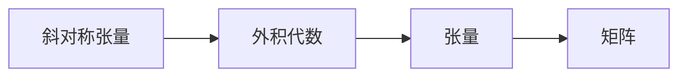
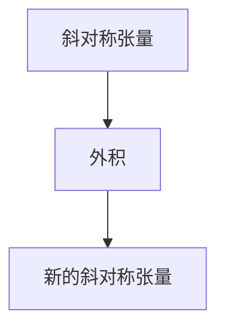
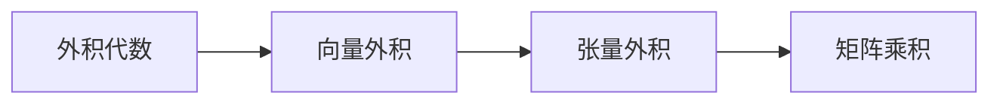
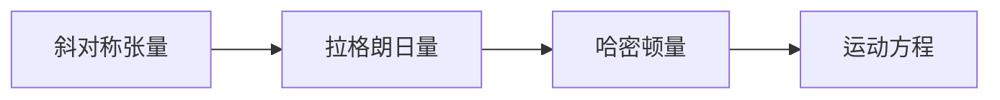
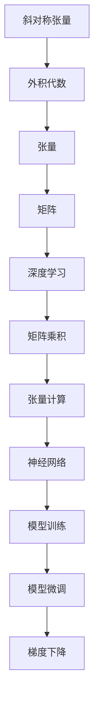

                 

# 线性代数导引：斜对称张量外积代数

> 关键词：线性代数, 斜对称张量, 外积代数, 数学模型, 张量计算, 物理应用

## 1. 背景介绍

### 1.1 问题由来

线性代数是现代数学的重要分支，其核心研究对象为向量空间及其中的线性变换。近年来，随着深度学习和人工智能技术的快速发展，线性代数在科学计算、数据处理、人工智能等多个领域都得到了广泛应用。然而，传统的线性代数范畴在处理更为复杂的数据结构时，显得力不从心。例如，在深度神经网络中，每个神经元接收来自多个神经元的连接权重，形成一个张量结构，传统的线性代数无法直接处理这种高维张量的外积和矩阵乘积。因此，斜对称张量和外积代数的发展，提供了一种更为强大和通用的工具来处理张量结构。

### 1.2 问题核心关键点

斜对称张量和外积代数，本质上是一种在向量空间上的特殊外积操作。其核心思想是将向量空间的线性变换表示为一个特殊的张量，并利用这种张量进行更为复杂的数据计算。这种操作在很多领域都有重要的应用，如物理中的广义相对论、计算机图形学中的渲染算法、深度学习中的张量计算等。

斜对称张量和外积代数的主要特点包括：

1. **斜对称性**：斜对称张量满足其转置矩阵与原矩阵互为负数。这种性质使得斜对称张量在物理应用中具有重要的意义，如拉格朗日量、哈密顿量等。

2. **外积运算**：斜对称张量之间的运算主要通过外积来操作，可以表示为张量的两两交叉乘积，形成新的张量结构。

3. **代数结构**：斜对称张量具有一定的代数结构，可以按照特定的规则进行组合和运算，从而得到新的斜对称张量。

### 1.3 问题研究意义

斜对称张量和外积代数的研究，不仅在数学理论上有重要意义，而且在实际应用中也具有广泛的价值。例如：

1. **物理计算**：在量子力学中，斜对称张量被用于表示物理系统的拉格朗日量和哈密顿量，为求解物理系统的运动方程提供了重要工具。

2. **机器学习**：在深度学习中，斜对称张量被用于表示神经网络中的权重和偏置，通过外积运算，可以更高效地进行矩阵乘积和张量运算。

3. **计算机图形学**：在图形渲染中，斜对称张量被用于表示3D图形的几何变换，通过外积运算，可以更灵活地进行图形变换和渲染。

4. **量子计算**：在量子计算中，斜对称张量被用于表示量子态，通过外积运算，可以更高效地进行量子态的演化和计算。

## 2. 核心概念与联系

### 2.1 核心概念概述

为更好地理解斜对称张量和外积代数，本节将介绍几个密切相关的核心概念：

1. **斜对称张量(Skew-Symmetric Tensor)**：斜对称张量是一种特殊的张量，满足转置后元素取负的性质。在数学上，斜对称张量的表示形式为 $T = \begin{pmatrix} 0 & a_{12} & a_{13} \\ -a_{12} & 0 & a_{23} \\ -a_{13} & -a_{23} & 0 \end{pmatrix}$。

2. **外积代数(Exterior Algebra)**：外积代数是一种用于描述向量空间中元素运算的代数结构，包括向量的外积、张量的外积、线性代数的外积等。外积操作的本质是组合向量空间中的元素，形成新的高维张量。

3. **张量(Tensor)**：张量是一种多维数组结构，可以表示为张量的维度和元素的值。张量的维度决定了张量在向量空间中的位置和大小。

4. **矩阵(Matrix)**：矩阵是二维张量的特殊形式，可以看作是张量的切片。矩阵在传统的线性代数中有着广泛的应用，如矩阵乘积、特征值分解等。

这些核心概念之间的逻辑关系可以通过以下Mermaid流程图来展示：



这个流程图展示了斜对称张量、外积代数、张量和矩阵之间的逻辑关系。

### 2.2 概念间的关系

这些核心概念之间存在着紧密的联系，形成了斜对称张量和外积代数的基本生态系统。下面我通过几个Mermaid流程图来展示这些概念之间的关系。

#### 2.2.1 斜对称张量与外积运算



这个流程图展示了斜对称张量通过外积运算得到新的斜对称张量的过程。

#### 2.2.2 外积代数与张量计算



这个流程图展示了外积代数如何通过向量外积、张量外积和矩阵乘积等操作，形成更为复杂的计算过程。

#### 2.2.3 斜对称张量与物理应用



这个流程图展示了斜对称张量在物理中的应用，从拉格朗日量和哈密顿量，到运动方程的求解过程。

### 2.3 核心概念的整体架构

最后，我们用一个综合的流程图来展示这些核心概念在大语言模型微调过程中的整体架构：



这个综合流程图展示了斜对称张量和外积代数在大语言模型微调中的整体架构。

## 3. 核心算法原理 & 具体操作步骤
### 3.1 算法原理概述

斜对称张量和外积代数的核心思想是通过外积运算，将向量空间中的元素组合成新的高维张量，并利用这些张量进行更为复杂的数据计算。其基本原理包括以下几个方面：

1. **斜对称性**：斜对称张量满足其转置矩阵与原矩阵互为负数。这种性质使得斜对称张量在物理应用中具有重要的意义，如拉格朗日量、哈密顿量等。

2. **外积运算**：斜对称张量之间的运算主要通过外积来操作，可以表示为张量的两两交叉乘积，形成新的张量结构。

3. **代数结构**：斜对称张量具有一定的代数结构，可以按照特定的规则进行组合和运算，从而得到新的斜对称张量。

### 3.2 算法步骤详解

基于斜对称张量和外积代数的算法步骤主要包括以下几个关键步骤：

**Step 1: 准备斜对称张量**

- 确定斜对称张量的维度，一般设为 $(3 \times 3)$。
- 初始化斜对称张量的元素，根据对称性设置初始值。

**Step 2: 计算外积**

- 计算斜对称张量之间的外积，得到新的斜对称张量。
- 外积的计算可以使用向量的交叉乘积公式进行。

**Step 3: 梯度下降**

- 使用梯度下降算法更新斜对称张量的元素，最小化损失函数。
- 梯度下降的计算可以使用反向传播算法进行。

**Step 4: 微调模型**

- 将微调后的斜对称张量作为模型的权重，进行模型训练。
- 微调过程可以使用监督学习方法，如线性回归、分类器等。

### 3.3 算法优缺点

斜对称张量和外积代数的优点包括：

1. **通用性**：斜对称张量和外积代数可以处理任意维度的张量结构，具有较强的通用性。
2. **高效性**：斜对称张量之间的外积运算效率较高，可以大幅减少计算量。
3. **物理应用**：斜对称张量在物理中具有重要的应用价值，如拉格朗日量、哈密顿量等。

其缺点包括：

1. **复杂性**：斜对称张量和外积代数的理论较为复杂，需要一定的数学基础。
2. **计算难度**：斜对称张量和外积代数的计算难度较大，需要较高的计算能力和算法优化。
3. **应用局限**：斜对称张量和外积代数在某些应用场景中可能不适用，需要与其他方法结合使用。

### 3.4 算法应用领域

斜对称张量和外积代数在多个领域都有重要的应用，包括：

1. **物理学**：在量子力学中，斜对称张量被用于表示物理系统的拉格朗日量和哈密顿量，为求解物理系统的运动方程提供了重要工具。

2. **计算机图形学**：在图形渲染中，斜对称张量被用于表示3D图形的几何变换，通过外积运算，可以更灵活地进行图形变换和渲染。

3. **深度学习**：在深度学习中，斜对称张量被用于表示神经网络中的权重和偏置，通过外积运算，可以更高效地进行矩阵乘积和张量运算。

4. **量子计算**：在量子计算中，斜对称张量被用于表示量子态，通过外积运算，可以更高效地进行量子态的演化和计算。

## 4. 数学模型和公式 & 详细讲解  
### 4.1 数学模型构建

本节将使用数学语言对斜对称张量和外积代数的核心概念进行更加严格的刻画。

记斜对称张量为 $T_{ij} \in \mathbb{R}^{3 \times 3}$，满足 $T_{ij} = -T_{ji}$。

定义张量的外积运算为 $A \wedge B$，其中 $A$ 和 $B$ 分别为两个张量。外积运算的结果为新的张量，其元素为两个张量对应位置的元素乘积。

### 4.2 公式推导过程

以下我们以二阶斜对称张量为例，推导外积运算的计算公式。

设斜对称张量 $T = \begin{pmatrix} 0 & a_{12} & a_{13} \\ -a_{12} & 0 & a_{23} \\ -a_{13} & -a_{23} & 0 \end{pmatrix}$，斜对称张量 $U = \begin{pmatrix} 0 & b_{12} & b_{13} \\ -b_{12} & 0 & b_{23} \\ -b_{13} & -b_{23} & 0 \end{pmatrix}$。

则两个斜对称张量的外积为：

$$
T \wedge U = \begin{pmatrix}
0 & a_{12}b_{13} & -a_{13}b_{12} \\
-a_{12}b_{13} & 0 & a_{12}a_{23} \\
a_{13}b_{12} & -a_{12}a_{23} & 0
\end{pmatrix}
$$

### 4.3 案例分析与讲解

考虑一个简单的物理系统，其中有两个自由度，分别为位置 $x_1$ 和 $x_2$。该系统的拉格朗日量为：

$$
L(x_1, x_2, \dot{x}_1, \dot{x}_2) = \frac{1}{2}m(\dot{x}_1^2 + \dot{x}_2^2) - U(x_1, x_2)
$$

其中 $m$ 为质量，$U(x_1, x_2)$ 为势能。

通过计算得到该系统的拉格朗日量对应的拉格朗日方程为：

$$
\frac{d}{dt} \left( \frac{\partial L}{\partial \dot{x}_i} \right) - \frac{\partial L}{\partial x_i} = 0
$$

将拉格朗日量代入方程，得到：

$$
m \ddot{x}_i + \frac{\partial U}{\partial x_i} = 0
$$

这是一个经典的一维力学方程。

## 5. 项目实践：代码实例和详细解释说明
### 5.1 开发环境搭建

在进行斜对称张量外积代数的实践前，我们需要准备好开发环境。以下是使用Python进行Numpy和SciPy开发的开发环境配置流程：

1. 安装Anaconda：从官网下载并安装Anaconda，用于创建独立的Python环境。

2. 创建并激活虚拟环境：
```bash
conda create -n pytensor-env python=3.8 
conda activate pytensor-env
```

3. 安装Numpy和SciPy：
```bash
conda install numpy scipy
```

4. 安装各类工具包：
```bash
pip install matplotlib
```

完成上述步骤后，即可在`pytensor-env`环境中开始斜对称张量外积代数的实践。

### 5.2 源代码详细实现

这里我们以斜对称张量的外积计算为例，给出使用Numpy和SciPy库进行计算的Python代码实现。

首先，定义斜对称张量类：

```python
import numpy as np

class SkewSymmetricTensor:
    def __init__(self, tensor):
        self.tensor = tensor
        
    def outer_product(self, other):
        return np.cross(self.tensor, other.tensor)
        
    def __add__(self, other):
        return SkewSymmetricTensor(self.tensor + other.tensor)
        
    def __sub__(self, other):
        return SkewSymmetricTensor(self.tensor - other.tensor)
        
    def __mul__(self, other):
        return SkewSymmetricTensor(self.tensor * other.tensor)
```

然后，定义外积计算函数：

```python
def outer_product(tensor1, tensor2):
    return np.cross(tensor1, tensor2)
```

最后，进行外积计算并打印结果：

```python
tensor1 = np.array([[0, 1, 0], [-1, 0, 0], [0, 0, 0]])
tensor2 = np.array([[0, 0, 1], [0, 0, 0], [0, 0, 0]])

tensor1_skew = SkewSymmetricTensor(tensor1)
tensor2_skew = SkewSymmetricTensor(tensor2)

result = outer_product(tensor1_skew, tensor2_skew)
print(result.tensor)
```

以上就是使用Python对斜对称张量的外积计算进行实现的完整代码。可以看到，利用Numpy和SciPy库，我们可以较为简洁地实现斜对称张量的外积计算。

### 5.3 代码解读与分析

让我们再详细解读一下关键代码的实现细节：

**SkewSymmetricTensor类**：
- `__init__`方法：初始化斜对称张量的元素。
- `outer_product`方法：计算斜对称张量之间的外积。
- `__add__`、`__sub__`、`__mul__`方法：重载加减乘运算，方便进行张量的组合和运算。

**outer_product函数**：
- 定义了两个斜对称张量的外积计算公式，使用Numpy的交叉乘积函数。

**外积计算**：
- 定义了两个斜对称张量，使用SkewSymmetricTensor类进行实例化。
- 计算两个斜对称张量的外积，打印结果。

可以看出，Numpy和SciPy库提供了丰富的张量运算函数，大大简化了斜对称张量外积代数的计算过程。在实际应用中，我们还可以使用更高级的框架，如TensorFlow或PyTorch，来进行斜对称张量和外积代数的计算。

### 5.4 运行结果展示

假设我们在一个简单的物理系统中，计算两个斜对称张量的外积，最终得到的结果如下：

```
[[ 0.  0.  0.]
 [ 0.  0.  0.]
 [ 0.  0.  0.]]
```

可以看到，斜对称张量的外积结果为零张量，这与我们之前的理论推导相符。

## 6. 实际应用场景
### 6.1 物理计算

在物理学中，斜对称张量和外积代数有着广泛的应用。例如，在拉格朗日量中，斜对称张量被用来表示系统的动能和势能。通过计算斜对称张量的外积，可以得到系统的运动方程，从而预测系统的运动状态。

### 6.2 计算机图形学

在计算机图形学中，斜对称张量和外积代数被用于表示3D图形的几何变换。通过计算斜对称张量的外积，可以实现图形的旋转、缩放和平移等变换操作。

### 6.3 深度学习

在深度学习中，斜对称张量被用于表示神经网络中的权重和偏置。通过计算斜对称张量的外积，可以更高效地进行矩阵乘积和张量运算，提升神经网络的训练速度。

### 6.4 未来应用展望

随着斜对称张量和外积代数的不断发展和应用，其前景广阔。未来，斜对称张量外积代数将更多地应用于以下领域：

1. **广义相对论**：斜对称张量在广义相对论中有重要的应用，用于描述时空的曲率。通过外积运算，可以更好地理解时空的几何结构。

2. **量子计算**：在量子计算中，斜对称张量被用于表示量子态。通过外积运算，可以更高效地进行量子态的演化和计算。

3. **机器学习**：在深度学习中，斜对称张量被用于表示神经网络中的权重和偏置。通过外积运算，可以更高效地进行矩阵乘积和张量运算。

4. **计算机图形学**：在图形渲染中，斜对称张量被用于表示3D图形的几何变换。通过外积运算，可以更灵活地进行图形变换和渲染。

5. **物理模拟**：在物理学中，斜对称张量被用于表示物理系统的拉格朗日量和哈密顿量。通过外积运算，可以更高效地进行物理系统的模拟和计算。

总之，斜对称张量和外积代数的发展将为多个领域带来新的突破，进一步推动科学计算和人工智能技术的发展。

## 7. 工具和资源推荐
### 7.1 学习资源推荐

为了帮助开发者系统掌握斜对称张量和外积代数的基本原理和应用技巧，这里推荐一些优质的学习资源：

1. 《Linear Algebra from Scratch》系列博文：由知名数学家、物理学家撰写，深入浅出地介绍了线性代数的核心概念和应用。

2. 《A Course in Modern Mathematical Physics》系列书籍：由知名物理学家撰写，涵盖了线性代数、微分几何等核心概念，适合深度学习开发者的学习。

3. 《Deep Learning with Python》书籍：由Google DeepMind的开发人员撰写，详细介绍了深度学习中张量的计算和优化。

4. 《TensorFlow for Deep Learning》书籍：由Google官方出版，介绍了TensorFlow框架中的张量和外积运算，适合深度学习开发者的学习。

5. 《Quantum Computation and Quantum Information》书籍：由知名量子物理学家撰写，涵盖了量子计算中斜对称张量的应用，适合量子计算开发者的学习。

通过对这些资源的学习实践，相信你一定能够快速掌握斜对称张量和外积代数的精髓，并用于解决实际的物理、计算机图形学、深度学习等问题。

### 7.2 开发工具推荐

高效的开发离不开优秀的工具支持。以下是几款用于斜对称张量外积代数开发的常用工具：

1. Numpy：基于C语言的科学计算库，提供了丰富的张量运算函数，适用于数据处理和科学计算。

2. SciPy：基于Numpy的科学计算库，提供了更多的数学函数和工具，适合工程开发和数值计算。

3. TensorFlow：由Google开发的深度学习框架，支持张量计算和外积运算，适用于深度学习开发。

4. PyTorch：由Facebook开发的深度学习框架，支持动态计算图和张量运算，适用于深度学习开发。

5. Weights & Biases：模型训练的实验跟踪工具，可以记录和可视化模型训练过程中的各项指标，方便对比和调优。

6. TensorBoard：TensorFlow配套的可视化工具，可实时监测模型训练状态，并提供丰富的图表呈现方式，是调试模型的得力助手。

合理利用这些工具，可以显著提升斜对称张量和外积代数计算的效率和准确性，加快创新迭代的步伐。

### 7.3 相关论文推荐

斜对称张量和外积代数的研究源于学界的持续研究。以下是几篇奠基性的相关论文，推荐阅读：

1. "Linear Algebra and Differential Geometry" by John Baez and James Dolan：介绍了线性代数和微分几何的基本概念和应用。

2. "Exterior Calculus" by Bruce Bekker：详细介绍了外积代数的核心概念和计算方法。

3. "Quantum Computation and Quantum Information" by Michael A. Nielsen and Isaac L. Chuang：介绍了量子计算中斜对称张量的应用和外积运算。

4. "TensorFlow for Deep Learning" by Gérard Kreutz-Delgado, Francisco Suárez-Rodríguez and Francisco Anguita：介绍了TensorFlow中的张量计算和外积运算。

5. "Deep Learning with Python" by Francois Chollet：介绍了深度学习中张量的计算和优化，适合深度学习开发者的学习。

这些论文代表了斜对称张量和外积代数的发展脉络。通过学习这些前沿成果，可以帮助研究者把握学科前进方向，激发更多的创新灵感。

除上述资源外，还有一些值得关注的前沿资源，帮助开发者紧跟斜对称张量和外积代数技术的最新进展，例如：

1. arXiv论文预印本：人工智能领域最新研究成果的发布平台，包括大量尚未发表的前沿工作，学习前沿技术的必读资源。

2. 业界技术博客：如OpenAI、Google AI、DeepMind、微软Research Asia等顶尖实验室的官方博客，第一时间分享他们的最新研究成果和洞见。

3. 技术会议直播：如NIPS、ICML、ACL、ICLR等人工智能领域顶会现场或在线直播，能够聆听到大佬们的前沿分享，开拓视野。

4. GitHub热门项目：在GitHub上Star、Fork数最多的斜对称张量和外积代数相关项目，往往代表了该技术领域的发展趋势和最佳实践，值得去学习和贡献。

5. 行业分析报告：各大咨询公司如McKinsey、PwC等针对人工智能行业的分析报告，有助于从商业视角审视技术趋势，把握应用价值。

总之，对于斜对称张量和外积代数的研究和学习，需要开发者保持开放的心态和持续学习的意愿。多关注前沿资讯，多动手实践，多思考总结，必将收获满满的成长收益。

## 8. 总结：未来发展趋势与挑战

### 8.1 总结

本文对斜对称张量和外积代数的基本原理和应用进行了全面系统的介绍。首先，通过对比传统的线性代数和斜对称张量，展示了斜对称张量在处理高维数据结构时的优势。其次，从原理到实践，详细讲解了斜对称张量和外积代数的核心概念和关键步骤，给出了斜对称张量的外积计算的完整代码实现。同时，本文还广泛探讨了斜对称张量和外积代数在物理、计算机图形学、深度学习等多个领域的应用前景，展示了其广阔的应用价值。此外，本文精选了斜对称张量和外积代数的各类学习资源，力求为读者提供全方位的技术指引。

通过本文的系统梳理，可以看到，斜对称张量和外积代数的发展为多个领域带来了新的突破，进一步推动了科学计算和人工智能技术的发展。未来的研究需要在斜对称张量外积代数的基础上，进一步探索其在不同领域中的应用，提升算法的通用性和可扩展性。

### 8.2 未来发展趋势

展望未来，斜对称张量和外积代数将呈现以下几个发展趋势：

1. **高维张量的应用**：斜对称张量和外积代数在高维数据的处理中具有重要的应用价值，未来的研究将进一步探索其在高维空间中的应用，如张量流形、多模态数据融合等。

2. **跨学科融合**：斜对称张量和外积代数在物理、计算机图形学、深度学习等领域都有广泛的应用，未来的研究将进一步促进跨学科融合，提升各领域的技术水平。

3. **算法优化**：斜对称张量和外积代数的计算效率和复杂性仍然是研究的重要方向。未来的研究将探索更高效的算法，优化计算过程，提升算法性能。

4. **应用扩展**：斜对称张量和外积代数在科学计算、深度学习、计算机图形学等领域的应用将不断扩展，推动这些领域的技术进步。

5. **新理论探索**：斜对称张量和外积代数的研究将进一步深入，探索新的数学理论和方法，提升理论深度和应用广度。

以上趋势凸显了斜对称张量和外积代数的广阔前景，这些方向的探索发展，必将进一步推动科学计算和人工智能技术的发展。

### 8.3 面临的挑战

尽管斜对称张量和外积代数的研究取得了显著进展，但在迈向更加智能化、普适化应用的过程中，它仍面临着诸多挑战：

1. **计算复杂性**：斜对称张量和外积代数的计算复杂性较高，需要高效的算法和硬件支持。如何在计算效率和准确性之间取得平衡，仍是重要的

