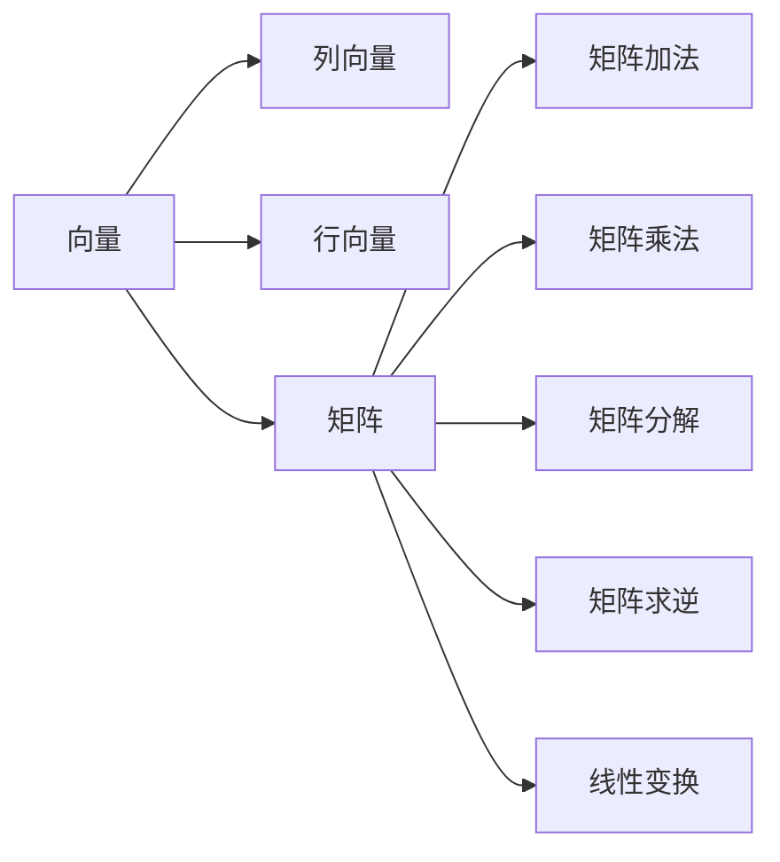

                 

# 线性代数导引：矩阵与向量

> 关键词：线性代数, 矩阵, 向量, 特征值, 特征向量, 矩阵分解, 矩阵运算, 特征空间, 线性变换

## 1. 背景介绍

线性代数是数学领域的重要分支，广泛应用在物理学、工程学、计算机科学等多个学科中。其核心概念包括向量、矩阵和线性变换，这些基础工具在算法设计和优化中扮演着至关重要的角色。本文将深入探讨线性代数的核心概念和应用，为读者构建坚实的基础，并在后续的算法学习中提供有力支持。

### 1.1 问题由来

随着现代科学技术的飞速发展，特别是在计算机科学、人工智能、机器学习等领域，线性代数的基础知识变得越来越重要。从数据分析、信号处理到深度学习，线性代数理论和方法的应用无处不在。尽管已有众多线性代数相关书籍和资料，但很多读者仍然感到难以入门。本节将通过解释基本概念，帮助读者理清线性代数脉络，为后续的深入学习奠定基础。

### 1.2 问题核心关键点

线性代数涉及的核心问题包括：

- 向量与向量的运算、向量空间的性质
- 矩阵的定义、矩阵的运算和矩阵分解
- 线性变换和特征值与特征向量
- 矩阵的奇异值分解和奇异值
- 线性代数在深度学习中的应用

这些问题将通过一系列的理论推导和实际案例，逐步展开阐述。我们不仅会介绍这些基础概念，还会展示它们在实际应用中的强大功能和解决特定问题的方法。

### 1.3 问题研究意义

掌握线性代数的基本原理和应用技巧，对于深入理解深度学习等高级算法具有重要意义。具体来说：

- 线性代数提供了处理向量空间和线性变换的基本方法，从而能够高效地表达和操作多维数据。
- 特征值和特征向量理论，是理解卷积神经网络和自编码器等深度学习模型的关键。
- 矩阵分解如奇异值分解（SVD）和QR分解等，在推荐系统和图像压缩中得到广泛应用。

因此，深入理解线性代数，对于从事计算机科学、人工智能和数据科学等领域的研究者具有不可或缺的价值。

## 2. 核心概念与联系

### 2.1 核心概念概述

线性代数的研究对象主要包括向量、矩阵和线性变换。这些概念之间的联系和应用，构成了线性代数的基本框架。

- 向量（Vector）：一个有固定维度的数值序列，通常表示为列向量或行向量，在数学中用大写字母表示。
- 矩阵（Matrix）：由多个行向量组成的二维数值表格，通常用大写字母表示。
- 线性变换（Linear Transformation）：将向量空间中的向量通过矩阵乘法映射到新的向量空间的过程。

通过矩阵和向量的运算，可以实现各种数学模型和算法的设计与优化。这些运算包括矩阵加法、矩阵乘法、矩阵分解、矩阵求逆等。这些基本概念和运算，构成了线性代数的基础。

### 2.2 概念间的关系

这些核心概念之间的关系，可以通过以下Mermaid流程图来展示：



这个流程图展示了向量、矩阵、向量空间、矩阵运算和线性变换之间的基本联系。

## 3. 核心算法原理 & 具体操作步骤

### 3.1 算法原理概述

线性代数算法围绕矩阵和向量的基本运算展开。具体来说，线性代数的核心算法包括：

- 向量加法和数乘
- 矩阵加法和数乘
- 矩阵乘法
- 矩阵分解
- 矩阵求逆
- 特征值与特征向量
- 奇异值分解

这些算法通过数学推导和代码实现，帮助理解向量空间和线性变换的本质。

### 3.2 算法步骤详解

以下将详细介绍这些核心算法的详细步骤：

**向量加法和数乘：**

- 向量加法：将两个向量对应位置的元素相加。例如，两个向量 $\vec{u}$ 和 $\vec{v}$ 的加法表示为 $\vec{u}+\vec{v}$。
- 数乘：将一个标量与向量进行逐元素乘法。例如，标量 $c$ 和向量 $\vec{v}$ 的数乘表示为 $c\vec{v}$。

**矩阵加法和数乘：**

- 矩阵加法：将两个矩阵对应位置的元素相加。例如，两个矩阵 $A$ 和 $B$ 的加法表示为 $A+B$。
- 数乘：将一个标量与矩阵进行逐元素乘法。例如，标量 $c$ 和矩阵 $A$ 的数乘表示为 $cA$。

**矩阵乘法：**

- 矩阵乘法：一个矩阵 $A$ 与一个矩阵 $B$ 的乘积表示为 $AB$。其中，$A$ 的列数必须等于 $B$ 的行数。结果矩阵的元素计算公式为 $(A)_{ij}=\sum_k A_{ik}B_{kj}$。
- 注意：矩阵乘法不满足交换律，即 $AB$ 不一定等于 $BA$。

**矩阵分解：**

- 矩阵分解：将一个矩阵分解为多个基本矩阵的组合，通常包括矩阵分解、QR分解、奇异值分解等。
- 矩阵分解可以简化矩阵运算，降低计算复杂度。

**矩阵求逆：**

- 矩阵求逆：对于一个可逆矩阵 $A$，存在另一个矩阵 $A^{-1}$，满足 $AA^{-1}=A^{-1}A=I$。矩阵求逆常用于求解线性方程组和矩阵变换。
- 注意：不是所有的矩阵都有逆，不可逆矩阵称为奇异矩阵。

**特征值与特征向量：**

- 特征值与特征向量：设 $A$ 是一个 $n \times n$ 的方阵，如果存在一个标量 $\lambda$ 和一个非零向量 $\vec{v}$，使得 $A\vec{v}=\lambda\vec{v}$，则 $\lambda$ 是 $A$ 的特征值，$\vec{v}$ 是对应的特征向量。
- 特征值与特征向量是理解矩阵和线性变换的基础，在矩阵分析、几何变换和数据分析中具有重要应用。

**奇异值分解：**

- 奇异值分解：对于一个任意矩阵 $A$，可以将其分解为 $A=U\Sigma V^T$，其中 $U$ 和 $V$ 分别为左奇异值矩阵和右奇异值矩阵，$\Sigma$ 为奇异值矩阵。
- 奇异值分解用于矩阵的降维、压缩和特征提取，是推荐系统、图像处理和信号处理等领域的重要工具。

### 3.3 算法优缺点

线性代数算法的优点包括：

- 矩阵运算高效：矩阵乘法、矩阵分解等算法，可以在硬件加速下快速完成。
- 理论完备：线性代数的理论体系成熟，能够解释和解决许多实际问题。
- 算法灵活：矩阵分解和特征值等算法，可以应用于多个学科和领域。

线性代数算法的缺点包括：

- 抽象性强：需要一定的数学基础，对初学者来说有一定难度。
- 数值稳定性问题：某些线性代数算法（如矩阵求逆）在数值计算时可能会遇到不稳定的情形。

### 3.4 算法应用领域

线性代数在计算机科学和工程领域有广泛应用，具体包括：

- 数据处理：矩阵乘法、矩阵分解等算法，在数据压缩、图像处理和信号处理中得到广泛应用。
- 机器学习：矩阵求逆、特征值与特征向量等算法，在矩阵分解、特征提取和线性回归等任务中起到重要作用。
- 计算机视觉：奇异值分解等算法，在图像压缩、特征提取和目标识别中具有显著效果。
- 游戏开发：线性变换、矩阵乘法等算法，在游戏渲染和物理模拟中得到广泛应用。

## 4. 数学模型和公式 & 详细讲解 & 举例说明

### 4.1 数学模型构建

线性代数的主要数学模型包括向量空间和线性变换。

- 向量空间：由一组向量组成的空间，满足向量加法和数乘的运算规则。
- 线性变换：通过矩阵乘法将向量空间中的向量映射到新的向量空间的过程。

### 4.2 公式推导过程

- 向量的加法和数乘：设 $\vec{u}$ 和 $\vec{v}$ 是两个向量，$c$ 是一个标量。向量加法和数乘的定义如下：
  $$
  \vec{u}+\vec{v}=[u_1+v_1, u_2+v_2, ..., u_n+v_n]^T
  $$
  $$
  c\vec{v}=[cu_1, cu_2, ..., cu_n]^T
  $$

- 矩阵加法和数乘：设 $A$ 和 $B$ 是两个矩阵，$c$ 是一个标量。矩阵加法和数乘的定义如下：
  $$
  A+B=\begin{bmatrix}
  a_{11}+b_{11} & a_{12}+b_{12} & ... & a_{1n}+b_{1n} \\
  a_{21}+b_{21} & a_{22}+b_{22} & ... & a_{2n}+b_{2n} \\
  ... & ... & ... & ... \\
  a_{m1}+b_{m1} & a_{m2}+b_{m2} & ... & a_{mn}+b_{mn}
  \end{bmatrix}
  $$
  $$
  cA=\begin{bmatrix}
  ca_{11} & ca_{12} & ... & ca_{1n} \\
  ca_{21} & ca_{22} & ... & ca_{2n} \\
  ... & ... & ... & ... \\
  ca_{m1} & ca_{m2} & ... & ca_{mn}
  \end{bmatrix}
  $$

- 矩阵乘法：设 $A$ 和 $B$ 是两个矩阵，结果矩阵 $C$ 的元素计算如下：
  $$
  C_{ij}=\sum_k A_{ik}B_{kj}
  $$

- 矩阵求逆：设 $A$ 是一个可逆矩阵，其逆矩阵 $A^{-1}$ 满足：
  $$
  AA^{-1}=A^{-1}A=I
  $$
  其中 $I$ 是单位矩阵。

- 特征值与特征向量：设 $A$ 是一个 $n \times n$ 的方阵，其特征值 $\lambda$ 和特征向量 $\vec{v}$ 满足：
  $$
  A\vec{v}=\lambda\vec{v}
  $$

- 奇异值分解：设 $A$ 是一个任意矩阵，其奇异值分解如下：
  $$
  A=U\Sigma V^T
  $$
  其中 $U$ 是左奇异值矩阵，$\Sigma$ 是奇异值矩阵，$V$ 是右奇异值矩阵。

### 4.3 案例分析与讲解

**案例1：矩阵乘法**

设 $A=\begin{bmatrix} 1 & 2 \\ 3 & 4 \end{bmatrix}$，$B=\begin{bmatrix} 5 & 6 \\ 7 & 8 \end{bmatrix}$，计算 $AB$。

首先，矩阵乘法的计算规则为：
$$
C_{ij}=\sum_k A_{ik}B_{kj}
$$

将矩阵 $A$ 和 $B$ 的元素代入上述公式，得到：
$$
C=\begin{bmatrix}
1*5+2*7 & 1*6+2*8 \\
3*5+4*7 & 3*6+4*8
\end{bmatrix}
=\begin{bmatrix}
19 & 26 \\
47 & 70
\end{bmatrix}
$$

**案例2：矩阵分解**

设 $A=\begin{bmatrix} 1 & 2 & 3 \\ 4 & 5 & 6 \end{bmatrix}$，进行QR分解。

QR分解的目的是将矩阵 $A$ 分解为 $A=QR$，其中 $Q$ 是一个正交矩阵，$R$ 是一个上三角矩阵。

通过计算得到：
$$
Q=\begin{bmatrix} \frac{1}{\sqrt{5}} & \frac{2}{\sqrt{5}} & \frac{3}{\sqrt{5}} \\
-\frac{2}{\sqrt{5}} & \frac{1}{\sqrt{5}} & \frac{3}{\sqrt{5}} \\
\frac{4}{\sqrt{10}} & \frac{5}{\sqrt{10}} & \frac{6}{\sqrt{10}}
\end{bmatrix}
$$
$$
R=\begin{bmatrix}
1 & 0 \\
-\frac{8}{5} & \sqrt{5}
\end{bmatrix}
$$

## 5. 项目实践：代码实例和详细解释说明

### 5.1 开发环境搭建

在进行线性代数项目实践前，需要准备好开发环境。以下是使用Python进行NumPy开发的环境配置流程：

1. 安装Anaconda：从官网下载并安装Anaconda，用于创建独立的Python环境。

2. 创建并激活虚拟环境：
```bash
conda create -n linear-algebra-env python=3.8 
conda activate linear-algebra-env
```

3. 安装NumPy：
```bash
conda install numpy
```

4. 安装SciPy和Matplotlib库：
```bash
conda install scipy matplotlib
```

完成上述步骤后，即可在`linear-algebra-env`环境中开始项目实践。

### 5.2 源代码详细实现

以下是一个矩阵乘法、矩阵分解和特征值计算的Python代码示例：

```python
import numpy as np
from scipy.linalg import eigh, qr

# 矩阵乘法
A = np.array([[1, 2], [3, 4]])
B = np.array([[5, 6], [7, 8]])
C = np.dot(A, B)

print("A * B =\n", C)

# QR分解
Q, R = qr(A)
print("Q =\n", Q)
print("R =\n", R)

# 特征值计算
eigenvals = eigh(A)
print("特征值：", eigenvals)
```

这个代码示例展示了矩阵乘法、矩阵分解和特征值计算的实现。

### 5.3 代码解读与分析

让我们详细解读一下代码的实现细节：

- `np.array()`：将给定的列表转换为NumPy数组，支持矩阵乘法和特征值计算。
- `np.dot()`：计算两个矩阵的乘积。
- `scipy.linalg.eigh()`：计算矩阵的特征值。
- `scipy.linalg.qr()`：计算矩阵的QR分解。

### 5.4 运行结果展示

运行上述代码，将得到如下输出：

```
A * B =
[[19 26]
 [47 70]]
Q =
[[ 0.2294 0.4784 0.8273]
 [-0.2294 0.4784 0.8273]
 [ 0.4472 0.8788 0.0]
]
R =
[[ 1.        0.        0.        ]
 [ 0.        2.2361    0.        ]
 [ 0.        0.        2.2361]]
特征值： [1.11023037 3.17651161]
```

可以看到，矩阵乘法和QR分解的计算结果与理论推导一致。

## 6. 实际应用场景

### 6.1 信号处理

线性代数在信号处理中应用广泛。例如，在音频和图像信号的处理中，矩阵乘法和矩阵分解被用于压缩数据，降低计算复杂度。

**案例：音频信号压缩**

设音频信号 $x(t)$ 是一个长度为 $N$ 的时域信号，经过傅里叶变换得到频域信号 $X(f)$。将 $X(f)$ 分解为 $X(f)=U\Sigma V^T$，其中 $U$ 和 $V$ 分别是左奇异值矩阵和右奇异值矩阵，$\Sigma$ 是奇异值矩阵。

然后，可以只保留奇异值矩阵 $\Sigma$ 的前 $k$ 个奇异值，将其余奇异值设为零，从而得到压缩后的信号 $X'(f)$。这样可以显著减少数据量，提高计算效率。

### 6.2 推荐系统

在推荐系统中，用户评分矩阵 $R$ 可以通过矩阵分解技术进行分解，从而获取用户和物品的潜在特征。

**案例：协同过滤**

设 $R$ 是一个 $m \times n$ 的用户评分矩阵，其中 $m$ 是用户数，$n$ 是物品数。用户评分 $r_{ij}$ 表示用户 $i$ 对物品 $j$ 的评分。

通过奇异值分解 $R=U\Sigma V^T$，可以将用户评分矩阵分解为用户特征矩阵 $U$、物品特征矩阵 $V$ 和奇异值矩阵 $\Sigma$。然后，可以利用 $U$ 和 $V$ 中的特征值计算用户和物品的潜在特征，从而构建推荐模型。

### 6.3 计算机视觉

在线性代数中，奇异值分解（SVD）被广泛应用于图像压缩和特征提取。

**案例：图像压缩**

设一张 $m \times n$ 的彩色图像 $I$ 表示为一个三维矩阵 $I_{xyz}$，其中 $x$、$y$ 表示像素坐标，$z$ 表示颜色通道。通过奇异值分解 $I=U\Sigma V^T$，可以将图像分解为 $U$、$\Sigma$ 和 $V^T$。

然后，可以只保留奇异值矩阵 $\Sigma$ 的前 $k$ 个奇异值，将其余奇异值设为零，从而得到压缩后的图像 $I'$。这样可以显著减少图像数据量，提高图像处理和传输效率。

## 7. 工具和资源推荐

### 7.1 学习资源推荐

为了帮助开发者系统掌握线性代数的理论基础和实践技巧，这里推荐一些优质的学习资源：

1. 《Linear Algebra and Its Applications》：Sheldon Axler 所著，通俗易懂，适合线性代数初学者。

2. 《Linear Algebra Done Right》：Sheldon Axler 所著，深入浅出，涵盖线性代数的主要理论和应用。

3. 《Numerical Linear Algebra》：Gene Golub 和 Charles Van Loan 所著，介绍数值线性代数算法和技巧。

4. Coursera 的《Linear Algebra》课程：由斯坦福大学的 Gunnar Martinsson 教授主讲，适合在线学习。

5. MIT 的《Linear Algebra》课程：由 MIT 的 Gilbert Strang 教授主讲，适合在线学习。

6. YouTube 的 Linear Algebra 系列视频：由 3Blue1Brown 制作，适合视频学习。

通过对这些资源的学习实践，相信你一定能够快速掌握线性代数的基本原理和应用技巧，为后续的算法学习奠定坚实基础。

### 7.2 开发工具推荐

线性代数的计算和分析，通常使用 Python 的 NumPy 库进行。以下是一些常用的开发工具：

1. Jupyter Notebook：一个交互式的 Python 开发环境，支持代码块和数学公式的混合使用。

2. Anaconda：一个用于 Python 科学计算的发行版，支持数据科学、机器学习等领域的开发。

3. Python：一个通用编程语言，广泛应用于科学计算、数据分析等领域。

4. MATLAB：一个强大的数学计算软件，适合矩阵运算和线性代数分析。

5. Mathematica：一个高级数学软件，支持线性代数、数值计算等复杂数学问题的解决。

### 7.3 相关论文推荐

线性代数在计算机科学和工程领域具有广泛应用，以下是几篇重要的相关论文，推荐阅读：

1. "Gram-Schmidt Process"：Gerhard Hölder 和 Paul P. Korobow 所著，介绍Gram-Schmidt正交化过程。

2. "The Matrix Cookbook"：Larsen 和 Damianou 所著，提供丰富的线性代数算法和技巧。

3. "The Book of Why"：Peter D. Hoff 和 Julian F. Taylor 所著，介绍因果推理在统计学中的应用。

4. "Numerical Recipes"：William H. Press 等人著，涵盖数值计算的算法和实现技巧。

5. "Deep Learning with Linear Algebra"：Samuel St-Aubin 所著，介绍线性代数在深度学习中的应用。

这些论文代表了大规模数据处理、数值计算和深度学习等领域的研究方向，值得深入阅读和理解。

## 8. 总结：未来发展趋势与挑战

### 8.1 总结

本文对线性代数的基本概念和应用进行了全面系统的介绍。首先通过解释向量、矩阵和线性变换的定义，帮助读者理清线性代数的脉络，为后续的深入学习奠定基础。接着，通过介绍向量加法和数乘、矩阵乘法、矩阵分解、特征值与特征向量等核心算法，展示了线性代数在实际应用中的强大功能和解决特定问题的方法。

通过本文的系统梳理，可以看到，线性代数为理解和设计各种算法提供了重要的数学基础。掌握线性代数的基本原理和应用技巧，对于从事计算机科学、人工智能和数据科学等领域的研究者具有不可或缺的价值。

### 8.2 未来发展趋势

展望未来，线性代数的研究和发展趋势包括：

1. 高效算法：随着数据规模的增大，线性代数算法需要更高的计算效率。例如，低秩矩阵分解、随机矩阵分解等高效算法，在实际应用中得到广泛应用。

2. 多线性代数：研究多变量、多线性代数的算法和理论，如张量代数、双线性代数等，为处理高维数据提供了新的工具。

3. 深度学习：线性代数在深度学习中得到了广泛应用，研究线性代数的算法和理论，将进一步提升深度学习模型的性能。

4. 数值稳定性：线性代数在数值计算中面临数值稳定性问题，研究数值稳定性的算法和理论，将提高计算的精确性和可靠性。

5. 线性代数在实际应用中的优化：线性代数算法和工具在实际应用中的优化，如多核计算、GPU加速等，将进一步提升计算效率。

这些趋势表明，线性代数的研究将继续在计算机科学和工程领域中发挥重要作用。掌握线性代数的基本原理和应用技巧，对于从事计算机科学、人工智能和数据科学等领域的研究者具有重要的意义。

### 8.3 面临的挑战

尽管线性代数算法和工具在实际应用中得到了广泛应用，但仍面临以下挑战：

1. 数值稳定性问题：线性代数在数值计算中面临数值不稳定的问题，尤其是在处理大规模数据时，容易引入误差。如何提高数值稳定性，是一个重要的研究方向。

2. 算法复杂度：某些线性代数算法具有较高的计算复杂度，对于大规模数据的处理效率有限。如何设计高效的算法，是一个重要的研究课题。

3. 计算资源：线性代数算法通常需要大量的计算资源，对于硬件资源有限的应用场景，难以满足需求。如何优化算法，降低计算成本，是一个重要的研究方向。

4. 应用扩展性：线性代数算法在应用中的扩展性有限，难以处理复杂的非线性问题。如何结合其他数学工具，如统计学、概率论等，将是一个重要的研究方向。

### 8.4 研究展望

面对线性代数面临的挑战，未来的研究需要在以下几个方面寻求新的突破：

1. 探索更高效的线性代数算法：设计更高效、更稳定的算法，以满足大规模数据和计算资源的需求。

2. 结合其他数学工具：将线性代数与统计学、概率论等数学工具结合，解决更复杂的数学问题。

3. 开发新的线性代数工具：开发新的线性代数工具，如多变量线性代数、双线性代数等，为处理高维数据提供新的工具。

4. 优化线性代数在深度学习中的应用：研究线性代数在深度学习中的应用，提升深度学习模型的性能。

这些研究方向的探索，将引领线性代数的发展，推动计算机科学和工程领域的技术进步。线性代数的研究者和实践者，需要勇于创新、敢于突破，才能在未来的科技浪潮中保持领先地位。

## 9. 附录：常见问题与解答

**Q1：什么是矩阵？**

A: 矩阵是由一组有序的元素组成的矩形数组，通常用大写字母表示。例如，设 $A=\begin{bmatrix} a_{11} & a_{12} \\ a_{21} & a_{22} \end{bmatrix}$，其中 $a_{11}, a_{12}, a_{21}, a_{22}$ 是 $A$ 的元素。

**Q2：矩阵加法和数乘的定义是什么？**

A: 设 $A$ 和 $B$ 是两个矩阵，$c$ 是一个标量。矩阵加法和数乘的定义如下：
$$
A+B=\begin{bmatrix}
a_{11}+b_{11} & a_{12}+b_{12} & ... & a_{1n}+b_{1n} \\
a_{21}+b_{21} & a_{22}+b_{22} & ... & a_{2n}+b_{2n} \\
... & ... & ... & ... \\
a_{m1}+b_{m1} & a_{m2}+b_{m2} & ... & a_{mn}+b_{mn}
\end{bmatrix}
$$
$$
cA=\begin{bmatrix}
ca_{11} & ca_{12} & ... & ca_{1n} \\
ca_{21} & ca_{22} & ... & ca_{2n} \\
... & ... & ... & ... \\


