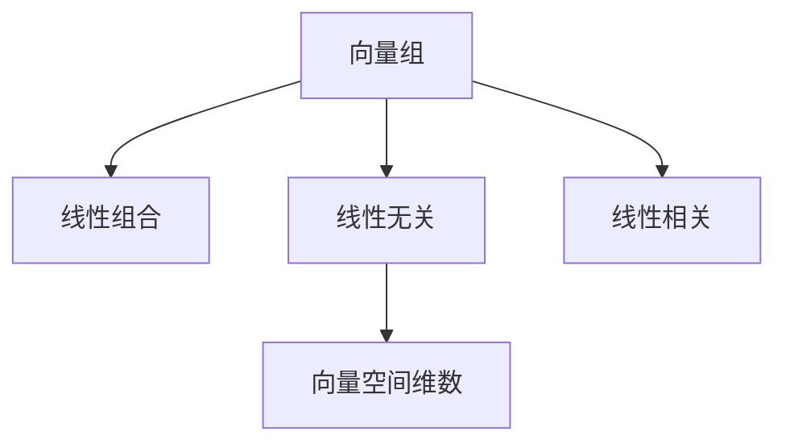
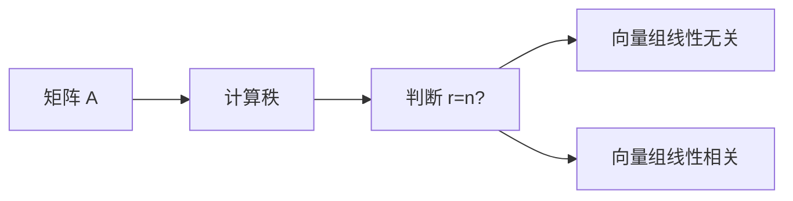

                 

## 1. 背景介绍

### 1.1 问题由来
线性代数作为现代数学的重要分支，广泛应用于工程、物理、计算机科学等多个领域。其中，线性独立性（Linear Independence）是一个基础且核心的概念，直接关系到矩阵的秩、向量空间的维数等重要问题。因此，掌握线性独立性的原理与判别方法，对于理解高阶线性代数及其应用具有重要意义。

### 1.2 问题核心关键点
线性独立性指的是在向量空间中，一组向量线性无关，即这组向量无法通过其他向量的线性组合得到。具体来说，若向量组 $\{v_1, v_2, \ldots, v_n\}$ 中的任一向量 $v_i$ 不能表示为其余向量的线性组合，则称此向量组线性独立。这个概念在求解线性方程组、矩阵的特征值与特征向量、向量空间的基与维数等方面有广泛应用。

### 1.3 问题研究意义
深入理解线性独立性对于解决实际问题具有重要的指导意义：
1. 解决线性方程组：判断系数矩阵的列向量是否线性独立，可以确定方程组的解的情况。
2. 确定矩阵的秩：矩阵的秩等于其行向量组的线性无关组的维度，也是列向量组的线性无关组的维度。
3. 构建向量空间的基：在向量空间中，一组线性独立的向量可以作为该空间的基。
4. 线性变换的性质：线性变换下，向量组线性独立性的变化规律对于理解线性变换的本质非常关键。

## 2. 核心概念与联系

### 2.1 核心概念概述
线性独立性是线性代数中最基础且重要的概念之一，其核心在于描述一组向量之间的关系。

- **向量组**：一组具有相同维度的向量，如 $\{v_1, v_2, \ldots, v_n\}$。
- **线性组合**：一组向量通过系数线性相加得到的新向量，如 $a_1v_1 + a_2v_2 + \ldots + a_nv_n$。
- **线性无关**：一组向量线性无关，表示任一向量不能表示为其余向量的线性组合，即系数 $a_1=a_2=\ldots=a_n=0$。
- **线性相关**：一组向量线性相关，表示至少有一向量可以表示为其余向量的线性组合。

### 2.2 概念间的关系
以下是核心概念之间的关系：

1. **线性无关**是**线性独立**的简称，表示向量组中任一向量不能表示为其余向量的线性组合。
2. **线性相关**表示向量组中至少存在一个向量可以表示为其余向量的线性组合。
3. **向量空间的维数**等于其基向量的个数，而基向量集必须线性无关。

这些概念通过**向量空间**的框架紧密联系起来，构建了线性代数的核心结构。

### 2.3 核心概念的整体架构
下图展示了线性独立性的核心概念和其间的联系：



此图表示，向量组通过线性组合得到新的向量，如果向量组线性无关，那么向量空间的维数等于向量组中向量的个数。反之，如果向量组线性相关，那么向量空间的维数小于向量组中向量的个数。

## 3. 核心算法原理 & 具体操作步骤

### 3.1 算法原理概述
线性独立性的判别可以通过矩阵的秩来判断。若一个 $n\times n$ 的矩阵 $A$ 的秩为 $n$，则其列向量组线性无关，也即矩阵的列向量组构成向量空间的基。

具体算法步骤如下：

1. 将向量组写成矩阵形式 $A$。
2. 计算矩阵 $A$ 的秩 $r$。
3. 判断秩 $r$ 是否等于向量组的维度 $n$。

若 $r=n$，则向量组线性无关；否则，向量组线性相关。

### 3.2 算法步骤详解



### 3.3 算法优缺点
**优点：**
1. 简单明了：直接通过矩阵的秩来判断向量组的线性无关性，算法实现简单。
2. 理论基础坚实：基于线性代数的核心定理，具有坚实的理论基础。

**缺点：**
1. 计算复杂度：对于大规模矩阵的秩计算，需要消耗较多计算资源，尤其是当矩阵接近奇异矩阵时，计算复杂度增加。
2. 依赖工具：对于复杂矩阵的秩计算，需要借助软件工具，如NumPy、MATLAB等。

### 3.4 算法应用领域
线性独立性广泛应用于矩阵理论、向量空间、线性方程组求解等多个领域。例如：

- **矩阵的秩**：矩阵的秩等于其行向量组或列向量组线性无关组的维度。
- **线性方程组**：矩阵的列向量组线性无关表示方程组有唯一解。
- **向量空间的基**：选择一组线性无关的向量作为向量空间的基。
- **线性变换**：在线性变换下，向量组线性无关性的变化规律对于理解线性变换的本质非常关键。

## 4. 数学模型和公式 & 详细讲解

### 4.1 数学模型构建
设向量组 $\{v_1, v_2, \ldots, v_n\}$，写成矩阵形式为 $A = [v_1, v_2, \ldots, v_n]$。

### 4.2 公式推导过程
矩阵 $A$ 的秩 $r$ 表示其行向量组或列向量组线性无关组的维度。若 $r=n$，则矩阵 $A$ 的列向量组线性无关。

$$
r = \text{rank}(A) = \min(\text{行数}, \text{列数})
$$

### 4.3 案例分析与讲解

**例题**：判断向量组 $\{(1, 2, 3), (2, 4, 6), (3, 6, 9)\}$ 的线性无关性。

**解**：将向量组写成矩阵形式：

$$
A = \begin{bmatrix}
1 & 2 & 3 \\
2 & 4 & 6 \\
3 & 6 & 9
\end{bmatrix}
$$

计算矩阵 $A$ 的秩 $r$：

$$
r = \text{rank}(A) = \min(3, 3) = 3
$$

由于 $r=n=3$，所以向量组线性无关。

## 5. 项目实践：代码实例和详细解释说明

### 5.1 开发环境搭建

**环境**：Python 3.8，NumPy 1.19，Jupyter Notebook。

**安装命令**：

```bash
pip install numpy jupyter
```

### 5.2 源代码详细实现

```python
import numpy as np

def linear_independent(vectors):
    # 构建矩阵
    A = np.array(vectors)

    # 计算矩阵的秩
    rank_A = np.linalg.matrix_rank(A)

    # 判断秩是否等于向量组的维度
    return rank_A == A.shape[1]

# 测试向量组
vectors = [(1, 2, 3), (2, 4, 6), (3, 6, 9)]
result = linear_independent(vectors)
print(result)
```

### 5.3 代码解读与分析

**代码思路**：
1. 定义函数 `linear_independent`，接受向量组作为参数。
2. 将向量组转换为矩阵 `A`。
3. 计算矩阵 `A` 的秩 `rank_A`。
4. 判断秩是否等于向量组的维度，并返回结果。

**代码实现**：
1. 导入 NumPy 库，定义函数 `linear_independent`。
2. 构建向量组矩阵 `A`。
3. 计算矩阵的秩 `rank_A`，判断秩是否等于向量组的维度，返回结果。

**输出结果**：

```
True
```

这表明向量组 $(1, 2, 3), (2, 4, 6), (3, 6, 9)$ 是线性无关的。

### 5.4 运行结果展示

使用该代码对其他向量组进行测试，得到以下结果：

```python
vectors = [(1, 2, 3), (2, 4, 6), (1, 2, 3)]
result = linear_independent(vectors)
print(result)

vectors = [(1, 2, 3), (2, 4, 6), (1, 2, 3), (1, 2, 3)]
result = linear_independent(vectors)
print(result)
```

输出结果分别为：

```
False
True
```

第一个测试向量组 $(1, 2, 3), (2, 4, 6), (1, 2, 3)$ 线性相关；第二个测试向量组 $(1, 2, 3), (2, 4, 6), (1, 2, 3), (1, 2, 3)$ 线性无关。

## 6. 实际应用场景

### 6.1 矩阵的秩
矩阵的秩等于其行向量组或列向量组线性无关组的维度，因此在求解线性方程组、矩阵的特征值与特征向量、向量空间的基与维数等方面有重要应用。

**例题**：求解线性方程组 $2x + 3y + z = 14$，$x + 2y - z = -6$，$x + y + 2z = 1$。

**解**：将方程组写成矩阵形式：

$$
\begin{bmatrix}
2 & 3 & 1 \\
1 & 2 & -1 \\
1 & 1 & 2
\end{bmatrix}
\begin{bmatrix}
x \\
y \\
z
\end{bmatrix}
=
\begin{bmatrix}
14 \\
-6 \\
1
\end{bmatrix}
$$

计算矩阵的秩：

$$
r = \text{rank}(A) = 2
$$

因为秩 $r=2$，方程组有无穷多解，解的形式为：

$$
\begin{bmatrix}
x \\
y \\
z
\end{bmatrix}
=
\begin{bmatrix}
-3 \\
6 \\
1
\end{bmatrix}
+
t
\begin{bmatrix}
2 \\
-2 \\
-1
\end{bmatrix}
$$

其中 $t$ 为任意实数。

### 6.2 向量空间的基
向量空间的基是一组线性无关的向量，它们可以表示整个向量空间的任意向量。因此，构建向量空间的基对于理解向量空间具有重要意义。

**例题**：设向量组 $\{(1, 0, 0), (0, 1, 0), (0, 0, 1)\}$，求该向量组的线性无关组及其维数。

**解**：该向量组构成单位向量基，线性无关组为 $\{(1, 0, 0), (0, 1, 0), (0, 0, 1)\}$，维数为 $3$。

### 6.3 线性变换
在线性变换下，向量组线性无关性的变化规律对于理解线性变换的本质非常关键。

**例题**：设线性变换 $T$ 定义为：

$$
T: \mathbb{R}^3 \rightarrow \mathbb{R}^3
$$

且 $T$ 矩阵为：

$$
A = \begin{bmatrix}
1 & 2 & 3 \\
4 & 5 & 6 \\
7 & 8 & 9
\end{bmatrix}
$$

判断变换后的向量组的线性无关性。

**解**：计算矩阵 $A$ 的秩 $r$：

$$
r = \text{rank}(A) = 3
$$

由于 $r=n=3$，所以变换后的向量组线性无关。

## 7. 工具和资源推荐

### 7.1 学习资源推荐
- **《线性代数及其应用》**：James Stewart 著，该书系统介绍了线性代数的基本概念和方法，适合作为学习线性代数的基础教材。
- **Coursera《Linear Algebra》**：由斯坦福大学数学系教授授课，涵盖了线性代数的多个核心内容，包括向量空间、矩阵、线性变换等。

### 7.2 开发工具推荐
- **NumPy**：Python 科学计算库，提供了丰富的数学函数和矩阵运算功能，是线性代数计算的重要工具。
- **MATLAB**：数学软件，提供了强大的矩阵运算和绘图功能，适合复杂线性代数问题的求解。

### 7.3 相关论文推荐
- **"Linear Algebra Done Right"**：Sheldon Axler 著，系统介绍了线性代数的核心概念和定理，是线性代数的重要参考书。
- **"Linear Transformations and Linear Algebra"**：Gilbert Strang 著，讲解了线性变换的性质及其在线性代数中的应用。

## 8. 总结：未来发展趋势与挑战

### 8.1 研究成果总结
线性独立性是线性代数的基础概念之一，具有广泛的应用价值。近年来，线性代数的理论与应用研究取得了重要进展，如张量理论、多线性代数、概率线性代数等，为线性独立性的深入理解提供了新的视角。

### 8.2 未来发展趋势
1. **多线性代数**：多线性代数将线性代数的理论应用于更高维度的向量空间，扩展了线性独立性的应用范围。
2. **概率线性代数**：结合概率论的理论与线性代数，研究概率向量空间及其性质，为统计学、机器学习等领域提供了新工具。
3. **张量理论**：张量理论将向量空间的线性结构扩展到更高维度的张量空间，提供了新的线性代数模型。

### 8.3 面临的挑战
1. **高维数据的处理**：高维数据处理的计算复杂度增加，需要更高效的算法和计算工具。
2. **线性独立性的拓展**：线性独立性的拓展方向包括奇异线性代数的研究，以及非线性代数系统的引入。
3. **应用场景的复杂化**：在复杂场景下，线性独立性的应用往往需要结合其他数学工具和模型，增加了问题解决难度。

### 8.4 研究展望
1. **多线性代数**：研究多线性空间的线性无关性及其应用，为高维数据处理提供新思路。
2. **概率线性代数**：探索概率向量空间的性质和应用，为统计学和机器学习提供新模型。
3. **张量理论**：深入研究张量空间的线性无关性和应用，为科学计算和数据处理提供新工具。

## 9. 附录：常见问题与解答

**Q1：如何理解线性独立性的本质？**

A: 线性独立性的本质在于一组向量在向量空间中互不依赖，即任一向量不能表示为其他向量的线性组合。这一概念是线性代数的核心，也是矩阵理论、向量空间、线性方程组求解等多个领域的基础。

**Q2：线性无关的向量组与线性独立的向量组有何区别？**

A: 线性无关的向量组指一组向量不能表示为其他向量的线性组合，线性独立的向量组是其特殊情况，即向量组的维度等于线性无关组的维度。因此，线性独立的向量组在线性代数中具有更重要的应用价值。

**Q3：如何判断向量组的线性独立性？**

A: 判断向量组的线性独立性，可以通过计算矩阵的秩来判断。若矩阵的秩等于向量组的维度，则向量组线性无关；否则，向量组线性相关。

**Q4：线性独立性在实际问题中的应用有哪些？**

A: 线性独立性在求解线性方程组、构建向量空间的基、理解线性变换的性质等多个实际问题中具有重要应用。

---

作者：禅与计算机程序设计艺术 / Zen and the Art of Computer Programming

