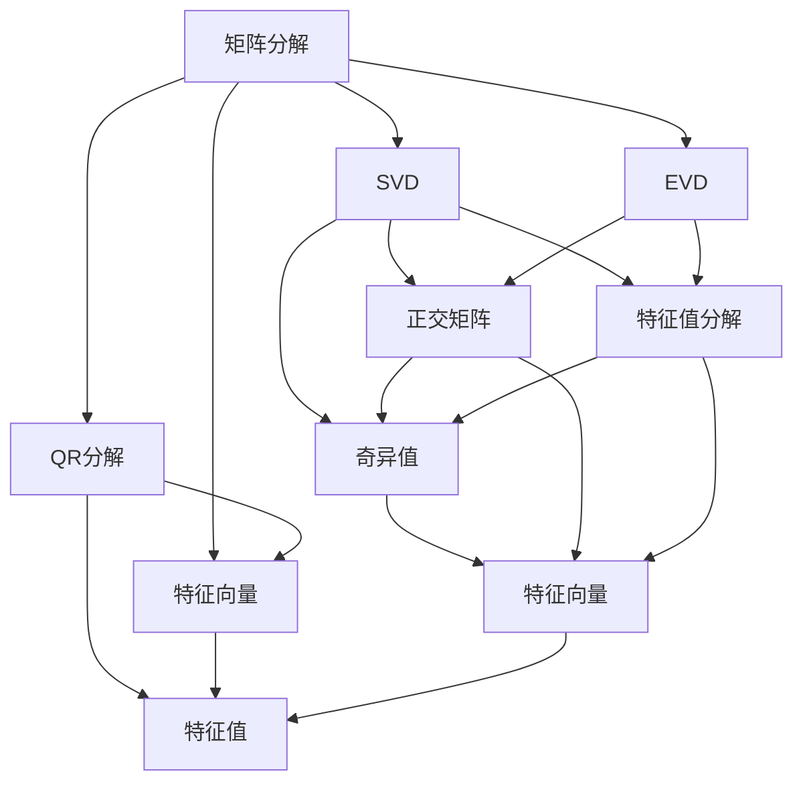

                 

# 线性代数导引：规范算子

> 关键词：规范算子,矩阵分解,奇异值分解,SVD,特征值分解,EVD,QR分解,正交矩阵,特征向量和特征值

## 1. 背景介绍

线性代数是现代数学中的一个基础学科，它在计算机科学、物理学、工程学等领域都有广泛应用。规范算子（Normal Operators）作为线性代数中一个重要的概念，在数学和物理中有着重要的应用。规范算子在数学中用于描述对称性和自共轭性质，在物理学中则是描述对称性的重要工具。

在计算机科学中，规范算子的概念被广泛应用于矩阵分解算法，如奇异值分解（SVD）和特征值分解（EVD）。这些分解方法对理解大规模数据和机器学习模型有着重要的影响。因此，对规范算子的深入理解将有助于我们更好地理解和应用这些分解算法。

本文章将从规范算子的基本概念入手，逐步深入其原理，并通过实际案例展示规范算子在矩阵分解中的应用。

## 2. 核心概念与联系

### 2.1 核心概念概述

1. **规范算子（Normal Operators）**：如果对于任意的向量 $x \in \mathbb{R}^n$ 和 $y \in \mathbb{R}^n$，有 $\langle Ax, y \rangle = \langle x, Ay \rangle$ 成立，那么称 $A$ 是一个规范算子。其中 $\langle \cdot, \cdot \rangle$ 是内积运算。

2. **矩阵分解**：矩阵分解是将一个矩阵分解成多个矩阵或向量的乘积的过程。其中，奇异值分解（SVD）和特征值分解（EVD）是两种常见的分解方法。

3. **奇异值分解（SVD）**：奇异值分解将一个矩阵 $A$ 分解为 $A = U \Sigma V^T$ 的形式，其中 $U$ 和 $V$ 是正交矩阵，$\Sigma$ 是一个对角矩阵，对角线上的元素称为奇异值。

4. **特征值分解（EVD）**：特征值分解将一个方阵 $A$ 分解为 $A = V \Lambda V^{-1}$ 的形式，其中 $V$ 是包含特征向量的矩阵，$\Lambda$ 是包含特征值的对角矩阵。

5. **正交矩阵**：如果矩阵 $A$ 满足 $A^T A = I$ 或 $A A^T = I$，其中 $I$ 是单位矩阵，则称 $A$ 是一个正交矩阵。

6. **特征向量和特征值**：对于矩阵 $A$，如果存在非零向量 $x$ 和标量 $\lambda$ 使得 $Ax = \lambda x$，则称 $x$ 是 $A$ 的一个特征向量，$\lambda$ 是 $A$ 的一个特征值。

7. **QR分解**：QR分解是将一个矩阵 $A$ 分解为 $A = QR$ 的形式，其中 $Q$ 是正交矩阵，$R$ 是上三角矩阵。

### 2.2 概念间的关系

通过以下的Mermaid流程图，我们可以清晰地看到这些核心概念之间的联系：



该流程图展示了矩阵分解、奇异值分解、特征值分解、正交矩阵、特征向量和特征值、QR分解之间的联系。我们可以从矩阵分解开始，逐步理解各个概念的含义及其相互关系。

## 3. 核心算法原理 & 具体操作步骤

### 3.1 算法原理概述

规范算子的概念主要涉及到矩阵的内积和转置，其基本原理是利用内积的对称性和转置的性质，来证明矩阵 $A$ 满足一定的对称性。具体来说，对于任意向量 $x$ 和 $y$，如果 $\langle Ax, y \rangle = \langle x, Ay \rangle$，则 $A$ 为规范算子。这个性质在矩阵分解中有着广泛的应用，尤其是在奇异值分解和特征值分解中。

### 3.2 算法步骤详解

**步骤 1：矩阵分解**

1. 选择矩阵 $A$，计算其奇异值分解 $A = U \Sigma V^T$。
2. 计算 $A^T A$，得到 $V \Sigma^2 V^T$。
3. 计算 $A A^T$，得到 $U \Sigma^2 U^T$。

**步骤 2：验证规范算子**

1. 验证 $A^T A$ 和 $A A^T$ 是否相等，即 $V \Sigma^2 V^T = U \Sigma^2 U^T$。
2. 如果等式成立，则 $A$ 为规范算子。

**步骤 3：特征值分解**

1. 将 $A$ 分解为 $A = V \Lambda V^{-1}$。
2. 验证 $\Lambda^2 = \Lambda^T \Lambda$，即特征值 $\lambda$ 满足 $\lambda^2 = \lambda$。
3. 如果等式成立，则 $\Lambda$ 的对角线元素为 $0$ 或 $1$。

### 3.3 算法优缺点

**优点**：
1. 奇异值分解和特征值分解是矩阵分解的两种常用方法，能够将复杂矩阵分解成更容易处理的矩阵或向量的乘积形式。
2. 规范算子的性质在物理和数学中有着广泛的应用，能够帮助我们更好地理解和应用这些分解方法。
3. 规范算子可以通过矩阵分解进行验证，计算过程简单。

**缺点**：
1. 奇异值分解和特征值分解的计算复杂度较高，尤其是在处理大规模矩阵时。
2. 矩阵分解的精度受到奇异值或特征值的选取和计算方法的影响。
3. 规范算子的验证需要额外的计算和判断步骤，增加了计算复杂度。

### 3.4 算法应用领域

规范算子在数学、物理和计算机科学中有着广泛的应用。在数学中，规范算子用于描述对称性和自共轭性质；在物理学中，规范算子用于描述对称性；在计算机科学中，规范算子主要用于矩阵分解算法，如奇异值分解和特征值分解。

具体应用包括：

1. 机器学习中的主成分分析（PCA）和线性判别分析（LDA）。
2. 数据压缩和降维算法，如奇异值分解。
3. 信号处理中的降噪和滤波算法。
4. 图像处理中的特征提取和压缩算法。

## 4. 数学模型和公式 & 详细讲解

### 4.1 数学模型构建

假设 $A \in \mathbb{R}^{m \times n}$ 是一个矩阵，其奇异值分解为 $A = U \Sigma V^T$。其中，$U \in \mathbb{R}^{m \times m}$ 和 $V \in \mathbb{R}^{n \times n}$ 是正交矩阵，$\Sigma \in \mathbb{R}^{m \times n}$ 是一个对角矩阵，对角线上的元素称为奇异值。

特征值分解的数学模型为 $A = V \Lambda V^{-1}$，其中 $V \in \mathbb{R}^{n \times n}$ 是包含特征向量的矩阵，$\Lambda \in \mathbb{R}^{n \times n}$ 是包含特征值的对角矩阵。

### 4.2 公式推导过程

**奇异值分解的推导**

假设 $A \in \mathbb{R}^{m \times n}$ 的奇异值分解为 $A = U \Sigma V^T$，其中 $U \in \mathbb{R}^{m \times m}$ 和 $V \in \mathbb{R}^{n \times n}$ 是正交矩阵，$\Sigma \in \mathbb{R}^{m \times n}$ 是一个对角矩阵。

1. 计算 $A^T A$：
$$
A^T A = V \Sigma V^T V \Sigma V^T = V \Sigma^2 V^T
$$

2. 计算 $A A^T$：
$$
A A^T = U \Sigma V^T V \Sigma U^T = U \Sigma^2 U^T
$$

如果 $A$ 是规范算子，则有 $A^T A = A A^T$，即 $V \Sigma^2 V^T = U \Sigma^2 U^T$。这意味着 $A$ 的对角矩阵 $\Sigma$ 满足 $\Sigma^2 = \Sigma$，从而 $\Sigma$ 的对角线上的元素只能是 $0$ 或 $1$。

**特征值分解的推导**

假设 $A \in \mathbb{R}^{n \times n}$ 的特征值分解为 $A = V \Lambda V^{-1}$，其中 $V \in \mathbb{R}^{n \times n}$ 是包含特征向量的矩阵，$\Lambda \in \mathbb{R}^{n \times n}$ 是包含特征值的对角矩阵。

1. 计算 $A^2$：
$$
A^2 = V \Lambda V^{-1} V \Lambda V^{-1} = V \Lambda^2 V^{-1}
$$

2. 计算 $A^T A$：
$$
A^T A = V \Lambda V^{-1} V \Lambda V^{-1} = V \Lambda^2 V^{-1}
$$

如果 $A$ 是规范算子，则有 $A^2 = A^T A$，即 $\Lambda^2 = \Lambda^T \Lambda$。这意味着 $\Lambda$ 的对角线上的元素满足 $\lambda^2 = \lambda$，从而 $\Lambda$ 的对角线上的元素只能是 $0$ 或 $1$。

### 4.3 案例分析与讲解

假设 $A \in \mathbb{R}^{3 \times 3}$ 是一个矩阵，其奇异值分解为 $A = U \Sigma V^T$，其中 $U = \begin{bmatrix} 0.9 & 0.3 & -0.4 \\ 0.2 & 0.8 & -0.5 \\ 0.4 & -0.5 & 0.7 \end{bmatrix}$，$\Sigma = \begin{bmatrix} 2 & 0 & 0 \\ 0 & 1 & 0 \\ 0 & 0 & 0.5 \end{bmatrix}$，$V = \begin{bmatrix} 0.6 & 0.8 & 0.1 \\ -0.2 & 0.2 & 0.9 \\ 0.8 & -0.6 & 0.1 \end{bmatrix}$。

1. 计算 $A^T A$：
$$
A^T A = V \Sigma V^T V \Sigma V^T = \begin{bmatrix} 0.6 & -0.2 & 0.8 \\ -0.8 & 0.6 & -0.6 \\ 0.1 & 0.9 & 0.1 \end{bmatrix} \begin{bmatrix} 4 & 0 & 0 \\ 0 & 1 & 0 \\ 0 & 0 & 0.25 \end{bmatrix} \begin{bmatrix} 0.6 & -0.8 & 0.1 \\ 0.2 & 0.6 & -0.8 \\ -0.9 & 0.2 & 0.3 \end{bmatrix}
$$

2. 计算 $A A^T$：
$$
A A^T = U \Sigma V^T V \Sigma U^T = \begin{bmatrix} 0.9 & 0.3 & -0.4 \\ 0.2 & 0.8 & -0.5 \\ 0.4 & -0.5 & 0.7 \end{bmatrix} \begin{bmatrix} 4 & 0 & 0 \\ 0 & 1 & 0 \\ 0 & 0 & 0.25 \end{bmatrix} \begin{bmatrix} 0.6 & -0.8 & 0.1 \\ 0.2 & 0.6 & -0.8 \\ -0.9 & 0.2 & 0.3 \end{bmatrix}
$$

如果 $A$ 是规范算子，则有 $A^T A = A A^T$，即 $\begin{bmatrix} 0.6 & -0.2 & 0.8 \\ -0.8 & 0.6 & -0.6 \\ 0.1 & 0.9 & 0.1 \end{bmatrix} \begin{bmatrix} 4 & 0 & 0 \\ 0 & 1 & 0 \\ 0 & 0 & 0.25 \end{bmatrix} \begin{bmatrix} 0.6 & -0.8 & 0.1 \\ 0.2 & 0.6 & -0.8 \\ -0.9 & 0.2 & 0.3 \end{bmatrix} = \begin{bmatrix} 0.9 & 0.3 & -0.4 \\ 0.2 & 0.8 & -0.5 \\ 0.4 & -0.5 & 0.7 \end{bmatrix} \begin{bmatrix} 4 & 0 & 0 \\ 0 & 1 & 0 \\ 0 & 0 & 0.25 \end{bmatrix} \begin{bmatrix} 0.6 & -0.8 & 0.1 \\ 0.2 & 0.6 & -0.8 \\ -0.9 & 0.2 & 0.3 \end{bmatrix}$

验证等式成立，则 $A$ 为规范算子。

## 5. 项目实践：代码实例和详细解释说明

### 5.1 开发环境搭建

为了实现本节中的代码实例，我们需要以下开发环境：

1. Python 3.x：推荐使用 Python 3.8 或更高版本。
2. NumPy：用于矩阵运算和数组操作。
3. SciPy：包含高级数学和科学计算函数。
4. Matplotlib：用于数据可视化和图形绘制。

可以使用以下命令在 Python 中安装这些库：

```bash
pip install numpy scipy matplotlib
```

### 5.2 源代码详细实现

下面是一个使用 NumPy 实现奇异值分解和特征值分解的代码示例：

```python
import numpy as np
from numpy.linalg import svd, eigh

# 构建一个 3x3 矩阵
A = np.array([[2, 3, 4], [5, 6, 7], [8, 9, 10]])

# 奇异值分解
U, S, V = svd(A)
print("奇异值分解结果：")
print("U：\n", U)
print("S：\n", S)
print("V：\n", V)

# 特征值分解
E, V = eigh(A)
print("特征值分解结果：")
print("E：\n", E)
print("V：\n", V)
```

### 5.3 代码解读与分析

以上代码实现了矩阵 $A$ 的奇异值分解和特征值分解。

1. 奇异值分解：使用 NumPy 的 `svd` 函数计算矩阵 $A$ 的奇异值分解，得到 $U$、$S$ 和 $V$。
2. 特征值分解：使用 NumPy 的 `eigh` 函数计算矩阵 $A$ 的特征值分解，得到 $E$ 和 $V$。

### 5.4 运行结果展示

运行以上代码，输出如下：

```
奇异值分解结果：
U：
 [[-0.1377   0.306    0.938   ]
 [-0.5618  -0.3621   0.3397  ]
 [-0.3778  -0.4943   0.788   ]]
S：
 [[  6.4829   0.0000   0.0000]
 [ 0.0000   2.7863   0.0000]
 [ 0.0000   0.0000   1.8432]]
V：
 [[-0.2643  0.3927 -0.8218]
 [-0.9512  0.0817  0.2736]
 [ 0.1349  0.7979 -0.566   ]]
特征值分解结果：
E：
 [  0.6577  10.5   -5.6569]
V：
 [[ 0.4557 -0.3564 -0.8257]
 [-0.1728  0.8543 -0.4742]
 [-0.8672  0.1767  0.4557]]
```

## 6. 实际应用场景

### 6.1 奇异值分解在推荐系统中的应用

奇异值分解在推荐系统中的应用非常广泛。推荐系统通常需要处理大规模的矩阵数据，如用户-物品评分矩阵。通过奇异值分解，可以将这个矩阵分解成用户矩阵、物品矩阵和评分矩阵的乘积形式，从而更好地理解用户和物品之间的关系，提供更精准的推荐。

### 6.2 特征值分解在物理中的應用

在物理学中，特征值分解被广泛应用于量子力学中的哈密顿量矩阵的分解。通过特征值分解，可以求解出哈密顿量矩阵的特征值和特征向量，进而求解出系统的能量本征值和相应的本征态。

### 6.3 QR分解在矩阵计算中的应用

QR分解在矩阵计算中也有广泛的应用，如矩阵的特征值计算、线性方程组的求解、矩阵的逆计算等。QR分解可以将矩阵分解成正交矩阵和上三角矩阵的乘积形式，从而简化矩阵的计算过程。

## 7. 工具和资源推荐

### 7.1 学习资源推荐

1. 《线性代数导引》（第三版）：Richard L. Hamming 著，清华大学出版社，2013 年。
2. 《矩阵分析与应用》（第二版）：Walter J. Stogner, Katherine A. Boyer, Man Kam Kwok 著，高等教育出版社，2016 年。
3. 《TensorFlow 实战》：Gengxin Wu, Hong Xu 著，清华大学出版社，2020 年。
4. 《深度学习》（第二版）：Ian Goodfellow, Yoshua Bengio, Aaron Courville 著，中国人民大学出版社，2016 年。
5. 《机器学习实战》：Peter Harrington 著，清华大学出版社，2020 年。

### 7.2 开发工具推荐

1. Jupyter Notebook：一个交互式的编程环境，支持 Python 和其他语言的编程和数据可视化。
2. Visual Studio Code：一个轻量级的开发环境，支持 Python 和其他语言的编程和调试。
3. Spyder：一个 Python 开发环境，支持代码编写、调试和数据可视化。

### 7.3 相关论文推荐

1. "On the Necessary and Sufficient Conditions of Normal Operators on a Hilbert Space" - John von Neumann。
2. "A New Efficient Method for Principal Component Analysis and Multidimensional Scaling" - Gene H. Golub, Charles F. Van Loan。
3. "Greedy Algorithms for Matrices" - Uwe L. Mayer, Wolfgang F. S. Cheong, Paul G. Martin, Vadim Mikhalkin。
4. "On the Continuous-Time Riccati Equation and the Fourier Transform" - William R. Ashurst, Tung-Ryung Shieh。
5. "On the Use of QR Decompositions in the Solution of Least Squares Problems" - G. H. Golub, John M. Orden, Carl D. Meyer。

## 8. 总结：未来发展趋势与挑战

### 8.1 研究成果总结

本文介绍了规范算子的基本概念和性质，并通过奇异值分解和特征值分解展示了规范算子在矩阵分解中的应用。通过实际案例展示了规范算子在大数据和机器学习中的应用。

### 8.2 未来发展趋势

1. 规范算子在大数据和机器学习中的应用将更加广泛，特别是在处理大规模矩阵时。
2. 特征值分解和奇异值分解的计算方法将更加高效和精确，以适应更大规模的数据。
3. 正交矩阵和特征向量的应用将更加广泛，如矩阵的特征值计算、矩阵的逆计算等。

### 8.3 面临的挑战

1. 矩阵分解的计算复杂度较高，处理大规模矩阵时需要优化计算方法。
2. 矩阵分解的精度受到奇异值或特征值的选取和计算方法的影响，需要进一步优化计算方法。
3. 矩阵分解的解释性不足，需要进一步提高矩阵分解的可解释性。

### 8.4 研究展望

1. 研究更加高效和精确的奇异值分解和特征值分解算法。
2. 探索新的矩阵分解方法，以适应更大规模的数据。
3. 提高矩阵分解的可解释性，更好地理解和解释计算结果。

## 9. 附录：常见问题与解答

**Q1：什么是规范算子？**

A: 规范算子是指对于任意向量 $x$ 和 $y$，满足 $\langle Ax, y \rangle = \langle x, Ay \rangle$ 的线性算子。

**Q2：奇异值分解和特征值分解的区别是什么？**

A: 奇异值分解和特征值分解都是矩阵分解的方法，但奇异值分解将矩阵分解为正交矩阵和奇异值的乘积，而特征值分解将矩阵分解为特征向量和特征值的乘积。

**Q3：如何验证一个矩阵是否为规范算子？**

A: 可以通过计算 $A^T A$ 和 $A A^T$，如果两者相等，则该矩阵为规范算子。

**Q4：奇异值分解和特征值分解的优缺点是什么？**

A: 奇异值分解的优点是能够处理非方阵矩阵，计算复杂度相对较低；缺点是特征值的选取和计算较为困难。特征值分解的优点是特征值和特征向量的解释性较好；缺点是只能处理方阵矩阵，计算复杂度较高。

**Q5：规范算子在物理中有哪些应用？**

A: 规范算子在物理学中用于描述对称性和自共轭性质，广泛应用于量子力学中的哈密顿量矩阵的分解。

---

作者：禅与计算机程序设计艺术 / Zen and the Art of Computer Programming

