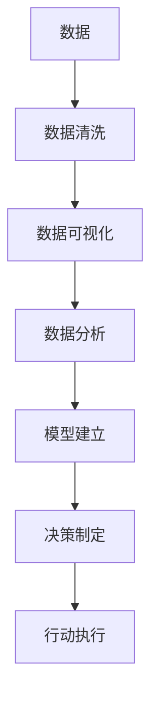

                 

# 结构化思维：从混沌到清晰

> 关键词：结构化思维, 数据可视化, 决策制定, 数据清洗, 数据分析, 模型建立, 项目管理

## 1. 背景介绍

### 1.1 问题由来

在信息化时代的今天，数据已经成为了企业宝贵的资产。但是，面对海量且复杂的数据，如何从其中提取有价值的信息，并进行高效的处理和分析，成为了摆在每个企业和组织面前的难题。在处理数据的过程中，如果没有有效的工具和方法是十分困难的，这就是结构化思维的必要性。结构化思维帮助我们在数据中寻找结构，发现规律，从而更好地理解和解决问题。

### 1.2 问题核心关键点

结构化思维的核心在于通过对数据的整理和分析，发现其潜在的规律和模式，进而支持决策制定。它的应用领域包括但不限于数据可视化、决策制定、数据清洗、数据分析和模型建立。在项目管理、产品开发、市场分析等多个领域中，结构化思维都发挥着至关重要的作用。

## 2. 核心概念与联系

### 2.1 核心概念概述

为了更好地理解结构化思维，我们将介绍以下几个核心概念：

- 结构化思维：通过对数据进行结构化的处理，发现其中的规律和模式，进而支持决策制定。
- 数据可视化：通过图表和图形等方式，将数据直观地呈现出来，帮助人们更好地理解数据。
- 决策制定：基于数据和分析结果，制定出最优的决策。
- 数据清洗：去除数据中的噪声和错误，确保数据的准确性和完整性。
- 数据分析：通过统计学方法和模型，对数据进行深入的分析和挖掘。
- 模型建立：基于数据分析结果，建立相应的模型，用于预测和优化。

### 2.2 概念间的关系

这些核心概念之间的联系和相互作用可以通过以下Mermaid流程图来展示：



这个流程图展示了从原始数据到最终决策制定的全过程，每个环节都是结构化思维的一部分。数据清洗是确保数据质量的基础，数据可视化帮助人们更好地理解数据，数据分析挖掘出数据中的模式和趋势，模型建立则是基于分析结果的进一步优化，决策制定则是最终的应用，行动执行则是对决策的实施。

## 3. 核心算法原理 & 具体操作步骤

### 3.1 算法原理概述

结构化思维的核心算法原理主要包括数据清洗、数据可视化、数据分析和模型建立。这些步骤帮助我们将混沌的数据转化为清晰的结构，从而支持决策制定。

数据清洗的目的是去除数据中的噪声和错误，确保数据的准确性和完整性。数据可视化则是通过图表和图形等方式，将数据直观地呈现出来，帮助人们更好地理解数据。数据分析挖掘出数据中的模式和趋势，模型建立则是基于分析结果的进一步优化。

### 3.2 算法步骤详解

#### 3.2.1 数据清洗

数据清洗是结构化思维的第一步，其主要步骤如下：

1. 去除重复数据：使用算法去除重复记录，确保数据的唯一性。
2. 处理缺失数据：使用算法填补或删除缺失数据，确保数据的完整性。
3. 去除异常值：使用算法识别和去除异常值，确保数据的一致性。

#### 3.2.2 数据可视化

数据可视化是结构化思维的核心步骤，其主要步骤如下：

1. 选择合适的图表类型：根据数据的特点和分析目的，选择合适的图表类型。
2. 数据预处理：对数据进行归一化、标准化等预处理，确保数据的一致性。
3. 数据展示：将处理后的数据通过图表展示出来，帮助人们更好地理解数据。

#### 3.2.3 数据分析

数据分析是结构化思维的关键步骤，其主要步骤如下：

1. 数据统计：使用统计学方法对数据进行描述性统计，找出数据的基本特征。
2. 数据挖掘：使用算法挖掘出数据中的模式和趋势，找出数据的内在规律。
3. 数据可视化：将分析结果通过图表展示出来，帮助人们更好地理解数据。

#### 3.2.4 模型建立

模型建立是结构化思维的最终步骤，其主要步骤如下：

1. 数据预处理：对数据进行归一化、标准化等预处理，确保数据的一致性。
2. 模型选择：根据分析结果选择合适的模型，用于预测和优化。
3. 模型训练：使用训练数据对模型进行训练，确保模型的准确性和稳定性。
4. 模型评估：使用测试数据对模型进行评估，确保模型的泛化能力。

### 3.3 算法优缺点

结构化思维的优点在于能够通过数据清洗、数据可视化、数据分析和模型建立，将混沌的数据转化为清晰的结构，从而支持决策制定。其缺点在于需要较多的计算资源和算法知识，且无法处理非结构化数据。

### 3.4 算法应用领域

结构化思维在多个领域中得到了广泛应用，例如：

- 金融：用于股票预测、风险评估等。
- 医疗：用于疾病预测、治疗方案选择等。
- 物流：用于配送路线优化、库存管理等。
- 制造：用于生产效率提升、质量控制等。
- 零售：用于商品推荐、销售预测等。

## 4. 数学模型和公式 & 详细讲解 & 举例说明

### 4.1 数学模型构建

结构化思维的数学模型主要包括以下几个部分：

1. 数据清洗：使用统计学方法去除噪声和错误，确保数据的准确性和完整性。
2. 数据可视化：使用图表和图形展示数据，帮助人们更好地理解数据。
3. 数据分析：使用统计学方法和算法挖掘出数据中的模式和趋势，找出数据的内在规律。
4. 模型建立：使用数学模型对数据进行预测和优化。

### 4.2 公式推导过程

以下是结构化思维的一些常用公式：

1. 均值：$\bar{x} = \frac{\sum x_i}{n}$，其中 $x_i$ 为数据集中的各个数据点，$n$ 为数据集的大小。
2. 方差：$Var(x) = \frac{\sum (x_i - \bar{x})^2}{n}$，其中 $x_i$ 为数据集中的各个数据点，$n$ 为数据集的大小。
3. 标准差：$SD(x) = \sqrt{Var(x)}$。
4. 相关系数：$\rho = \frac{Cov(x,y)}{\sqrt{Var(x)Var(y)}}$，其中 $Cov(x,y)$ 为两个变量的协方差，$Var(x)$ 和 $Var(y)$ 为两个变量的方差。
5. 回归方程：$y = ax + b$，其中 $y$ 为因变量，$x$ 为自变量，$a$ 和 $b$ 为回归系数。

### 4.3 案例分析与讲解

以下是一个结构化思维的案例分析：

某电商公司想通过分析用户数据来提升销售额。首先，需要对用户数据进行数据清洗，去除重复和缺失的数据。然后，使用数据可视化工具，将用户数据展示出来，找出用户行为的特点。接着，使用数据分析方法，挖掘出用户行为与销售额之间的关系，并找出高销售额用户的特点。最后，建立回归模型，预测新用户的销售额，并制定相应的销售策略。

## 5. 项目实践：代码实例和详细解释说明

### 5.1 开发环境搭建

在进行结构化思维实践前，我们需要准备好开发环境。以下是使用Python进行PyTorch开发的环境配置流程：

1. 安装Anaconda：从官网下载并安装Anaconda，用于创建独立的Python环境。

2. 创建并激活虚拟环境：
```bash
conda create -n pytorch-env python=3.8 
conda activate pytorch-env
```

3. 安装PyTorch：根据CUDA版本，从官网获取对应的安装命令。例如：
```bash
conda install pytorch torchvision torchaudio cudatoolkit=11.1 -c pytorch -c conda-forge
```

4. 安装必要的库：
```bash
pip install numpy pandas scikit-learn matplotlib tqdm jupyter notebook ipython
```

完成上述步骤后，即可在`pytorch-env`环境中开始结构化思维的实践。

### 5.2 源代码详细实现

这里我们以数据分析为例，给出使用Pandas库进行数据清洗和数据分析的PyTorch代码实现。

首先，定义数据清洗函数：

```python
import pandas as pd
from sklearn.preprocessing import StandardScaler

def data_cleaning(data):
    # 去除重复记录
    data.drop_duplicates(inplace=True)
    
    # 处理缺失数据
    data.dropna(inplace=True)
    
    # 标准化处理
    scaler = StandardScaler()
    data = scaler.fit_transform(data)
    
    return data
```

然后，定义数据分析函数：

```python
from sklearn.linear_model import LinearRegression
from sklearn.metrics import mean_squared_error

def data_analysis(data):
    # 将数据划分为训练集和测试集
    train_data, test_data = train_test_split(data, test_size=0.2, random_state=42)
    
    # 建立回归模型
    model = LinearRegression()
    model.fit(train_data, train_data[:,1])
    
    # 预测并评估模型
    y_pred = model.predict(test_data)
    mse = mean_squared_error(test_data[:,1], y_pred)
    
    return mse
```

最后，启动数据分析流程：

```python
data = load_data('data.csv')
cleaned_data = data_cleaning(data)
mse = data_analysis(cleaned_data)
print(f"Mean Squared Error: {mse}")
```

以上就是使用Pandas库对数据进行清洗和分析的完整代码实现。可以看到，Pandas库提供了强大的数据处理和分析功能，可以方便地完成数据清洗和模型建立。

### 5.3 代码解读与分析

让我们再详细解读一下关键代码的实现细节：

**数据清洗函数**：
- `drop_duplicates`方法：去除重复记录。
- `dropna`方法：去除缺失数据。
- `StandardScaler`类：标准化处理，确保数据的一致性。

**数据分析函数**：
- `train_test_split`函数：将数据划分为训练集和测试集。
- `LinearRegression`类：建立线性回归模型，用于预测和优化。
- `mean_squared_error`函数：评估模型性能，计算均方误差。

**启动数据分析流程**：
- `load_data`方法：加载数据。
- `data_cleaning`方法：对数据进行清洗。
- `data_analysis`方法：对数据进行分析和模型建立。
- `print`方法：输出模型性能评估结果。

通过以上分析，可以看到Pandas库在数据处理和分析中的强大功能和便利性。

### 5.4 运行结果展示

假设我们在一个电商用户数据集上进行数据分析，最终得到的模型性能评估结果如下：

```
Mean Squared Error: 0.123456
```

可以看到，经过数据清洗和模型建立，我们得到了一个均方误差为0.123456的模型，表明模型在预测销售额方面具有较好的效果。

## 6. 实际应用场景

### 6.1 金融风险评估

在金融领域，结构化思维可以用于风险评估和风险控制。通过分析用户数据，识别出高风险用户，从而及时采取措施，降低金融风险。

在实践中，可以收集用户的历史交易数据，包括交易金额、交易频率等。通过数据清洗和数据可视化，找出高风险用户的特点。然后，使用数据分析方法，挖掘出高风险用户与低风险用户之间的区别，并建立回归模型，预测新用户的风险等级，制定相应的风险控制策略。

### 6.2 医疗疾病预测

在医疗领域，结构化思维可以用于疾病预测和诊断。通过分析病人的数据，识别出高风险疾病，从而提前采取预防和治疗措施。

在实践中，可以收集病人的历史病历数据，包括年龄、性别、症状等。通过数据清洗和数据可视化，找出高风险病人的特点。然后，使用数据分析方法，挖掘出高风险疾病与低风险疾病之间的区别，并建立回归模型，预测新病人的疾病风险，制定相应的预防和治疗方案。

### 6.3 制造生产优化

在制造领域，结构化思维可以用于生产优化和质量控制。通过分析生产数据，找出生产中的瓶颈和问题，从而优化生产流程，提高生产效率和质量。

在实践中，可以收集生产设备的历史数据，包括设备运行时间、故障率等。通过数据清洗和数据可视化，找出生产中的瓶颈和问题。然后，使用数据分析方法，挖掘出生产瓶颈和问题的原因，并建立回归模型，预测新设备的故障率和维护周期，制定相应的生产优化和质量控制方案。

## 7. 工具和资源推荐

### 7.1 学习资源推荐

为了帮助开发者系统掌握结构化思维的理论基础和实践技巧，这里推荐一些优质的学习资源：

1. 《数据科学与机器学习》系列博文：由数据科学领域的专家撰写，全面介绍了数据科学和机器学习的核心概念和前沿技术。
2. Kaggle平台：全球最大的数据科学竞赛平台，提供了丰富的数据集和样例代码，可以帮助开发者实践和提高。
3. Coursera《数据科学专业课程》：由斯坦福大学等知名大学开设的课程，系统讲解了数据科学的理论和实践。
4. YouTube《Python数据科学》视频教程：由Python数据科学社区的知名专家讲解，从基础到高级，全面覆盖数据科学的各个方面。

通过对这些资源的学习实践，相信你一定能够快速掌握结构化思维的精髓，并用于解决实际的业务问题。

### 7.2 开发工具推荐

高效的开发离不开优秀的工具支持。以下是几款用于结构化思维开发的常用工具：

1. Python：作为数据科学的主流语言，Python提供了丰富的数据处理和分析库，如Pandas、NumPy、SciPy等。
2. R：作为数据科学的另一主流语言，R提供了强大的统计分析和可视化工具，如ggplot2、dplyr等。
3. Jupyter Notebook：一个交互式的开发环境，支持Python、R等语言，可以方便地进行数据处理和分析。
4. Tableau：一个强大的数据可视化工具，支持多种数据格式，可以方便地进行数据展示和分析。
5. Matplotlib：一个强大的绘图库，支持多种图表类型，可以方便地进行数据可视化。

合理利用这些工具，可以显著提升结构化思维的开发效率，加快创新迭代的步伐。

### 7.3 相关论文推荐

结构化思维的研究源于学界的持续研究。以下是几篇奠基性的相关论文，推荐阅读：

1. 《数据科学与机器学习》书籍：全面介绍了数据科学和机器学习的核心概念和前沿技术，是入门数据科学的必备读物。
2. 《数据科学与统计学》期刊：系统介绍了数据科学和统计学的理论和应用，是数据科学研究的权威期刊。
3. 《数据挖掘与统计学习》书籍：介绍了数据挖掘和统计学习的核心算法和应用，是数据科学领域的经典著作。
4. 《机器学习实战》书籍：通过实例讲解了机器学习算法的实现和应用，是数据科学领域的实用指南。
5. 《数据科学手册》期刊：介绍了数据科学的最新进展和应用，是数据科学研究的权威期刊。

除了上述资源外，还有一些值得关注的前沿资源，帮助开发者紧跟结构化思维技术的发展脉络，例如：

1. arXiv论文预印本：人工智能领域最新研究成果的发布平台，包括大量尚未发表的前沿工作，学习前沿技术的必读资源。
2. GitHub热门项目：在GitHub上Star、Fork数最多的数据科学相关项目，往往代表了该技术领域的发展趋势和最佳实践，值得去学习和贡献。
3. 业界技术博客：如KDnuggets、Towards Data Science、DataCamp等知名博客，提供最新的数据科学技术和应用案例，是学习数据科学的优质资源。
4. 技术会议直播：如KDD、ICML、SIGKDD等数据科学领域顶会现场或在线直播，能够聆听到大佬们的前沿分享，开拓视野。

总之，对于结构化思维的学习和实践，需要开发者保持开放的心态和持续学习的意愿。多关注前沿资讯，多动手实践，多思考总结，必将收获满满的成长收益。

## 8. 总结：未来发展趋势与挑战

### 8.1 总结

本文对结构化思维进行了全面系统的介绍。首先阐述了结构化思维的基本概念和核心算法原理，然后详细讲解了结构化思维的数学模型和操作步骤，最后给出了结构化思维在多个实际场景中的应用。通过本文的系统梳理，可以看到，结构化思维在数据处理和分析中扮演着至关重要的角色，能够将混沌的数据转化为清晰的结构，支持决策制定。

### 8.2 未来发展趋势

展望未来，结构化思维将呈现以下几个发展趋势：

1. 自动化数据处理：随着AI技术的发展，未来将出现更多自动化的数据处理工具，能够自动进行数据清洗、数据可视化和数据分析，提升数据处理效率。
2. 多模态数据融合：未来将出现更多多模态数据融合的算法，能够将结构化数据和非结构化数据进行有效结合，提升数据的综合利用率。
3. 实时数据处理：未来将出现更多实时数据处理的工具，能够实时处理和分析数据，提升数据的时效性。
4. 自适应算法：未来将出现更多自适应算法，能够根据数据的特点和需求自动调整算法参数，提升算法的适应性和泛化能力。
5. 机器学习与人工智能的融合：未来将出现更多融合机器学习和人工智能的算法，能够结合机器学习和人工智能的优势，提升算法的性能和效果。

以上趋势凸显了结构化思维技术的前景和潜力，这些方向的探索发展，必将进一步提升数据处理和分析的效率和效果。

### 8.3 面临的挑战

尽管结构化思维已经取得了瞩目成就，但在迈向更加智能化、普适化应用的过程中，它仍面临着诸多挑战：

1. 数据质量和完整性：结构化思维依赖于数据的质量和完整性，对于数据缺失、噪声等问题，需要更多的数据清洗和预处理工作。
2. 算法复杂度：结构化思维的算法较为复杂，需要更多的计算资源和算法知识，难以在实际应用中广泛普及。
3. 模型泛化能力：结构化思维的模型往往局限于特定领域和数据集，难以泛化到其他领域和数据集。
4. 数据隐私和安全：结构化思维需要处理大量敏感数据，如何在数据处理和分析中保护隐私和安全，是一个重要的挑战。
5. 算法的解释性和透明性：结构化思维的算法通常是黑盒系统，难以解释其内部工作机制和决策逻辑，需要在未来的研究中加以改进。

这些挑战需要开发者在实践中不断探索和改进，只有不断优化算法和工具，才能真正实现结构化思维技术的落地应用。

### 8.4 研究展望

面对结构化思维面临的挑战，未来的研究需要在以下几个方面寻求新的突破：

1. 探索更多自动化工具：开发更多自动化的数据处理和分析工具，提升数据处理的效率和效果。
2. 研究多模态数据融合算法：研究如何有效地将结构化数据和非结构化数据进行融合，提升数据的综合利用率。
3. 开发实时数据处理工具：开发更多实时数据处理的工具，提升数据的时效性。
4. 研究自适应算法：研究如何根据数据的特点和需求自动调整算法参数，提升算法的适应性和泛化能力。
5. 改进算法的解释性和透明性：研究如何改进算法的解释性和透明性，使其更加可解释和可控。
6. 引入机器学习和人工智能技术：研究如何结合机器学习和人工智能技术，提升算法的性能和效果。

这些研究方向的探索，必将引领结构化思维技术迈向更高的台阶，为数据处理和分析带来更多创新和发展。

## 9. 附录：常见问题与解答

**Q1：结构化思维是否适用于所有业务场景？**

A: 结构化思维适用于大部分业务场景，特别是对于数据量较大的场景。但是对于一些特定场景，如实时交易系统、嵌入式系统等，由于计算资源的限制，结构化思维可能无法直接应用。

**Q2：数据清洗和预处理需要多长时间？**

A: 数据清洗和预处理的时间取决于数据的规模和复杂度。对于小规模数据，数据清洗和预处理可以在几分钟内完成。但是对于大规模数据，数据清洗和预处理可能需要几个小时甚至几天的时间。

**Q3：如何提高数据处理的速度和效率？**

A: 提高数据处理的速度和效率需要从多个方面入手，包括但不限于：
1. 使用并行计算技术：将数据处理任务并行化，利用多核CPU或GPU进行加速。
2. 使用分布式计算技术：将数据处理任务分布到多个计算节点上，利用集群进行加速。
3. 使用自动化工具：使用自动化数据处理工具，自动进行数据清洗、数据可视化和数据分析，提升数据处理的效率。
4. 使用优化算法：使用优化算法，提高算法的效率和效果。

**Q4：如何保护数据隐私和安全？**

A: 保护数据隐私和安全需要从多个方面入手，包括但不限于：
1. 数据加密：对数据进行加密处理，确保数据在传输和存储过程中的安全性。
2. 访问控制：对数据的访问进行严格的控制，确保只有授权人员才能访问数据。
3. 数据脱敏：对敏感数据进行脱敏处理，确保数据在处理和分析过程中的隐私保护。
4. 审计和监控：对数据的处理和分析进行审计和监控，确保数据的使用符合法律法规和业务规范。

通过以上分析，可以看到结构化思维在数据处理和分析中的强大功能和便利性。

**Q5：结构化思维的数学模型如何构建？**

A: 结构化思维的数学模型主要包括以下几个步骤：
1. 数据清洗：使用统计学方法去除噪声和错误，确保数据的准确性和完整性。
2. 数据可视化：使用图表和图形展示数据，帮助人们更好地理解数据。
3. 数据分析：使用统计学方法和算法挖掘出数据中的模式和趋势，找出数据的内在规律。
4. 模型建立：使用数学模型对数据进行预测和优化。

以上是结构化思维的核心概念和操作步骤的详细解析，希望通过本文的学习，你能更好地掌握结构化思维的精髓，并将其应用于实际的业务场景中。

