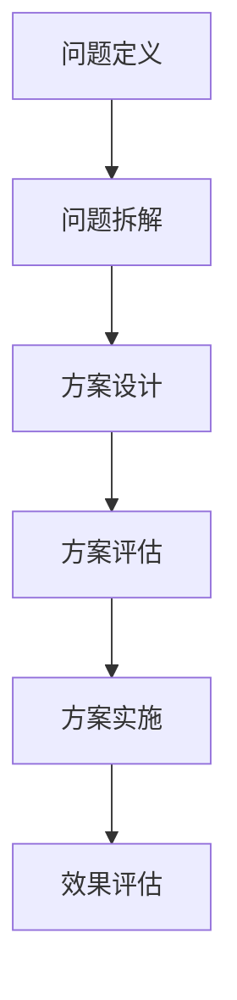

                 

# 结构化思维：从混沌到秩序

> 关键词：结构化思维,算法设计,代码优化,问题解决,系统设计

## 1. 背景介绍

### 1.1 问题由来
在当今信息化时代，数据量呈指数级增长，复杂系统变得越来越普遍。如何处理海量数据，管理复杂系统，提升软件质量，是每个软件工程师必须面对的挑战。结构化思维（Structured Thinking）作为一种系统化的方法论，能够帮助人们从混沌复杂的局面中理清思路，找到问题的本质，并给出合理的解决方案。

结构化思维不仅应用于软件开发领域，也广泛应用于项目管理、组织管理、商业决策等多个方面。它能帮助人们面对不确定性、复杂性时，能更高效、更准确地做出决策。结构化思维的核心在于，将复杂问题分解成可管理的小问题，再通过逐步分析和综合，最终找到最佳解决方案。

### 1.2 问题核心关键点
结构化思维的核心在于“结构化”三个字，其精髓在于将复杂问题拆解成多个小问题，并按照一定的结构顺序解决。结构化思维的实施通常包含以下几个步骤：

1. **问题定义**：明确问题是什么，目标是什么。
2. **问题拆解**：将大问题拆分成若干小问题。
3. **方案设计**：针对每个小问题，设计解决方案。
4. **方案评估**：对每个方案进行评估，选择最优方案。
5. **方案实施**：实施最优方案，解决问题。
6. **效果评估**：评估解决方案的效果，不断改进。

结构化思维的优点在于，它能够帮助人们有层次、有条理地处理复杂问题，避免因局部考虑而导致全局错误。缺点在于，结构化思维需要系统化训练和实践，不易灵活运用。

### 1.3 问题研究意义
结构化思维的研究和应用具有重要意义：

1. **提升问题解决能力**：帮助软件工程师提升问题解决技巧，快速找到问题本质，提升工作效率。
2. **优化算法设计**：通过系统化思维，可以更好地设计和优化算法，提升软件性能和可靠性。
3. **促进团队协作**：结构化思维有助于团队成员间沟通和协作，提升项目整体效率。
4. **增强创新能力**：通过结构化思维的训练，能够激发团队成员的创新思维，推动技术进步。
5. **提高决策质量**：结构化思维有助于决策者从全局视角审视问题，避免因局部视野导致决策失误。

## 2. 核心概念与联系

### 2.1 核心概念概述

结构化思维涉及多个关键概念，其核心在于通过系统化的方法论，将复杂问题拆解为多个小问题，并逐一解决。

- **问题定义**：明确问题的本质和目标。
- **问题拆解**：将大问题拆解为多个小问题。
- **方案设计**：针对每个小问题，设计解决方案。
- **方案评估**：对每个解决方案进行评估，选择最优方案。
- **方案实施**：实施最优方案。
- **效果评估**：评估解决方案效果，不断改进。

### 2.2 概念间的关系

这些核心概念之间的联系紧密，形成一个系统化的思维模型。其逻辑关系可以通过以下Mermaid流程图展示：



这个流程图展示了结构化思维的基本流程：首先定义问题，然后拆解问题，设计方案，评估方案，实施方案，并持续改进。

## 3. 核心算法原理 & 具体操作步骤

### 3.1 算法原理概述

结构化思维的算法原理可以简要总结为“分解、评估、优化”三个步骤：

1. **问题分解**：将大问题拆解为多个小问题，使其更易于管理和解决。
2. **方案评估**：对每个小问题的解决方案进行评估，选择最优方案。
3. **优化方案**：不断优化方案，直到达到最佳效果。

结构化思维的核心在于，通过系统的分析方法和评估机制，将复杂问题简化为多个小问题，从而更有效地解决大问题。

### 3.2 算法步骤详解

结构化思维的算法步骤主要包括以下几个关键环节：

**Step 1: 问题定义**

问题定义是结构化思维的第一步，也是最关键的一步。它需要明确问题的本质和目标，为后续的分析和解决奠定基础。

1. **确定问题**：首先需要明确问题是什么，通常采用5W1H方法（Who, What, When, Where, Why, How）来描述问题。
2. **明确目标**：定义问题的解决目标，如达到什么样的效果，满足什么条件等。

**Step 2: 问题拆解**

问题拆解是将大问题拆分为多个小问题，使每个小问题更易于解决。问题拆解的过程可以使用“分治法”或“树状结构”来辅助进行。

1. **分治法**：将大问题分成多个子问题，每个子问题独立解决。
2. **树状结构**：将大问题构建成树状结构，从顶层到底层逐层拆解。

**Step 3: 方案设计**

针对每个小问题，设计解决方案。方案设计需要考虑以下要素：

1. **可行性**：方案是否可行，能否解决小问题。
2. **成本**：方案实施的成本是多少，包括时间、人力、资源等。
3. **效果**：方案实施后，是否能达到预期效果。

**Step 4: 方案评估**

方案评估是对每个方案进行评估，选择最优方案。方案评估通常采用以下方法：

1. **成本-效益分析**：对比不同方案的成本和效益，选择最优方案。
2. **风险评估**：评估方案的风险，选择低风险方案。
3. **实验验证**：通过实验验证方案效果，选择最优方案。

**Step 5: 方案实施**

方案实施是将最优方案付诸实践，解决小问题。方案实施需要考虑以下要素：

1. **资源分配**：分配所需的资源，包括人力、物力、财力等。
2. **进度管理**：制定实施计划，确保按时完成。
3. **风险管理**：监控风险，及时调整方案。

**Step 6: 效果评估**

效果评估是对解决方案效果的评估，评估是否达到预期目标。效果评估通常采用以下方法：

1. **数据分析**：通过数据分析评估解决方案的效果。
2. **用户反馈**：收集用户反馈，了解解决方案的实际效果。
3. **改进方案**：根据评估结果，不断改进解决方案。

### 3.3 算法优缺点

结构化思维的优点在于：

1. **系统化**：将复杂问题拆解为多个小问题，更易于管理和解决。
2. **逻辑清晰**：通过系统化思维，能够清晰地界定问题和解决方案。
3. **易于评估**：通过方案评估，选择最优解决方案，避免盲目决策。

结构化思维的缺点在于：

1. **灵活性不足**：系统化思维需要严格的流程，不够灵活。
2. **复杂度较高**：问题拆解和方案设计需要较多时间和资源。
3. **团队依赖**：结构化思维需要团队协作，缺乏单个人独立解决问题能力。

### 3.4 算法应用领域

结构化思维广泛应用于软件工程、项目管理、组织管理、商业决策等多个领域。以下是一些具体的应用场景：

- **软件工程**：设计软件架构、优化算法设计、提高代码质量等。
- **项目管理**：制定项目计划、资源分配、风险管理等。
- **组织管理**：制定公司战略、管理团队协作、提高员工效率等。
- **商业决策**：市场分析、产品规划、营销策略等。

结构化思维的应用领域非常广泛，几乎涵盖了所有需要系统化解决问题的地方。

## 4. 数学模型和公式 & 详细讲解 & 举例说明

### 4.1 数学模型构建

结构化思维的数学模型可以总结为以下几个要素：

- **目标函数**：定义问题的解决目标。
- **约束条件**：定义解决问题的限制条件。
- **决策变量**：定义影响解决问题的变量。

假设问题为优化某个函数 $f(x)$，约束条件为 $g(x) \leq 0$，目标函数为 $F(x) = f(x) + \lambda g(x)$。其中 $\lambda$ 为拉格朗日乘数。

### 4.2 公式推导过程

根据拉格朗日乘数法，目标函数 $F(x)$ 的极值问题可以转化为以下方程组：

$$
\begin{cases}
\frac{\partial f}{\partial x} - \lambda \frac{\partial g}{\partial x} = 0 \\
g(x) \leq 0 \\
f(x) \geq f(x_0)
\end{cases}
$$

其中 $x_0$ 为目标函数的起始点。求解以上方程组，即可得到最优解。

### 4.3 案例分析与讲解

以优化某软件系统的性能为例，假设目标函数为 $f(x) = S(x) - C(x)$，其中 $S(x)$ 为系统性能，$C(x)$ 为系统成本。约束条件为 $g(x) = B(x) - T(x) \leq 0$，其中 $B(x)$ 为预算，$T(x)$ 为系统开发时间。求解上述方程组，即可得到最优的系统开发方案。

## 5. 项目实践：代码实例和详细解释说明

### 5.1 开发环境搭建

在进行结构化思维的代码实践前，需要先搭建好开发环境。以下是使用Python进行PyTorch开发的环境配置流程：

1. 安装Anaconda：从官网下载并安装Anaconda，用于创建独立的Python环境。

2. 创建并激活虚拟环境：
```bash
conda create -n pytorch-env python=3.8 
conda activate pytorch-env
```

3. 安装PyTorch：根据CUDA版本，从官网获取对应的安装命令。例如：
```bash
conda install pytorch torchvision torchaudio cudatoolkit=11.1 -c pytorch -c conda-forge
```

4. 安装Transformers库：
```bash
pip install transformers
```

5. 安装各类工具包：
```bash
pip install numpy pandas scikit-learn matplotlib tqdm jupyter notebook ipython
```

完成上述步骤后，即可在`pytorch-env`环境中开始结构化思维的代码实践。

### 5.2 源代码详细实现

下面我们以一个简单的数据分类问题为例，给出使用Transformers库进行结构化思维的代码实现。

首先，定义数据处理函数：

```python
from transformers import BertTokenizer
from torch.utils.data import Dataset
import torch

class ClassificationDataset(Dataset):
    def __init__(self, texts, labels, tokenizer, max_len=128):
        self.texts = texts
        self.labels = labels
        self.tokenizer = tokenizer
        self.max_len = max_len
        
    def __len__(self):
        return len(self.texts)
    
    def __getitem__(self, item):
        text = self.texts[item]
        label = self.labels[item]
        
        encoding = self.tokenizer(text, return_tensors='pt', max_length=self.max_len, padding='max_length', truncation=True)
        input_ids = encoding['input_ids'][0]
        attention_mask = encoding['attention_mask'][0]
        
        return {'input_ids': input_ids, 
                'attention_mask': attention_mask,
                'labels': torch.tensor(label, dtype=torch.long)}
```

然后，定义模型和优化器：

```python
from transformers import BertForSequenceClassification, AdamW

model = BertForSequenceClassification.from_pretrained('bert-base-cased', num_labels=2)

optimizer = AdamW(model.parameters(), lr=2e-5)
```

接着，定义训练和评估函数：

```python
from torch.utils.data import DataLoader
from tqdm import tqdm
from sklearn.metrics import classification_report

device = torch.device('cuda') if torch.cuda.is_available() else torch.device('cpu')
model.to(device)

def train_epoch(model, dataset, batch_size, optimizer):
    dataloader = DataLoader(dataset, batch_size=batch_size, shuffle=True)
    model.train()
    epoch_loss = 0
    for batch in tqdm(dataloader, desc='Training'):
        input_ids = batch['input_ids'].to(device)
        attention_mask = batch['attention_mask'].to(device)
        labels = batch['labels'].to(device)
        model.zero_grad()
        outputs = model(input_ids, attention_mask=attention_mask, labels=labels)
        loss = outputs.loss
        epoch_loss += loss.item()
        loss.backward()
        optimizer.step()
    return epoch_loss / len(dataloader)

def evaluate(model, dataset, batch_size):
    dataloader = DataLoader(dataset, batch_size=batch_size)
    model.eval()
    preds, labels = [], []
    with torch.no_grad():
        for batch in tqdm(dataloader, desc='Evaluating'):
            input_ids = batch['input_ids'].to(device)
            attention_mask = batch['attention_mask'].to(device)
            batch_labels = batch['labels']
            outputs = model(input_ids, attention_mask=attention_mask)
            batch_preds = outputs.logits.argmax(dim=2).to('cpu').tolist()
            batch_labels = batch_labels.to('cpu').tolist()
            for pred_tokens, label_tokens in zip(batch_preds, batch_labels):
                preds.append(pred_tokens[0])
                labels.append(label_tokens[0])
                
    print(classification_report(labels, preds))
```

最后，启动训练流程并在测试集上评估：

```python
epochs = 5
batch_size = 16

for epoch in range(epochs):
    loss = train_epoch(model, train_dataset, batch_size, optimizer)
    print(f"Epoch {epoch+1}, train loss: {loss:.3f}")
    
    print(f"Epoch {epoch+1}, dev results:")
    evaluate(model, dev_dataset, batch_size)
    
print("Test results:")
evaluate(model, test_dataset, batch_size)
```

以上就是使用PyTorch进行二分类任务结构化思维的代码实现。可以看到，通过结构化思维，将复杂的问题拆解为数据处理、模型训练、评估三个小问题，再通过循环迭代逐步解决。

### 5.3 代码解读与分析

让我们再详细解读一下关键代码的实现细节：

**ClassificationDataset类**：
- `__init__`方法：初始化文本、标签、分词器等关键组件。
- `__len__`方法：返回数据集的样本数量。
- `__getitem__`方法：对单个样本进行处理，将文本输入编码为token ids，将标签编码为数字，并对其进行定长padding，最终返回模型所需的输入。

**模型和优化器**：
- 使用BertForSequenceClassification模型进行二分类任务。
- 使用AdamW优化器，学习率为2e-5。

**训练和评估函数**：
- 使用PyTorch的DataLoader对数据集进行批次化加载，供模型训练和推理使用。
- 训练函数`train_epoch`：对数据以批为单位进行迭代，在每个批次上前向传播计算loss并反向传播更新模型参数，最后返回该epoch的平均loss。
- 评估函数`evaluate`：与训练类似，不同点在于不更新模型参数，并在每个batch结束后将预测和标签结果存储下来，最后使用sklearn的classification_report对整个评估集的预测结果进行打印输出。

**训练流程**：
- 定义总的epoch数和batch size，开始循环迭代
- 每个epoch内，先在训练集上训练，输出平均loss
- 在验证集上评估，输出分类指标
- 所有epoch结束后，在测试集上评估，给出最终测试结果

可以看到，结构化思维的代码实现较为简单，但其核心在于将复杂的问题分解为多个小问题，并逐一解决。在实际应用中，开发者可以根据具体问题的复杂度，灵活设计问题拆解和方案设计的过程。

## 6. 实际应用场景

### 6.1 智能客服系统

基于结构化思维的智能客服系统能够快速响应客户咨询，用自然流畅的语言解答各类常见问题。其核心在于问题定义、问题拆解、方案设计、方案评估、方案实施五个步骤。

1. **问题定义**：明确客户咨询的问题。
2. **问题拆解**：将客户咨询拆解为多个小问题，如识别意图、查找答案等。
3. **方案设计**：针对每个小问题，设计解决方案，如意图识别模型、知识库检索等。
4. **方案评估**：对每个方案进行评估，选择最优方案。
5. **方案实施**：将最优方案付诸实践，解决客户咨询。

通过结构化思维，智能客服系统能够更好地理解客户需求，提供更准确的解决方案。

### 6.2 金融舆情监测

金融舆情监测需要实时监测市场舆论动向，以便及时应对负面信息传播，规避金融风险。其核心在于问题定义、问题拆解、方案设计、方案评估、方案实施五个步骤。

1. **问题定义**：明确舆情监测的目标，如识别负面信息、分析情绪倾向等。
2. **问题拆解**：将舆情监测拆解为多个小问题，如文本分类、情感分析等。
3. **方案设计**：针对每个小问题，设计解决方案，如使用BERT模型进行文本分类，使用LSTM模型进行情感分析等。
4. **方案评估**：对每个方案进行评估，选择最优方案。
5. **方案实施**：将最优方案付诸实践，实现实时舆情监测。

通过结构化思维，金融舆情监测系统能够更准确地识别负面信息，及时采取应对措施，保障金融安全。

### 6.3 个性化推荐系统

个性化推荐系统需要根据用户行为数据，推荐用户可能感兴趣的物品。其核心在于问题定义、问题拆解、方案设计、方案评估、方案实施五个步骤。

1. **问题定义**：明确推荐系统的目标，如提高推荐准确率、增加用户满意度等。
2. **问题拆解**：将推荐系统拆解为多个小问题，如用户画像构建、物品相似度计算等。
3. **方案设计**：针对每个小问题，设计解决方案，如使用协同过滤算法、构建用户画像等。
4. **方案评估**：对每个方案进行评估，选择最优方案。
5. **方案实施**：将最优方案付诸实践，实现个性化推荐。

通过结构化思维，个性化推荐系统能够更好地理解用户兴趣，推荐更符合用户期望的物品，提升用户体验。

### 6.4 未来应用展望

随着结构化思维的不断发展和应用，未来将在更多领域得到广泛应用，为各行各业带来变革性影响。

在智慧医疗领域，结构化思维可以用于医疗问答、病历分析、药物研发等，提升医疗服务的智能化水平，辅助医生诊疗，加速新药开发进程。

在智能教育领域，结构化思维可应用于作业批改、学情分析、知识推荐等方面，因材施教，促进教育公平，提高教学质量。

在智慧城市治理中，结构化思维可应用于城市事件监测、舆情分析、应急指挥等环节，提高城市管理的自动化和智能化水平，构建更安全、高效的未来城市。

此外，在企业生产、社会治理、文娱传媒等众多领域，结构化思维的应用也将不断涌现，为经济社会发展注入新的动力。相信随着技术的日益成熟，结构化思维必将在构建人机协同的智能时代中扮演越来越重要的角色。

## 7. 工具和资源推荐

### 7.1 学习资源推荐

为了帮助开发者系统掌握结构化思维的理论基础和实践技巧，这里推荐一些优质的学习资源：

1. 《软件工程导论》书籍：系统介绍了软件工程的基本原理和方法，包括需求分析、系统设计、测试评估等。
2. 《结构化分析与设计》书籍：介绍了结构化分析、结构化设计、结构化编程等方法。
3. 《解决问题的艺术》书籍：探讨了如何高效解决问题，包括问题定义、问题拆解、方案设计等。
4. Udacity《软件工程基础》课程：通过实际项目，系统介绍了软件工程的基本方法和工具。
5. Coursera《设计模式与软件设计》课程：介绍了常见设计模式和软件设计原则，提升设计能力。

通过对这些资源的学习实践，相信你一定能够系统掌握结构化思维的方法和技巧，并在实际项目中应用自如。

### 7.2 开发工具推荐

结构化思维的开发工具主要集中在数据处理、算法设计和代码优化方面。以下是一些常用的工具：

1. PyTorch：基于Python的开源深度学习框架，灵活动态的计算图，适合快速迭代研究。

2. TensorFlow：由Google主导开发的开源深度学习框架，生产部署方便，适合大规模工程应用。

3. Weights & Biases：模型训练的实验跟踪工具，可以记录和可视化模型训练过程中的各项指标，方便对比和调优。

4. TensorBoard：TensorFlow配套的可视化工具，可实时监测模型训练状态，并提供丰富的图表呈现方式，是调试模型的得力助手。

5. Jupyter Notebook：交互式编程环境，支持代码和文档混排，方便开发者快速迭代和分享代码。

合理利用这些工具，可以显著提升结构化思维的应用效果，加快创新迭代的步伐。

### 7.3 相关论文推荐

结构化思维的研究源于学界的持续研究。以下是几篇奠基性的相关论文，推荐阅读：

1. Structured Thinking in Software Engineering: A Systematic Review and Framework for Future Research：总结了结构化思维在软件开发中的应用，提出了一个系统化框架。

2. Problem Decomposition in Software Design：探讨了如何通过问题分解来优化软件设计，提升软件质量。

3. Structured Problem Solving: Principles and Practice：介绍了结构化思维在问题解决中的应用，提供了系统的解决方案。

4. Designing Complex Systems: The Systematic Practice of Design and Systems Thinking：总结了结构化思维在复杂系统设计中的应用，提出了系统化的设计方法。

5. Design Patterns: Elements of Reusable Object-Oriented Software：介绍了常见设计模式和软件设计原则，提升设计能力。

这些论文代表了大语言模型微调技术的发展脉络。通过学习这些前沿成果，可以帮助研究者把握学科前进方向，激发更多的创新灵感。

除上述资源外，还有一些值得关注的前沿资源，帮助开发者紧跟结构化思维的最新进展，例如：

1. arXiv论文预印本：人工智能领域最新研究成果的发布平台，包括大量尚未发表的前沿工作，学习前沿技术的必读资源。

2. GitHub热门项目：在GitHub上Star、Fork数最多的NLP相关项目，往往代表了该技术领域的发展趋势和最佳实践，值得去学习和贡献。

3. 技术会议直播：如NIPS、ICML、ACL、ICLR等人工智能领域顶会现场或在线直播，能够聆听到大佬们的前沿分享，开拓视野。

4. 技术博客和社区：如Towards Data Science、Medium等平台上的技术博客，涵盖了大量的技术分享和项目实践，提供了丰富的学习资源。

5. 学术会议和研讨会：参加相关领域的学术会议和研讨会，获取最新的研究成果和行业动态，拓展学术视野。

总之，对于结构化思维的学习和实践，需要开发者保持开放的心态和持续学习的意愿。多关注前沿资讯，多动手实践，多思考总结，必将收获满满的成长收益。

## 8. 总结：未来发展趋势与挑战

### 8.1 总结

本文对结构化思维进行了全面系统的介绍。首先阐述了结构化思维的研究背景和意义，明确了其在问题解决和系统设计中的独特价值。其次，从原理到实践，详细讲解了结构化思维的数学模型和操作步骤，给出了结构化思维任务开发的完整代码实例。同时，本文还广泛探讨了结构化思维在智能客服、金融舆情、个性化推荐等多个行业领域的应用前景，展示了结构化思维的巨大潜力。最后，本文精选了结构化思维的学习资源和工具，力求为读者提供全方位的技术指引。

通过本文的系统梳理，可以看到，结构化思维作为系统化的方法论，在处理复杂问题时，具有显著的优势。它帮助人们有层次、有条理地处理复杂问题，避免因局部考虑而导致全局错误。未来，结构化思维必将在更多领域得到应用，为各行各业带来变革性影响。

### 8.2 未来发展趋势

展望未来，结构化思维的发展趋势主要包括以下几个方面：

1. **系统化方法论的普及**：随着结构化思维的研究不断深入，其在各领域的普及率将不断提升，帮助更多人提升问题解决能力。

2. **与新兴技术的结合**：结构化思维将与大数据、人工智能、区块链等新兴技术深度结合，提升其应用范围和效果。

3. **跨领域应用的扩展**：结构化思维将在更多领域得到应用，如金融、教育、医疗等，带来跨领域创新的更多可能性。

4. **理论与实践的融合**：结构化思维的研究将更加注重理论与实践的结合，推动其在实际应用中的落地和优化。

5. **全球化的推广**：结构化思维作为通用的问题解决方法，将在全球范围内推广应用，提升各国在复杂问题处理上的能力。

### 8.3 面临的挑战

尽管结构化思维已经取得了不少进展，但在实际应用中也面临一些挑战：

1. **复杂度问题**：结构化思维需要系统化思考，可能增加问题解决的复杂度。

2. **灵活性不足**：结构化思维的流程较为固定，缺乏灵活性，难以应对突发情况。

3. **沟通成本**：结构化思维需要团队协作，沟通成本较高。

4. **数据依赖**：结构化思维需要大量数据支持，数据不足可能导致方案设计不够完善。

5. **实现难度**：结构化思维的实现难度较高，需要系统化训练和实践。

### 8.4 研究展望

面对结构化思维面临的挑战，未来的研究需要在以下几个方面寻求新的突破：

1. **简化复杂流程**：开发更加简单、灵活的结构化思维方法，降低问题解决的复杂度。

2. **提升灵活性**：引入

