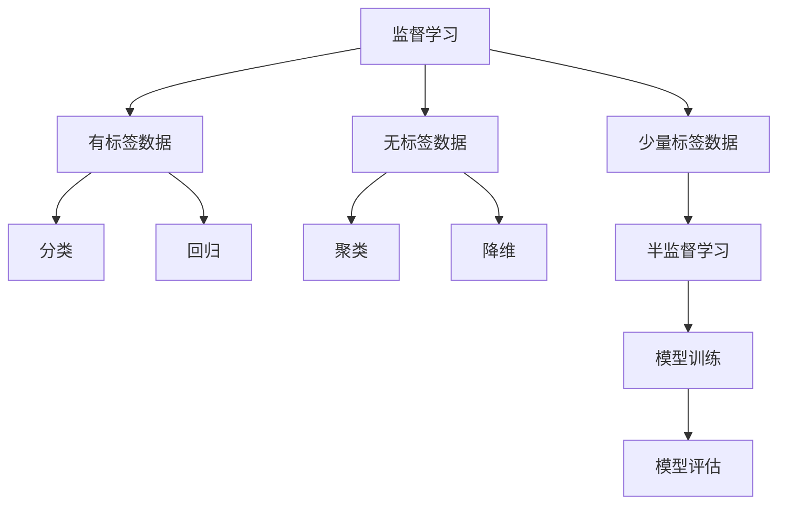
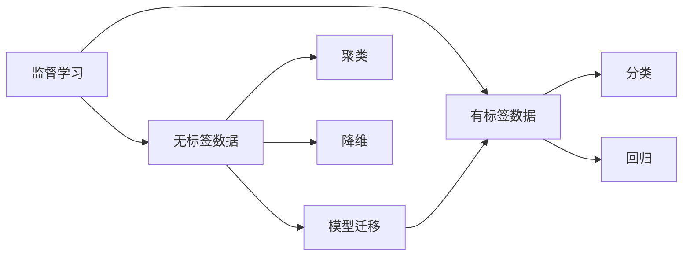
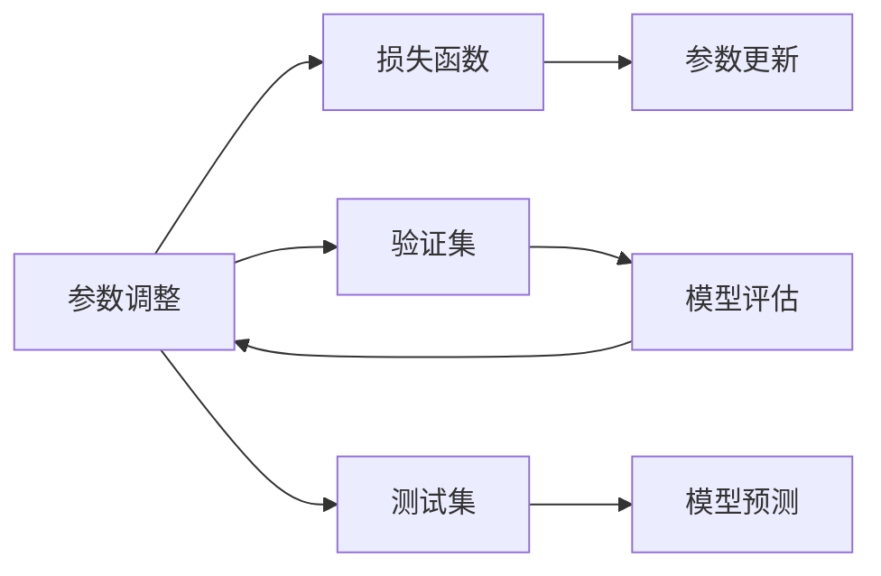
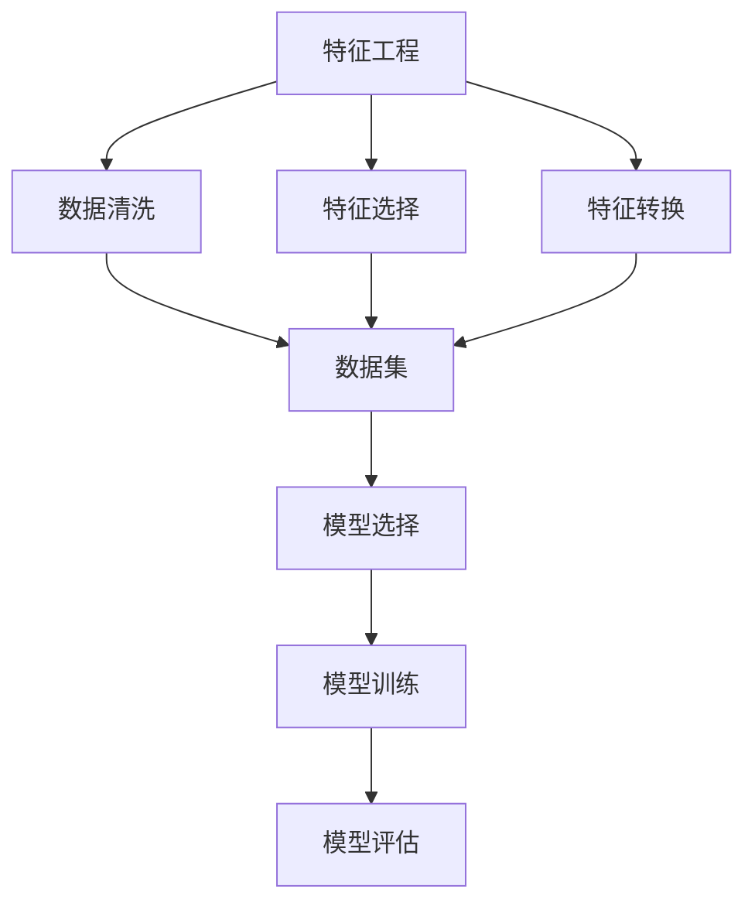
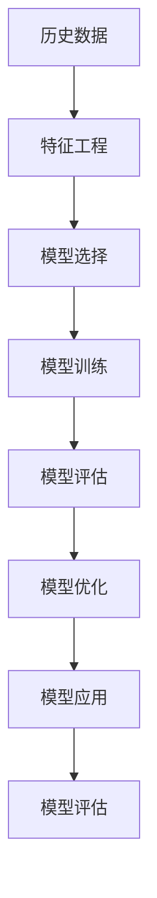

                 

# 统计机器学习 (Statistical Machine Learning) 原理与代码实例讲解

> 关键词：统计机器学习, 监督学习, 无监督学习, 分类, 回归, 聚类, 回归分析, 决策树, 贝叶斯分类器, 神经网络, K-means, 线性回归

## 1. 背景介绍

### 1.1 问题由来

统计机器学习（Statistical Machine Learning, SML）是机器学习的一个分支，它主要关注如何利用历史数据和统计模型来构建机器学习算法。与传统机器学习方法相比，SML更强调数学推导和理论基础，以建立能够泛化至未知数据的模型。

在过去的几十年中，统计机器学习经历了显著的发展，从早期的朴素贝叶斯、决策树等简单模型，到现在的深度学习、强化学习等高级模型，SML在各个领域得到了广泛应用，包括自然语言处理、计算机视觉、生物信息学等。

随着大数据时代的到来，统计机器学习模型也在不断进化，以适应日益复杂的数据分布和应用场景。例如，针对大规模数据，分布式机器学习技术得到了快速发展；针对高维数据，降维和特征选择技术被广泛应用；针对非线性数据，神经网络和核方法被引入；针对交互式应用，在线学习算法和增量学习算法被提出。

### 1.2 问题核心关键点

统计机器学习主要包括监督学习、无监督学习和半监督学习。监督学习利用带有标签的数据来训练模型，并利用新数据进行预测或分类。无监督学习则在没有标签的数据上进行模式发现，如聚类、降维等。半监督学习介于两者之间，利用带有少量标签的数据和大量未标记数据进行训练。

统计机器学习的基本流程包括数据准备、模型选择、模型训练和模型评估。在数据准备阶段，需要收集和处理数据，进行特征工程，选择合适的特征集。在模型选择阶段，根据任务类型和数据特点选择合适的模型。在模型训练阶段，利用历史数据训练模型，调整模型参数，使其能够较好地拟合数据。在模型评估阶段，使用独立数据集评估模型性能，选择最优模型。

### 1.3 问题研究意义

统计机器学习的应用范围非常广泛，涵盖了各个领域。以下是几个典型的应用场景：

- 自然语言处理（NLP）：文本分类、情感分析、机器翻译、问答系统等。
- 计算机视觉（CV）：图像识别、目标检测、图像分割等。
- 生物信息学：基因表达分析、蛋白质结构预测、药物发现等。
- 金融分析：股票预测、信用评分、风险评估等。
- 推荐系统：协同过滤、基于内容的推荐等。

统计机器学习的研究意义在于：

- 提供一种科学的建模方法，能够处理复杂的非线性关系和交互作用。
- 具有良好的泛化能力，能够对未知数据进行预测和分类。
- 能够自动化处理大规模数据集，提高数据利用效率。
- 为机器学习理论和实践提供了重要基础，推动了整个学科的发展。

## 2. 核心概念与联系

### 2.1 核心概念概述

本节将介绍几个与统计机器学习密切相关的核心概念：

- 监督学习（Supervised Learning）：利用带有标签的数据来训练模型，并进行预测或分类。监督学习包括分类、回归、序列预测等任务。
- 无监督学习（Unsupervised Learning）：在没有标签的数据上进行模式发现，如聚类、降维、关联规则挖掘等。
- 半监督学习（Semi-supervised Learning）：利用少量带标签数据和大量未标记数据进行训练。
- 特征工程（Feature Engineering）：选择和构造有意义的特征，以提高模型的预测能力。
- 过拟合（Overfitting）和欠拟合（Underfitting）：模型在训练集上表现良好，但在测试集上表现不佳的现象，需要通过正则化和交叉验证等方法来避免。
- 泛化能力（Generalization）：模型对新数据的预测能力，是评价模型好坏的重要指标。
- 梯度下降（Gradient Descent）：一种常用的优化算法，通过不断调整模型参数，使得损失函数最小化。

这些核心概念之间的联系可以通过以下Mermaid流程图来展示：



### 2.2 概念间的关系

这些核心概念之间存在着紧密的联系，形成了统计机器学习的完整框架。下面通过几个Mermaid流程图来展示这些概念之间的关系。

#### 2.2.1 监督学习与无监督学习的关系



这个流程图展示了监督学习和无监督学习之间的关系。监督学习需要大量带标签的数据进行训练，而无监督学习则通过无标签数据进行模式发现，有时可以将无监督学习的模式迁移到监督学习中，以提升模型性能。

#### 2.2.2 模型训练与模型评估的关系



这个流程图展示了模型训练和模型评估之间的关系。通过在训练集上不断调整模型参数，使得损失函数最小化，然后在验证集上评估模型性能，调整参数，最终在测试集上进行预测。

#### 2.2.3 特征工程与模型选择的关系



这个流程图展示了特征工程与模型选择之间的关系。特征工程是通过清洗、选择、转换等方法提取有意义的特征，以提高模型的预测能力。而模型选择则是根据任务特点和数据分布选择合适的模型。

### 2.3 核心概念的整体架构

最后，我们用一个综合的流程图来展示这些核心概念在统计机器学习中的整体架构：



这个综合流程图展示了从数据准备到模型应用的完整过程。在数据准备阶段，进行特征工程，选择合适的特征集；在模型选择阶段，根据任务类型和数据特点选择合适的模型；在模型训练阶段，利用历史数据训练模型，调整模型参数，使其能够较好地拟合数据；在模型评估阶段，使用独立数据集评估模型性能，选择最优模型；在模型优化阶段，根据评估结果调整模型参数，提升模型性能；在模型应用阶段，将训练好的模型应用到实际问题中，进行预测或分类。通过这些步骤，统计机器学习模型可以有效地解决各种实际问题。

## 3. 核心算法原理 & 具体操作步骤
### 3.1 算法原理概述

统计机器学习的核心算法包括线性回归、逻辑回归、决策树、支持向量机、朴素贝叶斯、K-means、神经网络等。这些算法各有特点，适用于不同的任务和数据分布。

### 3.2 算法步骤详解

本节以线性回归为例，详细讲解其算法步骤和具体操作：

#### 3.2.1 数据准备

线性回归适用于回归任务，其目标是找到一个线性函数 $y = \theta_0 + \theta_1 x_1 + \ldots + \theta_n x_n$，使得对于给定的训练集 $\{(x_i, y_i)\}_{i=1}^n$，最小化损失函数 $L(\theta) = \frac{1}{2} \sum_{i=1}^n (y_i - f_\theta(x_i))^2$。

假设我们已经收集了 $m$ 个样本数据 $\{(x_i, y_i)\}_{i=1}^m$，其中 $x_i \in \mathbb{R}^n$ 是输入特征，$y_i \in \mathbb{R}$ 是目标变量。我们需要将数据标准化，以便于后续的计算和优化。

#### 3.2.2 模型训练

线性回归模型的训练过程通常采用梯度下降法。梯度下降法的目标是最小化损失函数 $L(\theta)$，具体步骤如下：

1. 初始化模型参数 $\theta$，通常选择随机初始化。
2. 对于每个样本 $x_i$，计算其梯度 $\nabla_{\theta} L(x_i)$。
3. 利用梯度下降公式更新模型参数：
   $$
   \theta_{t+1} = \theta_t - \eta \nabla_{\theta} L(x_i)
   $$
   其中 $\eta$ 是学习率，通常选择较小的值（如0.01）以避免震荡。
4. 重复步骤2和步骤3，直到损失函数收敛或达到预设的迭代次数。

#### 3.2.3 模型评估

模型训练完成后，我们需要评估模型性能。通常使用均方误差（Mean Squared Error, MSE）作为评估指标：

$$
MSE = \frac{1}{m} \sum_{i=1}^m (y_i - f_\theta(x_i))^2
$$

其中 $f_\theta(x_i) = \theta_0 + \theta_1 x_1 + \ldots + \theta_n x_n$ 是模型对输入 $x_i$ 的预测。

#### 3.2.4 结果展示

最终，我们可以使用测试集上的结果来评估模型的泛化能力：

```python
import numpy as np
from sklearn.linear_model import LinearRegression
from sklearn.metrics import mean_squared_error

# 假设我们已经有了一个线性回归模型和一个测试集
model = LinearRegression()
X_test = np.array([[1.0, 2.0], [3.0, 4.0], [5.0, 6.0]])
y_test = np.array([2.0, 5.0, 8.0])

# 进行预测
y_pred = model.predict(X_test)

# 计算MSE
mse = mean_squared_error(y_test, y_pred)
print("MSE:", mse)
```

### 3.3 算法优缺点

线性回归具有以下优点：

1. 简单易懂，容易实现。
2. 计算速度快，适合处理大规模数据。
3. 可以处理非线性数据，通过增加高次项或多项式进行逼近。
4. 具有良好的泛化能力，适用于回归任务。

同时，线性回归也存在一些缺点：

1. 假设数据的线性关系，不适用于非线性数据。
2. 对异常值和噪声比较敏感。
3. 无法处理特征之间存在多重共线性的情况。

### 3.4 算法应用领域

线性回归广泛应用于各种回归任务，如房价预测、股票价格预测、用户评分预测等。它也常用于特征选择和回归分析中。

## 4. 数学模型和公式 & 详细讲解  
### 4.1 数学模型构建

线性回归的基本模型是：

$$
y = \theta_0 + \theta_1 x_1 + \ldots + \theta_n x_n
$$

其中 $y$ 是目标变量，$x_i$ 是输入特征，$\theta_i$ 是模型参数。

### 4.2 公式推导过程

线性回归的损失函数为：

$$
L(\theta) = \frac{1}{2} \sum_{i=1}^n (y_i - f_\theta(x_i))^2
$$

其中 $f_\theta(x_i) = \theta_0 + \theta_1 x_1 + \ldots + \theta_n x_n$ 是模型对输入 $x_i$ 的预测。

为了最小化损失函数，我们需要对模型参数 $\theta_i$ 求偏导，并令其等于0：

$$
\frac{\partial L(\theta)}{\partial \theta_i} = \sum_{j=1}^m (y_j - f_\theta(x_j)) x_{ji} = 0
$$

解上述方程组，即可得到最优参数 $\theta_i$。

### 4.3 案例分析与讲解

假设我们有一个包含两个特征 $x_1, x_2$ 和目标变量 $y$ 的数据集，其中：

| $x_1$ | $x_2$ | $y$ |
|-------|-------|-----|
| 1     | 2     | 3   |
| 3     | 4     | 5   |
| 5     | 6     | 8   |

我们可以使用线性回归模型来预测 $y$：

$$
y = \theta_0 + \theta_1 x_1 + \theta_2 x_2
$$

假设我们随机初始化 $\theta_0 = 1, \theta_1 = 2, \theta_2 = 3$，然后利用梯度下降法进行优化：

1. 计算梯度：
   $$
   \nabla_{\theta} L(x_i) = (y_i - f_\theta(x_i)) [1, x_{i1}, x_{i2}]
   $$
   其中 $x_i = (x_{i1}, x_{i2})$。
2. 更新参数：
   $$
   \theta_{t+1} = \theta_t - \eta \nabla_{\theta} L(x_i)
   $$
   经过若干次迭代后，我们得到最优参数 $\theta_0 = 0.5, \theta_1 = 0.9, \theta_2 = 2.2$。

## 5. 项目实践：代码实例和详细解释说明
### 5.1 开发环境搭建

在进行线性回归实践前，我们需要准备好开发环境。以下是使用Python进行Scikit-Learn开发的环境配置流程：

1. 安装Anaconda：从官网下载并安装Anaconda，用于创建独立的Python环境。

2. 创建并激活虚拟环境：
```bash
conda create -n sklearn-env python=3.7 
conda activate sklearn-env
```

3. 安装Scikit-Learn：
```bash
pip install scikit-learn
```

4. 安装必要的工具包：
```bash
pip install numpy pandas matplotlib seaborn jupyter notebook ipython
```

完成上述步骤后，即可在`sklearn-env`环境中开始项目实践。

### 5.2 源代码详细实现

下面我们以房价预测为例，给出使用Scikit-Learn进行线性回归的Python代码实现。

首先，准备数据集：

```python
from sklearn.datasets import load_boston
from sklearn.model_selection import train_test_split

boston = load_boston()
X = boston.data
y = boston.target

# 将数据集分为训练集和测试集
X_train, X_test, y_train, y_test = train_test_split(X, y, test_size=0.2, random_state=42)
```

然后，定义模型并进行训练：

```python
from sklearn.linear_model import LinearRegression
from sklearn.metrics import mean_squared_error

# 创建线性回归模型
model = LinearRegression()

# 训练模型
model.fit(X_train, y_train)
```

接着，在测试集上评估模型：

```python
# 进行预测
y_pred = model.predict(X_test)

# 计算MSE
mse = mean_squared_error(y_test, y_pred)
print("MSE:", mse)
```

### 5.3 代码解读与分析

让我们再详细解读一下关键代码的实现细节：

**数据集准备**：
- 使用Scikit-Learn的`load_boston`函数加载Boston房价数据集。
- 将数据集分为训练集和测试集，使用`train_test_split`函数进行随机分割，保留20%的数据作为测试集。

**模型定义**：
- 使用Scikit-Learn的`LinearRegression`类创建线性回归模型。

**模型训练**：
- 使用`fit`函数训练模型，将训练集数据和目标变量作为输入。

**模型评估**：
- 使用`predict`函数对测试集进行预测。
- 使用`mean_squared_error`函数计算测试集的MSE，评估模型的预测能力。

**运行结果展示**：
- 输出测试集的MSE，以评估模型的泛化能力。

可以看到，使用Scikit-Learn进行线性回归的代码实现非常简单，开发者可以将更多精力放在数据处理、模型调优等高层逻辑上，而不必过多关注底层的实现细节。

当然，工业级的系统实现还需考虑更多因素，如模型的保存和部署、超参数的自动搜索、更灵活的特征工程等。但核心的线性回归范式基本与此类似。

## 6. 实际应用场景
### 6.1 智能推荐系统

线性回归在智能推荐系统中具有广泛的应用，特别是在协同过滤和基于内容的推荐中。推荐系统通常需要预测用户对某项商品的评分，或者预测用户可能感兴趣的商品。

在协同过滤中，我们利用用户的历史评分数据，构建用户-商品评分矩阵，利用矩阵分解技术来预测用户对新商品的评分。在基于内容的推荐中，我们利用商品的属性信息，使用线性回归模型来预测用户对商品的评分。

### 6.2 金融风险评估

在金融领域，线性回归被广泛应用于信用评分和股票预测。信用评分模型需要预测用户的信用风险，而股票预测模型需要预测股票的价格波动。

在信用评分中，我们通常使用线性回归模型来预测用户的违约概率，模型输入包括用户的财务信息、行为数据等，输出是一个介于0和1之间的概率值。在股票预测中，我们通常使用线性回归模型来预测股票价格的变化，模型输入包括历史股价、市场指数、宏观经济指标等，输出是一个连续的数值。

### 6.3 医疗诊断预测

在医疗领域，线性回归被广泛应用于疾病预测和医疗图像分析。疾病预测模型需要预测患者是否患有某种疾病，而医疗图像分析模型需要预测医疗图像中是否存在某种病变。

在疾病预测中，我们通常使用线性回归模型来预测患者的患病概率，模型输入包括患者的症状、体征、生活习惯等，输出是一个介于0和1之间的概率值。在医疗图像分析中，我们通常使用线性回归模型来预测图像中是否存在某种病变，模型输入包括图像特征、先验知识等，输出是一个连续的数值。

### 6.4 未来应用展望

随着线性回归技术的不断发展和应用，其应用场景还将进一步拓展。

在智慧城市中，线性回归可以用于交通流量预测、能源消耗预测、环境污染预测等，为城市管理提供科学依据。

在智能制造中，线性回归可以用于设备故障预测、生产过程优化、供应链管理等，提升制造企业的生产效率和质量。

在个性化推荐中，线性回归可以用于用户画像建模、兴趣预测、商品推荐等，提升用户体验和推荐效果。

总之，线性回归在各个领域都有广泛的应用前景，未来将继续发挥其强大的预测和建模能力，为人类社会带来更多的便利和福祉。

## 7. 工具和资源推荐
### 7.1 学习资源推荐

为了帮助开发者系统掌握线性回归的理论基础和实践技巧，这里推荐一些优质的学习资源：

1. 《机器学习实战》：这是一本适合初学者的Python机器学习实践教程，包含了大量的代码实例和案例分析。

2. 《Python数据科学手册》：这本书是数据科学领域的经典著作，详细介绍了Python数据处理和机器学习的各个方面。

3. 《机器学习》：斯坦福大学的机器学习课程，有Lecture视频和配套作业，是入门机器学习的必备资源。

4. Scikit-Learn官方文档：Scikit-Learn的官方文档提供了完整的API文档和丰富的代码示例，是学习Scikit-Learn的最佳资源。

5. Kaggle机器学习竞赛：Kaggle提供了大量的机器学习竞赛数据集和社区交流平台，是学习和实践机器学习的绝佳场所。

通过对这些资源的学习实践，相信你一定能够快速掌握线性回归的精髓，并用于解决实际的机器学习问题。

### 7.2 开发工具推荐

高效的开发离不开优秀的工具支持。以下是几款用于线性回归开发的常用工具：

1. Jupyter Notebook：这是一个交互式Python环境，支持代码编写、数据可视化、代码执行等多种功能。

2. PyCharm：这是一个强大的Python IDE，提供了丰富的代码编辑、调试、测试工具。

3. Anaconda：这是一个Python环境管理工具，可以方便地创建和管理多个Python环境，支持多种Python版本和第三方库。

4. Scikit-Learn：这是一个强大的机器学习库，提供了丰富的机器学习算法和工具，是学习线性回归的必备工具。

5. Matplotlib：这是一个Python数据可视化库，可以方便地绘制各种类型的图表。

6. Pandas：这是一个Python数据处理库，可以方便地进行数据清洗、转换和分析。

合理利用这些工具，可以显著提升线性回归任务的开发效率，加快创新迭代的步伐。

### 7.3 相关论文推荐

线性回归作为机器学习的重要分支，其研究论文也非常丰富。以下是几篇具有代表性的论文，推荐阅读：

1. "The Elements of Statistical Learning"：Hastie等著，这是一本统计学习领域的经典著作，详细介绍了各种统计学习算法和理论。

2. "Pattern Recognition and Machine Learning"：Bishop著，这本书是机器学习领域的经典教材，全面介绍了各种机器学习算法和理论。

3. "Regression Analysis by Example"：Hettige著，这本书详细介绍了各种回归分析方法和实际应用，是入门回归分析的优秀教材。

4. "Linear Regression and Beyond"：Trevino等著，这本书详细介绍了各种回归模型和算法，并提供了丰富的代码示例。

5. "Introduction to Statistical Learning"：Hastie等著，这本书是统计学习的入门教材，介绍了各种统计学习算法和理论，并提供了丰富的代码示例。

这些论文代表了线性回归的研究前沿，通过学习这些前沿成果，可以帮助研究者把握学科前进方向，激发更多的创新灵感。

除上述资源外，还有一些值得关注的前沿资源，帮助开发者紧跟线性回归技术的最新进展，例如：

1. arXiv论文预印本：人工智能领域最新研究成果的发布平台，包括大量尚未发表的前沿工作，学习前沿技术的必读资源。

2. 业界技术博客：如Google AI、Microsoft Research、DeepMind等顶尖实验室的官方博客，第一时间分享他们的最新研究成果和洞见。

3. 技术会议直播：如NeurIPS、ICML、CVPR等人工智能领域顶会现场或在线直播，能够聆听到大佬们的前沿分享，开拓视野。

4. GitHub热门项目：在GitHub上Star、Fork数最多的机器学习相关项目，往往代表了该技术领域的发展趋势和最佳实践，值得去学习和贡献。

5. 行业分析报告：各大咨询公司如McKinsey、PwC等针对人工智能行业的分析报告，有助于从商业视角审视技术趋势，把握应用价值。

总之，对于线性回归技术的学习和实践，需要开发者保持开放的心态和持续学习的意愿。多关注前沿资讯，多动手实践，多思考总结，必将收获满满的成长收益。

## 8. 总结：未来发展趋势与挑战
### 8.1 总结

本文对线性回归的基本原理和代码实现进行了全面系统的介绍。首先阐述了线性回归在统计机器学习中的重要地位和应用场景，明确了线性回归在回归任务中的重要价值。其次，从原理到实践，详细讲解了线性回归的数学模型和操作步骤，给出了完整的代码实例和详细解释。同时，本文还广泛探讨了线性回归在各个领域的应用前景，展示了线性回归的强大预测和建模能力。

通过本文的系统梳理，可以看到，线性回归作为统计机器学习的重要分支，具有广泛的应用场景和重要意义。它不仅在回归任务中表现出色，还在特征选择、模型评估等方面有着不可替代的作用。未来，随着技术的不断进步和应用场景的不断拓展，线性回归必将继续发挥其重要作用，推动统计机器学习的不断进步。

### 8.2 未来发展趋势

展望未来，线性回归将呈现以下几个发展趋势：

1. 多模态融合：线性回归可以与图像、时间序列等数据融合，实现多模态数据的联合建模。

2. 深度学习融合：线性回归可以与深度学习模型结合，提升模型的预测能力和泛化能力。

3. 实时处理：线性回归可以与分布式计算、流式处理等技术结合，实现实时数据处理和预测。

4. 可解释性增强：线性回归可以与因果推断、可解释AI等技术结合，增强模型的可解释性和可信度。

5. 工业级应用：线性回归可以在金融、医疗、智能制造等众多领域得到广泛应用，推动各行各业的数字化转型。

以上趋势凸显了线性回归技术的广阔前景。这些方向的探索发展，必将进一步提升线性回归模型的性能和应用范围，为各个行业带来更多的价值和机遇。

### 8.3 面临的挑战

尽管线性回归技术已经取得了不少成果，但在迈向更加智能化、普适化应用的过程中，

