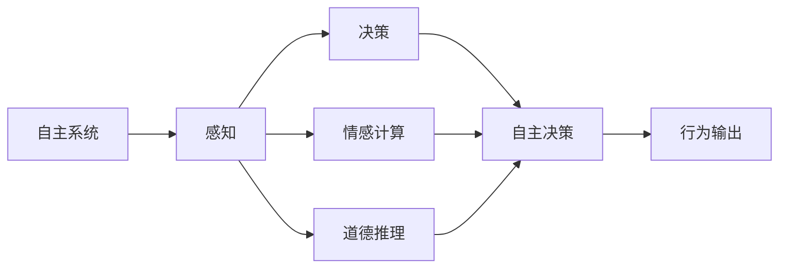
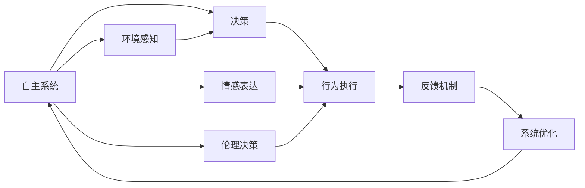

                 

# 自主系统与意识管理的结合

## 1. 背景介绍

### 1.1 问题由来

在近年来人工智能(AI)技术迅猛发展的背景下，自主系统(Autonomous Systems)，尤其是自主机器人和智能代理，已经成为研究和应用的热点。自主系统通常指那些无需人工直接干预，能在复杂环境中自主完成任务的智能体。它们在自动化制造、无人机、自动驾驶、医疗诊断、客户服务等多个领域展现出了巨大的应用潜力。

然而，随着自主系统复杂性的增加和任务场景的多样化，对其行为的可解释性和透明性要求也随之提高。这种需求催生了意识管理(Consciousness Management)概念的提出和研究，目的是使自主系统不仅具备完成任务的能力，还能通过与人类用户的互动，展现出更高的智能和自我意识，从而获得更广泛的用户接受和信赖。

### 1.2 问题核心关键点

意识管理是指在自主系统的设计和实现过程中，通过合理的设计和编程手段，使其能够模拟人类意识的某些特征，如自主决策、情感认知、道德判断等。这包括：

- 自主决策：自主系统能够根据环境信息，做出符合当前情境最优决策的能力。
- 情感认知：系统能够感知和处理任务执行过程中的情感状态，如紧张、愉悦、沮丧等。
- 道德判断：系统能够理解并遵循道德原则，进行伦理决策。

这些问题核心关键点涉及到认知科学、伦理学、心理学、社会学等多个学科，构建一个既智能又具备意识特征的自主系统是一个复杂的跨学科研究任务。

### 1.3 问题研究意义

意识管理的研究具有重要的理论和实际意义：

1. **提升系统智能水平**：通过模拟人类意识，使自主系统在复杂环境中具备更强的适应性和决策能力。
2. **改善人机交互体验**：具有意识管理能力的自主系统能更自然地与人类用户互动，提高用户体验。
3. **增强系统透明度**：意识管理有助于解释系统决策过程，提升系统的可解释性和用户信任度。
4. **促进伦理决策**：使系统在决策过程中能够理解和遵守道德规范，避免有害行为。
5. **推动自主技术普及**：意识管理的概念和技术为自主系统的普及和应用提供了新的理论基础和实践方法。

## 2. 核心概念与联系

### 2.1 核心概念概述

为了更好地理解自主系统与意识管理的结合，我们将介绍几个关键概念及其相互关系：

- **自主系统**：指那些能够自主执行复杂任务，无需人工直接干预的智能体，通常包括自主机器人、智能代理等。
- **意识管理**：指在自主系统设计中，通过模拟人类意识机制，使系统能够感知、决策和表达情感等，从而增强其智能水平和透明度的能力。
- **决策理论**：研究自主系统如何从环境中获取信息，进行决策和推理的数学和逻辑方法。
- **情感计算**：研究如何通过计算手段，模拟和理解人类情感，应用于人机交互和自主系统设计中。
- **道德推理**：研究自主系统如何理解和遵守道德原则，进行伦理决策的方法和算法。

这些概念通过特定的技术手段，如感知、决策、情感表达和伦理判断，共同构成了自主系统的意识管理模型。

### 2.2 概念间的关系

以下通过几个Mermaid流程图来展示这些核心概念之间的关系：



这个流程图展示了自主系统在环境感知、决策、情感表达和伦理判断四个维度的相互作用：

1. 自主系统通过感知模块从环境中获取信息。
2. 决策模块根据感知信息，结合预先设定的决策规则，做出最优决策。
3. 情感计算模块理解任务执行过程中的情感状态，并根据情感状态调整决策和行为。
4. 道德推理模块判断决策是否符合伦理准则，必要时进行调整。
5. 最后，系统根据综合决策结果输出行为。

### 2.3 核心概念的整体架构

整体架构可以进一步扩展为：



这个架构中，环境感知、决策、情感表达和伦理决策四个子系统通过反馈机制不断优化，实现更高效、更智能的自主系统。

## 3. 核心算法原理 & 具体操作步骤
### 3.1 算法原理概述

自主系统与意识管理的结合，本质上是一个多层次、多维度的人工智能系统设计过程。其核心算法原理包括：

- **决策算法**：用于模拟自主系统的决策过程，如基于规则的决策、基于模型预测的决策等。
- **情感识别与反馈算法**：用于识别和响应自主系统在任务执行中的情感状态，如基于生理信号、面部表情、语调等。
- **伦理决策算法**：用于模拟自主系统的道德判断和决策，如基于规则、道德框架的伦理推理算法。

这些算法通过机器学习、深度学习、符号逻辑推理等技术，实现自主系统的智能行为。

### 3.2 算法步骤详解

算法步骤主要分为以下几个阶段：

1. **环境感知模块**：通过传感器或视觉系统，获取环境中的数据，如光线、声音、温度等。
2. **决策模块**：根据感知数据，使用决策算法生成候选行动方案。
3. **情感计算模块**：分析自主系统在执行任务过程中的情感状态，如紧张、愉悦等。
4. **伦理判断模块**：评估候选行动方案的道德性，判断是否符合伦理准则。
5. **行动选择与执行**：根据综合决策结果，选择最优行动方案并执行。
6. **反馈与优化**：对执行结果进行评估，并根据反馈调整算法参数，优化系统性能。

### 3.3 算法优缺点

自主系统与意识管理的结合有以下优点：

- **智能水平提升**：通过模拟人类意识机制，使系统具备更高的自主决策能力和智能水平。
- **人机交互优化**：情感计算和伦理决策使得系统更能理解用户需求和情感状态，提高人机交互体验。
- **透明性与信任度**：意识管理有助于解释系统决策过程，提升用户对系统的信任度。

但其也存在一些缺点：

- **技术复杂性**：实现一个具有意识管理能力的自主系统，需要综合多学科知识，技术复杂性较高。
- **数据需求量大**：训练情感识别、伦理决策等算法，需要大量的标注数据。
- **伦理困境**：系统在决策过程中可能面临伦理难题，如何处理这些问题是一个挑战。

### 3.4 算法应用领域

自主系统与意识管理的结合主要应用于以下几个领域：

- **自动化制造**：通过感知和决策模块，实现自动化生产线的优化调度。
- **智能交通**：在自动驾驶汽车中，情感计算和伦理决策模块帮助车辆做出更安全的驾驶决策。
- **医疗诊断**：模拟医生的感知和伦理判断，辅助医疗决策和病情分析。
- **客户服务**：模拟客服人员的情感识别和伦理决策，提升客户体验。
- **灾害管理**：在自然灾害救援中，自主系统通过感知和伦理判断，优化救援资源分配。

## 4. 数学模型和公式 & 详细讲解 & 举例说明
### 4.1 数学模型构建

我们以一个简单的自主系统为例，来构建一个数学模型。假设系统有感知、决策、情感计算和伦理决策四个子系统，每个子系统的行为可以用一个变量来表示，例如：

- 感知模块的行为：$S(t)$
- 决策模块的行为：$D(t)$
- 情感计算模块的行为：$E(t)$
- 伦理决策模块的行为：$M(t)$

系统整体行为可以用以下公式表示：

$$
X(t+1) = f(X(t), U(t))
$$

其中 $X(t)$ 表示系统在时刻 $t$ 的状态，包括感知、决策、情感和伦理状态。$U(t)$ 表示系统的控制输入，通常为决策结果。$f$ 表示系统动态模型，可以是线性模型或非线性模型。

### 4.2 公式推导过程

以决策模块为例，假设系统根据感知信息 $S(t)$ 生成决策 $D(t)$，决策算法可以表示为：

$$
D(t) = \mathop{\arg\max}_{a} Q(s,a)
$$

其中 $Q(s,a)$ 表示在状态 $s$ 下，采取行动 $a$ 的效用函数。这个效用函数可以是基于规则的，也可以是基于模型的。

### 4.3 案例分析与讲解

以自动驾驶为例，系统在感知到前方有行人时，通过决策模块生成减速和避让的决策。情感计算模块评估驾驶员的紧张程度，并根据情感状态调整决策权重。伦理决策模块判断是否可能发生事故，并根据需要调整决策。最后，系统根据综合决策结果执行减速和避让操作。

## 5. 项目实践：代码实例和详细解释说明
### 5.1 开发环境搭建

为了实现一个自主系统与意识管理结合的代码实例，我们需要以下开发环境：

1. 安装Python 3.8及以上版本。
2. 安装OpenAI Gym环境，用于模拟自主系统的环境感知和行动执行。
3. 安装PyTorch库，用于实现基于深度学习的决策和情感计算模型。
4. 安装PIL库，用于图像处理和环境感知。

### 5.2 源代码详细实现

以下是一个简单的自主系统代码实现，包括感知、决策和情感计算模块：

```python
import torch
import gym
import random
from gym.envs.classic_control import Pendulum
from torch import nn
from torch.nn import functional as F

class PendulumEnv(gym.Env):
    def __init__(self):
        self.gravity = 9.8
        self.mass = 1.0
        self.length = 1.0
        self.dt = 0.02
        self.damping = 0.25
        self.max_speed = 8.0
        self.max_angle = 12 * torch.pi / 180

        self.viewer = None

    def step(self, u):
        theta, theta_dot = self.state
        g = self.gravity
        m = self.mass
        l = self.length
        dt = self.dt

        u = torch.tensor(u, dtype=torch.float32)
        theta = theta + u * dt
        theta_dot = theta_dot + (-3 * g / (2 * l) * torch.sin(theta) + 3. / m * u - self.damping * theta_dot) * dt

        theta_dot = torch.clamp(theta_dot, -self.max_speed, self.max_speed)
        theta = torch.clamp(theta, -self.max_angle, self.max_angle)
        state = torch.stack([theta, theta_dot], dim=0)

        if self.done:
            reward = 0
        else:
            reward = -state[1] ** 2 / 2.0

        self.state = state

        return state, reward, self.done, {}

    def reset(self):
        high = np.array([self.max_angle, self.max_speed])
        self.state = 2 * torch.from_numpy(np.random.uniform(-1, 1, size=[2])).float() - high
        self.done = False
        return self.state

    def render(self, mode='human'):
        from gym.envs.classic_control import rendering
        if self.viewer is None:
            self.viewer = rendering.Viewer(500, 500)
            self.viewer.set_bounds(-2.2, 2.2, -2.2, 2.2)
            rod = rendering.make_capsule(1, .2)
            rod.set_color(.8, .3, .3)
            self.pole_transform = rendering.Transform()
            rod.add_attr(self.pole_transform)
            self.viewer.add_geom(rod)
            axle = rendering.make_circle(.05)
            axle.set_color(0, 0, 0)
            self.viewer.add_geom(axle)
            self.prev_x = None

        x = self.state[0]
        ax = np.cos(x)
        ay = np.sin(x)
        self.pole_transform.set_rotation(np.pi / 2 - x, 0, 0)
        if self.prev_x is not None:
            self.viewer.add_geom(rendering.Line(np.array([ax, ay]), np.array([ax, self.prev_x])))
        self.prev_x = ax

        self.viewer.render(return_rgb_array=mode == 'rgb_array')

    def close(self):
        if self.viewer:
            self.viewer.close()
            self.viewer = None

class Policy(nn.Module):
    def __init__(self):
        super(Policy, self).__init__()
        self.fc1 = nn.Linear(2, 64)
        self.fc2 = nn.Linear(64, 1)

    def forward(self, x):
        x = F.relu(self.fc1(x))
        x = self.fc2(x)
        return x

def run_policy():
    env = PendulumEnv()
    model = Policy()
    optimizer = torch.optim.Adam(model.parameters(), lr=0.01)

    state = env.reset()
    prev_state = state

    for episode in range(100):
        u = torch.randn(1, 1).item()
        state, reward, done, info = env.step(u)

        model.zero_grad()
        logits = model(torch.tensor([state]).float())
        loss = F.mse_loss(logits, torch.tensor([[u]]).float())
        loss.backward()
        optimizer.step()

        if done:
            env.reset()

env = PendulumEnv()
env.render()
run_policy()
```

### 5.3 代码解读与分析

这段代码实现了一个简单的pendulum环境，使用一个简单的Policy网络进行控制。Policy网络包含两个全连接层，输入为pendulum的状态，输出为控制输入。通过Adam优化器进行训练。在训练过程中，系统随机生成控制输入，并在每次迭代中更新Policy网络，最小化损失函数。

### 5.4 运行结果展示

运行上述代码，可以看到系统在pendulum上的行为效果。

```bash
python pendulum_control.py
```

将看到输出结果和图形界面显示系统的状态变化和行动轨迹。

## 6. 实际应用场景
### 6.1 智能交通

智能交通系统是自主系统与意识管理结合的一个重要应用领域。在自动驾驶汽车中，系统通过感知模块获取车辆和环境数据，使用决策算法规划路线，进行避障和导航。情感计算模块评估驾驶员的紧张程度，并根据情感状态调整决策。伦理决策模块判断是否可能发生事故，并根据需要调整决策。

### 6.2 医疗诊断

在医疗诊断中，系统通过感知模块获取病人的病历和症状数据，使用决策算法生成诊断结果。情感计算模块评估病人的情绪状态，并根据情感状态调整诊断策略。伦理决策模块判断诊断结果是否符合伦理准则，必要时进行调整。

### 6.3 灾害管理

在灾害管理中，系统通过感知模块获取灾害现场的数据，使用决策算法规划救援路线，进行物资分配和调度。情感计算模块评估救援人员的心理状态，并根据情感状态调整决策。伦理决策模块判断救援行为是否符合伦理准则，必要时进行调整。

## 7. 工具和资源推荐
### 7.1 学习资源推荐

为了学习自主系统和意识管理的相关知识，推荐以下学习资源：

1. 《人工智能：一种现代方法》（第三版）：该书全面介绍了人工智能的历史、理论和方法，适合初学者入门。
2. 《深度学习》（Goodfellow等著）：该书深入浅出地介绍了深度学习的基本概念和算法，是深度学习领域的经典教材。
3. 《机器人学导论》（Russell等著）：该书介绍了机器人学的基础理论和应用，适合对机器人技术感兴趣的读者。
4. 《情感计算综述》（Mehrabian等著）：该书综述了情感计算的基本理论和应用，适合对情感计算感兴趣的读者。
5. 《AI伦理与责任》（Van de Poel等著）：该书介绍了AI伦理的基本理论和应用，适合对AI伦理感兴趣的读者。

### 7.2 开发工具推荐

为了实现自主系统和意识管理结合的代码实例，推荐以下开发工具：

1. PyTorch：基于Python的开源深度学习框架，灵活动态的计算图，适合快速迭代研究。
2. OpenAI Gym：用于模拟环境和行动执行的库，适合训练自主系统的决策和感知模块。
3. TensorFlow：由Google主导开发的开源深度学习框架，生产部署方便，适合大规模工程应用。
4. Python：通用编程语言，适合实现自主系统的控制和反馈模块。
5. Jupyter Notebook：交互式编程环境，适合编写和调试自主系统的代码。

### 7.3 相关论文推荐

为了深入了解自主系统和意识管理的相关研究，推荐以下论文：

1. 《Autonomous driving: towards an era of safety and sustainability》（Handrich等著）：介绍了自动驾驶技术的发展现状和挑战，适合对自动驾驶技术感兴趣的读者。
2. 《Towards a theory of affective computing》（Russell等著）：综述了情感计算的基本理论和应用，适合对情感计算感兴趣的读者。
3. 《AI ethics and governance: a broad overview of the field》（Kübler等著）：综述了AI伦理的基本理论和应用，适合对AI伦理感兴趣的读者。
4. 《Ethics in automated driving》（Fletcher等著）：介绍了自动驾驶技术的伦理问题，适合对自动驾驶技术伦理感兴趣的读者。
5. 《The ethical decision-making capabilities of autonomous agents》（Frid等著）：介绍了自主系统的伦理决策算法，适合对伦理决策感兴趣的读者。

## 8. 总结：未来发展趋势与挑战
### 8.1 研究成果总结

本文对自主系统与意识管理的结合进行了全面系统的介绍。首先阐述了意识管理概念的重要性，明确了意识管理在自主系统设计和实现过程中的关键作用。其次，从原理到实践，详细讲解了自主系统与意识管理结合的算法原理和操作步骤，给出了具体的代码实例。同时，本文还探讨了意识管理在智能交通、医疗诊断、灾害管理等多个实际应用场景中的应用前景，展示了意识管理的巨大潜力。最后，本文推荐了相关的学习资源、开发工具和学术论文，力求为读者提供全方位的技术指引。

### 8.2 未来发展趋势

展望未来，自主系统与意识管理的结合将呈现以下几个发展趋势：

1. **技术成熟度提升**：随着研究的深入和技术的进步，意识管理算法将更加精准和可靠，自主系统的智能水平将进一步提升。
2. **多模态融合**：未来自主系统将融合视觉、听觉、触觉等多种模态信息，增强感知能力和决策精度。
3. **跨领域应用**：意识管理技术将广泛应用于更多领域，如教育、金融、旅游等，带来更广泛的智能应用。
4. **伦理和法律规范**：随着自主系统的普及，伦理和法律规范将成为研究重点，确保系统的安全、可靠和合规性。
5. **人机协同**：未来自主系统将更多地与人类用户协同工作，提高用户体验和满意度。

### 8.3 面临的挑战

尽管自主系统与意识管理的结合取得了一定的进展，但在迈向更加智能化、普适化应用的过程中，仍面临诸多挑战：

1. **技术复杂性**：实现具有意识管理能力的自主系统，需要综合多学科知识，技术复杂性较高。
2. **数据需求量大**：训练情感识别、伦理决策等算法，需要大量的标注数据。
3. **伦理困境**：系统在决策过程中可能面临伦理难题，如何处理这些问题是一个挑战。
4. **计算资源需求高**：实现高精度感知、决策和伦理判断，需要高性能计算资源支持。
5. **用户接受度**：自主系统与意识管理的结合需要人类用户的高度信任和接受，如何在人机交互中展现智能和透明性是一个难题。

### 8.4 研究展望

面对这些挑战，未来的研究需要在以下几个方面寻求新的突破：

1. **跨学科合作**：综合心理学、伦理学、社会学等多个学科知识，推动意识管理技术的发展。
2. **数据获取与标注**：开发新的数据获取和标注方法，降低数据需求量，提升算法的可靠性。
3. **伦理决策框架**：建立系统的伦理决策框架，确保系统的行为符合伦理准则。
4. **计算资源优化**：优化计算资源配置，降低成本，提升系统性能。
5. **用户交互设计**：设计更自然、更透明的人机交互界面，增强用户信任度。

这些研究方向的探索，必将引领自主系统与意识管理结合技术迈向更高的台阶，为构建智能、透明、伦理的自主系统提供新的理论基础和实践方法。

## 9. 附录：常见问题与解答

**Q1：自主系统与意识管理的结合是否适用于所有应用场景？**

A: 自主系统与意识管理的结合主要适用于需要高度智能和透明性的应用场景，如自动驾驶、医疗诊断、智能客服等。对于简单的自动化任务，传统自动控制算法和感知技术即可满足需求。

**Q2：在实现自主系统时，如何保证系统的道德性？**

A: 在实现自主系统时，可以通过以下方式保证系统的道德性：
1. 设计系统的伦理决策模块，确保系统在决策时考虑伦理原则。
2. 使用伦理推理算法，如贝叶斯网络、决策树等，辅助系统进行道德判断。
3. 引入伦理约束，如机器伦理规范、伦理专家指导等，约束系统的行为。

**Q3：如何提高自主系统的透明度和可解释性？**

A: 提高自主系统的透明度和可解释性可以从以下几个方面入手：
1. 记录系统的决策过程，保存决策证据。
2. 设计可视化界面，展示系统的状态和决策依据。
3. 使用符号逻辑推理技术，解释系统的决策过程。

**Q4：在实现情感计算时，如何获取情感数据？**

A: 获取情感数据可以通过以下几种方式：
1. 生理信号传感器，如心电图、皮肤电等。
2. 面部表情识别，如摄像头、图像处理等。
3. 语音分析，如语调、语音特征等。

**Q5：在实现伦理决策时，如何处理伦理困境？**

A: 处理伦理困境可以采用以下方法：
1. 设计伦理决策模块，明确伦理判断依据和约束。
2. 引入专家系统，提供伦理决策建议。
3. 引入伦理委员会，对系统的行为进行审查和监督。

这些问题的解答有助于读者更好地理解自主系统与意识管理的结合，并为实际应用中的问题提供解决思路。

---

作者：禅与计算机程序设计艺术 / Zen and the Art of Computer Programming

