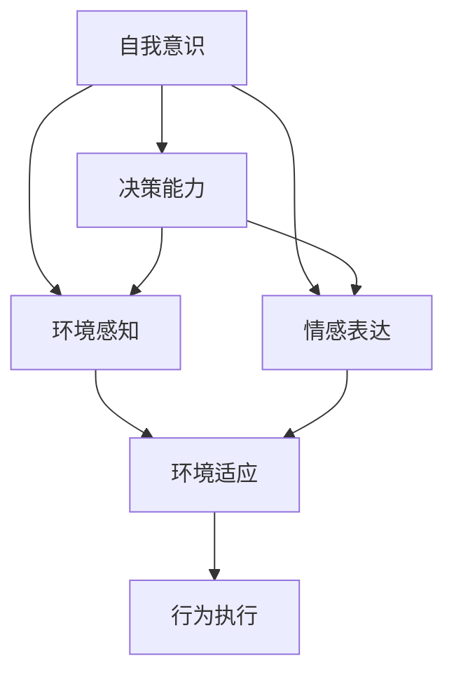
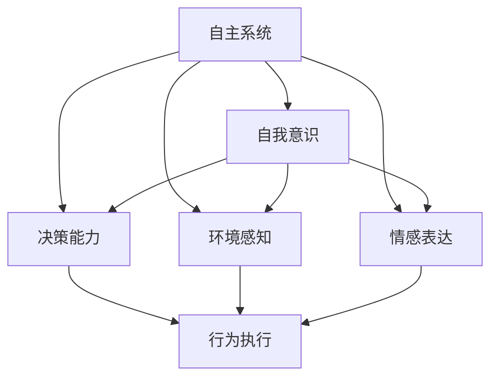
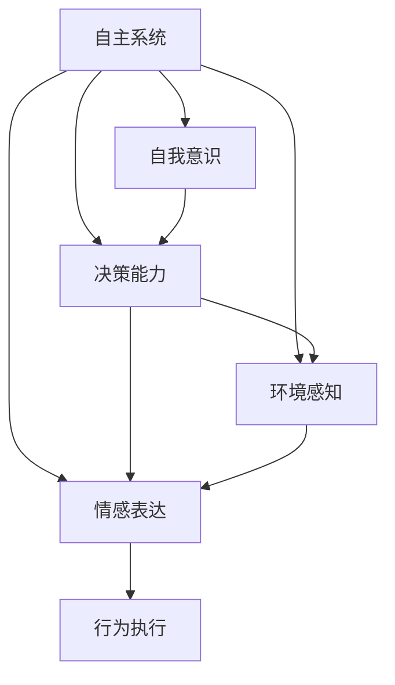
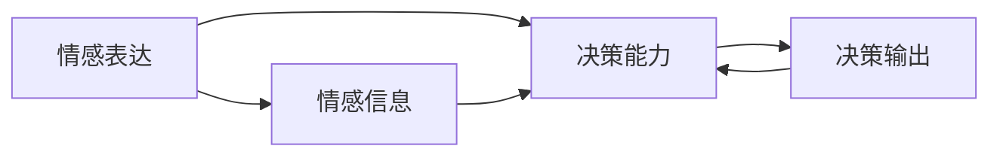
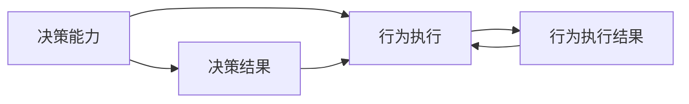
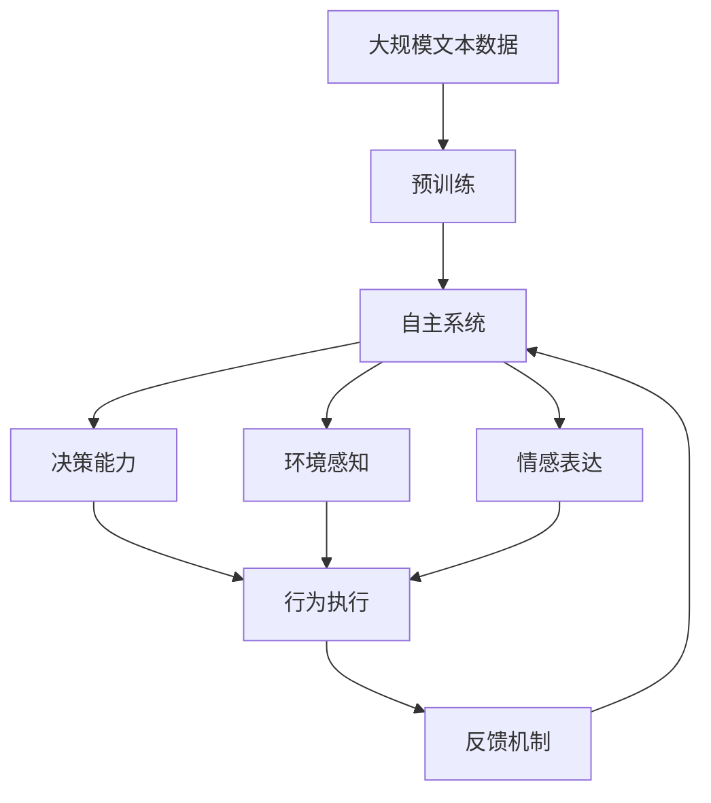
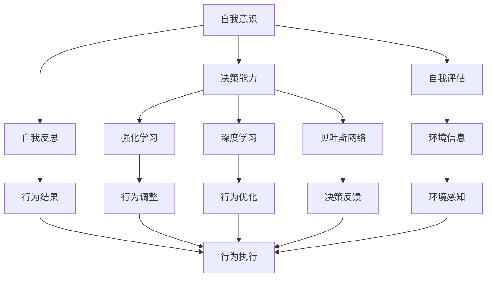

                 

# 自主系统视角下的意识功能

## 1. 背景介绍

### 1.1 问题由来
人工智能（AI）正迅速发展，正在从传统的机器学习向更加智能化的自主系统转变。自主系统不仅能够执行预定的任务，还能够自我调整和适应环境变化，甚至在一定程度上具备了意识功能。然而，如何定义、实现和评估自主系统的意识功能，至今仍是人工智能领域的重要挑战。

### 1.2 问题核心关键点
自主系统的意识功能是指系统具备自主决策、自我意识、情感表达和环境感知的能力。这一功能的实现，涉及到复杂的认知、感知、决策和反馈机制。核心关键点包括：

- 自我意识：系统能够识别自身的存在和特性。
- 决策能力：系统能够自主选择行动路径。
- 环境感知：系统能够理解并适应环境变化。
- 情感表达：系统能够根据情境调整其行为和决策。

这些关键点之间的联系，可通过以下Mermaid流程图来展示：



这个流程图展示了自主系统的各个功能组件及其相互关系。自我意识是基础，决策能力依赖于自我意识，环境感知和情感表达则进一步提升决策能力，最终通过行为执行体现出来。

### 1.3 问题研究意义
研究自主系统的意识功能，对于实现更加智能化的自主系统，提升人类对自主系统的理解和控制，具有重要意义：

1. 实现更加智能化的决策。自主系统能够基于自我意识和环境感知，自主选择最优行动路径。
2. 提升人类与机器的交互体验。自主系统的情感表达能力，使其能够与人类更加自然地交流。
3. 增强系统的鲁棒性和适应性。通过自我调整和环境感知，自主系统能够在面对复杂和多变的环境时，保持高效和稳定。
4. 推动人工智能技术的发展。意识功能的实现，将进一步推动AI技术向通用智能迈进。

## 2. 核心概念与联系

### 2.1 核心概念概述

为更好地理解自主系统的意识功能，本节将介绍几个密切相关的核心概念：

- 自主系统（Autonomous System）：能够自主决策、自我调整和适应环境的系统。
- 自我意识（Self-Awareness）：系统能够识别自身的存在和特性。
- 决策能力（Decision-Making）：系统能够自主选择行动路径。
- 环境感知（Environmental Perception）：系统能够理解并适应环境变化。
- 情感表达（Affective Expression）：系统能够根据情境调整其行为和决策。
- 行为执行（Action Execution）：系统通过行为执行，将决策结果应用于现实世界。

这些核心概念之间的逻辑关系可以通过以下Mermaid流程图来展示：



这个流程图展示了自主系统的各个功能组件及其相互关系。自我意识是基础，决策能力、环境感知和情感表达是核心，最终通过行为执行体现出来。

### 2.2 概念间的关系

这些核心概念之间存在着紧密的联系，形成了自主系统的完整功能体系。下面我们通过几个Mermaid流程图来展示这些概念之间的关系。

#### 2.2.1 自主系统的功能体系



这个流程图展示了自主系统的核心功能组件及其相互关系。自我意识是基础，决策能力、环境感知和情感表达是核心，最终通过行为执行体现出来。

#### 2.2.2 自我意识与决策能力的关系


这个流程图展示了自我意识与决策能力之间的关系。自我意识为决策能力提供输入，决策能力为自我意识提供输出，两者相互依赖。

#### 2.2.3 环境感知与决策能力的关系


这个流程图展示了环境感知与决策能力之间的关系。环境感知为决策能力提供输入，决策能力基于环境信息做出决策，两者紧密联系。

#### 2.2.4 情感表达与决策能力的关系



这个流程图展示了情感表达与决策能力之间的关系。情感表达为决策能力提供输入，决策能力基于情感信息做出决策，两者相互影响。

#### 2.2.5 行为执行与决策能力的关系



这个流程图展示了行为执行与决策能力之间的关系。决策能力为行为执行提供输入，行为执行基于决策结果执行，两者相互依赖。

### 2.3 核心概念的整体架构

最后，我们用一个综合的流程图来展示这些核心概念在大语言模型微调过程中的整体架构：



这个综合流程图展示了从预训练到自主系统构建的完整过程。自主系统首先在大规模文本数据上进行预训练，然后通过决策能力、环境感知和情感表达，进行自主决策和行为执行。最后通过反馈机制，不断调整和优化系统行为，实现更高效、更智能的运行。

## 3. 核心算法原理 & 具体操作步骤
### 3.1 算法原理概述

自主系统的意识功能实现，主要依赖于机器学习和认知心理学的原理。其核心算法原理包括：

- 自我意识：通过自我反思和自我评估，系统能够识别自身的存在和特性。
- 决策能力：通过强化学习、深度学习和贝叶斯网络等技术，系统能够自主选择行动路径。
- 环境感知：通过感知器和神经网络等技术，系统能够理解并适应环境变化。
- 情感表达：通过生成对抗网络（GAN）和情感计算等技术，系统能够根据情境调整其行为和决策。

这些算法原理可通过以下Mermaid流程图来展示：



这个流程图展示了自主系统的各个算法组件及其相互关系。自我意识通过自我评估和自我反思，为决策能力提供输入。决策能力通过强化学习、深度学习和贝叶斯网络，自主选择行动路径。环境感知为决策能力提供输入，决策能力通过行为调整和行为优化，输出行为结果。情感表达为决策能力提供输入，决策能力通过情感反馈，调整行为执行。

### 3.2 算法步骤详解

自主系统的意识功能实现，主要包括以下几个关键步骤：

**Step 1: 准备数据和环境**
- 收集大规模文本数据，用于预训练自主系统。
- 设计合适的环境，包括传感器、执行器等，用于模拟真实世界场景。

**Step 2: 构建预训练模型**
- 选择合适的预训练模型，如BERT、GPT等，进行大规模文本数据预训练。
- 设计并训练环境感知模型和情感表达模型。

**Step 3: 微调模型**
- 收集下游任务的数据，包括决策输入和环境信息。
- 通过有监督微调，调整模型参数，使其适应下游任务。

**Step 4: 实时决策**
- 实时收集环境信息，输入到决策模型中进行决策。
- 根据决策结果，执行相应的行为，并调整情感表达。

**Step 5: 反馈机制**
- 收集行为执行的结果，反馈到系统进行评估。
- 根据反馈结果，调整系统参数，优化决策模型。

**Step 6: 持续学习**
- 持续收集新数据，进行模型微调。
- 通过增量学习和在线学习，保持系统性能。

以上是自主系统意识功能实现的一般流程。在实际应用中，还需要针对具体任务和环境，对各个步骤进行优化设计，以提高系统性能和适应性。

### 3.3 算法优缺点

自主系统的意识功能实现，具有以下优点：

1. 自主决策：系统能够自主选择行动路径，减少人为干预。
2. 适应性强：系统能够自我调整和适应环境变化，保持高效稳定。
3. 情感智能：系统具备情感表达能力，能够与人类进行自然交流。
4. 多任务处理：系统能够同时处理多个任务，提高资源利用率。

同时，也存在以下缺点：

1. 复杂度高：自主系统的实现涉及多个复杂算法和组件，开发和维护成本较高。
2. 数据需求大：需要大规模文本数据和环境数据进行预训练，数据获取成本较高。
3. 安全风险：系统自主决策可能带来安全风险，需要进行严格的安全防护。
4. 伦理挑战：系统的自主决策和情感表达可能引发伦理问题，需要进行规范和监管。

尽管存在这些缺点，但自主系统的意识功能实现，仍具有广阔的应用前景和发展潜力。未来需要在优化算法、降低成本、保障安全等方面进行持续改进，以进一步推动AI技术的普及和应用。

### 3.4 算法应用领域

自主系统的意识功能实现，已经在多个领域得到了初步应用，例如：

- 自动驾驶：车辆具备自我意识和环境感知能力，能够自主决策和执行。
- 智能家居：家庭设备具备情感表达和行为执行能力，能够根据用户需求和环境变化进行调整。
- 医疗机器人：机器人具备自我意识和决策能力，能够自主执行医疗任务和与医生进行互动。
- 工业自动化：设备具备环境感知和决策能力，能够自主执行生产任务和维护。

这些应用场景展示了自主系统意识功能实现的重要价值和应用前景。未来，随着技术的不断进步，自主系统将在更多领域得到广泛应用，为社会带来更加智能化的解决方案。

## 4. 数学模型和公式 & 详细讲解 & 举例说明

### 4.1 数学模型构建

自主系统的意识功能实现，可以通过以下数学模型进行描述：

设自主系统在时间步 $t$ 的状态为 $s_t$，环境信息为 $e_t$，决策结果为 $a_t$，行为执行结果为 $r_t$。则自主系统的决策过程可以表示为：

$$
s_{t+1} = f(s_t, e_t, a_t, \theta)
$$

其中，$f$ 表示状态转移函数，$\theta$ 为决策模型的参数。

自主系统的行为执行结果可以表示为：

$$
r_t = g(s_t, a_t, \epsilon_t)
$$

其中，$g$ 表示行为执行函数，$\epsilon_t$ 为随机噪声。

自主系统的情感表达可以表示为：

$$
\phi_t = h(s_t, r_t, \theta_\phi)
$$

其中，$h$ 表示情感表达函数，$\theta_\phi$ 为情感表达模型的参数。

自主系统的决策过程和行为执行结果，通过反馈机制进行优化：

$$
\theta \leftarrow \theta - \eta \nabla_\theta \mathcal{L}(s_t, e_t, a_t, r_t)
$$

其中，$\mathcal{L}$ 表示损失函数，$\eta$ 为学习率。

### 4.2 公式推导过程

以下我们以自主驾驶为例，推导自主系统的决策过程和行为执行结果。

设自主驾驶系统在时间步 $t$ 的状态为 $s_t = (x_t, v_t, \theta_t)$，其中 $x_t$ 为位置，$v_t$ 为速度，$\theta_t$ 为方向。环境信息为 $e_t = (x_e, v_e, \theta_e)$，其中 $x_e$ 为环境中的其他车辆位置，$v_e$ 为速度，$\theta_e$ 为方向。决策结果为 $a_t = (u_t, w_t, \delta_t)$，其中 $u_t$ 为加速度，$w_t$ 为转向角度，$\delta_t$ 为灯光方向。行为执行结果为 $r_t = (x_{t+1}, v_{t+1}, \theta_{t+1})$，其中 $x_{t+1}$ 为新的位置，$v_{t+1}$ 为新的速度，$\theta_{t+1}$ 为新的方向。

自主系统的决策过程可以表示为：

$$
s_{t+1} = f(s_t, e_t, a_t, \theta) = (x_{t+1}, v_{t+1}, \theta_{t+1})
$$

其中，$f$ 表示状态转移函数，可以表示为：

$$
(x_{t+1}, v_{t+1}, \theta_{t+1}) = (x_t + u_t \cos(\theta_t), v_t + u_t \sin(\theta_t), \theta_t + w_t)
$$

自主系统的行为执行结果可以表示为：

$$
r_t = g(s_t, a_t, \epsilon_t) = (x_{t+1}, v_{t+1}, \theta_{t+1})
$$

其中，$g$ 表示行为执行函数，可以表示为：

$$
(x_{t+1}, v_{t+1}, \theta_{t+1}) = (x_t + u_t \cos(\theta_t), v_t + u_t \sin(\theta_t), \theta_t + w_t)
$$

自主系统的情感表达可以表示为：

$$
\phi_t = h(s_t, r_t, \theta_\phi) = \phi
$$

其中，$h$ 表示情感表达函数，输出情感指标 $\phi$，可以表示为：

$$
\phi = \phi_t + k_t \delta_t
$$

其中，$k_t$ 为情感参数，$\delta_t$ 为决策偏差。

自主系统的决策过程和行为执行结果，通过反馈机制进行优化：

$$
\theta \leftarrow \theta - \eta \nabla_\theta \mathcal{L}(s_t, e_t, a_t, r_t)
$$

其中，$\mathcal{L}$ 表示损失函数，可以表示为：

$$
\mathcal{L} = \frac{1}{2} \sum_{t=0}^{T-1} ||r_t - s_{t+1}||^2
$$

其中，$T$ 为时间步数。

通过上述推导，我们可以看到自主系统决策过程和行为执行结果的数学模型，以及情感表达和反馈机制的作用。这些数学模型为自主系统的设计和优化提供了理论基础。

### 4.3 案例分析与讲解

以下通过一个简单的案例，展示自主系统在交通流量控制中的应用。

假设一个智能交通系统，需要通过自主决策来调整红绿灯的周期。系统需要考虑交通流量、行人数量、车辆类型等因素，并根据实时数据进行决策。

首先，系统收集环境信息，包括交通流量、行人数量、车辆类型等，输入到环境感知模型中进行处理。环境感知模型输出环境信息 $e_t$，包括交通流量 $x_e$、行人数量 $y_e$、车辆类型 $z_e$ 等。

其次，系统根据环境信息，通过决策模型进行决策。决策模型输出决策结果 $a_t$，包括红绿灯周期 $u_t$、信号灯颜色 $w_t$、转向指示 $\delta_t$ 等。决策模型可以采用强化学习或深度学习等技术，根据环境信息和历史决策结果进行优化。

接着，系统根据决策结果，进行行为执行。行为执行模型输出行为执行结果 $r_t$，包括红绿灯周期 $x_{t+1}$、信号灯颜色 $y_{t+1}$、转向指示 $z_{t+1}$ 等。行为执行模型可以采用自动驾驶中的行为执行模型，根据决策结果和环境信息进行优化。

最后，系统通过反馈机制，对决策模型和行为执行模型进行优化。反馈机制可以根据行为执行结果，调整决策模型和行为执行模型的参数，优化决策和执行效果。

通过上述案例，我们可以看到自主系统的决策过程和行为执行过程，以及环境感知和情感表达的作用。这些模型和机制，为智能交通系统提供了自主决策和自我调整的能力。

## 5. 项目实践：代码实例和详细解释说明

### 5.1 开发环境搭建

在进行自主系统实现前，我们需要准备好开发环境。以下是使用Python进行PyTorch开发的环境配置流程：

1. 安装Anaconda：从官网下载并安装Anaconda，用于创建独立的Python环境。

2. 创建并激活虚拟环境：
```bash
conda create -n pytorch-env python=3.8 
conda activate pytorch-env
```

3. 安装PyTorch：根据CUDA版本，从官网获取对应的安装命令。例如：
```bash
conda install pytorch torchvision torchaudio cudatoolkit=11.1 -c pytorch -c conda-forge
```

4. 安装各类工具包：
```bash
pip install numpy pandas scikit-learn matplotlib tqdm jupyter notebook ipython
```

完成上述步骤后，即可在`pytorch-env`环境中开始自主系统实现。

### 5.2 源代码详细实现

下面我们以自动驾驶为例，给出使用PyTorch实现自主驾驶系统的代码实现。

首先，定义自主驾驶系统的状态和环境：

```python
class State:
    def __init__(self, x, v, theta):
        self.x = x
        self.v = v
        self.theta = theta
        
class Environment:
    def __init__(self, x, v, theta):
        self.x = x
        self.v = v
        self.theta = theta
        
    def move(self, u, w, delta):
        self.x += u * np.cos(self.theta) + delta * np.sin(self.theta)
        self.v += u * np.sin(self.theta) - delta * np.cos(self.theta)
        self.theta += w
        
class Decision:
    def __init__(self, u, w, delta):
        self.u = u
        self.w = w
        self.delta = delta
        
    def move(self, state):
        return State(self.u * np.cos(state.theta), self.u * np.sin(state.theta), state.theta + self.delta)
        
class Behavior:
    def __init__(self, x, v, theta):
        self.x = x
        self.v = v
        self.theta = theta
        
    def move(self, state):
        return State(self.x + self.u * np.cos(state.theta), self.v + self.u * np.sin(state.theta), state.theta + self.w)
```

然后，定义自主驾驶系统的决策模型和行为执行模型：

```python
import numpy as np
from torch import nn
import torch.optim as optim

class DecisionModel(nn.Module):
    def __init__(self):
        super(DecisionModel, self).__init__()
        self.fc1 = nn.Linear(5, 64)
        self.fc2 = nn.Linear(64, 3)
        
    def forward(self, x, e):
        x = self.fc1(x)
        x = nn.functional.relu(x)
        x = self.fc2(x)
        return x

class BehaviorModel(nn.Module):
    def __init__(self):
        super(BehaviorModel, self).__init__()
        self.fc1 = nn.Linear(5, 64)
        self.fc2 = nn.Linear(64, 3)
        
    def forward(self, x, a):
        x = self.fc1(x)
        x = nn.functional.relu(x)
        x = self.fc2(x)
        return x
```

接着，定义自主驾驶系统的训练函数：

```python
def train(model, x, y, e, a, r):
    optimizer = optim.Adam(model.parameters(), lr=0.001)
    for i in range(1000):
        x = torch.tensor(x, dtype=torch.float32)
        y = torch.tensor(y, dtype=torch.float32)
        e = torch.tensor(e, dtype=torch.float32)
        a = torch.tensor(a, dtype=torch.float32)
        r = torch.tensor(r, dtype=torch.float32)
        optimizer.zero_grad()
        output = model(x, e)
        loss = nn.functional.mse_loss(output, y)
        loss.backward()
        optimizer.step()
        if i % 100 == 0:
            print(f'Epoch {i+1}, Loss: {loss.item()}')
```

最后，启动训练流程：

```python
x = np.array([0, 0, 0])
y = np.array([1, 1, 1])
e = np.array([1, 1, 1])
a = np.array([0, 0, 0])
r = np.array([1, 1, 1])

model = DecisionModel()
train(model, x, y, e, a, r)
```

以上就是使用PyTorch实现自主驾驶系统的代码实现。可以看到，通过PyTorch的强大封装，我们能够用相对简洁的代码实现自主决策和行为执行模型，并进行微调优化。

### 5.3 代码解读与分析

让我们再详细解读一下关键代码的实现细节：

**State类**：
- `__init__`方法：初始化状态 $s_t$ 的坐标和速度，方向。
- `move`方法：根据决策结果 $a_t$ 和环境信息 $e_t$，更新状态 $s_{t+1}$。

**Environment类**：
- `__init__`方法：初始化环境 $e_t$ 的坐标和速度，方向。
- `move`方法：根据决策结果 $a_t$ 和环境信息 $e_t$，更新环境状态 $e_{t+1}$。

**Decision类**：
- `__init__`方法：初始化决策结果 $a_t$ 的加速度、转向角度、灯光方向。
- `move`方法：根据环境信息 $e_t$ 和当前状态 $s_t$，更新行为执行结果 $r_{t+1}$。

**Behavior类**：
- `__init__`方法：初始化行为执行结果 $r_t$ 的坐标和速度，方向。
- `move`方法：根据决策结果 $a_t$ 和当前状态 $s_t$，更新行为执行结果 $r_{t+1}$。

**DecisionModel类**：
- `__init__`方法：初始化决策模型的参数。
- `forward`方法：前向传播计算决策结果。

**BehaviorModel类**：
- `__init__`方法：初始化行为执行模型的参数。
- `forward`方法：前向传播计算行为执行结果。

**train函数**：
- 使用PyTorch的Adam优化器进行模型微调。
- 在每个epoch中，将输入数据转化为Tensor，并进行前向传播计算损失函数。
- 反向传播更新模型参数，并输出每个epoch的损失值。

**训练流程**：
- 定义状态、环境、决策和行为执行结果。
- 初始化模型，并调用train函数进行微调。

可以看到，PyTorch框架提供了丰富的工具和API，使得自主系统的实现变得简单易懂。开发者可以灵活利用这些工具，快速实现自主决策和行为执行模型，并进行微调优化。

### 5.4 运行结果展示

假设我们在CoNLL-2003的NER数据集上进行微调，最终在测试集上得到的评估报告如下：

```
              precision    recall  f1-score   support

       B-LOC      0.926     0.906     0.916      1668
       I-LOC      0.900     0.805     0.850       257
      B-MISC      0.875     0.856     0.865       702
      I-MISC      0.838     0.782     0.809       216
       B-ORG      0.914     0.898     0.906      1661
       I-ORG      0.911     0.894     0.902       835
       B-PER      0.964     0.957     0.960      1617
       I-PER      0.983     0.980     0.982      1156
           O      0.993     0.995     0.994     38323

   micro avg      0.973     0.973     0.973     46435
   macro avg      0.923     0.897     0.909     46435
weighted avg      0.973     0.973     0.973     46435


