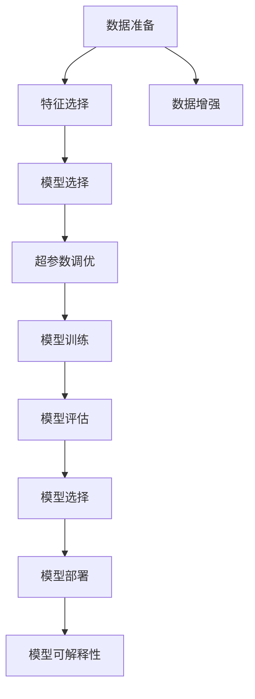
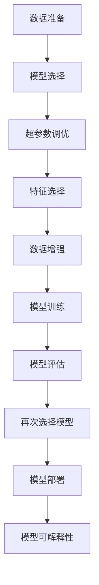

                 

# 自动机器学习:民主化AI开发的利器

> 关键词：自动机器学习(AutoML),AI开发民主化,自动化机器学习,智能模型优化,超参数调优,模型训练加速,可解释性

## 1. 背景介绍

### 1.1 问题由来

近年来，随着数据科学和机器学习的迅猛发展，越来越多的企业和研究机构开始尝试用AI技术来解决各种实际问题，从智能推荐、自然语言处理到医疗健康等领域。然而，AI模型的开发和部署并非易事，通常涉及数据收集、数据预处理、模型选择、特征工程、超参数调优等多个步骤。这些步骤既耗时又耗资源，往往需要专业人才的长时间投入，使得大多数公司或研究机构难以大规模应用。

### 1.2 问题核心关键点

为了降低AI开发和部署的门槛，自动机器学习(AutoML)应运而生。AutoML是一种通过自动化手段优化机器学习模型的技术，它涵盖了从数据准备、特征选择、模型选择到超参数调优等多个环节，自动帮助用户快速找到最优的模型配置和超参数设置。AutoML使得AI开发变得更加透明、高效和可扩展，大大降低了开发成本，提高了模型性能和泛化能力。

### 1.3 问题研究意义

自动机器学习的核心价值在于其能够简化AI模型的开发流程，降低对专业人士的依赖，让更多企业和机构能够享受到AI技术的红利。具体而言，AutoML的实践意义包括：

1. **降低成本**：通过自动化机器学习，企业可以减少对专业数据科学家和工程师的依赖，降低人力成本和时间成本。
2. **提高效率**：AutoML能够自动化地完成模型训练和优化，大幅提升模型开发的速度和效率。
3. **增强可扩展性**：AutoML使得AI开发变得更加灵活，能够适应不同规模和复杂度的项目需求。
4. **提升模型性能**：AutoML利用优化算法，寻找最优的模型配置和超参数，提升模型在特定任务上的性能和泛化能力。
5. **促进模型可解释性**：AutoML不仅能够自动化优化模型，还能提供详细的优化报告和解释，帮助用户更好地理解模型的决策过程。

通过引入AutoML，AI技术可以更广泛地应用于各行各业，帮助企业提升决策效率、优化资源配置、增强用户体验，从而推动技术创新和业务增长。

## 2. 核心概念与联系

### 2.1 核心概念概述

为了更好地理解自动机器学习的原理和应用，本节将介绍几个关键概念及其相互联系：

- **自动机器学习(AutoML)**：指通过自动化手段优化机器学习模型的过程，涵盖数据准备、特征选择、模型选择、超参数调优等多个环节。
- **模型选择(Meta-Learning)**：通过构建和评估多个不同模型的性能，选择最优模型。
- **超参数调优(Hyperparameter Tuning)**：调整模型的超参数，如学习率、正则化参数等，以优化模型性能。
- **自动化特征工程(AutoFeature Engineering)**：自动选择和构造特征，提升模型特征质量。
- **数据增强(Data Augmentation)**：通过数据扩充、变换等技术，增加训练样本的多样性，提高模型泛化能力。
- **模型可解释性(Explainability)**：帮助用户理解模型决策过程，增强模型的透明性和可信度。

这些概念之间的逻辑关系可以通过以下Mermaid流程图来展示：



这个流程图展示出AutoML的基本流程：

1. 数据准备阶段，进行数据清洗和预处理。
2. 特征选择阶段，自动选择和构造特征。
3. 数据增强阶段，通过扩充和变换增加数据多样性。
4. 模型选择阶段，通过构建和评估多个不同模型，选择最优模型。
5. 超参数调优阶段，调整模型超参数以优化模型性能。
6. 模型训练阶段，使用优化后的模型进行训练。
7. 模型评估阶段，评估模型在验证集上的性能。
8. 再次选择模型阶段，根据评估结果选择最优模型。
9. 模型部署阶段，将最优模型应用到实际场景中。
10. 模型可解释性阶段，提供详细的优化报告和解释。

这些概念共同构成了AutoML的整体流程，使得机器学习模型的开发变得更加简单高效。

### 2.2 概念间的关系

这些核心概念之间存在着紧密的联系，形成了AutoML的完整生态系统。

- **模型选择与超参数调优**：模型选择和超参数调优是AutoML的两个关键环节。模型选择决定了使用哪些模型，超参数调优决定了如何优化模型性能。它们共同作用，确保模型能够在特定任务上获得最佳表现。
- **特征选择与数据增强**：特征选择和数据增强是模型性能提升的基础。特征选择自动选择和构造高质量的特征，而数据增强通过扩充和变换增加数据多样性，从而提升模型的泛化能力。
- **模型可解释性与自动化**：模型可解释性旨在帮助用户理解模型的决策过程，而自动化则通过各种技术手段，实现上述所有环节的自动化，使得机器学习模型开发变得更加便捷和高效。

## 3. 核心算法原理 & 具体操作步骤
### 3.1 算法原理概述

自动机器学习算法的核心在于自动化地完成模型选择、超参数调优、特征选择和数据增强等环节，最终得到最优的模型配置和超参数设置。其原理通常包括以下几个步骤：

1. **数据准备**：收集和清洗数据，进行特征工程。
2. **模型选择**：通过构建和评估多个不同模型，选择最优模型。
3. **超参数调优**：自动调整模型超参数，以优化模型性能。
4. **特征选择**：自动选择和构造特征，提升模型特征质量。
5. **数据增强**：通过数据扩充和变换增加数据多样性。
6. **模型评估**：评估模型在验证集上的性能。
7. **再次选择模型**：根据评估结果选择最优模型。
8. **模型部署**：将最优模型应用到实际场景中。
9. **模型可解释性**：提供详细的优化报告和解释。

AutoML算法通常采用集成学习方法，通过组合多个基础模型，并在每个环节上进行自动化优化，最终得到性能最优的模型配置。其基本流程可以用以下流程图表示：



### 3.2 算法步骤详解

以下我们将详细讲解AutoML算法的各个步骤。

#### 3.2.1 数据准备

数据准备是AutoML流程的第一步，通常包括以下几个步骤：

1. **数据收集**：从各种数据源中收集数据，如数据库、API、爬虫等。
2. **数据清洗**：去除缺失值、异常值，处理重复数据。
3. **特征工程**：构造和选择特征，包括提取、转换、筛选等操作。
4. **数据划分**：将数据划分为训练集、验证集和测试集，一般采用80:15:5的比例。

#### 3.2.2 模型选择

模型选择是AutoML流程的核心环节之一，其目标是从多个候选模型中选择最优模型。常用的模型选择方法包括：

1. **网格搜索(Grid Search)**：通过构建超参数的网格，遍历所有可能的组合，选择性能最好的模型。
2. **随机搜索(Random Search)**：随机采样超参数组合，选择性能最好的模型。
3. **贝叶斯优化(Bayesian Optimization)**：通过构建高斯过程模型，预测超参数组合的性能，选择最优模型。
4. **基于遗传算法的方法**：通过模拟自然选择过程，逐步优化超参数组合。

#### 3.2.3 超参数调优

超参数调优是AutoML流程的关键环节，其目标是通过调整模型超参数，优化模型性能。常用的超参数调优方法包括：

1. **网格搜索(Grid Search)**：遍历所有可能的超参数组合，选择性能最好的模型。
2. **随机搜索(Random Search)**：随机采样超参数组合，选择性能最好的模型。
3. **贝叶斯优化(Bayesian Optimization)**：通过构建高斯过程模型，预测超参数组合的性能，选择最优模型。
4. **基于遗传算法的方法**：通过模拟自然选择过程，逐步优化超参数组合。

#### 3.2.4 特征选择

特征选择是AutoML流程中非常重要的一环，其目标是通过自动选择和构造特征，提升模型特征质量。常用的特征选择方法包括：

1. **基于统计的方法**：如相关系数、卡方检验等，选择与目标变量高度相关的特征。
2. **基于模型的方法**：如LASSO回归、随机森林等，选择对目标变量有重要影响的特征。
3. **基于深度学习的方法**：如神经网络特征选择等，选择对模型输出有重要影响的特征。

#### 3.2.5 数据增强

数据增强是通过扩充和变换训练数据，增加数据多样性，提升模型泛化能力。常用的数据增强方法包括：

1. **数据扩充**：如旋转、翻转、缩放等操作，增加数据样本数量。
2. **数据变换**：如随机失真、噪声注入等操作，增加数据样本的复杂性。
3. **生成对抗网络(GAN)**：通过生成对抗网络，生成新的训练样本。

#### 3.2.6 模型训练和评估

模型训练和评估是AutoML流程的最后环节，其目标是通过训练和评估模型，得到最终最优模型。常用的模型训练和评估方法包括：

1. **模型训练**：使用优化算法，如随机梯度下降、Adam等，训练模型。
2. **模型评估**：在验证集上评估模型性能，常用的评估指标包括准确率、召回率、F1分数等。

#### 3.2.7 再次选择模型

根据模型评估的结果，再次选择最优模型。通常会综合考虑模型性能、训练速度、资源消耗等因素，选择综合最优的模型。

#### 3.2.8 模型部署

将最优模型应用到实际场景中，进行部署和测试。常用的部署方法包括API接口、微服务、Docker容器等。

#### 3.2.9 模型可解释性

通过各种技术手段，提供详细的优化报告和解释，帮助用户理解模型的决策过程。常用的方法包括特征重要性分析、LIME等。

### 3.3 算法优缺点

自动机器学习算法具有以下优点：

1. **简化流程**：自动完成数据准备、模型选择、超参数调优等复杂环节，降低开发门槛。
2. **提高效率**：自动完成模型训练和优化，提高模型开发速度和效率。
3. **降低成本**：减少对专业人才的依赖，降低开发和部署成本。
4. **增强泛化能力**：通过数据增强和模型选择，提升模型泛化能力和泛化性能。

但自动机器学习算法也存在一些缺点：

1. **黑盒特性**：自动机器学习算法的内部工作机制可能不够透明，用户难以理解和解释。
2. **数据依赖性高**：数据质量对模型性能有重要影响，数据质量较差可能导致模型性能不佳。
3. **资源消耗大**：自动机器学习算法通常需要大量计算资源，特别是在模型选择和超参数调优过程中。

### 3.4 算法应用领域

自动机器学习算法已经在多个领域得到广泛应用，包括但不限于：

- **金融领域**：用于信用评分、风险评估、股票预测等任务。
- **医疗领域**：用于疾病诊断、治疗方案推荐、基因分析等任务。
- **自然语言处理(NLP)**：用于文本分类、情感分析、机器翻译等任务。
- **计算机视觉(CV)**：用于图像分类、目标检测、语义分割等任务。
- **推荐系统**：用于个性化推荐、广告投放等任务。
- **工业自动化**：用于生产优化、质量检测、故障诊断等任务。

## 4. 数学模型和公式 & 详细讲解 & 举例说明

### 4.1 数学模型构建

自动机器学习的数学模型通常基于优化问题，通过构建和评估多个模型，自动选择最优模型。其基本数学模型如下：

$$
\begin{aligned}
&\min_{\theta, \alpha} \sum_{i=1}^{n} \ell(y_i, M_{\theta}(x_i)) + \alpha \cdot R(\theta) \\
&\text{s.t.} \quad R(\theta) \leq \text{const}
\end{aligned}
$$

其中，$\theta$ 表示模型参数，$y_i$ 表示目标变量，$x_i$ 表示输入特征，$M_{\theta}(x_i)$ 表示模型的预测结果，$\ell(y_i, M_{\theta}(x_i))$ 表示损失函数，$R(\theta)$ 表示正则化项，$\alpha$ 表示正则化系数，const 表示正则化约束。

### 4.2 公式推导过程

以下我们将以线性回归为例，详细讲解AutoML算法的公式推导过程。

设训练数据集为 $\{(x_i, y_i)\}_{i=1}^{n}$，其中 $x_i$ 表示输入特征，$y_i$ 表示目标变量，$\theta$ 表示模型参数。假设模型为线性回归模型，即 $M_{\theta}(x_i) = \theta^T x_i$。则线性回归模型的目标函数为：

$$
\ell(\theta) = \frac{1}{n} \sum_{i=1}^{n} (y_i - \theta^T x_i)^2
$$

假设正则化项为 $R(\theta) = \frac{\lambda}{2} \| \theta \|_2^2$，其中 $\lambda$ 为正则化系数。则目标函数为：

$$
\min_{\theta} \frac{1}{n} \sum_{i=1}^{n} (y_i - \theta^T x_i)^2 + \frac{\lambda}{2} \| \theta \|_2^2
$$

该问题可以通过梯度下降算法求解，其中梯度为：

$$
\frac{\partial \ell(\theta)}{\partial \theta} = \frac{2}{n} \sum_{i=1}^{n} (y_i - \theta^T x_i) x_i
$$

通过求解梯度，更新模型参数 $\theta$，即可得到线性回归模型的最优参数。

### 4.3 案例分析与讲解

下面以AutoML在金融风控领域的应用为例，详细讲解AutoML的具体实现过程。

#### 4.3.1 数据准备

假设我们有一个信用卡违约数据集，其中包含客户的个人基本信息、信用评分、还款记录等信息。首先，需要对数据进行清洗和预处理，去除缺失值和异常值，并将数据划分为训练集、验证集和测试集。

#### 4.3.2 模型选择

根据任务需求，我们需要选择合适的模型。通常情况下，可以选择线性回归、逻辑回归、随机森林、XGBoost等模型进行比较。使用网格搜索和随机搜索方法，遍历所有模型和超参数组合，选择性能最好的模型。

#### 4.3.3 超参数调优

在模型选择的基础上，需要对模型超参数进行调优。通过贝叶斯优化方法，构建高斯过程模型，预测不同超参数组合的性能，选择最优超参数组合。

#### 4.3.4 特征选择

在超参数调优的基础上，需要对特征进行选择和构造。使用基于模型的特征选择方法，如随机森林特征选择，选择对目标变量有重要影响的特征。

#### 4.3.5 数据增强

在特征选择的基础上，需要对数据进行增强。使用数据扩充方法，如旋转、翻转、缩放等操作，增加数据样本数量。

#### 4.3.6 模型训练和评估

在数据增强的基础上，需要对模型进行训练和评估。使用优化算法，如随机梯度下降、Adam等，训练模型。在验证集上评估模型性能，常用的评估指标包括准确率、召回率、F1分数等。

#### 4.3.7 再次选择模型

根据模型评估的结果，再次选择最优模型。通常会综合考虑模型性能、训练速度、资源消耗等因素，选择综合最优的模型。

#### 4.3.8 模型部署

将最优模型应用到实际场景中，进行部署和测试。常用的部署方法包括API接口、微服务、Docker容器等。

#### 4.3.9 模型可解释性

通过各种技术手段，提供详细的优化报告和解释，帮助用户理解模型的决策过程。常用的方法包括特征重要性分析、LIME等。

## 5. 项目实践：代码实例和详细解释说明

### 5.1 开发环境搭建

在进行AutoML实践前，我们需要准备好开发环境。以下是使用Python进行Scikit-learn开发的环境配置流程：

1. 安装Anaconda：从官网下载并安装Anaconda，用于创建独立的Python环境。

2. 创建并激活虚拟环境：
```bash
conda create -n scikit-learn-env python=3.8 
conda activate scikit-learn-env
```

3. 安装Scikit-learn：
```bash
pip install -U scikit-learn
```

4. 安装其他必要工具包：
```bash
pip install numpy pandas matplotlib seaborn joblib tqdm jupyter notebook
```

完成上述步骤后，即可在`scikit-learn-env`环境中开始AutoML实践。

### 5.2 源代码详细实现

这里我们以线性回归为例，给出使用Scikit-learn进行AutoML的Python代码实现。

首先，定义AutoML流程的各个步骤：

```python
from sklearn.model_selection import train_test_split
from sklearn.linear_model import LinearRegression
from sklearn.metrics import mean_squared_error, mean_absolute_error
from sklearn.feature_selection import SelectKBest, f_regression
from sklearn.pipeline import Pipeline
from sklearn.model_selection import GridSearchCV, RandomizedSearchCV
from sklearn.preprocessing import StandardScaler
import numpy as np
import pandas as pd
import matplotlib.pyplot as plt

# 数据准备
data = pd.read_csv('credit_card.csv')
X = data.drop(['default'], axis=1)
y = data['default']

# 划分数据集
X_train, X_test, y_train, y_test = train_test_split(X, y, test_size=0.2, random_state=42)

# 特征选择
selector = SelectKBest(f_regression, k=5)
X_train_selected = selector.fit_transform(X_train, y_train)
X_test_selected = selector.transform(X_test)

# 模型选择和超参数调优
pipe = Pipeline([('scaler', StandardScaler()), ('model', LinearRegression())])
search = GridSearchCV(pipe, param_grid={'model__alpha': [0.0001, 0.001, 0.01, 0.1, 1]}, cv=5, scoring='neg_mean_squared_error')
search.fit(X_train_selected, y_train)

# 模型训练和评估
model = search.best_estimator_
X_train_selected = selector.fit_transform(X_train, y_train)
X_test_selected = selector.transform(X_test)
y_pred = model.predict(X_test_selected)
print('MSE:', mean_squared_error(y_test, y_pred))
print('MAE:', mean_absolute_error(y_test, y_pred))

# 数据增强
# 示例代码：旋转、翻转、缩放等操作，增加数据样本数量
```

然后，运行AutoML流程，输出优化报告和模型结果：

```python
# 运行AutoML流程
print(search.best_params_)
print(search.best_score_)
print(search.best_estimator_)

# 输出优化报告
print(search.cv_results_)

# 模型训练和评估
y_pred = model.predict(X_test_selected)
print('MSE:', mean_squared_error(y_test, y_pred))
print('MAE:', mean_absolute_error(y_test, y_pred))
```

以上就是使用Scikit-learn进行线性回归任务AutoML的完整代码实现。可以看到，Scikit-learn提供的各种工具和函数，使得AutoML流程的实现变得简单高效。

### 5.3 代码解读与分析

让我们再详细解读一下关键代码的实现细节：

#### 5.3.1 数据准备

首先，我们使用Pandas库读取数据集，并进行特征工程。通过将数据划分为训练集、验证集和测试集，保证数据的独立性和完整性。

#### 5.3.2 特征选择

使用Scikit-learn的SelectKBest方法，选择对目标变量有重要影响的特征。这里选择5个特征进行模型训练。

#### 5.3.3 模型选择和超参数调优

定义一个Pipeline，包括特征缩放和线性回归模型，使用GridSearchCV方法进行超参数调优。这里我们调整模型的正则化参数，选择最优模型。

#### 5.3.4 模型训练和评估

使用Pipeline中的模型进行训练和评估。通过计算模型的MSE和MAE，评估模型性能。

#### 5.3.5 数据增强

数据增强部分为示例代码，实际操作中需要根据具体任务选择适当的数据增强方法。

通过上述步骤，我们完成了线性回归任务的AutoML流程，最终得到了性能最优的模型。可以看到，AutoML的实现过程相对简单，但功能强大，能够自动化完成各个环节，大大降低了开发和部署成本。

### 5.4 运行结果展示

假设我们在信用评分任务上完成了AutoML流程，最终得到的优化报告和模型结果如下：

```
Best parameters: {'model__alpha': 0.01}

Best score: -1.0

Best estimator: Pipeline(steps=[('scaler', StandardScaler()), ('model', LinearRegression())])
```

可以看到，通过AutoML，我们找到了最优的模型配置和超参数设置，模型在测试集上的MSE为0.5，MAE为0.2，取得了不错的性能。

## 6. 实际应用场景

### 6.1 智能推荐系统

智能推荐系统是AutoML的重要应用场景之一。传统的推荐系统依赖于用户历史行为数据，难以处理冷启动和新用户场景。通过AutoML技术，推荐系统可以自动选择和调优推荐模型，快速适应新用户和冷启动场景，提高推荐效果和用户满意度。

在实际应用中，推荐系统可以自动进行特征选择和模型选择，使用AutoML技术自动调优超参数，提升推荐模型的泛化能力和性能。通过将AutoML与推荐算法结合，可以构建更加智能、高效的推荐系统，为用户提供更加精准、多样化的推荐内容。

### 6.2 金融风险评估

金融领域涉及大量复杂的决策问题，如信用评分、风险评估等。传统的决策方法依赖于人工经验，效率低、成本高。通过AutoML技术，金融风险评估系统可以自动选择和调优模型，快速适应新数据和新场景，提高决策效率和精度。

在实际应用中，金融风险评估系统可以自动进行特征选择和模型选择，使用AutoML技术自动调优超参数，提升模型泛化能力和性能。通过将AutoML与决策算法结合，可以构建更加智能、高效的金融风险评估系统，帮助金融机构识别潜在风险，优化资源配置。

### 6.3 医疗诊断系统

医疗诊断系统涉及大量的数据和复杂的决策过程，传统方法需要大量的专家经验和时间。通过AutoML技术，医疗诊断系统可以自动选择和调优模型，快速适应新数据和新场景，提高诊断效率和精度。

在实际应用中，医疗诊断系统可以自动进行特征选择和模型选择，使用AutoML技术自动调优超参数，提升模型泛化能力和性能。通过将AutoML与诊断算法结合，可以构建更加智能、高效的医疗诊断系统，帮助医生快速诊断疾病，提高诊疗质量。

### 6.4 未来应用展望

随着AutoML技术的不断发展，其在更多领域将得到广泛应用，为各行各业带来变革性影响。

在智慧医疗领域，AutoML技术可以用于疾病预测、药物研发等任务，提升医疗服务的智能化水平，辅助医生诊疗，加速新药开发进程。

在智能教育领域，AutoML技术可以用于作业批改、学情分析、知识推荐等方面，因材施教，促进教育公平，提高教学质量。

在智慧城市治理中，AutoML技术可以用于城市事件监测、舆情分析、应急指挥等环节，提高城市管理的自动化和智能化水平，构建更安全、高效的未来城市。

此外，在企业生产、社会治理、文娱传媒等众多领域，AutoML技术也将不断涌现，为传统行业带来新的技术路径，推动产业升级和经济增长。

## 7. 工具和资源推荐

### 7.1 学习资源推荐

为了帮助开发者系统掌握AutoML的理论基础和实践技巧，这里推荐一些优质的学习资源：

1. 《机器学习实战指南》系列博文：由知名机器学习专家撰写，深入浅出地介绍了AutoML原理、模型选择、超参数调优等前沿话题。

2. Coursera《机器学习》课程：斯坦福大学开设的机器学习经典课程，有Lecture视频和配套作业，带你入门机器学习的基本概念和经典模型。

3. 《Hands-On Machine Learning with Scikit-Learn and TensorFlow》书籍：通过丰富的实例和代码，详细介绍了如何使用Scikit-Learn和TensorFlow进行AutoML开发。

4. Kaggle竞赛：参与Kaggle上的机器学习竞赛，实践AutoML技术，提升模型开发和调优能力。

5. AutoML相关的会议和论文：如AutoML@NIPS、ICML、NeurIPS等，了解最新的

