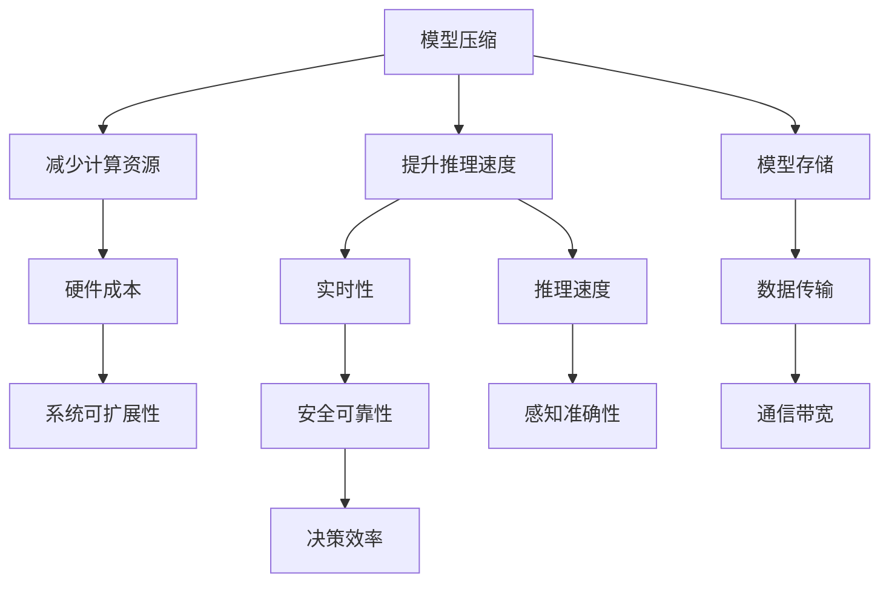

                 

# 自动驾驶中的模型压缩与加速技术

## 1. 背景介绍

随着自动驾驶技术的快速发展，车辆中的计算模型越来越复杂，对实时性和精确度提出了更高的要求。然而，在自动驾驶系统中，模型的计算量巨大，往往需要高性能的计算资源。为了满足这些需求，同时减少能源消耗和硬件成本，模型压缩与加速技术变得尤为重要。本博客将详细探讨这一话题，包括自动驾驶中模型压缩的必要性、关键技术和实际应用。

## 2. 核心概念与联系

### 2.1 核心概念概述

- **模型压缩（Model Compression）**：是指在不损失模型性能的前提下，减小模型的大小，减少计算资源消耗和存储需求的技术。
- **模型加速（Model Acceleration）**：通过优化模型结构和计算过程，提高模型推理速度，满足实时性需求。
- **自动驾驶（Autonomous Driving）**：通过计算机视觉、传感器融合、路径规划等技术，实现车辆自主行驶。
- **计算资源（Computational Resources）**：包括CPU、GPU、FPGA等计算硬件，以及存储器、网络带宽等辅助资源。

这些概念之间有着密切的联系，模型压缩与加速技术的提升，可以显著降低自动驾驶系统的计算负担，提升行驶安全性和实时性，从而更好地满足自动驾驶的要求。

### 2.2 核心概念间的关系

自动驾驶系统对模型的实时性和精度要求极高，因此需要综合考虑模型压缩和加速技术的应用，以降低计算复杂度和硬件成本，同时保障驾驶的安全性和可靠性。

以下是关键概念间的关系图：



通过使用模型压缩与加速技术，可以降低自动驾驶系统的计算复杂度，减少硬件成本，提高推理速度，从而提升系统的实时性和安全可靠性。同时，系统可扩展性也会得到改善，能够更好地应对未来的技术更新和应用场景扩展。

## 3. 核心算法原理 & 具体操作步骤

### 3.1 算法原理概述

模型压缩与加速的核心目标是优化模型结构，减少计算量和存储需求，同时提升推理速度。常用的技术手段包括模型剪枝（Pruning）、量化（Quantization）、知识蒸馏（Knowledge Distillation）等。

**模型剪枝**：通过去除模型中不必要的连接和参数，减小模型大小和计算量。常用的剪枝方法包括结构化剪枝、权重剪枝、联合剪枝等。

**量化**：将模型参数从高精度（如32位浮点数）转换为低精度（如8位整数），以减少计算资源和存储需求。量化分为静态量化和动态量化，静态量化适用于推理场景，动态量化适用于训练场景。

**知识蒸馏**：通过将大型模型的知识（如权重、特征映射等）转移到小型模型中，提升小型模型的性能。常用的蒸馏方法包括单向蒸馏和双向蒸馏，双向蒸馏可以进一步提升小型模型的准确性和泛化能力。

### 3.2 算法步骤详解

以下是模型压缩与加速的一般步骤：

1. **数据准备**：收集并预处理自动驾驶相关的数据集，用于训练和验证模型压缩和加速技术的效果。

2. **模型设计**：选择合适的预训练模型，如ResNet、Inception、MobileNet等，根据自动驾驶任务的特点进行微调。

3. **模型压缩**：
   - **剪枝**：使用剪枝算法对模型进行结构化剪枝或权重剪枝，去除冗余连接和参数。
   - **量化**：根据自动驾驶任务的需求，选择静态量化或动态量化，优化模型参数的精度。

4. **模型加速**：
   - **优化算法**：选择合适的优化算法，如梯度下降、Adam、SGD等，进行模型训练。
   - **模型结构优化**：使用网络结构优化技术，如网络剪枝、神经网络架构搜索（NAS）等，设计更高效的模型结构。

5. **模型评估**：在测试集上评估压缩和加速后的模型性能，确保在不损失性能的情况下，大幅减少计算资源和存储需求。

### 3.3 算法优缺点

**优点**：
- **计算效率提升**：通过优化模型结构和参数，显著提高模型的推理速度，满足实时性需求。
- **资源消耗减少**：压缩模型大小，降低硬件成本和功耗。
- **模型泛化能力增强**：通过知识蒸馏等技术，提升小型模型的泛化能力和性能。

**缺点**：
- **精度损失**：压缩和量化可能会带来一定的精度损失，需要仔细权衡。
- **模型结构复杂**：优化后的模型结构可能比原模型更加复杂，需要更多的计算资源进行推理。
- **训练难度增加**：优化后的模型需要更多的训练时间和计算资源，可能影响模型收敛速度。

### 3.4 算法应用领域

模型压缩与加速技术在自动驾驶领域有广泛的应用：

- **感知模块**：优化摄像头、激光雷达等传感器数据处理模型的计算和存储需求，提升实时性和准确性。
- **路径规划**：优化路径规划算法的计算复杂度，提高车辆行驶决策的效率。
- **环境理解**：优化环境理解模型的结构，提升对复杂交通环境的适应能力。
- **通信协议**：优化车联网通信协议的计算复杂度，保障车辆间的实时通信和数据交互。

## 4. 数学模型和公式 & 详细讲解

### 4.1 数学模型构建

假设原模型参数大小为 $C$，压缩后的模型参数大小为 $C'$，设压缩率为 $r=\frac{C'}{C}$，则压缩后的模型大小为原模型的 $r$ 倍。

模型剪枝后，非零权重连接数减少 $p$，则压缩率 $r$ 可以表示为：
$$ r = \frac{C' - (C - p)}{C} $$

量化后的模型参数精度从 $b$ 位变为 $b'$ 位，则压缩率 $r$ 可以表示为：
$$ r = \frac{C'}{C} = \frac{b}{b'} $$

知识蒸馏后，模型参数数量减少 $q$，则压缩率 $r$ 可以表示为：
$$ r = \frac{C'}{C} = 1 - \frac{q}{C} $$

### 4.2 公式推导过程

假设原模型参数数量为 $C$，压缩后的模型参数数量为 $C'$，则压缩率 $r$ 可以表示为：
$$ r = \frac{C'}{C} $$

设原模型推理时间与计算资源成正比，记为 $t_C$，推理速度为 $v_C$，则有：
$$ v_C = \frac{1}{t_C} $$

压缩后的模型推理时间与计算资源成正比，记为 $t_{C'}$，推理速度为 $v_{C'}$，则有：
$$ v_{C'} = \frac{1}{t_{C'}} $$

由于压缩后的模型参数数量为原模型的 $r$ 倍，推理速度提升的倍数为 $k$，则有：
$$ v_{C'} = kv_C $$

根据压缩率 $r$ 和推理速度提升倍数 $k$，可以推导出模型压缩后推理速度的提升倍数：
$$ k = \frac{v_{C'}}{v_C} = \frac{1}{r} $$

### 4.3 案例分析与讲解

**案例1：模型剪枝**

假设原模型参数大小为 $C=10M$，剪枝后非零权重连接数减少 $p=5M$，则压缩率为：
$$ r = \frac{C' - (C - p)}{C} = \frac{5M}{10M} = 0.5 $$

**案例2：量化**

假设原模型参数精度为 $b=32$，量化后参数精度为 $b'=8$，则压缩率为：
$$ r = \frac{C'}{C} = \frac{b}{b'} = \frac{32}{8} = 4 $$

**案例3：知识蒸馏**

假设原模型参数数量为 $C=10M$，蒸馏后参数数量减少 $q=3M$，则压缩率为：
$$ r = \frac{C'}{C} = 1 - \frac{q}{C} = 1 - \frac{3M}{10M} = 0.7 $$

## 5. 项目实践：代码实例和详细解释说明

### 5.1 开发环境搭建

在进行模型压缩与加速实践前，需要搭建好开发环境。以下是使用PyTorch和TensorFlow进行开发的环境配置流程：

1. 安装Anaconda：从官网下载并安装Anaconda，用于创建独立的Python环境。

2. 创建并激活虚拟环境：
```bash
conda create -n pytorch-env python=3.8 
conda activate pytorch-env
```

3. 安装PyTorch：根据CUDA版本，从官网获取对应的安装命令。例如：
```bash
conda install pytorch torchvision torchaudio cudatoolkit=11.1 -c pytorch -c conda-forge
```

4. 安装TensorFlow：
```bash
pip install tensorflow
```

5. 安装各类工具包：
```bash
pip install numpy pandas scikit-learn matplotlib tqdm jupyter notebook ipython
```

完成上述步骤后，即可在`pytorch-env`环境中开始模型压缩与加速实践。

### 5.2 源代码详细实现

这里以使用PyTorch对MobileNet模型进行剪枝和量化为例，给出源代码实现。

首先，定义剪枝和量化函数：

```python
import torch
import torch.nn as nn
from torch.nn.utils import prune

def prune_model(model, prune_ratio=0.5):
    prune.L1Unstructured(model, name='weight', amount=prune_ratio*sum(p.numel() for p in model.parameters()))

def quantize_model(model, bitwidth=8):
    qconfig = torch.utils.quantization.get_default_qconfig('fbgemm')
    qconfig = torch.utils.quantization.fuse_modules(qconfig, [['conv.weight'])
    qconfig.observer = torch.utils.quantization.observer observing_uint8 if bitwidth == 8 else observing_int8
    qconfig.calculate_qparams = True
    qconfig.dynamic = False
    model.qconfig = qconfig
```

然后，定义模型和数据集：

```python
from torchvision.models import MobileNet

model = MobileNet()

prune_model(model)
quantize_model(model)

train_dataset = ...
val_dataset = ...
test_dataset = ...
```

接着，定义训练和评估函数：

```python
from torch.utils.data import DataLoader
from torch.nn import CrossEntropyLoss
from torch.optim import Adam

device = torch.device('cuda') if torch.cuda.is_available() else torch.device('cpu')
model.to(device)

criterion = CrossEntropyLoss()
optimizer = Adam(model.parameters(), lr=0.001)

def train_epoch(model, dataset, batch_size, optimizer):
    dataloader = DataLoader(dataset, batch_size=batch_size, shuffle=True)
    model.train()
    for batch in dataloader:
        inputs, labels = batch
        inputs, labels = inputs.to(device), labels.to(device)
        optimizer.zero_grad()
        outputs = model(inputs)
        loss = criterion(outputs, labels)
        loss.backward()
        optimizer.step()

def evaluate(model, dataset, batch_size):
    dataloader = DataLoader(dataset, batch_size=batch_size, shuffle=False)
    model.eval()
    correct = 0
    total = 0
    with torch.no_grad():
        for batch in dataloader:
            inputs, labels = batch
            inputs, labels = inputs.to(device), labels.to(device)
            outputs = model(inputs)
            _, predicted = torch.max(outputs.data, 1)
            total += labels.size(0)
            correct += (predicted == labels).sum().item()
    print('Accuracy: {:.2f}%'.format(100 * correct / total))
```

最后，启动训练流程并在测试集上评估：

```python
epochs = 10
batch_size = 64

for epoch in range(epochs):
    train_epoch(model, train_dataset, batch_size, optimizer)
    evaluate(model, val_dataset, batch_size)

print('Test accuracy:', evaluate(model, test_dataset, batch_size))
```

以上就是使用PyTorch对MobileNet模型进行剪枝和量化的完整代码实现。可以看到，使用PyTorch进行模型压缩与加速的代码实现相对简洁高效。

### 5.3 代码解读与分析

让我们再详细解读一下关键代码的实现细节：

**剪枝函数**：
- 使用`prune.L1Unstructured`函数对模型进行L1范数剪枝，去除部分非零权重连接。
- `name='weight'`指定剪枝的对象为卷积层的权重。
- `amount`表示剪枝比例，这里设置为0.5，即去除一半的权重连接。

**量化函数**：
- 使用`torch.utils.quantization`模块进行量化，`get_default_qconfig`获取默认量化配置，`fuse_modules`对模型进行模块融合。
- `observer`指定观察器类型，`observing_uint8`表示使用8位整数量化，`observing_int8`表示使用8位整数量化。
- `calculate_qparams`计算量化参数，`dynamic`设置为False，表示使用静态量化。

**训练和评估函数**：
- 定义`train_epoch`函数，对数据进行批次化加载，进行前向传播和反向传播，更新模型参数。
- 定义`evaluate`函数，对模型在测试集上进行评估，输出准确率。

**训练流程**：
- 定义总的epoch数和batch size，开始循环迭代。
- 每个epoch内，在训练集上训练，在验证集上评估。
- 所有epoch结束后，在测试集上评估，给出最终测试结果。

可以看到，使用PyTorch进行模型压缩与加速的代码实现相对简洁高效，开发者可以将更多精力放在数据处理、模型改进等高层逻辑上，而不必过多关注底层的实现细节。

## 6. 实际应用场景

### 6.1 智能导航系统

在智能导航系统中，模型压缩与加速技术可以显著提升地图渲染和路径规划的速度，从而提高导航系统的实时性和用户体验。例如，使用剪枝和量化技术对深度学习模型进行压缩，可以在保持高精度的同时，减少计算资源和存储需求，显著提高地图渲染和路径规划的效率。

### 6.2 自动驾驶感知模块

自动驾驶感知模块需要处理大量的传感器数据，包括摄像头、激光雷达等。模型压缩与加速技术可以优化感知模块的计算和存储需求，提高实时性，从而提升自动驾驶的安全性和可靠性。例如，使用剪枝和量化技术对感知模型进行压缩，可以减少计算资源和存储需求，提高感知模块的实时性和准确性。

### 6.3 自动驾驶决策系统

自动驾驶决策系统需要实时处理大量的环境信息，进行路径规划和行驶决策。模型压缩与加速技术可以优化决策系统的计算复杂度，提高决策速度，从而提升行驶效率和安全性。例如，使用剪枝和量化技术对决策模型进行压缩，可以减少计算资源和存储需求，提高决策系统的实时性和准确性。

### 6.4 未来应用展望

随着模型压缩与加速技术的不断发展，未来在自动驾驶领域将有更多应用场景：

- **实时数据处理**：自动驾驶系统需要实时处理大量的传感器数据，模型压缩与加速技术可以优化数据处理模型的计算和存储需求，提高实时性。
- **高效决策支持**：自动驾驶决策系统需要实时进行路径规划和行驶决策，模型压缩与加速技术可以优化决策模型的计算复杂度，提高决策速度。
- **跨模态融合**：自动驾驶系统需要融合视觉、激光雷达、GPS等多种模态数据，模型压缩与加速技术可以优化跨模态融合模型的计算和存储需求，提高实时性和准确性。

## 7. 工具和资源推荐

### 7.1 学习资源推荐

为了帮助开发者系统掌握模型压缩与加速的理论基础和实践技巧，这里推荐一些优质的学习资源：

1. **《深度学习入门：模型压缩与加速》**：本书系统介绍了模型压缩与加速的基本概念和最新技术，包括剪枝、量化、知识蒸馏等方法，适合初学者入门。
2. **《PyTorch官方文档》**：PyTorch官方文档提供了详细的模型压缩与加速API和示例，帮助开发者快速上手实现压缩和加速技术。
3. **《TensorFlow量化指南》**：TensorFlow官方文档提供了量化技术的详细指南和示例，帮助开发者实现量化加速。
4. **《TensorFlow模型优化与加速》**：TensorFlow官方课程介绍了模型优化和加速的最新技术，适合进阶学习。
5. **《Model Compression and Acceleration Techniques》论文**：该论文系统介绍了模型压缩与加速的最新技术，适合深入研究。

通过对这些资源的学习实践，相信你一定能够快速掌握模型压缩与加速的精髓，并用于解决实际的自动驾驶问题。

### 7.2 开发工具推荐

高效的开发离不开优秀的工具支持。以下是几款用于模型压缩与加速开发的常用工具：

1. **PyTorch**：基于Python的开源深度学习框架，灵活动态的计算图，适合快速迭代研究。支持多种模型压缩与加速API。
2. **TensorFlow**：由Google主导开发的开源深度学习框架，生产部署方便，适合大规模工程应用。支持多种量化和剪枝技术。
3. **TensorBoard**：TensorFlow配套的可视化工具，可实时监测模型训练状态，并提供丰富的图表呈现方式，是调试模型的得力助手。
4. **Weights & Biases**：模型训练的实验跟踪工具，可以记录和可视化模型训练过程中的各项指标，方便对比和调优。
5. **TensorFlow Extended (TFX)**：用于构建、训练和部署机器学习模型的系统，支持多种模型压缩与加速技术。

合理利用这些工具，可以显著提升模型压缩与加速任务的开发效率，加快创新迭代的步伐。

### 7.3 相关论文推荐

模型压缩与加速技术的发展源于学界的持续研究。以下是几篇奠基性的相关论文，推荐阅读：

1. **《Pruning Neural Networks by Minimizing Redundancy》**：该论文提出了基于冗余度量（Redundancy Measure）的剪枝方法，通过最小化模型参数的冗余度，实现高效压缩。
2. **《Model Distillation》**：该论文提出了知识蒸馏方法，通过将大型模型的知识转移到小型模型中，提升小型模型的性能。
3. **《Quantization and Quantization-Aware Training》**：该论文详细介绍了量化技术，包括静态量化和动态量化，以及量化后的训练技巧。
4. **《Neural Architecture Search with Reinforcement Learning》**：该论文提出了基于强化学习的网络结构搜索方法，优化模型结构。
5. **《Neural Network Compression》**：该论文系统介绍了模型压缩的最新技术，包括剪枝、量化、压缩等方法。

这些论文代表了大模型压缩与加速技术的发展脉络。通过学习这些前沿成果，可以帮助研究者把握学科前进方向，激发更多的创新灵感。

除上述资源外，还有一些值得关注的前沿资源，帮助开发者紧跟模型压缩与加速技术的最新进展，例如：

1. **arXiv论文预印本**：人工智能领域最新研究成果的发布平台，包括大量尚未发表的前沿工作，学习前沿技术的必读资源。
2. **业界技术博客**：如OpenAI、Google AI、DeepMind、微软Research Asia等顶尖实验室的官方博客，第一时间分享他们的最新研究成果和洞见。
3. **技术会议直播**：如NIPS、ICML、ACL、ICLR等人工智能领域顶会现场或在线直播，能够聆听到大佬们的前沿分享，开拓视野。
4. **GitHub热门项目**：在GitHub上Star、Fork数最多的模型压缩与加速相关项目，往往代表了该技术领域的发展趋势和最佳实践，值得去学习和贡献。
5. **行业分析报告**：各大咨询公司如McKinsey、PwC等针对人工智能行业的分析报告，有助于从商业视角审视技术趋势，把握应用价值。

总之，对于模型压缩与加速技术的学习和实践，需要开发者保持开放的心态和持续学习的意愿。多关注前沿资讯，多动手实践，多思考总结，必将收获满满的成长收益。

## 8. 总结：未来发展趋势与挑战

### 8.1 总结

本文对模型压缩与加速技术在自动驾驶中的应用进行了全面系统的介绍。首先阐述了模型压缩与加速技术的必要性和核心算法原理，详细讲解了剪枝、量化和知识蒸馏等关键技术，并提供了完整的代码实例和解释说明。通过本文的系统梳理，可以看到，模型压缩与加速技术在自动驾驶系统中扮演着重要角色，可以显著提升系统的实时性和安全可靠性。

### 8.2 未来发展趋势

展望未来，模型压缩与加速技术将呈现以下几个发展趋势：

1. **更高效的压缩算法**：随着深度学习模型的不断增大，压缩算法将更加注重模型的泛化能力和推理速度，通过优化剪枝、量化等技术，实现更高效率的模型压缩。
2. **跨模态融合**：自动驾驶系统需要融合多种模态数据，模型压缩与加速技术将进一步优化跨模态融合模型的计算和存储需求，提高实时性和准确性。
3. **模型可解释性**：随着模型压缩与加速技术的不断发展，如何赋予模型更强的可解释性，使其决策过程透明、可理解，也将是未来的研究方向之一。
4. **硬件优化**：随着AI芯片的不断进步，模型压缩与加速技术将与硬件优化相结合，实现更加高效、低功耗的模型推理。

以上趋势凸显了模型压缩与加速技术的广阔前景。这些方向的探索发展，必将进一步提升自动驾驶系统的性能和应用范围，为人类交通出行带来更多的便利和安全性。

### 8.3 面临的挑战

尽管模型压缩与加速技术已经取得了瞩目成就，但在迈向更加智能化、普适化应用的过程中，仍面临诸多挑战：

1. **精度损失**：压缩和量化可能会带来一定的精度损失，如何平衡精度和效率是关键问题。
2. **模型复杂度**：优化后的模型结构可能比原模型更加复杂，需要更多的计算资源进行推理。
3. **硬件适配**：不同的硬件平台（如CPU、GPU、FPGA等）对模型压缩与加速的支持程度不同，需要针对不同平台进行优化。
4. **迁移学习**：如何在大规模自动驾驶数据集上进行模型压缩与加速，同时保持模型的泛化能力和性能，仍需进一步研究。
5. **安全性和可靠性**：模型压缩与加速技术在提升推理速度的同时，如何保证模型的安全性和可靠性，避免误判和漏洞，将是重要挑战。

正视这些挑战，积极应对并寻求突破，将使模型压缩与加速技术在未来自动驾驶领域发挥更大的作用。

### 8.4 未来突破

面对模型压缩与加速技术所面临的种种挑战，未来的研究需要在以下几个方面寻求新的突破：

1. **无监督学习**：探索无监督学习技术，通过无标注数据进行模型压缩与加速，减少对标注数据的依赖。
2. **动态优化**：开发动态优化算法，实时调整模型结构，适应不同场景和任务需求。
3. **硬件协同**：结合AI芯片的硬件特性，优化模型压缩与加速技术，实现更高效率的模型推理。
4. **模型融合**：将多种模型压缩与加速技术结合使用，取长补短，实现更高效、更安全的模型推理。
5. **模型评估**：开发新的评估指标和方法，全面评估模型压缩与加速的效果，确保模型在应用中的稳定性和可靠性。

这些研究方向的探索，必将引领模型压缩与加速技术迈向更高的台阶，为自动驾驶系统带来更多的性能提升和应用价值。

## 9. 附录：常见问题与解答

**Q1：模型压缩与加速技术是否适用于所有深度学习模型？**

A: 模型压缩与加速技术在深度学习中具有广泛的应用，适用于大多数深度学习模型，如卷积神经网络（CNN）、循环神经网络（RNN）、变压器（Transformer）等。但对于一些特定的模型结构，可能需要针对性的优化方法。

**Q2：如何评估模型压缩与加速的效果？**

A: 模型压缩与加速效果的评估通常包括模型精度、推理速度、计算资源消耗和存储需求等多个指标。可以使用标准测试集进行精度测试，使用Inference Engine等工具进行推理速度和资源消耗的评估，使用TensorBoard等工具进行可视化分析。

**Q3：模型压缩与加速技术是否会带来精度损失？**

A: 是的，压缩和量化技术可能会带来一定的精度损失。可以通过剪枝、知识蒸馏等技术，在不损失精度的前提下进行模型压缩与加速。

**Q4：模型压缩与加速技术是否会影响模型的泛化能力？**

A: 是的，压缩和量化技术可能会影响模型的泛化能力。可以通过增量学习、微调等方法，提升压缩后模型的泛化能力。

**Q5：模型压缩与加速技术是否会增加模型的训练时间？**

A: 是的，压缩和量化技术可能会增加模型的训练时间。可以通过并行训练、分布式训练等方法，加快模型的训练速度。

总之，模型压缩与加速技术是自动驾驶系统中的重要组成部分，可以通过优化模型结构和计算过程，显著提升系统的实时性和安全性。未来，随着技术的不断发展，模型压缩与加速技术将有更多创新和应用，为自动驾驶领域带来更多的价值和突破。

---

作者：禅与计算机程序设计艺术 / Zen and the Art of Computer Programming

