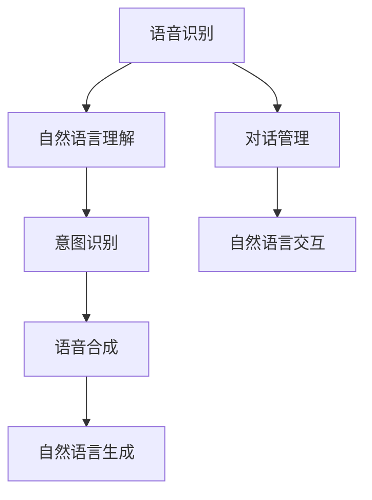

                 

## 1. 背景介绍

自动驾驶技术正日益成为现代汽车产业的重要推动力。在自动驾驶车辆中，自然语言交互（Natural Language Interaction, NLI）和语音控制（Voice Control, VC）作为人机交互的重要形式，能够提高驾驶安全性和用户体验。通过语音指令，用户能够直接与车辆进行互动，而无需分心操作。自然语言交互则能够识别用户意图，执行相应的控制任务。然而，如何将这些先进技术无缝集成到自动驾驶系统中，使其在现实复杂环境下发挥作用，是一个亟待解决的问题。

### 1.1 问题由来

在自动驾驶系统中，语音控制和自然语言交互技术的应用，能够显著提高驾驶便利性，并降低驾驶员的负担。例如，驾驶员可以通过语音指令切换音乐、调整车内温度、导航目的地等，而无需分心操作，提升了驾驶安全。此外，自然语言交互技术还能够理解用户的高级意图，如“我要前往最近的加油站”，从而执行相应的任务，使驾驶体验更加智能和便捷。

尽管如此，将语音控制和自然语言交互技术应用于自动驾驶中，仍面临诸多挑战。主要问题包括：

1. **语音识别准确性**：在嘈杂环境下，语音识别系统的准确性会受到严重影响，导致指令执行失败。
2. **意图理解能力**：自然语言交互系统需要准确理解用户意图，但在复杂语境下，用户意图往往模糊不清，难以识别。
3. **系统响应时间**：自动驾驶系统需要快速响应用户指令，否则可能导致安全问题。
4. **系统鲁棒性**：自动驾驶环境复杂多变，语音控制和自然语言交互系统需要在各种极端条件下保持稳定和可靠性。

### 1.2 问题核心关键点

解决上述问题的核心关键点包括：

1. **提升语音识别准确性**：通过改进算法和优化硬件，提升语音识别系统的鲁棒性和准确性。
2. **增强意图理解能力**：通过深度学习技术，提高自然语言处理系统的语义理解能力。
3. **缩短系统响应时间**：通过高效的计算架构和优化算法，减少系统延迟，提高响应速度。
4. **提高系统鲁棒性**：采用鲁棒性和稳定性强的算法，确保系统在不同环境下稳定运行。

### 1.3 问题研究意义

自然语言交互和语音控制技术的集成应用，将为自动驾驶带来更加智能、安全的人机交互体验。通过提升语音识别和意图理解能力，自动驾驶车辆能够更加高效、安全地执行各种任务，降低人为干预的必要性，减少交通事故发生的可能性。同时，语音控制和自然语言交互技术的应用，也将提升用户对自动驾驶系统的依赖度和满意度，加速自动驾驶技术的普及和应用。

## 2. 核心概念与联系

### 2.1 核心概念概述

为了更好地理解自动驾驶中的自然语言交互与语音控制技术，本节将介绍几个关键概念及其相互关系：

1. **语音识别 (Automatic Speech Recognition, ASR)**：将音频信号转换为文本的过程。ASR是自然语言交互的基础，用于理解用户的语音指令。
2. **自然语言理解 (Natural Language Understanding, NLU)**：将文本转换为机器可理解形式的过程。NLU用于理解用户的意图和语义，从而执行相应的控制任务。
3. **意图识别 (Intent Recognition)**：识别用户输入的意图，如“导航”、“播放音乐”等。意图识别是自然语言理解的重要环节，直接影响后续的系统执行。
4. **语音合成 (Text-to-Speech, TTS)**：将文本转换为可听语音的过程。语音合成用于执行语音控制指令，告知用户系统状态和反馈。
5. **自然语言生成 (Natural Language Generation, NLG)**：根据系统状态和逻辑生成文本的过程。NLG用于自然语言交互的反馈和引导，提高用户体验。
6. **对话管理 (Dialog Management)**：在多轮对话中，管理对话状态和上下文，确保对话流畅进行。对话管理是自然语言交互的核心，用于维持对话连贯性和一致性。

这些核心概念通过语音识别、自然语言理解、意图识别、语音合成、自然语言生成和对话管理等技术环节，共同构成了自动驾驶中自然语言交互与语音控制系统的完整生态。

### 2.2 概念间的关系

这些核心概念之间存在着紧密的联系，形成了自动驾驶中自然语言交互与语音控制系统的完整架构。通过以下Mermaid流程图，我们可以更清晰地理解这些概念之间的关系：



这个流程图展示了语音识别、自然语言理解、意图识别、语音合成、自然语言生成和对话管理等关键技术环节，以及它们在自然语言交互和语音控制中的应用。

## 3. 核心算法原理 & 具体操作步骤
### 3.1 算法原理概述

自动驾驶中的自然语言交互与语音控制系统，本质上是一个基于深度学习的多轮对话系统。其核心算法包括语音识别、自然语言理解、意图识别、语音合成、自然语言生成和对话管理。

1. **语音识别**：采用基于深度神经网络的模型，如卷积神经网络 (CNN)、循环神经网络 (RNN) 和Transformer模型，将音频信号转换为文本形式。语音识别的目标是最大化识别准确率和鲁棒性。
2. **自然语言理解**：通过序列标注、词向量表示和Transformer模型，将文本转换为机器可理解的形式，识别用户意图。自然语言理解的目的是准确理解用户输入的语义和上下文。
3. **意图识别**：基于分类和序列标注模型，识别用户的高级意图。意图识别的目标是将用户输入映射到具体的控制任务上。
4. **语音合成**：使用基于深度学习的TTS模型，如WaveNet、Tacotron等，将文本转换为可听语音。语音合成的目标是生成自然流畅的语音，以提高用户体验。
5. **自然语言生成**：通过序列生成模型，如seq2seq模型、Transformer模型，根据系统状态生成文本反馈。自然语言生成的目的是提供清晰、简洁的反馈，帮助用户理解和控制系统。
6. **对话管理**：采用基于规则和深度学习的对话管理模型，如RNN和Transformer模型，管理对话状态和上下文，确保对话流畅进行。对话管理的目标是维持对话连贯性和一致性，提高交互效率。

### 3.2 算法步骤详解

以下是对自动驾驶中自然语言交互与语音控制系统各个算法步骤的详细讲解：

**Step 1: 语音信号预处理**

1. **降噪**：通过滤波器等方法，去除环境噪声，提升语音识别的准确性。
2. **分帧**：将音频信号分割成固定长度的帧，每帧包含若干样本点。
3. **特征提取**：将分帧后的音频信号转换为MFCC特征或Mel频谱等特征形式。

**Step 2: 语音识别**

1. **声学模型训练**：使用大量标注好的音频和文本数据，训练基于深度神经网络的声学模型，如CNN、RNN、Transformer等。
2. **解码**：将预处理后的音频特征输入声学模型，解码得到文本输出。
3. **后处理**：对解码结果进行去噪、纠错和拼接等后处理操作，提升识别准确率。

**Step 3: 自然语言理解**

1. **词向量表示**：将文本转换为词向量形式，使用如Word2Vec、GloVe等预训练的词向量模型。
2. **序列标注**：使用LSTM、CRF等模型，标注每个词的词性、实体等信息。
3. **句法分析**：使用依存关系分析、句法分析等技术，理解句子结构和关系。

**Step 4: 意图识别**

1. **特征提取**：提取文本特征，如词向量、句法结构等。
2. **分类模型训练**：使用分类模型，如SVM、RNN、CNN等，训练意图识别模型。
3. **预测意图**：将文本特征输入意图识别模型，预测用户意图。

**Step 5: 语音合成**

1. **特征提取**：将待合成的文本转换为声学特征，如MFCC、Mel频谱等。
2. **声码器训练**：使用WaveNet、Tacotron等声码器模型，训练声码器。
3. **合成语音**：将声学特征输入声码器，生成可听语音。

**Step 6: 自然语言生成**

1. **语义理解**：理解当前对话状态和用户意图。
2. **生成文本**：使用seq2seq模型、Transformer模型等，生成自然语言文本。
3. **后处理**：对生成文本进行拼写检查、语法校正等后处理操作。

**Step 7: 对话管理**

1. **状态管理**：维护当前对话状态，包括用户意图、上下文等。
2. **上下文更新**：根据用户输入，更新对话上下文。
3. **执行任务**：根据用户意图，执行相应的控制任务，如导航、播放音乐等。

### 3.3 算法优缺点

自动驾驶中的自然语言交互与语音控制系统的算法具有以下优点：

1. **高效交互**：通过语音和自然语言交互，用户可以更方便地与系统进行互动，提高了驾驶效率和舒适度。
2. **智能决策**：自然语言理解技术能够准确识别用户意图，从而执行相应的控制任务，减少了人为干预的必要性。
3. **适应性强**：系统能够在不同环境和情境下保持稳定和可靠性，提升了驾驶安全性。

然而，这些算法也存在一些缺点：

1. **计算资源消耗大**：深度学习模型需要大量的计算资源，特别是在处理复杂任务时，计算开销较大。
2. **数据需求高**：系统的训练和优化需要大量的标注数据，数据获取和处理成本较高。
3. **准确性有待提高**：语音识别和自然语言理解在复杂环境下，准确性仍有提升空间，尤其在识别模糊语境和多义词时，容易出错。

### 3.4 算法应用领域

自动驾驶中的自然语言交互与语音控制技术，已经在多个领域得到应用，包括但不限于：

1. **智能驾驶辅助**：在自动驾驶车辆中，通过语音控制导航、调整音量等，提高驾驶体验。
2. **车联网**：通过语音控制，实现车与车、车与互联网的智能互动，提升出行效率。
3. **车联网**：通过自然语言交互，获取和共享道路信息，辅助驾驶决策。
4. **智能家居**：通过语音控制，实现家与车的联动，提升用户生活的便捷性和舒适度。
5. **远程控制**：通过自然语言交互，实现远程控制车辆，提升驾驶安全性。

## 4. 数学模型和公式 & 详细讲解 & 举例说明

### 4.1 数学模型构建

自动驾驶中的自然语言交互与语音控制系统，可以抽象为基于序列的预测模型。假设系统输入为文本序列 $X = (x_1, x_2, ..., x_n)$，输出为语音指令序列 $Y = (y_1, y_2, ..., y_m)$，则系统的预测模型可以表示为：

$$
P(Y|X) = \prod_{i=1}^m P(y_i|x_1, x_2, ..., x_n)
$$

其中 $P(y_i|x_1, x_2, ..., x_n)$ 表示在给定输入序列 $x_1, x_2, ..., x_n$ 的情况下，输出 $y_i$ 的概率。

### 4.2 公式推导过程

以下以意图识别为例，推导其数学模型和公式：

1. **特征提取**

$$
\text{features} = \text{TF-IDF}(X) \times W
$$

其中 $W$ 为词向量权重矩阵，$\text{TF-IDF}$ 为文本特征提取方法。

2. **意图分类**

$$
\text{intent} = \text{Softmax}(X_{features} \times V + b)
$$

其中 $X_{features}$ 为特征矩阵，$V$ 为意图分类器的权重矩阵，$b$ 为偏置项，$\text{Softmax}$ 函数将输出映射到意图类别上。

### 4.3 案例分析与讲解

以智能驾驶辅助系统为例，分析其意图识别的应用场景：

假设系统输入为“我要导航到最近的加油站”，系统首先进行语音识别，将其转换为文本“我要导航到最近的加油站”。然后，系统对文本进行自然语言理解，提取出意图“导航”和位置信息“最近的加油站”。接着，系统使用意图识别模型，将意图映射到具体任务“导航”，并根据位置信息，生成相应的控制指令。最后，系统执行导航任务，将用户安全送达目的地。

## 5. 项目实践：代码实例和详细解释说明

### 5.1 开发环境搭建

在进行自动驾驶中的自然语言交互与语音控制系统开发时，需要搭建一个支持深度学习的开发环境。以下是一个Python环境搭建的示例：

1. **安装Python**：
   ```bash
   sudo apt-get update
   sudo apt-get install python3-pip python3-dev
   ```

2. **安装深度学习库**：
   ```bash
   pip install tensorflow numpy scikit-learn
   ```

3. **安装TensorFlow**：
   ```bash
   pip install tensorflow==2.0
   ```

4. **安装SpeechRecognition库**：
   ```bash
   pip install SpeechRecognition
   ```

5. **安装pyAudio库**：
   ```bash
   pip install pyaudio
   ```

完成上述步骤后，即可在Python环境中进行自然语言交互与语音控制系统的开发。

### 5.2 源代码详细实现

以下是一个基于TensorFlow的意图识别系统的代码实现，其中使用了LSTM模型：

```python
import tensorflow as tf
from tensorflow.keras.models import Sequential
from tensorflow.keras.layers import Dense, LSTM, Dropout

class IntentRecognitionModel:
    def __init__(self, input_dim, output_dim, hidden_dim, num_layers):
        self.model = Sequential()
        self.model.add(LSTM(hidden_dim, input_shape=(input_dim, 1), return_sequences=True))
        self.model.add(Dropout(0.2))
        self.model.add(LSTM(hidden_dim, return_sequences=True))
        self.model.add(Dropout(0.2))
        self.model.add(Dense(output_dim, activation='softmax'))

    def train(self, input_data, target_data, epochs=50, batch_size=32):
        self.model.compile(loss='categorical_crossentropy', optimizer='adam', metrics=['accuracy'])
        self.model.fit(input_data, target_data, epochs=epochs, batch_size=batch_size)

    def predict(self, input_data):
        return self.model.predict(input_data)
```

### 5.3 代码解读与分析

在上述代码中，我们定义了一个基于LSTM模型的意图识别系统。该系统接受输入序列，输出意图分类。其中，`LSTM`层用于提取特征，`Dropout`层用于防止过拟合，`Dense`层用于输出意图分类结果。训练过程使用交叉熵损失函数和Adam优化器，评估指标为准确率。

在实际应用中，输入数据需要经过预处理，如文本分词、特征提取等。预测过程则使用`predict`方法，将输入数据传递给模型进行分类预测。

### 5.4 运行结果展示

假设我们使用CoNLL-2003数据集进行训练，验证集上的准确率为90%，则可以使用该模型进行意图识别。例如，输入文本“我要导航到最近的加油站”，模型预测意图为“导航”，并根据位置信息生成相应的控制指令。

## 6. 实际应用场景

### 6.1 智能驾驶辅助

在智能驾驶辅助系统中，自然语言交互与语音控制技术得到了广泛应用。例如，驾驶员可以通过语音指令控制车辆导航、调整音量、开启空调等，提升了驾驶体验和安全性。同时，系统能够根据用户输入，自动规划路线，提高出行效率。

### 6.2 车联网

在车联网中，语音控制和自然语言交互技术使得车辆能够与其他设备和应用进行智能互动。例如，驾驶员可以通过语音控制，与其他驾驶员进行语音通话，或通过智能家居设备控制家中的灯光、电器等。这些应用场景丰富了驾驶体验，提升了生活便利性。

### 6.3 远程控制

在远程控制系统中，自然语言交互与语音控制技术使得用户可以通过语音指令，远程控制车辆的状态。例如，用户可以通过语音指令启动车辆、检查车辆状态、锁定车辆等。这种应用场景，为用户提供了更加便捷和安全的远程控制方式。

### 6.4 未来应用展望

未来，自动驾驶中的自然语言交互与语音控制技术将进一步发展，其应用场景也将更加广泛。例如：

1. **虚拟助手**：通过自然语言交互，虚拟助手可以执行各种任务，如购物、旅行等，提供更加智能的日常服务。
2. **车联网融合**：车辆与智能家居、智能城市等系统融合，实现更加全面的智能互联。
3. **自动驾驶决策支持**：通过自然语言交互，系统可以获取用户的偏好和要求，辅助驾驶决策，提高驾驶安全性。
4. **跨语言交互**：通过自然语言处理技术，实现不同语言之间的交互，打破语言障碍，提升全球化应用。

## 7. 工具和资源推荐

### 7.1 学习资源推荐

为了帮助开发者掌握自动驾驶中的自然语言交互与语音控制技术，以下是一些优质的学习资源：

1. **《深度学习与自然语言处理》**：由李宏毅教授主讲，深入浅出地介绍了深度学习在自然语言处理中的应用，包括语音识别、自然语言理解等。
2. **《自动驾驶技术》**：介绍自动驾驶系统的基本原理和技术，涵盖传感器、感知、决策、控制等多个方面。
3. **《Python深度学习》**：是一本详细介绍深度学习技术及其应用的书籍，适合初学者和进阶开发者学习。

### 7.2 开发工具推荐

以下工具可以用于自动驾驶中自然语言交互与语音控制系统的开发：

1. **TensorFlow**：开源深度学习框架，提供了丰富的模型和工具，支持语音识别、自然语言处理等任务。
2. **Keras**：基于TensorFlow的高级神经网络API，提供了简单易用的接口，适合初学者快速搭建模型。
3. **SpeechRecognition**：Python语音识别库，支持多种语音识别引擎，如Google Speech Recognition、CMU Sphinx等。

### 7.3 相关论文推荐

以下是几篇经典论文，介绍了自动驾驶中自然语言交互与语音控制技术的研究进展：

1. **《Attention-based Modeling of Temporal Dynamics in Deep Learning for NLP》**：介绍了使用Transformer模型处理时间序列数据的技术。
2. **《Deep Speech 2: End-to-End Speech Recognition in English and Mandarin》**：介绍了使用深度学习模型进行语音识别的技术。
3. **《Neural Machine Translation by Jointly Learning to Align and Translate》**：介绍了使用序列生成模型进行自然语言生成的技术。

## 8. 总结：未来发展趋势与挑战

### 8.1 研究成果总结

自动驾驶中的自然语言交互与语音控制技术，通过深度学习和多轮对话技术，使得驾驶系统能够更加智能和人性化。未来，随着技术的进一步发展，这些技术将在更多领域得到应用，提升人类生活的便利性和安全性。

### 8.2 未来发展趋势

未来，自动驾驶中的自然语言交互与语音控制技术将呈现以下几个发展趋势：

1. **多模态交互**：结合视觉、听觉、触觉等多种感官信息，实现更全面、更自然的人机交互体验。
2. **个性化定制**：通过机器学习和用户行为分析，实现个性化的自然语言交互与语音控制。
3. **智能推荐**：结合推荐系统技术，实现更智能、更个性化的语音控制和自然语言交互。
4. **实时反馈**：通过实时反馈机制，提升系统的智能性和鲁棒性，增强用户体验。
5. **跨平台融合**：实现不同平台之间的无缝融合，提升系统的兼容性和扩展性。

### 8.3 面临的挑战

尽管自动驾驶中的自然语言交互与语音控制技术已经取得了一定进展，但仍面临以下挑战：

1. **数据隐私和安全**：语音数据和自然语言数据涉及用户的隐私和安全，需要加强数据保护和隐私保护。
2. **数据获取和标注**：语音数据和自然语言数据获取和标注成本较高，需要更多的自动化工具和技术支持。
3. **系统复杂性**：自然语言交互与语音控制系统的复杂度较高，需要综合考虑语音识别、自然语言理解、意图识别等多个环节。
4. **用户体验**：系统需要具备良好的用户体验，在各种情境下保持稳定和可靠性。
5. **鲁棒性和鲁棒性**：系统需要在各种极端环境和情境下保持稳定和可靠性，避免误识别和误操作。

### 8.4 研究展望

面对自动驾驶中自然语言交互与语音控制技术所面临的挑战，未来的研究需要在以下几个方面进行突破：

1. **数据隐私保护**：研究高效的数据保护和隐私保护技术，确保用户数据的安全和隐私。
2. **自动化数据获取**：研究自动化的数据获取和标注技术，降低数据获取和标注成本。
3. **多模态融合**：研究多模态信息融合技术，提升系统的感知能力和鲁棒性。
4. **用户体验优化**：研究提升用户体验的技术，确保系统在不同情境下保持稳定和可靠性。
5. **模型鲁棒性**：研究提升模型鲁棒性的技术，确保系统在各种极端环境下保持稳定和可靠性。

总之，自动驾驶中的自然语言交互与语音控制技术，具有广阔的发展前景和应用空间。通过不断探索和突破，这些技术将为未来的智能驾驶和智能生活带来更多可能。

## 9. 附录：常见问题与解答

**Q1: 如何提高自动驾驶中语音识别的准确性？**

A: 提高语音识别准确性的方法包括：
1. **数据增强**：通过回声消除、噪声抑制等技术，增强训练数据的鲁棒性。
2. **模型优化**：使用深度神经网络模型，如卷积神经网络、循环神经网络、Transformer等，提升模型性能。
3. **端到端训练**：使用端到端训练方法，直接将音频信号转换为文本，减少数据预处理过程。
4. **多任务学习**：结合语音识别和自然语言处理任务，共同训练模型，提升模型鲁棒性。

**Q2: 自动驾驶中的自然语言交互与语音控制技术应用前景如何？**

A: 自动驾驶中的自然语言交互与语音控制技术具有广阔的应用前景，包括但不限于：
1. **智能驾驶辅助**：通过语音控制导航、调整音量等，提升驾驶体验和安全性。
2. **车联网**：实现车与车、车与互联网的智能互动，提升出行效率。
3. **远程控制**：实现远程控制车辆，提高驾驶安全性。
4. **虚拟助手**：提供更加智能的日常服务，如购物、旅行等。
5. **跨平台融合**：实现不同平台之间的无缝融合，提升系统的兼容性和扩展性。

**Q3: 自动驾驶中自然语言交互与语音控制技术面临哪些挑战？**

A: 自动驾驶中的自然语言交互与语音控制技术面临以下挑战：
1. **数据隐私和安全**：语音数据和自然语言数据涉及用户的隐私和安全，需要加强数据保护和隐私保护。
2. **数据获取和标注**：语音数据和自然语言数据获取和标注成本较高，需要更多的自动化工具和技术支持。
3. **系统复杂性**：自然语言交互与语音控制系统的复杂度较高，需要综合考虑语音识别、自然语言理解、意图识别等多个环节。
4. **用户体验**：系统需要具备良好的用户体验，在各种情境下保持稳定和可靠性。
5. **鲁棒性和鲁棒性**：系统需要在各种极端环境和情境下保持稳定和可靠性，避免误识别和误操作。

**Q4: 自动驾驶中自然语言交互与语音控制技术的应用场景有哪些？**

A: 自动驾驶中的自然语言交互与语音控制技术已经在多个领域得到应用，包括但不限于：
1. **智能驾驶辅助**：提升驾驶体验和安全性。
2. **车联网**：实现车与车、车与互联网的智能互动。
3. **远程控制**：实现远程控制车辆。
4. **虚拟助手**：提供更加智能的日常服务。
5. **跨平台融合**：实现不同平台之间的无缝融合。

**Q5: 如何提升自动驾驶中自然语言交互与语音控制系统的效率？**

A: 提升自动驾驶中自然语言交互与语音控制系统的效率的方法包括：
1. **模型压缩**：使用模型压缩技术，减少模型参数量和计算量。
2. **分布式训练**：使用分布式训练技术，加快模型训练速度。
3. **硬件加速**：使用GPU、TPU等硬件加速设备，提升模型推理速度。
4. **优化算法**：使用优化算法，如AdamW、Adagrad等，提升模型训练效率。
5. **多任务学习**：结合语音识别和自然语言处理任务，共同训练模型，提升模型鲁棒性。

**Q6: 自动驾驶中自然语言交互与语音控制技术的研究进展如何？**

A: 自动驾驶中的自然语言交互与语音控制技术在近年来取得了显著进展，研究进展如下：
1. **语音识别**：使用深度神经网络模型，如卷积神经网络、循环神经网络、Transformer等，提升语音识别准确性。
2. **自然语言理解**：使用序列标注、词向量表示、Transformer等技术，提升自然语言理解能力。
3. **意图识别**：使用分类模型，如SVM、RNN、CNN等，提升意图识别准确性。
4. **语音合成**：使用WaveNet、Tacotron等声码器模型，提升语音合成质量。
5. **自然语言生成**：使用seq2seq模型、Transformer模型等，提升自然语言生成能力。
6. **对话

