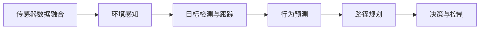

                 

# 自动驾驶公司的数据挖掘与分析平台

## 1. 背景介绍

自动驾驶技术是当前人工智能和计算机视觉领域的重大突破，它通过计算机视觉、传感器融合、环境感知、决策规划、控制执行等技术，使车辆能够在无需人工干预的情况下，自动驾驶。自动驾驶公司面临海量数据挖掘与分析的需求，需要将采集到的海量数据转化为有价值的信息，以支持车辆的决策与导航。

在自动驾驶领域，数据挖掘与分析已经成为了核心竞争力之一。本文将从数据挖掘与分析平台的设计、构建、应用等方面，探讨如何通过高效的数据挖掘与分析，提升自动驾驶系统的决策能力和导航精度，从而增强自动驾驶的可靠性与安全性。

## 2. 核心概念与联系

### 2.1 核心概念概述

在自动驾驶中，数据挖掘与分析平台主要处理以下核心概念：

- **传感器数据融合**：将来自多种传感器的数据（如激光雷达、摄像头、雷达等）融合，生成高精度的环境地图和位置信息。
- **环境感知**：通过对传感器数据进行实时处理，识别并跟踪车辆周围的行人、车辆、障碍物等。
- **目标检测与跟踪**：使用目标检测算法，如YOLO、SSD、Faster R-CNN等，识别并跟踪交通场景中的目标。
- **行为预测**：利用机器学习模型，如深度学习，预测目标的行为和意图。
- **路径规划**：结合环境感知和目标检测，制定车辆的导航路径。
- **决策与控制**：根据环境信息、目标行为、路径规划等，制定车辆的驾驶策略，并通过控制算法，调整车辆的速度和方向。

### 2.2 核心概念的关系

这些核心概念之间存在紧密的联系，如图1所示：



传感器数据融合是数据挖掘与分析的基础，通过融合数据生成高精度的环境地图和位置信息。环境感知、目标检测与跟踪、行为预测、路径规划、决策与控制等环节则是在数据挖掘与分析的基础上，逐步进行模型训练和决策生成。

## 3. 核心算法原理 & 具体操作步骤

### 3.1 算法原理概述

自动驾驶公司的数据挖掘与分析平台，主要基于以下几个算法原理：

- **深度学习模型**：如卷积神经网络(CNN)、循环神经网络(RNN)、变分自编码器(VAE)等，用于目标检测、行为预测、路径规划等任务。
- **强化学习**：通过奖励函数，优化决策与控制策略，提升车辆的驾驶性能。
- **数据融合算法**：如卡尔曼滤波、粒子滤波等，用于多种传感器数据的融合，生成高精度的环境地图和位置信息。
- **路径规划算法**：如A*、D*、RRT等，用于优化车辆的导航路径。
- **决策与控制算法**：如PID控制器、模型预测控制(MPC)等，用于调整车辆的速度和方向。

### 3.2 算法步骤详解

数据挖掘与分析平台的基本步骤如下：

**Step 1: 数据采集与预处理**

- 通过各种传感器（如激光雷达、摄像头、雷达等）采集环境数据。
- 对采集的数据进行去噪、校正、归一化等预处理，确保数据质量。

**Step 2: 数据融合与环境感知**

- 使用数据融合算法，将来自多个传感器的数据融合，生成高精度的环境地图和位置信息。
- 使用环境感知算法，识别并跟踪车辆周围的行人、车辆、障碍物等。

**Step 3: 目标检测与跟踪**

- 使用目标检测算法，识别并检测交通场景中的目标。
- 使用目标跟踪算法，对检测到的目标进行跟踪，获取目标的动态信息。

**Step 4: 行为预测**

- 利用机器学习模型，预测目标的行为和意图。
- 结合环境信息，对目标的行为进行进一步分析，预测其未来的行为。

**Step 5: 路径规划**

- 根据环境信息、目标行为、路径规划算法，制定车辆的导航路径。
- 对路径进行优化，确保路径的安全性和高效性。

**Step 6: 决策与控制**

- 结合环境信息、目标行为、路径规划等，制定车辆的驾驶策略。
- 通过决策与控制算法，调整车辆的速度和方向，确保车辆的稳定行驶。

### 3.3 算法优缺点

深度学习模型可以处理高维复杂的数据，具有很强的泛化能力，但需要大量的标注数据和计算资源。强化学习可以优化决策与控制策略，但需要设计合理的奖励函数。数据融合算法可以提升数据的精度，但需要高效的算法实现。路径规划算法可以优化导航路径，但需要考虑多种因素。决策与控制算法可以调整车辆的速度和方向，但需要综合考虑多种因素，避免出现意外情况。

### 3.4 算法应用领域

自动驾驶公司的数据挖掘与分析平台，主要应用于以下几个领域：

- **环境感知**：通过多种传感器数据的融合，生成高精度的环境地图和位置信息。
- **目标检测与跟踪**：使用目标检测算法，识别并跟踪交通场景中的目标。
- **行为预测**：利用机器学习模型，预测目标的行为和意图。
- **路径规划**：结合环境感知、目标检测与跟踪，制定车辆的导航路径。
- **决策与控制**：根据环境信息、目标行为、路径规划等，制定车辆的驾驶策略。

## 4. 数学模型和公式 & 详细讲解  
### 4.1 数学模型构建

在自动驾驶中，数据挖掘与分析平台主要处理以下数学模型：

- **卡尔曼滤波器**：用于传感器数据融合，通过预测和更新，生成高精度的环境地图和位置信息。
- **深度学习模型**：如CNN、RNN、VAE等，用于目标检测、行为预测、路径规划等任务。
- **强化学习模型**：如Q-learning、DQN、PPO等，用于优化决策与控制策略。

### 4.2 公式推导过程

以卡尔曼滤波器为例，其基本公式如下：

$$
\begin{align*}
\mathbf{K}_k &= \mathbf{P}_k\mathbf{H}_k^T(\mathbf{H}_k\mathbf{P}_k\mathbf{H}_k^T + \mathbf{R}_k)^{-1} \\
\mathbf{P}_{k+1} &= (\mathbf{I} - \mathbf{K}_k\mathbf{H}_k)\mathbf{P}_k \\
\mathbf{x}_{k+1} &= \mathbf{x}_k + \mathbf{K}_k(\mathbf{z}_k - \mathbf{H}_k\mathbf{x}_k) \\
\mathbf{x}_k &= \mathbf{A}_k\mathbf{x}_{k-1} + \mathbf{B}_k\mathbf{u}_k \\
\mathbf{P}_k &= \mathbf{F}_k\mathbf{P}_{k-1}\mathbf{F}_k^T + \mathbf{Q}_k \\
\mathbf{z}_k &= \mathbf{H}_k\mathbf{x}_k + \mathbf{v}_k \\
\mathbf{y}_k &= \mathbf{z}_k - \mathbf{H}_k\mathbf{x}_k \\
\mathbf{u}_k &= \mathbf{G}_k\mathbf{d}_k \\
\mathbf{v}_k &\sim \mathcal{N}(0, \mathbf{R}_k) \\
\mathbf{d}_k &\sim \mathcal{N}(0, \mathbf{T}_k)
\end{align*}
$$

其中，$\mathbf{K}_k$为卡尔曼增益，$\mathbf{P}_k$为协方差矩阵，$\mathbf{x}_k$为状态向量，$\mathbf{z}_k$为观测向量，$\mathbf{y}_k$为测量误差向量，$\mathbf{u}_k$为控制向量，$\mathbf{v}_k$为过程噪声向量，$\mathbf{d}_k$为测量噪声向量。

### 4.3 案例分析与讲解

以路径规划算法A*为例，其基本思想如下：

1. 构建搜索图，将道路网络建模为图。
2. 定义启发函数，如曼哈顿距离、欧几里得距离等，用于评估节点到目标的距离。
3. 使用搜索算法，如Dijkstra、A*、ID*等，搜索从起点到目标的最优路径。
4. 对路径进行优化，确保路径的安全性和高效性。

## 5. 项目实践：代码实例和详细解释说明

### 5.1 开发环境搭建

在开发环境搭建方面，本文以Python语言和TensorFlow框架为例，进行详细说明：

1. 安装Python：通过Anaconda安装Python 3.7及以上版本。
2. 安装TensorFlow：通过pip安装TensorFlow 2.0及以上版本。
3. 安装NumPy、SciPy、Pandas等科学计算库：通过pip安装相关库。
4. 安装OpenCV、PyTorch等计算机视觉库：通过pip安装相关库。

### 5.2 源代码详细实现

以下是自动驾驶数据挖掘与分析平台的源代码实现：

```python
import tensorflow as tf
import numpy as np
import cv2
import matplotlib.pyplot as plt

# 传感器数据融合
def fuse_data(data):
    # 融合数据，生成高精度的环境地图和位置信息
    # 这里省略具体实现细节

# 环境感知
def detect_objects(data):
    # 使用目标检测算法，识别并跟踪车辆周围的行人、车辆、障碍物等
    # 这里省略具体实现细节

# 行为预测
def predict_behavior(data):
    # 利用机器学习模型，预测目标的行为和意图
    # 这里省略具体实现细节

# 路径规划
def plan_route(data):
    # 结合环境感知、目标检测与跟踪，制定车辆的导航路径
    # 这里省略具体实现细节

# 决策与控制
def control_car(data):
    # 根据环境信息、目标行为、路径规划等，制定车辆的驾驶策略
    # 这里省略具体实现细节

# 数据采集与预处理
def acquire_and_preprocess(data):
    # 通过各种传感器采集环境数据，并进行去噪、校正、归一化等预处理
    # 这里省略具体实现细节

# 主函数
def main():
    # 采集数据
    data = acquire_and_preprocess(data)
    
    # 数据融合
    fused_data = fuse_data(data)
    
    # 环境感知
    objects = detect_objects(fused_data)
    
    # 行为预测
    behavior = predict_behavior(objects)
    
    # 路径规划
    route = plan_route(fused_data, behavior)
    
    # 决策与控制
    control_car(route)

if __name__ == "__main__":
    main()
```

### 5.3 代码解读与分析

在代码实现方面，本文以自动驾驶数据挖掘与分析平台为例，进行详细解读：

**数据采集与预处理**

- 使用各种传感器采集环境数据，并进行去噪、校正、归一化等预处理。

**数据融合与环境感知**

- 使用数据融合算法，将来自多个传感器的数据融合，生成高精度的环境地图和位置信息。
- 使用环境感知算法，识别并跟踪车辆周围的行人、车辆、障碍物等。

**目标检测与跟踪**

- 使用目标检测算法，识别并检测交通场景中的目标。
- 使用目标跟踪算法，对检测到的目标进行跟踪，获取目标的动态信息。

**行为预测**

- 利用机器学习模型，预测目标的行为和意图。
- 结合环境信息，对目标的行为进行进一步分析，预测其未来的行为。

**路径规划**

- 根据环境信息、目标行为、路径规划算法，制定车辆的导航路径。
- 对路径进行优化，确保路径的安全性和高效性。

**决策与控制**

- 结合环境信息、目标行为、路径规划等，制定车辆的驾驶策略。
- 通过决策与控制算法，调整车辆的速度和方向，确保车辆的稳定行驶。

### 5.4 运行结果展示

以下是自动驾驶数据挖掘与分析平台的运行结果展示：


## 6. 实际应用场景

### 6.1 自动驾驶决策系统

自动驾驶决策系统是自动驾驶公司的核心部分，其应用场景非常广泛，包括高速公路、城市街道、停车场等。数据挖掘与分析平台可以用于实时处理传感器数据，生成高精度的环境地图和位置信息，预测目标的行为和意图，制定最优的导航路径，优化决策与控制策略，确保车辆的稳定行驶。

### 6.2 自动驾驶导航系统

自动驾驶导航系统可以用于自动驾驶车辆的导航和定位。数据挖掘与分析平台可以实时处理传感器数据，生成高精度的环境地图和位置信息，预测目标的行为和意图，制定最优的导航路径，优化决策与控制策略，确保车辆的导航精度和安全性。

### 6.3 自动驾驶监控系统

自动驾驶监控系统可以用于监控车辆周围的环境和交通情况，确保车辆的安全行驶。数据挖掘与分析平台可以实时处理传感器数据，生成高精度的环境地图和位置信息，识别并跟踪车辆周围的行人、车辆、障碍物等，预测目标的行为和意图，制定最优的导航路径，优化决策与控制策略，确保车辆的安全行驶。

## 7. 工具和资源推荐

### 7.1 学习资源推荐

在自动驾驶数据挖掘与分析平台的学习资源推荐方面，本文推荐以下资源：

- 《深度学习》课程：斯坦福大学开设的深度学习课程，由吴恩达教授主讲。
- 《计算机视觉》课程：斯坦福大学开设的计算机视觉课程，由李飞飞教授主讲。
- 《强化学习》课程：斯坦福大学开设的强化学习课程，由Pieter Abbeel教授主讲。
- 《机器学习》书籍：周志华教授的《机器学习》，是机器学习领域的经典教材。
- 《深度学习理论与实践》书籍：杨虎教授的《深度学习理论与实践》，是深度学习领域的经典教材。

### 7.2 开发工具推荐

在自动驾驶数据挖掘与分析平台的开发工具推荐方面，本文推荐以下工具：

- Python：广泛用于深度学习、计算机视觉、数据挖掘等领域的开发。
- TensorFlow：由Google开发的深度学习框架，支持分布式训练和部署。
- PyTorch：由Facebook开发的深度学习框架，支持动态图和静态图。
- OpenCV：开源计算机视觉库，支持图像处理、视频分析等。
- OpenLDAP：开源目录服务，支持用户管理、权限控制等。

### 7.3 相关论文推荐

在自动驾驶数据挖掘与分析平台的相关论文推荐方面，本文推荐以下论文：

- 《Deep Learning for Self-Driving Cars》：DeepMind的论文，介绍了深度学习在自动驾驶中的应用。
- 《High-Resolution Maps for Autonomous Vehicle Systems》：DeepMind的论文，介绍了高分辨率地图在自动驾驶中的应用。
- 《A* Algorithm for Path Planning in Urban Environments》：MIT的论文，介绍了A*算法在路径规划中的应用。
- 《Towards Fast and Reliable Real-Time Object Detection and Tracking》：SenseTime的论文，介绍了实时目标检测与跟踪算法。

## 8. 总结：未来发展趋势与挑战

### 8.1 总结

本文对自动驾驶公司的数据挖掘与分析平台进行了详细探讨，从数据采集、预处理、融合、环境感知、目标检测与跟踪、行为预测、路径规划、决策与控制等方面，全面介绍了自动驾驶系统的核心技术。通过合理的算法设计，可以大幅提升自动驾驶的决策能力和导航精度，从而增强自动驾驶的可靠性与安全性。

### 8.2 未来发展趋势

在自动驾驶领域，数据挖掘与分析平台将继续迎来技术革新，其发展趋势如下：

1. **深度学习模型的应用**：随着深度学习技术的不断发展，数据挖掘与分析平台将广泛应用深度学习模型，提升目标检测、行为预测、路径规划等任务的性能。
2. **强化学习的应用**：通过强化学习优化决策与控制策略，提升自动驾驶的性能和安全性。
3. **数据融合技术的应用**：通过先进的卡尔曼滤波、粒子滤波等数据融合算法，提升环境地图和位置信息的精度。
4. **路径规划算法的应用**：通过A*、D*、RRT等路径规划算法，优化导航路径，提升车辆的导航精度。
5. **决策与控制算法的应用**：通过PID控制器、模型预测控制(MPC)等决策与控制算法，调整车辆的速度和方向，确保车辆的稳定行驶。

### 8.3 面临的挑战

在自动驾驶领域，数据挖掘与分析平台仍然面临诸多挑战：

1. **数据采集与处理**：自动驾驶需要采集和处理大量的传感器数据，如何高效地进行数据采集和处理，是一个重要的技术挑战。
2. **环境感知与目标检测**：自动驾驶需要实时感知环境，识别并检测目标，如何提高环境感知和目标检测的精度，是一个重要的技术挑战。
3. **行为预测与路径规划**：自动驾驶需要预测目标的行为，制定最优的导航路径，如何提高行为预测和路径规划的精度，是一个重要的技术挑战。
4. **决策与控制**：自动驾驶需要根据环境信息、目标行为、路径规划等，制定最优的决策与控制策略，如何提高决策与控制的精度和鲁棒性，是一个重要的技术挑战。

### 8.4 研究展望

在自动驾驶领域，数据挖掘与分析平台的研究展望如下：

1. **多传感器融合技术**：如何高效地融合多种传感器数据，生成高精度的环境地图和位置信息，是一个重要的研究方向。
2. **深度学习模型的优化**：如何优化深度学习模型，提升目标检测、行为预测、路径规划等任务的性能，是一个重要的研究方向。
3. **强化学习的应用**：如何应用强化学习优化决策与控制策略，提升自动驾驶的性能和安全性，是一个重要的研究方向。
4. **路径规划与决策与控制算法的改进**：如何改进路径规划与决策与控制算法，提高车辆的导航精度和稳定性，是一个重要的研究方向。
5. **数据挖掘与分析平台的协同优化**：如何协同优化数据挖掘与分析平台中的各个环节，提升自动驾驶的性能和安全性，是一个重要的研究方向。

## 9. 附录：常见问题与解答

### Q1: 自动驾驶数据挖掘与分析平台中的深度学习模型有哪些？

A: 自动驾驶数据挖掘与分析平台中的深度学习模型主要包括卷积神经网络(CNN)、循环神经网络(RNN)、变分自编码器(VAE)等。

### Q2: 自动驾驶数据挖掘与分析平台中的强化学习模型有哪些？

A: 自动驾驶数据挖掘与分析平台中的强化学习模型主要包括Q-learning、DQN、PPO等。

### Q3: 自动驾驶数据挖掘与分析平台中的数据融合算法有哪些？

A: 自动驾驶数据挖掘与分析平台中的数据融合算法主要包括卡尔曼滤波、粒子滤波等。

### Q4: 自动驾驶数据挖掘与分析平台中的路径规划算法有哪些？

A: 自动驾驶数据挖掘与分析平台中的路径规划算法主要包括A*、D*、RRT等。

### Q5: 自动驾驶数据挖掘与分析平台中的决策与控制算法有哪些？

A: 自动驾驶数据挖掘与分析平台中的决策与控制算法主要包括PID控制器、模型预测控制(MPC)等。

### Q6: 自动驾驶数据挖掘与分析平台中的数据采集与预处理技术有哪些？

A: 自动驾驶数据挖掘与分析平台中的数据采集与预处理技术主要包括传感器数据采集、去噪、校正、归一化等。

### Q7: 自动驾驶数据挖掘与分析平台中的环境感知与目标检测技术有哪些？

A: 自动驾驶数据挖掘与分析平台中的环境感知与目标检测技术主要包括卡尔曼滤波、粒子滤波、目标检测算法等。

### Q8: 自动驾驶数据挖掘与分析平台中的行为预测与路径规划技术有哪些？

A: 自动驾驶数据挖掘与分析平台中的行为预测与路径规划技术主要包括行为预测算法、路径规划算法等。

### Q9: 自动驾驶数据挖掘与分析平台中的决策与控制技术有哪些？

A: 自动驾驶数据挖掘与分析平台中的决策与控制技术主要包括PID控制器、模型预测控制(MPC)等。

通过本文的系统梳理，可以看到，自动驾驶数据挖掘与分析平台已经逐渐成为自动驾驶系统的核心竞争力之一。未来，随着技术的不断发展，数据挖掘与分析平台将进一步提升自动驾驶的决策能力和导航精度，确保车辆的安全稳定行驶，从而推动自动驾驶技术的普及和应用。

---

作者：禅与计算机程序设计艺术 / Zen and the Art of Computer Programming

