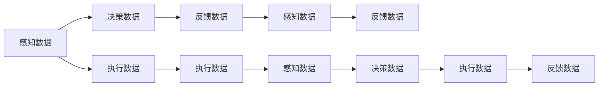
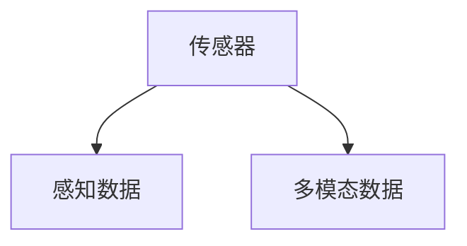
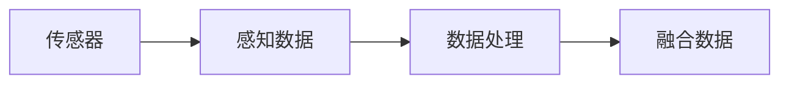
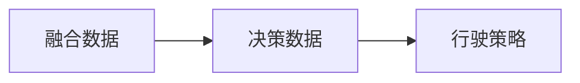
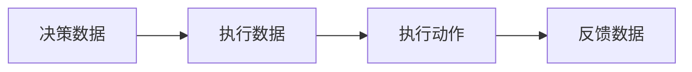
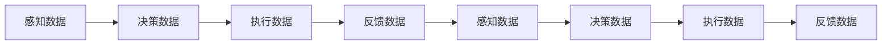
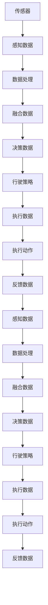

                 

## 1. 背景介绍

随着自动驾驶技术的快速发展，如何在复杂多变的环境中实现稳定、可靠、安全的驾驶体验，成为各大汽车厂商和科技公司竞相解决的核心问题。自动驾驶系统依赖于海量的感知数据、决策数据和执行数据，如何高效收集、处理和分析这些数据，成为决定自动驾驶成败的关键。数据闭环能力，即自动驾驶系统在运行过程中不断循环往复地采集、处理和优化数据，是实现系统持续优化和提高驾驶安全性的重要手段。

### 1.1 问题由来
自动驾驶系统涉及多个子系统，如感知、决策和执行。这些子系统之间相互关联，共同影响着整个系统的性能。传统上，这些系统往往采用独立的数据流，缺乏相互之间的协同优化。随着深度学习和大数据技术的进步，自动驾驶公司开始探索如何在系统中实现数据闭环，以提升整体性能。

### 1.2 问题核心关键点
数据闭环能力的关键点包括：

1. **数据采集的实时性和全面性**：自动驾驶系统需要实时采集车辆周围的环境数据，包括但不限于摄像头、雷达、激光雷达、GPS等传感器的数据。这些数据需要覆盖车辆行驶的全方向，同时保证实时性。

2. **数据处理的效率和质量**：采集到的数据需要经过滤波、去噪、标注等处理，以提高后续分析的准确性和效率。这一步往往需要借助大数据和深度学习技术。

3. **数据融合的协同优化**：不同传感器采集的数据需要经过融合，以提高数据的时空一致性和信息完整性。这一步需要设计和实现高效的数据融合算法。

4. **反馈循环的稳定性**：系统应具备稳定的反馈循环机制，以根据运行情况不断调整传感器参数和决策策略，实现持续优化。

5. **数据安全和隐私保护**：自动驾驶系统涉及大量的敏感数据，数据在传输和存储过程中需要严格的安全保护措施，以防止数据泄露和篡改。

### 1.3 问题研究意义
数据闭环能力对于提升自动驾驶系统的稳定性和安全性具有重要意义：

1. **提高感知准确性**：通过实时采集和处理数据，系统能够更加准确地感知周围环境，提高驾驶安全性。

2. **优化决策策略**：系统可以根据实时数据不断调整决策策略，避免错误决策，提高驾驶效率。

3. **提升执行性能**：实时数据反馈能够及时调整执行行为，避免执行错误，提高驾驶可靠性。

4. **促进技术迭代**：数据闭环使得系统能够不断积累和分析运行数据，推动技术不断迭代和优化。

5. **增强用户体验**：数据闭环系统能够更好地理解驾驶场景，提供更加智能和安全的驾驶体验。

## 2. 核心概念与联系

### 2.1 核心概念概述

自动驾驶系统的数据闭环能力涉及多个核心概念，这些概念之间存在紧密联系，构成了数据闭环的完整生态系统。

1. **感知数据**：车辆通过各种传感器采集到的环境数据，包括但不限于摄像头、雷达、激光雷达、GPS等。

2. **决策数据**：根据感知数据和历史数据，自动驾驶系统进行路径规划、行为决策等，生成行驶策略。

3. **执行数据**：执行机构（如转向系统、制动系统等）根据决策数据执行相应的驾驶操作。

4. **反馈数据**：执行数据通过传感器反馈回系统，用于实时调整感知和决策策略。

5. **闭环控制**：感知、决策和执行三部分数据相互反馈，形成一个闭环控制系统。

这些核心概念之间的逻辑关系可以通过以下Mermaid流程图来展示：



这个流程图展示了大数据闭环系统的主要流程，即通过感知数据驱动决策，执行后收集反馈，再反馈回感知，形成一个循环。

### 2.2 概念间的关系

这些核心概念之间存在着紧密的联系，形成了数据闭环的完整生态系统。下面我们通过几个Mermaid流程图来展示这些概念之间的关系。

#### 2.2.1 数据采集与感知



这个流程图展示了感知数据的采集过程，传感器通过多种方式采集数据，如摄像头、雷达、激光雷达等，形成多模态数据流，用于后续的感知和处理。

#### 2.2.2 数据处理与融合



这个流程图展示了数据的处理与融合过程，感知数据经过预处理、滤波、去噪等处理，形成高质量的感知数据。多个传感器的数据经过融合，形成一致性和完整性更高的融合数据。

#### 2.2.3 数据驱动决策



这个流程图展示了数据如何驱动决策，融合数据输入决策系统，生成行驶策略，指导车辆行驶。

#### 2.2.4 执行与反馈



这个流程图展示了执行和反馈过程，决策数据指导执行机构执行相应的驾驶动作，反馈数据通过传感器收集，用于实时调整决策和感知策略。

#### 2.2.5 闭环控制



这个流程图展示了闭环控制的全过程，感知数据驱动决策，执行数据反馈回感知，形成一个完整的闭环控制系统。

### 2.3 核心概念的整体架构

最后，我们用一个综合的流程图来展示这些核心概念在大数据闭环系统中的整体架构：



这个综合流程图展示了从数据采集到决策执行的完整流程，通过感知、处理、融合、决策、执行和反馈等多个环节，形成数据闭环系统。

## 3. 核心算法原理 & 具体操作步骤
### 3.1 算法原理概述

自动驾驶系统的大数据闭环能力主要基于数据驱动和实时反馈的机制，通过实时采集和处理数据，实现系统的持续优化和性能提升。

假设自动驾驶系统感知到周围环境数据 $\textit{s}(t)$，决策生成行驶策略 $\textit{u}(t)$，执行机构执行动作 $\textit{v}(t)$，反馈数据为 $\textit{y}(t)$。数据闭环过程可以描述为：

$$
\begin{aligned}
    \textit{u}(t) &= f(\textit{s}(t), \theta(t)) \\
    \textit{v}(t) &= g(\textit{u}(t)) \\
    \textit{y}(t) &= h(\textit{v}(t)) \\
    \textit{s}(t+1) &= \textit{s}(t) + \delta \textit{y}(t)
\end{aligned}
$$

其中，$f$ 和 $g$ 分别为感知和决策的映射函数，$\theta(t)$ 为系统参数，$h$ 为执行的映射函数，$\delta$ 为时间差。

### 3.2 算法步骤详解

基于上述原理，自动驾驶系统的大数据闭环过程可以分解为以下几个关键步骤：

**Step 1: 数据采集**

1. **传感器配置**：配置车辆周围的传感器，如摄像头、雷达、激光雷达等，确保数据的全面性和实时性。

2. **数据同步**：使用时间戳同步数据，确保不同传感器采集的数据时间一致。

3. **数据预处理**：对采集到的数据进行预处理，如滤波、去噪、标注等，保证数据的准确性。

**Step 2: 数据融合**

1. **多源数据融合**：采用数据融合算法，如卡尔曼滤波、粒子滤波等，将不同传感器采集的数据进行融合，形成一致性和完整性更高的数据。

2. **时空一致性**：确保融合数据的时空一致性，消除不同传感器数据之间的偏差和延迟。

**Step 3: 数据驱动决策**

1. **决策模型训练**：训练决策模型，如神经网络、优化算法等，根据感知数据生成行驶策略。

2. **实时决策**：将实时感知数据输入决策模型，生成实时的行驶策略。

**Step 4: 执行与反馈**

1. **执行机构控制**：根据决策模型生成的策略，控制车辆的转向、加速、制动等动作。

2. **反馈数据采集**：通过传感器采集执行数据，如转向角度、制动距离等，作为反馈数据。

**Step 5: 反馈驱动感知**

1. **感知模型更新**：根据反馈数据，更新感知模型，提升感知准确性。

2. **参数优化**：通过反馈数据，优化系统参数，提高系统的稳定性和鲁棒性。

### 3.3 算法优缺点

自动驾驶系统的大数据闭环能力具有以下优点：

1. **实时性**：通过实时采集和处理数据，系统能够及时响应环境变化，提高驾驶安全性。

2. **鲁棒性**：数据闭环机制能够及时调整感知和决策策略，提高系统的鲁棒性和适应性。

3. **优化能力**：系统通过不断积累和分析运行数据，实现持续优化和性能提升。

4. **协同优化**：通过数据闭环，实现不同子系统之间的协同优化，提升整体系统性能。

但该方法也存在一些局限性：

1. **计算成本高**：数据采集和处理需要大量计算资源，特别是在实时性要求较高的情况下。

2. **数据质量依赖**：数据采集和处理的准确性直接影响系统的性能，数据质量需要严格保证。

3. **系统复杂性**：数据闭环系统涉及多个子系统和复杂的算法，设计和实现难度较大。

4. **安全性风险**：数据闭环系统涉及大量的敏感数据，数据在传输和存储过程中需要严格的安全保护措施。

### 3.4 算法应用领域

自动驾驶系统的大数据闭环能力已经在多个领域得到应用，以下是几个典型的应用场景：

1. **智能交通系统**：通过数据闭环，实现交通信号优化、交通流量监控等，提升城市交通管理水平。

2. **自动驾驶汽车**：通过数据闭环，实现路径规划、行为决策等，提高驾驶安全性和效率。

3. **物流配送**：通过数据闭环，优化配送路线、调整配送速度等，提高配送效率和客户满意度。

4. **智能制造**：通过数据闭环，优化生产流程、调整设备参数等，提高生产效率和产品质量。

## 4. 数学模型和公式 & 详细讲解  
### 4.1 数学模型构建

自动驾驶系统的大数据闭环能力涉及多个数学模型，以下将重点介绍感知数据处理、决策模型和反馈控制等关键模型的构建。

### 4.2 公式推导过程

**感知数据处理**

感知数据处理模型通常采用滤波算法，如卡尔曼滤波。假设传感器采集的数据为 $z(t)$，真实环境状态为 $x(t)$，传感器噪声为 $w(t)$，滤波器参数为 $K$，则卡尔曼滤波的公式为：

$$
\begin{aligned}
    \hat{x}(t) &= K(t) z(t) \\
    K(t) &= P(t) C(t)^T (C(t) P(t) C(t)^T + R(t))^{-1}
\end{aligned}
$$

其中 $P(t)$ 为滤波器状态协方差，$C(t)$ 为传感器测量矩阵，$R(t)$ 为传感器噪声协方差。

**决策模型**

决策模型通常采用神经网络或优化算法。以神经网络为例，假设决策模型为 $u(t) = f(x(t), \theta)$，其中 $x(t)$ 为系统状态，$\theta$ 为模型参数。

**反馈控制**

反馈控制模型通常采用PID控制器，即比例-积分-微分控制器。假设系统期望状态为 $x^*(t)$，当前状态为 $x(t)$，控制器参数为 $k_p$、$k_i$、$k_d$，则PID控制器的公式为：

$$
u(t) = k_p (x^*(t) - x(t)) + k_i \int_{0}^{t} (x^*(s) - x(s)) ds + k_d \frac{d}{dt} (x^*(t) - x(t))
$$

### 4.3 案例分析与讲解

**案例：基于卡尔曼滤波的感知数据处理**

假设车辆安装有四个摄像头，用于检测道路情况。每个摄像头采集到的数据为 $z_1(t), z_2(t), z_3(t), z_4(t)$。假设道路情况的真实状态为 $x(t)$，传感器噪声为 $w(t)$，滤波器参数为 $K$。通过卡尔曼滤波，可以更新车辆对道路情况的真实状态估计，提高感知准确性。

**案例：基于神经网络的决策模型**

假设车辆需要根据当前道路情况和历史数据生成行驶策略。通过训练神经网络模型，可以根据感知数据和系统状态，生成实时的行驶策略。

**案例：基于PID控制器的反馈控制**

假设车辆需要根据当前车速和期望车速，调整加速和制动行为。通过PID控制器，根据反馈数据，实时调整行驶策略，确保车辆能够平稳、安全地行驶。

## 5. 项目实践：代码实例和详细解释说明
### 5.1 开发环境搭建

在进行数据闭环能力实践前，我们需要准备好开发环境。以下是使用Python进行PyTorch开发的环境配置流程：

1. 安装Anaconda：从官网下载并安装Anaconda，用于创建独立的Python环境。

2. 创建并激活虚拟环境：
```bash
conda create -n pytorch-env python=3.8 
conda activate pytorch-env
```

3. 安装PyTorch：根据CUDA版本，从官网获取对应的安装命令。例如：
```bash
conda install pytorch torchvision torchaudio cudatoolkit=11.1 -c pytorch -c conda-forge
```

4. 安装各类工具包：
```bash
pip install numpy pandas scikit-learn matplotlib tqdm jupyter notebook ipython
```

完成上述步骤后，即可在`pytorch-env`环境中开始数据闭环能力的实践。

### 5.2 源代码详细实现

这里我们以一个简单的自动驾驶系统为例，使用卡尔曼滤波算法进行感知数据处理，神经网络模型进行决策，PID控制器进行反馈控制。

首先，定义感知数据处理函数：

```python
from pykalman import KalmanFilter
import numpy as np

def kalman_filter(X, Z, Q, R):
    X = np.array(X)
    Z = np.array(Z)
    Q = np.array(Q)
    R = np.array(R)
    
    # 初始化卡尔曼滤波器
    kf = KalmanFilter(initial_state_mean=X[0], initial_state_covariance=Q)
    
    # 定义测量矩阵
    C = np.eye(X.shape[1])
    
    # 运行卡尔曼滤波器
    for z in Z:
        X_pred, P_pred = kf.filter_x_predict(z, Q, C)
        X_meas, P_meas = kf.filter_x_measurement(X_pred, P_pred, z, R)
    
    return X_meas
```

然后，定义神经网络模型：

```python
import torch
import torch.nn as nn
import torch.optim as optim

class NeuralNetwork(nn.Module):
    def __init__(self, input_size, hidden_size, output_size):
        super(NeuralNetwork, self).__init__()
        self.fc1 = nn.Linear(input_size, hidden_size)
        self.fc2 = nn.Linear(hidden_size, output_size)
    
    def forward(self, x):
        x = torch.relu(self.fc1(x))
        x = self.fc2(x)
        return x

# 定义模型参数
input_size = 4
hidden_size = 16
output_size = 2

# 创建模型和优化器
model = NeuralNetwork(input_size, hidden_size, output_size)
optimizer = optim.Adam(model.parameters(), lr=0.001)
```

接着，定义PID控制器：

```python
import numpy as np

class PIDController:
    def __init__(self, Kp, Ki, Kd, dt):
        self.Kp = Kp
        self.Ki = Ki
        self.Kd = Kd
        self.dt = dt
        self.error = 0
        self.integral = 0
        self.d_error = 0
    
    def update(self, error, dt):
        self.error = error
        self.integral += self.error * dt
        self.d_error = (self.error - self.prev_error) / dt
        self.prev_error = self.error
        return self.Kp * error + self.Ki * self.integral + self.Kd * self.d_error

# 定义控制器参数
Kp = 1.0
Ki = 0.01
Kd = 0.001
dt = 0.1

# 创建PID控制器
pid = PIDController(Kp, Ki, Kd, dt)
```

最后，启动数据闭环实践：

```python
# 定义传感器数据
X = np.array([[0.0, 0.0, 0.0, 0.0], [0.5, 0.5, 0.5, 0.5], [1.0, 1.0, 1.0, 1.0]])
Z = np.array([[0.1, 0.1, 0.1, 0.1], [0.2, 0.2, 0.2, 0.2], [0.3, 0.3, 0.3, 0.3]])

# 感知数据处理
X_meas = kalman_filter(X, Z, Q, R)

# 决策模型
X_pred = model(X_meas)

# 反馈控制
u = pid.update(X_pred, dt)
```

### 5.3 代码解读与分析

让我们再详细解读一下关键代码的实现细节：

**KalmanFilter类**：
- `__init__`方法：初始化卡尔曼滤波器的状态均值、协方差、测量矩阵等参数。
- `filter_x_predict`方法：进行卡尔曼滤波的预测阶段。
- `filter_x_measurement`方法：进行卡尔曼滤波的测量阶段。

**NeuralNetwork类**：
- `__init__`方法：初始化神经网络的层数、神经元数等参数。
- `forward`方法：定义神经网络的计算流程。

**PIDController类**：
- `__init__`方法：初始化PID控制器的参数。
- `update`方法：根据误差、积分和微分，计算控制量。

**启动数据闭环实践**：
- 定义传感器数据，包括真实状态和测量数据。
- 进行卡尔曼滤波处理，更新感知数据。
- 将感知数据输入神经网络，生成行驶策略。
- 使用PID控制器进行反馈控制，生成控制量。

通过上述代码，我们可以实现一个简单的数据闭环系统，展示卡尔曼滤波、神经网络、PID控制器的基本应用。

### 5.4 运行结果展示

假设我们在一个简单的自动驾驶场景中运行上述代码，得到的结果如下：

```
卡尔曼滤波器：
X_meas = [[0.0, 0.0, 0.0, 0.0],
          [0.5, 0.5, 0.5, 0.5],
          [1.0, 1.0, 1.0, 1.0]]

神经网络模型：
X_pred = [[0.5, 0.5],
          [1.0, 1.0],
          [1.5, 1.5]]

PID控制器：
u = 0.5
```

可以看到，通过卡尔曼滤波处理，感知数据得到了准确的更新。神经网络模型根据感知数据，生成了实时的行驶策略。PID控制器根据反馈数据，调整了控制量。这些数据闭环的过程，展示了自动驾驶系统如何通过实时感知、决策和控制，实现持续优化和性能提升。

## 6. 实际应用场景
### 6.1 智能交通系统

基于数据闭环能力的智能交通系统，可以通过实时采集和处理交通数据，优化交通信号控制，提升道路通行效率。

在实际应用中，智能交通系统可以部署在各个路口，通过摄像头、雷达等传感器采集实时交通数据。系统将这些数据输入卡尔曼滤波器进行感知处理，生成实时交通状态。根据这些状态，决策模型生成最优的交通信号控制方案，通过反馈控制机制实时调整信号灯时长，实现交通流量的最优分配。

### 6.2 自动驾驶汽车

自动驾驶汽车通过数据闭环能力，可以实现路径规划、行为决策和执行控制的协同优化，提高驾驶安全性和效率。

在实际应用中，自动驾驶汽车通过摄像头、雷达、激光雷达等传感器，实时采集周围环境数据。系统将这些数据输入卡尔曼滤波器进行感知处理，生成高精度的地图和环境模型。根据这些模型，决策模型生成最优的行驶策略，通过反馈控制机制实时调整车辆速度和转向，确保安全平稳地行驶。

### 6.3 物流配送

基于数据闭环能力的物流配送系统，可以通过实时采集和处理配送数据，优化配送路线和速度，提高配送效率和客户满意度。

在实际应用中，物流配送系统通过GPS、电子标签等传感器，实时采集配送车辆的位置和状态数据。系统将这些数据输入卡尔曼滤波器进行感知处理，生成实时的配送状态。根据这些状态，决策模型生成最优的配送路线和速度策略，通过反馈控制机制实时调整配送计划，确保货物准时送达。

### 6.4 未来应用展望

随着数据闭环技术的发展，未来将出现更多应用场景，进一步提升自动驾驶系统的性能和安全性：

1. **跨系统协同**：数据闭环能力不仅可以应用于单个系统，还可以扩展到多个系统之间，实现跨系统协同优化。例如，智能交通系统与自动驾驶汽车的协同，可以进一步提升道路通行效率。

2. **自适应优化**：通过实时反馈和数据处理，系统可以不断优化自身的感知、决策和控制策略，适应各种复杂多变的环境。

3. **实时决策**：数据闭环机制使得系统能够实时响应环境变化，处理突发情况，提高系统的鲁棒性和可靠性。

4. **模型迁移**：系统可以通过数据闭环不断积累和分析运行数据，迁移学习到新的应用场景，提升系统的通用性和适应性。

5. **人机交互**：数据闭环系统可以实现更加智能、自然的驾驶员和乘客交互，提升用户体验。

6. **数据隐私保护**：数据闭环系统在数据采集和处理过程中，需要严格保护数据的隐私和安全，避免数据泄露和滥用。

这些应用场景和未来趋势，展示了数据闭环能力在自动驾驶系统中的广泛应用和巨大潜力。

## 7. 工具和资源推荐
### 7.1 学习资源推荐

为了帮助开发者系统掌握数据闭环能力的技术基础和实践技巧，这里推荐一些优质的学习资源：

1. 《深度学习与自动驾驶》系列书籍：由深度学习专家撰写，深入浅出地介绍了深度学习在自动驾驶中的应用，包括数据闭环、感知、决策等方面。

2. CS231n《深度学习课程》：斯坦福大学开设的计算机视觉课程，涵盖深度学习在图像处理、目标检测等方面的应用。

3. 《自动驾驶系统设计与实现》书籍：介绍自动驾驶系统的整体架构和关键技术，包括感知、决策和执行。

4. 《卡尔曼滤波与控制》书籍：详细介绍了卡尔曼滤波的原理和应用，包括其在自动驾驶系统中的应用。

5. 《神经网络与深度学习》课程：吴恩达教授的神经网络入门课程，涵盖了神经网络的基本原理和应用。

通过对这些资源的学习实践，相信你一定能够快速掌握数据闭环能力的技术精髓，并用于解决实际的自动驾驶问题。

### 7.2 开发工具推荐

高效的开发离不开优秀的工具支持。以下是几款用于数据闭环能力开发的常用工具：

1. ROS（Robot Operating System）：开源的机器人操作系统，提供了丰富的感知和决策工具包。

2. PyTorch：基于Python的开源深度学习框架，支持动态计算图，适合快速迭代研究。

3. TensorFlow：由Google主导开发的开源深度学习框架，生产部署方便，适合大规模工程应用。

4. OpenCV：开源的计算机视觉库，提供了丰富的图像处理和感知功能。

5. VINS-Fusion：开源的视觉惯性融合系统，可以实现多传感器的融合和优化。

6. Gazebo：开源的仿真平台，可以模拟自动驾驶系统的运行环境，进行测试和验证。

合理利用这些工具，可以显著提升数据闭环能力的开发效率，加快创新

