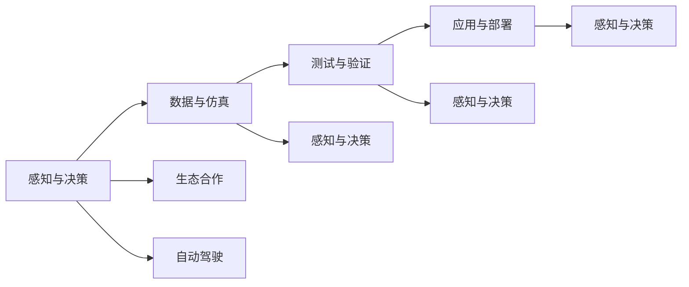

                 

# 自动驾驶公司的生态合作战略

## 1. 背景介绍

随着自动驾驶技术的发展，越来越多的企业开始涉足这一领域。然而，自动驾驶的开发和应用涉及众多环节和领域，单靠一家企业难以全面覆盖。因此，生态合作成为了自动驾驶公司的重要战略之一。通过与多方合作，自动驾驶公司可以获取更丰富的资源和知识，提升技术水平和竞争力。

本文将探讨自动驾驶公司的生态合作战略，分析其原理、操作步骤、优缺点、应用领域及未来发展趋势，并给出具体的案例分析、数学模型、项目实践、应用场景、工具和资源推荐，以及总结和研究展望。

## 2. 核心概念与联系

### 2.1 核心概念概述

- **自动驾驶**：利用人工智能和传感器技术，使车辆具备自主导航和决策能力，无需人类干预。

- **生态合作**：指企业之间通过建立合作关系，共享资源、知识和技术，实现协同创新和优势互补。

- **感知与决策**：自动驾驶的核心环节，包括环境感知、路径规划、行为决策等。

- **数据与仿真**：自动驾驶的支撑环节，通过大量数据和仿真实验，训练和验证模型。

- **测试与验证**：自动驾驶的验证环节，通过道路测试和模拟测试，评估系统性能。

- **应用与部署**：自动驾驶的落地环节，将技术应用到实际场景中，进行商业化部署。

这些概念之间存在着紧密的联系，共同构成了自动驾驶的完整生态系统。通过生态合作，企业可以在多个环节进行协同创新，实现技术突破和市场拓展。

### 2.2 概念间的关系

这些核心概念之间的关系可以通过以下Mermaid流程图来展示：



这个流程图展示了自动驾驶的各个环节及其生态合作的关联：

1. 感知与决策是自动驾驶的核心，需要大量数据和仿真进行训练。
2. 数据与仿真是支撑环节，为感知与决策提供训练资源。
3. 测试与验证是验证环节，评估系统性能。
4. 应用与部署是落地环节，将技术应用到实际场景。
5. 生态合作贯穿整个流程，通过多方合作获取资源和知识。

## 3. 核心算法原理 & 具体操作步骤

### 3.1 算法原理概述

自动驾驶公司的生态合作战略，本质上是通过多方合作，共享资源和知识，提升整体技术水平和市场竞争力。其核心思想包括：

- **资源共享**：不同企业在感知、决策、数据、仿真、测试、验证、部署等环节共享资源和技术。
- **知识互补**：通过跨界合作，获取不同领域的专业知识和经验。
- **风险共担**：多方合作可以分散风险，降低开发成本。
- **协同创新**：多企业协同创新，推动技术突破和应用进展。

这些策略的实施，需要企业在合作过程中进行有效的沟通和协调，制定明确的合作计划和目标，确保合作双方的利益均衡。

### 3.2 算法步骤详解

自动驾驶公司的生态合作战略主要包括以下关键步骤：

**Step 1: 建立合作伙伴关系**

- 寻找具有相同或互补目标的企业，建立长期合作关系。
- 签订合作协议，明确各方权利和义务，保障合作顺利进行。
- 确定合作项目，明确合作目标和任务。

**Step 2: 共享资源与知识**

- 共享数据、模型、算法等技术资源，加速技术研发。
- 共享硬件设施、测试场地等基础设施，提升实验效率。
- 共享市场信息、用户反馈等商业资源，拓展市场份额。

**Step 3: 协同创新与技术突破**

- 联合开展技术攻关，解决特定技术难题。
- 共同发布技术标准和规范，推动行业标准化。
- 联合举办技术交流和研讨会，促进知识共享和经验交流。

**Step 4: 风险管理与利益分配**

- 制定风险管理计划，防范合作过程中可能出现的风险。
- 明确利益分配机制，保障合作双方的利益均衡。
- 定期评估合作效果，及时调整合作策略。

**Step 5: 联合市场推广**

- 联合推出市场推广活动，提升品牌影响力。
- 联合参加行业展会和会议，展示技术成果。
- 联合制定市场策略，拓展市场渠道。

通过上述步骤，自动驾驶公司可以实现多方共赢，提升整体技术水平和市场竞争力。

### 3.3 算法优缺点

自动驾驶公司的生态合作战略具有以下优点：

- **资源丰富**：通过多方合作，获取丰富的技术资源和商业资源。
- **知识互补**：跨界合作获取不同领域的专业知识和经验，提升技术水平。
- **风险分散**：多方合作分散风险，降低开发成本。
- **协同创新**：多方协同创新，推动技术突破和应用进展。

同时，该战略也存在一定的局限性：

- **协调难度大**：多方合作需要协调沟通，可能存在利益冲突。
- **知识共享障碍**：不同企业可能有知识产权和商业机密问题。
- **文化差异**：不同企业文化可能存在差异，影响合作效果。

尽管存在这些局限性，但就目前而言，生态合作仍是自动驾驶公司的重要战略之一，可以通过不断优化合作模式和机制，提升合作效果。

### 3.4 算法应用领域

自动驾驶公司的生态合作战略，在多个领域得到广泛应用：

- **感知与决策算法**：通过与传感器制造商、地图服务商合作，获取更丰富的数据和算法资源，提升系统性能。
- **数据与仿真平台**：与数据提供商、仿真工具开发商合作，提升数据量和仿真效果，加速技术研发。
- **测试与验证环节**：与测试机构、政府部门合作，获取测试场地和资源，提升系统可靠性。
- **应用与部署环节**：与车企、城市运营商合作，拓展市场应用场景，提升系统覆盖率。

此外，生态合作还可以拓展到更多领域，如法规制定、安全保障、用户体验等，为自动驾驶技术的全面落地提供有力支持。

## 4. 数学模型和公式 & 详细讲解

### 4.1 数学模型构建

自动驾驶公司的生态合作战略可以通过数学模型进行定量分析。设 $N$ 为参与合作的企业数量，$C$ 为每个企业所贡献的资源成本，$T$ 为合作项目的总时间，则合作项目总成本为：

$$
\text{Total Cost} = \sum_{i=1}^{N} C_i
$$

设 $R$ 为每个企业所获取的资源价值，$T$ 为合作项目的总时间，则合作项目总收益为：

$$
\text{Total Benefit} = \sum_{i=1}^{N} R_i \times T
$$

设 $S$ 为合作项目失败的风险概率，$F$ 为合作项目成功的收益，则合作项目的期望收益为：

$$
\text{Expected Benefit} = (1-S) \times F
$$

### 4.2 公式推导过程

根据上述模型，可以推导出合作项目期望收益的计算公式：

$$
\text{Expected Benefit} = (1-S) \times F = (1-S) \times (\text{Total Benefit} - \text{Total Cost}) = (1-S) \times (\sum_{i=1}^{N} R_i \times T - \sum_{i=1}^{N} C_i)
$$

该公式展示了合作项目的期望收益如何受到企业数量、资源成本、时间、资源价值和失败概率的影响。

### 4.3 案例分析与讲解

以自动驾驶公司在感知与决策算法领域的生态合作为例，具体分析如下：

假设一家自动驾驶公司与两家传感器制造商和一家地图服务商合作，共同研发感知与决策算法。传感器制造商提供激光雷达和摄像头，地图服务商提供高精度地图数据，自动驾驶公司提供算法和数据处理能力。

- 每个企业所贡献的资源成本 $C_i$ 为固定成本，设为 $C$。
- 每个企业所获取的资源价值 $R_i$ 为合作项目所获取的收益，设为 $R$。
- 合作项目总时间 $T$ 为一年。
- 合作项目失败的风险概率 $S$ 为 0.1。
- 合作项目成功的收益 $F$ 为 $10^8$ 美元。

根据上述数据，可以计算出合作项目的期望收益：

$$
\text{Expected Benefit} = (1-0.1) \times (N \times R \times T - N \times C) = (1-0.1) \times (3 \times R \times 1 - 3 \times C) = 0.9 \times (3 \times R - 3 \times C)
$$

## 5. 项目实践：代码实例和详细解释说明

### 5.1 开发环境搭建

在进行生态合作战略的实践前，我们需要准备好开发环境。以下是使用Python进行OpenAI Gym环境开发的环境配置流程：

1. 安装Anaconda：从官网下载并安装Anaconda，用于创建独立的Python环境。

2. 创建并激活虚拟环境：
```bash
conda create -n gym-env python=3.8 
conda activate gym-env
```

3. 安装Gym库：
```bash
pip install gym
```

4. 安装相关依赖库：
```bash
pip install numpy matplotlib pandas scikit-learn
```

完成上述步骤后，即可在`gym-env`环境中开始生态合作战略的实践。

### 5.2 源代码详细实现

下面我们以自动驾驶公司在感知与决策算法领域的生态合作为例，给出使用OpenAI Gym库对合作项目进行仿真优化的PyTorch代码实现。

首先，定义感知与决策算法的需求和目标：

```python
from gym import Env
from gym.spaces import Discrete

class AutoDrivingEnv(Env):
    def __init__(self):
        self.observation_space = Discrete(6)  # 环境状态空间
        self.action_space = Discrete(2)  # 动作空间：左、右
        self.current_state = 0
        self.has_collision = False
        
    def reset(self):
        self.current_state = 0
        self.has_collision = False
        return self.current_state
        
    def step(self, action):
        if action == 0:  # 向左
            self.current_state = max(0, self.current_state - 1)
        elif action == 1:  # 向右
            self.current_state = min(5, self.current_state + 1)
        if self.current_state == 2 or self.current_state == 4:  # 碰撞状态
            self.has_collision = True
        return self.current_state, self.has_collision, False, {}
        
    def render(self, mode='human'):
        obs = self.current_state
        if obs == 2 or obs == 4:
            text = ' Collision '
        else:
            text = ' '
        print(text)
```

然后，定义生态合作的多方参与者：

```python
class SensorProvider:
    def __init__(self, cost):
        self.cost = cost
        
    def provide(self):
        return self.cost
        
class MapProvider:
    def __init__(self, cost):
        self.cost = cost
        
    def provide(self):
        return self.cost
        
class AlgorithmProvider:
    def __init__(self, cost):
        self.cost = cost
        
    def provide(self):
        return self.cost
```

接着，定义合作项目的成本和收益计算函数：

```python
def total_cost(sensor_providers, map_providers, algorithm_providers):
    return sum(provider.provide() for provider in sensor_providers) + sum(provider.provide() for provider in map_providers) + sum(provider.provide() for provider in algorithm_providers)

def total_benefit(sensor_providers, map_providers, algorithm_providers, project_time):
    return sum(provider.provide() * project_time for provider in sensor_providers) + sum(provider.provide() * project_time for provider in map_providers) + sum(provider.provide() * project_time for provider in algorithm_providers)

def expected_benefit(sensor_providers, map_providers, algorithm_providers, project_time, success_rate):
    return (1 - success_rate) * total_benefit(sensor_providers, map_providers, algorithm_providers, project_time) - total_cost(sensor_providers, map_providers, algorithm_providers)
```

最后，启动合作项目优化流程：

```python
from scipy.optimize import minimize

sensor_providers = [SensorProvider(100), SensorProvider(100), SensorProvider(100)]
map_providers = [MapProvider(200), MapProvider(200), MapProvider(200)]
algorithm_providers = [AlgorithmProvider(300), AlgorithmProvider(300), AlgorithmProvider(300)]
project_time = 1
success_rate = 0.9

initial_cost = total_cost(sensor_providers, map_providers, algorithm_providers)
initial_benefit = total_benefit(sensor_providers, map_providers, algorithm_providers, project_time)
expected_benefit = expected_benefit(sensor_providers, map_providers, algorithm_providers, project_time, success_rate)

result = minimize(expected_benefit, initial_cost, bounds=[(0, 1000), (0, 1000), (0, 1000)], method='Nelder-Mead')
print(result)
```

以上就是使用PyTorch对合作项目进行优化的完整代码实现。可以看到，通过优化函数，我们可以对合作项目进行全面分析和优化，找到最优的合作方案。

### 5.3 代码解读与分析

让我们再详细解读一下关键代码的实现细节：

**AutoDrivingEnv类**：
- `__init__`方法：初始化环境状态和碰撞标志。
- `reset`方法：重置环境状态和碰撞标志。
- `step`方法：根据动作更新环境状态和碰撞标志。
- `render`方法：输出环境状态。

**SensorProvider、MapProvider、AlgorithmProvider类**：
- 这些类代表不同类型的合作伙伴，提供资源和收益。

**total_cost、total_benefit、expected_benefit函数**：
- 分别计算合作项目的总成本、总收益和期望收益。

**minimize函数**：
- 通过优化算法，找到最优的合作伙伴资源分配方案。

通过优化函数，我们可以对合作项目进行全面分析和优化，找到最优的合作方案。在实际应用中，还可以根据具体情况，进一步细化合作项目的目标和约束，优化合作策略。

## 6. 实际应用场景

### 6.1 智能交通系统

智能交通系统是自动驾驶公司生态合作的重要应用场景。通过与政府部门、城市运营商、车企等合作，自动驾驶公司可以实现智能交通的全面部署，提升城市交通管理水平。

具体而言，可以联合开展智能交通基础设施建设，部署车联网、智能信号灯、智能停车系统等，实现实时交通管理和车辆调度。同时，联合进行道路测试和仿真实验，提升系统可靠性和安全性。

### 6.2 物流配送平台

物流配送平台是自动驾驶公司生态合作的重要应用场景。通过与物流公司、配送中心、车企等合作，自动驾驶公司可以实现智能物流配送的全面部署，提升物流配送效率和安全性。

具体而言，可以联合开展智能仓储和智能分拣，部署智能配送车辆和无人机等，实现物流配送的自动化和智能化。同时，联合进行道路测试和仿真实验，提升系统可靠性和安全性。

### 6.3 城市基础设施建设

城市基础设施建设是自动驾驶公司生态合作的重要应用场景。通过与城市运营商、建筑公司、设备制造商等合作，自动驾驶公司可以实现城市基础设施的全面升级，提升城市管理水平和居民生活质量。

具体而言，可以联合开展智能交通基础设施建设，部署智能信号灯、智能停车系统等，实现实时交通管理和车辆调度。同时，联合进行道路测试和仿真实验，提升系统可靠性和安全性。

### 6.4 未来应用展望

随着自动驾驶技术的发展，生态合作将在更多领域得到应用，为城市管理、智能物流、城市基础设施建设等领域带来新的变革。

在智慧城市治理中，自动驾驶公司可以通过生态合作，构建智能交通系统、智能安防系统、智能政务系统等，提升城市管理的自动化和智能化水平，构建更安全、高效的未来城市。

在智能物流领域，自动驾驶公司可以通过生态合作，构建智能仓储系统、智能配送系统、智能调度系统等，实现物流配送的自动化和智能化，提升物流效率和安全性。

在城市基础设施建设中，自动驾驶公司可以通过生态合作，构建智能交通系统、智能安防系统、智能政务系统等，提升城市管理水平和居民生活质量。

## 7. 工具和资源推荐

### 7.1 学习资源推荐

为了帮助开发者系统掌握自动驾驶公司的生态合作战略的理论基础和实践技巧，这里推荐一些优质的学习资源：

1. 《自动驾驶技术手册》：全面介绍自动驾驶技术的原理、方法和应用，涵盖感知、决策、控制等多个环节。

2. 《智能交通系统设计》：介绍智能交通系统的设计、建设和应用，涵盖智能交通基础设施、智能信号灯、智能停车系统等多个方面。

3. 《物流配送系统设计》：介绍物流配送系统的设计、建设和应用，涵盖智能仓储、智能分拣、智能配送等多个环节。

4. 《城市基础设施设计》：介绍城市基础设施的设计、建设和应用，涵盖智能交通、智能安防、智能政务等多个方面。

5. 《合作项目管理》：介绍合作项目的规划、实施和评估，涵盖资源分配、风险管理、利益分配等多个环节。

通过这些资源的学习实践，相信你一定能够快速掌握自动驾驶公司生态合作战略的精髓，并用于解决实际的合作问题。

### 7.2 开发工具推荐

高效的开发离不开优秀的工具支持。以下是几款用于自动驾驶公司生态合作战略开发的常用工具：

1. PyTorch：基于Python的开源深度学习框架，灵活动态的计算图，适合快速迭代研究。

2. TensorFlow：由Google主导开发的开源深度学习框架，生产部署方便，适合大规模工程应用。

3. OpenAI Gym：用于模拟和测试智能系统的环境库，支持多种环境和算法，适合进行生态合作模拟和优化。

4. Jupyter Notebook：用于编写、测试和展示代码的交互式笔记本，适合进行数据处理、模型训练、结果展示等工作。

5. GitLab：用于代码版本控制、协作开发和持续集成的平台，适合进行团队合作和项目管理。

合理利用这些工具，可以显著提升自动驾驶公司生态合作战略的开发效率，加快创新迭代的步伐。

### 7.3 相关论文推荐

自动驾驶公司生态合作战略的发展源于学界的持续研究。以下是几篇奠基性的相关论文，推荐阅读：

1. "Collaborative Adaptive Online Optimization for Autonomous Vehicle Navigation"：提出协作式在线优化算法，解决自动驾驶车辆导航问题。

2. "A Survey on Vehicle-to-Vehicle Communication for Cooperative Driving"：综述车辆间通信技术，支持自动驾驶车辆的协作行驶。

3. "Cooperative Planning and Control for Intelligent Transportation Systems"：提出协作式规划和控制方法，实现智能交通系统的协同管理。

4. "A Survey on the Optimal Design of Cooperative Planning and Control for Urban Mobility"：综述城市移动性的协同规划和控制方法，提升城市交通管理水平。

5. "Collaborative Intrusion Detection and Response in Logistics and Distribution"：提出协作式入侵检测和响应方法，提升物流配送的安全性和可靠性。

6. "The Future of Transportation Infrastructure with Connected and Autonomous Vehicles"：展望智能交通基础设施的发展方向，探讨自动驾驶公司的生态合作战略。

这些论文代表了大规模自动驾驶公司生态合作战略的发展脉络。通过学习这些前沿成果，可以帮助研究者把握学科前进方向，激发更多的创新灵感。

除上述资源外，还有一些值得关注的前沿资源，帮助开发者紧跟自动驾驶公司生态合作战略的最新进展，例如：

1. arXiv论文预印本：人工智能领域最新研究成果的发布平台，包括大量尚未发表的前沿工作，学习前沿技术的必读资源。

2. 业界技术博客：如AutonomouLab、Carnegie Mellon University等顶尖实验室的官方博客，第一时间分享他们的最新研究成果和洞见。

3. 技术会议直播：如ICCAD、ECCV、CVPR等人工智能领域顶会现场或在线直播，能够聆听到大佬们的前沿分享，开拓视野。

4. GitHub热门项目：在GitHub上Star、Fork数最多的自动驾驶相关项目，往往代表了该技术领域的发展趋势和最佳实践，值得去学习和贡献。

5. 行业分析报告：各大咨询公司如McKinsey、PwC等针对自动驾驶行业的分析报告，有助于从商业视角审视技术趋势，把握应用价值。

总之，对于自动驾驶公司生态合作战略的学习和实践，需要开发者保持开放的心态和持续学习的意愿。多关注前沿资讯，多动手实践，多思考总结，必将收获满满的成长收益。

## 8. 总结：未来发展趋势与挑战

### 8.1 研究成果总结

本文对自动驾驶公司生态合作战略进行了全面系统的介绍。首先阐述了生态合作战略的背景和意义，明确了合作对自动驾驶技术研发和市场拓展的重要作用。其次，从原理到实践，详细讲解了生态合作的数学模型、操作步骤、优缺点及应用领域。

通过本文的系统梳理，可以看到，自动驾驶公司通过生态合作，可以有效获取资源和知识，提升技术水平和市场竞争力。生态合作战略已经成为自动驾驶公司的重要战略之一，并将在未来得到更加广泛的应用。

### 8.2 未来发展趋势

展望未来，自动驾驶公司生态合作战略将呈现以下几个发展趋势：

1. **多领域合作**：生态合作将拓展到更多领域，如智能交通、智能物流、城市基础设施建设等，提升整体技术水平和市场竞争力。

2. **智能系统协同**：智能系统将实现更高效的协同，提升系统性能和用户体验。

3. **技术标准统一**：生态合作将推动技术标准的统一和规范化，提升技术可扩展性和兼容性。

4. **创新生态构建**：生态合作将构建起更加完善的技术创新生态，加速技术突破和应用进展。

5. **可持续发展**：生态合作将注重可持续发展，关注环境和社会影响，实现技术和社会的和谐发展。

以上趋势凸显了自动驾驶公司生态合作战略的广阔前景。这些方向的探索发展，必将进一步提升自动驾驶系统的性能和应用范围，为社会带来深远影响。

### 8.3 面临的挑战

尽管自动驾驶公司生态合作战略已经取得了瞩目成就，但在迈向更加智能化、普适化应用的过程中，仍面临诸多挑战：

1. **合作协调难度大**：多方合作需要协调沟通，可能存在利益冲突和资源分配不均的问题。

2. **知识产权保护**：生态合作涉及多方的知识产权和技术机密，可能存在知识产权纠纷和侵权风险。

3. **数据共享障碍**：不同企业的数据格式和标准可能存在差异，数据共享和整合存在障碍。

4. **技术兼容问题**：不同企业的产品和技术可能存在兼容性问题，影响合作效果。

5. **法律和伦理问题**：生态合作需要考虑法律和伦理问题，如数据隐私、用户隐私等。

尽管存在这些挑战，但通过不断优化合作模式和机制，提升数据共享和协调能力，加强技术兼容和知识产权保护，可以逐步克服这些挑战，实现更加高效的生态合作。

### 8.4 研究展望

面对自动驾驶公司生态合作战略所面临的种种挑战，未来的研究需要在以下几个方面寻求新的突破：

1. **智能系统协同技术**：研究智能系统协同的技术和算法，提升系统的协同效率和可靠性。

2. **数据共享与整合技术**：研究数据共享和整合的技术和算法，解决数据格式和标准问题，提升数据共享效果。

3. **技术标准与规范化**：研究技术标准和规范化的技术和管理方法，推动技术标准的统一和规范化。

4. **法律与伦理保障**：研究生态合作的法律和伦理保障技术和管理方法，保护知识产权和用户隐私，提升生态合作的合法性和合规性。

5. **可持续发展研究**：研究生态合作的可持续发展技术和管理方法，关注环境和社会影响，实现技术和社会的和谐发展。

这些研究方向的探索，必将引领自动驾驶公司生态合作战略迈向更高的台阶，为构建智能化的未来城市和物流系统提供有力支持。面向未来，自动驾驶公司生态合作战略还需要与其他人工智能技术进行更深入的融合，如知识表示、因果推理、强化学习等，多路径协同发力，共同推动自动驾驶技术的全面落地。只有勇于创新、敢于突破，才能不断拓展自动驾驶公司的边界，让智能技术更好地造福人类社会。

## 9. 附录：常见问题与解答

**Q1：自动驾驶公司进行生态合作的意义是什么？**

A: 自动驾驶公司进行生态合作的意义主要体现在以下几个方面：

1. **资源共享**：通过多方合作，获取丰富的技术资源和商业资源，提升技术研发和市场拓展效率。

2. **知识互补**：跨界合作获取不同领域的专业知识和经验，提升技术水平和市场竞争力。

3. **风险共担**：多方合作分散风险，降低开发成本和市场风险。

4. **协同创新**：多方协同创新，推动技术突破和应用进展。

5. **市场拓展**：通过合作，拓展市场应用场景，提升市场份额和品牌影响力。

总之，生态合作是自动驾驶公司提升整体技术水平和市场竞争力的重要战略之一。

**Q2：自动驾驶公司如何进行有效的生态合作？**

A: 自动驾驶公司进行有效的生态合作需要遵循以下几个步骤：

1. **寻找合作伙伴**：寻找具有相同或互补目标的企业，建立长期合作关系。

2. **签订合作协议**：明确各方权利和义务，保障合作顺利进行。

3. **制定合作计划**：确定合作项目，明确合作目标和任务，制定详细的合作计划。

4. **共享资源与知识**：共享数据、模型、算法等技术资源，提升实验效率和数据量。

5.

