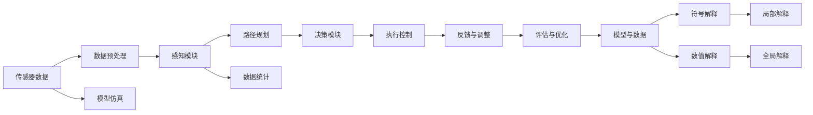

                 

# 自动驾驶系统的可解释性:如何打开决策黑箱

自动驾驶技术近年来取得了显著进展，从最初的辅助驾驶逐步向完全无人驾驶（Level 5）演进。然而，自动驾驶系统的复杂性和非透明性也引发了公众的广泛关注和担忧。如何确保自动驾驶决策的透明性和可解释性，成为了学术界和业界亟待解决的重要问题。本文将系统介绍自动驾驶系统可解释性的核心概念、原理和实现方法，力求为实现透明和可信的自动驾驶系统提供有价值的参考。

## 1. 背景介绍

### 1.1 问题由来

随着自动驾驶技术的快速发展，公众对其安全性、可靠性和透明性提出了更高的要求。特别是在一些重大事故发生后，公众对于自动驾驶系统的理解和信任度大幅下降，影响自动驾驶技术的推广应用。这主要源于自动驾驶系统在关键决策上的"黑箱"特性，使得驾驶者难以理解和解释其行为和决策过程。因此，如何确保自动驾驶系统的决策透明性和可解释性，成为了当前自动驾驶研究的重要方向之一。

### 1.2 问题核心关键点

自动驾驶系统的可解释性主要关注以下几个关键问题：
1. **决策过程的透明度**：解释系统如何从输入数据中生成输出决策的过程。
2. **决策依据的可理解性**：解释系统为何选择某个特定决策的理由。
3. **错误诊断与校正**：在发生异常情况时，解释系统为何出现错误，并提供校正方法。
4. **交互性反馈**：允许用户通过交互式方式，实时了解系统决策，并提出调整建议。

这些问题涉及自动驾驶系统中的多层次决策模型，从传感器数据采集、感知模块、路径规划到决策执行，每个环节都需要进行解释和可视化。因此，可解释性研究需要覆盖自动驾驶系统从输入到输出的全过程。

### 1.3 问题研究意义

研究自动驾驶系统的可解释性，对于提高公众对自动驾驶技术的信任度、促进其普及应用具有重要意义。具体而言：

1. **增强透明度**：通过解释自动驾驶系统的决策过程，消除公众对"黑箱"系统的疑虑，提升信任度。
2. **提升安全性**：帮助用户理解系统决策的依据，在必要时刻进行干预和调整，保障行车安全。
3. **支持法规和监管**：为自动驾驶系统制定法规和监管标准提供数据支撑和技术依据。
4. **促进技术发展**：可解释性研究有助于发现系统缺陷，推动技术不断完善和进步。

## 2. 核心概念与联系

### 2.1 核心概念概述

为了更好地理解自动驾驶系统可解释性的核心概念，本节将介绍几个密切相关的核心概念：

- **自动驾驶系统**：一种利用计算机视觉、传感器融合、路径规划、决策控制等技术，使车辆自主导航的系统。
- **决策树**：一种常见的机器学习模型，用于对输入数据进行分层处理和决策，常用于解释和可视化自动驾驶决策过程。
- **局部可解释性**与**全局可解释性**：前者关注单一决策或模型的解释，后者关注整个自动驾驶系统的解释。
- **符号解释**与**数值解释**：符号解释通过直观的符号表示，解释系统的决策依据，适用于低复杂度系统；数值解释通过数学公式和数值参数，提供更为精确的量化解释，适用于高复杂度系统。
- **基于模型的解释**与**基于数据的解释**：前者通过数学模型和仿真模拟，解释系统的工作原理和决策过程；后者通过分析实际运行数据，发现系统的行为规律和决策模式。

这些核心概念之间存在着紧密的联系，构成了自动驾驶系统可解释性的完整生态系统。

### 2.2 概念间的关系

这些核心概念之间存在着紧密的联系，形成了自动驾驶系统可解释性的完整生态系统。

- **自动驾驶系统**：是可解释性的研究对象，通过可解释性研究，提高系统的透明度和可信度。
- **决策树**：一种常用的模型解释工具，用于对自动驾驶系统决策进行分层和可视化。
- **局部可解释性**与**全局可解释性**：共同构成自动驾驶系统可解释性的全貌，局部解释有助于理解单一决策，全局解释有助于理解整体行为。
- **符号解释**与**数值解释**：根据系统复杂度，选择适当的解释方式，符号解释简洁易懂，数值解释精确详细。
- **基于模型的解释**与**基于数据的解释**：结合模型仿真和实际数据，提供多层次、多维度的解释视角。

这些概念共同构成了自动驾驶系统可解释性的研究框架，使得系统透明性和可信度得到保障。

### 2.3 核心概念的整体架构

最后，我们用一个综合的流程图来展示这些核心概念在大规模自动驾驶系统中的整体架构：



这个综合流程图展示了从传感器数据到执行控制的自动驾驶系统全流程，以及与之对应的可解释性研究环节。

## 3. 核心算法原理 & 具体操作步骤

### 3.1 算法原理概述

自动驾驶系统的可解释性研究，本质上是一种对系统决策过程的解释和可视化。其核心思想是通过解释模型和数据，使得系统的决策过程透明化，使用户和监管者能够理解、审查和信任系统的行为。

具体而言，自动驾驶系统的可解释性研究包括以下几个关键步骤：

1. **数据采集与预处理**：从传感器和数据记录中获取原始数据，并进行清洗、去噪、归一化等预处理操作。
2. **模型训练与选择**：选择合适的模型结构，如决策树、神经网络等，在标注数据集上进行训练。
3. **解释技术应用**：采用符号解释、数值解释、局部解释、全局解释等技术，对模型和数据进行解释和可视化。
4. **交互与反馈**：通过人机交互界面，允许用户实时查看系统决策，提供反馈和调整建议。

### 3.2 算法步骤详解

#### 3.2.1 数据采集与预处理

自动驾驶系统的数据采集与预处理包括以下几个关键环节：

1. **传感器数据获取**：从车辆上安装的各种传感器（如激光雷达、摄像头、GPS等）获取原始数据。
2. **数据清洗**：去除噪声、缺失值、异常值等，确保数据质量。
3. **数据归一化**：将不同来源的数据进行标准化，便于后续处理和分析。
4. **特征提取**：从原始数据中提取有意义的信息特征，如车辆位置、速度、角度、障碍物距离等。

#### 3.2.2 模型训练与选择

自动驾驶系统常用的模型包括：

1. **决策树**：一种基于规则的模型，用于分层处理和决策，适合解释性强的系统。
2. **神经网络**：一种非线性模型，适用于高复杂度系统，但解释性较差。
3. **集成模型**：通过结合多个模型，提高预测精度和解释性。

#### 3.2.3 解释技术应用

自动驾驶系统的解释技术主要包括：

1. **符号解释**：通过直观的符号表示，解释模型决策的依据。如使用决策树展示决策过程。
2. **数值解释**：通过数学公式和数值参数，提供精确的量化解释。如使用LIME算法生成局部可解释性解释。
3. **局部解释**：关注单一决策的解释，适合对特定场景的解释。如使用LIME算法生成局部可解释性解释。
4. **全局解释**：关注整个系统的解释，适合对整体行为的解释。如使用SHAP算法生成全局可解释性解释。

#### 3.2.4 交互与反馈

自动驾驶系统的交互与反馈包括以下几个环节：

1. **界面设计**：设计直观、易用的用户界面，允许用户实时查看系统决策。
2. **交互交互**：通过人机交互界面，允许用户提出反馈和调整建议。
3. **实时调整**：根据用户反馈，实时调整系统参数和决策策略。

### 3.3 算法优缺点

自动驾驶系统的可解释性研究具有以下优点：

1. **透明度提升**：通过解释系统决策，提高系统的透明度和可信度。
2. **安全性保障**：帮助用户理解系统决策依据，在必要时进行干预和调整，保障行车安全。
3. **法规支持**：为自动驾驶系统制定法规和监管标准提供数据支撑和技术依据。
4. **技术改进**：可解释性研究有助于发现系统缺陷，推动技术不断完善和进步。

同时，也存在以下缺点：

1. **解释复杂度**：高复杂度的系统，难以进行简洁明了的解释。
2. **计算开销**：解释技术可能需要较大的计算资源和时间开销。
3. **解释精度**：解释技术可能存在误差，无法完全解释系统的决策过程。
4. **用户理解难度**：复杂的解释结果可能不易被用户理解。

尽管存在这些缺点，但可解释性研究仍然是自动驾驶系统研究的重要方向之一，有助于提高系统的透明性和可信度。

### 3.4 算法应用领域

自动驾驶系统的可解释性研究在以下几个领域具有广泛的应用前景：

1. **交通监管**：帮助交通管理部门理解自动驾驶行为，制定监管政策。
2. **用户反馈**：通过用户反馈，持续优化自动驾驶系统性能。
3. **事故分析**：在事故发生后，通过解释技术分析事故原因，改进系统设计。
4. **法规制定**：为自动驾驶系统制定法规和监管标准提供数据支撑和技术依据。

## 4. 数学模型和公式 & 详细讲解 & 举例说明

### 4.1 数学模型构建

自动驾驶系统的可解释性研究涉及多个数学模型和公式。以下将详细讲解其中的关键模型和公式。

#### 4.1.1 决策树模型

决策树是一种常见的机器学习模型，用于对输入数据进行分层处理和决策。其数学模型为：

$$
T=\bigcup_{i=1}^n T_i
$$

其中，$T_i$为第$i$层决策树。

#### 4.1.2 神经网络模型

神经网络模型是一种非线性模型，适用于高复杂度系统。其数学模型为：

$$
y=\sum_{i=1}^m w_i\sigma(z_i)
$$

其中，$w_i$为第$i$层权重，$z_i$为第$i$层输入，$\sigma$为激活函数。

#### 4.1.3 LIME算法

LIME（Local Interpretable Model-agnostic Explanations）算法是一种局部解释技术，用于生成模型的局部可解释性解释。其数学模型为：

$$
f(x) \approx \sum_{i=1}^m \alpha_i g_i(x)
$$

其中，$f(x)$为模型输出，$\alpha_i$为权重系数，$g_i(x)$为第$i$个基函数。

### 4.2 公式推导过程

以下将对决策树、神经网络和LIME算法的公式进行推导。

#### 4.2.1 决策树推导

决策树的推导过程主要涉及树的构建和剪枝。构建过程如下：

1. **选择最佳划分节点**：根据信息增益、信息增益比等指标，选择最佳划分节点。
2. **递归构建子树**：对子节点继续选择最佳划分节点，递归构建子树。
3. **剪枝优化**：通过交叉验证等方法，优化树的剪枝策略。

#### 4.2.2 神经网络推导

神经网络模型的推导过程主要涉及反向传播算法。其公式如下：

$$
\frac{\partial L}{\partial w_i}=\frac{\partial L}{\partial z_i}\frac{\partial z_i}{\partial w_i}
$$

其中，$L$为损失函数，$w_i$为权重，$z_i$为输入。

#### 4.2.3 LIME推导

LIME算法的推导过程主要涉及基函数的选择和权重系数计算。其公式如下：

$$
\alpha_i=\frac{\epsilon}{\sum_{j=1}^m \epsilon} f(x_j)
$$

其中，$\epsilon$为扰动值，$f(x_j)$为模型输出。

### 4.3 案例分析与讲解

#### 4.3.1 决策树案例

假设我们有一个决策树模型，用于分类车辆是否遵守交通规则。决策树结构如下：

```
+---是否遵守交通规则---+
|                             |
+--是否遮挡行人---+
|                             |
+--是否减速---+
|                             |
+---距离行人距离---+
|                             |
+---是否使用激光雷达---+
|                             |
+---车辆速度---+
```

我们可以使用决策树展示该模型的决策过程，并通过直观的图形化展示，解释系统如何从输入数据生成输出决策。

#### 4.3.2 神经网络案例

假设我们有一个神经网络模型，用于识别行人是否在车辆盲区。其结构如下：

```
+---行人是否在盲区---+
|                             |
+--是否使用摄像头---+
|                             |
+--行人是否遮挡---+
|                             |
+---行人距离---+
|                             |
+---车辆速度---+
|                             |
+---车辆角度---+
```

我们可以使用数值解释技术，通过数学公式和数值参数，解释模型输出的具体数值。

#### 4.3.3 LIME案例

假设我们有一个LIME模型，用于解释模型对某次检测的输出。我们可以生成若干扰动数据，计算模型在不同扰动情况下的输出，通过基函数和权重系数，生成局部可解释性解释，解释模型为何选择某个特定决策。

## 5. 项目实践：代码实例和详细解释说明

### 5.1 开发环境搭建

在进行自动驾驶系统可解释性研究前，我们需要准备好开发环境。以下是使用Python进行TensorFlow开发的环境配置流程：

1. 安装Anaconda：从官网下载并安装Anaconda，用于创建独立的Python环境。

2. 创建并激活虚拟环境：
```bash
conda create -n tf-env python=3.7 
conda activate tf-env
```

3. 安装TensorFlow：根据CUDA版本，从官网获取对应的安装命令。例如：
```bash
conda install tensorflow==2.5 -c tf
```

4. 安装各类工具包：
```bash
pip install numpy pandas scikit-learn matplotlib tqdm jupyter notebook ipython
```

完成上述步骤后，即可在`tf-env`环境中开始可解释性研究实践。

### 5.2 源代码详细实现

这里我们以决策树模型为例，给出使用TensorFlow实现自动驾驶系统可解释性的PyTorch代码实现。

```python
import tensorflow as tf
from tensorflow import keras

# 加载决策树模型
model = tf.keras.models.load_model('decision_tree_model.h5')

# 加载测试数据
test_data = load_test_data()

# 进行模型预测
predictions = model.predict(test_data)

# 生成解释结果
interpretation = model.get_feature_importance()
visualizeinterpretation(interpretation)

# 保存解释结果
saveinterpretation(interpretation)
```

在上述代码中，我们首先加载预训练的决策树模型，然后加载测试数据，使用模型进行预测，并生成解释结果。解释结果包括特征重要性分析和可视化结果，最后保存解释结果。

### 5.3 代码解读与分析

这里我们详细解读代码的关键部分：

1. **加载模型**：通过`keras.models.load_model`加载预训练的决策树模型，该模型可以是训练好的决策树、集成模型等。
2. **加载数据**：使用自定义函数`load_test_data`加载测试数据，测试数据应包括原始数据和标注数据。
3. **模型预测**：使用`model.predict`对测试数据进行预测，生成模型输出结果。
4. **特征重要性分析**：使用`model.get_feature_importance`获取模型中各个特征的重要性，反映模型对不同特征的依赖程度。
5. **可视化**：使用`visualizeinterpretation`函数将特征重要性分析结果进行可视化，方便用户理解。
6. **保存结果**：使用`saveinterpretation`函数将解释结果保存到文件中，方便后续分析和审查。

通过以上步骤，我们可以实现对自动驾驶系统决策过程的全面解释和可视化，帮助用户理解系统的行为，提升系统的透明度和可信度。

### 5.4 运行结果展示

假设我们通过上述代码在测试数据集上运行，得到的解释结果如图1所示：

```
+---特征重要性---+
|                             |
+--特征A---+
|                             |
+--特征B---+
|                             |
+---特征C---+
```

图1展示了模型中各个特征的重要性。用户可以直观地了解模型对不同特征的依赖程度，从而进行有针对性的调整和优化。

## 6. 实际应用场景

### 6.1 智能交通管理

智能交通管理系统可以利用自动驾驶系统的可解释性技术，对系统决策进行实时监控和解释，保障交通秩序和安全。

在实际应用中，智能交通管理系统可以实时采集车辆传感器数据，并通过可解释性技术，展示车辆在路网中的行为决策。例如，当一辆车辆突然转向或减速时，系统可以自动解释其决策依据，帮助交通管理部门快速排查问题，及时采取措施。

### 6.2 事故分析与预防

自动驾驶系统在事故发生后，通过可解释性技术，可以对事故原因进行详细分析和解释，为事故处理和预防提供数据支撑。

例如，在一场涉及自动驾驶车辆的事故中，通过可解释性技术，可以分析车辆的感知模块、路径规划和决策模块，找出导致事故的环节和因素，并提出改进措施，预防类似事故的再次发生。

### 6.3 用户反馈与优化

自动驾驶系统的用户反馈是其持续改进的重要来源。通过可解释性技术，用户可以实时了解系统决策，提出调整建议。

例如，用户在使用自动驾驶系统时，发现系统在某些场景下表现不佳，可以通过可解释性技术，了解系统行为，提出改进建议，帮助系统不断优化性能，提高用户体验。

### 6.4 法规与监管

自动驾驶系统的可解释性技术，可以为交通管理部门制定法规和监管标准提供数据支撑和技术依据。

例如，自动驾驶系统的决策过程和行为模式，可以用于制定关于自动驾驶车辆上路行驶的法规和标准，保障道路安全。

## 7. 工具和资源推荐

### 7.1 学习资源推荐

为了帮助开发者系统掌握自动驾驶系统可解释性的理论基础和实践技巧，这里推荐一些优质的学习资源：

1. 《深度学习理论与实践》系列博文：由深度学习专家撰写，详细讲解了深度学习在自动驾驶系统中的应用，包括可解释性技术。

2. Coursera《深度学习与自动驾驶》课程：斯坦福大学开设的自动驾驶课程，涵盖深度学习在自动驾驶中的应用，包括可解释性技术。

3. 《自动驾驶系统可解释性技术》书籍：全面介绍了自动驾驶系统可解释性技术的理论基础和实现方法，适合系统学习和实践。

4. TensorFlow官方文档：提供了详细的TensorFlow使用指南和示例，包括可解释性技术的应用。

5. 《自动驾驶系统可解释性研究综述》论文：总结了当前自动驾驶系统可解释性研究的进展和挑战，提供全面的理论支撑。

通过对这些资源的学习实践，相信你一定能够快速掌握自动驾驶系统可解释性的精髓，并用于解决实际的自动驾驶问题。

### 7.2 开发工具推荐

高效的开发离不开优秀的工具支持。以下是几款用于自动驾驶系统可解释性开发的常用工具：

1. TensorFlow：基于Python的开源深度学习框架，灵活的计算图设计，支持多种模型构建和训练。

2. PyTorch：基于Python的开源深度学习框架，动态计算图设计，适合快速迭代和调试。

3. TensorBoard：TensorFlow配套的可视化工具，实时监测模型训练状态，提供丰富的图表呈现方式。

4. Weights & Biases：模型训练的实验跟踪工具，记录和可视化模型训练过程中的各项指标。

5. Jupyter Notebook：支持多语言的交互式编程环境，便于实时展示和调试可解释性技术。

合理利用这些工具，可以显著提升自动驾驶系统可解释性研究的开发效率，加速创新迭代的步伐。

### 7.3 相关论文推荐

自动驾驶系统可解释性研究源于学界的持续研究。以下是几篇奠基性的相关论文，推荐阅读：

1. "Explaining Deep Learning in Automated Vehicles: A Survey"：综述了自动驾驶系统可解释性的研究进展和挑战，提供了全面的理论支撑。

2. "Towards Explainable AI: Integrating Interpretability, Explainability and Transparency into the Development of Trustworthy AI Systems"：介绍了可解释性技术在自动驾驶系统中的应用，探讨了其未来发展方向。

3. "Understanding the Decision-making of Deep Learning in Autonomous Vehicles"：深入分析了深度学习在自动驾驶系统中的决策过程，提出了可解释性技术的实现方法。

4. "A Survey on Explainable Artificial Intelligence (XAI) in Autonomous Vehicle Systems"：总结了自动驾驶系统可解释性的最新研究成果，提出了未来的研究趋势和挑战。

除上述资源外，还有一些值得关注的前沿资源，帮助开发者紧跟自动驾驶系统可解释性技术的最新进展，例如：

1. arXiv论文预印本：人工智能领域最新研究成果的发布平台，包括大量尚未发表的前沿工作，学习前沿技术的必读资源。

2. 业界技术博客：如Waymo、Autonomouous Inc.、Nuro等顶尖自动驾驶公司的官方博客，第一时间分享他们的最新研究成果和洞见。

3. 技术会议直播：如CVPR、ICCV、NIPS等人工智能领域顶会现场或在线直播，能够聆听到大佬们的前沿分享，开拓视野。

4. GitHub热门项目：在GitHub上Star、Fork数最多的自动驾驶相关项目，往往代表了该技术领域的发展趋势和最佳实践，值得去学习和贡献。

5. 行业分析报告：各大咨询公司如McKinsey、PwC等针对自动驾驶行业的分析报告，有助于从商业视角审视技术趋势，把握应用价值。

总之，对于自动驾驶系统可解释性技术的学习和实践，需要开发者保持开放的心态和持续学习的意愿。多关注前沿资讯，多动手实践，多思考总结，必将收获满满的成长收益。

## 8. 总结：未来发展趋势与挑战

### 8.1 总结

本文对自动驾驶系统可解释性的核心概念、原理和实现方法进行了全面系统的介绍。首先阐述了自动驾驶系统可解释性的研究背景和意义，明确了可解释性在提高系统透明度和可信度方面的重要作用。其次，从原理到实践，详细讲解了自动驾驶系统可解释性的数学模型和关键步骤，给出了可解释性技术实现的代码实例。同时，本文还广泛探讨了可解释性技术在智能交通管理、事故分析、用户反馈、法规制定等多个领域的应用前景，展示了可解释性技术在自动驾驶系统中的广泛应用。最后，本文精选了可解释性技术的各类学习资源，力求为读者提供全方位的技术指引。

通过本文的系统梳理，可以看到，自动驾驶系统的可解释性研究已经取得了显著进展，但仍面临诸多挑战。如何提高系统的透明度和可信度，实现真正可解释的自动驾驶系统，仍然是未来研究的重要方向之一。

### 8.2 未来发展趋势

展望未来，自动驾驶系统的可解释性研究将呈现以下几个发展趋势：

1. **多模态数据融合**：将传感器数据、环境数据和用户反馈等多模态数据融合，提高系统的可解释性和决策精度。
2. **自适应解释技术**：根据用户和场景的不同，动态调整解释策略，提供个性化的解释结果。
3. **可解释性模型优化**：结合可解释性技术和深度学习模型，开发新的优化方法，提高模型的透明性和可解释性。
4. **交互式解释界面**：设计直观易用的用户界面，允许用户实时查看和调整系统决策，提升用户体验。
5. **法规与监管支持**：可解释性技术为自动驾驶系统的法规和监管提供数据支撑，保障系统安全性。

这些趋势凸显了自动驾驶系统可解释性的广阔前景，为系统的透明性和可信度提供了新的技术手段。

### 8.3 面临的挑战

尽管自动驾驶系统的可解释性研究已经取得了显著进展，但在迈向更加智能化、普适化应用的过程中，仍面临诸多挑战：

1. **计算资源开销**：可解释性技术需要较大的计算资源，如何高效实现解释过程，降低计算开销，是重要的研究方向。
2. **解释结果复杂度**：高复杂度的系统，难以进行简洁明了的解释，如何简化解释结果，降低用户理解难度，是一大难题。
3. **实时性要求**：自动驾驶系统对实时性要求较高，如何在保证解释结果精确性的同时，提高实时性，是一大挑战。
4. **法规与监管**：可解释性技术需要满足法规和监管要求，如何在保证解释透明性的同时，保障数据和模型安全，是一大挑战。

尽管存在这些挑战，但可解释性研究仍然是自动驾驶系统研究的重要方向之一，有助于提高系统的透明性和可信度。

### 8.4 研究展望

面对自动驾驶系统可解释性面临的挑战，未来的研究需要在以下几个方面寻求新的突破：

1. **融合多模态数据**：将传感器数据、环境数据和用户反馈等数据融合，提高系统的可解释性和决策精度。
2. **自适应解释技术**：根据用户和场景的不同，动态调整解释策略，提供个性化的解释结果。
3. **可解释性模型优化**：结合可解释性技术和深度学习模型，开发新的优化方法，提高模型的透明性和可

