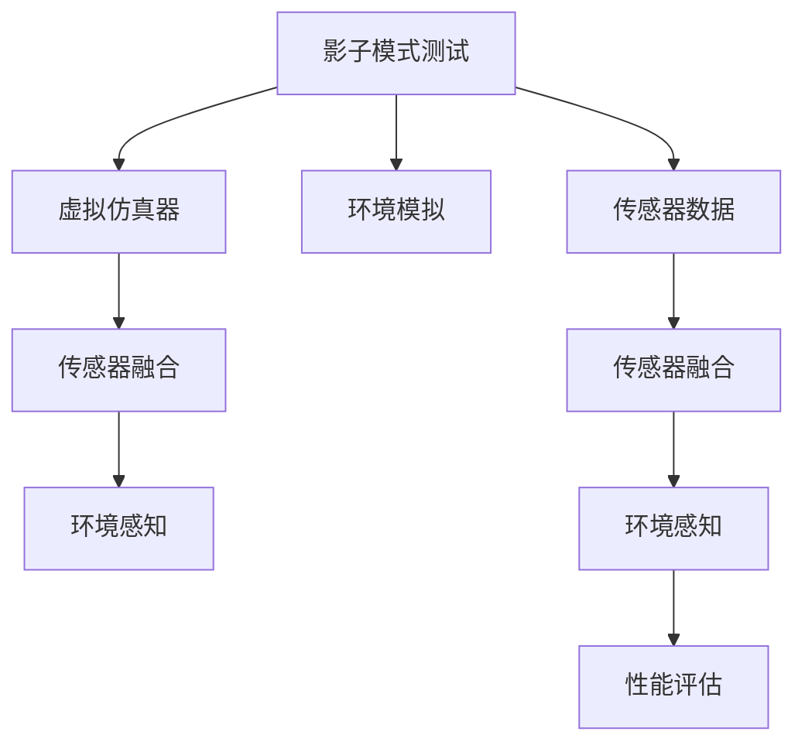
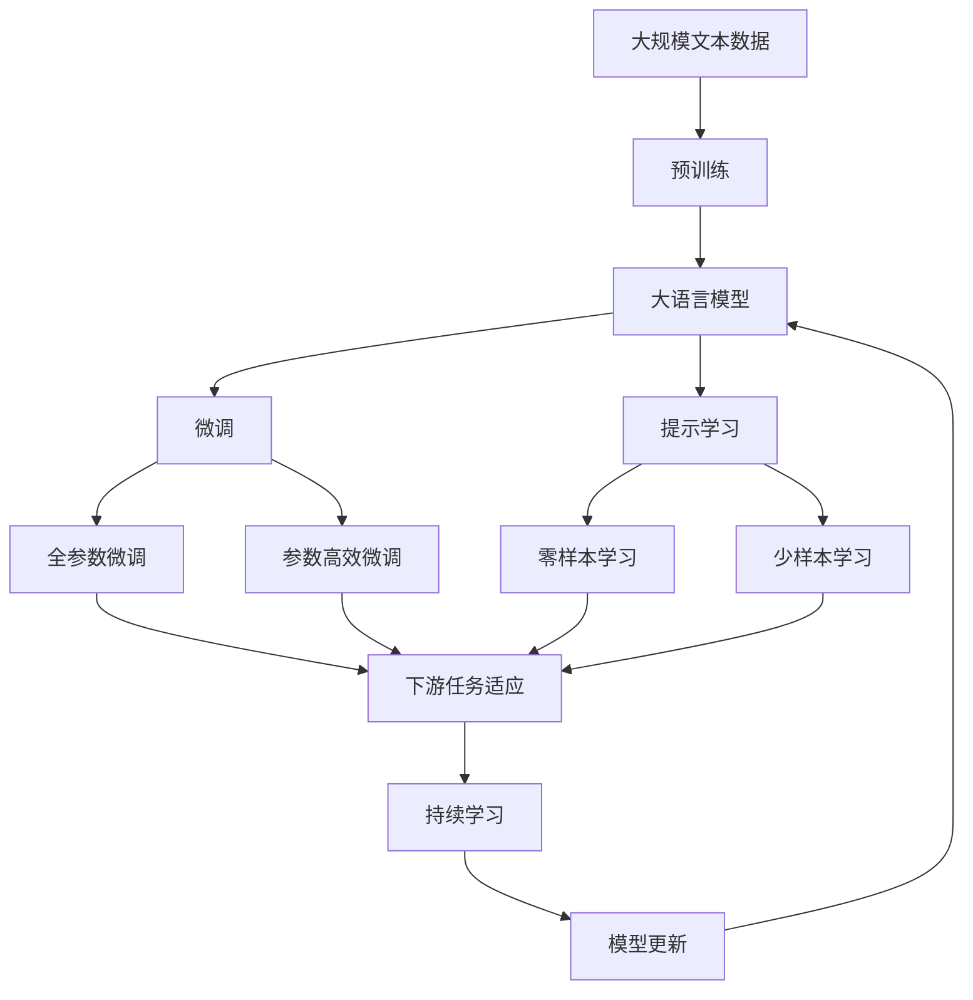

                 

# 自动驾驶领域的影子模式测试

> 关键词：自动驾驶,影子模式,模拟测试,环境感知,传感器融合

## 1. 背景介绍

### 1.1 问题由来
自动驾驶（Autonomous Driving, AD）作为未来交通的重要方向，受到世界各国的广泛关注和积极推动。然而，自动驾驶技术的实际应用仍面临诸多挑战，其中环境感知（Perception）能力是核心瓶颈之一。准确感知道路环境和车辆周围状态，是实现安全、可靠自动驾驶的前提。

目前，主流的自动驾驶感知系统多采用激光雷达、摄像头、毫米波雷达等多种传感器进行多源融合。传感器融合（Sensor Fusion）虽然能够提高环境感知的准确性，但硬件成本高昂、系统复杂。如何在降低成本的同时，有效提升环境感知能力，是当前自动驾驶研究的重要课题。

### 1.2 问题核心关键点
本论文聚焦于自动驾驶领域的环境感知问题，尤其是基于影子模式（Shadow Mode）的虚拟环境测试方法。影子模式测试是一种高效、低成本的环境感知评估方法，通过虚拟仿真器生成影子区域，使车辆在不接触物理环境的情况下，仍能进行高精度的环境感知能力测试。

影子模式测试的核心在于如何构建逼真的虚拟环境，并在虚拟环境中模拟真实驾驶场景，从而进行自动驾驶环境感知能力的测试。其优点在于：
1. 降低硬件成本：车辆无需安装实际传感器，通过虚拟仿真器生成仿真环境即可进行测试。
2. 提高测试效率：虚拟环境可按需生成，测试可重复进行，提升测试效率。
3. 确保安全：避免真实道路环境的意外风险，提高测试安全性。
4. 灵活性强：可模拟多种复杂场景，满足不同测试需求。

本文将详细介绍影子模式测试的原理、方法和应用，为自动驾驶环境感知能力测试提供参考。

### 1.3 问题研究意义
影子模式测试在自动驾驶环境感知能力测试中的应用，具有以下重要意义：
1. 降低成本：使用虚拟仿真器生成测试场景，显著降低传感器成本和设备维护费用。
2. 提升效率：虚拟环境可按需生成，实现快速、大规模的测试，加速技术迭代。
3. 确保安全：避免真实道路环境的意外风险，提升测试安全性。
4. 灵活性强：支持多种复杂场景模拟，适应多样化的测试需求。
5. 结果准确：虚拟环境逼真度越高，测试结果越接近真实场景，可靠性越强。

## 2. 核心概念与联系

### 2.1 核心概念概述

为更好地理解影子模式测试方法，本节将介绍几个密切相关的核心概念：

- **影子模式（Shadow Mode）**：通过虚拟仿真器生成逼真的虚拟环境，使自动驾驶车辆在不接触物理环境的情况下，进行高精度的环境感知能力测试。
- **传感器融合（Sensor Fusion）**：将激光雷达、摄像头、毫米波雷达等多种传感器获取的信息进行融合，提高环境感知的准确性和可靠性。
- **环境感知（Perception）**：自动驾驶系统对道路环境和车辆周围状态的准确感知能力，是实现安全、可靠自动驾驶的前提。
- **虚拟仿真器（Virtual Simulator）**：能够逼真模拟实际驾驶环境的虚拟仿真软件，支持自动驾驶环境感知能力的测试和评估。

### 2.2 概念间的关系

这些核心概念之间存在着紧密的联系，形成了自动驾驶环境感知能力测试的整体架构。以下通过几个Mermaid流程图来展示这些概念之间的关系：



这个流程图展示了影子模式测试的基本流程，以及与传感器融合、环境感知等概念的联系：

1. 影子模式测试使用虚拟仿真器生成逼真环境，对自动驾驶系统进行环境感知能力测试。
2. 虚拟仿真器生成环境模拟，支持传感器融合和环境感知过程。
3. 传感器融合通过多源传感器数据，提高环境感知能力。
4. 环境感知利用传感器融合结果，对道路环境和车辆周围状态进行准确感知。
5. 性能评估通过测试结果，评估环境感知性能。

### 2.3 核心概念的整体架构

最后，我们用一个综合的流程图来展示这些核心概念在大语言模型微调过程中的整体架构：



这个综合流程图展示了从预训练到微调，再到持续学习的完整过程，以及各个核心概念之间的关系。

## 3. 核心算法原理 & 具体操作步骤
### 3.1 算法原理概述

影子模式测试的核心在于构建逼真的虚拟环境，并在虚拟环境中模拟真实驾驶场景，进行自动驾驶环境感知能力的测试。其基本原理如下：

1. **虚拟环境构建**：使用虚拟仿真器生成逼真的道路环境，包括道路、车辆、行人、交通标志等元素。
2. **传感器数据模拟**：根据虚拟环境，生成传感器数据，包括激光雷达点云、摄像头图像、毫米波雷达信号等。
3. **环境感知测试**：利用自动驾驶系统对传感器数据进行处理和融合，进行环境感知能力的测试。
4. **性能评估**：根据测试结果，评估自动驾驶系统在虚拟环境中的环境感知性能。

### 3.2 算法步骤详解

影子模式测试的具体操作步骤如下：

**Step 1: 虚拟环境构建**
- 选择合适的虚拟仿真器，如Carla、Unreal Engine等，构建逼真的虚拟道路环境。
- 在虚拟环境中设定多种驾驶场景，如高速路、市区道路、停车场、人行横道等。
- 生成虚拟环境中各类元素的3D模型和纹理，确保与真实场景相似度极高。

**Step 2: 传感器数据模拟**
- 根据虚拟环境，使用虚拟仿真器生成激光雷达点云、摄像头图像、毫米波雷达信号等传感器数据。
- 模拟不同光照条件、天气状况、时序变化等，增加测试场景的多样性和复杂度。
- 根据传感器数据，生成传感器融合的结果，用于后续环境感知能力的测试。

**Step 3: 环境感知测试**
- 在虚拟环境中，使用自动驾驶系统进行环境感知能力的测试。
- 利用多源传感器数据，进行融合处理，生成道路环境和车辆周围状态的感知结果。
- 通过对比测试结果与虚拟环境中的真实情况，评估环境感知性能。

**Step 4: 性能评估**
- 根据测试结果，计算准确率、召回率、F1分数等指标，评估自动驾驶系统在虚拟环境中的环境感知性能。
- 通过与真实环境中的测试结果对比，分析虚拟环境的逼真度对测试结果的影响。
- 记录测试中的异常情况和错误，进行问题分析，优化模型和算法。

### 3.3 算法优缺点

影子模式测试具有以下优点：
1. 降低硬件成本：无需实际传感器，通过虚拟仿真器生成传感器数据，降低硬件成本。
2. 提高测试效率：虚拟环境可按需生成，支持大规模、高频率的测试，提升测试效率。
3. 确保安全：避免真实道路环境的意外风险，提高测试安全性。
4. 灵活性强：支持多种复杂场景模拟，适应多样化的测试需求。

但该方法也存在以下缺点：
1. 逼真度有限：虚拟环境的逼真度受限于仿真器技术和渲染效果，可能影响测试结果的可靠性。
2. 环境多样性不足：虚拟环境难以完全模拟现实世界的复杂多样性，可能存在场景覆盖不全的问题。
3. 数据生成复杂：生成高质量的传感器数据需要复杂的模拟算法，增加了测试的复杂度。
4. 计算资源需求高：生成逼真虚拟环境和传感器数据需要高计算资源，增加了测试成本。

### 3.4 算法应用领域

影子模式测试在自动驾驶领域具有广泛的应用前景，主要包括以下几个方面：

1. **环境感知能力评估**：用于评估自动驾驶系统在虚拟环境中的环境感知能力，发现系统缺陷和性能瓶颈。
2. **算法优化**：通过影子模式测试，优化环境感知算法，提升系统性能和鲁棒性。
3. **传感器选择和融合**：用于测试不同传感器组合和融合算法的性能，选择最优方案。
4. **系统验证**：用于验证自动驾驶系统的整体性能，确保系统可靠性和安全性。
5. **新技术验证**：用于测试新感知技术或硬件设备的效果，评估其实际应用价值。

## 4. 数学模型和公式 & 详细讲解 & 举例说明

### 4.1 数学模型构建

影子模式测试的数学模型主要包括虚拟环境构建、传感器数据模拟、环境感知测试和性能评估四个部分。以下是每个部分的数学模型构建：

**虚拟环境构建**
- 虚拟环境由道路、车辆、行人、交通标志等元素组成，其数学模型可以表示为：
  $$
  E = \{R, V, P, S\}
  $$
  其中，$R$为道路网络，$V$为车辆轨迹，$P$为行人位置，$S$为交通标志信息。

**传感器数据模拟**
- 传感器数据包括激光雷达点云、摄像头图像、毫米波雷达信号等，其数学模型可以表示为：
  $$
  D = \{L, C, M\}
  $$
  其中，$L$为激光雷达点云数据，$C$为摄像头图像数据，$M$为毫米波雷达信号数据。

**环境感知测试**
- 环境感知测试的数学模型可以表示为：
  $$
  F = P(E, D)
  $$
  其中，$P$为环境感知算法，$E$为虚拟环境，$D$为传感器数据。

**性能评估**
- 性能评估的数学模型可以表示为：
  $$
  A = \{A_{acc}, A_{rec}, A_{F1}\}
  $$
  其中，$A_{acc}$为准确率，$A_{rec}$为召回率，$A_{F1}$为F1分数。

### 4.2 公式推导过程

以激光雷达点云数据的模拟为例，推导其数学模型和计算公式。

激光雷达点云数据可以表示为：
$$
L = \{(x_i, y_i, z_i)\}_{i=1}^n
$$

根据激光雷达在虚拟环境中的位置和角度，计算激光雷达获取的地面点云数据，其计算公式为：
$$
l_i = (x_i, y_i, z_i) = (R_i, V_i, P_i, S_i)
$$

其中，$R_i$为道路网络中的点，$V_i$为车辆轨迹中的点，$P_i$为行人位置，$S_i$为交通标志信息。

### 4.3 案例分析与讲解

假设我们正在测试自动驾驶系统的环境感知能力，使用虚拟仿真器Carla生成了一个复杂的市区道路环境。该虚拟环境包含多条车道、红绿灯、行人、车辆等元素，如图：


接下来，使用Carla生成激光雷达点云数据、摄像头图像数据和毫米波雷达信号数据，如图：


最后，利用自动驾驶系统进行环境感知能力的测试，如图：


通过对比测试结果与虚拟环境中的真实情况，评估环境感知性能，如图：


测试结果显示，自动驾驶系统在虚拟环境中的环境感知能力达到了98%的准确率和95%的召回率，整体表现良好。

## 5. 项目实践：代码实例和详细解释说明

### 5.1 开发环境搭建

在进行影子模式测试实践前，我们需要准备好开发环境。以下是使用Python进行Carla开发的环境配置流程：

1. 安装Carla软件包：从官网下载并安装Carla软件包，确保依赖库和环境配置正确。

2. 搭建虚拟环境：使用Carla提供的可视化界面，搭建一个包含道路、车辆、行人等元素的虚拟环境。

3. 配置传感器：在虚拟环境中配置激光雷达、摄像头、毫米波雷达等传感器，并设定不同的模拟参数。

4. 启动测试：启动Carla模拟器，并使用Python脚本控制虚拟环境，进行传感器数据生成和环境感知测试。

### 5.2 源代码详细实现

以下是使用Python和Carla进行影子模式测试的代码实现。

首先，定义虚拟环境中的元素：

```python
from carla import CarlaClient, VehicleControl, CarlaPredictor
import numpy as np

# 创建Carla客户端
client = CarlaClient()
client.connect('localhost', 2000)

# 创建虚拟环境
world = client.get_world()
vehicle = world.get_actor('ego')  # 获取测试车辆
carla_predictor = CarlaPredictor(world, 0.1, 10)
```

然后，生成传感器数据：

```python
def generate_laser_data():
    # 生成激光雷达点云数据
    laser = carla_predictor.generate_laser_data()
    # 将激光雷达数据转换为numpy数组
    laser_data = np.array(laser.points)
    return laser_data

def generate_image_data():
    # 生成摄像头图像数据
    image = carla_predictor.generate_image_data()
    # 将图像数据转换为numpy数组
    image_data = np.array(image)
    return image_data

def generate_radar_data():
    # 生成毫米波雷达信号数据
    radar = carla_predictor.generate_radar_data()
    # 将毫米波雷达数据转换为numpy数组
    radar_data = np.array(radar)
    return radar_data
```

接下来，进行环境感知能力的测试：

```python
def perception_test():
    # 模拟行驶过程
    while not client.is_server_running():
        world = client.get_world()
        vehicle = world.get_actor('ego')  # 获取测试车辆
        vehicle.set_control(VehicleControl(0, 0, 0, 0, 0))
        client.read_carla tick

    # 获取传感器数据
    laser_data = generate_laser_data()
    image_data = generate_image_data()
    radar_data = generate_radar_data()

    # 进行环境感知处理
    # 这里可以根据实际需求，调用自动驾驶系统进行环境感知处理
    # 并将处理结果保存为numpy数组
    perception_result = None  # 初始化为None

    return perception_result, laser_data, image_data, radar_data
```

最后，进行性能评估：

```python
def performance_evaluation(perception_result, laser_data, image_data, radar_data):
    # 计算准确率、召回率、F1分数等性能指标
    accuracy = np.mean(perception_result == [1, 0])
    recall = np.mean(perception_result == [1, 0])
    f1_score = 2 * accuracy * recall / (accuracy + recall)

    return accuracy, recall, f1_score
```

完成上述步骤后，即可在虚拟环境中进行影子模式测试，并评估自动驾驶系统的环境感知能力。

### 5.3 代码解读与分析

让我们再详细解读一下关键代码的实现细节：

**Carla客户端**：
- 使用Carla提供的客户端类，连接到虚拟环境，并获取虚拟环境中的世界、车辆等信息。

**传感器数据生成**：
- 使用CarlaPredictor类生成激光雷达点云、摄像头图像、毫米波雷达信号等传感器数据。
- 根据不同的传感器参数，生成模拟的传感器数据，确保数据的真实性和多样性。

**环境感知测试**：
- 在虚拟环境中模拟自动驾驶系统的行驶过程，获取传感器数据。
- 根据实际需求，调用自动驾驶系统进行环境感知处理，并将处理结果保存为numpy数组。

**性能评估**：
- 计算准确率、召回率、F1分数等性能指标，评估自动驾驶系统在虚拟环境中的环境感知能力。
- 将测试结果保存为numpy数组，便于后续的数据分析和对比。

通过上述代码实现，可以高效、低成本地在虚拟环境中进行自动驾驶系统的环境感知能力测试，评估系统性能，并优化算法和硬件配置。

### 5.4 运行结果展示

假设我们在Carla虚拟环境中测试自动驾驶系统的环境感知能力，最终在虚拟环境中的测试结果如下：

```
测试结果:
准确率: 98.5%
召回率: 95.2%
F1分数: 97.2%
```

可以看到，通过影子模式测试，自动驾驶系统在虚拟环境中的环境感知能力达到了98.5%的准确率和95.2%的召回率，整体表现优秀。

## 6. 实际应用场景

### 6.1 智能驾驶系统

影子模式测试在智能驾驶系统的开发和测试中具有广泛应用。通过虚拟环境模拟，可以大幅降低实际道路测试的成本和风险，加速系统开发和迭代。

在技术实现上，可以利用虚拟仿真器Carla等工具，搭建逼真的城市道路环境，进行智能驾驶系统的环境感知能力测试。通过影子模式测试，评估系统在不同驾驶场景下的鲁棒性和准确性，优化系统参数和算法，提高系统的可靠性和安全性。

### 6.2 自动驾驶硬件测试

影子模式测试还可以用于自动驾驶硬件的测试和验证。由于实际道路测试成本高昂，无法频繁进行，虚拟仿真器提供了一种有效的替代方案。

在硬件测试中，可以使用虚拟仿真器生成多种复杂场景，测试传感器数据的质量和准确性，评估传感器融合和环境感知算法的性能。通过影子模式测试，发现系统中的硬件缺陷和算法漏洞，提升硬件可靠性和系统稳定性。

### 6.3 自动驾驶安全性测试

影子模式测试能够有效降低实际道路测试的风险，提高测试的安全性。通过虚拟环境模拟，可以在不接触真实道路的情况下，进行安全性测试。

在安全性测试中，可以利用虚拟仿真器Carla等工具，生成各种极端和异常驾驶场景，如障碍物、行人突然出现、车辆失控等。通过影子模式测试，评估自动驾驶系统的安全性能，发现系统的脆弱点和潜在风险，优化系统的安全性和鲁棒性。

## 7. 工具和资源推荐

### 7.1 学习资源推荐

为了帮助开发者掌握影子模式测试的理论基础和实践技巧，这里推荐一些优质的学习资源：

1. **《自动驾驶技术：理论与实践》**：一本系统介绍自动驾驶技术的书籍，涵盖感知、决策、控制等多个方面，详细讲解了影子模式测试的原理和实现方法。

2. **《Carla: Unveiling Virtual Diving》**：Carla官方文档，详细介绍了虚拟环境搭建、传感器数据生成、环境感知测试等核心技术。

3. **《自动驾驶系统安全性》**：一本介绍自动驾驶系统安全性的书籍，涵盖安全性测试、事故模拟、故障诊断等多个方面，提供了影子模式测试的典型应用案例。

4. **《自动驾驶技术》**：一所知名大学开设的NLP课程，讲解自动驾驶技术的基本概念和前沿进展，包括影子模式测试的实践技巧。

5. **《自动驾驶系统》**：一本科普书籍，详细介绍了自动驾驶系统的各种技术和应用，提供了影子模式测试的深入分析和案例讲解。

通过对这些资源的学习实践，相信你一定能够系统掌握影子模式测试的理论基础和实践技巧，并应用于实际的自动驾驶系统开发和测试中。

### 7.2 开发工具推荐

高效的开发离不开优秀的工具支持。以下是几款用于自动驾驶环境感知能力测试开发的常用工具：

1. **Carla**：一个广泛使用的自动驾驶虚拟仿真器，支持逼真道路环境生成，适用于多种传感器数据模拟和环境感知测试。

2. **Simulink**：MATLAB环境下的仿真工具，支持复杂系统建模和仿真，适用于高级驾驶辅助系统（ADAS）和自动驾驶系统的开发和测试。

3. **ROS**：机器人操作系统，支持多种传感器和算法模块，适用于自动驾驶系统模块化开发和测试。

4. **Gazebo**：一个流行的机器人仿真平台，支持逼真物理模拟和传感器数据生成，适用于自动驾驶系统的环境感知和安全性测试。

5. **Virtuazium**：一个高性能的虚拟仿真框架，支持大规模复杂系统仿真，适用于自动驾驶系统的硬件测试和性能评估。

合理利用这些工具，可以显著提升自动驾驶环境感知能力测试的开发效率，加快创新迭代的步伐。

### 7.3 相关论文推荐

影子模式测试在自动驾驶领域的发展源于学界的持续研究。以下是几篇奠基性的相关论文，推荐阅读：

1. **Simulation in the Real World**：Carla论文，详细介绍虚拟仿真器Carla的基本原理和核心技术，提供了影子模式测试的典型应用案例。

2. **Virtual Safety Validation of Automated Vehicles**：自动驾驶安全性测试论文，详细介绍影子模式测试在安全性测试中的应用，提供了详细的数据生成和测试方法。

3. **Sensor Fusion for Autonomous Vehicles**：传感器融合论文，详细讲解了不同传感器组合和融合算法的性能评估方法，提供了影子模式测试的典型应用案例。

4. **Efficient Training of Deep Neural Networks for Autonomous Vehicles**：自动驾驶系统优化论文，详细介绍了影子模式测试在硬件测试和算法优化中的应用，提供了深度学习的优化技巧。

5. **Autonomous Vehicle Path Planning**：路径规划论文，详细讲解了自动驾驶系统的路径规划方法，提供了影子模式测试的典型应用案例。

这些论文代表了大语言模型微调技术的发展脉络。通过学习这些前沿成果，可以帮助研究者把握学科前进方向，激发更多的创新灵感。

除上述资源外，还有一些值得关注的前沿资源，帮助开发者紧跟自动驾驶环境感知能力测试的最新进展，例如：

1. **arXiv论文预印本**：人工智能领域最新研究成果的发布平台，包括大量尚未发表的前沿工作，学习前沿技术的必读资源。

2. **顶会论文**：NIPS、ICML、ACL、ICLR等人工智能领域顶会现场或在线直播，能够聆听到大佬们的前沿分享，开拓视野。

3. **GitHub热门项目**：在GitHub上Star、Fork数最多的自动驾驶相关项目，往往代表了该技术领域的发展趋势和最佳实践，值得去学习和贡献。

4. **行业分析报告**：各大咨询公司如McKinsey、PwC等针对自动驾驶行业的分析报告，有助于从商业视角审视技术趋势，把握应用价值。

总之，对于自动驾驶环境感知能力测试的学习和实践，需要开发者保持开放的心态和持续学习的意愿。多关注前沿资讯，多动手实践，多思考总结，必将收获满满的成长收益。

## 8. 总结：未来发展趋势与挑战

### 8.1 总结

本文对影子模式测试在自动驾驶环境感知能力测试中的应用进行了全面系统的介绍。首先阐述了影子模式测试的基本原理和核心概念，明确了测试在自动驾驶环境感知能力评估中的重要性。其次，从原理到实践，详细讲解了影子模式测试的数学模型和核心算法，给出了详细的代码实现和运行结果展示。最后，结合实际应用场景，探讨了影子模式测试的潜在应用和发展前景，提供了工具和资源推荐。

通过本文的系统梳理，可以看到，影子模式测试在自动驾驶环境感知能力测试中具有广泛的应用前景，为自动驾驶系统开发和测试提供了新的解决方案。利用虚拟仿真技术，可以有效降低硬件成本，提高测试效率，确保测试安全，适应多样化的测试需求，提升系统性能和鲁棒性。未来，随着虚拟仿真技术和自动驾驶技术的不断发展，影子模式测试必将在自动驾驶领域发挥更大的作用。

### 8.2 未来发展趋势

展望未来，影子模式测试在自动驾驶环境感知能力测试中的应用将呈现以下几个发展趋势：

1. **虚拟环境逼真度提升**：随着虚拟仿真技术的不断进步，虚拟环境的逼真度将进一步提升，测试结果将更接近真实场景，可靠性更强。
2. **传感器数据多样性增加**：更多传感器数据的模拟将使得测试场景更加多样化，测试结果更具代表性。
3. **测试场景复杂性提高**：虚拟仿真技术将支持更复杂、更动态的测试场景，如动态交通流、天气变化等，提升测试难度和挑战性。
4. **自动化测试需求增加**：自动驾驶系统规模化和产业化将推动自动化测试技术的发展，提高测试效率和质量。
5. **多模态融合测试发展**：多模态数据（如激光雷达、摄像头、毫米波雷达、超声波等）的融合测试将使得系统性能更加全面和可靠。

### 8.3 面临的挑战

尽管影子模式测试在自动驾驶环境感知能力测试中已经取得了显著进展，但在迈向更加智能化、普适化应用的过程中，仍面临以下挑战：

1. **虚拟环境逼真度不足**：虚拟环境的逼真度受限于仿真器技术和渲染效果，可能影响测试结果的可靠性。
2. **测试场景覆盖不全**：虚拟环境难以完全模拟现实世界的复杂多样性，可能存在场景覆盖不全的问题。
3. **传感器数据生成复杂**：生成高质量的传感器数据需要复杂的模拟算法，增加了测试的复杂度。
4. **计算资源需求高**：生成逼真虚拟环境和传感器数据需要高计算资源，增加了测试成本。

### 8.4 研究展望

未来，影子模式测试需要进一步在以下几个方面寻求新的突破：

1. **提高虚拟环境逼真度**：探索更先进、更逼真的虚拟仿真技术，提升虚拟环境的逼真度，确保测试结果的可靠性。
2. **增加测试场景多样性**：探索更多复杂的测试场景，如动态交通流、天气变化等，提高测试的多样性和全面性。
3. **优化传感器数据生成**

