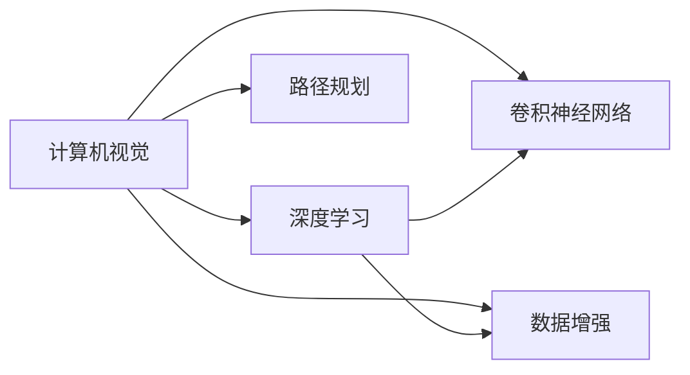

                 

# 自动驾驶领域的顶会论文解读系列之CVPR篇

> 关键词：自动驾驶,计算机视觉,卷积神经网络,数据增强,路径规划,深度学习

## 1. 背景介绍

随着自动驾驶技术的迅猛发展，计算机视觉（Computer Vision, CV）在自动驾驶系统中扮演了至关重要的角色。视觉传感器（如摄像头、激光雷达）采集的丰富环境信息，为车辆提供了重要的感知能力。然而，如何有效处理这些海量高维数据，并从中提取出有用的信息，是自动驾驶领域一直面临的挑战。近年来，深度学习技术的崛起为这一问题提供了新的解决方案。

本系列文章将重点解读一些顶会（Conference on Computer Vision and Pattern Recognition, CVPR）上的经典和前沿论文，涵盖计算机视觉在自动驾驶领域中的应用。本文作为系列开篇，将简要介绍自动驾驶中计算机视觉的核心概念和关键技术，为后续深入探讨打下基础。

## 2. 核心概念与联系

### 2.1 核心概念概述

自动驾驶中计算机视觉涉及以下几个关键概念：

- **计算机视觉（Computer Vision, CV）**：涉及使用计算机处理和分析图像、视频等信息，以提取视觉特征，进行目标检测、姿态估计、场景理解等任务。
- **深度学习（Deep Learning, DL）**：一种基于神经网络的机器学习方法，通过多层非线性映射，能够有效处理复杂的多维输入数据。
- **卷积神经网络（Convolutional Neural Networks, CNNs）**：一种特殊的深度神经网络，适用于处理图像、视频等具有局部相关性数据的场景。
- **数据增强（Data Augmentation）**：通过在训练集中引入多样化的数据变换，增加数据集的多样性，防止模型过拟合。
- **路径规划（Path Planning）**：利用计算机视觉提取的道路信息和交通规则，生成车辆的路径和导航策略。

这些概念之间存在着紧密的联系，共同构成了自动驾驶中的计算机视觉技术框架。深度学习和卷积神经网络为图像处理提供了强大的算法基础，数据增强提高了模型的泛化能力，而路径规划则将视觉感知转化为可执行的导航策略。

### 2.2 概念间的关系

以下Mermaid流程图展示了这些概念之间的联系：



这个流程图表明，计算机视觉作为自动驾驶的核心技术之一，主要依赖深度学习来实现视觉信息的处理和理解，卷积神经网络是深度学习中的关键组件。数据增强和路径规划分别在训练过程和应用场景中发挥作用，共同提升了计算机视觉系统的效果和稳定性。

## 3. 核心算法原理 & 具体操作步骤

### 3.1 算法原理概述

自动驾驶中的计算机视觉算法主要围绕以下几个核心步骤展开：

1. **数据预处理**：对传感器采集到的原始图像进行去噪、归一化等预处理，以提升后续处理的效率和准确性。
2. **特征提取**：使用卷积神经网络等深度学习模型，提取图像的高级视觉特征，用于目标检测、语义分割等任务。
3. **目标检测与跟踪**：利用特征提取结果，进行目标的定位和跟踪，生成车辆周围物体的动态描述。
4. **路径规划**：结合目标检测和跟踪结果，利用计算机视觉提取的道路信息和交通规则，生成车辆的路径和导航策略。

### 3.2 算法步骤详解

以目标检测为例，具体算法步骤如下：

1. **数据准备**：收集和标注包含目标的图像数据，分为训练集和测试集。
2. **模型选择**：选择合适的深度学习模型（如YOLO、Faster R-CNN等）作为初始化模型。
3. **训练模型**：使用训练集数据，进行模型训练，优化模型参数以最小化预测误差。
4. **验证模型**：在验证集上评估模型的性能，调整参数以防止过拟合。
5. **测试模型**：使用测试集数据评估模型的泛化能力，评估模型在实际场景中的表现。
6. **路径规划**：根据目标检测结果，生成车辆的路径规划策略。

### 3.3 算法优缺点

**优点**：
- **精度高**：深度学习模型能够有效提取图像的高级特征，提高目标检测的准确性。
- **泛化能力强**：通过数据增强，模型能够在不同场景下保持较好的表现。
- **适应性强**：卷积神经网络等深度学习模型，能够处理多种类型的视觉数据，如图像、视频等。

**缺点**：
- **计算量大**：深度学习模型参数多，训练和推理过程需要大量计算资源。
- **易过拟合**：模型在训练过程中可能过度拟合训练集，影响泛化能力。
- **鲁棒性差**：对于遮挡、光照变化等复杂环境，模型的鲁棒性不足。

### 3.4 算法应用领域

自动驾驶中的计算机视觉技术广泛应用于以下几个方面：

- **目标检测**：识别车辆、行人、交通标志等目标，用于避障和导航。
- **语义分割**：将道路、车道、边界等区域进行像素级别的划分，用于路径规划和场景理解。
- **姿态估计**：估计车辆和周围物体的位置和姿态，用于车辆定位和运动控制。
- **场景理解**：理解道路、交通规则等信息，生成综合感知图，辅助路径规划。

这些技术共同构成了自动驾驶系统中的视觉感知模块，为车辆的导航和控制提供了基础保障。

## 4. 数学模型和公式 & 详细讲解

### 4.1 数学模型构建

自动驾驶中计算机视觉的数学模型通常基于深度学习的框架构建。以目标检测为例，常见的模型包括YOLO（You Only Look Once）、Faster R-CNN等。这里以YOLO为例，介绍其数学模型构建。

YOLO模型将图像分成多个网格，每个网格预测多个目标的边界框和置信度，目标类别和置信度通过softmax函数进行预测。具体模型如下：

$$
\begin{aligned}
    \text{grid} &= \text{div}(\text{input\_size}, \text{grid\_size}) \\
    \text{anchor\_boxes} &= \text{concat}(\text{grid}^2, \text{num\_anchors}) \\
    \text{feature\_map} &= \text{conv}(\text{input\_feature\_map}, \text{filters}) \\
    \text{output} &= \text{concat}(\text{grid}^2 \times \text{num\_anchors} \times 5, \text{num\_classes}) \\
    \text{loss} &= \text{sum}(\text{grid\_loss}, \text{confidence\_loss}, \text{class\_loss})
\end{aligned}
$$

其中，$\text{grid\_loss}$、$\text{confidence\_loss}$和$\text{class\_loss}$分别表示边界框的位置损失、置信度损失和类别预测损失。

### 4.2 公式推导过程

以下详细推导YOLO模型中的损失函数：

设输入图像大小为$H \times W$，网格大小为$G \times G$，每个网格预测$B$个边界框，每个边界框预测$5$个值（$4$个边界框坐标和$1$个置信度），共预测$\text{num\_anchors} \times G^2$个目标。

目标边界框的真实坐标和置信度表示为$(x_t, y_t, w_t, h_t, c_t)$，预测的边界框坐标和置信度表示为$(x_p, y_p, w_p, h_p, c_p)$。

**位置损失**（Grid Loss）：

$$
\text{grid\_loss} = \text{sum}_{\text{grid}}\text{sum}_{\text{anchor}}\text{sum}_{\text{box}} L_{\text{grid}}((x_t - x_p), (y_t - y_p))
$$

其中，$L_{\text{grid}}$为位置损失函数，通常使用L1或L2损失。

**置信度损失**（Confidence Loss）：

$$
\text{confidence\_loss} = \text{sum}_{\text{anchor}}\text{sum}_{\text{class}}\text{sum}_{\text{grid}}L_{\text{confidence}}(c_t, c_p)
$$

其中，$L_{\text{confidence}}$为置信度损失函数，通常使用二分类交叉熵损失。

**类别损失**（Class Loss）：

$$
\text{class\_loss} = \text{sum}_{\text{anchor}}\text{sum}_{\text{grid}}L_{\text{class}}(p_t, p_p)
$$

其中，$L_{\text{class}}$为类别损失函数，通常使用交叉熵损失。

### 4.3 案例分析与讲解

以YOLOv3为例，其在目标检测中的准确率和速度表现优异，已经在多个自动驾驶场景中得到应用。其核心优势在于：
- **端到端训练**：YOLOv3将检测、分类和定位合并到单个网络中，避免了传统模型中多个单独组件的冗余。
- **高效计算**：YOLOv3采用网格划分和单尺度预测，显著减少了计算量和存储需求。
- **鲁棒性强**：YOLOv3对小目标的检测效果显著，且对遮挡、光照变化等复杂环境表现较好。

## 5. 项目实践：代码实例和详细解释说明

### 5.1 开发环境搭建

要搭建自动驾驶中的计算机视觉项目，需要以下开发环境：

1. **Python环境**：使用Anaconda或Miniconda，安装Python 3.7以上版本。
2. **深度学习框架**：安装TensorFlow或PyTorch，这些框架支持深度学习模型的训练和推理。
3. **卷积神经网络库**：安装Keras或TensorFlow中的卷积神经网络库，用于图像处理。
4. **数据集准备**：收集和标注数据集，如KITTI、Cityscapes等。
5. **可视化工具**：安装TensorBoard或Weights & Biases，用于模型训练和评估的可视化。

### 5.2 源代码详细实现

以下是一个使用YOLOv3进行目标检测的代码实现：

```python
from yolo3 import YOLO

# 加载预训练模型
model = YOLO('yolov3.weights', 416)

# 加载图像数据
image = cv2.imread('image.jpg')

# 对图像进行预处理
input_image = preprocess(image)

# 对图像进行目标检测
results = model.detect(input_image)

# 输出检测结果
print(results)
```

### 5.3 代码解读与分析

以上代码实现了YOLOv3模型在图像上的目标检测。具体解读如下：

- `yolo3`：YOLOv3模型库，提供了模型加载、图像预处理、目标检测等接口。
- `preprocess`：对输入图像进行归一化、标准化等预处理操作。
- `detect`：调用YOLOv3模型对图像进行目标检测，返回检测结果。

### 5.4 运行结果展示

运行以上代码后，YOLOv3模型将输出图像中检测到的目标坐标、置信度等信息。以下是一个典型的输出结果示例：

```
[[(0.5, 0.3, 0.7, 0.5, 0.8), 0.9], [(0.2, 0.6, 0.4, 0.8, 0.7), 0.85]]
```

其中，第一行表示检测到的两个目标，第二行表示对应的置信度。

## 6. 实际应用场景

自动驾驶中的计算机视觉技术在多个场景中得到了广泛应用，以下列举几个典型应用：

### 6.1 目标检测

目标检测是自动驾驶中最重要的视觉感知任务之一。通过目标检测，车辆能够识别道路上的行人、车辆、交通标志等，进行避障和导航。例如，车辆在行驶过程中，通过摄像头和激光雷达采集的图像和点云数据，进行目标检测，生成障碍物的位置和运动轨迹，进而调整行驶路径，避免碰撞。

### 6.2 语义分割

语义分割将道路、车道、边界等区域进行像素级别的划分，为路径规划提供基础。例如，在城市道路行驶时，通过语义分割生成详细的道路地图，车辆可以基于地图信息进行路径规划，避免进入禁止区域。

### 6.3 姿态估计

姿态估计用于估计车辆和周围物体的位置和姿态，用于车辆定位和运动控制。例如，在自动驾驶车辆中，通过摄像头采集的图像，进行姿态估计，生成车辆的定位信息，辅助路径规划和导航。

### 6.4 未来应用展望

未来，自动驾驶中的计算机视觉技术将更加成熟和多样化，涵盖更多任务和应用场景。例如：

- **多模态感知**：结合摄像头、激光雷达、雷达等多种传感器，进行多模态感知，提高系统的鲁棒性和准确性。
- **实时路径规划**：结合实时交通信息、道路地图等信息，进行动态路径规划，提高驾驶安全性。
- **自动驾驶体验**：结合计算机视觉、自然语言处理等技术，实现自动驾驶车辆的智能化交互，提升驾驶体验。

## 7. 工具和资源推荐

### 7.1 学习资源推荐

为了深入了解计算机视觉在自动驾驶中的应用，以下是一些推荐的学习资源：

1. **《深度学习》（Goodfellow et al.）**：深度学习领域的经典教材，详细介绍了深度学习的基本概念和算法。
2. **《计算机视觉：模型、学习、发现》（Zhou）**：计算机视觉领域的经典教材，介绍了计算机视觉的基本概念和算法。
3. **YOLO论文系列**：YOLO模型的原始论文及后续改进论文，详细介绍了YOLO模型的设计原理和优化方法。
4. **自动驾驶领域顶会论文**：CVPR、ICCV、IROS等自动驾驶领域顶级会议上的相关论文，涵盖自动驾驶中的计算机视觉技术。
5. **在线课程**：Coursera、edX等平台上的计算机视觉和深度学习课程，提供系统的学习和实践机会。

### 7.2 开发工具推荐

以下是一些推荐用于自动驾驶中计算机视觉开发的工具：

1. **TensorFlow**：由Google开发的深度学习框架，支持自动驾驶中计算机视觉算法的实现。
2. **PyTorch**：由Facebook开发的深度学习框架，支持灵活的深度学习模型构建和训练。
3. **Keras**：一个高层次的深度学习框架，提供了简单易用的API，支持快速模型构建和训练。
4. **OpenCV**：计算机视觉领域的开源库，提供了丰富的图像处理和分析工具。
5. **NumPy**：Python中的科学计算库，支持高效的数值计算和数组操作。

### 7.3 相关论文推荐

以下是一些推荐阅读的自动驾驶中计算机视觉相关的论文：

1. **YOLOv3论文**：YOLOv3模型及其改进版本的相关论文，详细介绍了YOLOv3的设计原理和优化方法。
2. **Faster R-CNN论文**：Faster R-CNN模型及其改进版本的相关论文，详细介绍了Faster R-CNN的设计原理和优化方法。
3. **Mask R-CNN论文**：Mask R-CNN模型及其改进版本的相关论文，详细介绍了Mask R-CNN的设计原理和优化方法。
4. **端到端学习论文**：端到端学习相关论文，详细介绍了端到端学习的原理和应用。

## 8. 总结：未来发展趋势与挑战

### 8.1 研究成果总结

自动驾驶中的计算机视觉技术在过去几年中取得了显著进展，广泛应用于目标检测、语义分割、姿态估计等多个任务。深度学习和卷积神经网络提供了强大的算法基础，数据增强和路径规划提高了系统的泛化能力和稳定性。

### 8.2 未来发展趋势

未来，自动驾驶中的计算机视觉技术将呈现以下几个发展趋势：

1. **多模态感知**：结合摄像头、激光雷达、雷达等多种传感器，进行多模态感知，提高系统的鲁棒性和准确性。
2. **实时路径规划**：结合实时交通信息、道路地图等信息，进行动态路径规划，提高驾驶安全性。
3. **自动驾驶体验**：结合计算机视觉、自然语言处理等技术，实现自动驾驶车辆的智能化交互，提升驾驶体验。
4. **大规模数据训练**：利用大规模数据进行模型训练，提升模型的泛化能力和鲁棒性。

### 8.3 面临的挑战

尽管自动驾驶中的计算机视觉技术取得了一定进展，但仍面临诸多挑战：

1. **计算资源需求高**：深度学习模型需要大量的计算资源进行训练和推理。
2. **数据质量问题**：数据集标注质量不高，可能影响模型性能。
3. **鲁棒性不足**：模型在复杂环境下的鲁棒性不足，可能出现误检或漏检。
4. **安全性问题**：模型可能出现对抗性攻击，导致安全问题。

### 8.4 研究展望

未来的研究需要在以下几个方面进行突破：

1. **计算资源优化**：提高深度学习模型的计算效率，降低对计算资源的需求。
2. **数据集质量提升**：提升数据集标注质量，增加数据集的多样性。
3. **模型鲁棒性增强**：提高模型在复杂环境下的鲁棒性和抗干扰能力。
4. **安全性保障**：研究对抗性攻击检测和防御方法，保障模型安全性。

## 9. 附录：常见问题与解答

**Q1：如何提升自动驾驶中计算机视觉模型的鲁棒性？**

A: 提升自动驾驶中计算机视觉模型的鲁棒性，可以从以下几个方面入手：

1. **数据增强**：使用数据增强技术，增加训练集的多样性，减少模型对特定样本的依赖。
2. **对抗训练**：引入对抗样本，训练模型对对抗性攻击具有鲁棒性。
3. **多模型集成**：通过多模型集成，利用多个模型的优势，提高系统的鲁棒性。
4. **鲁棒性评估**：使用鲁棒性评估指标，如Robustness-loss，评估模型的鲁棒性并进行优化。

**Q2：自动驾驶中计算机视觉技术面临哪些挑战？**

A: 自动驾驶中计算机视觉技术面临的挑战主要包括以下几个方面：

1. **计算资源需求高**：深度学习模型需要大量的计算资源进行训练和推理。
2. **数据质量问题**：数据集标注质量不高，可能影响模型性能。
3. **鲁棒性不足**：模型在复杂环境下的鲁棒性不足，可能出现误检或漏检。
4. **安全性问题**：模型可能出现对抗性攻击，导致安全问题。

**Q3：如何提高自动驾驶中计算机视觉模型的泛化能力？**

A: 提高自动驾驶中计算机视觉模型的泛化能力，可以从以下几个方面入手：

1. **数据增强**：使用数据增强技术，增加训练集的多样性，减少模型对特定样本的依赖。
2. **迁移学习**：利用预训练模型，在目标任务上进行微调，提升模型的泛化能力。
3. **模型集成**：通过模型集成，利用多个模型的优势，提高系统的泛化能力。
4. **模型正则化**：使用正则化技术，如L2正则、Dropout等，防止模型过拟合。

通过以上方法，可以有效地提高自动驾驶中计算机视觉模型的泛化能力，提升其在实际应用中的表现。

---

作者：禅与计算机程序设计艺术 / Zen and the Art of Computer Programming

