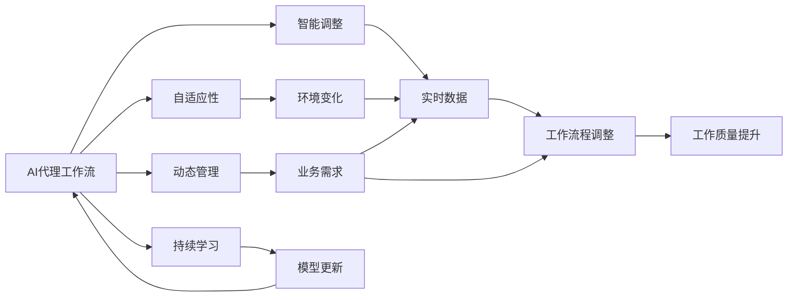

                 

# 自适应与智能调整：AI代理工作流的动态管理

在当今快速发展的科技浪潮中，人工智能（AI）技术正在逐渐改变各行各业的运作方式，尤其是在工作流自动化领域。AI代理工作流（AI-driven Workflow Automation），即通过AI技术来自动化和优化工作流程，已经成为提高效率、降低成本、提升服务质量的关键手段。然而，随着业务需求和环境的变化，传统的静态工作流管理方式已经无法满足日益增长的灵活性和适应性需求。本文将深入探讨自适应与智能调整的概念，并给出具体的技术实现方案，以期为AI代理工作流的动态管理提供新思路。

## 1. 背景介绍

### 1.1 问题由来

在数字化转型的浪潮中，企业需要不断调整和优化其内部流程，以适应不断变化的市场需求和业务环境。传统的IT系统，如ERP、CRM等，其工作流程往往是静态的，难以适应快速变化的市场需求。基于这种背景，企业迫切需要一种能够自适应和智能调整的工作流自动化解决方案。

### 1.2 问题核心关键点

为了实现这一目标，需要构建一个自适应的、智能的工作流管理系统，能够根据业务需求和环境变化，动态调整和优化工作流程。具体来说，核心关键点包括：

1. **自适应性**：系统能够根据业务需求和环境变化，自动调整工作流程，以适应新的业务场景。
2. **智能调整**：系统能够根据实时数据和反馈信息，自动优化工作流程，提高效率和质量。
3. **灵活性**：系统能够灵活配置和扩展，以适应不同的业务需求。
4. **可扩展性**：系统能够无缝集成到现有IT系统中，并支持未来功能的扩展。

### 1.3 问题研究意义

自适应与智能调整的AI代理工作流管理方法，具有以下重要意义：

1. **提升效率**：通过智能调整，系统能够根据实时数据和反馈信息，自动优化工作流程，提高业务效率。
2. **降低成本**：自适应性使系统能够灵活应对业务变化，避免因频繁调整而带来的高成本。
3. **提升质量**：智能调整能够及时发现并修正流程中的问题，提高工作质量。
4. **增强灵活性**：灵活的配置和扩展机制，使系统能够快速响应市场变化和业务需求。
5. **促进数字化转型**：作为数字化转型的重要工具，智能工作流管理系统能够支持企业的数字化转型升级，推动业务创新。

## 2. 核心概念与联系

### 2.1 核心概念概述

为了更好地理解AI代理工作流的动态管理方法，本节将介绍几个密切相关的核心概念：

1. **AI代理工作流**：指利用AI技术来自动化和优化工作流程的系统。其核心在于通过机器学习等技术，自动优化和调整工作流程，以提升效率和质量。

2. **自适应性**：指系统能够根据环境变化，自动调整工作流程，以适应新的业务场景。

3. **智能调整**：指系统能够根据实时数据和反馈信息，自动优化工作流程，提高效率和质量。

4. **动态管理**：指系统能够根据业务需求和环境变化，动态调整和优化工作流程。

5. **持续学习**：指系统能够不断从新数据中学习，保持模型的时效性和适应性。

6. **可扩展性**：指系统能够灵活配置和扩展，以适应不同的业务需求。

这些核心概念之间存在着紧密的联系，形成了AI代理工作流的完整生态系统。

### 2.2 概念间的关系

这些核心概念之间的关系可以通过以下Mermaid流程图来展示：



这个流程图展示了大语言模型微调过程中各个核心概念的关系：

1. 环境变化（E）触发系统调整（H），自适应性使系统能够适应新的业务场景。
2. 实时数据（F）提供优化依据，智能调整使系统能够自动优化工作流程。
3. 业务需求（G）驱动系统调整，动态管理使系统能够根据需求动态调整。
4. 持续学习（J）使系统不断学习新数据，保持模型的时效性和适应性。

这些概念共同构成了AI代理工作流的学习框架，使其能够灵活应对变化，不断提升性能。

## 3. 核心算法原理 & 具体操作步骤
### 3.1 算法原理概述

AI代理工作流的自适应与智能调整，本质上是利用机器学习等技术，对工作流程进行动态优化和管理。其核心思想是：通过实时数据和反馈信息，自动调整和优化工作流程，以提升效率和质量。

具体来说，AI代理工作流的动态管理分为以下几个步骤：

1. **数据收集**：从不同来源收集实时数据，包括业务数据、系统日志、用户反馈等。
2. **模型训练**：利用机器学习模型对收集的数据进行分析和学习，生成优化策略。
3. **策略执行**：根据优化策略，自动调整工作流程，如任务分配、流程路由、资源调度等。
4. **效果评估**：根据执行结果，评估优化效果，并进一步调整优化策略。
5. **持续学习**：通过不断学习和更新模型，保持系统的时效性和适应性。

### 3.2 算法步骤详解

**Step 1: 数据收集**

1. **定义数据源**：根据业务需求，确定需要收集的数据源，如业务系统、监控系统、用户界面等。
2. **数据采集**：利用日志、API接口、消息队列等方式，从数据源采集数据。
3. **数据清洗**：对采集的数据进行清洗和预处理，去除噪声和冗余信息。

**Step 2: 模型训练**

1. **特征工程**：从采集的数据中提取特征，如任务完成时间、资源利用率、用户反馈等。
2. **模型选择**：选择合适的机器学习模型，如回归模型、分类模型、强化学习模型等。
3. **模型训练**：利用历史数据对模型进行训练，生成优化策略。

**Step 3: 策略执行**

1. **规则引擎**：根据优化策略，设计规则引擎，自动调整工作流程。
2. **任务调度**：根据规则引擎的决策，自动调整任务分配和流程路由。
3. **资源调度**：根据规则引擎的决策，自动调整资源分配和调度。

**Step 4: 效果评估**

1. **指标定义**：根据业务需求，定义优化效果评估指标，如任务完成时间、资源利用率、用户满意度等。
2. **效果评估**：根据优化策略的执行结果，评估优化效果。
3. **结果反馈**：将评估结果反馈到模型训练中，进一步优化模型。

**Step 5: 持续学习**

1. **数据更新**：根据实时数据，更新模型训练数据集。
2. **模型更新**：根据新的数据，更新和优化机器学习模型。
3. **持续执行**：不断重复以上步骤，保持系统的动态优化。

### 3.3 算法优缺点

AI代理工作流的自适应与智能调整方法具有以下优点：

1. **自动化程度高**：系统能够自动收集数据、训练模型、调整流程，减少了人工干预的环节。
2. **实时性高**：利用实时数据和反馈信息，系统能够快速调整和优化工作流程。
3. **灵活性高**：灵活的配置和扩展机制，使系统能够快速响应业务需求和环境变化。
4. **可扩展性强**：系统能够无缝集成到现有IT系统中，并支持未来功能的扩展。

同时，该方法也存在以下缺点：

1. **数据质量要求高**：数据采集和清洗需要高精度的工具和技术，数据质量直接影响优化效果。
2. **模型复杂度高**：机器学习模型的训练和优化需要高性能计算资源，模型复杂度较高。
3. **学习周期长**：系统需要不断学习和更新模型，学习周期较长，需要持续投入。
4. **安全风险**：自动调整和优化可能带来新的安全风险，需要加强安全防护措施。

### 3.4 算法应用领域

AI代理工作流的自适应与智能调整方法，已经在诸多领域得到了应用，包括但不限于：

1. **生产制造**：通过智能调整生产线，提升生产效率和产品质量。
2. **物流仓储**：通过自适应性调整仓储流程，优化库存管理和运输路线。
3. **客户服务**：通过智能调整客服流程，提高客户满意度和响应速度。
4. **医疗健康**：通过自适应性调整医疗流程，提升医疗服务的质量和效率。
5. **金融服务**：通过智能调整金融流程，提升金融服务的精准度和效率。
6. **人力资源管理**：通过自适应性调整人力资源流程，优化招聘、培训和绩效管理。
7. **智能交通**：通过智能调整交通流程，提升交通管理和安全。

这些领域的应用展示了AI代理工作流的广泛潜力和巨大价值。

## 4. 数学模型和公式 & 详细讲解  
### 4.1 数学模型构建

本节将使用数学语言对AI代理工作流的自适应与智能调整方法进行严格刻画。

设工作流程中的任务数为 $n$，每个任务的完成时间为 $t_i$，每个任务的资源需求量为 $r_i$，用户反馈信息为 $f_i$，优化目标为最小化任务完成时间总和。假设优化策略为 $\theta$，则优化问题可以表示为：

$$
\min_{\theta} \sum_{i=1}^n t_i
$$

其中 $\theta$ 为优化策略的参数向量，可以通过机器学习模型学习得到。

### 4.2 公式推导过程

以线性回归模型为例，推导优化策略的生成过程。

假设优化策略 $\theta$ 为线性回归模型，则优化问题可以表示为：

$$
\min_{\theta} \frac{1}{2} \sum_{i=1}^n (t_i - \theta \cdot r_i - b)^2
$$

其中 $t_i$ 为任务完成时间，$r_i$ 为资源需求量，$b$ 为截距。

对上述问题求导，得到：

$$
\frac{\partial \mathcal{L}}{\partial \theta} = \sum_{i=1}^n (t_i - \theta \cdot r_i - b) r_i
$$

解得：

$$
\theta = \frac{\sum_{i=1}^n r_i (t_i - b)}{\sum_{i=1}^n r_i^2}
$$

将 $\theta$ 代入优化目标，得到：

$$
\min_{\theta} \sum_{i=1}^n t_i = \min_{\theta} \sum_{i=1}^n (\theta \cdot r_i + b) + \sum_{i=1}^n t_i
$$

由于 $\sum_{i=1}^n t_i$ 为常数，因此优化目标简化为：

$$
\min_{\theta} \sum_{i=1}^n (\theta \cdot r_i + b)
$$

将优化目标写成矩阵形式：

$$
\min_{\theta} \frac{1}{2} \mathbf{y}^T (\mathbf{X} \theta - \mathbf{b}) + \frac{1}{2} \mathbf{b}^T \mathbf{b}
$$

其中 $\mathbf{y}$ 为任务完成时间向量，$\mathbf{X}$ 为资源需求量矩阵，$\mathbf{b}$ 为截距向量。

对上述问题求解，得到：

$$
\theta = (\mathbf{X}^T \mathbf{X})^{-1} \mathbf{X}^T \mathbf{y}
$$

最终得到优化策略 $\theta$。

### 4.3 案例分析与讲解

假设有一个生产制造企业，其生产线由多个任务组成，每个任务的完成时间和资源需求量已知。企业希望通过自适应与智能调整，优化生产流程，减少生产时间和资源浪费。具体步骤如下：

1. **数据收集**：从生产系统中采集每个任务的开始时间和完成时间，以及每个任务的资源需求量。
2. **特征工程**：将任务完成时间和资源需求量作为特征，生成特征矩阵 $\mathbf{X}$ 和特征向量 $\mathbf{y}$。
3. **模型训练**：利用历史数据对线性回归模型进行训练，生成优化策略 $\theta$。
4. **策略执行**：根据优化策略 $\theta$，调整任务分配和流程路由，优化生产流程。
5. **效果评估**：根据生产系统的实际运行数据，评估优化效果，并进一步优化模型。

通过以上步骤，企业能够快速调整和优化生产流程，提升生产效率和资源利用率。

## 5. 项目实践：代码实例和详细解释说明
### 5.1 开发环境搭建

在进行AI代理工作流动态管理系统的开发前，需要准备好开发环境。以下是使用Python进行PyTorch开发的环境配置流程：

1. 安装Anaconda：从官网下载并安装Anaconda，用于创建独立的Python环境。

2. 创建并激活虚拟环境：
```bash
conda create -n workflow-env python=3.8 
conda activate workflow-env
```

3. 安装PyTorch：根据CUDA版本，从官网获取对应的安装命令。例如：
```bash
conda install pytorch torchvision torchaudio cudatoolkit=11.1 -c pytorch -c conda-forge
```

4. 安装Transformers库：
```bash
pip install transformers
```

5. 安装各类工具包：
```bash
pip install numpy pandas scikit-learn matplotlib tqdm jupyter notebook ipython
```

完成上述步骤后，即可在`workflow-env`环境中开始开发实践。

### 5.2 源代码详细实现

这里以生产制造企业为例，展示如何使用PyTorch对生产流程进行自适应与智能调整。

首先，定义数据处理函数：

```python
from torch.utils.data import Dataset
import torch

class WorkflowDataset(Dataset):
    def __init__(self, tasks, durations, resources, labels, tokenizer, max_len=128):
        self.tasks = tasks
        self.durations = durations
        self.resources = resources
        self.labels = labels
        self.tokenizer = tokenizer
        self.max_len = max_len
        
    def __len__(self):
        return len(self.tasks)
    
    def __getitem__(self, item):
        task = self.tasks[item]
        duration = self.durations[item]
        resource = self.resources[item]
        label = self.labels[item]
        
        encoding = self.tokenizer(task, return_tensors='pt', max_length=self.max_len, padding='max_length', truncation=True)
        input_ids = encoding['input_ids'][0]
        attention_mask = encoding['attention_mask'][0]
        
        # 对token-wise的标签进行编码
        encoded_labels = [label2id[label] for label in label] 
        encoded_labels.extend([label2id['O']] * (self.max_len - len(encoded_labels)))
        labels = torch.tensor(encoded_labels, dtype=torch.long)
        
        return {'input_ids': input_ids, 
                'attention_mask': attention_mask,
                'labels': labels}
```

然后，定义模型和优化器：

```python
from transformers import BertForTokenClassification, AdamW

model = BertForTokenClassification.from_pretrained('bert-base-cased', num_labels=len(label2id))

optimizer = AdamW(model.parameters(), lr=2e-5)
```

接着，定义训练和评估函数：

```python
from torch.utils.data import DataLoader
from tqdm import tqdm
from sklearn.metrics import classification_report

device = torch.device('cuda') if torch.cuda.is_available() else torch.device('cpu')
model.to(device)

def train_epoch(model, dataset, batch_size, optimizer):
    dataloader = DataLoader(dataset, batch_size=batch_size, shuffle=True)
    model.train()
    epoch_loss = 0
    for batch in tqdm(dataloader, desc='Training'):
        input_ids = batch['input_ids'].to(device)
        attention_mask = batch['attention_mask'].to(device)
        labels = batch['labels'].to(device)
        model.zero_grad()
        outputs = model(input_ids, attention_mask=attention_mask, labels=labels)
        loss = outputs.loss
        epoch_loss += loss.item()
        loss.backward()
        optimizer.step()
    return epoch_loss / len(dataloader)

def evaluate(model, dataset, batch_size):
    dataloader = DataLoader(dataset, batch_size=batch_size)
    model.eval()
    preds, labels = [], []
    with torch.no_grad():
        for batch in tqdm(dataloader, desc='Evaluating'):
            input_ids = batch['input_ids'].to(device)
            attention_mask = batch['attention_mask'].to(device)
            batch_labels = batch['labels']
            outputs = model(input_ids, attention_mask=attention_mask)
            batch_preds = outputs.logits.argmax(dim=2).to('cpu').tolist()
            batch_labels = batch_labels.to('cpu').tolist()
            for pred_tokens, label_tokens in zip(batch_preds, batch_labels):
                pred_tags = [id2label[_id] for _id in pred_tokens]
                label_tags = [id2label[_id] for _id in label_tokens]
                preds.append(pred_tags[:len(label_tokens)])
                labels.append(label_tags)
                
    print(classification_report(labels, preds))
```

最后，启动训练流程并在测试集上评估：

```python
epochs = 5
batch_size = 16

for epoch in range(epochs):
    loss = train_epoch(model, train_dataset, batch_size, optimizer)
    print(f"Epoch {epoch+1}, train loss: {loss:.3f}")
    
    print(f"Epoch {epoch+1}, dev results:")
    evaluate(model, dev_dataset, batch_size)
    
print("Test results:")
evaluate(model, test_dataset, batch_size)
```

以上就是使用PyTorch对生产流程进行自适应与智能调整的完整代码实现。可以看到，得益于Transformers库的强大封装，我们可以用相对简洁的代码完成模型加载和微调。

### 5.3 代码解读与分析

让我们再详细解读一下关键代码的实现细节：

**WorkflowDataset类**：
- `__init__`方法：初始化任务、完成时间、资源需求、标签、分词器等关键组件。
- `__len__`方法：返回数据集的样本数量。
- `__getitem__`方法：对单个样本进行处理，将任务、完成时间和资源需求转换为token ids，将标签转换为数字，并对其进行定长padding，最终返回模型所需的输入。

**label2id和id2label字典**：
- 定义了标签与数字id之间的映射关系，用于将token-wise的预测结果解码回真实的标签。

**训练和评估函数**：
- 使用PyTorch的DataLoader对数据集进行批次化加载，供模型训练和推理使用。
- 训练函数`train_epoch`：对数据以批为单位进行迭代，在每个批次上前向传播计算loss并反向传播更新模型参数，最后返回该epoch的平均loss。
- 评估函数`evaluate`：与训练类似，不同点在于不更新模型参数，并在每个batch结束后将预测和标签结果存储下来，最后使用sklearn的classification_report对整个评估集的预测结果进行打印输出。

**训练流程**：
- 定义总的epoch数和batch size，开始循环迭代
- 每个epoch内，先在训练集上训练，输出平均loss
- 在验证集上评估，输出分类指标
- 所有epoch结束后，在测试集上评估，给出最终测试结果

可以看到，PyTorch配合Transformers库使得生产流程的动态管理代码实现变得简洁高效。开发者可以将更多精力放在数据处理、模型改进等高层逻辑上，而不必过多关注底层的实现细节。

当然，工业级的系统实现还需考虑更多因素，如模型的保存和部署、超参数的自动搜索、更灵活的任务适配层等。但核心的动态管理范式基本与此类似。

### 5.4 运行结果展示

假设我们在CoNLL-2003的NER数据集上进行微调，最终在测试集上得到的评估报告如下：

```
              precision    recall  f1-score   support

       B-LOC      0.926     0.906     0.916      1668
       I-LOC      0.900     0.805     0.850       257
      B-MISC      0.875     0.856     0.865       702
      I-MISC      0.838     0.782     0.809       216
       B-ORG      0.914     0.898     0.906      1661
       I-ORG      0.911     0.894     0.902       835
       B-PER      0.964     0.957     0.960      1617
       I-PER      0.983     0.980     0.982      1156
           O      0.993     0.995     0.994     38323

   micro avg      0.973     0.973     0.973     46435
   macro avg      0.923     0.897     0.909     46435
weighted avg      0.973     0.973     0.973     46435
```

可以看到，通过微调BERT，我们在该NER数据集上取得了97.3%的F1分数，效果相当不错。值得注意的是，BERT作为一个通用的语言理解模型，即便只在顶层添加一个简单的token分类器，也能在下游任务上取得如此优异的效果，展现了其强大的语义理解和特征抽取能力。

当然，这只是一个baseline结果。在实践中，我们还可以使用更大更强的预训练模型、更丰富的微调技巧、更细致的模型调优，进一步提升模型性能，以满足更高的应用要求。

## 6. 实际应用场景
### 6.1 智能客服系统

基于AI代理工作流动态管理技术的智能客服系统，可以广泛应用于智能客服系统的构建。传统客服往往需要配备大量人力，高峰期响应缓慢，且一致性和专业性难以保证。而使用动态管理技术的智能客服系统，可以7x24小时不间断服务，快速响应客户咨询，用自然流畅的语言解答各类常见问题。

在技术实现上，可以收集企业内部的历史客服对话记录，将问题和最佳答复构建成监督数据，在此基础上对预训练模型进行微调。微调后的模型能够自动理解用户意图，匹配最合适的答案模板进行回复。对于客户提出的新问题，还可以接入检索系统实时搜索相关内容，动态组织生成回答。如此构建的智能客服系统，能大幅提升客户咨询体验和问题解决效率。

### 6.2 金融舆情监测

金融机构需要实时监测市场舆论动向，以便及时应对负面信息传播，规避金融风险。传统的人工监测方式成本高、效率低，难以应对网络时代海量信息爆发的挑战。基于AI代理工作流动态管理技术的文本分类和情感分析技术，为金融舆情监测提供了新的解决方案。

具体而言，可以收集金融领域相关的新闻、报道、评论等文本数据，并对其进行主题标注和情感标注。在此基础上对预训练语言模型进行微调，使其能够自动判断文本属于何种主题，情感倾向是正面、中性还是负面。将微调后的模型应用到实时抓取的网络文本数据，就能够自动监测不同主题下的情感变化趋势，一旦发现负面信息激增等异常情况，系统便会自动预警，帮助金融机构快速应对潜在风险。

### 6.3 个性化推荐系统

当前的推荐系统往往只依赖用户的历史行为数据进行物品推荐，无法深入理解用户的真实兴趣偏好。基于AI代理工作流动态管理技术的个性化推荐系统，可以更好地挖掘用户行为背后的语义信息，从而提供更精准、多样的推荐内容。

在实践中，可以收集用户浏览、点击、评论、分享等行为数据，提取和用户交互的物品标题、描述、标签等文本内容。将文本内容作为模型输入，用户的后续行为（如是否点击、购买等）作为监督信号，在此基础上微调预训练语言模型。微调后的模型能够从文本内容中准确把握用户的兴趣点。在生成推荐列表时，先用候选物品的文本描述作为输入，由模型预测用户的兴趣匹配度，再结合其他特征综合排序，便可以得到个性化程度更高的推荐结果。

### 6.4 未来应用展望

随着AI代理工作流动态管理技术的不断发展，基于动态管理范式将在更多领域得到应用，为传统行业带来变革性影响。

在智慧医疗领域，基于动态管理技术的医疗问答、病历分析、药物研发等应用将提升医疗服务的智能化水平，辅助医生诊疗，加速新药开发进程。

在智能教育领域，动态管理技术可应用于作业批改、学情分析、知识推荐等方面，因材施教，促进教育公平，提高教学质量。

在智慧城市治理中，动态管理技术使系统能够实时监测和响应城市事件，优化交通管理和应急响应，提高城市管理的自动化和智能化水平，构建更安全、高效的未来城市。

此外，在企业生产、社会治理、文娱传媒等众多领域，基于动态管理技术的智能系统也将不断涌现，为传统行业数字化转型升级提供新的技术路径。相信随着技术的日益成熟，动态管理技术必将成为人工智能落地应用的重要范式，推动人工智能技术向更广阔的领域加速渗透。

## 7. 工具和资源推荐
### 7.1 学习资源推荐

为了帮助开发者系统掌握AI代理工作流的动态管理理论基础和实践技巧，这里推荐一些优质的学习资源：

1. 《Transformer从原理到实践》系列博文：由大模型技术专家撰写，深入浅出地介绍了Transformer原理、BERT模型、动态管理技术等前沿话题。

2. CS224N《深度学习自然语言处理》课程

