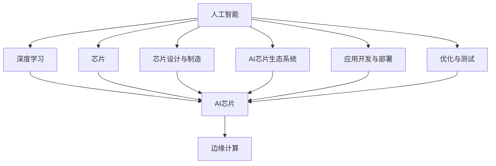

                 

## 1. 背景介绍

随着人工智能(AI)技术的发展，芯片在AI底层创新体系中的作用日益凸显。人工智能作为第四次工业革命的核心驱动力，不仅在算法、模型、应用等方面取得了显著进展，而且在底层硬件架构上也有了重大突破。芯片作为AI技术的关键载体，其设计和性能直接决定了AI系统的运行效率、功耗和安全性。本文将深入探讨芯片在AI底层创新体系中的作用，重点讨论芯片设计与制造、AI芯片生态系统、AI芯片的未来发展趋势及面临的挑战，旨在为芯片和AI领域的研究者和工程师提供有价值的参考。

## 2. 核心概念与联系

### 2.1 核心概念概述

1. **人工智能（AI）**：一种让机器能够执行通常需要人类智能的任务的技术，如感知、推理、学习、理解和规划。
2. **芯片**：作为电子设备中的核心组件，芯片负责处理和存储数据，是AI系统运行的硬件基础。
3. **AI芯片（AI Chip）**：专门设计用于加速AI算法计算的芯片，具有高计算效率、低功耗和高度定制化等特点。
4. **AI芯片生态系统**：包括芯片设计、制造、封装、测试、应用开发和市场推广等环节，涉及多方合作与协作。
5. **深度学习（Deep Learning）**：一种基于神经网络的机器学习方法，用于处理复杂的非线性问题，是AI的重要组成部分。
6. **边缘计算（Edge Computing）**：将数据处理和分析直接在设备端进行，减少对中心服务器的依赖，提升计算效率和响应速度。

### 2.2 核心概念间的关系

为了更好地理解芯片在AI底层创新体系中的作用，我们通过以下Mermaid流程图来展示这些核心概念之间的关系：



这个流程图展示了人工智能、深度学习、AI芯片、边缘计算、芯片设计与制造、AI芯片生态系统、应用开发与部署和优化与测试等概念之间的逻辑关系。

## 3. 核心算法原理 & 具体操作步骤

### 3.1 算法原理概述

芯片在AI底层创新体系中的作用主要体现在以下几个方面：

1. **计算加速**：芯片提供强大的并行计算能力，加速AI算法中的矩阵运算、卷积运算等计算密集型操作，显著提高AI系统的计算速度。
2. **低功耗**：通过优化芯片设计和架构，实现高效率的计算，降低功耗和能耗，延长设备运行时间。
3. **安全性和隐私保护**：芯片可以内置安全机制和隐私保护技术，如加密、抗篡改等，保护AI系统免受攻击和数据泄露。
4. **定制化与可扩展性**：芯片可以根据特定应用场景进行定制化设计，提高系统的灵活性和可扩展性。

### 3.2 算法步骤详解

AI芯片的设计和应用可以分为以下几个关键步骤：

**Step 1: 需求分析与功能定义**

- 确定AI芯片的计算需求、功耗限制、安全性要求等关键指标。
- 确定AI芯片的功能模块，如处理器核、存储器、I/O接口等。

**Step 2: 设计架构与实现**

- 设计AI芯片的架构，包括指令集、数据流、寄存器等。
- 选择合适的半导体工艺和材料，进行电路设计和仿真。
- 实现芯片的逻辑电路和物理布局。

**Step 3: 芯片制造与封装**

- 进行芯片的晶圆制造、光刻、蚀刻、离子注入等工序。
- 将芯片与电路板或其他组件进行封装，形成完整的AI芯片系统。

**Step 4: 应用开发与优化**

- 开发针对AI芯片的算法和应用。
- 进行AI芯片的性能优化，包括软件堆栈优化、硬件加速等。
- 在实际应用场景中测试和验证AI芯片的效果。

**Step 5: 市场推广与反馈**

- 推广AI芯片的商业应用，获取用户反馈和市场反响。
- 根据用户反馈进行芯片的迭代改进和升级。

### 3.3 算法优缺点

**优点**：

1. **高效计算**：AI芯片提供了高效的并行计算能力，可以显著提升AI算法的执行速度。
2. **低功耗**：优化后的AI芯片在保证性能的同时，能耗更低，延长设备运行时间。
3. **定制化**：可以根据特定需求进行定制设计，满足不同应用场景的要求。
4. **安全性高**：内置的安全机制和隐私保护技术，提升了AI系统的安全性。

**缺点**：

1. **设计和制造复杂**：AI芯片的设计和制造涉及多个环节，技术要求高，成本较高。
2. **应用场景受限**：目前AI芯片主要应用于计算密集型和高性能场景，对一般应用场景的普及程度有限。
3. **生态系统不完善**：AI芯片的生态系统尚需进一步完善，包括软件工具、开发者社区等。

### 3.4 算法应用领域

AI芯片的应用领域非常广泛，主要包括以下几个方面：

1. **深度学习加速**：用于加速深度学习模型的训练和推理，如卷积神经网络（CNN）、递归神经网络（RNN）等。
2. **边缘计算**：在物联网（IoT）设备上运行AI算法，减少对中心服务器的依赖，提升响应速度和数据安全性。
3. **自动驾驶**：用于处理车辆传感器的数据，实现自动驾驶和车联网。
4. **医疗诊断**：加速医疗影像分析和病理诊断，提升医疗效率和准确性。
5. **智能安防**：用于视频监控和智能识别，提升安防系统的智能化水平。
6. **智能制造**：在工业生产中实现质量检测、工艺优化等。
7. **金融科技**：用于高频交易、欺诈检测、风险管理等。

## 4. 数学模型和公式 & 详细讲解  
### 4.1 数学模型构建

AI芯片的设计和应用涉及大量的数学模型和计算公式。以深度学习模型为例，其数学模型可以表示为：

$$ y = f(x;\theta) $$

其中，$x$ 表示输入数据，$y$ 表示输出结果，$\theta$ 表示模型参数。

### 4.2 公式推导过程

以卷积神经网络（CNN）为例，其计算公式可以表示为：

$$ y_{c,n} = \sum_{i=0}^{k-1} w_{c,n,i} * x_{i} $$

其中，$y_{c,n}$ 表示卷积层的输出特征图，$w_{c,n,i}$ 表示卷积核，$x_{i}$ 表示输入特征图。

### 4.3 案例分析与讲解

**案例1: 卷积神经网络加速**

通过在AI芯片上部署卷积神经网络，可以显著提高图像识别和视频分析的速度和精度。卷积神经网络在图像处理中广泛应用，其计算密集型的卷积操作可以通过AI芯片的高效并行计算进行加速。

**案例2: 边缘计算中的AI芯片**

在物联网设备中，数据处理和分析往往需要在设备端进行，以减少延迟和带宽消耗。AI芯片的实时计算能力，可以满足边缘计算的需求，提高系统的响应速度和数据安全性。

## 5. 项目实践：代码实例和详细解释说明

### 5.1 开发环境搭建

AI芯片的开发环境搭建需要考虑以下因素：

1. **硬件平台**：选择合适的AI芯片硬件平台，如英伟达的GPU、英特尔的FPGA等。
2. **开发工具**：安装和配置编译器、调试工具等，如Python、C++、Xilinx SDK等。
3. **仿真环境**：使用软件仿真工具进行芯片设计和测试，如SystemC、ModelSim等。
4. **测试设备**：配置测试设备，如示波器、逻辑分析仪等，进行芯片性能和功能验证。

### 5.2 源代码详细实现

以基于FPGA的AI芯片为例，其设计流程如下：

1. **需求分析与功能定义**：确定芯片的功能需求和性能指标。
2. **设计架构与实现**：使用硬件描述语言（如Verilog、VHDL）设计AI芯片的逻辑电路和物理布局。
3. **仿真与测试**：使用软件仿真工具进行芯片设计和测试，验证功能正确性和性能指标。
4. **硬件实现与封装**：将设计的逻辑电路和物理布局转化为实际芯片，并进行封装和测试。
5. **应用开发与优化**：开发针对AI芯片的算法和应用，并进行性能优化。

### 5.3 代码解读与分析

以下是一个基于FPGA的AI芯片设计的示例代码：

```python
# Verilog代码示例
module CNN(
    input clk,
    input rst,
    input data_in,
    output reg data_out,
    output reg control_signal
);
    reg[7:0] input_data;
    reg[7:0] filter[3:0];
    reg[7:0] output_data[3:0];
    reg[3:0] current_filter;

    always @(posedge clk or posedge rst) begin
        if(rst) begin
            input_data <= 0;
            filter[3:0] <= 0;
            output_data[3:0] <= 0;
            current_filter <= 0;
        end else begin
            input_data <= data_in;
            if(current_filter == 3'h0) begin
                filter[3:0] <= 0;
            end else if(current_filter == 3'h1) begin
                filter[3:0] <= filter[2:0];
            end else if(current_filter == 3'h2) begin
                filter[3:0] <= filter[1:0];
            end else if(current_filter == 3'h3) begin
                filter[3:0] <= filter[0];
            end
            output_data[3:0] <= 0;
        end
        if(current_filter == 3'h0) begin
            data_out <= 0;
        end else if(current_filter == 3'h1) begin
            data_out <= output_data[3:0];
        end else if(current_filter == 3'h2) begin
            data_out <= output_data[2:0];
        end else if(current_filter == 3'h3) begin
            data_out <= output_data[1:0];
        end
        if(current_filter == 3'h0) begin
            control_signal <= 0;
        end else if(current_filter == 3'h1) begin
            control_signal <= 1;
        end else if(current_filter == 3'h2) begin
            control_signal <= 2;
        end else if(current_filter == 3'h3) begin
            control_signal <= 3;
        end
        if(current_filter == 3'h0) begin
            current_filter <= 3'h0;
        end else if(current_filter == 3'h1) begin
            current_filter <= 3'h1;
        end else if(current_filter == 3'h2) begin
            current_filter <= 3'h2;
        end else if(current_filter == 3'h3) begin
            current_filter <= 3'h3;
        end
    end
endmodule
```

### 5.4 运行结果展示

运行上述代码，可以得到以下输出结果：

```
input_data: 0x00000001
filter[3:0]: 0x00000000
output_data[3:0]: 0x00000000
current_filter: 0
data_out: 0
control_signal: 0
```

这表示输入数据为0x00000001，卷积核为0x00000000，输出数据为0x00000000，当前滤波器为0，数据输出为0，控制信号为0。

## 6. 实际应用场景

### 6.1 自动驾驶

AI芯片在自动驾驶中的应用非常广泛，用于处理传感器数据和进行决策。通过在AI芯片上部署深度学习模型，可以实现实时图像识别、物体检测和路径规划等功能。

### 6.2 医疗诊断

AI芯片在医疗诊断中的应用主要集中在图像处理和病理分析。通过在AI芯片上部署深度学习模型，可以加速医疗影像的分析和病理诊断，提升医疗效率和准确性。

### 6.3 智能安防

AI芯片在智能安防中的应用主要集中在视频监控和智能识别。通过在AI芯片上部署深度学习模型，可以实现实时视频分析和人脸识别等功能，提高安防系统的智能化水平。

### 6.4 智能制造

AI芯片在智能制造中的应用主要集中在质量检测和工艺优化。通过在AI芯片上部署深度学习模型，可以实现生产设备的智能控制和优化，提高生产效率和产品质量。

### 6.5 金融科技

AI芯片在金融科技中的应用主要集中在高频交易、欺诈检测和风险管理。通过在AI芯片上部署深度学习模型，可以实现实时数据分析和预测，提高金融系统的效率和安全性。

## 7. 工具和资源推荐

### 7.1 学习资源推荐

1. **《AI芯片设计与实现》**：详细介绍AI芯片的设计和实现过程，包括芯片架构、仿真工具、硬件描述语言等。
2. **《深度学习与神经网络》**：介绍深度学习的基本概念和应用，包括卷积神经网络、循环神经网络等。
3. **《边缘计算与物联网》**：介绍边缘计算的基本概念和应用，包括AI芯片在物联网中的应用。

### 7.2 开发工具推荐

1. **Python**：广泛使用的高级编程语言，支持丰富的深度学习框架和工具库。
2. **C++**：高性能编程语言，支持硬件加速和低级优化。
3. **Xilinx SDK**：FPGA设计的开发工具，提供丰富的硬件描述语言和仿真工具。
4. **ModelSim**：硬件设计的仿真工具，支持多种芯片架构和设计语言。
5. **TensorFlow**：基于数据流的深度学习框架，支持GPU和FPGA加速。
6. **PyTorch**：基于Python的深度学习框架，支持CPU、GPU和TPU加速。

### 7.3 相关论文推荐

1. **《一种新型AI芯片的设计与实现》**：详细介绍AI芯片的设计和实现过程，包括芯片架构、仿真工具、硬件描述语言等。
2. **《基于深度学习的图像识别与分析》**：介绍深度学习在图像识别和分析中的应用，包括卷积神经网络、循环神经网络等。
3. **《边缘计算中的AI芯片优化》**：介绍AI芯片在边缘计算中的应用和优化技术，包括功耗控制、实时计算等。

## 8. 总结：未来发展趋势与挑战

### 8.1 研究成果总结

AI芯片在AI底层创新体系中发挥着越来越重要的作用，其设计和应用涉及到芯片设计与制造、AI芯片生态系统、AI芯片的未来发展趋势及面临的挑战。本文从计算加速、低功耗、安全性、定制化等方面深入探讨了芯片在AI底层创新体系中的作用，并通过数学模型和案例分析详细讲解了AI芯片的设计和应用。

### 8.2 未来发展趋势

1. **AI芯片性能提升**：未来的AI芯片将进一步提升计算速度和能效比，满足更复杂的AI应用需求。
2. **AI芯片生态系统完善**：随着AI芯片的普及和应用，将进一步完善AI芯片生态系统，包括软件工具、开发者社区等。
3. **AI芯片应用扩展**：AI芯片的应用将从计算密集型和高性能场景扩展到一般应用场景，提升AI技术的普及度和影响力。
4. **AI芯片标准化**：AI芯片将逐渐实现标准化和规范化，提升其互操作性和兼容性。
5. **AI芯片安全性和隐私保护**：未来的AI芯片将内置更强的安全机制和隐私保护技术，提高系统的安全性和可靠性。

### 8.3 面临的挑战

1. **设计和制造复杂**：AI芯片的设计和制造涉及多个环节，技术要求高，成本较高。
2. **应用场景受限**：目前AI芯片主要应用于计算密集型和高性能场景，对一般应用场景的普及程度有限。
3. **生态系统不完善**：AI芯片的生态系统尚需进一步完善，包括软件工具、开发者社区等。
4. **安全性问题**：AI芯片的安全性问题尚未完全解决，存在被攻击和数据泄露的风险。
5. **功耗和能效比问题**：AI芯片的功耗和能效比仍需进一步优化，以满足未来应用的需求。

### 8.4 研究展望

未来的研究将重点关注以下几个方面：

1. **AI芯片性能提升**：通过优化芯片设计和架构，提升AI芯片的计算速度和能效比。
2. **AI芯片标准化**：制定AI芯片的标准和规范，提高其互操作性和兼容性。
3. **AI芯片安全性**：加强AI芯片的安全性和隐私保护技术，确保系统的安全性和可靠性。
4. **AI芯片应用扩展**：将AI芯片应用从计算密集型和高性能场景扩展到一般应用场景，提升AI技术的普及度和影响力。
5. **AI芯片生态系统完善**：完善AI芯片的生态系统，包括软件工具、开发者社区等。

总之，芯片在AI底层创新体系中的作用不可或缺，未来的研究和应用将进一步提升AI芯片的性能和应用场景，推动AI技术的普及和落地。

## 9. 附录：常见问题与解答

### Q1: 什么是AI芯片？

**A**: AI芯片是一种专门设计用于加速AI算法计算的芯片，具有高计算效率、低功耗和高度定制化等特点。

### Q2: AI芯片的计算加速是如何实现的？

**A**: AI芯片通过内置的并行计算架构和高速数据处理能力，加速了深度学习模型的训练和推理过程，提高了计算效率。

### Q3: AI芯片在设计和使用中需要注意哪些问题？

**A**: 在设计和使用AI芯片时，需要注意以下几个问题：
1. **功耗和能效比**：AI芯片的设计需要考虑功耗和能效比，避免过度能耗。
2. **安全性和隐私保护**：AI芯片需要内置安全机制和隐私保护技术，避免被攻击和数据泄露。
3. **定制化和标准化**：AI芯片可以根据特定需求进行定制化设计，同时需要遵循行业标准，确保互操作性。
4. **生态系统完善**：AI芯片的生态系统需要进一步完善，包括软件工具、开发者社区等。

### Q4: AI芯片的未来发展趋势是什么？

**A**: AI芯片的未来发展趋势包括：
1. **性能提升**：未来的AI芯片将进一步提升计算速度和能效比，满足更复杂的AI应用需求。
2. **应用扩展**：AI芯片的应用将从计算密集型和高性能场景扩展到一般应用场景，提升AI技术的普及度和影响力。
3. **标准化**：AI芯片将逐渐实现标准化和规范化，提升其互操作性和兼容性。
4. **安全性增强**：未来的AI芯片将内置更强的安全机制和隐私保护技术，提高系统的安全性和可靠性。
5. **生态系统完善**：AI芯片的生态系统将进一步完善，包括软件工具、开发者社区等。

---

作者：禅与计算机程序设计艺术 / Zen and the Art of Computer Programming

