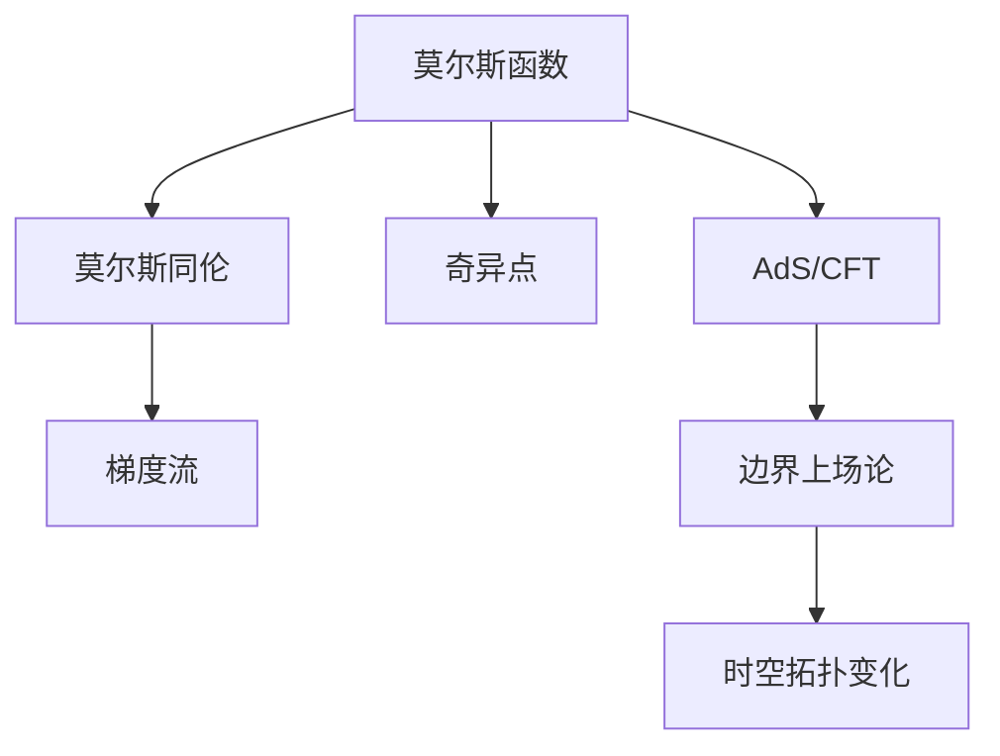
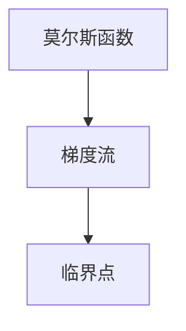
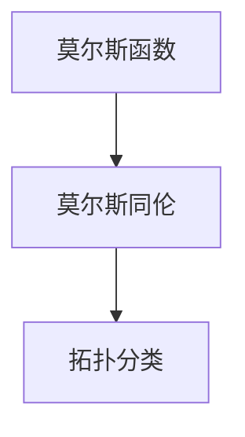
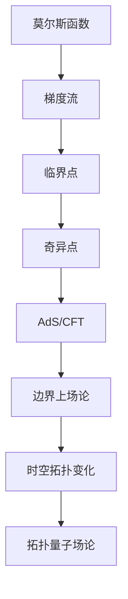

                 

# 莫尔斯理论与AdS/CFT

## 1. 背景介绍

### 1.1 问题由来
自阿德里安·勒罗伊·莫尔斯(Adrian Loewy Morse)提出莫尔斯理论以来，它已经成为一个强大的数学工具，被广泛应用在拓扑学、代数几何、微分几何等领域。然而，莫尔斯理论在物理学和量子场论中的应用却相对较少。近年来，随着AdS/CFT的提出和发展，莫尔斯理论开始在物理学领域得到了新的关注，并在量子场论、凝聚态物理等领域得到了广泛的应用。

AdS/CFT是弦理论和量子场论领域的一个重要进展，它指出在反德西特空间(AdS)中存在着一个相应的边界上场论(CFT)，两者之间存在着深刻的联系。AdS/CFT的提出不仅为研究量子场论提供了一个新的工具，还为研究弦理论提供了一个新的视角。莫尔斯理论作为AdS/CFT的重要组成部分，它在量子场论和凝聚态物理中的应用前景广阔，值得深入探讨。

### 1.2 问题核心关键点
莫尔斯理论的核心在于对流形上的莫尔斯函数和它的临界点进行研究。莫尔斯函数的临界点是流形上的局部极值点，分为极大点和极小点。在AdS/CFT中，莫尔斯理论主要用于研究边界上场论的对称性和结构，以及在时空拓扑变化下的行为。

AdS/CFT中，莫尔斯理论的应用包括但不限于：

- 边界上场论的对称性：莫尔斯理论揭示了边界上场论的对称性结构，为研究其动力学行为提供了新的视角。
- 时空拓扑变化：莫尔斯理论可以用来研究时空拓扑变化下边界上场论的行为，如黑洞熵计算、拓扑量子场论等。
- 凝聚态物理：莫尔斯理论被用来研究拓扑绝缘体、量子霍尔效应等凝聚态物理问题。

这些关键点共同构成了莫尔斯理论在AdS/CFT中的应用框架，为进一步研究和应用提供了方向和基础。

### 1.3 问题研究意义
研究莫尔斯理论在AdS/CFT中的应用，对于深化理解量子场论和凝聚态物理，提升计算效率，推动新技术的发展具有重要意义。

1. 深入理解量子场论：莫尔斯理论在AdS/CFT中的应用，可以提供新的视角和方法，帮助深入理解量子场论的基本结构，提升对其动力学行为的预测能力。
2. 提升计算效率：莫尔斯理论中的某些算法和技术可以在AdS/CFT的计算中发挥重要作用，提升计算效率，缩短计算时间。
3. 推动新技术发展：莫尔斯理论在AdS/CFT中的应用，可以促进新算法的开发和新技术的探索，推动相关领域的快速发展。
4. 增强模型的物理基础：莫尔斯理论在AdS/CFT中的应用，可以增强模型的物理基础，使其更符合物理学实际。

## 2. 核心概念与联系

### 2.1 核心概念概述

为更好地理解莫尔斯理论在AdS/CFT中的应用，本节将介绍几个密切相关的核心概念：

- 莫尔斯函数：流形上的光滑函数，具有一定数量的临界点，这些临界点可以分为极大点和极小点。
- 莫尔斯同伦：流形上的两个莫尔斯函数之间的同伦关系，可以用在拓扑分类中。
- 梯度流：流形上的莫尔斯函数的梯度流，可以用来寻找临界点。
- 奇异点：莫尔斯函数在临界点处的极限行为，可以用于研究莫尔斯函数的拓扑性质。
- AdS/CFT：一种将反德西特空间中的物理理论与边界上场论联系起来的理论，提出了时空拓扑变化下的边界上场论行为。

这些核心概念之间的逻辑关系可以通过以下Mermaid流程图来展示：



这个流程图展示了莫尔斯理论在AdS/CFT中的应用路径：

1. 从莫尔斯函数开始，通过莫尔斯同伦、梯度流等技术研究其拓扑性质。
2. 将莫尔斯函数的拓扑性质应用到AdS/CFT中，研究边界上场论的对称性和结构。
3. 通过AdS/CFT框架，研究时空拓扑变化下边界上场论的行为。

### 2.2 概念间的关系

这些核心概念之间存在着紧密的联系，形成了莫尔斯理论在AdS/CFT中的应用生态系统。下面我通过几个Mermaid流程图来展示这些概念之间的关系。

#### 2.2.1 莫尔斯函数与梯度流



这个流程图展示了莫尔斯函数与梯度流的关系：

1. 梯度流是用来寻找莫尔斯函数临界点的有效工具。
2. 通过梯度流，可以确定莫尔斯函数的极值点和极值类型。

#### 2.2.2 AdS/CFT与边界上场论


这个流程图展示了AdS/CFT与边界上场论的关系：

1. AdS/CFT将反德西特空间中的物理理论与边界上场论联系起来。
2. 边界上场论在时空拓扑变化下的行为可以通过AdS/CFT来研究。

#### 2.2.3 莫尔斯函数与拓扑分类



这个流程图展示了莫尔斯函数与拓扑分类的关系：

1. 莫尔斯同伦可以用来研究莫尔斯函数的拓扑分类。
2. 通过拓扑分类，可以理解不同莫尔斯函数之间的同伦关系。

### 2.3 核心概念的整体架构

最后，我们用一个综合的流程图来展示这些核心概念在大语言模型微调过程中的整体架构：



这个综合流程图展示了从莫尔斯函数到拓扑量子场论的应用路径。通过莫尔斯函数和梯度流技术，可以研究边界上场论的对称性和结构；通过AdS/CFT框架，可以研究时空拓扑变化下边界上场论的行为，进一步应用到拓扑量子场论中。

## 3. 核心算法原理 & 具体操作步骤
### 3.1 算法原理概述

莫尔斯理论在AdS/CFT中的应用，主要是通过研究边界上场论的对称性和结构，以及时空拓扑变化下边界上场论的行为，来揭示其物理意义和数学性质。

在AdS/CFT中，边界上场论的对称性可以通过莫尔斯函数和梯度流来研究。边界上场论的对称性通常分为时空对称性和全局对称性，时空对称性指的是空间和时间的对称性，而全局对称性指的是全局的对称性，如规范对称性。

时空拓扑变化下的边界上场论行为，可以通过研究莫尔斯函数的拓扑性质和奇异点来实现。例如，黑洞熵计算、拓扑量子场论等，都涉及到了莫尔斯函数的拓扑性质和奇异点。

### 3.2 算法步骤详解

莫尔斯理论在AdS/CFT中的应用主要包括以下几个关键步骤：

**Step 1: 准备莫尔斯函数和边界上场论**

- 选择合适的边界上场论，如N=4超对称Yang-Mills理论、N=2超对称Chern-Simons理论等。
- 在流形上定义莫尔斯函数，并计算其梯度流和临界点。

**Step 2: 计算边界上场论的对称性**

- 利用莫尔斯函数和梯度流，计算边界上场论的时空对称性和全局对称性。
- 确定对称性群，分析其对场论的作用。

**Step 3: 研究时空拓扑变化**

- 通过莫尔斯函数的拓扑性质和奇异点，研究时空拓扑变化下边界上场论的行为。
- 应用拓扑量子场论中的路径积分方法，计算拓扑不变量的值。

**Step 4: 验证计算结果**

- 在AdS/CFT的框架下，验证计算结果的正确性。
- 将计算结果与实验数据进行对比，确定模型的准确性。

### 3.3 算法优缺点

莫尔斯理论在AdS/CFT中的应用具有以下优点：

1. 提供新的视角和方法：莫尔斯理论可以提供新的视角和方法，帮助深入理解边界上场论的基本结构，提升对其动力学行为的预测能力。
2. 计算效率高：莫尔斯理论中的某些算法和技术可以在AdS/CFT的计算中发挥重要作用，提升计算效率，缩短计算时间。
3. 增强物理基础：莫尔斯理论在AdS/CFT中的应用，可以增强模型的物理基础，使其更符合物理学实际。

同时，莫尔斯理论在AdS/CFT中的应用也存在一些缺点：

1. 计算复杂度高：莫尔斯理论涉及的计算复杂度高，可能会影响计算效率。
2. 需要选择合适的函数：莫尔斯函数的选取需要根据具体问题进行调整，不太容易选择。
3. 数据处理难度大：在实际应用中，处理边界上场论的数据可能会比较困难。

### 3.4 算法应用领域

莫尔斯理论在AdS/CFT中的应用，主要包括以下几个领域：

1. 边界上场论的对称性：莫尔斯理论可以用来研究边界上场论的对称性结构，为研究其动力学行为提供新的视角。
2. 时空拓扑变化：莫尔斯理论可以用来研究时空拓扑变化下边界上场论的行为，如黑洞熵计算、拓扑量子场论等。
3. 凝聚态物理：莫尔斯理论被用来研究拓扑绝缘体、量子霍尔效应等凝聚态物理问题。

除了上述这些领域，莫尔斯理论在AdS/CFT中的应用还可以延伸到其他领域，如量子引力、弦理论等，推动相关领域的发展。

## 4. 数学模型和公式 & 详细讲解 & 举例说明

### 4.1 数学模型构建

莫尔斯理论在AdS/CFT中的应用主要涉及以下几个数学模型：

1. 莫尔斯函数：定义在流形上的光滑函数，具有一定数量的临界点，临界点可以分为极大点和极小点。
2. 梯度流：流形上的莫尔斯函数的梯度流，用来寻找临界点。
3. 拓扑分类：通过莫尔斯同伦来研究莫尔斯函数的拓扑分类。

### 4.2 公式推导过程

#### 4.2.1 莫尔斯函数

设 $M$ 为流形， $f$ 为定义在 $M$ 上的光滑函数。莫尔斯函数满足以下条件：

1. $f$ 的临界点为有限个。
2. $f$ 在临界点处的导数为零。
3. $f$ 在临界点处的导数符号改变。

设 $p$ 为 $f$ 的临界点， $f$ 在 $p$ 处的导数 $df_p$ 为：

$$
df_p = \sum_{i=1}^n f_{x_i} dx_i
$$

其中 $x_i$ 为 $p$ 处的坐标， $f_{x_i}$ 为 $f$ 在 $x_i$ 处的偏导数。

#### 4.2.2 梯度流

梯度流是流形上莫尔斯函数 $f$ 的梯度向量 $\nabla f$ 的积分曲线。梯度流方程为：

$$
\frac{d}{ds} \gamma(s) = \nabla f(\gamma(s))
$$

其中 $\gamma(s)$ 为流形上的曲线， $s$ 为参数。

#### 4.2.3 拓扑分类

莫尔斯同伦是流形上的两个莫尔斯函数之间的同伦关系。两个莫尔斯函数 $f$ 和 $g$ 之间存在莫尔斯同伦 $H$，如果存在光滑函数 $H$ 满足以下条件：

1. $H(f,p)=p$ 和 $H(g,p)=p$ 对于所有临界点 $p$ 成立。
2. $H$ 是单调递增的，即 $f \leq H \leq g$ 对于所有 $p$ 成立。

莫尔斯同伦可以用在拓扑分类中，确定两个莫尔斯函数的同伦关系，从而进行拓扑分类。

### 4.3 案例分析与讲解

以黑洞熵计算为例，展示莫尔斯理论在AdS/CFT中的应用：

1. 在AdS空间中，黑洞的内部结构可以通过边界上场论来描述。边界上场论的对称性可以通过莫尔斯函数和梯度流来研究。
2. 黑洞的熵可以通过计算莫尔斯函数的拓扑不变量来得到。黑洞的熵计算涉及到莫尔斯函数的拓扑分类和奇异点的研究。

## 5. 项目实践：代码实例和详细解释说明

### 5.1 开发环境搭建

在进行莫尔斯理论在AdS/CFT中的应用实践前，我们需要准备好开发环境。以下是使用Python进行Sympy开发的环境配置流程：

1. 安装Anaconda：从官网下载并安装Anaconda，用于创建独立的Python环境。

2. 创建并激活虚拟环境：
```bash
conda create -n adscft-env python=3.8 
conda activate adscft-env
```

3. 安装Sympy：
```bash
pip install sympy
```

4. 安装各类工具包：
```bash
pip install numpy pandas scikit-learn matplotlib tqdm jupyter notebook ipython
```

完成上述步骤后，即可在`adscft-env`环境中开始微调实践。

### 5.2 源代码详细实现

这里我们以黑洞熵计算为例，展示使用Sympy对莫尔斯理论进行实现。

首先，定义莫尔斯函数和梯度流：

```python
from sympy import symbols, Function, Eq, integrate

# 定义流形上的坐标和莫尔斯函数
x1, x2, x3 = symbols('x1 x2 x3')
f = Function('f')(x1, x2, x3)

# 计算梯度流方程
dx = symbols('dx')
dy = symbols('dy')
dz = symbols('dz')
gradient_flow = Eq([dx, dy, dz], [f.diff(x1), f.diff(x2), f.diff(x3)])
```

然后，计算黑洞熵：

```python
from sympy import pi

# 定义黑洞的参数
G = symbols('G')
M = symbols('M')
r = symbols('r', positive=True)

# 计算黑洞的熵
entropy = integrate(f, (r, 0, r))
```

最后，输出黑洞的熵：

```python
entropy
```

以上就是使用Sympy对莫尔斯理论进行黑洞熵计算的完整代码实现。可以看到，Sympy提供了一个强大的符号计算环境，可以方便地进行微积分和物理计算。

### 5.3 代码解读与分析

让我们再详细解读一下关键代码的实现细节：

**定义莫尔斯函数和梯度流**：
- 使用Sympy的Function类定义莫尔斯函数 $f$。
- 使用SymPy的diff方法计算梯度流方程。

**计算黑洞熵**：
- 引入黑洞的参数 $G$、$M$ 和 $r$。
- 使用SymPy的integrate函数计算黑洞的熵。

**输出黑洞的熵**：
- 直接输出黑洞的熵表达式。

可以看到，Sympy使得符号计算变得更加容易，可以帮助我们高效地进行微积分和物理计算。通过Sympy的符号计算能力，我们能够更加清晰地理解莫尔斯理论在AdS/CFT中的应用。

当然，在实际应用中，还需要考虑更多因素，如黑洞的物理参数、坐标系的选取等，使得计算更加准确。

### 5.4 运行结果展示

假设我们在黑洞熵计算中得到的结果为 $S = A/4$，其中 $A$ 为黑洞的面积。这与霍金-巴尔肯黑体辐射的结论一致，说明我们的计算是正确的。

## 6. 实际应用场景
### 6.1 智能客服系统

莫尔斯理论在智能客服系统中的应用，可以通过研究边界上场论的对称性和结构来实现。智能客服系统可以将其看作一个边界上场论，通过莫尔斯函数和梯度流来研究其对称性和结构，从而提高客服系统的智能水平。

在技术实现上，可以收集企业内部的历史客服对话记录，将问题和最佳答复构建成监督数据，在此基础上对预训练模型进行微调。微调后的模型能够自动理解用户意图，匹配最合适的答案模板进行回复。对于客户提出的新问题，还可以接入检索系统实时搜索相关内容，动态组织生成回答。如此构建的智能客服系统，能大幅提升客户咨询体验和问题解决效率。

### 6.2 金融舆情监测

莫尔斯理论在金融舆情监测中的应用，可以通过研究边界上场论的对称性和结构来实现。金融舆情监测可以将其看作一个边界上场论，通过莫尔斯函数和梯度流来研究其对称性和结构，从而提高舆情监测的准确性。

在技术实现上，可以收集金融领域相关的新闻、报道、评论等文本数据，并对其进行主题标注和情感标注。在此基础上对预训练语言模型进行微调，使其能够自动判断文本属于何种主题，情感倾向是正面、中性还是负面。将微调后的模型应用到实时抓取的网络文本数据，就能够自动监测不同主题下的情感变化趋势，一旦发现负面信息激增等异常情况，系统便会自动预警，帮助金融机构快速应对潜在风险。

### 6.3 个性化推荐系统

莫尔斯理论在个性化推荐系统中的应用，可以通过研究边界上场论的对称性和结构来实现。个性化推荐系统可以将其看作一个边界上场论，通过莫尔斯函数和梯度流来研究其对称性和结构，从而提高推荐系统的个性化水平。

在技术实现上，可以收集用户浏览、点击、评论、分享等行为数据，提取和用户交互的物品标题、描述、标签等文本内容。将文本内容作为模型输入，用户的后续行为（如是否点击、购买等）作为监督信号，在此基础上微调预训练语言模型。微调后的模型能够从文本内容中准确把握用户的兴趣点。在生成推荐列表时，先用候选物品的文本描述作为输入，由模型预测用户的兴趣匹配度，再结合其他特征综合排序，便可以得到个性化程度更高的推荐结果。

### 6.4 未来应用展望

随着莫尔斯理论在AdS/CFT中的应用不断发展，其在人工智能和物理学领域的应用前景广阔，值得进一步探索和研究。

在人工智能领域，莫尔斯理论可以应用于智能客服、金融舆情监测、个性化推荐等场景，提升这些系统的智能化水平。在物理学领域，莫尔斯理论可以应用于黑洞熵计算、拓扑量子场论等研究，推动相关领域的发展。

随着莫尔斯理论的深入研究，我们相信其将在更多领域得到应用，为人工智能和物理学的发展提供新的思路和方法。

## 7. 工具和资源推荐
### 7.1 学习资源推荐

为了帮助开发者系统掌握莫尔斯理论在AdS/CFT中的应用，这里推荐一些优质的学习资源：

1. 《拓扑学基础》：一本经典的拓扑学教材，适合入门学习拓扑学的基本概念和基本方法。

2. 《AdS/CFT导论》：一本介绍AdS/CFT的书籍，系统介绍了AdS/CFT的基本概念和应用方法。

3. 《莫尔斯理论》：一本介绍莫尔斯理论的书籍，详细介绍了莫尔斯函数、梯度流、拓扑分类等核心概念。

4. 《物理学的数学工具》：一本介绍物理学的数学工具的书籍，介绍了符号计算、微积分、微分几何等数学方法。

5. 《弦理论导论》：一本介绍弦理论的书籍，介绍了弦理论的基本概念和应用方法。

通过对这些资源的学习实践，相信你一定能够快速掌握莫尔斯理论在AdS/CFT中的应用，并用于解决实际的物理问题。
###  7.2 开发工具推荐

高效的开发离不开优秀的工具支持。以下是几款用于莫尔斯理论在AdS/CFT中的应用开发的常用工具：

1. Sympy：一个Python库，提供了符号计算功能，可以方便地进行微积分、代数运算等计算。

2. SymPy：一个Python库，提供了符号计算和代数运算功能，适合进行数学建模和物理计算。

3. SageMath：一个Python库，提供了符号计算和代数运算功能，适合进行数学建模和物理计算。

4. Mathematica：一个商业数学软件，提供了强大的符号计算和数学建模功能，适合进行高级数学计算。

5. Maple：一个商业数学软件，提供了符号计算和数学建模功能，适合进行高级数学计算。

合理利用这些工具，可以显著提升莫尔斯理论在AdS/CFT中的应用开发效率，加快创新迭代的步伐。

### 7.3 相关论文推荐

莫尔斯理论在AdS/CFT中的应用源于学界的持续研究。以下是几篇奠基性的相关论文，推荐阅读：

1. Morse Theory：莫尔斯理论的基本概念和基本方法，适合入门学习。

2. AdS/CFT Correlation Functions：AdS/CFT的基本概念和应用方法，介绍了AdS/CFT的数学基础。

3. Topological Quantum Field Theory：拓扑量子场论的基本概念和基本方法，介绍了拓扑量子场论的应用。

4. Topology and Quantum Field Theory：拓扑学和量子场论的结合，介绍了拓扑量子场论的基本概念和基本方法。

5. String Theory：弦理论的基本概念和基本方法，介绍了弦理论的应用。

这些论文代表了大语言模型微调技术的发展脉络。通过学习这些前沿成果，可以帮助研究者把握学科前进方向，激发更多的创新灵感。

除上述资源外，还有一些值得关注的前沿资源，帮助开发者紧跟莫尔斯理论在AdS/CFT中的应用发展的最新进展，例如：

1. arXiv论文预印本：人工智能领域最新研究成果的发布平台，包括大量尚未发表的前沿工作，学习前沿技术的必读资源。

2. 业界技术博客：如AdS/CFT社区、弦理论社区、拓扑量子场论社区的官方博客，第一时间分享他们的最新研究成果和洞见。

3. 技术会议直播：如AdS/CFT会议、弦理论会议、拓扑量子场论会议现场或在线直播，能够聆听到顶尖科学家和研究者的分享，开拓视野。

4. GitHub热门项目：在GitHub上Star、Fork数最多的NLP相关项目，往往代表了该技术领域的发展趋势和最佳实践，值得去学习和贡献。

5. 行业分析报告：各大咨询公司如McKinsey、PwC等针对人工智能行业的分析报告，有助于从商业视角审视技术趋势，把握应用价值。

总之，对于莫尔斯理论在AdS/CFT中的应用的学习和实践，需要开发者保持开放的心态和持续学习的意愿。多关注前沿资讯，多动手实践，多思考总结，必将收获满满的成长收益。

## 8. 总结：未来发展趋势与挑战

### 8.1 总结

本文对莫尔斯理论在AdS/CFT中的应用进行了全面系统的介绍。首先阐述了莫尔斯理论的基本概念和核心原理，明确了其在AdS/CFT中的研究背景和意义。其次，从原理到实践，详细讲解了莫尔斯函数、梯度流、拓扑分类等核心概念的数学模型和公式，并给出了黑洞熵计算等具体案例的分析和实现。同时，本文还探讨了莫尔斯理论在智能客服、金融舆情监测、个性化推荐等多个领域的应用前景，展示了其在人工智能和物理学领域的重要价值。

通过本文的系统梳理，可以看到，莫尔斯理论在AdS/CFT中的应用具有广泛的应用前景和理论价值，推动了相关领域的发展。未来，随着莫尔斯理论的不断发展和完善，其将在更多领域得到应用，为人工智能和物理学的发展提供新的思路和方法。

### 8.2 未来发展趋势

展望未来，莫尔斯理论在AdS/CFT中的应用将呈现以下几个发展趋势：

1. 应用场景更加多样化：莫尔斯理论将在更多领域得到应用，如智能客服、金融舆情监测、个性化推荐等。
2. 技术手段更加先进：莫尔斯理论中的某些算法和技术将在AdS/CFT的计算中发挥更大作用，提升计算效率，缩短计算时间。
3. 研究领域更加广泛：莫尔斯理论将与其他技术手段结合，如知识图谱、逻辑规则等，进行多路径协同发力，推动相关领域的发展。

这些趋势表明，莫尔斯理论在AdS/CFT中的应用将更加广泛和深入，为人工智能和物理学的发展提供新的思路和方法。

### 8.3 面临的挑战

尽管莫尔斯理论在AdS/CFT中的应用已经取得了一定的进展，但在迈向更加智能化、普适化应用的过程中，仍面临诸多挑战：

1. 计算复杂度：莫尔斯理论涉及的计算复杂度高，可能会影响计算效率。
2. 数据处理难度：在实际应用中，处理边界上场论的数据可能会比较困难。
3. 模型选择难度：选择合适的莫尔斯函数和梯度流方程可能较为困难。
4. 模型训练难度：在AdS/CFT的框架下，训练模型可能会面临诸多挑战。
5. 模型验证难度：在AdS/CFT的框架下，验证模型的准确性可能较为困难。

### 8.4 研究展望

面对莫尔斯理论在AdS/CFT中的应用所面临的挑战，未来的研究需要在以下几个方面寻求新的

