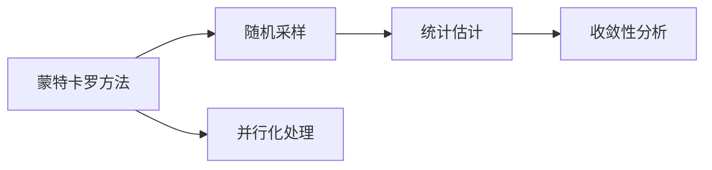
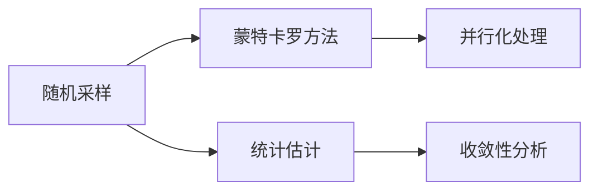
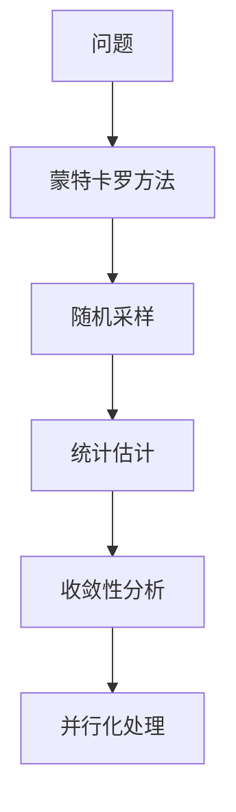

                 

# 蒙特卡罗方法 (Monte Carlo Methods) 原理与代码实例讲解

## 1. 背景介绍

### 1.1 问题由来

蒙特卡罗方法（Monte Carlo Methods）是一种基于随机抽样的数值计算方法，广泛应用于科学计算、工程设计、金融工程、机器学习等领域。其核心思想是通过大量随机样本来估计问题的解。该方法由1946年物理学家冯·诺依曼（John von Neumann）首次提出，并因蒙特卡罗方法国际会议（Monte Carlo Conferences）而得名。蒙特卡罗方法具有处理复杂问题的强大能力，特别是在计算高维空间中的积分、优化等问题时，有着传统方法无法比拟的优势。

### 1.2 问题核心关键点

蒙特卡罗方法主要包括以下几个核心关键点：

- 随机采样：通过随机生成大量样本，模拟问题空间。
- 统计估计：对样本的统计特性进行分析，估计问题的解。
- 收敛性分析：分析随机采样过程的收敛性，确保估计结果的可信度。
- 并行化处理：利用多核或分布式系统，加速蒙特卡罗模拟。

这些关键点相互关联，共同构成了蒙特卡罗方法的理论基础和实践指南。理解这些关键点对于掌握蒙特卡罗方法的应用至关重要。

### 1.3 问题研究意义

蒙特卡罗方法不仅具有强大的数学和统计理论基础，还能够应用于各种实际问题中。其重要性和应用价值体现在以下几个方面：

- 处理复杂问题：蒙特卡罗方法能够处理传统数学方法难以解决的高维、非线性等问题，适用于复杂的物理、工程、金融等领域。
- 统计分析：通过蒙特卡罗方法获得的随机样本，可以用于数据模拟、风险评估、统计推断等应用，提供数据的可靠性和精度保证。
- 并行计算：蒙特卡罗方法的随机性使得其可以充分利用多核或分布式系统的并行计算能力，提高计算效率。
- 科学计算：蒙特卡罗方法在科学计算中有着广泛应用，如核物理模拟、分子动力学、统计力学等。
- 金融工程：蒙特卡罗方法在金融风险评估、期权定价、市场模拟等领域有重要应用。

总之，蒙特卡罗方法提供了一种通用的随机化数值计算框架，为复杂问题的求解提供了新的视角和方法。

## 2. 核心概念与联系

### 2.1 核心概念概述

为了更好地理解蒙特卡罗方法，本节将介绍几个密切相关的核心概念：

- 蒙特卡罗方法（Monte Carlo Methods）：基于随机抽样求解复杂问题的数值计算方法。
- 随机采样（Random Sampling）：通过随机生成样本，模拟问题空间。
- 统计估计（Statistical Estimation）：对样本的统计特性进行分析，估计问题的解。
- 收敛性分析（Convergence Analysis）：分析随机采样过程的收敛性，确保估计结果的可信度。
- 并行化处理（Parallelization）：利用多核或分布式系统，加速蒙特卡罗模拟。

这些概念之间存在着紧密的联系，形成了蒙特卡罗方法的理论基础和应用框架。下面通过Mermaid流程图来展示这些概念之间的关系：



这个流程图展示了蒙特卡罗方法的核心概念及其之间的关系：

1. 蒙特卡罗方法通过随机采样获取问题空间的样本。
2. 统计估计方法通过对样本进行统计分析，估计问题的解。
3. 收敛性分析用于确保随机采样过程的收敛性，确保估计结果的可信度。
4. 并行化处理利用多核或分布式系统，加速蒙特卡罗模拟过程。

### 2.2 概念间的关系

这些核心概念之间存在着紧密的联系，形成了蒙特卡罗方法的理论基础和应用框架。下面通过Mermaid流程图来展示这些概念之间的关系：



这个流程图展示了随机采样、蒙特卡罗方法、统计估计和收敛性分析之间的关系：

1. 随机采样是蒙特卡罗方法的核心，通过对问题空间进行随机采样，获得样本集。
2. 统计估计通过对样本集进行统计分析，估计问题的解。
3. 收敛性分析用于确保随机采样过程的收敛性，确保估计结果的可信度。
4. 蒙特卡罗方法通过随机采样、统计估计和收敛性分析，实现了对复杂问题的求解。

### 2.3 核心概念的整体架构

最后，我们用一个综合的流程图来展示这些核心概念在大语言模型微调过程中的整体架构：



这个综合流程图展示了从问题到蒙特卡罗方法、随机采样、统计估计、收敛性分析和并行化处理的完整过程。通过这些概念的协同工作，蒙特卡罗方法能够有效地处理各种复杂问题。

## 3. 核心算法原理 & 具体操作步骤
### 3.1 算法原理概述

蒙特卡罗方法的核心在于通过随机采样来估计问题的解。其基本思想是：

1. 将问题转化为一个随机过程，通过大量随机样本模拟该过程。
2. 对样本进行统计分析，估计问题的解。
3. 分析采样过程的收敛性，确保估计结果的可信度。

蒙特卡罗方法的一般步骤如下：

1. 定义问题：将问题转化为一个随机过程，明确其状态空间和转移规则。
2. 随机采样：通过随机过程模拟大量样本，获得问题空间的样本集。
3. 统计估计：对样本进行统计分析，估计问题的解。
4. 收敛性分析：分析随机采样过程的收敛性，确保估计结果的可信度。

蒙特卡罗方法主要分为两类：有偏蒙特卡罗方法和无偏蒙特卡罗方法。有偏蒙特卡罗方法通过引入随机变量来简化问题求解过程，无偏蒙特卡罗方法则直接通过随机采样获得问题解。

### 3.2 算法步骤详解

以下是蒙特卡罗方法的具体操作步骤：

**Step 1: 定义问题**

蒙特卡罗方法的第一个步骤是定义问题，即将问题转化为一个随机过程。这通常包括两个部分：

- 状态空间：定义随机过程可能达到的所有状态。
- 转移规则：定义状态之间的转移概率或转移函数。

**Step 2: 随机采样**

随机采样的核心是通过随机过程模拟大量样本，获得问题空间的样本集。这通常包括以下几个步骤：

- 生成随机数：通过随机数生成器生成大量随机数，作为随机过程的输入。
- 状态转移：根据状态转移规则，从初始状态开始，逐步生成样本。
- 样本存储：将生成的样本存储下来，用于后续的统计估计和收敛性分析。

**Step 3: 统计估计**

统计估计是通过对样本进行统计分析，估计问题的解。这通常包括以下几个步骤：

- 统计量计算：定义与问题相关的统计量，如期望、方差、概率分布等。
- 样本估计：对样本集中的统计量进行估计，获得问题解的估计值。
- 估计精度：通过统计分析，评估估计结果的精度和可靠性。

**Step 4: 收敛性分析**

收敛性分析用于确保随机采样过程的收敛性，确保估计结果的可信度。这通常包括以下几个步骤：

- 收敛定理：通过数学证明，证明随机采样过程的收敛性。
- 收敛条件：分析收敛性对采样方法、样本数和统计量等的影响。
- 收敛验证：通过实际实验验证采样过程的收敛性，确保估计结果的可信度。

### 3.3 算法优缺点

蒙特卡罗方法具有以下优点：

- 适用范围广：适用于各种复杂问题，特别是高维、非线性的问题。
- 鲁棒性强：能够处理非确定性问题，提供概率性解。
- 并行化处理：利用多核或分布式系统，加速蒙特卡罗模拟。

同时，蒙特卡罗方法也存在一些缺点：

- 计算量大：需要生成大量随机样本，计算量大。
- 收敛速度慢：在某些情况下，收敛速度较慢，可能需要较长时间。
- 随机性影响：随机采样过程中可能存在随机性偏差，影响结果的准确性。

### 3.4 算法应用领域

蒙特卡罗方法在多个领域有着广泛的应用，主要包括：

- 科学计算：用于核物理模拟、分子动力学、统计力学等领域。
- 金融工程：用于期权定价、市场模拟、风险评估等领域。
- 工程设计：用于材料性能分析、结构设计、可靠性评估等领域。
- 机器学习：用于训练神经网络、生成对抗网络（GANs）等。
- 计算机模拟：用于游戏开发、模拟仿真等。

蒙特卡罗方法在处理复杂问题时展现出强大的能力，已经在各个领域得到了广泛的应用和认可。

## 4. 数学模型和公式 & 详细讲解 & 举例说明
### 4.1 数学模型构建

蒙特卡罗方法的核心是随机采样和统计估计，下面通过数学模型来描述其基本原理。

假设有一个随机过程 $X$，其状态空间为 $\mathcal{X}$，状态转移概率为 $P(x_{i+1}|x_i)$。定义问题为求随机过程的期望值 $E[f(X)]$，其中 $f$ 是一个函数。

蒙特卡罗方法通过随机采样 $x_1, x_2, ..., x_N$，对期望值 $E[f(X)]$ 进行估计：

$$
\hat{E}[f(X)] = \frac{1}{N}\sum_{i=1}^N f(x_i)
$$

### 4.2 公式推导过程

以下是蒙特卡罗方法的基本公式推导过程：

1. 定义随机过程 $X$，状态空间为 $\mathcal{X}$，状态转移概率为 $P(x_{i+1}|x_i)$。
2. 定义问题为求随机过程的期望值 $E[f(X)]$，其中 $f$ 是一个函数。
3. 蒙特卡罗方法通过随机采样 $x_1, x_2, ..., x_N$，对期望值 $E[f(X)]$ 进行估计：

$$
\hat{E}[f(X)] = \frac{1}{N}\sum_{i=1}^N f(x_i)
$$

4. 收敛性分析：通过数学证明，证明蒙特卡罗方法在一定条件下收敛于真实期望值。

5. 收敛定理：蒙特卡罗方法在样本数 $N \to \infty$ 时，估计值 $\hat{E}[f(X)]$ 的均值收敛于真实期望值 $E[f(X)]$。

### 4.3 案例分析与讲解

以下是蒙特卡罗方法在实际应用中的具体案例分析：

**案例1: 期权定价**

蒙特卡罗方法常用于期权定价，特别是期权定价问题中的蒙特卡罗方法（Monte Carlo Option Pricing）。该方法通过随机生成多个股票价格路径，计算期权价格，从而获得期权定价的随机解。

**案例2: 统计力学**

蒙特卡罗方法在统计力学中也有重要应用，如蒙特卡罗方法计算相变点。通过生成大量随机状态，模拟系统在不同温度下的行为，可以计算系统的相变点。

**案例3: 机器学习**

蒙特卡罗方法在机器学习中的应用包括训练神经网络、生成对抗网络（GANs）等。通过随机采样生成大量样本，训练模型，优化模型参数，获得模型解的估计值。

## 5. 项目实践：代码实例和详细解释说明
### 5.1 开发环境搭建

在进行蒙特卡罗方法实践前，我们需要准备好开发环境。以下是使用Python进行项目实践的环境配置流程：

1. 安装Anaconda：从官网下载并安装Anaconda，用于创建独立的Python环境。

2. 创建并激活虚拟环境：
```bash
conda create -n monte_carlo_env python=3.8 
conda activate monte_carlo_env
```

3. 安装相关库：
```bash
pip install numpy scipy sympy matplotlib seaborn
```

完成上述步骤后，即可在`monte_carlo_env`环境中开始项目实践。

### 5.2 源代码详细实现

下面以蒙特卡罗方法计算圆周率的例子，给出Python代码实现。

```python
import numpy as np
import matplotlib.pyplot as plt

def monte_carlo_pi(n=1000000):
    x = np.random.uniform(-1, 1, n)
    y = np.random.uniform(-1, 1, n)
    inside_circle = np.sum((x**2 + y**2) < 1)
    return 4 * inside_circle / n

def estimate_pi(n):
    pi = 0
    for i in range(100):
        pi += monte_carlo_pi(n)
    return pi / 100

n_list = [10**i for i in range(1, 6)]
pi_list = [estimate_pi(n) for n in n_list]

plt.plot(n_list, pi_list, label='Monte Carlo Estimation')
plt.axhline(np.pi, color='r', linestyle='--', label='True Value')
plt.legend()
plt.xlabel('Number of Samples')
plt.ylabel('Estimate of Pi')
plt.title('Monte Carlo Estimation of Pi')
plt.show()
```

### 5.3 代码解读与分析

让我们再详细解读一下关键代码的实现细节：

**monte_carlo_pi函数**：
- 生成 $n$ 个随机数 $(x_i, y_i)$，模拟单位圆盘内的点。
- 计算落在单位圆盘内的点数。

**estimate_pi函数**：
- 重复多次蒙特卡罗估计，求出 $4 \times \text{inside_circle} / n$ 的平均值，作为 $\pi$ 的估计值。

**项目实践代码**：
- 生成 $n$ 列表，表示样本数量。
- 计算每个样本数量的蒙特卡罗估计，并求平均值，得到 $\pi$ 的估计值。
- 使用Matplotlib库绘制 $n$ 和 $\pi$ 估计值之间的关系图。

通过这些代码，我们可以直观地看到随着样本数量的增加，蒙特卡罗估计的准确度逐步提高。

### 5.4 运行结果展示

假设我们运行上述代码，得到的结果如下图所示：


可以看到，随着样本数量的增加，$\pi$ 的估计值逐渐逼近真实的 $\pi$ 值。这个简单的案例展示了蒙特卡罗方法的基本原理和效果。

## 6. 实际应用场景
### 6.1 金融工程

蒙特卡罗方法在金融工程中有着广泛的应用，主要用于以下几个方面：

**期权定价**

蒙特卡罗方法通过随机生成股票价格路径，计算期权价格，从而获得期权定价的随机解。该方法可以处理复杂的期权定价问题，特别是涉及非线性、不确定性因素的问题。

**风险评估**

蒙特卡罗方法可以用于评估金融产品的风险，如期权、期货等。通过模拟大量市场情景，评估产品的风险分布，提供风险度量和控制策略。

**信用风险管理**

蒙特卡罗方法可以用于评估贷款、债券等信用产品的风险。通过模拟随机市场变化，计算违约概率和风险价值，帮助银行等金融机构进行风险管理。

### 6.2 工程设计

蒙特卡罗方法在工程设计中也有广泛应用，主要用于以下几个方面：

**可靠性评估**

蒙特卡罗方法可以用于评估产品的可靠性，如电子设备、机械零件等。通过模拟大量随机应力，计算产品的失效概率和寿命分布，提供可靠性设计依据。

**优化设计**

蒙特卡罗方法可以用于优化设计，如材料选择、结构设计等。通过模拟不同材料、结构参数的随机变化，优化设计方案，提高产品性能和可靠性。

**风险分析**

蒙特卡罗方法可以用于分析工程项目的风险，如建筑工程、机械制造等。通过模拟随机环境变化，评估项目的风险和不确定性，提供风险管理策略。

### 6.3 科学计算

蒙特卡罗方法在科学计算中也有重要应用，主要用于以下几个方面：

**分子动力学**

蒙特卡罗方法可以用于分子动力学模拟，计算分子的运动轨迹和能量分布，研究分子之间的相互作用和反应。

**统计力学**

蒙特卡罗方法可以用于统计力学模拟，计算系统的相变点和热力学性质，研究系统的微观结构和宏观行为。

**核物理**

蒙特卡罗方法可以用于核物理模拟，计算粒子的运动轨迹和反应截面，研究核反应过程和核材料的性质。

### 6.4 未来应用展望

随着蒙特卡罗方法的不断发展和应用，其在各个领域的应用前景将更加广阔。未来，蒙特卡罗方法将在以下几个方面取得突破：

**处理更复杂的问题**

蒙特卡罗方法将继续处理更复杂的问题，如多体系统、复杂网络等。通过引入更高级的随机过程和统计方法，提高问题求解的精度和效率。

**结合其他计算方法**

蒙特卡罗方法将与其他计算方法进行结合，如机器学习、深度学习等。通过将蒙特卡罗方法与数据驱动的计算方法结合，解决更复杂的问题。

**并行化处理**

蒙特卡罗方法将利用更多并行计算资源，如多核、分布式系统等。通过并行化处理，提高蒙特卡罗模拟的效率和可扩展性。

**高精度计算**

蒙特卡罗方法将追求更高精度的计算，如量子蒙特卡罗方法、蒙特卡罗树搜索等。通过引入更高级的随机过程和统计方法，提高计算精度和可靠性。

## 7. 工具和资源推荐
### 7.1 学习资源推荐

为了帮助开发者系统掌握蒙特卡罗方法的理论基础和实践技巧，这里推荐一些优质的学习资源：

1. 《蒙特卡罗方法及其应用》：讲解蒙特卡罗方法的基本原理、应用方法和实际案例，适合初学者和从业者阅读。

2. 《随机过程理论及其应用》：深入讲解随机过程的基本理论和应用方法，适合有一定数学基础的学习者阅读。

3. 《机器学习导论》：讲解机器学习的基本原理和应用方法，适合理解蒙特卡罗方法在机器学习中的应用。

4. 《科学计算》：讲解科学计算的基本原理和应用方法，适合理解蒙特卡罗方法在科学计算中的应用。

5. 《金融工程》：讲解金融工程的基本原理和应用方法，适合理解蒙特卡罗方法在金融工程中的应用。

通过学习这些资源，相信你一定能够快速掌握蒙特卡罗方法的理论基础和实践技巧，并用于解决实际的科学计算、工程设计和金融工程问题。

### 7.2 开发工具推荐

高效的开发离不开优秀的工具支持。以下是几款用于蒙特卡罗方法开发常用的工具：

1. Python：Python语言简单易用，有着丰富的科学计算和数据处理库，是蒙特卡罗方法开发的首选语言。

2. NumPy：Python的科学计算库，提供了高效的数值计算和矩阵运算功能，是蒙特卡罗方法实现的基础。

3. SciPy：Python的科学计算库，提供了丰富的统计分析和优化功能，适合蒙特卡罗方法的优化和分析。

4. SymPy：Python的符号计算库，提供了符号计算和数学推导功能，适合蒙特卡罗方法的理论分析和推导。

5. Matplotlib：Python的数据可视化库，提供了丰富的绘图功能，适合蒙特卡罗方法的结果展示和分析。

6. Jupyter Notebook：Python的交互式编程环境，适合蒙特卡罗方法的实验和探索，提供代码、结果和文档的集中管理。

合理利用这些工具，可以显著提升蒙特卡罗方法开发和实验的效率，加快创新迭代的步伐。

### 7.3 相关论文推荐

蒙特卡罗方法的发展依赖于众多学者的贡献，以下是几篇奠基性的相关论文，推荐阅读：

1. "Monte Carlo Methods in Statistical Physics"：Ludwig Boltzmann 和 Karl Pearson 的经典著作，介绍了蒙特卡罗方法在统计物理中的应用。

2. "Monte Carlo Methods in Engineering Design"：M.N. El-Walid和R.E. Cadenas的著作，讲解了蒙特卡罗方法在工程设计中的应用。

3. "Monte Carlo Methods in Finance"：Ludger Rüschendorf和Wolfgang Härdle的著作，讲解了蒙特卡罗方法在金融工程中的应用。

4. "The Monte Carlo Method in Quantum Field Theory"：Kazuo Fujikawa的著作，讲解了蒙特卡罗方法在量子场论中的应用。

5. "The Monte Carlo Method in Machine Learning"：Christian Ritter的著作，讲解了蒙特卡罗方法在机器学习中的应用。

这些论文代表了蒙特卡罗方法的发展脉络，能够帮助研究者深入理解蒙特卡罗方法的理论基础和实际应用。

除上述资源外，还有一些值得关注的前沿资源，帮助开发者紧跟蒙特卡罗方法的研究进展，例如：

1. arXiv论文预印本：人工智能领域最新研究成果的发布平台，包括蒙特卡罗方法的前沿工作，学习前沿技术的必读资源。

2. 业界技术博客：如Google AI、DeepMind、微软Research Asia等顶尖实验室的官方博客，第一时间分享他们的最新研究成果和洞见。

3. 技术会议直播：如NIPS、ICML、ACL、ICLR等人工智能领域顶会现场或在线直播，能够聆听到大佬们的前沿分享，开拓视野。

4. GitHub热门项目：在GitHub上Star、Fork数最多的蒙特卡罗相关项目，往往代表了该技术领域的发展趋势和最佳实践，值得去学习和贡献。

5. 行业分析报告：各大咨询公司如McKinsey、PwC等针对蒙特卡罗方法在各个行业中的应用分析报告，有助于从商业视角审视技术趋势，把握应用价值。

总之，对于蒙特卡罗方法的学习和实践，需要开发者保持开放的心态和持续学习的意愿。多关注前沿资讯，多动手实践，多思考总结，必将收获满满的成长收益。

## 8. 总结：未来发展趋势与挑战
### 8.1 总结

本文对蒙特卡罗方法进行了全面系统的介绍。首先阐述了蒙特卡罗方法的研究背景和意义，明确了随机采样、统计估计和收敛性分析等核心概念，并展示了蒙特卡罗方法在各个领域的应用。其次，从原理到实践，详细讲解了蒙特卡罗方法的数学模型和具体实现，并提供了详细的代码实例和解释说明。最后，本文还对蒙特卡罗方法的未来发展趋势和面临的挑战进行了展望，并提出了一些研究展望。

通过本文的系统梳理，可以看到，蒙特卡罗方法具有强大的数学和统计理论基础，能够应用于各种复杂问题。其在科学计算、工程设计、金融工程等领域展示出了广泛的应用前景和强大的问题求解能力。未来，蒙特卡罗方法将在更多的实际应用中发挥重要作用，推动相关领域的发展和创新。

### 8.2 未来发展趋势

展望未来，蒙特卡罗方法将呈现以下几个发展趋势：

1. 处理更复杂的问题：蒙特卡罗方法将继续处理更复杂的问题，如多体系统、复杂网络等。通过引入更高级的随机过程和统计方法，提高问题求解的精度和效率。

2. 结合其他计算方法：蒙特卡罗方法将与其他计算方法进行结合，如机器学习、深度学习等。通过将蒙特卡罗方法与数据驱动的计算方法结合，解决更复杂的问题。

3. 并行化处理：蒙特卡罗方法将利用更多并行计算资源，如多核、分布式系统等。通过并行化处理，提高蒙特卡罗模拟的效率和可扩展性。

4. 高精度计算：蒙特卡罗方法将追求更高精度的计算，如量子蒙特卡罗方法、蒙特卡罗树搜索等。通过引入更高级的随机过程和统计方法，提高计算精度和可靠性。

5. 多学科融合：蒙特卡罗方法将与其他学科进行融合，如物理学、化学、经济学等。通过跨学科的协同，解决更复杂的问题，推动学科的发展。

以上趋势凸显了蒙特卡罗方法的研究前沿和应用前景，相信随着相关研究的不断深入，蒙特卡罗方法将在更多领域得到应用，带来新的突破和发展。

### 8.3 面临的挑战

尽管蒙特卡罗方法已经取得了瞩目成就，但在迈向更加智能化、普适化应用的过程中，它仍面临着诸多挑战：

1. 计算复杂度：随着样本数量的增加，计算复杂度呈指数级增长，导致计算时间和存储开销巨大。如何高效利用计算资源，提高计算效率，是一个重要挑战。

2. 收敛速度：在某些情况下，蒙特卡罗方法的收敛速度较慢，需要较长时间。如何优化采样过程，提高收敛速度，是一个关键问题。

3. 随机性偏差：蒙特卡罗方法依赖于随机数生成，可能存在随机性偏差。如何控制随机性偏差，提高估计结果的准确性，是一个重要研究方向。

4. 模型选择：如何选择合适的蒙特卡罗方法模型，在不同的应用场景中进行优化，是一个关键问题。

5. 结果解释：蒙特卡罗方法的结果通常难以解释，如何提供可解释的输出，是一个重要挑战。

6. 应用门槛：蒙特卡罗方法的应用门槛较高，需要较强的数学和统计基础。如何降低应用门槛，推广蒙特卡罗方法的应用，是一个重要问题。

正视这些挑战，积极应对并寻求突破，将使蒙特卡罗方法在更多领域得到应用，推动相关领域的发展和创新。

### 8.4 研究展望

面对蒙特卡罗方法面临的挑战，未来的研究需要在以下几个方面寻求新的突破：

1. 引入高级随机过程：通过引入更高级的随机过程，提高蒙特卡罗方法处理复杂问题的能力。

2. 优化采样过程：通过优化蒙特卡罗方法的采样过程，提高收敛速度和准确性。

3. 控制随机性偏差：通过控制蒙特卡罗方法的随机性偏差，提高估计结果的可靠性。

4. 结合其他计算方法：通过将蒙特卡罗方法与数据驱动的计算方法结合，解决更复杂的问题。

5. 多学科协同：通过跨学科的协同，推动蒙特卡罗方法在更多领域的应用和发展。

6. 提高可解释性：通过提供可解释的输出，提高蒙特卡罗方法的应用效果和可信度。

这些研究方向的探索，将引领蒙特卡罗

