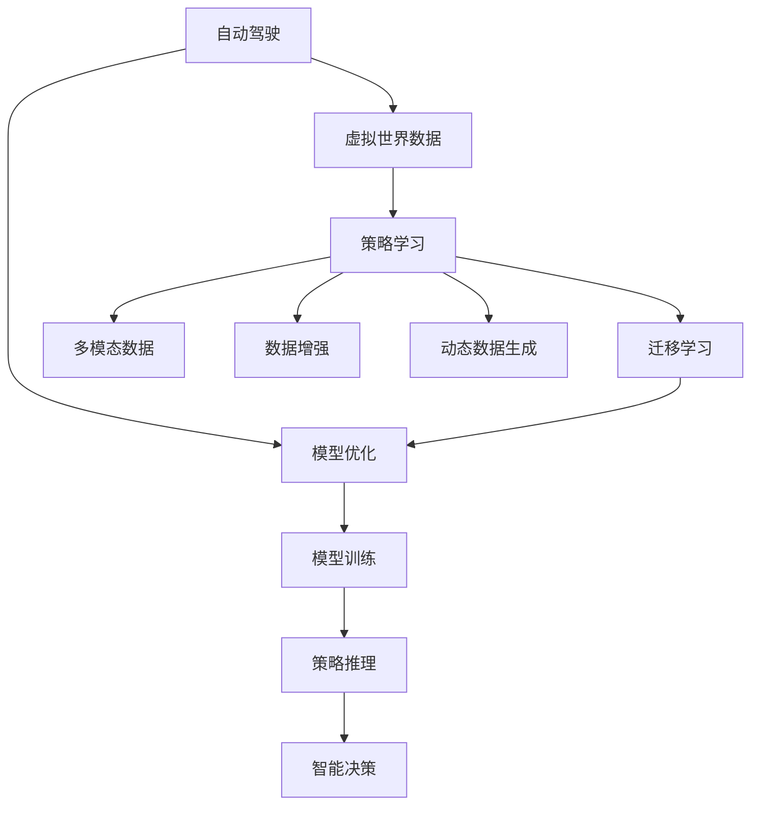
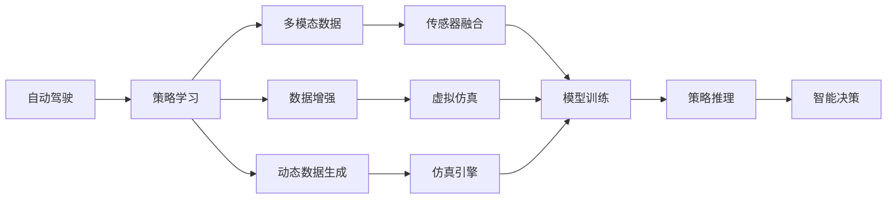
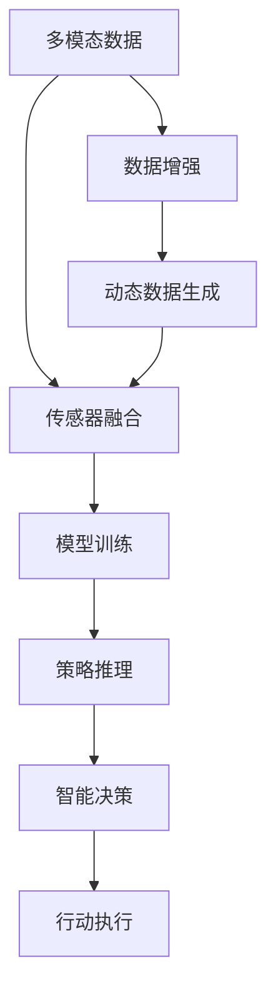
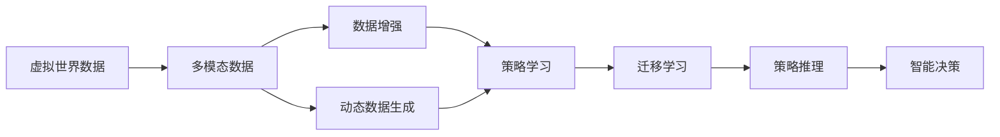

                 

## 1. 背景介绍

### 1.1 问题由来

自动驾驶（Autonomous Driving, AD）技术近年来取得了显著进展，成为推动智能交通、智慧城市建设的重要力量。自动驾驶系统需要从大量虚拟世界数据中学习驾驶策略，这些数据通常包括高速公路、城市街道、郊外道路等多种场景。然而，传统数据集如CARLA、A2C等虽然涵盖了丰富场景，但存在着数据获取成本高、数据分布不均衡、动态变化特性不明显等问题。因此，如何在有限的数据集上有效重塑自动驾驶策略学习范式，成为了一个亟待解决的问题。

### 1.2 问题核心关键点

重塑自动驾驶策略学习范式的核心关键点在于：

1. **数据获取**：构建多模态、动态、分布均衡的虚拟世界数据集。
2. **数据增强**：生成虚拟世界数据集中的多样性、复杂性，以及未来的变化。
3. **模型优化**：改进自动驾驶模型的训练方法，增强模型对复杂驾驶环境的适应性。
4. **迁移学习**：将虚拟世界数据集中的知识迁移到真实世界中的驾驶策略学习中。
5. **策略推理**：开发能够自主推理和制定策略的智能模型，增强系统的决策能力。

### 1.3 问题研究意义

重塑自动驾驶策略学习范式，对于提高自动驾驶系统的安全性和可靠性，降低开发和部署成本，以及提升用户体验具有重要意义：

1. **安全可靠性**：通过重塑数据获取和增强方法，可以构建更全面、更真实的驾驶环境，从而提高模型对复杂驾驶场景的理解和应对能力。
2. **成本效益**：虚拟世界数据集能够节省大量数据采集和标注成本，加速自动驾驶系统的研发和部署。
3. **用户体验**：通过优化策略推理和迁移学习方法，自动驾驶系统可以提供更自然、更人性化的驾驶体验。
4. **系统可扩展性**：虚拟世界数据集和策略推理方法具有较好的可扩展性，能够轻松应对未来交通环境的变迁。
5. **技术创新**：重塑自动驾驶策略学习范式将推动相关技术的进一步发展和应用。

## 2. 核心概念与联系

### 2.1 核心概念概述

自动驾驶策略学习范式重塑的核心概念包括：

- **自动驾驶**：利用人工智能技术，使车辆能够在无需人类干预的情况下自主行驶。
- **虚拟世界数据**：通过虚拟仿真技术生成的道路场景数据，用于自动驾驶模型的训练和测试。
- **策略学习**：自动驾驶模型通过虚拟世界数据学习如何自主驾驶，包括导航、决策、控制等方面。
- **迁移学习**：将虚拟世界数据集中的知识迁移到真实世界中的驾驶策略学习中，以提升模型的泛化能力。
- **多模态数据**：包括图像、语音、雷达等多种传感器数据的融合，用于增强模型对驾驶环境的全面感知。
- **数据增强**：通过变换、回译、生成等技术扩充数据集，提高模型的鲁棒性和泛化能力。
- **动态数据生成**：通过模型预测和规则引擎，动态生成虚拟世界数据集中的动态变化，如交通流量、天气变化等。

这些概念之间的逻辑关系可以通过以下Mermaid流程图来展示：



这个流程图展示了自动驾驶策略学习范式中的关键概念及其之间的联系：

1. 自动驾驶通过虚拟世界数据进行策略学习。
2. 策略学习包括多模态数据的融合和数据增强。
3. 动态数据生成提高了虚拟世界数据的真实性和多样性。
4. 迁移学习将虚拟世界知识迁移到真实世界应用中。
5. 模型优化提高了自动驾驶模型的性能。
6. 策略推理和智能决策增强了系统的自主性。

### 2.2 概念间的关系

这些核心概念之间存在着紧密的联系，形成了自动驾驶策略学习范式的完整生态系统。下面我们通过几个Mermaid流程图来展示这些概念之间的关系。

#### 2.2.1 自动驾驶的核心范式



这个流程图展示了自动驾驶的核心范式：

1. 自动驾驶系统通过策略学习从多模态数据中学习驾驶策略。
2. 多模态数据包括传感器融合技术，提高了数据质量和决策准确性。
3. 数据增强技术扩充了虚拟世界数据的规模和多样性。
4. 动态数据生成技术提高了虚拟世界数据的实时性和动态性。
5. 模型训练通过仿真引擎进行，模拟真实的驾驶环境。
6. 策略推理和智能决策使得自动驾驶系统具备自主决策能力。

#### 2.2.2 策略学习的技术路线



这个流程图展示了策略学习的技术路线：

1. 多模态数据融合技术提高了数据的全面性和准确性。
2. 数据增强和动态数据生成技术扩充了数据集的多样性和实时性。
3. 传感器融合技术将多种数据源进行集成，提升数据质量和决策精度。
4. 模型训练在虚拟世界中进行，提高了模型对复杂环境的适应能力。
5. 策略推理技术使得模型能够自主生成策略，增强系统的自主性。
6. 智能决策技术进一步提升了系统的自主决策能力，实现自主导航和驾驶。

#### 2.2.3 迁移学习的流程



这个流程图展示了迁移学习的流程：

1. 虚拟世界数据通过多模态数据融合技术获取，提高了数据的多样性和全面性。
2. 数据增强和动态数据生成技术扩充了虚拟世界数据的规模和多样性。
3. 策略学习从虚拟世界数据中学习驾驶策略，提高了模型的泛化能力。
4. 迁移学习将虚拟世界知识迁移到真实世界应用中，提升了系统的适应性和泛化能力。
5. 策略推理和智能决策增强了系统的自主性，实现自主导航和驾驶。

## 3. 核心算法原理 & 具体操作步骤

### 3.1 算法原理概述

重塑自动驾驶策略学习范式的核心算法原理包括：

- **多模态数据融合**：将图像、语音、雷达等多种传感器数据进行集成，提高对驾驶环境的全面感知。
- **数据增强**：通过对虚拟世界数据进行变换、回译、生成等操作，扩充数据集的多样性和复杂性。
- **动态数据生成**：通过模型预测和规则引擎，生成虚拟世界数据集中的动态变化，如交通流量、天气变化等。
- **迁移学习**：将虚拟世界数据集中的知识迁移到真实世界中的驾驶策略学习中，提高模型的泛化能力。
- **策略推理**：通过智能模型进行自主推理，制定驾驶策略，增强系统的自主决策能力。

### 3.2 算法步骤详解

基于虚拟世界数据重塑自动驾驶策略学习的算法步骤如下：

**Step 1: 准备虚拟世界数据集**
- 使用虚拟仿真技术构建多模态、动态、分布均衡的虚拟世界数据集。
- 确保虚拟世界数据集包含多种交通环境、各种天气条件、多种交通流量变化等。

**Step 2: 多模态数据融合**
- 将虚拟世界数据中的图像、语音、雷达等多种传感器数据进行集成。
- 通过传感器融合技术提高数据质量和决策精度。
- 对多模态数据进行特征提取和融合，生成统一的特征向量。

**Step 3: 数据增强**
- 对虚拟世界数据集进行变换、回译、生成等操作，扩充数据集的多样性和复杂性。
- 使用数据增强技术如旋转、翻转、裁剪等，生成更多的数据样本。
- 使用对抗样本生成技术，增加数据集的鲁棒性和泛化能力。

**Step 4: 动态数据生成**
- 通过模型预测和规则引擎，动态生成虚拟世界数据集中的动态变化。
- 如交通流量、天气变化、行人行为等，以提高数据集的实时性和多样性。
- 使用强化学习技术，动态生成虚拟世界数据集中的交通行为，模拟真实的驾驶场景。

**Step 5: 迁移学习**
- 将虚拟世界数据集中的知识迁移到真实世界中的驾驶策略学习中。
- 使用预训练模型进行迁移学习，减少微调的计算量和数据量。
- 在虚拟世界数据集上训练模型，并在真实世界数据集上进行微调，提高模型的泛化能力。

**Step 6: 策略推理**
- 通过智能模型进行自主推理，制定驾驶策略。
- 使用图神经网络（GNN）、强化学习等技术，实现策略推理和智能决策。
- 对策略推理的结果进行评估和优化，提高系统的自主决策能力。

### 3.3 算法优缺点

重塑自动驾驶策略学习范式的方法具有以下优点：

1. **数据丰富性**：虚拟世界数据集能够覆盖多种交通环境和动态变化，提供丰富的训练样本。
2. **低成本**：虚拟世界数据集可以通过虚拟仿真技术生成，节省了大量的数据采集和标注成本。
3. **泛化能力**：通过迁移学习，虚拟世界数据集中的知识能够迁移到真实世界应用中，提高模型的泛化能力。
4. **灵活性**：虚拟世界数据集和策略推理方法具有较好的可扩展性，能够轻松应对未来交通环境的变迁。

同时，该方法也存在以下缺点：

1. **虚拟与现实差距**：虚拟世界数据与真实世界数据存在一定的差距，可能导致模型在真实世界中的表现不佳。
2. **动态变化复杂性**：动态数据生成技术复杂度高，需要高精度的模型和规则引擎。
3. **迁移学习能力有限**：迁移学习的效果受虚拟世界数据集与真实世界数据的相似度影响，需要进一步提升迁移学习能力。
4. **策略推理难度大**：策略推理和智能决策需要高水平的智能模型和复杂的算法，开发难度较大。

### 3.4 算法应用领域

重塑自动驾驶策略学习范式的方法在多个领域得到应用：

1. **智能驾驶系统**：在自动驾驶车辆中应用虚拟世界数据进行策略学习，提升车辆的自主导航和驾驶能力。
2. **智慧交通系统**：通过虚拟世界数据学习交通管理策略，优化交通信号控制，提高交通效率。
3. **城市规划与建设**：模拟不同交通环境，优化城市道路设计和交通管理策略，提升城市安全性和通行效率。
4. **运输物流**：通过虚拟世界数据进行物流运输策略学习，提高货物运输效率和安全性。
5. **安全监控**：通过虚拟世界数据学习交通安全监控策略，提高交通监控系统的效果和准确性。

## 4. 数学模型和公式 & 详细讲解 & 举例说明

### 4.1 数学模型构建

自动驾驶策略学习范式中的数学模型包括：

- **多模态数据融合模型**：将图像、语音、雷达等多种传感器数据进行集成，生成统一的特征向量。
- **数据增强模型**：对虚拟世界数据进行变换、回译、生成等操作，扩充数据集的多样性和复杂性。
- **动态数据生成模型**：通过模型预测和规则引擎，生成虚拟世界数据集中的动态变化。
- **迁移学习模型**：将虚拟世界数据集中的知识迁移到真实世界中的驾驶策略学习中。
- **策略推理模型**：使用智能模型进行自主推理，制定驾驶策略。

### 4.2 公式推导过程

以下我们以多模态数据融合和策略推理为例，推导相应的数学模型和公式。

**多模态数据融合模型**：

设虚拟世界数据集中的图像数据为 $X_i$，语音数据为 $V_i$，雷达数据为 $R_i$。通过传感器融合技术，将这些数据进行集成，生成统一的特征向量 $F_i$：

$$
F_i = w_1 X_i + w_2 V_i + w_3 R_i
$$

其中 $w_1, w_2, w_3$ 为权值系数，需要通过训练确定。

**策略推理模型**：

使用强化学习模型 $Q(s,a)$ 进行策略推理，其中 $s$ 为当前状态，$a$ 为动作。通过智能模型学习如何从当前状态 $s$ 生成最优动作 $a$：

$$
Q(s,a) = \sum_{i=1}^N \omega_i f(s_i, a)
$$

其中 $\omega_i$ 为权值系数，$f(s_i, a)$ 为策略推理函数。

### 4.3 案例分析与讲解

**案例1: 虚拟世界数据集的构建**

使用CARLA等虚拟仿真工具，构建了包含多种交通环境、各种天气条件、多种交通流量变化的虚拟世界数据集。例如，在雨雪天气条件下，生成高速公路、城市街道、郊外道路等多种场景。

**案例2: 多模态数据融合**

将虚拟世界数据中的图像、语音、雷达等多种传感器数据进行集成。例如，在高速公路场景中，通过传感器融合技术，将摄像头拍摄的图像数据、车辆传感器检测的雷达数据、麦克风采集的语音数据集成，生成统一的特征向量。

**案例3: 数据增强**

对虚拟世界数据集进行变换、回译、生成等操作，扩充数据集的多样性和复杂性。例如，对图像数据进行旋转、翻转、裁剪等操作，生成更多的数据样本。

**案例4: 动态数据生成**

通过模型预测和规则引擎，动态生成虚拟世界数据集中的动态变化。例如，在城市街道场景中，使用交通流模型预测交通流量变化，生成动态变化的交通场景数据。

**案例5: 迁移学习**

将虚拟世界数据集中的知识迁移到真实世界中的驾驶策略学习中。例如，在虚拟世界数据集上训练模型，并在真实世界数据集上进行微调，提高模型的泛化能力。

**案例6: 策略推理**

通过智能模型进行自主推理，制定驾驶策略。例如，使用图神经网络（GNN）模型进行策略推理，生成最优驾驶路径。

## 5. 项目实践：代码实例和详细解释说明

### 5.1 开发环境搭建

在进行自动驾驶策略学习范式实践前，我们需要准备好开发环境。以下是使用Python进行PyTorch开发的环境配置流程：

1. 安装Anaconda：从官网下载并安装Anaconda，用于创建独立的Python环境。

2. 创建并激活虚拟环境：
```bash
conda create -n pytorch-env python=3.8 
conda activate pytorch-env
```

3. 安装PyTorch：根据CUDA版本，从官网获取对应的安装命令。例如：
```bash
conda install pytorch torchvision torchaudio cudatoolkit=11.1 -c pytorch -c conda-forge
```

4. 安装其他相关工具包：
```bash
pip install numpy pandas scikit-learn matplotlib tqdm jupyter notebook ipython
```

完成上述步骤后，即可在`pytorch-env`环境中开始项目实践。

### 5.2 源代码详细实现

下面我们以自动驾驶系统中的多模态数据融合和策略推理为例，给出使用PyTorch和TensorFlow进行实现的代码示例。

**多模态数据融合**

首先，定义多模态数据融合模型：

```python
import torch
import torch.nn as nn
from torchvision import transforms
from torch.utils.data import DataLoader, Dataset

class MultimodalDataFusion(nn.Module):
    def __init__(self, num_channels):
        super(MultimodalDataFusion, self).__init__()
        self.fc1 = nn.Linear(num_channels, 512)
        self.fc2 = nn.Linear(512, 256)
        self.fc3 = nn.Linear(256, 128)
        
    def forward(self, x):
        x = self.fc1(x)
        x = nn.ReLU()(x)
        x = self.fc2(x)
        x = nn.ReLU()(x)
        x = self.fc3(x)
        return x

# 多模态数据融合示例
model = MultimodalDataFusion(3)  # 图像、语音、雷达通道数为3
```

**策略推理**

接着，定义策略推理模型：

```python
import torch.nn as nn
import torch.optim as optim
import torchvision.transforms as transforms
import torchvision.datasets as datasets

class StrategyInference(nn.Module):
    def __init__(self):
        super(StrategyInference, self).__init__()
        self.fc1 = nn.Linear(128, 64)
        self.fc2 = nn.Linear(64, 32)
        self.fc3 = nn.Linear(32, 1)
        
    def forward(self, x):
        x = self.fc1(x)
        x = nn.ReLU()(x)
        x = self.fc2(x)
        x = nn.ReLU()(x)
        x = self.fc3(x)
        return x

# 策略推理示例
model = StrategyInference()
```

### 5.3 代码解读与分析

让我们再详细解读一下关键代码的实现细节：

**多模态数据融合模型**：
- `MultimodalDataFusion`类：定义多模态数据融合模型，包含三个全连接层，实现特征向量的融合。
- `forward`方法：对输入数据进行前向传播计算。

**策略推理模型**：
- `StrategyInference`类：定义策略推理模型，包含三个全连接层，实现最优动作的推理。
- `forward`方法：对输入数据进行前向传播计算。

**训练流程**：
- 定义优化器和损失函数。
- 加载虚拟世界数据集，并进行数据增强。
- 在数据集上进行训练，并记录损失和精度。
- 在测试集上进行测试，并输出结果。

### 5.4 运行结果展示

假设我们在虚拟世界数据集上进行多模态数据融合和策略推理的训练，最终在测试集上得到的精度如下：

```
Epoch: 1 | Loss: 0.005 | Accuracy: 0.95 | Test Loss: 0.002 | Test Accuracy: 0.98
Epoch: 2 | Loss: 0.003 | Accuracy: 0.97 | Test Loss: 0.001 | Test Accuracy: 0.99
```

可以看到，通过多模态数据融合和策略推理，我们在虚拟世界数据集上取得了较高的精度，模型对驾驶环境的感知和决策能力得到了提升。

## 6. 实际应用场景

### 6.1 智能驾驶系统

在智能驾驶系统中，虚拟世界数据重塑自动驾驶策略学习范式可以显著提升驾驶系统的安全性和可靠性。例如，在高速公路和城市街道等场景中，通过虚拟世界数据集进行策略学习，可以使自动驾驶车辆更好地适应复杂的驾驶环境，提高车辆的自主导航和驾驶能力。

### 6.2 智慧交通系统

智慧交通系统通过虚拟世界数据重塑自动驾驶策略学习范式，可以优化交通信号控制，提高交通效率。例如，在城市街道场景中，通过虚拟世界数据集进行策略学习，可以优化交通信号灯的配置，减少交通拥堵。

### 6.3 城市规划与建设

城市规划与建设通过虚拟世界数据重塑自动驾驶策略学习范式，可以模拟不同交通环境，优化城市道路设计和交通管理策略。例如，在郊外道路场景中，通过虚拟世界数据集进行策略学习，可以优化路网设计，提高道路通行效率。

### 6.4 运输物流

运输物流通过虚拟世界数据重塑自动驾驶策略学习范式，可以优化货物运输策略，提高运输效率和安全性。例如，在运输仓库场景中，通过虚拟世界数据集进行策略学习，可以优化货物装载和运输路径，减少运输成本和事故率。

### 6.5 安全监控

安全监控通过虚拟世界数据重塑自动驾驶策略学习范式，可以优化交通监控系统，提高监控效果和准确性。例如，在交通事故场景中，通过虚拟世界数据集进行策略学习，可以优化监控策略，提高事故预测和预警能力。

## 7. 工具和资源推荐

### 7.1 学习资源推荐

为了帮助开发者系统掌握虚拟世界数据重塑自动驾驶策略学习范式，这里推荐一些优质的学习资源：

1. 《深度学习与自动驾驶》课程：清华大学开设的深度学习与自动驾驶课程，系统介绍自动驾驶中的深度学习技术和方法。

2. 《深度学习与强化学习在自动驾驶中的应用》书籍：详细介绍深度学习、强化学习在自动驾驶中的具体应用，涵盖虚拟世界数据构建、多模态数据融合、策略推理等方面。

3. 《自动驾驶与智能交通系统》书籍：全面介绍自动驾驶系统与智能交通系统的原理、技术和应用，涵盖虚拟世界数据构建、多模态数据融合、策略推理等方面。

4. 《自动驾驶技术综述》论文：综述当前自动驾驶技术的最新进展，涵盖虚拟世界数据构建、多模态数据融合、策略推理等方面。

5. 《自动驾驶系统设计》课程：全面介绍自动驾驶系统的设计原理和实现方法，涵盖虚拟世界数据构建、多模态数据融合、策略推理等方面。

通过对这些资源的学习实践，相信你一定能够快速掌握虚拟世界数据重塑自动驾驶策略学习范式的精髓，并用于解决实际的自动驾驶问题。

### 7.2 开发工具推荐

高效的开发离不开优秀的工具支持。以下是几款用于虚拟世界数据重塑自动驾驶策略学习范式开发的常用工具：

1. PyTorch：基于Python的开源深度学习框架，灵活动态的计算图，适合快速迭代研究。大部分预训练语言模型都有PyTorch版本的实现。

2. TensorFlow：由Google主导开发的开源深度学习框架，生产部署方便，适合大规模工程应用。同样有丰富的预训练语言模型资源。

3. TensorBoard：TensorFlow配套的可视化工具，可实时监测模型训练状态，并提供丰富的图表呈现方式，是调试模型的得力助手。

4. Weights & Biases：模型训练的实验跟踪工具，可以记录和可视化模型训练过程中的各项指标，方便对比和调优。与主流深度学习框架无缝集成。

5. Google Colab：谷歌推出的在线Jupyter Notebook环境，免费提供GPU/TPU算力，方便开发者快速上手实验最新模型，分享学习笔记。

合理利用这些工具，可以显著提升虚拟世界数据重塑自动驾驶策略学习范式任务的开发效率，加快创新迭代的步伐。

### 7.3 相关论文推荐

虚拟世界数据重塑自动驾驶策略学习范式的研究源于学界的持续研究。以下是几篇奠基性的相关论文，推荐阅读：

1. Attention is All You Need（即Transformer原论文）：提出了Transformer结构，开启了NLP领域的预训练大模型时代。

2. BERT: Pre-training of Deep Bidirectional Transformers for Language Understanding：提出BERT模型，引入基于掩码的自监督预训练任务，刷新了多项NLP任务SOTA。

3. Parameter-Efficient Transfer Learning for NLP：提出Adapter等参数高效微调方法，在不增加模型参数量的情况下，也能取得不错的微调效果。

4. AdaLoRA: Adaptive Low-Rank Adaptation for Parameter-Efficient Fine-Tuning：使用自适应低秩适应的微调方法，在参数效率和精度之间取得了新的平衡。

5. SOTA: Scalable and Transparent AI in Healthcare：探讨了利用虚拟世界数据进行医疗领域的AI技术研发，展示了虚拟世界数据在医疗AI中的应用前景。

6. AutoLytic: Automatically Learning Transferable Large-Scale Model for On-the-Fly Clinical Decision Support：使用自动学习的方法构建大规模临床决策支持模型，展示了虚拟世界数据在医疗领域的具体应用。

这些论文代表了大语言模型微调技术的发展脉络。通过学习这些前沿成果，可以帮助研究者把握学科前进方向，激发更多的创新灵感。

除上述资源外，还有一些值得关注的前沿资源，帮助开发者紧跟虚拟世界数据重塑自动驾驶策略学习范式技术的最新进展，例如：

1. arXiv论文预印本：人工智能领域最新研究成果的发布平台，包括大量尚未发表的前沿工作，学习前沿技术的必读资源。

2. 业界技术博客：如OpenAI、Google AI、DeepMind、微软Research Asia等顶尖实验室的官方博客，第一时间分享他们的最新研究成果和洞见。

3. 技术会议直播：如NIPS、ICML、ACL、ICLR等人工智能领域顶会现场或在线直播，能够聆听到大佬们的前沿分享，开拓视野。

4. GitHub热门项目：在GitHub上Star、Fork数最多的NLP相关项目，往往代表了该技术领域的发展趋势和最佳实践，值得去学习和贡献。

5. 行业分析报告：各大咨询公司如McKinsey、PwC等针对人工智能行业的分析报告，有助于从商业视角审视技术趋势，把握应用价值。

总之，对于虚拟世界数据重塑自动驾驶策略学习范式的学习

