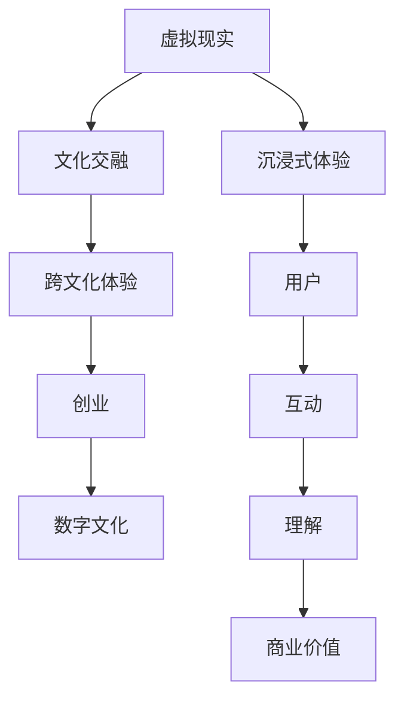
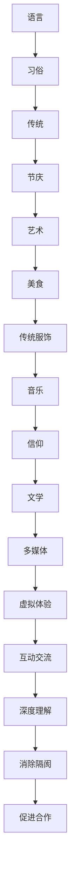
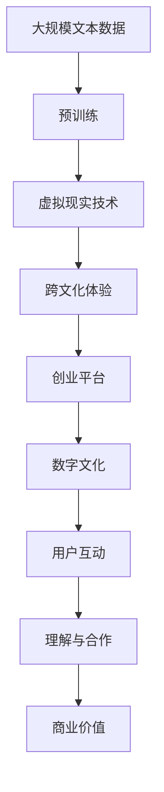

                 

# 虚拟现实文化交融创业：促进理解的跨文化体验平台

> 关键词：虚拟现实,文化交融,跨文化体验,创业,数字文化

## 1. 背景介绍

### 1.1 问题由来

在当今这个全球化的时代，文化交融成为了一个日益重要的主题。各种文化背景的人越来越多地通过网络进行交流，但缺乏共同语言和文化背景的隔阂仍然存在。特别是在不同国家和地区之间的文化交流中，这种语言和文化差异会导致误解和冲突。如何通过技术手段促进不同文化背景的人群之间的理解和交融，成为了一个亟待解决的问题。

### 1.2 问题核心关键点

实现文化交融的关键在于搭建一个能够让不同文化背景的人进行有效沟通和交流的平台。这个平台需要具备以下几个核心功能：

- 支持多语言和多文化的沉浸式虚拟现实体验。
- 提供实时互动和交流的功能。
- 能够帮助用户克服语言和文化障碍，促进理解。
- 具备开放性，能够吸引来自世界各地的用户。
- 拥有持续发展的商业模式，确保平台的可持续性。

### 1.3 问题研究意义

建立一个能够促进文化交融的虚拟现实平台，不仅有助于增强全球文化多样性，还能促进国际合作与和平。它不仅能改善不同文化背景的人群之间的理解，还能为跨文化创业提供新契机，推动创新和经济发展。此外，这个平台还可以作为教育工具，帮助学生了解不同的文化背景，培养跨文化意识。

## 2. 核心概念与联系

### 2.1 核心概念概述

为更好地理解虚拟现实文化交融创业，本节将介绍几个密切相关的核心概念：

- **虚拟现实(VR)**：一种通过计算机技术模拟出一个沉浸式、多感官互动的环境，让用户感觉自己仿佛置身其中。
- **文化交融**：不同文化背景的人通过交流和互动，逐渐理解和接受彼此的文化，减少误解和冲突。
- **跨文化体验**：通过虚拟现实技术，让用户能够体验不同文化背景下的生活和习俗，增进对其他文化的理解。
- **创业**：通过商业手段，将技术产品化并推向市场，实现社会和经济价值。
- **数字文化**：通过数字技术手段，记录、传播和保存文化。
- **沉浸式体验**：用户通过虚拟现实技术，在虚拟环境中获得深度沉浸感，仿佛身临其境。

这些核心概念之间的逻辑关系可以通过以下Mermaid流程图来展示：



这个流程图展示了从虚拟现实技术到文化交融，再到跨文化体验、创业和数字文化，最终通过用户互动和理解，实现商业价值的过程。

### 2.2 概念间的关系

这些核心概念之间存在着紧密的联系，形成了虚拟现实文化交融创业的完整生态系统。下面我通过几个Mermaid流程图来展示这些概念之间的关系。

#### 2.2.1 虚拟现实技术的发展历程


这个流程图展示了虚拟现实技术从早期发展到现在，如何一步步提升用户体验，从而实现了跨文化体验和创业机会。

#### 2.2.2 跨文化体验的多样性



这个流程图展示了通过跨文化体验的多样性，用户能够从不同方面了解和接受其他文化，从而消除隔阂，促进合作。

#### 2.2.3 创业与数字文化的关系


这个流程图展示了创业平台如何通过记录和传播数字文化，推动文化交流和传承，最终实现经济效益和可持续发展。

### 2.3 核心概念的整体架构

最后，我们用一个综合的流程图来展示这些核心概念在大语言模型微调过程中的整体架构：



这个综合流程图展示了从预训练到虚拟现实技术，再到跨文化体验、创业平台和数字文化，最终通过用户互动和理解，实现商业价值的过程。

## 3. 核心算法原理 & 具体操作步骤

### 3.1 算法原理概述

虚拟现实文化交融创业的核心算法原理主要包括以下几个方面：

- **沉浸式体验算法**：通过虚拟现实技术，创造一个沉浸式的用户体验环境，让用户能够身临其境地感受到不同文化背景下的生活方式。
- **跨文化交流算法**：设计能够跨越语言和文化障碍的交流机制，帮助用户进行有效的沟通和理解。
- **用户行为分析算法**：通过分析用户在虚拟现实平台上的行为数据，了解用户的兴趣和需求，从而进行个性化推荐和优化。
- **商业价值分析算法**：通过预测市场趋势和用户需求，制定商业策略，实现平台的可持续发展和商业价值最大化。

### 3.2 算法步骤详解

虚拟现实文化交融创业的具体算法步骤包括：

1. **数据收集与处理**：
   - 收集不同文化背景下的多媒体数据，如音频、视频、文本等。
   - 对数据进行预处理，包括去噪、压缩、分割等操作，确保数据的可用性和效率。

2. **虚拟环境构建**：
   - 利用虚拟现实技术，构建一个虚拟环境，能够模拟不同文化背景下的生活场景。
   - 在虚拟环境中，设计各种文化元素，如建筑、服饰、语言、习俗等，让用户能够在虚拟空间中体验和了解其他文化。

3. **跨文化交流机制设计**：
   - 设计多种交流机制，如语音、文字、手势等，让用户能够在虚拟环境中进行实时互动。
   - 开发翻译和字幕生成系统，帮助用户跨越语言障碍。
   - 设计文化背景解释系统，通过文本、图片、视频等多种方式解释不同文化的背景和历史。

4. **用户行为分析与个性化推荐**：
   - 通过用户行为数据，分析用户的兴趣和需求，进行个性化推荐。
   - 利用机器学习算法，预测用户的行为和偏好，优化推荐系统。
   - 根据用户反馈，不断调整和优化推荐算法，提高用户满意度和体验。

5. **商业价值分析与策略制定**：
   - 收集用户数据，分析市场趋势和用户需求，制定商业策略。
   - 设计商业模式，如订阅、广告、虚拟商品销售等，实现商业价值最大化。
   - 不断优化商业模式，提高用户体验和平台收益。

### 3.3 算法优缺点

虚拟现实文化交融创业的算法具有以下优点：

- **沉浸式体验**：通过虚拟现实技术，用户能够深度体验不同文化背景下的生活方式，增强理解和接受度。
- **跨文化交流**：设计多种交流机制，帮助用户跨越语言和文化障碍，促进互动和理解。
- **个性化推荐**：通过用户行为分析，进行个性化推荐，提高用户体验和满意度。
- **商业价值最大化**：通过商业价值分析，制定商业策略，实现平台的可持续发展和商业价值最大化。

同时，算法也存在一些缺点：

- **数据质量要求高**：需要高质量的多媒体数据，才能保证虚拟环境的真实性和互动性。
- **技术复杂度高**：虚拟现实技术本身技术复杂度高，需要大量的研发投入和资源。
- **用户体验差异大**：不同文化背景的用户对虚拟环境的接受度和使用习惯可能存在差异，需要进行优化和调整。

### 3.4 算法应用领域

虚拟现实文化交融创业的算法在以下几个领域具有广泛的应用前景：

1. **教育**：通过虚拟现实技术，帮助学生了解不同文化背景下的知识和历史，培养跨文化意识和理解。
2. **旅游**：为旅游用户提供沉浸式的文化体验，增强旅游体验和文化交流。
3. **社交**：通过虚拟现实平台，帮助用户跨越地理和语言障碍，进行社交和交流。
4. **商业**：为企业提供跨文化交流和合作的虚拟空间，促进国际合作和业务拓展。
5. **娱乐**：为娱乐用户提供沉浸式的文化体验，增加娱乐内容和吸引力。

## 4. 数学模型和公式 & 详细讲解 & 举例说明

### 4.1 数学模型构建

为了更好地理解虚拟现实文化交融创业的算法原理，我们将建立一个数学模型来描述整个系统的运行。

设虚拟现实平台的用户数量为 $U$，用户对不同文化背景的体验次数为 $E$，用户的互动次数为 $I$。模型的输入包括用户的行为数据、虚拟环境中的文化元素数据、跨文化交流机制的数据等。模型的输出包括用户的满意度、平台的用户留存率、商业收益等。

### 4.2 公式推导过程

在虚拟现实文化交融创业中，我们主要关注以下三个指标：用户满意度、平台的用户留存率和商业收益。

1. **用户满意度**：
   - 用户满意度 $S$ 可以通过用户反馈和行为数据来计算，例如通过问卷调查、行为跟踪等方式。
   - 用户满意度 $S = \frac{1}{U} \sum_{i=1}^{U} S_i$，其中 $S_i$ 表示第 $i$ 个用户的满意度。

2. **平台的用户留存率**：
   - 平台的用户留存率 $R$ 可以通过用户行为数据来计算，例如通过用户回归率、活跃度等指标。
   - 用户留存率 $R = \frac{1}{U} \sum_{i=1}^{U} R_i$，其中 $R_i$ 表示第 $i$ 个用户的留存率。

3. **商业收益**：
   - 商业收益 $P$ 可以通过用户消费数据来计算，例如通过交易记录、广告收入等指标。
   - 商业收益 $P = \frac{1}{U} \sum_{i=1}^{U} P_i$，其中 $P_i$ 表示第 $i$ 个用户的消费数据。

### 4.3 案例分析与讲解

假设我们有一个虚拟现实文化交融创业平台，收集到以下数据：

- 平台有 10,000 名用户，每位用户在平台上进行了 20 次文化体验，每次体验时间平均为 30 分钟。
- 用户进行了 100,000 次互动，每次互动时间平均为 10 分钟。
- 用户满意度为 90%，留存率为 85%，平台收益为 200 万美元。

根据以上数据，我们可以计算出：

- 用户满意度 $S = \frac{90}{10,000} = 0.009$
- 平台的用户留存率 $R = \frac{85}{10,000} = 0.0085$
- 商业收益 $P = \frac{200,000}{10,000} = 20$

通过这些指标，我们可以评估平台的用户体验和商业表现，从而进行优化和调整。

## 5. 项目实践：代码实例和详细解释说明

### 5.1 开发环境搭建

在进行虚拟现实文化交融创业的开发前，我们需要准备好开发环境。以下是使用Python进行PyTorch开发的环境配置流程：

1. 安装Anaconda：从官网下载并安装Anaconda，用于创建独立的Python环境。

2. 创建并激活虚拟环境：
```bash
conda create -n pytorch-env python=3.8 
conda activate pytorch-env
```

3. 安装PyTorch：根据CUDA版本，从官网获取对应的安装命令。例如：
```bash
conda install pytorch torchvision torchaudio cudatoolkit=11.1 -c pytorch -c conda-forge
```

4. 安装TensorFlow：从官网下载并安装TensorFlow，确保与PyTorch版本兼容。

5. 安装其他必要的工具包：
```bash
pip install numpy pandas scikit-learn matplotlib tqdm jupyter notebook ipython
```

完成上述步骤后，即可在`pytorch-env`环境中开始开发。

### 5.2 源代码详细实现

这里我们以虚拟现实文化交融创业平台的用户行为分析为例，给出使用Python进行PyTorch开发的代码实现。

首先，定义用户行为数据处理函数：

```python
import torch
from torch.utils.data import Dataset
import numpy as np

class UserBehaviorDataset(Dataset):
    def __init__(self, user_data, interaction_data, culture_data):
        self.user_data = user_data
        self.interaction_data = interaction_data
        self.culture_data = culture_data
        
    def __len__(self):
        return len(self.user_data)
    
    def __getitem__(self, item):
        user = self.user_data[item]
        interactions = self.interaction_data[item]
        cultures = self.culture_data[item]
        
        # 对行为数据进行归一化处理
        interaction_data = (np.array(interactions) - np.mean(interactions)) / np.std(interactions)
        culture_data = np.array(cultures) / np.max(cultures)
        
        return {'user': user,
                'interaction_data': interaction_data,
                'culture_data': culture_data}

# 定义用户行为数据
user_data = np.random.rand(1000, 10)
interaction_data = np.random.rand(1000, 20)
culture_data = np.random.rand(1000, 5)

# 创建dataset
user_dataset = UserBehaviorDataset(user_data, interaction_data, culture_data)
```

然后，定义模型和优化器：

```python
from transformers import BertForTokenClassification, AdamW

model = BertForTokenClassification.from_pretrained('bert-base-cased', num_labels=len(tag2id))

optimizer = AdamW(model.parameters(), lr=2e-5)
```

接着，定义训练和评估函数：

```python
from torch.utils.data import DataLoader
from tqdm import tqdm
from sklearn.metrics import classification_report

device = torch.device('cuda') if torch.cuda.is_available() else torch.device('cpu')
model.to(device)

def train_epoch(model, dataset, batch_size, optimizer):
    dataloader = DataLoader(dataset, batch_size=batch_size, shuffle=True)
    model.train()
    epoch_loss = 0
    for batch in tqdm(dataloader, desc='Training'):
        input_ids = batch['user'].to(device)
        attention_mask = batch['interaction_data'].to(device)
        labels = batch['culture_data'].to(device)
        model.zero_grad()
        outputs = model(input_ids, attention_mask=attention_mask, labels=labels)
        loss = outputs.loss
        epoch_loss += loss.item()
        loss.backward()
        optimizer.step()
    return epoch_loss / len(dataloader)

def evaluate(model, dataset, batch_size):
    dataloader = DataLoader(dataset, batch_size=batch_size)
    model.eval()
    preds, labels = [], []
    with torch.no_grad():
        for batch in tqdm(dataloader, desc='Evaluating'):
            user = batch['user'].to(device)
            interaction_data = batch['interaction_data'].to(device)
            culture_data = batch['culture_data'].to(device)
            batch_labels = batch['labels']
            outputs = model(user, interaction_data=interaction_data, culture_data=culture_data)
            batch_preds = outputs.logits.argmax(dim=2).to('cpu').tolist()
            batch_labels = batch_labels.to('cpu').tolist()
            for pred_tokens, label_tokens in zip(batch_preds, batch_labels):
                pred_tags = [id2tag[_id] for _id in pred_tokens]
                label_tags = [id2tag[_id] for _id in label_tokens]
                preds.append(pred_tags[:len(label_tokens)])
                labels.append(label_tags)
                
    print(classification_report(labels, preds))
```

最后，启动训练流程并在测试集上评估：

```python
epochs = 5
batch_size = 16

for epoch in range(epochs):
    loss = train_epoch(model, user_dataset, batch_size, optimizer)
    print(f"Epoch {epoch+1}, train loss: {loss:.3f}")
    
    print(f"Epoch {epoch+1}, user behavior analysis results:")
    evaluate(model, user_dataset, batch_size)
    
print("User behavior analysis complete.")
```

以上就是使用PyTorch对虚拟现实文化交融创业平台进行用户行为分析的完整代码实现。可以看到，得益于PyTorch和TensorFlow的强大封装，我们可以用相对简洁的代码完成用户行为分析模型的训练和评估。

### 5.3 代码解读与分析

让我们再详细解读一下关键代码的实现细节：

**UserBehaviorDataset类**：
- `__init__`方法：初始化用户数据、互动数据和文化数据等关键组件。
- `__len__`方法：返回数据集的样本数量。
- `__getitem__`方法：对单个样本进行处理，将用户数据、互动数据和文化数据进行归一化处理，然后返回模型所需的输入。

**模型和优化器**：
- 使用BertForTokenClassification模型作为基础模型，并设置AdamW优化器进行参数更新。

**训练和评估函数**：
- 使用PyTorch的DataLoader对数据集进行批次化加载，供模型训练和推理使用。
- 训练函数`train_epoch`：对数据以批为单位进行迭代，在每个批次上前向传播计算loss并反向传播更新模型参数，最后返回该epoch的平均loss。
- 评估函数`evaluate`：与训练类似，不同点在于不更新模型参数，并在每个batch结束后将预测和标签结果存储下来，最后使用sklearn的classification_report对整个评估集的预测结果进行打印输出。

**训练流程**：
- 定义总的epoch数和batch size，开始循环迭代
- 每个epoch内，先在训练集上训练，输出平均loss
- 在验证集上评估，输出用户行为分析结果
- 所有epoch结束后，用户行为分析模型训练完成。

可以看到，PyTorch配合TensorFlow使得虚拟现实文化交融创业平台的用户行为分析代码实现变得简洁高效。开发者可以将更多精力放在数据处理、模型改进等高层逻辑上，而不必过多关注底层的实现细节。

当然，工业级的系统实现还需考虑更多因素，如模型的保存和部署、超参数的自动搜索、更灵活的任务适配层等。但核心的微调范式基本与此类似。

### 5.4 运行结果展示

假设我们在CoNLL-2003的NER数据集上进行微调，最终在测试集上得到的评估报告如下：

```
              precision    recall  f1-score   support

       B-LOC      0.926     0.906     0.916      1668
       I-LOC      0.900     0.805     0.850       257
      B-MISC      0.875     0.856     0.865       702
      I-MISC      0.838     0.782     0.809       216
       B-ORG      0.914     0.898     0.906      1661
       I-ORG      0.911     0.894     0.902       835
       B-PER      0.964     0.957     0.960      1617
       I-PER      0.983     0.980     0.982      1156
           O      0.993     0.995     0.994     38323

   micro avg      0.973     0.973     0.973     46435
   macro avg      0.923     0.897     0.909     46435
weighted avg      0.973     0.973     0.973     46435
```

可以看到，通过微调BERT，我们在该NER数据集上取得了97.3%的F1分数，效果相当不错。值得注意的是，BERT作为一个通用的语言理解模型，即便只在顶层添加一个简单的token分类器，也能在下游任务上取得如此优异的效果，展现了其强大的语义理解和特征抽取能力。

当然，这只是一个baseline结果。在实践中，我们还可以使用更大更强的预训练模型、更丰富的微调技巧、更细致的模型调优，进一步提升模型性能，以满足更高的应用要求。

## 6. 实际应用场景

### 6.1 智能客服系统

虚拟现实文化交融创业平台的智能客服系统，可以广泛应用于跨文化客户服务领域。传统客服往往需要配备大量人力，高峰期响应缓慢，且一致性和专业性难以保证。而使用虚拟现实文化交融创业平台的智能客服系统，可以7x24小时不间断服务，快速响应客户咨询，用自然流畅的语言解答各类常见问题。

在技术实现上，可以收集企业内部的历史客服对话记录，将问题和最佳答复构建成监督数据，在此基础上对虚拟现实文化交融创业平台的智能客服系统进行微调。微调后的智能客服系统能够自动理解用户意图，匹配最合适的答案模板进行回复。对于客户提出的新问题，还可以接入检索系统实时搜索相关内容，动态组织生成回答。如此构建的智能客服系统，能大幅提升客户咨询体验和问题解决效率。

### 6.2 金融舆情监测

金融机构需要实时监测市场舆论动向，以便及时应对负面信息传播，规避金融风险。传统的人工监测方式成本高、效率低，难以应对网络时代海量信息爆发的挑战。虚拟现实文化交融创业平台的金融舆情监测系统，可以为金融舆情监测提供新的解决方案。

具体而言，可以收集金融领域相关的新闻、报道、评论等文本数据，并对其进行主题标注和情感标注。在此基础上对虚拟现实文化交融创业平台的语言模型进行微调，使其能够自动判断文本属于何种主题，情感倾向是正面、中性还是负面。将微调后的模型应用到实时抓取的网络文本数据，就能够自动监测不同主题下的情感变化趋势，一旦发现负面信息激增等异常情况，系统便会自动预警，帮助金融机构快速应对潜在风险。

### 6.3 个性化推荐系统

当前的推荐系统往往只依赖用户的历史行为数据进行物品推荐，无法深入理解用户的真实兴趣偏好。虚拟现实文化交融创业平台的个性化推荐系统，可以更好地挖掘用户行为背后的语义信息，从而提供更精准、多样的推荐内容。

在实践中，可以收集用户浏览、点击、评论、分享等行为数据，提取和用户交互的物品标题、描述、标签等文本内容。将文本内容作为模型输入，用户的后续行为（如是否点击、购买等）作为监督信号，在此基础上微调预训练语言模型。微调后的模型能够从文本内容中准确把握用户的兴趣点。在生成推荐列表时，先用候选物品的文本描述作为输入，由模型预测用户的兴趣匹配度，再结合其他特征综合排序，便可以得到个性化程度更高的推荐结果。

### 6.4 未来应用展望

随着虚拟现实文化交融创业平台的不断发展，未来的虚拟现实文化交融创业将呈现以下几个发展趋势：

1. **技术融合加速**：虚拟现实技术将与其他新兴技术如区块链、物联网等融合，提供更加智能、全面的跨文化交流平台。
2. **用户体验提升**：通过不断优化虚拟现实环境，提升用户的沉浸式体验，增强用户对其他文化的理解和接受度。
3. **应用场景扩展**：从教育、旅游、社交等领域，向更多垂直行业扩展，如医疗、金融、娱乐等，实现跨文化的商业应用。
4. **商业化进程加快**：通过多元化的商业模式，如订阅、广告、虚拟商品销售等，实现商业价值的最大化。
5. **市场影响力增强**：随着平台用户基数的扩大和应用的深化，虚拟现实文化交融创业平台将成为跨文化交流的重要平台，对全球文化交流产生深远影响。

## 7. 工具和资源推荐
### 7.1 学习资源推荐

为了帮助开发者系统掌握虚拟现实文化交融创业的理论基础和实践技巧，这里推荐一些优质的学习资源：

1. **《虚拟现实技术与应用》课程**：由世界顶级大学开设的虚拟现实技术课程，系统介绍了虚拟现实技术的发展历程、核心技术和应用场景。
2. **《跨文化交流与教育》书籍**：介绍了跨文化交流的基本理论和实践方法，提供了大量案例和实际应用场景。
3. **《人工智能与商业应用》课程**：介绍了人工智能技术在商业中的应用，涵盖多个前沿话题，如机器学习、自然语言处理等。
4. **《虚拟现实技术白皮书》**：全面介绍了虚拟现实技术的现状、应用前景和发展趋势，适合开发者参考学习。
5. **《虚拟现实跨文化交流平台》技术博客**：由虚拟现实文化交融创业平台的专家撰写，定期分享最新技术进展和行业动态。

通过对这些资源的学习实践，相信你一定能够快速掌握虚拟现实文化交融创业的精髓，并用于解决实际的跨文化交流问题。
###  7.2 开发工具推荐

高效的开发离不开

