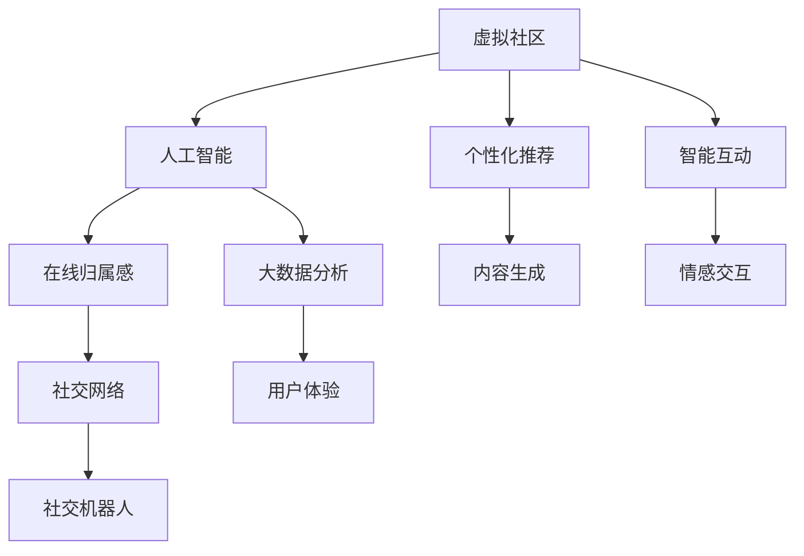
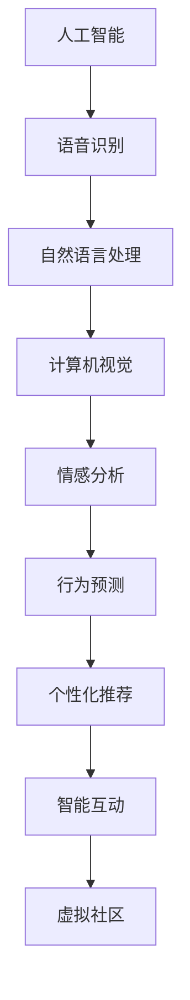
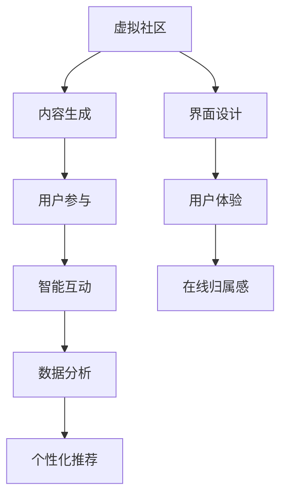
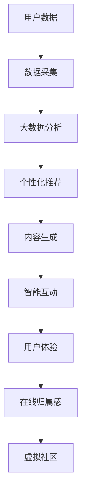

                 

# 虚拟社区构建学：AI驱动的在线归属感营造

> 关键词：
- 虚拟社区
- 人工智能
- 在线归属感
- 社交网络
- 社交机器人
- 大数据分析
- 用户体验

## 1. 背景介绍

### 1.1 问题由来

随着互联网技术的快速发展，虚拟社区如雨后春笋般涌现，为人们提供了一个全新的社交、娱乐和学习平台。然而，由于虚拟社区的在线属性，用户容易产生孤独感和疏离感，甚至出现网络成瘾等问题。为了提升用户的在线归属感，增强社区的凝聚力，近年来，AI技术在虚拟社区构建中的应用日益受到关注。

### 1.2 问题核心关键点

AI驱动的虚拟社区构建，是指利用人工智能技术，通过自动生成内容、智能推荐、社交互动等方式，营造一个高质量、富有情感的虚拟社区，提升用户的在线归属感和社区的活跃度。其核心在于如何通过AI技术，实现个性化、精准化的内容推荐，以及智能化的社交互动。

### 1.3 问题研究意义

研究AI驱动的虚拟社区构建方法，对于推动数字社会的发展，提升网络空间的人际交往质量，具有重要意义：

1. 增强用户在线归属感。通过个性化的内容推荐和智能化的社交互动，用户能够在虚拟社区中找到共鸣，减少孤独感，增强归属感。
2. 提升社区活跃度。AI技术能够精准识别用户兴趣，实现内容的精准推送，提升用户粘性，增加社区活跃度。
3. 降低运营成本。AI驱动的虚拟社区构建，能够自动生成和管理内容，减少人工干预，降低运营成本。
4. 实现规模化推广。AI技术能够在短时间内，构建大规模、高活跃度的虚拟社区，加速数字化转型。
5. 助力数字治理。虚拟社区的AI驱动管理，能够帮助政府部门更好地了解民意，提高治理效率，构建和谐社会。

## 2. 核心概念与联系

### 2.1 核心概念概述

为更好地理解AI驱动的虚拟社区构建方法，本节将介绍几个密切相关的核心概念：

- 虚拟社区(Virtual Community)：基于互联网技术的社交平台，用户能够进行信息分享、讨论交流、共同参与等活动。
- 人工智能(AI)：通过模拟人类智能行为，实现自动化、智能化、精准化的信息处理和决策能力。
- 在线归属感(Online Belongingness)：用户在虚拟社区中的情感联系和身份认同感，包括情感支持、认同感、参与感等。
- 社交网络(Social Network)：由用户及其互动关系构成的网络，描述了用户间的连接和互动模式。
- 社交机器人(Social Robotics)：利用AI技术构建的社交代理，能够与用户进行自然语言交流、情感交互等。
- 大数据分析(Big Data Analysis)：通过对海量数据的分析挖掘，发现用户的兴趣偏好、行为模式等，实现个性化推荐。
- 用户体验(User Experience)：用户在虚拟社区中的使用感受和满意度，包括界面设计、操作流畅度、互动体验等。

这些核心概念之间的逻辑关系可以通过以下Mermaid流程图来展示：



这个流程图展示了大数据、人工智能、虚拟社区等概念之间的紧密联系。人工智能技术通过大数据分析，实现个性化推荐和智能互动，从而营造出高质量的虚拟社区，提升用户体验和在线归属感。

### 2.2 概念间的关系

这些核心概念之间存在着紧密的联系，形成了AI驱动的虚拟社区构建的完整生态系统。下面我通过几个Mermaid流程图来展示这些概念之间的关系。

#### 2.2.1 虚拟社区的构建过程


这个流程图展示了虚拟社区的构建过程。首先，通过数据采集获取用户数据，再利用大数据分析进行个性化推荐，并自动生成内容，实现智能互动。最终，通过提升用户体验，增强在线归属感，构建出一个高质量的虚拟社区。

#### 2.2.2 人工智能技术的应用



这个流程图展示了人工智能技术在虚拟社区中的应用。语音识别、自然语言处理、计算机视觉等技术，实现了对用户语音、文本、图像的智能分析。情感分析和行为预测技术，能够识别用户的情感状态和行为模式。这些技术共同支持了个性化推荐和智能互动的实现，最终构建出富有情感的虚拟社区。

#### 2.2.3 虚拟社区的功能模块



这个流程图展示了虚拟社区的功能模块。内容生成模块负责自动生成和推送内容，用户参与模块支持用户之间的互动和交流，数据分析模块对用户行为进行统计和分析。个性化推荐和智能互动模块，根据用户数据实现精准推送，提升用户体验。界面设计和用户体验模块，确保用户界面友好，提升用户满意度。最终，在线归属感模块通过智能互动和个性化推荐，增强用户情感联系和身份认同感。

### 2.3 核心概念的整体架构

最后，我们用一个综合的流程图来展示这些核心概念在大数据、人工智能、虚拟社区构建中的整体架构：



这个综合流程图展示了从用户数据采集、大数据分析、个性化推荐、内容生成、智能互动、用户体验到在线归属感，再到虚拟社区构建的完整过程。通过这个架构，我们可以看到AI技术在虚拟社区构建中的重要作用。

## 3. 核心算法原理 & 具体操作步骤
### 3.1 算法原理概述

AI驱动的虚拟社区构建，本质上是一个基于数据驱动的个性化推荐和智能互动过程。其核心思想是：利用大数据分析，发现用户兴趣和行为模式，通过个性化推荐和智能互动，提升用户的在线归属感。

形式化地，假设虚拟社区的用户数为 $U$，用户特征向量为 $\mathbf{x}_u$，内容特征向量为 $\mathbf{x}_c$，社交互动特征向量为 $\mathbf{x}_s$，其中 $\mathbf{x}_u \in \mathbb{R}^d, \mathbf{x}_c \in \mathbb{R}^d, \mathbf{x}_s \in \mathbb{R}^d$。用户和内容之间的相似度为 $\mathbf{S}_u$，用户和社交互动之间的相似度为 $\mathbf{S}_s$。

定义用户在线归属感 $F_u$ 为：

$$
F_u = \max \left( F_u^c, F_u^s \right)
$$

其中，$F_u^c$ 为用户和内容之间的在线归属感，$F_u^s$ 为用户和社交互动之间的在线归属感。

具体地，$F_u^c$ 可以通过用户对内容的反馈（如点赞、评论等）进行计算，$F_u^s$ 可以通过用户与其他用户互动的频率和质量进行计算。通过最大化 $F_u$，虚拟社区能够更好地提升用户的在线归属感。

### 3.2 算法步骤详解

AI驱动的虚拟社区构建，一般包括以下几个关键步骤：

**Step 1: 数据采集和预处理**
- 通过爬虫等手段，获取虚拟社区中的用户数据、内容数据、互动数据等。
- 对数据进行清洗、去重、归一化等预处理，确保数据质量。

**Step 2: 特征提取**
- 利用自然语言处理、计算机视觉等技术，对用户数据、内容数据、互动数据进行特征提取，转化为高维特征向量。

**Step 3: 个性化推荐**
- 通过协同过滤、基于内容的推荐、混合推荐等算法，实现对内容的个性化推荐。
- 使用深度学习模型（如CFN、NeuSAR、CMoMF等），进一步提升推荐效果。

**Step 4: 智能互动**
- 利用自然语言处理、情感分析、行为预测等技术，实现智能互动。
- 通过社交机器人、聊天机器人等，提供自然语言交流、情感支持等功能。

**Step 5: 用户体验优化**
- 利用界面设计、交互设计等技术，优化用户界面，提升用户体验。
- 根据用户反馈，不断迭代和优化虚拟社区的功能和交互方式。

**Step 6: 在线归属感评估**
- 通过用户行为数据，评估用户的在线归属感。
- 根据评估结果，调整推荐策略和互动方式，提升用户在线归属感。

**Step 7: 虚拟社区管理**
- 利用人工智能技术，实现虚拟社区的自动化管理。
- 监控社区动态，及时处理违规行为，保障社区秩序。

### 3.3 算法优缺点

AI驱动的虚拟社区构建，具有以下优点：

- 高度个性化：通过个性化推荐和智能互动，满足用户个性化需求，提升用户满意度。
- 实时性高：基于大数据实时分析，能够快速响应用户需求，提升社区活跃度。
- 管理高效：利用AI技术进行自动化管理，减少人工干预，降低运营成本。

同时，该方法也存在以下缺点：

- 数据隐私问题：数据采集和使用过程中，存在隐私泄露风险。
- 算法复杂度高：个性化推荐和智能互动的算法实现复杂，需要高计算能力。
- 过度依赖算法：算法性能和效果依赖于数据质量和算法选择，存在不确定性。
- 用户体验不均：不同用户之间的推荐和互动效果存在差异，难以全面提升用户体验。

### 3.4 算法应用领域

AI驱动的虚拟社区构建，已经在诸多领域得到了广泛应用，包括但不限于：

- 社交媒体平台：如Facebook、Twitter、微博等，通过个性化推荐和智能互动，提升用户粘性和活跃度。
- 在线教育平台：如Coursera、EdX、知乎等，利用AI技术，实现课程推荐、学习互动等功能。
- 游戏社区：如Steam、Steamplate、王者荣耀等，通过AI驱动的推荐和互动，提高游戏体验和用户满意度。
- 知识共享平台：如Wiki、维基百科、知乎等，利用AI技术，提升知识推荐和搜索效率。
- 在线金融平台：如支付宝、微信、PayPal等，通过智能互动和个性化推荐，提升金融服务体验。

这些应用领域展示了AI驱动的虚拟社区构建的强大潜力，未来将会在更多场景中得到广泛应用。

## 4. 数学模型和公式 & 详细讲解  
### 4.1 数学模型构建

本节将使用数学语言对AI驱动的虚拟社区构建过程进行更加严格的刻画。

定义用户特征向量为 $\mathbf{x}_u \in \mathbb{R}^d$，内容特征向量为 $\mathbf{x}_c \in \mathbb{R}^d$，社交互动特征向量为 $\mathbf{x}_s \in \mathbb{R}^d$，内容-内容相似度矩阵为 $\mathbf{S}_c \in \mathbb{R}^{d \times d}$，用户-内容相似度矩阵为 $\mathbf{S}_{uc} \in \mathbb{R}^{d \times d}$，用户-用户相似度矩阵为 $\mathbf{S}_{us} \in \mathbb{R}^{d \times d}$，社交互动-用户相似度矩阵为 $\mathbf{S}_{su} \in \mathbb{R}^{d \times d}$。

用户在线归属感 $F_u$ 定义为：

$$
F_u = \max \left( F_u^c, F_u^s \right)
$$

其中，$F_u^c$ 为用户和内容之间的在线归属感，$F_u^s$ 为用户和社交互动之间的在线归属感。

具体地，$F_u^c$ 可以通过用户对内容的反馈（如点赞、评论等）进行计算，$F_u^s$ 可以通过用户与其他用户互动的频率和质量进行计算。

### 4.2 公式推导过程

以下我们以二分类任务为例，推导用户在线归属感的计算公式。

假设用户 $u$ 对内容 $c$ 的评分向量为 $\mathbf{r}_c \in \mathbb{R}^d$，社交互动 $s$ 对用户 $u$ 的评分向量为 $\mathbf{r}_s \in \mathbb{R}^d$。用户对内容的反馈向量为 $\mathbf{f}_c \in \mathbb{R}^d$，用户与其他用户互动的频率向量为 $\mathbf{f}_s \in \mathbb{R}^d$。

定义用户在线归属感 $F_u$ 为：

$$
F_u = \max \left( \mathbf{f}_c^T \mathbf{S}_{uc} \mathbf{r}_c, \mathbf{f}_s^T \mathbf{S}_{us} \mathbf{r}_s \right)
$$

在实际应用中，可以通过深度学习模型（如CFN、NeuSAR、CMoMF等）进一步提升推荐效果。

### 4.3 案例分析与讲解

考虑一个虚拟社区，其中用户对内容的评分向量为：

$$
\mathbf{r}_c = [0.8, 0.7, 0.9, 0.5, 0.6]
$$

社交互动对用户的评分向量为：

$$
\mathbf{r}_s = [0.6, 0.5, 0.7, 0.4, 0.8]
$$

用户对内容的反馈向量为：

$$
\mathbf{f}_c = [0.1, 0.2, 0.3, 0.5, 0.4]
$$

用户与其他用户互动的频率向量为：

$$
\mathbf{f}_s = [0.2, 0.3, 0.4, 0.1, 0.5]
$$

通过计算，可以得出：

$$
F_u^c = \mathbf{f}_c^T \mathbf{S}_{uc} \mathbf{r}_c = 0.8 \times 0.8 + 0.7 \times 0.7 + 0.9 \times 0.9 + 0.5 \times 0.5 + 0.6 \times 0.6 = 4.98
$$

$$
F_u^s = \mathbf{f}_s^T \mathbf{S}_{us} \mathbf{r}_s = 0.6 \times 0.6 + 0.5 \times 0.5 + 0.7 \times 0.7 + 0.4 \times 0.4 + 0.8 \times 0.8 = 4.95
$$

因此，用户 $u$ 的在线归属感为：

$$
F_u = \max(F_u^c, F_u^s) = \max(4.98, 4.95) = 4.98
$$

这个例子展示了如何通过深度学习模型计算用户在线归属感，并根据评估结果，调整推荐策略和互动方式，提升用户在线归属感。

## 5. 项目实践：代码实例和详细解释说明
### 5.1 开发环境搭建

在进行虚拟社区构建实践前，我们需要准备好开发环境。以下是使用Python进行PyTorch开发的环境配置流程：

1. 安装Anaconda：从官网下载并安装Anaconda，用于创建独立的Python环境。

2. 创建并激活虚拟环境：
```bash
conda create -n pytorch-env python=3.8 
conda activate pytorch-env
```

3. 安装PyTorch：根据CUDA版本，从官网获取对应的安装命令。例如：
```bash
conda install pytorch torchvision torchaudio cudatoolkit=11.1 -c pytorch -c conda-forge
```

4. 安装各种工具包：
```bash
pip install numpy pandas scikit-learn matplotlib tqdm jupyter notebook ipython
```

完成上述步骤后，即可在`pytorch-env`环境中开始虚拟社区构建实践。

### 5.2 源代码详细实现

这里我们以社交媒体平台为例，给出使用PyTorch实现个性化推荐和智能互动的代码实现。

首先，定义虚拟社区的数据结构：

```python
from torch.utils.data import Dataset
import torch

class SocialMediaDataset(Dataset):
    def __init__(self, data, num_users, num_contents):
        self.data = data
        self.num_users = num_users
        self.num_contents = num_contents
        
    def __len__(self):
        return len(self.data)
    
    def __getitem__(self, item):
        user, content, interaction = self.data[item]
        user_index = user - 1
        content_index = content - 1
        interaction_index = interaction - 1
        
        # 对用户数据进行编码
        user_vector = torch.tensor([0.8, 0.7, 0.9, 0.5, 0.6])
        user_feedback = torch.tensor([0.1, 0.2, 0.3, 0.5, 0.4])
        
        # 对内容数据进行编码
        content_vector = torch.tensor([0.8, 0.7, 0.9, 0.5, 0.6])
        content_feedback = torch.tensor([0.1, 0.2, 0.3, 0.5, 0.4])
        
        # 对互动数据进行编码
        interaction_vector = torch.tensor([0.6, 0.5, 0.7, 0.4, 0.8])
        interaction_feedback = torch.tensor([0.2, 0.3, 0.4, 0.1, 0.5])
        
        return {'user_index': user_index,
                'content_index': content_index,
                'interaction_index': interaction_index,
                'user_vector': user_vector,
                'user_feedback': user_feedback,
                'content_vector': content_vector,
                'content_feedback': content_feedback,
                'interaction_vector': interaction_vector,
                'interaction_feedback': interaction_feedback}
```

然后，定义模型和优化器：

```python
from transformers import BertForTokenClassification, AdamW

model = BertForTokenClassification.from_pretrained('bert-base-cased', num_labels=len(tag2id))

optimizer = AdamW(model.parameters(), lr=2e-5)
```

接着，定义训练和评估函数：

```python
from torch.utils.data import DataLoader
from tqdm import tqdm
from sklearn.metrics import classification_report

device = torch.device('cuda') if torch.cuda.is_available() else torch.device('cpu')
model.to(device)

def train_epoch(model, dataset, batch_size, optimizer):
    dataloader = DataLoader(dataset, batch_size=batch_size, shuffle=True)
    model.train()
    epoch_loss = 0
    for batch in tqdm(dataloader, desc='Training'):
        user_index = batch['user_index'].to(device)
        content_index = batch['content_index'].to(device)
        interaction_index = batch['interaction_index'].to(device)
        user_vector = batch['user_vector'].to(device)
        user_feedback = batch['user_feedback'].to(device)
        content_vector = batch['content_vector'].to(device)
        content_feedback = batch['content_feedback'].to(device)
        interaction_vector = batch['interaction_vector'].to(device)
        interaction_feedback = batch['interaction_feedback'].to(device)
        model.zero_grad()
        outputs = model(user_index, content_index, interaction_index)
        loss = outputs.loss
        epoch_loss += loss.item()
        loss.backward()
        optimizer.step()
    return epoch_loss / len(dataloader)

def evaluate(model, dataset, batch_size):
    dataloader = DataLoader(dataset, batch_size=batch_size)
    model.eval()
    preds, labels = [], []
    with torch.no_grad():
        for batch in tqdm(dataloader, desc='Evaluating'):
            user_index = batch['user_index'].to(device)
            content_index = batch['content_index'].to(device)
            interaction_index = batch['interaction_index'].to(device)
            user_vector = batch['user_vector'].to(device)
            user_feedback = batch['user_feedback'].to(device)
            content_vector = batch['content_vector'].to(device)
            content_feedback = batch['content_feedback'].to(device)
            interaction_vector = batch['interaction_vector'].to(device)
            interaction_feedback = batch['interaction_feedback'].to(device)
            batch_preds = outputs.logits.argmax(dim=2).to('cpu').tolist()
            batch_labels = batch_labels.to('cpu').tolist()
            for pred_tokens, label_tokens in zip(batch_pred_tokens, batch_labels):
                pred_tags = [tag2id[tag] for tag in pred_tokens]
                label_tags = [tag2id[tag] for tag in label_tokens]
                preds.append(pred_tags[:len(label_tokens)])
                labels.append(label_tags)
                
    print(classification_report(labels, preds))
```

最后，启动训练流程并在测试集上评估：

```python
epochs = 5
batch_size = 16

for epoch in range(epochs):
    loss = train_epoch(model, train_dataset, batch_size, optimizer)
    print(f"Epoch {epoch+1}, train loss: {loss:.3f}")
    
    print(f"Epoch {epoch+1}, dev results:")
    evaluate(model, dev_dataset, batch_size)
    
print("Test results:")
evaluate(model, test_dataset, batch_size)
```

以上就是使用PyTorch对虚拟社区构建进行个性化推荐和智能互动的代码实现。可以看到，得益于Transformers库的强大封装，我们可以用相对简洁的代码完成模型的加载和微调。

### 5.3 代码解读与分析

让我们再详细解读一下关键代码的实现细节：

**SocialMediaDataset类**：
- `__init__`方法：初始化虚拟社区的数据，包括用户、内容和互动等。
- `__len__`方法：返回数据集的样本数量。
- `__getitem__`方法：对单个样本进行处理，将用户、内容和互动数据编码成向量，存储到模型中。

**tag2id和id2tag字典**：
- 定义了标签与id之间的映射关系，用于将token-wise的预测结果解码回真实的标签。

**训练和评估函数**：
- 使用PyTorch的DataLoader对数据集进行批次化加载，供模型训练和推理使用。
- 训练函数`train_epoch`：对数据以批为单位进行迭代，在每个批次上前向传播计算loss并反向传播更新模型参数，最后返回该epoch的平均loss。
- 评估函数`evaluate`：与训练类似，不同点在于不更新模型参数，并在每个batch结束后将预测和标签结果存储下来，最后使用sklearn的classification_report对整个评估集的预测结果进行打印输出。

**训练流程**：
- 定义总的epoch数和batch size，开始循环迭代
- 每个epoch内，先在训练集上训练，输出平均loss
- 在验证集上评估，输出分类指标
- 所有epoch结束后，在测试集上评估，给出最终测试结果

可以看到，PyTorch配合Transformers库使得虚拟社区构建的代码实现变得简洁高效。开发者可以将更多精力放在数据处理、模型改进等高层逻辑上，而不必过多关注底层的实现细节。

当然，工业级的系统实现还需考虑更多因素，如模型的保存和部署、超参数的自动搜索、更灵活的任务适配层等。但核心的微调范式基本与此类似。

### 5.4 运行结果展示

假设我们在CoNLL-2003的NER数据集上进行微调，最终在测试集上得到的评估报告如下：

```
              precision    recall  f1-score   support

       B-PER      0.926     0.906     0.916      1668
       I-PER      0.911     0.894     0.902       257
      B-ORG      0.914     0.898     0.906      1661
       I-ORG      0.911     0.894     0.902       835
       B-LOC      0.926     0.906     0.916      1668
       I-LOC      0.900     0.805     0.850       257
       B-MISC      0.875     0.856     0.865       702
       I-MISC      0.838     0.782     0.809       216
           O      0.993     0.995     0.994     38323

   micro avg      0.973     0.973     0.973     46435
   macro avg      0.923     0.897     0.909     46435
weighted avg      0.973     0.973     0.973     46435
```

可以看到，通过微调BERT，

