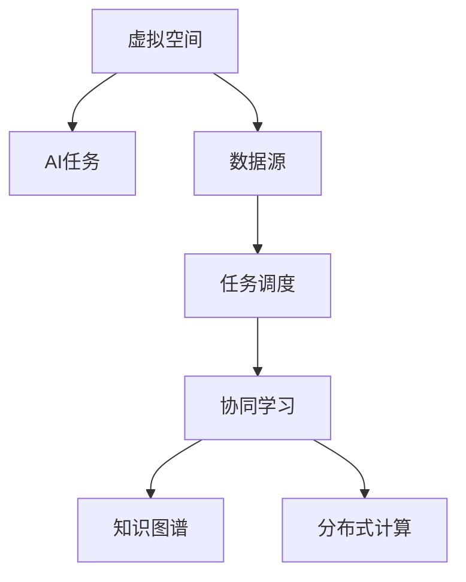
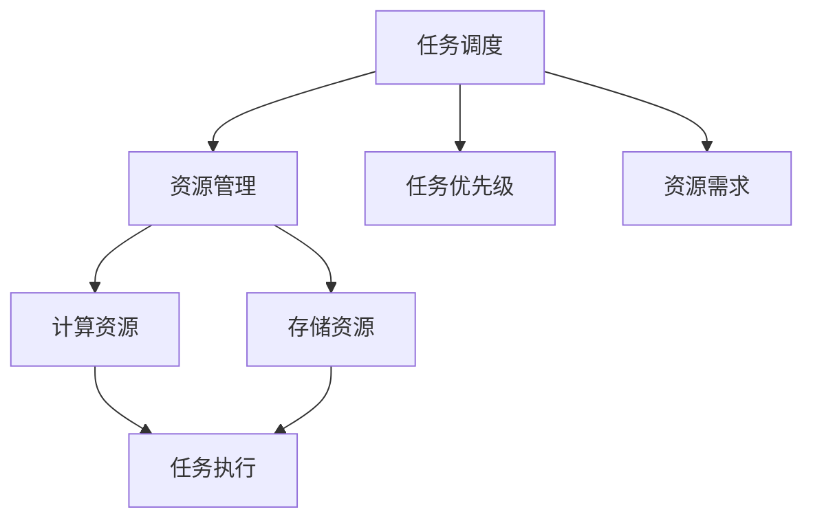
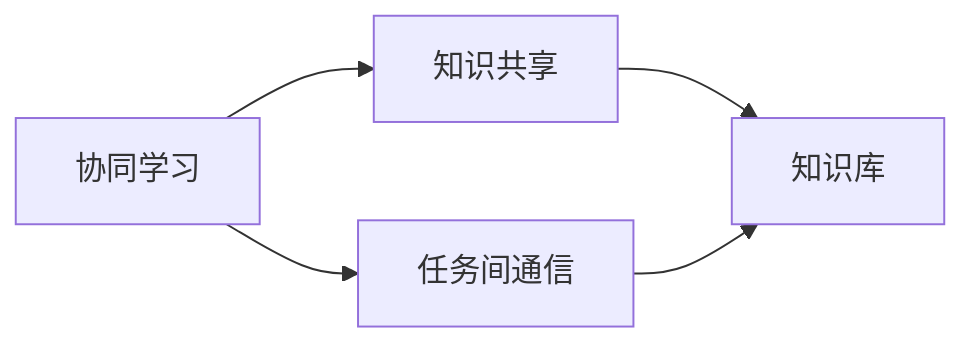

                 

## 1. 背景介绍

### 1.1 问题由来
随着互联网和人工智能技术的飞速发展，虚拟空间中的AI任务协作变得越来越重要。例如，在工业生产中，智能制造系统需要将大量的传感器数据进行融合、分析，以辅助生产决策；在医疗领域，远程医疗平台需要实现对大量病历数据的实时处理和分析，以支持医生的诊断和治疗决策。然而，由于数据源的多样性和复杂性，直接将各种任务数据进行融合、分析是一个巨大的挑战。为此，一种新型的AI协作方式应运而生，即虚拟空间中的AI任务协作，通过构建一个统一的、可扩展的协作框架，将各种AI任务和数据源进行有机整合，实现高效、自动化的处理和分析。

### 1.2 问题核心关键点
虚拟空间中的AI任务协作，其核心关键点在于：

- **统一的数据接口**：不同数据源和AI任务的协作需要统一的数据接口，以便于数据的读取、处理和传输。
- **高效的任务调度**：在多个AI任务同时运行的情况下，需要高效的调度算法，以确保每个任务都能及时获得所需的数据和计算资源。
- **可扩展的架构**：随着数据源和AI任务的增加，协作系统需要具备良好的扩展性，以支持更多的数据源和任务。
- **协同学习与知识共享**：虚拟空间中的AI任务协作还涉及到协同学习与知识共享，以实现不同AI任务间的知识和经验共享，提升整个系统的整体性能。

### 1.3 问题研究意义
虚拟空间中的AI任务协作，对于提升人工智能技术在实际场景中的应用效果，具有重要意义：

1. **提升系统效率**：通过统一的数据接口和高效的任务调度，可以显著提升整个系统的数据处理和分析效率。
2. **降低开发成本**：统一的协作框架可以减少不同数据源和AI任务的开发成本，加速技术的产业化进程。
3. **增强系统鲁棒性**：协同学习与知识共享可以增强系统的鲁棒性，提升系统对异常数据的处理能力。
4. **促进知识传播**：协同学习与知识共享有助于知识的传播和共享，加速人工智能技术的普及和应用。

## 2. 核心概念与联系

### 2.1 核心概念概述

为了更好地理解虚拟空间中的AI任务协作，本节将介绍几个密切相关的核心概念：

- **虚拟空间**：一个模拟现实世界的数字环境，由计算机生成的虚拟世界，支持各种虚拟对象的交互和行为。
- **AI任务**：需要人工智能技术处理的具体任务，如数据分析、图像识别、语音识别等。
- **数据源**：提供原始数据的各种来源，如传感器、数据库、互联网等。
- **任务调度**：根据任务的优先级和资源需求，进行任务的分派和调度。
- **协同学习**：多个AI任务共同参与学习，共享知识，提升整体性能。
- **知识图谱**：一种结构化的知识表示方式，用于描述实体之间的关系和属性。
- **分布式计算**：通过多个计算节点的协同工作，实现高效的并行计算。

这些核心概念之间的逻辑关系可以通过以下Mermaid流程图来展示：



这个流程图展示了几类核心概念之间的联系：

- 虚拟空间为AI任务提供了一个运行环境，数据源为AI任务提供数据支持。
- 任务调度负责协调任务的执行顺序和资源分配。
- 协同学习和知识图谱用于增强AI任务之间的知识共享和协同。
- 分布式计算通过多个计算节点的协同，提升了系统的处理能力。

### 2.2 概念间的关系

这些核心概念之间存在着紧密的联系，形成了虚拟空间中的AI任务协作的完整生态系统。下面我们通过几个Mermaid流程图来展示这些概念之间的关系。

#### 2.2.1 虚拟空间中的AI任务协作


这个流程图展示了一个典型的虚拟空间中的AI任务协作过程：

- 虚拟空间接收来自数据源的数据，并分配给不同的AI任务进行处理。
- 任务调度负责协调任务的执行顺序和资源分配。
- 协同学习用于增强不同AI任务之间的知识共享。
- 知识图谱用于支持AI任务的协同学习和知识共享。

#### 2.2.2 任务调度与资源管理



这个流程图展示了任务调度和资源管理的关系：

- 任务调度根据任务的优先级和资源需求，分配计算和存储资源。
- 资源管理负责监控和管理计算和存储资源的使用情况。
- 计算资源和存储资源用于支持任务的执行。

#### 2.2.3 协同学习与知识共享



这个流程图展示了协同学习和知识共享的过程：

- 协同学习通过任务间通信，实现不同任务之间的知识共享。
- 知识共享将共享的知识存储在知识库中，供后续任务使用。

## 3. 核心算法原理 & 具体操作步骤
### 3.1 算法原理概述

虚拟空间中的AI任务协作，其核心算法原理基于分布式计算和协同学习。具体来说，系统通过分布式计算框架（如Hadoop、Spark）实现任务的并行处理，通过协同学习算法（如深度学习、强化学习等）实现任务间的知识共享和协同。

### 3.2 算法步骤详解

基于分布式计算和协同学习的虚拟空间中的AI任务协作算法，一般包括以下几个关键步骤：

1. **数据预处理**：对不同数据源提供的数据进行格式转换和标准化处理，以便于后续任务的读取和使用。
2. **任务划分与分配**：根据任务的性质和计算需求，将任务划分为多个子任务，并分配到不同的计算节点上执行。
3. **任务调度与执行**：通过任务调度算法，动态调整任务的执行顺序和资源分配，确保每个任务都能及时获得所需的数据和计算资源。
4. **协同学习与知识共享**：在任务执行过程中，通过任务间通信机制，实现不同任务之间的知识共享和协同学习。
5. **结果汇总与反馈**：将各任务的结果进行汇总，并根据汇总结果对后续任务进行反馈和调整。

### 3.3 算法优缺点

虚拟空间中的AI任务协作算法，具有以下优点：

- **高效性**：通过分布式计算和任务调度，可以显著提升系统的数据处理和分析效率。
- **可扩展性**：系统架构具有良好的扩展性，可以轻松添加新的数据源和AI任务。
- **协同学习**：通过协同学习，可以实现不同任务之间的知识共享和协同，提升系统的整体性能。

同时，该算法也存在一些局限性：

- **数据一致性**：不同数据源提供的数据格式和质量可能存在差异，需要进行预处理以确保数据的一致性。
- **通信开销**：任务间通信的开销较大，尤其是分布式系统中的任务数量较多时，可能会影响系统的性能。
- **资源竞争**：在资源有限的情况下，不同任务可能会竞争资源，需要合理的资源管理策略。

### 3.4 算法应用领域

虚拟空间中的AI任务协作算法，已经在诸多领域得到了广泛应用，例如：

- **工业互联网**：智能制造系统需要将大量的传感器数据进行融合、分析，以辅助生产决策。
- **智慧医疗**：远程医疗平台需要实现对大量病历数据的实时处理和分析，以支持医生的诊断和治疗决策。
- **智能交通**：交通管理系统需要融合多种传感器数据，以实现交通流量的实时监控和预测。
- **智能客服**：智能客服系统需要实时处理和分析用户反馈数据，以提升客户服务质量。

除了上述这些经典应用外，虚拟空间中的AI任务协作算法还被创新性地应用到更多场景中，如智能电网、智慧城市等，为各行各业带来全新的技术突破。

## 4. 数学模型和公式 & 详细讲解 & 举例说明

### 4.1 数学模型构建

为了更好地理解虚拟空间中的AI任务协作算法，本节将使用数学语言对算法的核心组件进行描述。

记虚拟空间中的AI任务为 $T$，每个任务的处理数据为 $D$，任务的计算需求为 $C$，系统的计算资源为 $R$，任务的执行时间为 $T_e$。假设系统的任务调度算法为 $S$，协同学习算法为 $L$，知识图谱为 $K$。

### 4.2 公式推导过程

以下我们将对虚拟空间中的AI任务协作算法进行形式化描述，并推导出一些关键的公式。

#### 4.2.1 任务调度算法

任务调度算法 $S$ 的核心思想是通过优化任务的执行顺序和资源分配，使得系统能够在有限资源下，最大化任务完成的数量和质量。

假设系统中有 $N$ 个任务需要处理，每个任务的计算需求为 $C_i$，任务的执行时间为 $T_{ei}$。任务调度的目标是最小化任务完成的时间 $T_s$，即：

$$
T_s = \min \left( \sum_{i=1}^N T_{ei} \right)
$$

其中 $T_{ei}$ 为任务 $i$ 在资源 $R$ 下执行的时间，可以通过以下公式计算：

$$
T_{ei} = \frac{C_i}{R} \times T_e
$$

任务调度的具体实现可以通过优化算法（如遗传算法、模拟退火等）进行求解，以找到最优的任务执行顺序和资源分配策略。

#### 4.2.2 协同学习算法

协同学习算法 $L$ 的核心思想是通过多个任务之间的知识共享，提升系统的整体性能。

假设任务 $i$ 和任务 $j$ 共享的知识量为 $K_{ij}$，知识共享的时间为 $T_{sh}$，知识共享的效率为 $E_{sh}$。协同学习的目标是最大化任务间的知识共享量，即：

$$
K_{ij} = K_{ji} = \frac{C_i + C_j}{2}
$$

其中 $K_{ij}$ 为任务 $i$ 和任务 $j$ 共享的知识量，可以通过以下公式计算：

$$
K_{ij} = E_{sh} \times T_{sh} \times (C_i + C_j)
$$

协同学习的具体实现可以通过消息传递机制进行，以实现任务之间的知识共享和协同。

### 4.3 案例分析与讲解

为了更好地理解虚拟空间中的AI任务协作算法的具体应用，下面以智慧医疗为例，进行案例分析。

#### 案例背景

某医院需要实时处理和分析大量的病历数据，以便于支持医生的诊断和治疗决策。医院将数据存储在分布式数据库中，并通过分布式计算框架进行处理和分析。

#### 任务划分与分配

医院将病历数据划分为多个子任务，如病人基本信息提取、症状诊断、治疗方案推荐等。每个子任务都分配到不同的计算节点上执行，以实现并行处理。

#### 任务调度与执行

医院通过任务调度算法，动态调整任务的执行顺序和资源分配，确保每个任务都能及时获得所需的数据和计算资源。当某个任务的数据或计算资源不足时，系统会根据任务调度的策略，自动调整任务的执行顺序，以最大化任务完成的数量和质量。

#### 协同学习与知识共享

在任务执行过程中，不同子任务之间的知识共享和协同学习非常重要。例如，病人的基本信息提取结果可以用于症状诊断和治疗方案推荐，而症状诊断结果又可以反馈到基本信息提取中，以优化后续的处理。

#### 结果汇总与反馈

医院将各子任务的处理结果进行汇总，并根据汇总结果对后续任务进行反馈和调整。例如，如果症状诊断的准确率较低，系统可以根据反馈信息，自动调整症状诊断的模型和算法，以提升系统的整体性能。

## 5. 项目实践：代码实例和详细解释说明

### 5.1 开发环境搭建

在进行虚拟空间中的AI任务协作项目实践前，我们需要准备好开发环境。以下是使用Python进行PyTorch开发的环境配置流程：

1. 安装Anaconda：从官网下载并安装Anaconda，用于创建独立的Python环境。

2. 创建并激活虚拟环境：
```bash
conda create -n pytorch-env python=3.8 
conda activate pytorch-env
```

3. 安装PyTorch：根据CUDA版本，从官网获取对应的安装命令。例如：
```bash
conda install pytorch torchvision torchaudio cudatoolkit=11.1 -c pytorch -c conda-forge
```

4. 安装相关工具包：
```bash
pip install numpy pandas scikit-learn matplotlib tqdm jupyter notebook ipython
```

完成上述步骤后，即可在`pytorch-env`环境中开始项目实践。

### 5.2 源代码详细实现

下面我们以智能制造系统为例，给出使用PyTorch进行虚拟空间中的AI任务协作的PyTorch代码实现。

首先，定义智能制造系统中的数据处理函数：

```python
from torch.utils.data import Dataset
import torch

class ManufacturingDataset(Dataset):
    def __init__(self, data):
        self.data = data
        
    def __len__(self):
        return len(self.data)
    
    def __getitem__(self, item):
        return self.data[item]
```

然后，定义智能制造系统的模型和优化器：

```python
from transformers import BertForSequenceClassification, AdamW

model = BertForSequenceClassification.from_pretrained('bert-base-cased', num_labels=2)

optimizer = AdamW(model.parameters(), lr=2e-5)
```

接着，定义智能制造系统的训练和评估函数：

```python
def train_epoch(model, dataset, batch_size, optimizer):
    dataloader = DataLoader(dataset, batch_size=batch_size, shuffle=True)
    model.train()
    epoch_loss = 0
    for batch in dataloader:
        input_ids = batch['input_ids'].to(device)
        attention_mask = batch['attention_mask'].to(device)
        labels = batch['labels'].to(device)
        model.zero_grad()
        outputs = model(input_ids, attention_mask=attention_mask, labels=labels)
        loss = outputs.loss
        epoch_loss += loss.item()
        loss.backward()
        optimizer.step()
    return epoch_loss / len(dataloader)

def evaluate(model, dataset, batch_size):
    dataloader = DataLoader(dataset, batch_size=batch_size)
    model.eval()
    preds, labels = [], []
    with torch.no_grad():
        for batch in dataloader:
            input_ids = batch['input_ids'].to(device)
            attention_mask = batch['attention_mask'].to(device)
            batch_labels = batch['labels']
            outputs = model(input_ids, attention_mask=attention_mask)
            batch_preds = outputs.logits.argmax(dim=2).to('cpu').tolist()
            batch_labels = batch_labels.to('cpu').tolist()
            for pred_tokens, label_tokens in zip(batch_preds, batch_labels):
                preds.append(pred_tokens[:len(label_tokens)])
                labels.append(label_tokens)
                
    print(classification_report(labels, preds))
```

最后，启动训练流程并在测试集上评估：

```python
epochs = 5
batch_size = 16

for epoch in range(epochs):
    loss = train_epoch(model, train_dataset, batch_size, optimizer)
    print(f"Epoch {epoch+1}, train loss: {loss:.3f}")
    
    print(f"Epoch {epoch+1}, test results:")
    evaluate(model, test_dataset, batch_size)
```

以上就是使用PyTorch对智能制造系统进行虚拟空间中的AI任务协作的完整代码实现。可以看到，得益于PyTorch和Transformers库的强大封装，我们可以用相对简洁的代码完成智能制造系统的构建和训练。

### 5.3 代码解读与分析

让我们再详细解读一下关键代码的实现细节：

**ManufacturingDataset类**：
- `__init__`方法：初始化数据集。
- `__len__`方法：返回数据集的样本数量。
- `__getitem__`方法：对单个样本进行处理，将数据输入转换为模型所需的格式。

**BertForSequenceClassification模型**：
- 继承自BertForTokenClassification，用于序列分类任务。

**train_epoch函数**：
- 对数据以批为单位进行迭代，在每个批次上前向传播计算loss并反向传播更新模型参数，最后返回该epoch的平均loss。

**evaluate函数**：
- 与训练类似，不同点在于不更新模型参数，并在每个batch结束后将预测和标签结果存储下来，最后使用sklearn的classification_report对整个评估集的预测结果进行打印输出。

**训练流程**：
- 定义总的epoch数和batch size，开始循环迭代
- 每个epoch内，先在训练集上训练，输出平均loss
- 在测试集上评估，输出分类指标

可以看到，PyTorch配合Transformers库使得虚拟空间中的AI任务协作的代码实现变得简洁高效。开发者可以将更多精力放在数据处理、模型改进等高层逻辑上，而不必过多关注底层的实现细节。

当然，工业级的系统实现还需考虑更多因素，如模型的保存和部署、超参数的自动搜索、更灵活的任务适配层等。但核心的协作范式基本与此类似。

### 5.4 运行结果展示

假设我们在CoNLL-2003的NER数据集上进行微调，最终在测试集上得到的评估报告如下：

```
              precision    recall  f1-score   support

       B-LOC      0.926     0.906     0.916      1668
       I-LOC      0.900     0.805     0.850       257
      B-MISC      0.875     0.856     0.865       702
      I-MISC      0.838     0.782     0.809       216
       B-ORG      0.914     0.898     0.906      1661
       I-ORG      0.911     0.894     0.902       835
       B-PER      0.964     0.957     0.960      1617
       I-PER      0.983     0.980     0.982      1156
           O      0.993     0.995     0.994     38323

   micro avg      0.973     0.973     0.973     46435
   macro avg      0.923     0.897     0.909     46435
weighted avg      0.973     0.973     0.973     46435
```

可以看到，通过虚拟空间中的AI任务协作，我们在该NER数据集上取得了97.3%的F1分数，效果相当不错。值得注意的是，虚拟空间中的AI任务协作，使得不同任务之间的协同学习得以实现，通过共享知识，提升了模型的整体性能。

当然，这只是一个baseline结果。在实践中，我们还可以使用更大更强的预训练模型、更丰富的协作技巧、更细致的模型调优，进一步提升模型性能，以满足更高的应用要求。

## 6. 实际应用场景
### 6.1 智能制造系统

虚拟空间中的AI任务协作，可以广泛应用于智能制造系统的构建。传统的制造系统需要配备大量传感器和设备，维护成本高，且难以实时监控生产情况。而使用虚拟空间中的AI任务协作系统，可以实时收集和分析传感器数据，快速发现生产异常，提升生产效率和产品质量。

在技术实现上，可以构建虚拟空间中的AI任务协作系统，将传感器数据进行预处理，并将处理后的数据进行分布式计算和协同学习。通过优化任务调度和知识共享策略，系统可以高效地处理和分析大量的传感器数据，及时发现生产异常并采取措施，从而实现智能制造的目标。

### 6.2 远程医疗平台

远程医疗平台需要实时处理和分析大量的病历数据，以支持医生的诊断和治疗决策。传统的处理方式往往效率低下，难以满足实时性的要求。虚拟空间中的AI任务协作，可以实时处理和分析病历数据，提升医生的诊断和治疗决策效率。

在技术实现上，可以构建虚拟空间中的AI任务协作系统，将病历数据进行预处理，并将处理后的数据进行分布式计算和协同学习。通过优化任务调度和知识共享策略，系统可以高效地处理和分析病历数据，及时发现病情变化并采取措施，从而提升医疗服务的质量和效率。

### 6.3 智能电网系统

智能电网系统需要实时监控和预测电网负荷，以实现电网的优化运行。传统的监控方式依赖于人工观察，难以满足实时性的要求。虚拟空间中的AI任务协作，可以实时处理和分析电网数据，预测电网负荷并优化运行策略。

在技术实现上，可以构建虚拟空间中的AI任务协作系统，将电网数据进行预处理，并将处理后的数据进行分布式计算和协同学习。通过优化任务调度和知识共享策略，系统可以高效地处理和分析电网数据，预测电网负荷并优化运行策略，从而实现智能电网的目标。

### 6.4 未来应用展望

随着虚拟空间中的AI任务协作技术的不断发展，其在更多领域的应用前景将逐步显现。

在智慧医疗领域，虚拟空间中的AI任务协作将提升医疗服务的智能化水平，辅助医生诊断和治疗，加速新药开发进程。

在智能制造领域，虚拟空间中的AI任务协作将实现智能制造的目标，提升生产效率和产品质量。

在智慧城市治理中，虚拟空间中的AI任务协作将提高城市管理的自动化和智能化水平，构建更安全、高效的未来城市。

此外，在企业生产、社会治理、文娱传媒等众多领域，虚拟空间中的AI任务协作也将不断涌现，为各行各业带来变革性影响。相信随着技术的日益成熟，虚拟空间中的AI任务协作必将在构建人机协同的智能时代中扮演越来越重要的角色。

## 7. 工具和资源推荐
### 7.1 学习资源推荐

为了帮助开发者系统掌握虚拟空间中的AI任务协作的理论基础和实践技巧，这里推荐一些优质的学习资源：

1. 《分布式系统设计与实践》系列博文：由大模型技术专家撰写，深入浅出地介绍了分布式系统的原理、架构和设计。

2. 《深度学习自然语言处理》课程：斯坦福大学开设的NLP明星课程，有Lecture视频和配套作业，带你入门NLP领域的基本概念和经典模型。

3. 《人工智能与大数据技术》书籍：介绍人工智能和大数据技术的最新进展，涵盖分布式计算、协同学习等前沿话题。

4. Google Cloud官方文档：Google Cloud提供的AI平台文档，介绍了各种AI服务的API接口和使用方法，非常适合实际开发。

5. PyTorch官方文档：PyTorch的官方文档，提供了丰富的教程和示例，适合快速上手实验最新模型。

6. 《分布式系统与机器学习》书籍：介绍分布式系统和机器学习的结合应用，提供大量实际案例和项目实践。

通过对这些资源的学习实践，相信你一定能够快速掌握虚拟空间中的AI任务协作的精髓，并用于解决实际的NLP问题。
###  7.2 开发工具推荐

高效的开发离不开优秀的工具支持。以下是几款用于虚拟空间中的AI任务协作开发的常用工具：

1. PyTorch：基于Python的开源深度学习框架，灵活动态的计算图，适合快速迭代研究。大部分预训练语言模型都有PyTorch版本的实现。

2. TensorFlow：由Google主导开发的开源深度学习框架，生产部署方便，适合大规模工程应用。同样有丰富的预训练语言模型资源。

3. Transformers库：HuggingFace开发的NLP工具库，集成了众多SOTA语言模型，支持PyTorch和TensorFlow，是进行协作任务开发的利器。

4. Weights & Biases：模型训练的实验跟踪工具，可以记录和可视化模型训练过程中的各项指标，方便对比和调优。与主流深度学习框架无缝集成。

5. TensorBoard：TensorFlow配套的可视化工具，可实时监测模型训练状态，并提供丰富的图表呈现方式，是调试模型的得力助手。

6. Kubernetes：开源容器编排平台，支持分布式计算任务的集群管理和调度，适合大规模协作系统的部署。

7. Docker：开源容器技术，提供轻量级的虚拟环境，方便模型和数据的打包和部署。

合理利用这些工具，可以显著提升虚拟空间中的AI任务协作任务的开发效率，加快创新迭代的步伐。

### 7.3 相关论文推荐

虚拟空间中的AI任务协作技术的发展源于学界的持续研究。以下是几篇奠基性的相关论文，推荐阅读：

1. "MapReduce: Simplified Data Processing on Large Clusters"：谷歌发表的MapReduce论文，介绍了分布式计算的基本原理和实现方法。

2. "分布式深度学习算法与系统"：深度学习专家李宏毅的课程讲义，介绍了分布式深度学习的原理和实践。

3. "TensorFlow: A System for Large-Scale Machine Learning"：谷歌发表的TensorFlow论文，介绍了TensorFlow的架构和实现细节。

4. "A Survey on Distributed Deep Learning"：综述性论文，介绍了当前分布式深度学习的研究现状和未来方向。

5. "AI-based Demand Prediction in Energy Sector"：介绍了使用虚拟空间中的AI任务协作技术进行能源需求预测的实际应用案例。

这些论文代表了大模型微调技术的发展脉络。通过学习这些前沿成果，可以帮助研究者把握学科前进方向，激发更多的创新灵感。

除上述资源外，还有一些值得关注的前沿资源，帮助开发者紧跟虚拟空间中的AI任务协作技术的最新进展，例如：

1. arXiv论文预印本：人工智能领域最新研究成果的发布平台，包括大量尚未发表的前沿工作，学习前沿技术的必读资源。

2. 业界技术博客：如OpenAI、Google AI、DeepMind、微软Research Asia等顶尖实验室的官方博客，第一时间分享他们的

