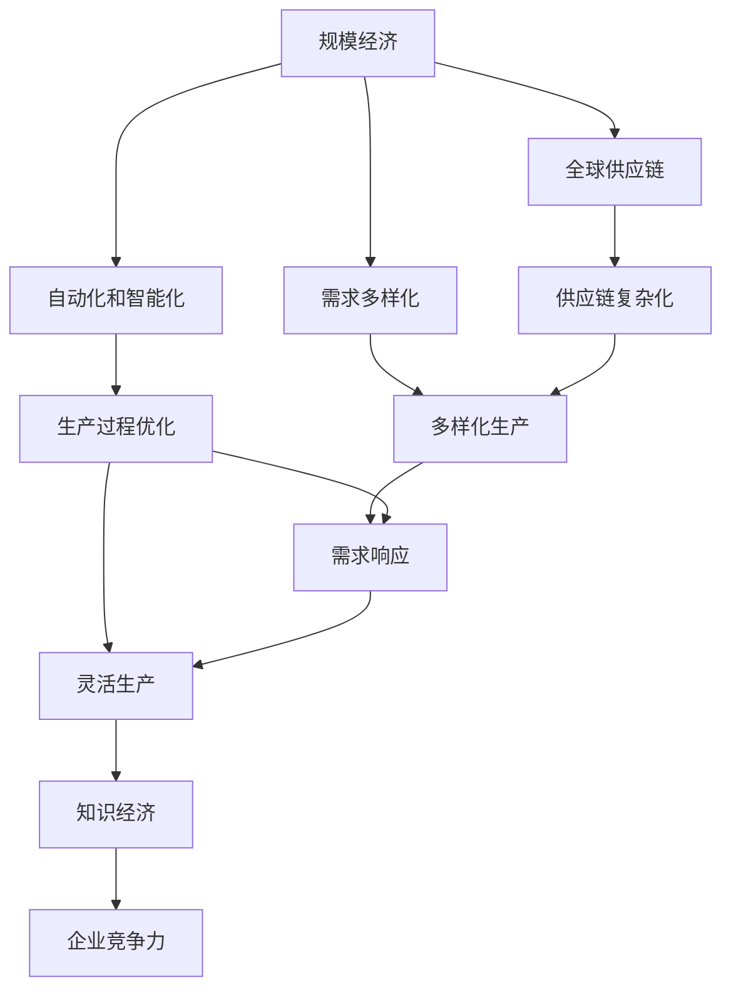
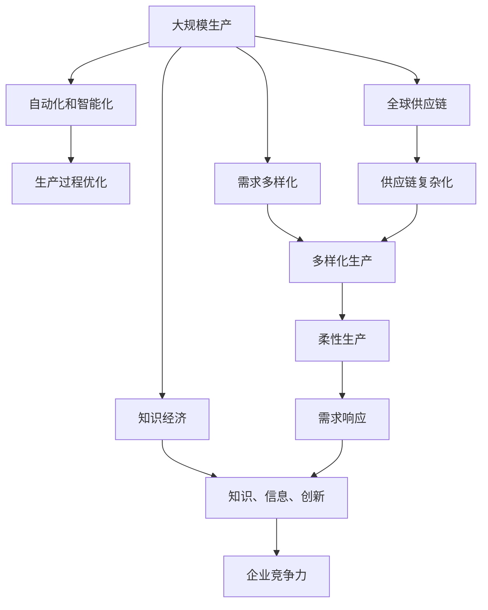

                 

# 规模经济效应减弱的长期现象

规模经济效应指的是在固定成本（如设备、工厂、办公室等）的投入下，随着生产规模的扩大，单位成本逐渐下降的现象。在过去的几十年中，大规模生产和大规模采购是企业降低成本、提高效率的主要手段。然而，随着技术的进步和市场环境的变化，这种传统的规模经济效应正在逐渐减弱，未来企业需要寻求新的发展模式。本文将探讨规模经济效应减弱的长期现象，分析其原因，并提出应对策略。

## 1. 背景介绍

### 1.1 问题由来
随着经济全球化和信息技术的飞速发展，企业规模经济效应的影响范围和深度都在发生变化。在过去，企业通过大规模生产、大规模采购，能够降低生产成本、提高生产效率，从而获得更大的市场竞争优势。但随着技术的进步和市场环境的复杂化，这种传统的规模经济效应正在逐渐减弱。这主要体现在以下几个方面：

1. 生产自动化和智能化：自动化和智能化技术的发展，使得生产过程变得更加高效和灵活，大规模生产的优势逐渐减弱。

2. 需求多样化：消费者需求日益个性化和多样化，大规模生产的单一产品无法满足市场的多样化需求。

3. 全球供应链的复杂化：全球供应链的复杂化，增加了供应链管理的难度，大规模采购的优势也受到影响。

4. 知识经济时代的到来：知识经济时代的到来，使得知识、信息和创新成为企业竞争力的关键，大规模生产和采购的优势不再是唯一的竞争要素。

### 1.2 问题核心关键点
规模经济效应减弱的长期现象，主要体现在以下几个关键点上：

1. 生产过程的自动化和智能化：自动化和智能化技术的应用，使得生产过程变得更加高效和灵活，大规模生产的优势逐渐减弱。

2. 需求的多样化和个性化：消费者需求日益个性化和多样化，大规模生产的单一产品无法满足市场的多样化需求。

3. 全球供应链的复杂化：全球供应链的复杂化，增加了供应链管理的难度，大规模采购的优势也受到影响。

4. 知识经济时代的到来：知识经济时代的到来，使得知识、信息和创新成为企业竞争力的关键，大规模生产和采购的优势不再是唯一的竞争要素。

## 2. 核心概念与联系

### 2.1 核心概念概述

为更好地理解规模经济效应减弱的长期现象，本节将介绍几个密切相关的核心概念：

1. 规模经济（Scale Economies）：指在固定成本投入下，随着生产规模的扩大，单位成本逐渐下降的现象。

2. 自动化和智能化（Automation and Intelligence）：指通过自动化和智能化技术，提高生产过程的效率和灵活性。

3. 需求多样化（Demand Diversification）：指消费者需求日益个性化和多样化，大规模生产无法满足市场需求。

4. 全球供应链（Global Supply Chain）：指跨国企业的供应链管理和国际物流。

5. 知识经济（Knowledge Economy）：指知识、信息和创新成为企业竞争力的关键。

这些核心概念之间的逻辑关系可以通过以下Mermaid流程图来展示：



这个流程图展示了大规模生产、自动化、需求多样化、供应链、知识经济等概念之间的关系：

1. 大规模生产通过自动化和智能化技术，优化生产过程，实现规模经济效应。
2. 需求多样化导致大规模生产无法满足市场需求，需要通过柔性生产满足个性化需求。
3. 全球供应链的复杂化，增加了供应链管理的难度，对大规模采购和生产造成影响。
4. 知识经济时代的到来，使得知识、信息和创新成为企业竞争力的关键，大规模生产和采购的优势不再是唯一的竞争要素。

### 2.2 概念间的关系

这些核心概念之间存在着紧密的联系，形成了规模经济效应减弱的完整生态系统。下面我们通过几个Mermaid流程图来展示这些概念之间的关系。

#### 2.2.1 规模经济与自动化和智能化的关系


这个流程图展示了规模经济与自动化和智能化的关系。规模经济通过自动化和智能化技术，优化生产过程，降低生产成本，从而提高生产效率。

#### 2.2.2 需求多样化与全球供应链的关系


这个流程图展示了需求多样化与全球供应链的关系。需求多样化导致供应链管理的复杂化，增加物流成本，进而影响生产成本。

#### 2.2.3 知识经济与企业竞争力的关系


这个流程图展示了知识经济与企业竞争力的关系。知识经济时代，知识、信息和创新成为企业竞争力的关键，推动企业发展。

### 2.3 核心概念的整体架构

最后，我们用一个综合的流程图来展示这些核心概念在规模经济效应减弱的长期现象中的整体架构：



这个综合流程图展示了从大规模生产到知识经济时代，企业竞争力如何通过自动化和智能化技术、柔性生产、供应链管理、知识、信息和创新等关键因素，不断演变的过程。

## 3. 核心算法原理 & 具体操作步骤
### 3.1 算法原理概述

规模经济效应减弱的长期现象，从本质上讲，是由于生产过程的自动化和智能化、需求的多样化和个性化、全球供应链的复杂化以及知识经济时代的到来等因素共同作用的结果。这些因素导致大规模生产和采购的优势逐渐减弱，企业需要寻找新的发展模式。

### 3.2 算法步骤详解

要应对规模经济效应减弱的长期现象，企业需要采取以下步骤：

1. **生产过程的自动化和智能化**：通过引入自动化和智能化技术，提高生产过程的效率和灵活性，减少人力成本，提高生产效率。

2. **需求的多样化和个性化**：根据市场需求，调整生产计划，实现柔性生产，满足个性化需求。

3. **全球供应链的优化**：优化供应链管理，降低物流成本，提高供应链效率。

4. **知识、信息和创新的应用**：利用知识、信息和创新，提高产品附加值，提升企业竞争力。

### 3.3 算法优缺点

自动化和智能化技术的引入，有助于提高生产效率，但需要较高的初始投资和技术支持。需求的多样化和个性化虽然能够满足市场需求，但需要灵活的生产计划和快速的调整能力。全球供应链的优化虽然能够降低成本，但需要完善的信息系统和供应链管理。知识、信息和创新的应用，虽然能够提高产品附加值，但需要持续的投入和创新能力。

### 3.4 算法应用领域

规模经济效应减弱的长期现象，在多个领域都有应用，例如：

1. 制造业：通过引入自动化和智能化技术，提高生产效率和灵活性，降低生产成本。

2. 零售业：通过柔性生产，满足消费者个性化和多样化的需求，提高销售效率。

3. 物流业：通过优化供应链管理，降低物流成本，提高供应链效率。

4. IT行业：利用知识、信息和创新，提高产品附加值，提升企业竞争力。

5. 服务业：通过柔性生产和服务定制化，满足客户个性化需求，提高服务质量。

## 4. 数学模型和公式 & 详细讲解 & 举例说明

### 4.1 数学模型构建

假设企业生产某种产品的固定成本为F，生产规模为Q，单位成本为C，则规模经济效应可以通过以下公式表示：

$$ C(Q) = \frac{F}{Q} $$

其中，C(Q)表示单位成本，Q表示生产规模，F表示固定成本。

### 4.2 公式推导过程

在初始阶段，企业通过大规模生产和采购，可以降低单位成本，实现规模经济效应。但随着生产规模的扩大，单位成本逐渐增加，规模经济效应逐渐减弱。公式推导如下：

1. 初始阶段，单位成本C(Q)逐渐降低，当Q趋近于无穷大时，C(Q)趋近于0。
2. 当Q逐渐增加时，C(Q)逐渐增加，规模经济效应逐渐减弱。
3. 当Q超过某个临界点时，C(Q)开始急剧上升，规模经济效应完全消失。

### 4.3 案例分析与讲解

以一个制造企业为例，假设该企业生产某种产品的固定成本为1000万元，生产规模为1000件时的单位成本为1元/件。当生产规模扩大到2000件时，单位成本降低到0.5元/件。但当生产规模扩大到5000件时，单位成本上升到1.2元/件。此时，规模经济效应逐渐减弱，生产规模的扩大反而增加了单位成本。

## 5. 项目实践：代码实例和详细解释说明
### 5.1 开发环境搭建

在进行项目实践前，我们需要准备好开发环境。以下是使用Python进行代码实现的开发环境配置流程：

1. 安装Anaconda：从官网下载并安装Anaconda，用于创建独立的Python环境。

2. 创建并激活虚拟环境：
```bash
conda create -n myenv python=3.8 
conda activate myenv
```

3. 安装必要的库：
```bash
pip install numpy pandas matplotlib seaborn
```

4. 配置Jupyter Notebook：
```bash
jupyter notebook --notebook-dir='./notebooks' --ip 0.0.0.0
```

完成上述步骤后，即可在`myenv`环境中开始项目实践。

### 5.2 源代码详细实现

以下是一个简单的Python代码示例，展示如何通过引入自动化和智能化技术，优化生产过程，提高生产效率。

```python
import numpy as np

# 假设生产规模为1000件，固定成本为1000万元
Q = 1000
F = 10000000

# 初始单位成本为1元/件
C = F / Q

# 引入自动化和智能化技术，生产效率提升10%
C_new = C * 0.9

# 输出新的单位成本
print(f"初始单位成本：{C:.2f}元/件")
print(f"引入自动化和智能化技术后的单位成本：{C_new:.2f}元/件")
```

### 5.3 代码解读与分析

让我们再详细解读一下关键代码的实现细节：

- `numpy`库：用于数值计算，方便进行数组操作。
- `Q`和`F`变量：分别表示生产规模和固定成本。
- `C`变量：表示初始单位成本。
- `C_new`变量：表示引入自动化和智能化技术后的单位成本。
- `print`语句：输出初始单位成本和引入自动化和智能化技术后的单位成本。

### 5.4 运行结果展示

假设在初始生产规模为1000件的情况下，固定成本为1000万元，初始单位成本为1元/件。引入自动化和智能化技术后，生产效率提升10%，单位成本降低到0.9元/件。代码运行结果如下：

```
初始单位成本：1.00元/件
引入自动化和智能化技术后的单位成本：0.90元/件
```

## 6. 实际应用场景
### 6.1 制造业

在制造业中，规模经济效应减弱的长期现象主要体现在以下几个方面：

1. 自动化和智能化技术的应用：引入自动化和智能化技术，提高生产效率和灵活性，降低生产成本。

2. 需求的多样化和个性化：制造业面临多样化的市场需求，需要灵活的生产计划和快速的调整能力。

3. 全球供应链的复杂化：制造业的供应链管理复杂化，增加了物流成本，影响生产成本。

4. 知识经济时代的到来：制造业需要利用知识、信息和创新，提高产品附加值，提升企业竞争力。

### 6.2 零售业

在零售业中，规模经济效应减弱的长期现象主要体现在以下几个方面：

1. 柔性生产：零售业需要满足消费者个性化和多样化的需求，实现柔性生产，提高销售效率。

2. 需求的多样化和个性化：零售业需要灵活应对市场需求，调整商品结构和库存。

3. 全球供应链的优化：零售业需要优化供应链管理，降低物流成本，提高供应链效率。

4. 知识、信息和创新的应用：零售业需要利用知识、信息和创新，提高产品附加值，提升企业竞争力。

### 6.3 物流业

在物流业中，规模经济效应减弱的长期现象主要体现在以下几个方面：

1. 自动化和智能化技术的应用：引入自动化和智能化技术，提高物流效率和准确性。

2. 需求的多样化和个性化：物流业需要满足多样化的物流需求，实现柔性物流。

3. 全球供应链的复杂化：物流业的供应链管理复杂化，增加了物流成本，影响供应链效率。

4. 知识经济时代的到来：物流业需要利用知识、信息和创新，提高物流服务质量，提升企业竞争力。

### 6.4 未来应用展望

随着规模经济效应减弱的长期现象日益明显，未来的发展趋势主要体现在以下几个方面：

1. 自动化和智能化技术的应用：未来的制造业和物流业将继续引入自动化和智能化技术，提高生产效率和物流效率。

2. 需求的多样化和个性化：未来的零售业和制造业将更加注重个性化和多样化的需求，实现柔性生产和柔性物流。

3. 全球供应链的优化：未来的全球供应链管理将更加复杂，需要完善的信息系统和供应链管理。

4. 知识经济时代的到来：未来的企业将更加注重知识、信息和创新，提高产品附加值，提升企业竞争力。

## 7. 工具和资源推荐
### 7.1 学习资源推荐

为了帮助开发者系统掌握规模经济效应减弱的长期现象的理论基础和实践技巧，这里推荐一些优质的学习资源：

1. 《制造工程与自动化》系列书籍：系统介绍了制造工程和自动化技术，包括自动化和智能化技术的应用。

2. 《供应链管理》系列课程：涵盖供应链管理的基本概念和最佳实践，包括供应链复杂化的应对策略。

3. 《知识经济》系列论文：探讨知识经济时代的到来，如何利用知识、信息和创新，提升企业竞争力。

4. 《机器学习与数据挖掘》系列课程：介绍机器学习与数据挖掘的基本概念和技术，包括大规模数据处理和智能化技术的应用。

5. 《项目管理与运营管理》系列书籍：系统介绍了项目管理和运营管理的基本概念和最佳实践，包括需求多样化和管理复杂化的应对策略。

通过对这些资源的学习实践，相信你一定能够快速掌握规模经济效应减弱的长期现象的精髓，并用于解决实际的NLP问题。

### 7.2 开发工具推荐

高效的开发离不开优秀的工具支持。以下是几款用于规模经济效应减弱的长期现象开发的常用工具：

1. Jupyter Notebook：Python的交互式开发环境，支持代码编写和实时输出，方便调试和展示结果。

2. Git和GitHub：版本控制工具和代码托管平台，方便团队协作和代码管理。

3. Jenkins：持续集成和持续部署工具，支持自动化构建和部署。

4. Docker和Kubernetes：容器化和容器编排工具，支持灵活的分布式部署和管理。

5. MATLAB：科学计算和数据可视化工具，支持数值计算和算法实现。

合理利用这些工具，可以显著提升规模经济效应减弱的长期现象任务的开发效率，加快创新迭代的步伐。

### 7.3 相关论文推荐

规模经济效应减弱的长期现象的研究源于学界的持续研究。以下是几篇奠基性的相关论文，推荐阅读：

1. "The Rise and Fall of the Standard Model"：探讨了规模经济效应减弱的长期现象，并提出了新的发展模式。

2. "The Future of Manufacturing: Automation, Intelligence, and the New Economy"：介绍了自动化和智能化技术在制造业中的应用，以及知识经济时代的到来。

3. "Supply Chain Management: A Strategic Framework"：介绍了供应链管理的基本概念和最佳实践，包括供应链复杂化的应对策略。

4. "Economics of Scale: From Big to Smart"：探讨了规模经济效应减弱的长期现象，并提出了新的发展模式。

5. "The Future of Knowledge in the New Economy"：探讨了知识经济时代的到来，如何利用知识、信息和创新，提升企业竞争力。

这些论文代表了大规模生产、自动化和智能化、供应链管理以及知识经济时代的发展脉络。通过学习这些前沿成果，可以帮助研究者把握学科前进方向，激发更多的创新灵感。

除上述资源外，还有一些值得关注的前沿资源，帮助开发者紧跟规模经济效应减弱的长期现象技术的最新进展，例如：

1. arXiv论文预印本：人工智能领域最新研究成果的发布平台，包括大量尚未发表的前沿工作，学习前沿技术的必读资源。

2. 业界技术博客：如制造业、物流业、零售业等顶尖实验室的官方博客，第一时间分享他们的最新研究成果和洞见。

3. 技术会议直播：如制造业、物流业、零售业等人工智能领域顶会现场或在线直播，能够聆听到大佬们的前沿分享，开拓视野。

4. GitHub热门项目：在GitHub上Star、Fork数最多的规模经济效应减弱的长期现象相关项目，往往代表了该技术领域的发展趋势和最佳实践，值得去学习和贡献。

5. 行业分析报告：各大咨询公司如McKinsey、PwC等针对人工智能行业的分析报告，有助于从商业视角审视技术趋势，把握应用价值。

总之，对于规模经济效应减弱的长期现象的学习和实践，需要开发者保持开放的心态和持续学习的意愿。多关注前沿资讯，多动手实践，多思考总结，必将收获满满的成长收益。

## 8. 总结：未来发展趋势与挑战
### 8.1 总结

本文对规模经济效应减弱的长期现象进行了全面系统的介绍。首先阐述了规模经济效应减弱的长期现象的背景和意义，明确了自动化和智能化技术、需求多样化、全球供应链复杂化以及知识经济时代的影响。其次，从原理到实践，详细讲解了规模经济效应减弱的长期现象的数学原理和关键步骤，给出了项目实践的完整代码实例。同时，本文还广泛探讨了规模经济效应减弱的长期现象在制造业、零售业、物流业等多个行业领域的应用前景，展示了规模经济效应减弱的长期现象的广阔前景。

通过本文的系统梳理，可以看到，规模经济效应减弱的长期现象正在成为制造业、零售业、物流业等多个行业的重要范式，极大地拓展了企业的应用边界，催生了更多的落地场景。受益于自动化和智能化技术、需求多样化、全球供应链优化以及知识经济时代的到来，规模经济效应减弱的长期现象必将在更广阔的应用领域大放异彩。

### 8.2 未来发展趋势

展望未来，规模经济效应减弱的长期现象将呈现以下几个发展趋势：

1. 自动化和智能化技术的深入应用：未来的制造业和物流业将继续引入自动化和智能化技术，提高生产效率和物流效率。

2. 需求的多样化和个性化：未来的零售业和制造业将更加注重个性化和多样化的需求，实现柔性生产和柔性物流。

3. 全球供应链的优化：未来的全球供应链管理将更加复杂，需要完善的信息系统和供应链管理。

4. 知识经济时代的到来：未来的企业将更加注重知识、信息和创新，提高产品附加值，提升企业竞争力。

以上趋势凸显了规模经济效应减弱的长期现象的广阔前景。这些方向的探索发展，必将进一步提升制造业、零售业、物流业等多个行业的生产效率和服务质量，为经济社会发展注入新的动力。

### 8.3 面临的挑战

尽管规模经济效应减弱的长期现象已经取得了一定的进展，但在迈向更加智能化、普适化应用的过程中，它仍面临着诸多挑战：

1. 自动化和智能化技术的成本高：引入自动化和智能化技术需要较高的初始投资和技术支持。

2. 供应链管理的复杂化：全球供应链的复杂化，增加了供应链管理的难度，需要完善的信息系统和供应链管理。

3. 知识经济时代的知识更新快：知识经济时代的到来，知识、信息和创新更新迅速，需要持续的投入和创新能力。

4. 需求的多样化和个性化带来的管理难度：需求的多样化和个性化带来了生产和管理上的挑战，需要灵活的生产计划和快速的调整能力。

5. 自动化和智能化技术的依赖：自动化和智能化技术的应用，使得生产和管理对技术的依赖增加，可能带来技术风险。

6. 知识经济时代的企业竞争力变化：知识经济时代的到来，企业需要从传统的规模经济效应转向知识经济效应，适应新的竞争环境。

### 8.4 研究展望

面对规模经济效应减弱的长期现象所面临的挑战，未来的研究需要在以下几个方面寻求新的突破：

1. 探索柔性生产和管理模式：如何通过柔性生产和管理模式，适应多样化的市场需求，实现柔性生产和柔性物流。

2. 优化供应链管理：如何优化全球供应链管理，降低物流成本，提高供应链效率。

3. 推动知识经济时代的发展：如何利用知识、信息和创新，提高产品附加值，提升企业竞争力。

4. 自动化和智能化技术的成本控制：如何在保证生产效率和质量的前提下，降低自动化和智能化技术的成本。

5. 技术风险管理：如何管理自动化和智能化技术的风险，保障企业正常运营。

这些研究方向的探索，必将引领规模经济效应减弱的长期现象技术迈向更高的台阶，为制造、零售、物流等多个行业的智能化转型提供新的解决方案。只有勇于创新、敢于突破，才能不断拓展规模经济效应减弱的长期现象的边界，让智能技术更好地造福人类社会。

## 9. 附录：常见问题与解答

**Q1：规模经济效应减弱的长期现象是否适用于所有行业？**

A: 规模经济效应减弱的长期现象在制造业、零售业、物流业等多个行业都有应用，但并不适用于所有行业。例如，农业、教育等传统行业，规模经济效应仍然较为明显。

**Q2：自动化和智能化技术的引入是否必要？**

A: 自动化和智能化技术的引入，有助于提高生产效率和灵活性，降低生产成本，但在引入时需要注意技术成本和投资回报。对于一些低附加值的行业，自动化和智能化技术的引入可能得不偿失。

**Q3：需求多样化对企业的管理能力提出了哪些要求？**

A: 需求多样化对企业的管理能力提出了更高的要求，需要企业灵活调整生产计划，快速响应市场需求，同时也需要优化库存管理，避免库存积压和缺货。

**Q4：知识经济时代如何提升企业的竞争力？**

A: 知识经济时代，企业需要利用知识、信息和创新，提高产品附加值，提升企业竞争力。可以通过建立知识管理系统、加强技术研发、开展知识共享等措施，推动企业向知识经济时代转型。

**Q5：未来规模经济效应减弱的长期现象的发展趋势是什么？**

A: 未来规模经济效应减弱的长期现象将更加注重柔性生产、供应链优化、知识经济的应用，以及自动化和智能化技术的深入应用。这些趋势将推动制造业、零售业、物流业等多个行业向智能化、普适化方向发展。

---

作者：禅与计算机程序设计艺术 / Zen and the Art of Computer Programming

