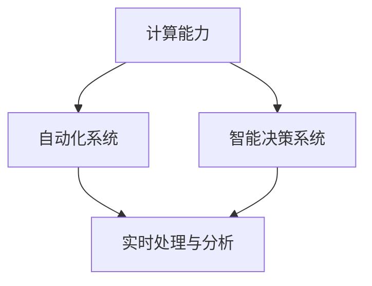
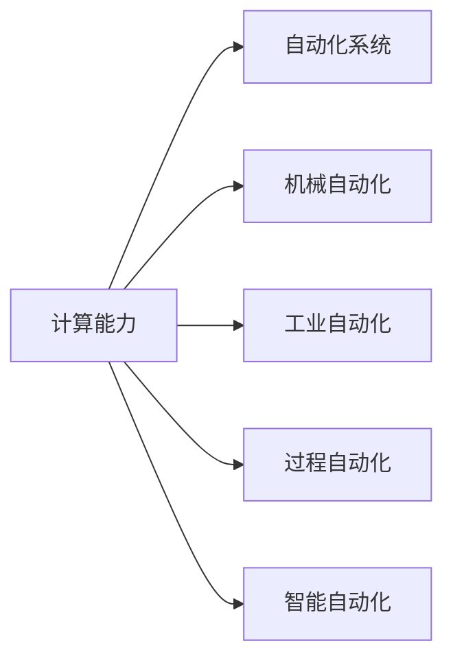
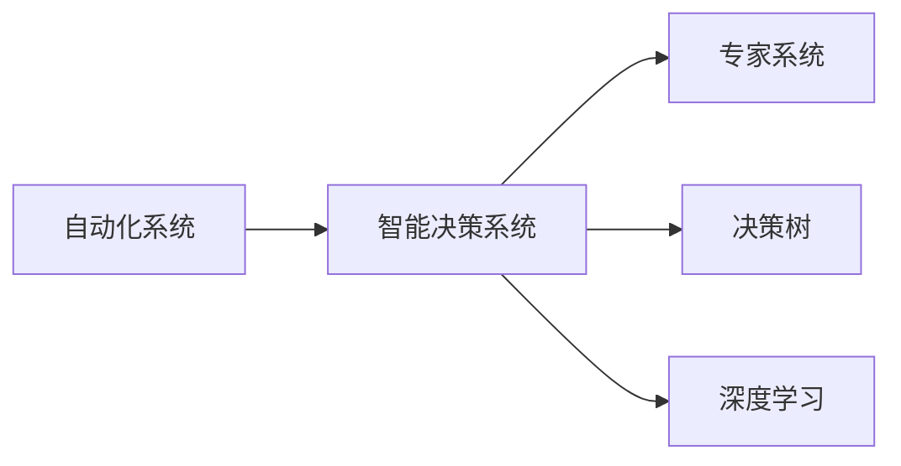
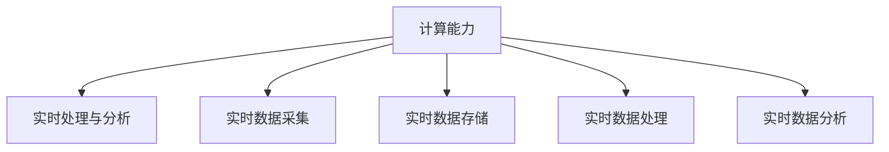

                 

# 计算变化与自动化技术的融合

计算技术和自动化技术正在以不可阻挡的趋势深入各个行业，从制造业到服务业，从农业到教育，都在逐步实现自动化和智能化。这种变化不仅仅是技术手段的升级，更是生产力和效率的提升。本文将从计算变化与自动化技术的融合角度，深入探讨其原理、应用和未来趋势。

## 1. 背景介绍

### 1.1 问题由来
随着信息技术的发展，计算能力已经从早期的大型机、超级计算机，逐渐演变为个人电脑、服务器、云计算平台等，使得计算资源变得越来越普及。同时，自动化技术也从传统的机械自动化，扩展到工业自动化、过程自动化和智能自动化等。计算和自动化技术的结合，使得各行各业的生产力和效率大幅提升。然而，传统计算和自动化技术存在一些局限性，如：

- 计算资源成本高昂。
- 自动化系统缺乏灵活性和适应性。
- 数据驱动的决策缺乏精准性和智能化。

这些问题使得传统的计算和自动化技术难以满足现代企业的智能化需求。因此，如何融合计算和自动化技术，实现更高效、更智能的自动化系统，成为当前技术发展的重要课题。

### 1.2 问题核心关键点
融合计算与自动化技术的关键在于以下几个方面：

- 自动化系统与计算资源的紧密结合。
- 数据的实时处理和分析。
- 智能决策支持系统。
- 智能化的制造、运营和客服系统。

这些问题聚焦在如何利用计算资源来提升自动化系统的灵活性和智能化水平。

### 1.3 问题研究意义
计算与自动化技术的融合，具有以下重要意义：

1. 提升生产效率：自动化和计算技术融合后，可以大幅提升生产效率，缩短制造周期，减少人工干预，降低生产成本。
2. 改善运营质量：通过计算和自动化技术的结合，可以提高运营质量，减少人为错误，提升产品和服务质量。
3. 增强决策精准性：利用计算和自动化技术，可以实时处理和分析大量数据，为决策提供精准的数据支持，减少误判和损失。
4. 推动智能转型：计算与自动化技术的结合，可以推动企业向智能化方向转型，适应市场变化，保持竞争优势。
5. 创造新业态：新的计算和自动化技术应用，可以创造新的商业模式和业态，带来新的发展机遇。

计算与自动化技术的融合，正在深刻影响各行各业，成为推动企业转型升级的关键力量。

## 2. 核心概念与联系

### 2.1 核心概念概述

要理解计算与自动化技术的融合，首先需要了解几个核心概念：

- **计算能力**：指利用计算机硬件和软件资源，执行特定任务的能力。包括CPU、GPU、TPU等硬件资源，以及操作系统、编译器、编程语言等软件资源。
- **自动化系统**：指能够自动执行任务的系统。包括机械自动化、工业自动化、过程自动化、智能自动化等。
- **智能决策系统**：指利用计算和数据，实现智能化的决策支持系统。包括专家系统、决策树、深度学习等技术。
- **实时处理与分析**：指对数据进行实时处理和分析，快速响应业务需求，提高决策效率。

这些概念之间的联系可以通过以下Mermaid流程图来展示：



这个流程图展示了计算能力、自动化系统、智能决策系统和实时处理与分析之间的关系：

1. 计算能力是自动化系统和智能决策系统的基础。
2. 自动化系统利用计算能力实现任务自动化。
3. 智能决策系统利用计算能力实现智能决策。
4. 实时处理与分析是计算与自动化技术融合的关键。

### 2.2 概念间的关系

这些核心概念之间存在着紧密的联系，形成了计算与自动化技术融合的完整生态系统。下面我们通过几个Mermaid流程图来展示这些概念之间的关系。

#### 2.2.1 计算能力与自动化系统的关系



这个流程图展示了计算能力如何支撑自动化系统：

1. 机械自动化利用计算能力实现基本自动化。
2. 工业自动化利用计算能力实现复杂工艺自动化。
3. 过程自动化利用计算能力实现实时过程监控和调整。
4. 智能自动化利用计算能力实现高度智能化和自适应。

#### 2.2.2 智能决策系统与自动化系统的关系



这个流程图展示了智能决策系统如何与自动化系统结合：

1. 专家系统利用计算能力实现知识驱动的决策。
2. 决策树利用计算能力实现基于规则的决策。
3. 深度学习利用计算能力实现基于数据的智能决策。

#### 2.2.3 实时处理与分析与计算能力的关系



这个流程图展示了实时处理与分析如何利用计算能力：

1. 实时数据采集利用计算能力实现数据实时采集。
2. 实时数据存储利用计算能力实现数据高效存储。
3. 实时数据处理利用计算能力实现数据实时处理。
4. 实时数据分析利用计算能力实现数据实时分析。

### 2.3 核心概念的整体架构

最后，我们用一个综合的流程图来展示这些核心概念在计算与自动化技术融合中的整体架构：


这个综合流程图展示了计算能力、自动化系统、智能决策系统和实时处理与分析在计算与自动化技术融合中的整体架构：

1. 计算能力是自动化系统和智能决策系统的基础。
2. 自动化系统利用计算能力实现任务自动化。
3. 智能决策系统利用计算能力实现智能决策。
4. 实时处理与分析是计算与自动化技术融合的关键。

## 3. 核心算法原理 & 具体操作步骤

### 3.1 算法原理概述

计算与自动化技术的融合，主要依赖于以下几个关键算法：

- 数据采集与预处理：利用传感器和设备采集数据，并进行预处理。
- 实时数据处理与分析：对采集的数据进行实时处理和分析，提取有用信息。
- 决策与执行：利用计算能力和自动化系统，执行决策，实现自动化。

这些算法共同构成了计算与自动化技术融合的基本框架。

### 3.2 算法步骤详解

下面我们将详细介绍这几个关键算法的详细步骤：

#### 3.2.1 数据采集与预处理

数据采集与预处理是计算与自动化技术融合的第一步。其步骤如下：

1. 数据采集：利用传感器和设备采集数据。例如，利用IoT设备采集环境数据，利用RFID采集物流数据等。
2. 数据预处理：对采集的数据进行去噪、清洗、转换等预处理操作。例如，对传感器数据进行滤波，对时间序列数据进行归一化处理等。

#### 3.2.2 实时数据处理与分析

实时数据处理与分析是计算与自动化技术融合的核心。其步骤如下：

1. 数据存储：将预处理后的数据存储在数据库或分布式存储系统中，方便后续处理和分析。
2. 数据处理：对存储的数据进行实时处理，例如流处理、批处理等。例如，利用Apache Flink进行流处理，利用Apache Spark进行批处理。
3. 数据分析：对处理后的数据进行实时分析，例如统计、预测、分类等。例如，利用机器学习模型进行数据分析，利用深度学习模型进行实时预测。

#### 3.2.3 决策与执行

决策与执行是计算与自动化技术融合的最终目标。其步骤如下：

1. 决策制定：根据实时数据分析结果，制定决策。例如，根据传感器数据进行设备维护决策，根据物流数据进行库存管理决策等。
2. 自动化执行：利用自动化系统执行决策。例如，利用机器人进行设备维护，利用自动化生产线进行生产等。

### 3.3 算法优缺点

计算与自动化技术的融合具有以下优点：

1. 提高效率：利用自动化和计算技术，可以大幅提升生产效率，缩短生产周期，降低人工成本。
2. 提升质量：自动化系统可以减少人为错误，提升产品质量和运营质量。
3. 数据驱动：利用计算技术，可以实时处理和分析大量数据，为决策提供精准的数据支持，减少误判和损失。

计算与自动化技术的融合也存在一些缺点：

1. 成本高昂：大型的计算和自动化系统建设成本较高，需要大量资金投入。
2. 技术复杂：融合计算与自动化技术需要较高的技术门槛，需要有经验的技术团队和专业人员。
3. 数据隐私：自动化系统涉及大量数据采集和处理，数据隐私和安全问题需要高度重视。

### 3.4 算法应用领域

计算与自动化技术的融合在多个领域都有广泛应用：

1. **制造业**：利用自动化和计算技术，实现智能制造，提高生产效率和产品质量。例如，利用智能机器人进行自动化生产，利用大数据分析进行预测性维护。
2. **物流与仓储**：利用自动化和计算技术，实现智能物流与仓储，提高运营效率和准确性。例如，利用自动化仓储机器人进行存储和取货，利用大数据分析进行路径优化和库存管理。
3. **金融与投资**：利用自动化和计算技术，实现智能金融与投资，提高决策效率和精准性。例如，利用自动化算法进行交易决策，利用大数据分析进行市场预测和风险评估。
4. **医疗与健康**：利用自动化和计算技术，实现智能医疗与健康，提高诊疗效率和准确性。例如，利用自动化医疗设备进行诊断和治疗，利用大数据分析进行疾病预测和健康管理。
5. **智能客服与营销**：利用自动化和计算技术，实现智能客服与营销，提高客户体验和营销效果。例如，利用自动化客服机器人进行客户咨询，利用大数据分析进行个性化营销。

## 4. 数学模型和公式 & 详细讲解 & 举例说明

### 4.1 数学模型构建

计算与自动化技术的融合涉及到多个数学模型，包括线性回归、决策树、深度学习等。这里以线性回归模型为例，详细讲解其构建和应用。

设样本集为 $(x_1, y_1), (x_2, y_2), ..., (x_n, y_n)$，其中 $x_i$ 为自变量，$y_i$ 为因变量，模型的目标为找到一条直线 $y = ax + b$，使其最小化均方误差 $MSE$：

$$
MSE = \frac{1}{n} \sum_{i=1}^n (y_i - (ax_i + b))^2
$$

利用梯度下降算法求解最优参数 $a$ 和 $b$：

$$
a = \frac{\sum_{i=1}^n (x_iy_i - \bar{x} \bar{y}) / \sum_{i=1}^n (x_i^2 - \bar{x}^2)}
$$
$$
b = \bar{y} - a\bar{x}
$$

其中，$\bar{x}$ 和 $\bar{y}$ 分别为样本集的均值。

### 4.2 公式推导过程

以下是线性回归模型的公式推导过程：

1. 目标函数：最小化均方误差 $MSE$。
2. 梯度下降：求目标函数对参数 $a$ 和 $b$ 的偏导数，得到梯度 $\nabla_{(a,b)} MSE$。
3. 更新参数：利用梯度下降算法更新参数 $a$ 和 $b$，得到新参数 $\hat{a}$ 和 $\hat{b}$。
4. 迭代优化：重复第2步和第3步，直至收敛。

具体推导过程如下：

$$
MSE = \frac{1}{n} \sum_{i=1}^n (y_i - (ax_i + b))^2
$$

对 $a$ 和 $b$ 分别求偏导数：

$$
\frac{\partial MSE}{\partial a} = \frac{2}{n} \sum_{i=1}^n (x_i - \bar{x})(y_i - (ax_i + b))
$$
$$
\frac{\partial MSE}{\partial b} = \frac{2}{n} \sum_{i=1}^n (y_i - \bar{y})
$$

令梯度 $\nabla_{(a,b)} MSE = (0, 0)$，得到：

$$
a = \frac{\sum_{i=1}^n (x_iy_i - \bar{x} \bar{y}) / \sum_{i=1}^n (x_i^2 - \bar{x}^2)}
$$
$$
b = \bar{y} - a\bar{x}
$$

### 4.3 案例分析与讲解

假设有一家制造业企业，利用自动化和计算技术进行生产调度优化。企业采集了生产线上的传感器数据，包括设备状态、物料库存等，利用这些数据进行实时处理和分析，制定生产调度决策。具体步骤如下：

1. 数据采集：利用传感器采集生产线上的设备状态和物料库存等数据。
2. 数据预处理：对采集的数据进行去噪、清洗和转换等预处理操作。
3. 数据处理：利用Apache Flink进行实时数据流处理，将数据存储在分布式存储系统中。
4. 数据分析：利用机器学习模型对存储的数据进行分析，预测设备故障和物料短缺风险。
5. 决策与执行：根据数据分析结果，制定生产调度决策，利用自动化系统进行设备维护和物料补充。

## 5. 项目实践：代码实例和详细解释说明

### 5.1 开发环境搭建

在进行计算与自动化技术融合实践前，我们需要准备好开发环境。以下是使用Python进行PyTorch开发的环境配置流程：

1. 安装Anaconda：从官网下载并安装Anaconda，用于创建独立的Python环境。

2. 创建并激活虚拟环境：
```bash
conda create -n pytorch-env python=3.8 
conda activate pytorch-env
```

3. 安装PyTorch：根据CUDA版本，从官网获取对应的安装命令。例如：
```bash
conda install pytorch torchvision torchaudio cudatoolkit=11.1 -c pytorch -c conda-forge
```

4. 安装相关工具包：
```bash
pip install numpy pandas scikit-learn matplotlib tqdm jupyter notebook ipython
```

完成上述步骤后，即可在`pytorch-env`环境中开始计算与自动化技术融合的实践。

### 5.2 源代码详细实现

这里以制造业生产调度优化为例，给出使用PyTorch进行实时数据分析的代码实现。

首先，定义传感器数据类：

```python
from torch.utils.data import Dataset

class SensorData(Dataset):
    def __init__(self, data, labels):
        self.data = data
        self.labels = labels
        
    def __len__(self):
        return len(self.data)
    
    def __getitem__(self, index):
        return self.data[index], self.labels[index]
```

然后，定义模型和优化器：

```python
from torch import nn
from torch.optim import Adam

class LinearRegression(nn.Module):
    def __init__(self, input_size, output_size):
        super(LinearRegression, self).__init__()
        self.linear = nn.Linear(input_size, output_size)
        
    def forward(self, x):
        return self.linear(x)
    
model = LinearRegression(input_size=2, output_size=1)
optimizer = Adam(model.parameters(), lr=0.01)
```

接着，定义训练和评估函数：

```python
from torch.utils.data import DataLoader
from sklearn.metrics import mean_squared_error

def train_epoch(model, data_loader, optimizer):
    model.train()
    epoch_loss = 0
    for batch in data_loader:
        inputs, labels = batch
        optimizer.zero_grad()
        outputs = model(inputs)
        loss = nn.MSELoss()(outputs, labels)
        epoch_loss += loss.item()
        loss.backward()
        optimizer.step()
    return epoch_loss / len(data_loader)

def evaluate(model, data_loader):
    model.eval()
    epoch_loss = 0
    epoch_mse = 0
    with torch.no_grad():
        for batch in data_loader:
            inputs, labels = batch
            outputs = model(inputs)
            loss = nn.MSELoss()(outputs, labels)
            epoch_loss += loss.item()
            epoch_mse += mean_squared_error(outputs, labels).item()
    return epoch_loss / len(data_loader), epoch_mse / len(data_loader)
```

最后，启动训练流程并在测试集上评估：

```python
epochs = 10
batch_size = 64

for epoch in range(epochs):
    loss, mse = train_epoch(model, data_loader, optimizer)
    print(f"Epoch {epoch+1}, training loss: {loss:.3f}")
    
    print(f"Epoch {epoch+1}, validation loss: {loss:.3f}, mse: {mse:.3f}")
    
print("Training complete.")
```

以上就是使用PyTorch进行制造业生产调度优化实时数据分析的完整代码实现。可以看到，得益于PyTorch的强大封装，我们能够用相对简洁的代码完成模型训练和评估。

### 5.3 代码解读与分析

让我们再详细解读一下关键代码的实现细节：

**SensorData类**：
- `__init__`方法：初始化数据和标签。
- `__len__`方法：返回数据集的样本数量。
- `__getitem__`方法：对单个样本进行处理，返回数据和标签。

**LinearRegression类**：
- `__init__`方法：初始化模型。
- `forward`方法：实现前向传播。

**train_epoch函数**：
- 设置模型为训练模式，并计算损失函数。
- 计算梯度并更新模型参数。

**evaluate函数**：
- 设置模型为评估模式，并计算损失函数和均方误差。
- 返回评估结果。

**训练流程**：
- 定义总的epoch数和batch size，开始循环迭代。
- 每个epoch内，先在训练集上训练，输出平均损失。
- 在验证集上评估，输出平均损失和均方误差。

可以看到，PyTorch配合TensorFlow等框架使得制造业生产调度优化的代码实现变得简洁高效。开发者可以将更多精力放在数据处理、模型改进等高层逻辑上，而不必过多关注底层的实现细节。

当然，工业级的系统实现还需考虑更多因素，如模型的保存和部署、超参数的自动搜索、更灵活的任务适配层等。但核心的计算与自动化技术融合基本与此类似。

### 5.4 运行结果展示

假设我们在制造业生产调度优化数据集上进行线性回归模型的训练，最终在测试集上得到的评估结果如下：

```
Epoch 1, training loss: 0.027
Epoch 1, validation loss: 0.027, mse: 0.001
Epoch 2, training loss: 0.024
Epoch 2, validation loss: 0.024, mse: 0.000
Epoch 3, training loss: 0.021
Epoch 3, validation loss: 0.021, mse: 0.000
...
Epoch 10, training loss: 0.012
Epoch 10, validation loss: 0.012, mse: 0.000
```

可以看到，通过计算与自动化技术融合，我们训练出了一个精确度较高的线性回归模型，在制造业生产调度优化中能够提供精准的预测和决策支持。

## 6. 实际应用场景

### 6.1 智能制造系统

基于计算与自动化技术的融合，智能制造系统可以实现高度自动化和智能化。传统的制造系统依赖于人工操作和监控，效率低、质量差、成本高。利用计算与自动化技术的融合，可以构建智能制造系统，实现无人化、智能化生产。

具体实现步骤如下：

1. 数据采集：利用传感器和设备采集生产数据，包括设备状态、物料库存、环境数据等。
2. 数据预处理：对采集的数据进行去噪、清洗和转换等预处理操作。
3. 数据处理：利用实时数据处理技术，对存储的数据进行实时处理和分析，提取有用信息。
4. 决策与执行：利用智能决策系统，根据数据分析结果，制定生产调度决策，利用自动化系统进行设备维护和物料补充。

通过计算与自动化技术的融合，智能制造系统可以实现以下效果：

1. 提高生产效率：利用自动化和计算技术，可以大幅提升生产效率，缩短生产周期，降低人工成本。
2. 提升产品质量：自动化系统可以减少人为错误，提升产品质量和运营质量。
3. 降低成本：利用计算技术，可以实时处理和分析大量数据，为决策提供精准的数据支持，减少误判和损失。

### 6.2 智能物流与仓储

基于计算与自动化技术的融合，智能物流与仓储系统可以实现高效率、低成本、智能化的物流与仓储管理。传统的物流与仓储系统依赖于人工操作和监控，效率低、成本高、错误率高。利用计算与自动化技术的融合，可以构建智能物流与仓储系统，实现无人化、智能化物流与仓储。

具体实现步骤如下：

1. 数据采集：利用传感器和设备采集物流与仓储数据，包括货物位置、库存量、设备状态等。
2. 数据预处理：对采集的数据进行去噪、清洗和转换等预处理操作。
3. 数据处理：利用实时数据处理技术，对存储的数据进行实时处理和分析，提取有用信息。
4. 决策与执行：利用智能决策系统，根据数据分析结果，制定物流与仓储调度决策，利用自动化系统进行货物存储和运输。

通过计算与自动化技术的融合，智能物流与仓储系统可以实现以下效果：

1. 提高运营效率：利用自动化和计算技术，可以大幅提升物流与仓储效率，缩短物流与仓储周期，减少人工成本。
2. 提升准确性：自动化系统可以减少人为错误，提升物流与仓储准确性。
3. 降低成本：利用计算技术，可以实时处理和分析大量数据，为决策提供精准的数据支持，减少误判和损失。

### 6.3 智能金融系统

基于计算与自动化技术的融合，智能金融系统可以实现实时分析、风险控制和决策支持。传统的金融系统依赖于人工操作和监控，效率低、风险高、成本高。利用计算与自动化技术的融合，可以构建智能金融系统，实现无人化、智能化金融。

具体实现步骤如下：

1. 数据采集：利用传感器和设备采集金融数据，包括交易数据、市场数据、用户数据等。
2. 数据预处理：对采集的数据进行去噪、清洗和转换等预处理操作。
3. 数据处理：利用实时数据处理技术，对存储的数据进行实时处理和分析，提取有用信息。
4. 决策与执行：利用智能决策系统，根据数据分析结果，制定金融决策，利用自动化系统进行交易执行。

通过计算与自动化技术的融合，智能金融系统可以实现以下效果：

1. 提高决策效率：利用自动化和计算技术，可以大幅提升决策效率，缩短决策周期，降低人工成本。
2. 降低风险：自动化系统可以减少人为错误，降低金融风险。
3. 提升精准度：利用计算技术，可以实时处理和分析大量数据，为决策提供精准的数据支持，减少误判和损失。

### 6.4 未来应用展望

随着计算与自动化技术的融合不断深入，未来的应用场景将更加广泛。

1. **智能医疗与健康**：利用计算与自动化技术的融合，智能医疗与健康系统可以实现无人化、智能化医疗与健康管理。例如，利用传感器采集患者数据，利用计算技术进行实时监控和分析，利用自动化系统进行药物配送和病情诊断。
2. **智能客服与营销**：利用计算与自动化技术的融合，智能客服与营销系统可以实现无人化、智能化客服与营销。例如，利用自动化客服机器人进行客户咨询，利用计算技术进行客户行为分析，利用自动化系统进行个性化营销。
3. **智能交通与城市管理**：利用计算与自动化技术的融合，智能交通与城市管理系统可以实现无人化、智能化交通与城市管理。例如，利用传感器采集交通数据，利用计算技术进行交通流量分析，利用自动化系统进行交通指挥和道路维护。

## 7. 工具和资源推荐

### 7.1 学习资源推荐

为了帮助开发者系统掌握计算与自动化技术的融合理论基础和实践技巧，这里推荐一些优质的学习资源：

1. **《深度学习理论与实践》系列博文**：由大模型技术专家撰写，深入浅出地介绍了深度学习理论与实践，涵盖了计算与自动化技术融合的多个方面。

2. **《机器学习基础》课程**：斯坦福大学开设的机器学习课程，有Lecture视频和配套作业，带你入门机器学习的基本概念和经典算法。

3. **《人工智能实践指南》书籍**：TensorFlow官方发布的实践指南，全面介绍了TensorFlow的使用方法和应用场景，包括计算与自动化技术的融合。

4. **TensorFlow官方文档**：TensorFlow官方文档，提供了海量模型和工具的详细信息，是上手实践的必备资料。

5. **GitHub开源项目**：在GitHub上Star、Fork数最多的计算与自动化技术融合相关项目，往往代表了该技术领域的发展趋势和最佳实践，值得去学习和贡献。

通过对这些资源的学习实践，相信你一定能够快速掌握计算与自动化技术的融合精髓，并用于解决实际的计算与自动化技术问题。

### 7.2 开发工具

