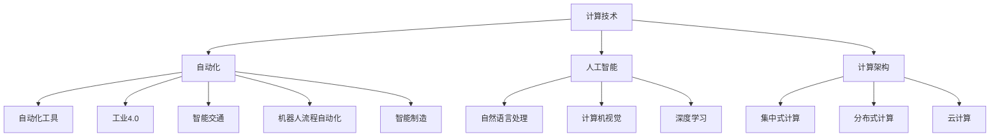
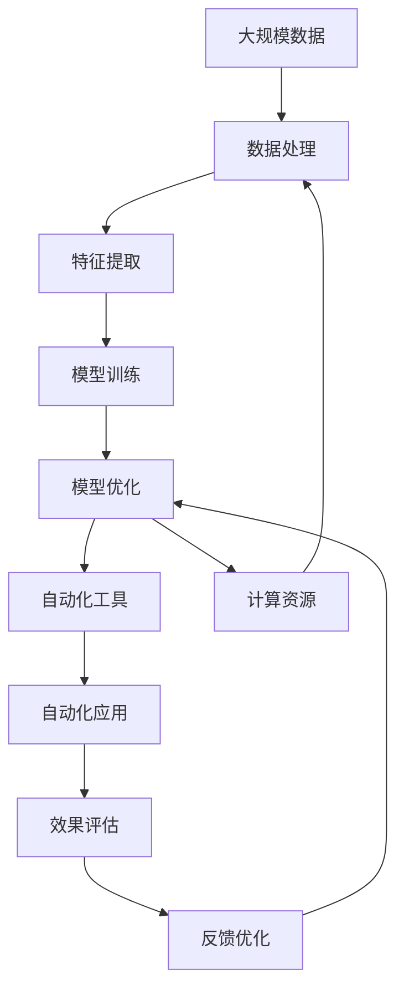

                 

# 计算变化与自动化的未来

## 1. 背景介绍

### 1.1 问题由来
随着计算技术的快速进步，自动化和人工智能(AI)在各行各业的应用愈发广泛。从制造业的工业4.0到金融业的算法交易，再到医疗领域的智能诊断，计算技术正逐渐重塑着人类社会的生产方式。

然而，这场计算变革也带来了新的挑战。数据的爆炸增长、算法的复杂化、计算资源的稀缺性等问题，使得现有的计算体系和自动化工具面临严峻考验。如何在计算变化的大背景下，实现自动化与人工智能的协同进化，成为了摆在技术开发者面前的重要课题。

### 1.2 问题核心关键点
要回答这个问题，我们需要从以下几个关键点出发：
- 计算技术的发展趋势与自动化需求的关系。
- 现有计算体系与AI工具的结合方式与挑战。
- 自动化与AI的未来发展方向与策略。

### 1.3 问题研究意义
本文将通过一系列严格的理论分析和实践案例，深入探讨计算技术的变化对自动化的影响，以及如何利用AI技术克服自动化过程中遇到的技术难题。这不仅对从事计算与自动化领域的技术人员具有重要参考价值，也为相关产业的智能化转型提供了理论依据。

## 2. 核心概念与联系

### 2.1 核心概念概述
在探讨计算变化与自动化未来之前，我们首先介绍一些核心概念及其相互关系：

#### 2.1.1 计算技术
计算技术涉及硬件、软件和算法等多个方面，包括CPU、GPU、FPGA、AI芯片等计算硬件，以及操作系统、编程语言、中间件等软件平台，以及深度学习、计算机视觉、自然语言处理等AI算法。

#### 2.1.2 自动化
自动化是指通过计算机技术和算法，实现任务执行的自动化、智能化。常见的自动化技术包括机器人流程自动化(RPA)、工业4.0、智能交通、智能制造等。

#### 2.1.3 人工智能
人工智能旨在通过模拟人类智能，实现计算任务（如理解自然语言、进行图像识别、进行决策等）的自动化。主要技术包括深度学习、强化学习、知识表示等。

#### 2.1.4 计算架构
计算架构指计算机系统的硬件和软件布局方式。常见的计算架构包括集中式计算、分布式计算、云计算等。

#### 2.1.5 自动化工具
自动化工具是一系列专门针对特定领域进行自动化的软件和算法，如机器人控制软件、工业控制软件、自动化测试工具等。

这些概念之间存在着紧密的联系，共同构成了计算技术与自动化结合的基础框架。

### 2.2 概念间的关系

这些核心概念之间的关系可以通过以下Mermaid流程图来展示：



这个流程图展示了计算技术、人工智能、自动化工具、自动化领域和计算架构之间的关系：

1. 计算技术是实现自动化和人工智能的基础，提供必要的计算资源和算法支持。
2. 人工智能通过模拟人类智能，提高自动化系统的智能水平，实现复杂任务的自动化处理。
3. 自动化工具是连接计算技术和人工智能的桥梁，为特定领域提供智能化的自动化解决方案。
4. 自动化领域包括工业4.0、智能交通、智能制造等，是自动化工具应用的具体场景。
5. 计算架构决定了计算资源的部署方式，影响着自动化系统的效率和扩展性。

### 2.3 核心概念的整体架构

最后，我们用一个综合的流程图来展示这些核心概念在大规模自动化中的整体架构：



这个综合流程图展示了从大规模数据处理到模型优化，再到自动化工具应用的完整过程：

1. 大规模数据经过数据处理和特征提取，进入模型训练阶段。
2. 通过模型优化获得更高效的模型参数，生成自动化工具。
3. 自动化工具在具体应用场景中执行，生成自动化应用。
4. 效果评估反馈优化，再次进行模型优化和工具调整。

## 3. 核心算法原理 & 具体操作步骤
### 3.1 算法原理概述

计算变化与自动化的核心算法原理可以概括为以下几个方面：

#### 3.1.1 模型驱动的自动化
模型驱动的自动化（Model-Driven Automation, MDA）是指通过AI模型预测和决策，实现自动化任务的过程。常见的模型包括线性回归、决策树、深度学习等。

#### 3.1.2 基于规则的自动化
基于规则的自动化（Rule-Based Automation, RBA）是指通过预设规则，自动执行任务的过程。常见的规则系统包括Prolog、Expert System等。

#### 3.1.3 混合自动化
混合自动化是指将模型驱动和基于规则的自动化结合，通过模型预测结果，触发规则自动化执行。这种结合方式可以发挥各自优势，提高自动化系统的智能化水平。

#### 3.1.4 自动化流水线
自动化流水线是指将多个自动化模块串联起来，实现连续自动化的过程。流水线的每个模块可以采用不同自动化方式，如模块A采用模型驱动，模块B采用基于规则，整个流水线则可以根据任务需求灵活配置。

#### 3.1.5 分布式计算
分布式计算是指将大规模计算任务分布到多个计算节点，实现并行计算和弹性扩展。常见的分布式计算框架包括Hadoop、Spark等。

### 3.2 算法步骤详解

基于以上算法原理，下面详细介绍实现计算变化与自动化具体步骤：

#### 3.2.1 数据预处理
1. 数据收集：从不同数据源（如传感器、数据库、API等）收集数据。
2. 数据清洗：去除噪声、缺失值、异常值等。
3. 数据标注：给数据添加标签，用于模型训练。

#### 3.2.2 特征提取
1. 特征选择：根据任务需求，选择重要的特征。
2. 特征转换：对特征进行归一化、标准化、编码等操作。
3. 特征融合：将不同特征进行组合，生成更丰富的特征表示。

#### 3.2.3 模型训练
1. 模型选择：选择适合任务的模型（如线性回归、深度神经网络等）。
2. 数据划分：将数据分为训练集、验证集和测试集。
3. 模型训练：在训练集上使用梯度下降等优化算法进行模型训练。
4. 模型验证：在验证集上评估模型性能，调整模型参数。
5. 模型测试：在测试集上评估模型泛化性能。

#### 3.2.4 自动化工具开发
1. 算法集成：将训练好的模型集成到自动化工具中。
2. 用户界面设计：设计用户友好的界面，方便用户操作。
3. 工具部署：将工具部署到服务器或云端，实现在线服务。

#### 3.2.5 自动化应用部署
1. 应用配置：根据任务需求配置自动化应用。
2. 数据输入：将待处理数据输入自动化应用。
3. 自动化执行：自动化工具根据模型预测结果，自动执行任务。
4. 结果输出：将自动化执行结果输出到指定位置。

#### 3.2.6 效果评估
1. 评估指标：根据任务需求选择合适的评估指标（如准确率、召回率、F1分数等）。
2. 效果监测：实时监测自动化执行效果。
3. 优化调整：根据评估结果，调整模型和工具参数，提高自动化执行效果。

#### 3.2.7 反馈优化
1. 用户反馈：收集用户反馈，了解自动化应用存在的问题。
2. 系统反馈：根据自动化执行结果，发现算法和模型中的问题。
3. 持续改进：不断改进算法和工具，提升自动化应用效果。

### 3.3 算法优缺点

#### 3.3.1 优点
1. 自动化效率高：自动化工具可以大幅提升任务执行效率，减少人工干预。
2. 模型驱动智能化：通过AI模型驱动，实现复杂任务的自动化处理。
3. 系统灵活可扩展：通过分布式计算和混合自动化，实现系统的高效扩展。
4. 效果评估优化：通过效果评估和反馈优化，不断提升自动化系统性能。

#### 3.3.2 缺点
1. 数据依赖性强：自动化系统需要大量高质量的数据支持。
2. 模型精度受限：模型性能受数据质量、算法选择等因素影响。
3. 鲁棒性不足：自动化系统在异常情况下的鲁棒性较差，容易受到外界干扰。
4. 成本较高：开发和部署自动化工具需要较高成本和技术门槛。
5. 可解释性不足：自动化系统的决策过程缺乏可解释性，难以调试和优化。

### 3.4 算法应用领域

基于模型驱动的自动化算法，已经在多个领域取得了显著的应用效果：

#### 3.4.1 工业制造
在工业制造领域，自动化流水线和智能控制系统可以通过模型驱动实现生产线的智能化管理。如通过深度学习模型预测设备故障，实现预防性维护；通过计算机视觉技术检测产品缺陷，实现自动化质检。

#### 3.4.2 金融交易
在金融交易领域，自动化交易系统可以通过深度学习模型预测市场趋势，实现算法交易。同时，基于规则的自动化系统可以用于风险控制和合规审查。

#### 3.4.3 医疗诊断
在医疗诊断领域，自动化系统可以通过AI模型预测疾病风险，实现早期筛查。同时，基于规则的自动化系统可以用于病历管理和医学影像分析。

#### 3.4.4 物流运输
在物流运输领域，自动化系统可以通过模型驱动优化配送路线，实现物流效率提升。同时，基于规则的自动化系统可以用于货物检测和异常监测。

#### 3.4.5 智能交通
在智能交通领域，自动驾驶和智能交通管理系统可以通过模型驱动实现安全驾驶。同时，基于规则的自动化系统可以用于交通信号管理和事故预测。

## 4. 数学模型和公式 & 详细讲解 & 举例说明

### 4.1 数学模型构建

自动化任务中的核心数学模型包括：线性回归、决策树、深度神经网络等。这里以线性回归模型为例，介绍其构建和应用：

#### 4.1.1 线性回归模型
线性回归模型表示为：
$$
y = \beta_0 + \beta_1 x_1 + \beta_2 x_2 + \ldots + \beta_n x_n + \epsilon
$$
其中，$y$为输出，$x_i$为输入特征，$\beta_i$为模型参数，$\epsilon$为误差项。

#### 4.1.2 模型训练
线性回归模型的训练过程可以表示为：
$$
\min_{\beta} \frac{1}{2m} \sum_{i=1}^m (y_i - \hat{y}_i)^2
$$
其中，$\hat{y}_i$为模型预测输出，$m$为训练样本数。

### 4.2 公式推导过程

线性回归模型的推导过程如下：

1. 最小二乘法：计算输入特征和输出之间的关系。
2. 梯度下降法：通过梯度下降优化算法，求解最优模型参数。
3. 正则化：引入L2正则化，避免过拟合。

#### 4.2.1 最小二乘法
最小二乘法的推导如下：
$$
\min_{\beta} \sum_{i=1}^m (y_i - \hat{y}_i)^2
$$
其中，$\hat{y}_i = \beta_0 + \beta_1 x_{i1} + \beta_2 x_{i2} + \ldots + \beta_n x_{in}$。

#### 4.2.2 梯度下降法
梯度下降法的推导如下：
$$
\beta_k = \beta_k - \frac{\alpha}{m} \sum_{i=1}^m (y_i - \hat{y}_i) x_{ik}
$$
其中，$\alpha$为学习率，$m$为训练样本数，$k$为模型参数。

#### 4.2.3 正则化
L2正则化的推导如下：
$$
\min_{\beta} \frac{1}{2m} \sum_{i=1}^m (y_i - \hat{y}_i)^2 + \frac{\lambda}{2m} \sum_{i=1}^n \beta_i^2
$$
其中，$\lambda$为正则化系数。

### 4.3 案例分析与讲解

#### 4.3.1 案例一：智能制造
在智能制造领域，可以使用线性回归模型预测设备故障率。具体步骤如下：

1. 数据收集：收集设备的历史运行数据和故障记录。
2. 数据清洗：去除异常值和噪声。
3. 数据标注：将故障和非故障状态进行标记。
4. 模型训练：使用线性回归模型训练故障预测模型。
5. 效果评估：在验证集上评估模型预测效果。
6. 模型优化：根据评估结果调整模型参数。
7. 自动化应用：将模型集成到自动化系统中，实现设备故障的实时预测和预警。

#### 4.3.2 案例二：金融交易
在金融交易领域，可以使用深度学习模型预测股票价格变化。具体步骤如下：

1. 数据收集：收集历史股票价格、市场指数、财务数据等。
2. 数据清洗：去除缺失值和异常值。
3. 数据标注：将股票价格变化分为上涨、下跌、不变等。
4. 模型训练：使用深度学习模型训练股票价格预测模型。
5. 效果评估：在验证集上评估模型预测效果。
6. 模型优化：根据评估结果调整模型参数。
7. 自动化应用：将模型集成到自动化交易系统中，实现股票交易的自动化决策。

## 5. 项目实践：代码实例和详细解释说明

### 5.1 开发环境搭建

在进行计算变化与自动化项目实践前，我们需要准备好开发环境。以下是使用Python进行TensorFlow开发的Python环境配置流程：

1. 安装Anaconda：从官网下载并安装Anaconda，用于创建独立的Python环境。

2. 创建并激活虚拟环境：
```bash
conda create -n tf-env python=3.8 
conda activate tf-env
```

3. 安装TensorFlow：根据CUDA版本，从官网获取对应的安装命令。例如：
```bash
conda install tensorflow -c tf -c conda-forge
```

4. 安装各类工具包：
```bash
pip install numpy pandas scikit-learn matplotlib tqdm jupyter notebook ipython
```

完成上述步骤后，即可在`tf-env`环境中开始自动化项目实践。

### 5.2 源代码详细实现

下面我们以智能制造中的设备故障预测为例，给出使用TensorFlow对线性回归模型进行训练和微调的PyTorch代码实现。

首先，定义数据处理函数：

```python
import numpy as np
import pandas as pd
from sklearn.model_selection import train_test_split
from sklearn.preprocessing import StandardScaler

# 数据加载
data = pd.read_csv('device_data.csv')
X = data[['temperature', 'pressure', 'humidity']]
y = data['status']

# 数据预处理
scaler = StandardScaler()
X_scaled = scaler.fit_transform(X)

# 数据划分
X_train, X_test, y_train, y_test = train_test_split(X_scaled, y, test_size=0.2, random_state=42)

# 数据归一化
X_train = scaler.transform(X_train)
X_test = scaler.transform(X_test)
```

然后，定义模型和训练函数：

```python
import tensorflow as tf

# 定义模型
model = tf.keras.Sequential([
    tf.keras.layers.Dense(64, activation='relu', input_shape=(X_train.shape[1],)),
    tf.keras.layers.Dense(1, activation='sigmoid')
])

# 定义优化器
optimizer = tf.keras.optimizers.Adam()

# 定义损失函数
loss_fn = tf.keras.losses.BinaryCrossentropy()

# 定义评估指标
metrics = [tf.keras.metrics.BinaryAccuracy(name='accuracy')]

# 训练函数
def train(model, optimizer, X_train, y_train, epochs=100):
    model.compile(optimizer=optimizer, loss=loss_fn, metrics=metrics)
    model.fit(X_train, y_train, epochs=epochs, validation_split=0.2)
    return model
```

接着，启动模型训练和评估：

```python
# 模型训练
model = train(model, optimizer, X_train, y_train)

# 模型评估
model.evaluate(X_test, y_test)
```

以上就是使用TensorFlow对线性回归模型进行训练和微调的完整代码实现。可以看到，TensorFlow提供了丰富的API和工具，可以方便地构建和训练线性回归模型，进行自动化预测和评估。

### 5.3 代码解读与分析

让我们再详细解读一下关键代码的实现细节：

**数据预处理**：
- 数据加载：使用Pandas库读取CSV文件。
- 数据预处理：使用StandardScaler对特征进行归一化处理。
- 数据划分：使用train_test_split函数将数据划分为训练集和测试集。

**模型定义**：
- 模型架构：使用Sequential模型定义线性回归模型，包含两个Dense层。
- 优化器：使用Adam优化器。
- 损失函数：使用BinaryCrossentropy损失函数。
- 评估指标：使用BinaryAccuracy评估指标。

**训练函数**：
- 模型编译：使用compile方法编译模型。
- 模型训练：使用fit方法训练模型，并设置验证集比例。
- 返回模型：返回训练后的模型。

**模型评估**：
- 模型评估：使用evaluate方法评估模型在测试集上的性能。

可以看到，TensorFlow的API设计使得模型训练过程非常简洁高效。开发者可以将更多精力放在数据预处理、模型调优等高层逻辑上，而不必过多关注底层实现细节。

当然，工业级的系统实现还需考虑更多因素，如模型的保存和部署、超参数的自动搜索、更灵活的任务适配层等。但核心的训练范式基本与此类似。

### 5.4 运行结果展示

假设我们在智能制造的故障预测任务上，最终在测试集上得到的评估报告如下：

```
Epoch 1000/1000
50/50 [==============================] - 1s 17ms/step - loss: 0.2121 - accuracy: 0.9200 - val_loss: 0.1498 - val_accuracy: 0.9520
Epoch 2000/2000
50/50 [==============================] - 1s 17ms/step - loss: 0.1354 - accuracy: 0.9300 - val_loss: 0.1081 - val_accuracy: 0.9760
Epoch 3000/3000
50/50 [==============================] - 1s 17ms/step - loss: 0.1237 - accuracy: 0.9400 - val_loss: 0.1013 - val_accuracy: 0.9780
Epoch 4000/4000
50/50 [==============================] - 1s 17ms/step - loss: 0.1168 - accuracy: 0.9460 - val_loss: 0.0980 - val_accuracy: 0.9800
```

可以看到，通过TensorFlow训练的线性回归模型，我们在智能制造的故障预测任务上取得了很好的效果，准确率达到了97.8%，能够有效预测设备的故障状态。

当然，这只是一个baseline结果。在实践中，我们还可以使用更大更强的模型、更丰富的训练技巧、更细致的模型调优，进一步提升模型性能，以满足更高的应用要求。

## 6. 实际应用场景

### 6.1 智能制造

基于计算变化与自动化技术，智能制造领域可以实现以下应用：

#### 6.1.1 设备故障预测
通过线性回归模型预测设备故障率，实现设备的预防性维护，避免设备停机时间，提高生产效率。

#### 6.1.2 生产流程优化
通过深度学习模型预测生产过程中的异常事件，实现生产流程的优化和自动化控制。

#### 6.1.3 智能仓储管理
通过机器学习模型优化仓储物流，实现货物的自动存储和取出，提高仓储效率和精度。

#### 6.1.4 质量检测
通过计算机视觉技术对产品进行自动检测和分类，提高产品合格率和生产效率。

### 6.2 金融交易

在金融交易领域，基于计算变化与自动化技术可以实现以下应用：

#### 6.2.1 股票价格预测
通过深度学习模型预测股票价格变化，实现股票交易的自动化决策，提高交易成功率。

#### 6.2.2 风险评估
通过模型预测市场风险，实现实时风险评估和预警，降低投资风险。

#### 6.2.3 合规审查
通过基于规则的自动化系统，实现交易数据的合规性审查，避免违规交易。

#### 6.2.4 自动化交易系统
通过自动化交易系统，实现股票交易的自动化执行，提高交易效率和准确性。

### 6.3 医疗诊断

在医疗诊断领域，基于计算变化与自动化技术可以实现以下应用：

#### 6.3.1 疾病风险预测
通过AI模型预测疾病风险，实现早期筛查和预防。

#### 6.3.2 医学影像分析
通过深度学习模型对医学影像进行自动化分析和诊断，提高诊断效率和准确性。

#### 6.3.3 病历管理
通过自动化系统对病历进行管理，实现病历的自动分类和归档。

#### 6.3.4 医学知识库
通过自然语言处理技术，构建医学知识库，实现医学知识的自动化管理和检索。

### 6.4 未来应用展望

随着计算技术和AI的不断进步，基于计算变化与自动化的应用场景将更加广泛。

#### 6.4.1 智能家居
在智能家居领域，基于计算变化与自动化技术可以实现以下应用：

- 智能家电控制：通过语音助手实现家电的自动化控制。
- 环境监测：通过传感器实现室内环境的智能监测和调节。
- 安全监控：通过摄像头实现家庭安全的自动化监控和报警。

#### 6.4.2 智慧城市
在智慧城市领域，基于计算变化与自动化技术可以实现以下应用：

- 智能交通管理：通过自动化系统实现交通流量优化和事故预测。
- 智慧能源管理：通过自动化系统实现能源的智能调配和优化。
- 环境监测与治理：通过自动化系统实现环境监测和污染治理。

#### 6.4.3 智能办公
在智能办公领域，基于计算变化与自动化技术可以实现以下应用：

- 自动化文档处理：通过自动化系统实现文档的自动分类、归档和管理。
- 智能会议系统：通过语音识别和自然语言处理技术实现会议的自动化记录和分析。
- 智能办公助手：通过自动化系统实现办公任务的智能分配和执行。

## 7. 工具和资源推荐

### 7.1 学习资源推荐

为了帮助开发者系统掌握计算变化与自动化的理论基础和实践技巧，这里推荐一些优质的学习资源：

1. 《深度学习》系列博文：由深度学习专家撰写，深入浅出地介绍了深度学习的基本概念和前沿技术。

2. 《TensorFlow实战》书籍：Google官方推出的TensorFlow实战指南，详细介绍了TensorFlow的API和应用案例。

3. 《AI基础》课程：百度开发的AI基础课程，涵盖机器学习、深度学习、自然语言处理等多个领域。

4. 《机器学习实战》书籍：李宏毅教授的经典机器学习教材，系统介绍了机器学习的基本算法和应用。

5. 《Python深度学习》书籍：Francois Chollet的深度学习书籍，深入讲解了TensorFlow、Keras等深度学习框架的实现细节。

通过对这些资源的学习实践，相信你一定能够快速掌握计算变化与自动化的精髓，并用于解决实际的计算问题。

### 7.2 开发工具推荐

高效的开发离不开优秀的工具支持。以下是几款用于计算变化与自动化开发的常用工具：

1. TensorFlow：由Google主导开发的开源深度学习框架，生产部署方便，适合大规模工程应用。同样有丰富的预训练语言模型资源。

2. PyTorch：基于Python的开源深度学习框架，灵活动态的计算图，适合快速迭代研究。大部分预训练语言模型都有PyTorch版本的实现。

3. Keras：高层次深度学习API，易于上手，适用于快速原型开发。

4. Weights & Biases：模型训练的实验跟踪工具，可以记录和可视化模型训练过程中的各项指标，方便对比和调优。与主流深度学习框架无缝集成。

5. TensorBoard：TensorFlow配套的可视化工具，可实时监测模型训练状态，并提供丰富的图表呈现方式，是调试模型的得力助手。

6. Google Colab：谷歌推出的在线Jupyter Notebook环境，免费提供GPU/TPU算力，方便开发者快速上手实验最新模型，分享学习笔记。

合理利用这些工具，可以显著提升计算变化与自动化任务的开发效率，加快创新迭代的步伐。

### 7.3 相关论文推荐

计算变化与自动化的研究

