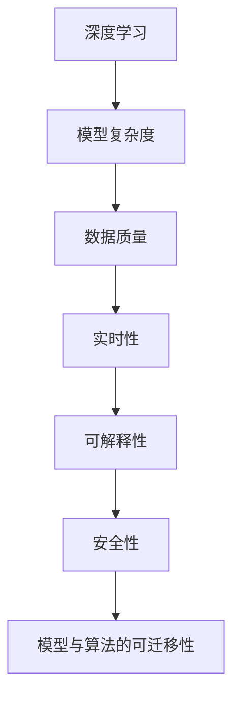
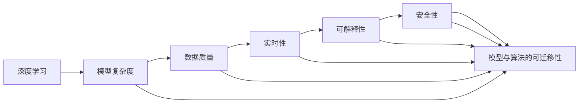

                 

# 计算变化带来的自动化挑战

> 关键词：自动化,计算变化,机器学习,深度学习,模型优化,技术挑战,未来展望

## 1. 背景介绍

### 1.1 问题由来
近年来，随着计算能力的飞速发展和数据量的激增，人工智能（AI）尤其是深度学习（Deep Learning）技术在多个领域取得了显著的进展。从语音识别、图像处理到自然语言处理（NLP）、推荐系统，AI技术的应用已经深入到生活的方方面面。然而，这些技术的发展也带来了新的挑战，特别是在自动化（Automation）领域。自动化是指通过计算机和AI技术，自动完成人类原本需要手工完成的任务。随着计算能力和数据量的不断提升，AI技术在自动化领域的应用也越来越广泛。但同时，计算变化也带来了新的技术挑战，这些挑战对于未来的自动化系统设计和实现都有着深远的影响。

### 1.2 问题核心关键点
目前，计算变化在自动化领域带来的一些主要挑战包括：

- **模型复杂度增加**：随着计算能力的提升，AI模型的参数量急剧增加，模型的复杂度也相应提升。这对于模型的训练、推理和部署都提出了更高的要求。
- **数据质量与多样性**：自动化系统依赖大量的数据进行训练和优化，但高质量数据的获取和处理往往成本高昂，且数据的多样性对于模型的泛化能力有着重要影响。
- **实时性和可解释性**：自动化系统需要在保证性能的同时，提供实时响应和可解释性，以便于人类理解和调试。
- **系统安全性**：随着自动化系统的广泛应用，其安全性问题也日益凸显。如何确保系统稳定运行，避免潜在的风险，是自动化系统设计中的重要问题。
- **模型与算法的可迁移性**：如何设计通用的模型和算法，使得它们能够在不同的应用场景和数据集上进行迁移，是一个重要的研究方向。

这些挑战不仅影响了自动化系统的开发和部署，也对未来自动化技术的发展方向提出了新的要求。本文将深入探讨这些挑战，并提出一些可能的解决方案，以期为未来的自动化系统设计提供有价值的参考。

## 2. 核心概念与联系

### 2.1 核心概念概述

为了更好地理解计算变化在自动化领域带来的挑战，本节将介绍几个关键概念，并展示它们之间的联系。

- **深度学习（Deep Learning）**：一种基于多层神经网络的机器学习技术，具有强大的特征提取和泛化能力。深度学习模型通常包含大量参数，能够处理复杂的非线性关系。

- **模型复杂度（Model Complexity）**：指AI模型的参数量和计算复杂度。随着计算能力的提升，模型的复杂度也在不断增加，这对于模型的训练和推理提出了更高的要求。

- **数据质量（Data Quality）**：指数据集的完整性、准确性和多样性。高质量的数据是AI系统性能的重要保证，但获取高质量数据的成本和难度也在不断增加。

- **实时性（Real-Time）**：指AI系统能够快速响应用户请求，提供实时反馈的能力。这要求系统具备高效的数据处理能力和快速的计算能力。

- **可解释性（Explainability）**：指AI系统输出结果的可解释性，即系统能够清晰地解释其决策过程和结果。这对于人类理解和信任AI系统至关重要。

- **安全性（Security）**：指AI系统在运行过程中的安全性，包括数据隐私保护、模型鲁棒性和系统稳定运行等方面。

- **模型与算法的可迁移性（Model and Algorithm Transferability）**：指模型和算法在不同数据集和应用场景下的迁移能力，这对于跨领域应用和未来技术发展具有重要意义。

这些概念之间相互关联，共同构成了计算变化在自动化领域带来的挑战。以下将通过Mermaid流程图展示这些概念之间的联系：



### 2.2 概念间的关系

这些核心概念之间存在紧密的联系，通过以下Mermaid流程图来展示：



这个综合流程图展示了深度学习、模型复杂度、数据质量、实时性、可解释性、安全性以及模型与算法可迁移性之间的联系和相互作用。通过这些概念的相互影响，我们可以看到计算变化在自动化领域带来的复杂挑战，以及需要考虑的多维因素。

## 3. 核心算法原理 & 具体操作步骤
### 3.1 算法原理概述

深度学习在自动化领域的应用，主要通过模型训练和优化来实现。模型的训练和优化是自动化的核心任务，通过大量的数据和计算，使模型能够学习到数据的特征，并根据任务需求进行优化。以下是深度学习模型训练和优化的基本流程：

1. **数据预处理**：将原始数据进行清洗、归一化和标准化，以便于模型处理。
2. **模型训练**：使用训练数据集对模型进行多次迭代训练，调整模型参数，使其能够拟合数据。
3. **模型验证**：使用验证数据集对模型进行评估，检查模型泛化能力。
4. **模型优化**：根据验证结果对模型进行参数调整和优化，提高模型性能。
5. **模型部署**：将优化后的模型部署到实际应用中，进行实时推理和预测。

在上述流程中，模型的训练和优化是最关键的环节，也是计算变化带来的主要挑战之一。深度学习模型参数量巨大，训练和优化过程需要大量的计算资源和数据，这对硬件设备和数据质量都提出了更高的要求。

### 3.2 算法步骤详解

以下是深度学习模型训练和优化的一般步骤：

**Step 1: 数据准备**
- 收集和清洗数据集，准备训练集、验证集和测试集。
- 对数据进行预处理，如归一化、标准化、数据增强等。
- 将数据集划分为训练集和验证集。

**Step 2: 模型构建**
- 选择合适的模型架构，如卷积神经网络（CNN）、循环神经网络（RNN）、Transformer等。
- 定义模型的输入输出，设置超参数如学习率、批大小等。

**Step 3: 模型训练**
- 使用训练集对模型进行前向传播和后向传播，计算损失函数。
- 使用优化算法（如Adam、SGD等）更新模型参数。
- 周期性地在验证集上评估模型性能，防止过拟合。
- 重复训练过程，直到模型性能收敛或达到预设轮数。

**Step 4: 模型验证和优化**
- 使用验证集对模型进行验证，计算指标如准确率、精度、召回率等。
- 根据验证结果调整模型参数，如学习率、批大小、正则化参数等。
- 重复验证和优化过程，直至模型性能满足要求。

**Step 5: 模型部署和测试**
- 将优化后的模型部署到实际应用中。
- 使用测试集对模型进行评估，测试模型在实际应用中的性能。
- 根据测试结果进行必要的调整，以提高模型性能。

### 3.3 算法优缺点

深度学习模型训练和优化的优缺点如下：

**优点**：
- 能够处理复杂的非线性关系，具有强大的特征提取能力。
- 在大规模数据集上进行训练，能够学习到丰富的知识。
- 通过优化算法，能够自动调整模型参数，提高模型性能。

**缺点**：
- 需要大量的计算资源和数据，训练时间较长。
- 模型复杂度增加，导致推理和部署的难度增加。
- 数据质量和多样性对模型性能有重要影响。
- 实时性和可解释性问题尚未完全解决。
- 模型安全性需要特别关注。
- 模型与算法的可迁移性仍需进一步研究。

### 3.4 算法应用领域

深度学习模型训练和优化技术已经被广泛应用于多个领域，以下是其中几个典型应用：

- **图像处理**：如图像分类、物体检测、图像生成等。通过深度学习模型，可以实现高效的图像处理和分析。
- **语音识别**：如语音识别、语音合成等。深度学习模型能够处理语音信号，实现自然语音交互。
- **自然语言处理（NLP）**：如机器翻译、情感分析、文本生成等。深度学习模型可以处理自然语言，实现自动化文本处理。
- **推荐系统**：如电商推荐、音乐推荐等。深度学习模型能够根据用户历史行为，推荐个性化的商品或内容。
- **医疗诊断**：如医学影像分析、病理诊断等。深度学习模型可以处理医疗影像，辅助医生诊断和治疗。

## 4. 数学模型和公式 & 详细讲解 & 举例说明
### 4.1 数学模型构建

深度学习模型的数学模型通常包括输入层、隐藏层和输出层。以下是一个典型的卷积神经网络（CNN）模型：

$$
f(x; \theta) = W_{out} \cdot \sigma(W_{fc} \cdot \sigma(W_{conv} \cdot x + b_{conv}) + b_{fc}) + b_{out}
$$

其中，$x$ 为输入数据，$\theta$ 为模型参数，$W_{out}$、$W_{fc}$、$W_{conv}$ 为权重矩阵，$b_{out}$、$b_{fc}$、$b_{conv}$ 为偏置向量，$\sigma$ 为激活函数。

### 4.2 公式推导过程

以卷积神经网络为例，推导其前向传播过程：

1. **卷积层**：
$$
C(x; W_{conv}, b_{conv}) = \{c_1(x; W_{conv}, b_{conv}), c_2(x; W_{conv}, b_{conv}), ..., c_n(x; W_{conv}, b_{conv})\}
$$

其中，$c_i(x; W_{conv}, b_{conv})$ 为第 $i$ 个卷积核的输出。

2. **池化层**：
$$
P(C; max\_pool) = \{p_1, p_2, ..., p_m\}
$$

其中，$p_i$ 为第 $i$ 个池化单元的输出。

3. **全连接层**：
$$
F(P; W_{fc}, b_{fc}) = W_{fc} \cdot P + b_{fc}
$$

其中，$W_{fc}$ 为全连接层权重矩阵，$b_{fc}$ 为全连接层偏置向量。

4. **输出层**：
$$
O(F; W_{out}, b_{out}) = W_{out} \cdot \sigma(F; W_{fc}, b_{fc}) + b_{out}
$$

其中，$W_{out}$ 为输出层权重矩阵，$b_{out}$ 为输出层偏置向量。

### 4.3 案例分析与讲解

以图像分类为例，展示深度学习模型的应用。

**案例背景**：
图像分类任务是将输入的图像分类到预定义的类别中，如猫、狗、汽车等。深度学习模型可以通过训练学习到图像的特征，并实现自动分类。

**模型选择**：
选择预训练的ResNet模型，包含多个卷积层和全连接层。

**数据准备**：
准备图像数据集，如ImageNet数据集。对数据进行预处理，如归一化、数据增强等。

**模型训练**：
使用训练集对模型进行前向传播和后向传播，计算损失函数。使用优化算法（如Adam）更新模型参数。在验证集上评估模型性能，防止过拟合。重复训练过程，直至模型性能收敛或达到预设轮数。

**模型验证和优化**：
使用验证集对模型进行验证，计算指标如准确率、精度、召回率等。根据验证结果调整模型参数，如学习率、批大小、正则化参数等。重复验证和优化过程，直至模型性能满足要求。

**模型部署和测试**：
将优化后的模型部署到实际应用中。使用测试集对模型进行评估，测试模型在实际应用中的性能。根据测试结果进行必要的调整，以提高模型性能。

## 5. 项目实践：代码实例和详细解释说明
### 5.1 开发环境搭建

在开始项目实践前，需要准备好开发环境。以下是使用Python进行TensorFlow开发的环境配置流程：

1. 安装Anaconda：从官网下载并安装Anaconda，用于创建独立的Python环境。

2. 创建并激活虚拟环境：
```bash
conda create -n tf-env python=3.8 
conda activate tf-env
```

3. 安装TensorFlow：根据CUDA版本，从官网获取对应的安装命令。例如：
```bash
conda install tensorflow tensorflow-gpu -c conda-forge
```

4. 安装各类工具包：
```bash
pip install numpy pandas scikit-learn matplotlib tqdm jupyter notebook ipython
```

完成上述步骤后，即可在`tf-env`环境中开始项目实践。

### 5.2 源代码详细实现

下面以图像分类任务为例，给出使用TensorFlow进行卷积神经网络（CNN）模型训练的代码实现。

首先，定义CNN模型的结构：

```python
import tensorflow as tf
from tensorflow.keras import layers, models

model = models.Sequential()
model.add(layers.Conv2D(32, (3, 3), activation='relu', input_shape=(28, 28, 1)))
model.add(layers.MaxPooling2D((2, 2)))
model.add(layers.Conv2D(64, (3, 3), activation='relu'))
model.add(layers.MaxPooling2D((2, 2)))
model.add(layers.Conv2D(64, (3, 3), activation='relu'))
model.add(layers.Flatten())
model.add(layers.Dense(64, activation='relu'))
model.add(layers.Dense(10, activation='softmax'))
```

然后，定义训练和评估函数：

```python
import numpy as np
from sklearn.model_selection import train_test_split
from tensorflow.keras.datasets import mnist
from tensorflow.keras.utils import to_categorical

(x_train, y_train), (x_test, y_test) = mnist.load_data()
x_train = x_train.reshape((60000, 28, 28, 1))
x_test = x_test.reshape((10000, 28, 28, 1))
x_train, x_val, y_train, y_val = train_test_split(x_train, y_train, test_size=0.2)

model.compile(optimizer='adam', loss='categorical_crossentropy', metrics=['accuracy'])

def train_epoch(model, x_train, y_train):
    model.fit(x_train, y_train, batch_size=32, epochs=1, validation_data=(x_val, y_val))

def evaluate(model, x_test, y_test):
    loss, acc = model.evaluate(x_test, y_test)
    print(f'Test loss: {loss:.2f}')
    print(f'Test accuracy: {acc:.2f}')

train_epoch(model, x_train, y_train)
evaluate(model, x_test, y_test)
```

最后，启动训练流程并在测试集上评估：

```python
epochs = 10

for epoch in range(epochs):
    train_epoch(model, x_train, y_train)
    evaluate(model, x_test, y_test)
```

以上就是使用TensorFlow对CNN模型进行图像分类任务微调的完整代码实现。可以看到，TensorFlow提供了丰富的API，使得模型训练和优化变得简单高效。

### 5.3 代码解读与分析

让我们再详细解读一下关键代码的实现细节：

**模型结构**：
- 使用`Sequential`模型构建卷积神经网络。
- 第一层为卷积层，使用32个3x3的卷积核，激活函数为ReLU。
- 第二层为池化层，使用2x2的最大池化。
- 第三层和第四层分别为卷积层和池化层，使用64个3x3的卷积核，激活函数为ReLU。
- 第五层为全连接层，使用64个神经元，激活函数为ReLU。
- 第六层为输出层，使用10个神经元，激活函数为Softmax。

**数据准备**：
- 使用`mnist.load_data()`加载MNIST数据集。
- 将图像数据转换为模型期望的输入形状。
- 将标签数据转换为one-hot编码。
- 使用`train_test_split()`将数据集划分为训练集和验证集。

**模型训练和评估**：
- 使用`compile()`方法定义模型的优化器、损失函数和评估指标。
- 定义训练函数`train_epoch`，对模型进行前向传播和后向传播，计算损失函数，并使用验证集进行评估。
- 定义评估函数`evaluate`，使用测试集评估模型性能。
- 循环训练过程，直至达到预设轮数。

**运行结果展示**：
- 在训练集上训练模型，并在验证集上评估模型性能。
- 在测试集上评估模型性能，输出测试损失和准确率。

## 6. 实际应用场景

### 6.1 工业检测

深度学习在工业检测领域的应用广泛，如质量检测、缺陷检测等。通过训练深度学习模型，可以实现自动化检测，提高生产效率和质量。

在实际应用中，可以采集生产线上的图像数据，使用卷积神经网络（CNN）模型进行训练和优化。模型能够在不同工位上检测产品的质量，判断产品是否合格。一旦发现不合格产品，系统将自动进行报警和处理，提高生产效率和产品质量。

### 6.2 医疗影像分析

深度学习在医疗影像分析中的应用也日益广泛，如医学影像分类、病变检测等。通过训练深度学习模型，可以实现自动化诊断和治疗。

在实际应用中，可以使用医学影像数据进行训练，训练深度学习模型进行疾病分类和病变检测。模型能够自动识别影像中的病变区域，帮助医生快速诊断和治疗疾病。此外，深度学习模型还可以结合其他医疗数据，如电子病历、基因信息等，提供更全面的诊断和治疗方案。

### 6.3 自动驾驶

深度学习在自动驾驶领域的应用前景广阔，如车辆识别、车道保持、交通信号识别等。通过训练深度学习模型，可以实现自动驾驶功能，提高交通安全性。

在实际应用中，可以使用车辆图像、雷达数据和GPS数据进行训练，训练深度学习模型进行车辆识别和车道保持。模型能够自动判断交通信号和路况，实现安全行驶。此外，深度学习模型还可以结合其他传感器数据，如激光雷达、毫米波雷达等，实现更全面和可靠的自动驾驶功能。

## 7. 工具和资源推荐
### 7.1 学习资源推荐

为了帮助开发者系统掌握深度学习在自动化领域的应用，以下是一些优质的学习资源：

1. 《深度学习》课程（Coursera）：由斯坦福大学Andrew Ng教授主讲，系统介绍深度学习的基本概念和常用技术。
2. 《动手学深度学习》书籍：由李沐等人编写，详细讲解深度学习的理论和实践，包含大量代码示例。
3. 《Python深度学习》书籍：由Francois Chollet等人编写，涵盖深度学习的理论基础和应用实践，适合初学者入门。
4. 深度学习框架文档：如TensorFlow、PyTorch、Keras等框架的官方文档，提供详细的使用指南和API参考。
5. arXiv论文预印本：人工智能领域最新研究成果的发布平台，包含大量前沿论文和代码示例。

通过对这些资源的学习，相信你一定能够掌握深度学习在自动化领域的应用技术，并用于解决实际的自动化问题。

### 7.2 开发工具推荐

高效开发离不开优秀的工具支持。以下是几款用于深度学习在自动化领域开发的常用工具：

1. TensorFlow：由Google开发的最流行的深度学习框架之一，支持分布式训练和多种硬件加速。
2. PyTorch：由Facebook开发的深度学习框架，灵活的动态计算图使得模型构建和调试更加容易。
3. Keras：高层次的深度学习框架，支持多种后端，易于上手。
4. Jupyter Notebook：交互式编程环境，支持实时可视化和代码运行，适合快速迭代开发。
5. TensorBoard：TensorFlow配套的可视化工具，可实时监测模型训练状态，提供丰富的图表呈现方式。

合理利用这些工具，可以显著提升深度学习在自动化领域的开发效率，加快创新迭代的步伐。

### 7.3 相关论文推荐

深度学习在自动化领域的应用研究主要集中在以下几个方面：

1. 《Deep Learning for Healthcare: From Diagnosis to Treatment》：介绍深度学习在医疗影像分析和疾病预测中的应用。
2. 《Deep Learning for Autonomous Driving》：讨论深度学习在自动驾驶中的关键技术，如车辆识别、车道保持等。
3. 《Deep Learning for Industrial Inspection》：探讨深度学习在工业检测中的应用，如质量检测、缺陷检测等。
4. 《Deep Learning for Image Classification》：介绍深度学习在图像分类任务中的应用，如卷积神经网络（CNN）模型。

这些论文代表了大深度学习在自动化领域的研究方向和最新成果，值得深入阅读和研究。

## 8. 总结：未来发展趋势与挑战
### 8.1 研究成果总结

本文对深度学习在自动化领域的应用进行了全面系统的介绍。首先阐述了计算变化在自动化领域带来的挑战，包括模型复杂度增加、数据质量与多样性、实时性和可解释性、安全性以及模型与算法的可迁移性。接着，从算法原理、操作步骤、优缺点和应用领域等方面，详细讲解了深度学习在自动化领域的应用。最后，通过数据分析、模型构建和优化、代码实现和实际应用场景等，展示了深度学习在自动化领域的应用实践。

通过本文的系统梳理，可以看到深度学习在自动化领域的应用具有广泛的前景，但也面临着诸多挑战。未来，随着计算能力的进一步提升和数据量的不断增加，深度学习在自动化领域的应用将更加深入和广泛。

### 8.2 未来发展趋势

展望未来，深度学习在自动化领域的发展将呈现以下几个趋势：

1. **计算能力的提升**：随着计算能力的不断提升，深度学习模型的复杂度将进一步增加，模型性能也将不断提升。
2. **数据质量的提升**：未来，高质量数据集的获取和处理将更加容易，数据的多样性将更加丰富，模型性能将进一步提升。
3. **实时性的提升**：未来，深度学习模型的推理速度和实时响应能力将进一步提升，系统性能将更加高效。
4. **可解释性的提升**：未来，深度学习模型的可解释性将进一步提升，模型决策过程将更加透明和可理解。
5. **安全性的提升**：未来，深度学习模型的安全性将进一步提升，模型稳定性和鲁棒性将更加可靠。
6. **可迁移性的提升**：未来，深度学习模型的可迁移性将进一步提升，模型能够在不同应用场景和数据集上进行迁移。

### 8.3 面临的挑战

尽管深度学习在自动化领域的应用前景广阔，但仍面临诸多挑战：

1. **计算资源的需求**：深度学习模型的训练和优化需要大量的计算资源和数据，这对硬件设备和数据质量提出了更高的要求。
2. **数据质量和多样性的问题**：高质量数据的获取和处理成本高昂，且数据的多样性对模型性能有重要影响。
3. **实时性和可解释性的问题**：深度学习模型在实时性和可解释性方面仍需进一步研究。
4. **安全性问题**：深度学习模型的安全性需要特别关注，以避免潜在的风险。
5. **可迁移性的问题**：深度学习模型在不同数据集和应用场景下的迁移能力仍需进一步研究。

### 8.4 研究展望

面对深度学习在自动化领域面临的挑战，未来的研究需要在以下几个方面寻求新的突破：

1. **探索无监督和半监督学习**：摆脱对大规模标注数据的依赖，利用自监督学习、主动学习等无监督和半监督范式，最大限度利用非结构化数据，实现更加灵活高效的自动化系统。
2. **研究参数高效和计算高效的优化方法**：开发更加参数高效和计算高效的优化算法，以应对计算资源的需求和提高模型推理速度。
3. **引入因果推断和对比学习**：通过引入因果推断和对比学习，增强自动化系统的稳定性和鲁棒性，学习更加普适的语言表征。
4. **融合多模态数据**：将符号化的先验知识，如知识图谱、逻辑规则等，与深度学习模型进行融合，增强模型的迁移能力和泛化能力。
5. **结合因果分析和博弈论**：将因果分析和博弈论工具引入自动化系统，提高系统稳定性和鲁棒性。
6. **纳入伦理和道德约束**：在自动化系统的训练和优化过程中，纳入伦理和道德约束，避免潜在的偏见和歧视问题。

## 9. 附录：常见问题与解答

**Q1：深度学习模型在自动化领域有哪些优势？**

A: 深度学习模型在自动化领域具有以下优势：

- 能够处理复杂的非线性关系，具有强大的特征提取能力。
- 在大规模数据集上进行训练，能够学习到丰富的知识。
- 通过优化算法，能够自动调整模型参数，提高模型性能。

**Q2：深度学习模型在自动化领域有哪些挑战？**

A: 深度学习模型在自动化领域面临以下挑战：

- 需要大量的计算资源和数据，训练时间较长。
- 模型复杂度增加，导致推理和部署的难度增加。
- 数据质量和多样性对模型性能有重要影响。
- 实时性和可解释性问题尚未完全解决。
- 模型安全性需要特别关注。
- 模型与算法的可迁移性仍需进一步研究。

**Q3：如何提升深度学习模型在自动化领域的应用？**

A: 提升深度学习模型在自动化领域的应用，可以从以下几个方面进行改进：


