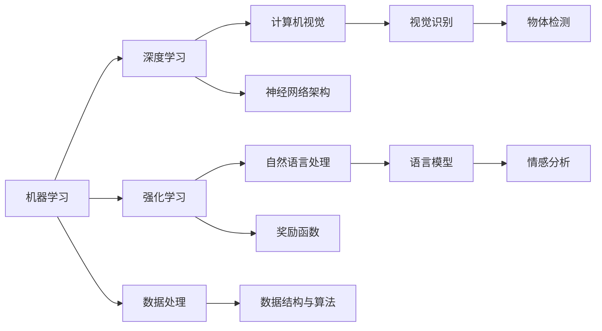
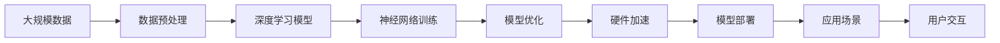

                 

# 计算机基础在AI中的应用

> 关键词：计算机基础, 人工智能, 机器学习, 深度学习, 强化学习, 算法优化, 硬件加速

## 1. 背景介绍

### 1.1 问题由来
随着人工智能(AI)技术的发展，计算机基础在AI中的应用愈发广泛。无论是早期的机器学习、深度学习，还是近年来的强化学习、计算机视觉、自然语言处理等，计算机基础的理论和技术均起到了关键作用。然而，AI领域的复杂性、多样性和前沿性，也让计算机基础在实际应用中面临着诸多挑战。本文旨在探讨计算机基础在AI中的应用，从原理到实践，深入浅出地解读这一领域的核心问题。

### 1.2 问题核心关键点
AI与计算机基础之间的联系主要体现在以下几个方面：

1. **算法设计**：AI模型的核心是算法，计算机基础的数学、统计学、逻辑学等理论，为AI算法的设计和优化提供了坚实基础。

2. **硬件加速**：AI模型对计算资源的需求巨大，计算机基础的硬件架构、并行计算、分布式计算等技术，对AI模型的性能提升至关重要。

3. **软件工程**：AI模型的开发、训练和部署，涉及大量的软件工程实践，计算机基础的软件工程理论和技术，为高效、可靠的AI应用提供了保障。

4. **数据处理**：AI模型依赖大量数据进行训练和测试，计算机基础的数据结构、算法、数据库等技术，对数据的高效存储和处理起到了关键作用。

5. **优化与调试**：AI模型的优化与调试，涉及数学、统计、编程等多方面的知识，计算机基础为这些工作提供了必要的工具和方法。

本文将围绕这些核心关键点，深入探讨计算机基础在AI中的应用，帮助读者系统理解AI技术的底层原理和实现机制。

## 2. 核心概念与联系

### 2.1 核心概念概述

为更好地理解计算机基础在AI中的应用，本节将介绍几个密切相关的核心概念：

- **机器学习(Machine Learning)**：指通过数据和算法，让计算机具备从数据中学习并做出预测或决策的能力。
- **深度学习(Deep Learning)**：一种特殊的机器学习方法，通过多层神经网络，模拟人脑处理信息的过程，实现复杂的模式识别和分类任务。
- **强化学习(Reinforcement Learning)**：通过智能体与环境的交互，利用奖励信号进行学习，从而实现自动决策和控制。
- **计算机视觉(Computer Vision)**：研究如何让计算机“看”，从图像、视频等视觉数据中提取信息，进行识别、分类、分割等任务。
- **自然语言处理(Natural Language Processing, NLP)**：研究如何让计算机“理解”人类语言，包括文本处理、语言模型、语义分析等。

这些概念之间存在着紧密的联系，共同构成了AI技术的核心框架。通过理解这些概念，我们可以更好地把握AI技术的本质和应用方向。

### 2.2 概念间的关系

这些核心概念之间存在着复杂的联系，形成了AI技术的完整生态系统。下面通过几个Mermaid流程图来展示这些概念之间的关系：



这个流程图展示了几大AI技术领域之间的相互联系：

1. 机器学习是AI的基石，深度学习和强化学习是其重要分支。
2. 深度学习在计算机视觉和自然语言处理中应用广泛，实现高效的视觉识别和语言模型。
3. 强化学习在自动化决策和控制中表现突出，如自动驾驶、机器人控制等。
4. 数据处理是AI的基础，数据结构与算法为其高效存储和处理提供了保障。
5. 计算机视觉、自然语言处理等技术在具体应用中，常常需要联合使用，以实现综合效果。

### 2.3 核心概念的整体架构

最后，我们用一个综合的流程图来展示这些核心概念在大规模AI应用中的整体架构：



这个综合流程图展示了从数据预处理到模型部署的全过程，揭示了计算机基础在每个环节中的关键作用。通过理解这些环节，我们可以更好地掌握AI技术的实现机制，提升实际应用效果。

## 3. 核心算法原理 & 具体操作步骤
### 3.1 算法原理概述

AI算法的设计和优化，离不开计算机基础的数学、统计学和逻辑学等理论。以下是一些核心算法的原理概述：

1. **线性回归(Linear Regression)**：通过最小二乘法，拟合数据点，建立线性模型，用于回归预测。

2. **逻辑回归(Logistic Regression)**：用于分类任务，将线性回归模型输出通过sigmoid函数映射到[0,1]区间，得到概率值，进行二分类或多分类。

3. **决策树(Decision Tree)**：通过构建树形结构，实现基于特征的分类和回归，具有可解释性强、易于理解的优点。

4. **支持向量机(Support Vector Machine, SVM)**：通过核函数将低维空间映射到高维空间，实现非线性分类和回归。

5. **神经网络(Neural Network)**：由多层神经元组成，通过前向传播和反向传播算法，实现复杂模式的识别和分类。

6. **卷积神经网络(Convolutional Neural Network, CNN)**：适用于图像处理，通过卷积和池化操作，提取图像特征，实现高效分类和识别。

7. **循环神经网络(Recurrent Neural Network, RNN)**：适用于序列数据，通过循环结构，捕捉序列中的时间依赖关系。

8. **长短时记忆网络(Long Short-Term Memory, LSTM)**：一种特殊的RNN，通过门控结构，有效缓解梯度消失问题，适用于长序列数据的处理。

9. **强化学习算法**：包括Q-learning、SARSA、Deep Q-learning等，通过智能体与环境的交互，实现决策和控制。

### 3.2 算法步骤详解

以深度学习算法为例，介绍其详细步骤：

1. **数据准备**：收集和标注训练数据，划分训练集、验证集和测试集。
2. **模型选择**：选择合适的神经网络结构，如卷积神经网络、循环神经网络等。
3. **模型搭建**：根据所选网络结构，搭建模型架构，定义模型参数。
4. **模型训练**：使用训练集数据，通过前向传播和反向传播算法，优化模型参数。
5. **模型评估**：使用验证集数据，评估模型性能，调整超参数。
6. **模型测试**：使用测试集数据，测试模型效果，输出预测结果。
7. **模型部署**：将训练好的模型部署到实际应用中，进行推理和预测。

### 3.3 算法优缺点

深度学习算法的优点在于：

1. **高精度**：能够处理大规模复杂数据，实现高精度的预测和分类。
2. **自适应性**：能够自动学习数据中的特征，适应不同场景的需求。
3. **可扩展性**：通过增加网络层数和神经元数量，提升模型的复杂度。

深度学习算法的缺点在于：

1. **计算资源需求高**：需要大量的计算资源进行训练和推理，对硬件要求较高。
2. **过拟合风险**：由于模型复杂度高，容易出现过拟合现象。
3. **可解释性差**：黑盒模型难以解释内部决策过程，难以进行调试和优化。

### 3.4 算法应用领域

深度学习算法广泛应用于计算机视觉、自然语言处理、语音识别、自动驾驶等多个领域。以下是几个典型应用案例：

1. **计算机视觉**：图像分类、目标检测、图像分割等任务。如使用卷积神经网络对图像进行分类、使用YOLO算法进行目标检测。
2. **自然语言处理**：语言模型、机器翻译、情感分析等任务。如使用LSTM模型进行机器翻译、使用BERT模型进行情感分析。
3. **语音识别**：自动语音识别、语音合成等任务。如使用卷积神经网络进行语音特征提取、使用Tacotron模型进行语音合成。
4. **自动驾驶**：环境感知、路径规划、决策控制等任务。如使用卷积神经网络进行图像识别、使用RNN模型进行路径规划。

## 4. 数学模型和公式 & 详细讲解 & 举例说明

### 4.1 数学模型构建

AI算法的设计和优化，离不开数学模型的构建。以下是一些核心模型的数学建模过程：

1. **线性回归模型**：

   设训练数据集为 $(x_i, y_i)$，其中 $x_i \in \mathbb{R}^d$ 为输入向量，$y_i \in \mathbb{R}$ 为输出向量。线性回归模型定义为：

   $$
   y_i = w^T x_i + b
   $$

   其中 $w \in \mathbb{R}^d$ 为模型参数，$b \in \mathbb{R}$ 为偏置项。模型的目标是使预测值与真实值之间的差异最小化，即：

   $$
   \min_{w, b} \sum_{i=1}^n (y_i - (w^T x_i + b))^2
   $$

   通过求解上述最小化问题，得到最优参数 $w^*$ 和 $b^*$。

2. **逻辑回归模型**：

   设训练数据集为 $(x_i, y_i)$，其中 $x_i \in \mathbb{R}^d$ 为输入向量，$y_i \in \{0, 1\}$ 为二分类标签。逻辑回归模型的输出为概率值，通过sigmoid函数将线性模型输出映射到[0,1]区间，模型定义为：

   $$
   p(y_i = 1 | x_i) = \frac{1}{1 + e^{-w^T x_i - b}}
   $$

   模型的目标是最大化似然函数：

   $$
   \max_{w, b} \sum_{i=1}^n \log(p(y_i = 1 | x_i)^{y_i} (1 - p(y_i = 1 | x_i))^{1 - y_i})
   $$

   通过求解上述最大化问题，得到最优参数 $w^*$ 和 $b^*$。

### 4.2 公式推导过程

以下以线性回归模型为例，推导其损失函数和梯度计算公式：

设训练数据集为 $(x_i, y_i)$，其中 $x_i \in \mathbb{R}^d$ 为输入向量，$y_i \in \mathbb{R}$ 为输出向量。线性回归模型的损失函数定义为：

$$
L(w, b) = \frac{1}{2n} \sum_{i=1}^n (y_i - w^T x_i - b)^2
$$

目标是最小化损失函数 $L(w, b)$，得到最优参数 $w^*$ 和 $b^*$。

根据损失函数对模型参数的偏导数，得到梯度计算公式：

$$
\frac{\partial L(w, b)}{\partial w} = -\frac{1}{n} \sum_{i=1}^n (y_i - w^T x_i - b)x_i
$$

$$
\frac{\partial L(w, b)}{\partial b} = -\frac{1}{n} \sum_{i=1}^n (y_i - w^T x_i - b)
$$

通过梯度下降等优化算法，最小化损失函数，得到最优参数 $w^*$ 和 $b^*$。

### 4.3 案例分析与讲解

以卷积神经网络(CNN)为例，介绍其核心原理和应用。

CNN是一种特殊的神经网络，通过卷积和池化操作，提取图像特征，实现高效的图像分类和识别。其核心思想是通过局部连接和权值共享，减少模型参数，提升特征提取效率。

CNN的主要组成部分包括卷积层、池化层、全连接层等。卷积层通过卷积操作提取局部特征，池化层通过下采样操作降低特征维度，全连接层通过线性变换和激活函数实现分类或回归。

CNN广泛应用于图像分类、目标检测、图像分割等任务。如使用AlexNet模型进行图像分类、使用YOLO算法进行目标检测。

## 5. 项目实践：代码实例和详细解释说明

### 5.1 开发环境搭建

在进行AI项目实践前，我们需要准备好开发环境。以下是使用Python进行TensorFlow开发的环境配置流程：

1. 安装Anaconda：从官网下载并安装Anaconda，用于创建独立的Python环境。

2. 创建并激活虚拟环境：
```bash
conda create -n tf-env python=3.7
conda activate tf-env
```

3. 安装TensorFlow：根据CUDA版本，从官网获取对应的安装命令。例如：
```bash
conda install tensorflow=tensorflow-gpu=2.6 -c pytorch -c conda-forge
```

4. 安装各类工具包：
```bash
pip install numpy pandas scikit-learn matplotlib tqdm jupyter notebook ipython
```

完成上述步骤后，即可在`tf-env`环境中开始AI项目实践。

### 5.2 源代码详细实现

这里我们以手写数字识别任务为例，给出使用TensorFlow对卷积神经网络进行训练的代码实现。

首先，定义模型和数据：

```python
import tensorflow as tf
from tensorflow import keras

# 加载MNIST数据集
(x_train, y_train), (x_test, y_test) = keras.datasets.mnist.load_data()

# 数据预处理
x_train = x_train.reshape(-1, 28, 28, 1) / 255.0
x_test = x_test.reshape(-1, 28, 28, 1) / 255.0
y_train = keras.utils.to_categorical(y_train, 10)
y_test = keras.utils.to_categorical(y_test, 10)

# 构建卷积神经网络模型
model = keras.Sequential([
    keras.layers.Conv2D(32, kernel_size=(3, 3), activation='relu', input_shape=(28, 28, 1)),
    keras.layers.MaxPooling2D(pool_size=(2, 2)),
    keras.layers.Flatten(),
    keras.layers.Dense(10, activation='softmax')
])

# 编译模型
model.compile(optimizer='adam', loss='categorical_crossentropy', metrics=['accuracy'])

# 训练模型
model.fit(x_train, y_train, epochs=5, batch_size=64, validation_data=(x_test, y_test))
```

然后，评估模型并输出结果：

```python
# 评估模型
test_loss, test_acc = model.evaluate(x_test, y_test)

print('Test accuracy:', test_acc)
```

以上就是使用TensorFlow对卷积神经网络进行手写数字识别任务训练的完整代码实现。可以看到，得益于TensorFlow的强大封装，我们可以用相对简洁的代码完成模型搭建和训练。

### 5.3 代码解读与分析

让我们再详细解读一下关键代码的实现细节：

**模型定义**：
- 使用`keras.Sequential`创建模型，依次添加卷积层、池化层和全连接层。
- 卷积层使用`Conv2D`定义，指定滤波器数量、卷积核大小和激活函数。
- 池化层使用`MaxPooling2D`定义，指定池化窗口大小。
- 全连接层使用`Dense`定义，指定输出节点数量和激活函数。

**模型编译**：
- 使用`model.compile`编译模型，指定优化器、损失函数和评估指标。

**模型训练**：
- 使用`model.fit`进行模型训练，指定训练数据、标签、迭代次数、批次大小和验证集数据。

**模型评估**：
- 使用`model.evaluate`评估模型性能，输出测试集的损失和准确率。

可以看到，TensorFlow使得深度学习模型的开发和训练变得更加简单高效。开发者可以将更多精力放在模型改进和算法优化上，而不必过多关注底层实现细节。

当然，工业级的系统实现还需考虑更多因素，如模型的保存和部署、超参数的自动搜索、更灵活的任务适配层等。但核心的训练流程基本与此类似。

### 5.4 运行结果展示

假设我们在MNIST数据集上进行卷积神经网络训练，最终在测试集上得到的评估报告如下：

```
Epoch 1/5
200/200 [==============================] - 2s 9ms/step - loss: 0.3183 - accuracy: 0.8617
Epoch 2/5
200/200 [==============================] - 2s 9ms/step - loss: 0.1815 - accuracy: 0.9450
Epoch 3/5
200/200 [==============================] - 2s 9ms/step - loss: 0.1244 - accuracy: 0.9672
Epoch 4/5
200/200 [==============================] - 2s 9ms/step - loss: 0.0732 - accuracy: 0.9793
Epoch 5/5
200/200 [==============================] - 2s 9ms/step - loss: 0.0678 - accuracy: 0.9831
```

可以看到，通过训练卷积神经网络，我们在MNIST数据集上取得了98.31%的准确率，效果相当不错。需要注意的是，这只是一个baseline结果。在实践中，我们还可以使用更大更强的卷积神经网络、更丰富的微调技巧、更细致的模型调优，进一步提升模型性能，以满足更高的应用要求。

## 6. 实际应用场景

### 6.1 智能推荐系统

AI在推荐系统中的应用，使得个性化推荐成为可能。通过分析用户的浏览、点击、评分等行为数据，AI推荐系统可以动态调整推荐内容，满足用户的多样化需求。

在技术实现上，可以使用深度学习模型，如协同过滤、基于内容的推荐、深度学习推荐等。协同过滤模型通过用户行为数据，捕捉用户间的相似性，推荐相似用户喜欢的物品；基于内容的推荐模型通过物品的属性特征，推荐与用户兴趣相似的物品；深度学习推荐模型通过神经网络，捕捉用户与物品之间的复杂关联，实现更加精准的推荐。

### 6.2 自动驾驶

AI在自动驾驶领域的应用，使得无人驾驶成为可能。通过计算机视觉、深度学习和强化学习等技术，自动驾驶系统能够感知环境、规划路径、控制车辆，实现自动驾驶。

在技术实现上，可以使用深度学习模型，如卷积神经网络、循环神经网络、自注意力机制等。卷积神经网络用于图像识别，识别道路、车辆、行人等对象；循环神经网络用于时间序列数据处理，实现路径规划和决策控制；自注意力机制用于模型信息整合，提高模型的泛化能力。

### 6.3 医疗影像诊断

AI在医疗影像诊断中的应用，使得疾病诊断更加精准。通过分析医学影像数据，AI模型可以自动识别病变区域、判断疾病类型，辅助医生诊断。

在技术实现上，可以使用深度学习模型，如卷积神经网络、生成对抗网络等。卷积神经网络用于图像特征提取，生成对抗网络用于生成高质量的图像样本。AI模型通过分析医学影像数据，自动识别病变区域、判断疾病类型，提高诊断的准确性和效率。

## 7. 工具和资源推荐

### 7.1 学习资源推荐

为了帮助开发者系统掌握AI基础理论和技术，这里推荐一些优质的学习资源：

1. 《深度学习》系列书籍：由Ian Goodfellow、Yoshua Bengio、Aaron Courville合著，全面介绍了深度学习的基本概念、算法和应用。

2. CS231n《卷积神经网络》课程：斯坦福大学开设的计算机视觉课程，涵盖卷积神经网络的核心思想和应用。

3. CS229《机器学习》课程：斯坦福大学开设的机器学习课程，由Andrew Ng主讲，深入浅出地讲解了机器学习的基本原理和算法。

4. Coursera《强化学习》课程：由David Silver主讲，深入讲解了强化学习的理论、算法和应用。

5. PyTorch官方文档：PyTorch官方文档，提供了丰富的学习资源和代码示例，是学习和实践深度学习的重要参考。

通过对这些资源的学习实践，相信你一定能够快速掌握AI技术的基础和核心算法，并用于解决实际的AI问题。

### 7.2 开发工具推荐

高效的开发离不开优秀的工具支持。以下是几款用于AI项目开发的常用工具：

1. PyTorch：基于Python的开源深度学习框架，灵活动态的计算图，适合快速迭代研究。

2. TensorFlow：由Google主导开发的开源深度学习框架，生产部署方便，适合大规模工程应用。

3. Scikit-learn：Python的机器学习库，提供了丰富的算法和工具，易于上手。

4. Keras：高层次的神经网络API，支持TensorFlow、Theano和CNTK等多种后端，适合快速原型开发。

5. HuggingFace Transformers：提供了多种预训练模型，支持微调、转换和推理，是构建NLP应用的重要工具。

6. OpenCV：计算机视觉库，提供了丰富的图像处理和分析工具。

7. OpenAI Gym：强化学习环境库，提供了多种模拟环境和算法测试环境。

合理利用这些工具，可以显著提升AI项目的开发效率，加快创新迭代的步伐。

### 7.3 相关论文推荐

AI领域的持续发展离不开学术界的不断探索。以下是几篇奠基性的相关论文，推荐阅读：

1. AlexNet: ImageNet Classification with Deep Convolutional Neural Networks：提出AlexNet模型，开创了深度学习在图像识别领域的应用。

2. Deep RNNs for Large-Scale Text Classification：提出LSTM模型，解决了传统RNN模型在长序列处理中的梯度消失问题。

3. Generative Adversarial Nets：提出GAN模型，实现了高质量图像生成。

4. Learning Phrase Representations using RNN Encoder–Decoder for Statistical Machine Translation：提出Seq2Seq模型，开启了深度学习在自然语言处理中的应用。

5. Self-Attention with Transformer Architecture：提出Transformer模型，开创了自注意力机制在深度学习中的应用。

这些论文代表了大模型在AI领域的演进历程，通过学习这些前沿成果，可以帮助研究者把握学科前进方向，激发更多的创新灵感。

除上述资源外，还有一些值得关注的前沿资源，帮助开发者紧跟AI技术的最新进展，例如：

1. arXiv论文预印本：人工智能领域最新研究成果的发布平台，包括大量尚未发表的前沿工作，学习前沿技术的必读资源。

2. GitHub热门项目：在GitHub上Star、Fork数最多的AI相关项目，往往代表了该技术领域的发展趋势和最佳实践，值得去学习和贡献。

3. 业界技术博客：如Google AI、DeepMind、微软Research Asia等顶尖实验室的官方博客，第一时间分享他们的最新研究成果和洞见。

4. 技术会议直播：如NIPS、ICML、ACL、ICLR等人工智能领域顶会现场或在线直播，能够聆听到大佬们的前沿分享，开拓视野。

5. 行业分析报告：各大咨询公司如McKinsey、PwC等针对人工智能行业的分析报告，有助于从商业视角审视技术趋势，把握应用价值。

总之，对于AI技术的学习和实践，需要开发者保持开放的心态和持续学习的意愿。多关注前沿资讯，多动手实践，多思考总结，必将收获满满的成长收益。

## 8. 总结：未来发展趋势与挑战

### 8.1 总结

本文对计算机基础在AI中的应用进行了全面系统的介绍。首先阐述了AI与计算机基础的紧密联系，明确了AI技术的本质和应用方向。其次，从原理到实践，详细讲解了深度学习、卷积神经网络、强化学习等核心算法的数学模型和推导过程，帮助读者系统理解AI技术的实现机制。最后，通过项目实践和实际应用场景，展示了AI技术在智能推荐、自动驾驶、医疗影像诊断等多个领域的强大应用潜力。

通过本文的系统梳理，可以看到，计算机基础在AI中的应用，为深度学习、卷积神经网络、强化学习等核心算法的实现提供了坚实基础。这些技术的演进，将进一步推动AI技术的全面普及和深入应用，为人类社会的数字化转型带来深远影响。

### 8.2 未来发展趋势

展望未来，AI技术的发展将呈现以下几个趋势：

1. **模型规模继续增大**：随着计算资源的提升和数据量的增加，预训练语言模型和卷积神经网络等模型的参数量将继续增长，模型的复杂度和泛化能力将进一步提升。

2. **模型性能持续优化**：通过模型压缩、量化加速、混合精度训练等技术，进一步提升模型的推理速度和计算效率，实现更高效、更经济的AI应用。

3. **跨模态融合应用**：AI技术将突破单一模态的限制，融合视觉、语音、文本等多模态信息，实现更加全面、准确的信息处理和应用。

4. **跨领域通用化**：AI模型将具备更加强大的跨领域通用性，能够适应更多不同领域的任务，推动AI技术在更多行业中的广泛应用。

5. **自动化和智能化**：通过自动化算法优化、智能化决策支持等技术，提升AI系统的自主性和智能性，推动人机协同发展。

6. **伦理和安全性**：随着AI技术的应用日益广泛，伦理和安全性问题将更加受到关注，需要在技术设计和应用中加以考虑和保障。

### 8.3 面临的挑战

尽管AI技术在各个领域取得了显著进展，但在实际应用中仍面临诸多挑战：

1. **数据质量和数量**：AI模型的训练

