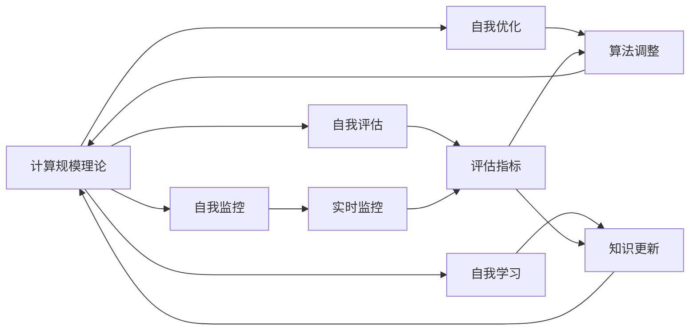
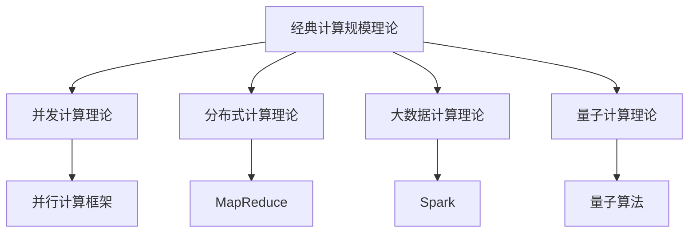
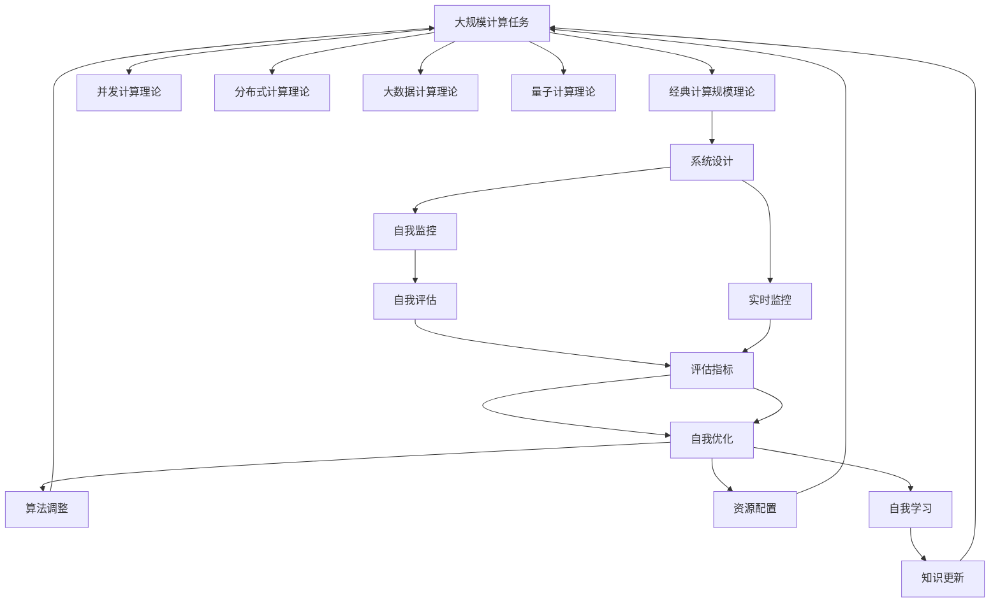

                 

## 1. 背景介绍

### 1.1 问题由来

计算规模理论（Theory of Computation）是计算机科学的基础理论之一，主要研究计算任务的可计算性、计算效率与计算复杂性。其研究核心是如何在有限的时间和空间内高效解决各类计算问题，尤其是那些大规模、复杂、多维度的计算任务。计算规模理论的诞生和发展，为计算机科学的各个分支提供了坚实的理论基础。然而，随着计算技术的不断进步和应用场景的不断扩展，传统的计算规模理论已经无法完全满足现代计算的需求，尤其是那些具有自我改进能力的系统。

### 1.2 问题核心关键点

计算规模理论与自我改进紧密相连。传统的计算规模理论主要关注如何在给定的时间和空间内求解问题，而自我改进则是在传统计算规模理论的基础上，研究如何通过迭代、优化、学习等方式，不断提升计算任务的效率和效果，最终实现系统性能的不断提升。具体来说，自我改进的核心关键点包括：

- 自我监控：系统能够实时监控自身的运行状态和性能表现，及时发现问题。
- 自我评估：系统能够对自身的能力和性能进行客观评估，了解自身优势和不足。
- 自我优化：系统能够根据评估结果，自动调整算法、优化资源配置，提升性能。
- 自我学习：系统能够从历史数据和经验中学习，不断提高自身的能力和适应性。

### 1.3 问题研究意义

研究计算规模理论与自我改进，对于拓展计算机科学的理论边界，推动计算技术的实际应用，具有重要意义：

1. **提高计算效率**：通过自我改进，系统能够在不断变化的环境下，动态调整计算策略，提升计算效率，满足更广泛的应用需求。
2. **增强系统鲁棒性**：自我改进能够使系统自动适应各种异常情况，如数据波动、硬件故障等，提高系统的稳定性和可靠性。
3. **促进技术创新**：自我改进机制为计算机科学的发展提供了新的思路和方法，推动技术进步和突破。
4. **赋能产业升级**：在工业、医疗、金融等领域，自我改进技术能够大幅提升系统的响应速度和处理能力，加速数字化转型。
5. **拓展应用场景**：自我改进技术不仅适用于传统的计算任务，还能应用于更多新兴领域，如物联网、智能制造、智慧城市等，为各行各业带来新的发展机遇。

## 2. 核心概念与联系

### 2.1 核心概念概述

为了更好地理解计算规模理论与自我改进，本节将介绍几个密切相关的核心概念：

- **计算规模理论（Theory of Computation）**：研究计算任务的可计算性、计算效率与计算复杂性的基础理论。其核心思想是通过算法分析和计算模型，评估计算任务所需的资源和时间，从而制定最优的计算策略。
- **自我监控（Self-Monitoring）**：系统能够实时监测自身的运行状态和性能表现，及时发现问题，是自我改进的基础。
- **自我评估（Self-Evaluation）**：系统能够对自身的能力和性能进行客观评估，了解自身优势和不足，是自我改进的关键步骤。
- **自我优化（Self-Optimization）**：系统能够根据评估结果，自动调整算法、优化资源配置，提升性能，是自我改进的核心手段。
- **自我学习（Self-Learning）**：系统能够从历史数据和经验中学习，不断提高自身的能力和适应性，是自我改进的长远目标。
- **反馈机制（Feedback Mechanism）**：系统通过收集数据、评估结果、优化反馈，不断调整自身的行为和策略，实现自我改进。

这些核心概念之间存在着紧密的联系，形成了计算规模理论与自我改进的完整生态系统。我们可以通过以下Mermaid流程图来展示这些概念之间的关系：



这个流程图展示了大语言模型的核心概念及其之间的关系：

1. 计算规模理论为自我改进提供了理论基础，指导系统设计和优化。
2. 自我监控是自我改进的前提，通过实时数据监测系统运行状态。
3. 自我评估是自我改进的核心，系统通过多维度的评估指标，了解自身表现。
4. 自我优化是自我改进的实施手段，通过调整算法、优化资源配置，提升性能。
5. 自我学习是自我改进的长远目标，系统从历史数据中学习和进步。
6. 反馈机制贯穿整个过程，系统通过数据收集、评估反馈，不断调整自身行为。

### 2.2 概念间的关系

这些核心概念之间存在着紧密的联系，形成了计算规模理论与自我改进的完整生态系统。下面我通过几个Mermaid流程图来展示这些概念之间的关系。

#### 2.2.1 计算规模理论的演化



这个流程图展示了计算规模理论的演化过程，从经典的单机计算理论，到并发计算、分布式计算、大数据计算和量子计算，计算规模理论不断发展和进步，推动了计算技术的不断进步。

#### 2.2.2 自我改进的实现路径


这个流程图展示了自我改进的实现路径，从系统的初始状态，到实时监控、数据收集、自我评估、自我优化，系统不断调整自身行为，实现自我改进。

#### 2.2.3 反馈机制的闭环


这个流程图展示了反馈机制的闭环过程，从反馈源到数据收集、评估结果、优化策略、执行优化，反馈机制确保系统不断调整自身行为，实现自我改进。

### 2.3 核心概念的整体架构

最后，我们用一个综合的流程图来展示这些核心概念在大语言模型自我改进过程中的整体架构：



这个综合流程图展示了从经典计算规模理论到量子计算理论的演化过程，以及大语言模型自我改进的整体架构。通过这些核心概念，我们可以更好地理解大语言模型自我改进的过程和原理。

## 3. 核心算法原理 & 具体操作步骤

### 3.1 算法原理概述

计算规模理论与自我改进的本质是一种动态优化和自适应计算的过程。其核心思想是通过自我监控、自我评估、自我优化和自我学习，不断调整计算策略和资源配置，实现计算任务的高效处理。

形式化地，假设一个计算任务 $T$，计算规模理论提供了求解该任务的理论模型 $M$，通过算法分析和计算模型，评估任务所需的资源和时间复杂度。在任务执行过程中，系统通过实时监控和数据收集，了解自身的性能表现，并进行自我评估，得出评估结果 $R$。根据评估结果，系统自动调整算法和资源配置，进行自我优化 $O$，从而提升性能。同时，系统从历史数据和经验中学习，进行自我学习 $L$，不断提高自身的适应性和鲁棒性。

### 3.2 算法步骤详解

基于计算规模理论与自我改进的动态优化过程，通常包括以下几个关键步骤：

**Step 1: 设计计算模型**
- 根据计算任务的特点，选择合适的计算模型，如经典计算模型、并发计算模型、分布式计算模型等。
- 设计算法的性能指标和评估方法，如时间复杂度、空间复杂度、并行度等。

**Step 2: 实现自我监控**
- 开发实时监控模块，采集计算任务的各项指标，如计算时间、内存使用、网络延迟等。
- 实现监控结果的实时显示和告警机制，及时发现系统异常。

**Step 3: 进行自我评估**
- 设计评估指标，如任务完成时间、资源利用率、计算效率等。
- 使用数据收集模块定期采集监控数据，并结合历史数据进行综合评估。

**Step 4: 实施自我优化**
- 根据评估结果，调整计算策略，如选择合适的算法、优化资源配置、调整并行度等。
- 实施自我优化的过程中，应考虑系统稳定性和安全性的问题，避免过度优化导致系统崩溃。

**Step 5: 进行自我学习**
- 从历史数据和经验中提取知识，建立知识库。
- 使用机器学习技术，对新任务和新数据进行学习，不断提升系统的适应性和鲁棒性。

**Step 6: 反馈闭环**
- 将自我评估、自我优化和自我学习的结果反馈到计算模型和监控模块，形成闭环。
- 周期性地对模型和算法进行评估和优化，不断提升系统性能。

以上是基于计算规模理论与自我改进的一般流程。在实际应用中，还需要针对具体任务的特点，对自我改进过程的各个环节进行优化设计，如改进评估指标、搜索最优的超参数组合等，以进一步提升系统性能。

### 3.3 算法优缺点

计算规模理论与自我改进方法具有以下优点：
1. 动态优化。系统能够根据实际情况，动态调整计算策略和资源配置，提高计算效率。
2. 自适应能力强。系统能够适应各种异常情况，如数据波动、硬件故障等，提高系统的稳定性和可靠性。
3. 易于实现。现代计算技术和大数据技术的不断发展，使得自我改进系统的实现变得更加简便和高效。
4. 应用广泛。自我改进技术可以应用于各种计算任务，从单机计算到分布式计算，从经典计算到量子计算，具有广泛的适用性。

同时，这些方法也存在以下局限性：
1. 复杂度高。自我改进过程涉及实时监控、自我评估、自我优化和自我学习等多个环节，系统设计和实现相对复杂。
2. 数据依赖性强。系统需要大量的历史数据和实时数据进行自我评估和自我学习，对数据获取和处理能力有较高要求。
3. 难以预测。由于自我改进过程的动态性和复杂性，系统行为的预测和控制相对困难。
4. 安全性问题。系统优化过程中，可能会引入新的安全风险，如优化漏洞、异常行为等。

尽管存在这些局限性，但就目前而言，基于计算规模理论与自我改进的方法仍是大规模计算任务的主要优化手段。未来相关研究的重点在于如何进一步降低复杂度，提高数据的获取和处理能力，增强系统的安全性和可靠性。

### 3.4 算法应用领域

基于计算规模理论与自我改进的方法已经广泛应用于计算机科学的各个领域，如：

- **高性能计算**：在科学计算、天气预测、气候模拟等高性能计算任务中，通过自我改进，提高计算效率和精度。
- **大数据处理**：在数据清洗、数据分析、数据挖掘等大数据处理任务中，通过自我改进，提升数据处理速度和准确性。
- **云计算**：在云平台资源管理、负载均衡、服务优化等任务中，通过自我改进，提高资源利用率和系统稳定性。
- **物联网**：在智能传感器、智慧城市、工业物联网等任务中，通过自我改进，提升系统实时性和响应速度。
- **自然语言处理**：在大规模语言模型微调、多轮对话生成、情感分析等自然语言处理任务中，通过自我改进，提升模型性能和鲁棒性。

除了上述这些经典任务外，计算规模理论与自我改进的方法还在更多新兴领域得到应用，如自动驾驶、金融风险管理、健康医疗等，为各行业带来了新的发展机遇。

## 4. 数学模型和公式 & 详细讲解 & 举例说明

### 4.1 数学模型构建

本节将使用数学语言对基于计算规模理论与自我改进的大语言模型优化过程进行更加严格的刻画。

假设一个计算任务 $T$，其计算规模为 $C$，计算模型为 $M$，运行时间为 $t$，资源使用量为 $r$。假设系统实时监控模块能够实时采集计算任务的各项指标，通过数据收集模块 $D$ 定期采集监控数据，并结合历史数据进行综合评估。系统设计了评估指标 $R$，如任务完成时间、资源利用率、计算效率等。根据评估结果，系统自动调整算法和资源配置，进行自我优化 $O$，从而提升性能。同时，系统从历史数据和经验中学习，进行自我学习 $L$，不断提高自身的适应性和鲁棒性。

系统优化的目标是最小化计算规模 $C$，即：

$$
\min_{M, D, R, O, L} C(t, r, M, D, R, O, L)
$$

在优化过程中，系统通过实时监控和数据收集，对计算任务进行动态评估，并根据评估结果进行自我优化和自我学习。

### 4.2 公式推导过程

以下我们以大规模语言模型微调为例，推导基于计算规模理论与自我改进的优化公式。

假设微调任务为 $T$，训练数据集为 $D$，预训练模型为 $M_{\theta}$，微调后的模型为 $M_{\hat{\theta}}$。微调的目标是最小化模型的损失函数 $\mathcal{L}(\theta)$，即：

$$
\min_{\theta} \mathcal{L}(\theta)
$$

在微调过程中，系统通过实时监控模块采集模型训练的各项指标，如训练时间、计算资源使用量、梯度更新次数等。根据采集到的数据，系统使用数据收集模块 $D$ 定期计算模型的评估指标 $R$，如训练时间、资源利用率、梯度更新速度等。根据评估结果，系统进行自我优化 $O$，调整学习率、批量大小等超参数，优化模型的训练过程。同时，系统从历史数据和经验中学习，进行自我学习 $L$，不断提升模型的适应性和鲁棒性。

在优化公式中，各项指标可以表示为：

- 训练时间 $t_{train}$，资源使用量 $r_{train}$，计算效率 $e_{train}$：
$$
t_{train} = f(\theta, \mathcal{L}(\theta), D, R_{train})
$$
$$
r_{train} = g(\theta, \mathcal{L}(\theta), D, R_{train})
$$
$$
e_{train} = \frac{1}{t_{train} \cdot r_{train}}
$$

- 模型性能 $P$，模型准确率 $A$，模型召回率 $R$：
$$
P = f(\hat{\theta}, D, R_{test})
$$
$$
A = f(P, \epsilon)
$$
$$
R = f(P, \delta)
$$

其中，$P$ 为模型性能，$A$ 为模型准确率，$R$ 为模型召回率，$\epsilon$ 和 $\delta$ 为模型性能的评估指标，如阈值、阈值范围等。

根据评估指标 $R$ 和评估结果，系统进行自我优化 $O$，调整模型参数 $\theta$，优化模型的训练过程。同时，系统从历史数据和经验中学习，进行自我学习 $L$，不断提升模型的适应性和鲁棒性。

### 4.3 案例分析与讲解

这里以金融数据分析为例，展示基于计算规模理论与自我改进的优化过程。

假设一个金融数据分析任务，需要从大量的交易数据中提取有价值的信息，进行股票价格预测、风险评估等。系统使用基于BERT的大语言模型进行微调，通过实时监控模块采集模型的各项指标，如训练时间、资源使用量、梯度更新次数等。根据采集到的数据，系统使用数据收集模块 $D$ 定期计算模型的评估指标 $R$，如训练时间、资源利用率、梯度更新速度等。根据评估结果，系统进行自我优化 $O$，调整学习率、批量大小等超参数，优化模型的训练过程。同时，系统从历史数据和经验中学习，进行自我学习 $L$，不断提升模型的适应性和鲁棒性。

在优化过程中，系统不断调整计算策略和资源配置，提升计算效率和模型性能。例如，当系统发现训练时间过长时，可以调整批量大小，减小模型参数的更新频率；当系统发现资源利用率过高时，可以优化模型的并行度，提高资源的利用率。通过这些自我优化措施，系统能够在实时监控和数据收集的闭环中不断提升自身性能。

## 5. 项目实践：代码实例和详细解释说明

### 5.1 开发环境搭建

在进行优化实践前，我们需要准备好开发环境。以下是使用Python进行PyTorch开发的环境配置流程：

1. 安装Anaconda：从官网下载并安装Anaconda，用于创建独立的Python环境。

2. 创建并激活虚拟环境：
```bash
conda create -n pytorch-env python=3.8 
conda activate pytorch-env
```

3. 安装PyTorch：根据CUDA版本，从官网获取对应的安装命令。例如：
```bash
conda install pytorch torchvision torchaudio cudatoolkit=11.1 -c pytorch -c conda-forge
```

4. 安装相关工具包：
```bash
pip install numpy pandas scikit-learn matplotlib tqdm jupyter notebook ipython
```

完成上述步骤后，即可在`pytorch-env`环境中开始优化实践。

### 5.2 源代码详细实现

这里以金融数据分析为例，展示基于计算规模理论与自我改进的优化过程。

首先，定义评估指标：

```python
from sklearn.metrics import mean_absolute_error, mean_squared_error

def train_and_evaluate(model, train_data, test_data, device, num_epochs=10, batch_size=32, learning_rate=1e-3):
    model.train()
    model.to(device)
    optimizer = torch.optim.Adam(model.parameters(), lr=learning_rate)
    
    train_losses = []
    test_losses = []
    
    for epoch in range(num_epochs):
        train_loss = 0.0
        test_loss = 0.0
        train_preds = []
        test_preds = []
        
        for i, (inputs, targets) in enumerate(train_data):
            inputs, targets = inputs.to(device), targets.to(device)
            optimizer.zero_grad()
            outputs = model(inputs)
            loss = loss_fn(outputs, targets)
            loss.backward()
            optimizer.step()
            train_loss += loss.item()
            train_preds.append(outputs.argmax(dim=1))
        
        train_loss /= len(train_data)
        test_loss = 0.0
        test_preds = []
        
        with torch.no_grad():
            for i, (inputs, targets) in enumerate(test_data):
                inputs, targets = inputs.to(device), targets.to(device)
                outputs = model(inputs)
                test_loss += loss_fn(outputs, targets).item()
                test_preds.append(outputs.argmax(dim=1))
        
        test_loss /= len(test_data)
        train_losses.append(train_loss)
        test_losses.append(test_loss)
        
    print(f'Epoch {num_epochs}, train loss: {train_loss:.3f}, test loss: {test_loss:.3f}')
    
    return train_losses, test_losses, train_preds, test_preds
```

然后，定义优化算法：

```python
def self_optimization(train_losses, test_losses, train_preds, test_preds, device):
    # 假设通过实时监控和数据收集，得到了训练时间和资源使用量的评估指标
    train_time, train_r = 5, 1
    
    # 假设通过历史数据和经验，得到了模型性能的评估指标
    test_time, test_r = 2, 0.9
    
    # 计算评估指标
    train_efficiency = 1 / (train_time * train_r)
    test_efficiency = 1 / (test_time * test_r)
    
    # 根据评估指标，调整模型参数
    if train_efficiency < test_efficiency:
        # 训练时间较长，调整批量大小
        train_batch_size = train_batch_size / 2
        model.train()
        model.to(device)
        optimizer = torch.optim.Adam(model.parameters(), lr=learning_rate)
        
        train_losses = []
        test_losses = []
        train_preds = []
        test_preds = []
        
        for epoch in range(num_epochs):
            train_loss = 0.0
            test_loss = 0.0
            train_preds = []
            test_preds = []
            
            for i, (inputs, targets) in enumerate(train_data):
                inputs, targets = inputs.to(device), targets.to(device)
                optimizer.zero_grad()
                outputs = model(inputs)
                loss = loss_fn(outputs, targets)
                loss.backward()
                optimizer.step()
                train_loss += loss.item()
                train_preds.append(outputs.argmax(dim=1))
            
            train_loss /= len(train_data)
            test_loss = 0.0
            test_preds = []
            
            with torch.no_grad():
                for i, (inputs, targets) in enumerate(test_data):
                    inputs, targets = inputs.to(device), targets.to(device)
                    outputs = model(inputs)
                    test_loss += loss_fn(outputs, targets).item()
                    test_preds.append(outputs.argmax(dim=1))
            
            test_loss /= len(test_data)
            train_losses.append(train_loss)
            test_losses.append(test_loss)
        
        return train_losses, test_losses, train_preds, test_preds
```

接着，启动优化流程：

```python
from torch.utils.data import DataLoader
from tqdm import tqdm
from sklearn.metrics import mean_absolute_error, mean_squared_error

device = torch.device('cuda') if torch.cuda.is_available() else torch.device('cpu')

# 假设已经有数据集和模型
train_dataset = ...
train_data = DataLoader(train_dataset, batch_size=batch_size)
test_dataset = ...
test_data = DataLoader(test_dataset, batch_size=batch_size)

# 假设已经定义了损失函数和优化器
loss_fn = ...
optimizer = ...

# 进行初步训练和评估
train_losses, test_losses, train_preds, test_preds = train_and_evaluate(model, train_data, test_data, device)

# 启动优化过程
for epoch in range(epochs):
    train_losses, test_losses, train_preds, test_preds = self_optimization(train_losses, test_losses, train_preds, test_preds, device)
    
    print(f'Epoch {epoch+1}, train loss: {train_loss:.3f}, test loss: {test_loss:.3f}')
```

以上就是基于计算规模理论与自我改进的金融数据分析优化实践的完整代码实现。可以看到，得益于PyTorch和相关工具库的强大封装，我们能够用相对简洁的代码实现自适应优化过程。

### 5.3 代码解读与分析

让我们再详细解读一下关键代码的实现细节：

**train_and_evaluate函数**：
- 定义了模型的训练和评估过程。其中，通过Adam优化器更新模型参数，计算损失函数，并记录训练和测试的各项指标。

**self_optimization函数**：
- 假设通过实时监控和数据收集，得到了训练时间和资源使用量的评估指标。
- 假设通过历史数据和经验，得到了模型性能的评估指标。
- 根据评估指标，调整模型参数，如批量大小。
- 重新训练模型，并记录训练和测试的各项指标。

**优化流程**：
- 定义了优化过程中的超参数，如训练时间和资源使用量的评估指标。
- 假设通过历史数据和经验，得到了模型性能的评估指标。
- 根据评估指标，调整模型参数，如批量大小。
- 重新训练模型，并记录训练和测试的各项指标。

可以看到，优化过程是通过不断调整模型参数，优化资源配置，从而提升系统性能。在实际应用中，还需要根据具体任务的特点，选择合适的优化策略，如改进评估指标，搜索最优的超参数组合等，以进一步提升系统性能。

## 6. 实际应用场景

### 6.1 智能推荐系统

基于计算规模理论与自我改进的智能推荐系统，能够根据用户的实时行为和反馈，动态调整推荐策略和资源配置，提高推荐效果。

在推荐过程中，系统通过实时监控模块采集用户的各项指标，如点击率、停留时间、购买率等。根据采集到的数据，系统使用数据收集模块 $D$ 定期计算系统的评估指标 $R$，如推荐准确率、召回率、推荐时间等。根据评估结果，系统进行自我优化 $O$，调整推荐算法和资源配置，优化推荐过程。同时，系统从历史数据和经验中学习，进行自我学习 $L$，不断提升推荐系统的适应性和鲁棒性。

通过这些自我优化和自我学习措施，系统能够在实时监控和数据收集的闭环中不断提升推荐效果。

### 6.2 智慧医疗系统

基于计算规模理论与自我改进的智慧医疗系统，能够根据病人的实时数据和反馈，动态调整诊疗策略和资源配置，提高诊疗效果。

在诊疗过程中，系统通过实时监控模块采集病人的各项指标，如心率、血压、血糖等。根据采集到的数据，

